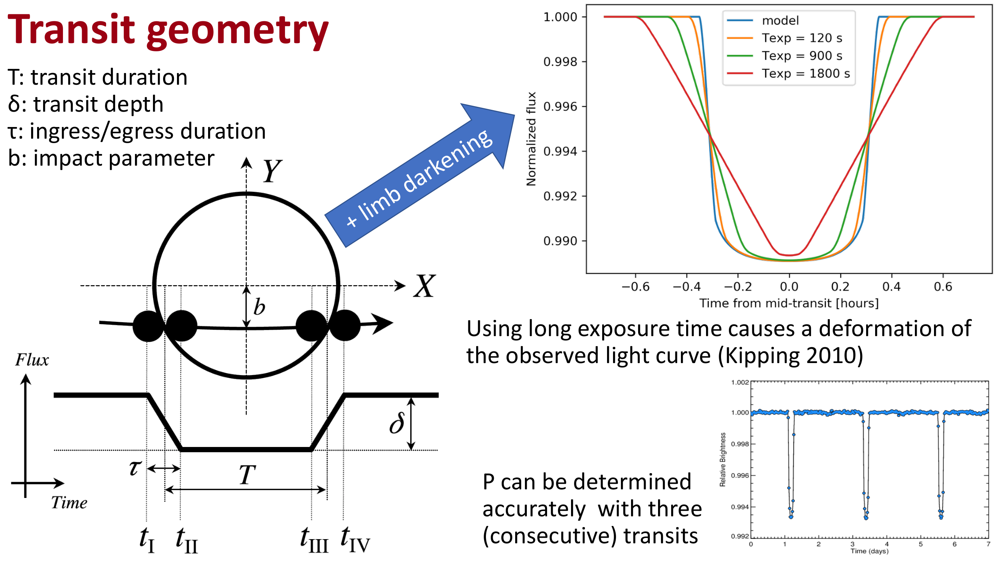


# Malavolta 09 ? TESS Light Curve Processing and Systematic Correction

*Astrophysics Laboratory 2, Prof. Luca Malavolta*  
*Index: [Astrophysics_Laboratory_2_MOC](../../../04_Atlas/Astrophysics_Laboratory_2_MOC.html)*

---

## TESS Light Curve Files (LCFs)

The Science Processing Operations Center (SPOC; Jenkins et al. 2016) pipeline generates standardized Light Curve Files (LCFs) from the Target Pixel Files.

An LCF contains two primary photometric flux columns:
1. **Simple Aperture Photometry (`SAP_FLUX`)**:
	- Direct sum of calibrated pixel intensities within the optimal aperture mask, with local background subtracted.
	- Contains all physical stellar signals alongside raw instrumental systematics (spacecraft pointing jitter, thermal breathing, momentum dumps, scattered light from Earth and Moon).
2. **Pre-search Data Conditioning SAP (`PDCSAP_FLUX`)**:
	- Systematic error correction algorithm that removes instrumental signatures while preserving astrophysical transit and occultation signals.
	- Uses Cotrending Basis Vectors (CBVs).

---

## Cotrending Basis Vectors (CBVs)

Instrumental trends in space telescopes are strongly correlated across adjacent stars located on the same CCD detector. The SPOC pipeline extracts orthogonal trend components across hundreds of quiet reference stars using Singular Value Decomposition (SVD):
$$\text{CBV}_k(t), \quad k = 1, \dots, K$$

The corrected stellar flux is modeled as:
$$F_{\text{PDC}}(t) = F_{\text{SAP}}(t) - \sum_{k=1}^K a_k \, \text{CBV}_k(t)$$
where the coefficients $a_k$ are determined via penalized maximum likelihood to prevent over-fitting astrophysical stellar variability.

---

## Spacecraft Quality Bitmask Flags

Every cadence has an associated integer bitmask (`QUALITY`) recording spacecraft and instrument status. Corrupted cadences must be filtered out prior to analysis.

Key SPOC Quality Flags:
- `Bit 1` ($2^0 = 1$): Attitude tweak (spacecraft pointing adjustment).
- `Bit 3` ($2^2 = 4$): Spacecraft safe mode.
- `Bit 4` ($2^3 = 8$): Coarse point mode.
- `Bit 5` ($2^4 = 16$): Earth or Moon crossing the field of view (severe scattered light).
- `Bit 6` ($2^5 = 32$): Reaction wheel desaturation (momentum dump).
- `Bit 8` ($2^7 = 128$): Manual exclude flag.
- `Bit 10` ($2^9 = 512$): Impulsive outlier (cosmic ray hit).

Filtering cadences in Python:
```python
import numpy as np

# Bitmask representing critical errors to exclude
critical_bits = (1 << 0) | (1 << 2) | (1 << 3) | (1 << 4) | (1 << 5) | (1 << 7) | (1 << 9)

# Boolean mask of valid cadences
valid_mask = (quality & critical_bits) == 0
valid_mask &= ~np.isnan(pdcsap_flux) & ~np.isnan(pdcsap_flux_error)

clean_time = time[valid_mask]
clean_flux = pdcsap_flux[valid_mask]
clean_err = pdcsap_flux_error[valid_mask]
```

---

## Multi-Sector Analysis and Normalization

When a star is observed across multiple TESS sectors (e.g., GJ 3470 observed in Sectors 44, 45, 46):
1. Each sector must be processed independently because changes in spacecraft roll angle and aperture mask produce distinct baseline flux levels.
2. Each sector flux is normalized by its robust out-of-transit median:
$$F_{\text{norm, sector}}(t) = \frac{F_{\text{PDC}}(t)}{\text{median}(F_{\text{PDC, out}})}$$
3. Sectors are stitched into a continuous multi-year time-series for joint planetary transit modeling.

---

## Related Notes
- [TESS SAP vs PDCSAP Flux and Cotrending Basis Vectors](../../../03_Zettel/Observations/TESS%20SAP%20vs%20PDCSAP%20Flux%20and%20Cotrending%20Basis%20Vectors.html)
- [Malavolta 08 - TESS Mission Architecture and Target Pixel Files](./Malavolta%2008%20-%20TESS%20Mission%20Architecture%20and%20Target%20Pixel%20Files.html)
- [Malavolta 10 - Light Curve Filtering and Detrending Techniques](./Malavolta%2010%20-%20Light%20Curve%20Filtering%20and%20Detrending%20Techniques.html)


## Laboratory Visuals & TESS Light Curve Processing


*Figure LAB2-01: TESS Target Pixel File (TPF) pixel grid and photometric aperture mask. Illustrates pixel-level flux extraction, background annulus selection, and crowded field contamination mitigation for 21-arcsecond TESS pixels.*


*Figure LAB2-02: Systematic noise detrending of raw TESS SAP (Simple Aperture Photometry) flux compared to PDC-SAP (Pre-search Data Conditioning SAP) flux, removing instrumental spacecraft momentum dumps and Earth thermal flares.*


<div class="backlinks-section">
  <h4 class="backlinks-title">Linked References (3)</h4>
  <ul class="backlinks-list">
    <li class="backlink-item-wrap"><a href="../../../04_Atlas/Astrophysics_Laboratory_2_MOC.html" class="backlink-item">Astrophysics_Laboratory_2_MOC</a></li>
    <li class="backlink-item-wrap"><a href="./Malavolta%2008%20-%20TESS%20Mission%20Architecture%20and%20Target%20Pixel%20Files.html" class="backlink-item">Malavolta 08 - TESS Mission Architecture and Target Pixel Files</a></li>
    <li class="backlink-item-wrap"><a href="../../../03_Zettel/Observations/TESS%20SAP%20vs%20PDCSAP%20Flux%20and%20Cotrending%20Basis%20Vectors.html" class="backlink-item">TESS SAP vs PDCSAP Flux and Cotrending Basis Vectors</a></li>
  </ul>
</div>
