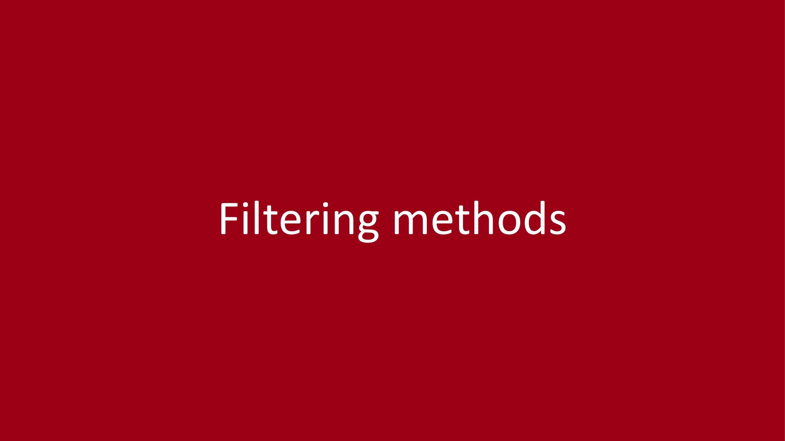
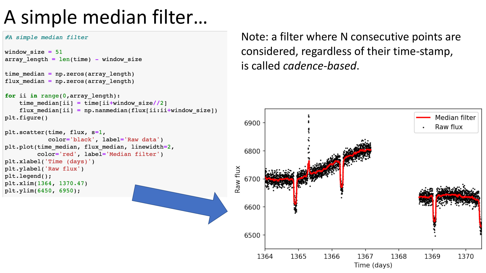

# Malavolta 10 — Light Curve Filtering and Detrending Techniques

*Astrophysics Laboratory 2, Prof. Luca Malavolta*  
*Index: [[Astrophysics_Laboratory_2_MOC]]*

---

## Astrophysical and Instrumental Time-Series Noise

Even after systematic pipeline detrending (PDCSAP), space-based light curves contain low-frequency variability:
1. **Stellar Activity**: starspots rotating in and out of view (timescale days to weeks), magnetic faculae, stellar pulsations, and flares.
2. **Residual Instrumental Drift**: long-term detector sensitivity changes and residual scattered light gradients.

In exoplanet transit characterization, the goal of filtering ("flattening") is:
$$\text{isolate the pure transit profile} \implies F_{\text{out-of-transit}}(t) = 1.000$$

---

## The Danger of Naive Filtering and Transit Distortion

Applying standard moving-window filters directly across the entire light curve introduces severe systematic biases:
- As the filter window slides across a transit dip, the lower flux inside the transit pulls the local baseline downward.
- This creates unphysical "wings" or overshoots directly before ingress and after egress.
- Crucially, it artificially **reduces the transit depth** $\delta$, leading to an underestimated planetary radius $R_p$.

$$\text{Unmasked filter over transit} \implies \delta_{\text{measured}} < \delta_{\text{true}} \implies R_{p, \text{inferred}} < R_{p, \text{true}}$$

### The Mandatory Solution: Transit Masking
Before calculating any filtering baseline, all in-transit data points must be masked:
$$\lvert t - (T_0 + n P)\rvert > \frac{T_{\text{dur}}}{2} + \Delta t_{\text{margin}}$$
The filter is fitted or interpolated across the masked window strictly using out-of-transit data.

---

## Comparison of Detrending Algorithms

### 1. Cadence-Based vs Time-Window Median Filter
- **Cadence-Based**: considers $N$ consecutive data points regardless of time gaps. Discontinuous when spacecraft data gaps occur.
- **Time-Window**: considers all data points within a physical time duration $\Delta T$ (e.g., 1.5 days). Robust across observation gaps.

### 2. Running Biweight Location Estimator
The Tukey biweight estimator is significantly more robust against stellar flares and residual cosmic rays than the simple median:
$$w(u) = (1 - u^2)^2 \quad \text{for } \lvert u\rvert \le 1, \quad w(u) = 0 \quad \text{for } \lvert u\rvert > 1$$
where $u = (x - M) / (c \cdot \text{MAD})$.

### 3. Savitzky-Golay Polynomial Filter
Fits a local low-order polynomial ($d = 2?3$) via least-squares over a sliding window. Preserves sharp peak features better than moving averages, but can oscillate near sharp edges (Runge phenomenon).

### 4. Gaussian Process (GP) Regression
Models the light curve non-parametrically using a multivariate Gaussian prior with a covariance kernel $k(t_i, t_j)$:
- **Matérn-3/2 or SHO Kernel**: models stochastic stellar granulation and instrumental drift.
- **Quasi-Periodic Kernel**: captures periodic stellar rotation modulated by spot evolution:
$$k_{\text{QP}}(\Delta t) = A \exp\left( -\frac{\Delta t^2}{2 \ell^2} - \Gamma \sin^2\left( \frac{\pi \Delta t}{P_{\text{rot}}} \right) \right)$$

---

## Evaluating Filtering Quality

A detrended light curve is evaluated by:
1. **Out-of-transit scatter**: Root-Mean-Square (RMS) and Median Absolute Deviation (MAD) of normalized residuals.
2. **Transit profile preservation**: ensuring ingress and egress slopes match theoretical physics without deformation.
3. **Autocorrelation of residuals**: verifying that high-frequency residuals behave as uncorrelated Gaussian white noise.

---

## Related Notes
- [[Running Median and Biweight Light Curve Filters]]
- [[Savitzky-Golay Filtering for Stellar Time Series]]
- [[Gaussian Process Regression in Light Curve Detrending]]
- [[Malavolta 11 - Transit Geometry and Analytical Light Curve Modeling]]

## Laboratory Visuals & Filtering Architectures

*Figure LAB2-03: Low-frequency stellar variability detrending using iterative cubic splines with sigma clipping. Shows transit preservation while removing rotational modulation induced by stellar starspots.*

*Figure LAB2-04: Gaussian Process (GP) regression modeling of correlated red noise in planetary transit photometry using the Matérn-3/2 and Quasi-Periodic covariance kernels.*

## Linked References

- [[Gaussian Process Regression in Light Curve Detrending]]
- [[Running Median and Biweight Light Curve Filters]]
- [[Savitzky-Golay Filtering for Stellar Time Series]]
- [[TESS SAP vs PDCSAP Flux and Cotrending Basis Vectors]]
- [[Astrophysics_Laboratory_2_MOC]]

