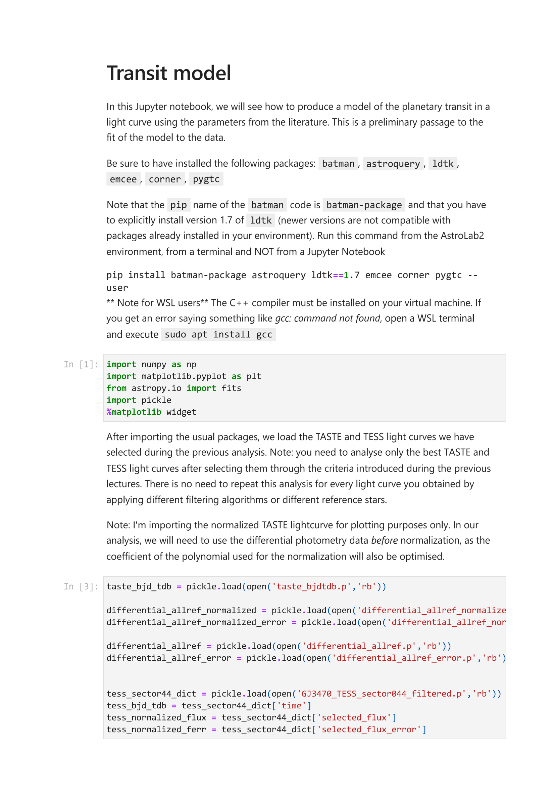
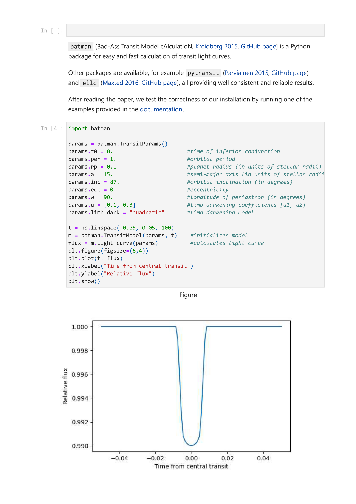
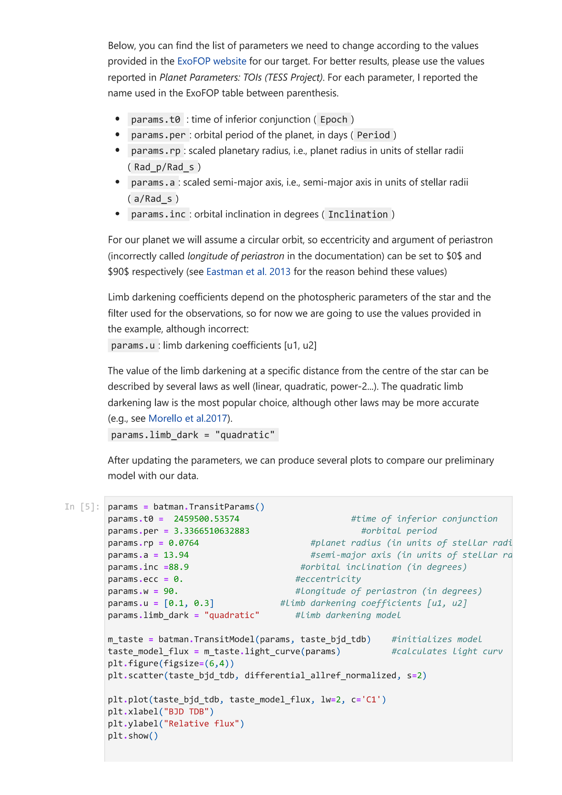


# Malavolta 11 ? Transit Geometry and Analytical Light Curve Modeling

*Astrophysics Laboratory 2, Prof. Luca Malavolta*  
*Index: [Astrophysics_Laboratory_2_MOC](../../../04_Atlas/Astrophysics_Laboratory_2_MOC.html)*

---

## Orbital Geometry and Parameter Vector

A planetary transit across a spherical stellar disk is described by the parameter vector:
$$\boldsymbol{\theta} = \{ T_0, P, r_p, a_R, i, e, \omega, u_1, u_2 \}$$
where:
- $T_0$: reference epoch of inferior conjunction ($BJD_{\text{TDB}}$).
- $P$: orbital period in days.
- $r_p = R_p / R_\star$: scaled planetary radius.
- $a_R = a / R_\star$: scaled semi-major axis.
- $i$: orbital inclination angle (degrees).
- $e$: orbital eccentricity ($e=0$ for circular orbits).
- $\omega$: argument of periastron (typically set to $90^\circ$ when $e=0$).
- $u_1, u_2$: limb darkening coefficients.

### Impact Parameter $b$
The projected sky-plane distance between the center of the planet and the center of the star at mid-transit, in units of stellar radii $R_\star$:
$$b = \frac{a}{R_\star} \cos i \left( \frac{1 - e^2}{1 + e \sin \omega} \right)$$
For circular orbits ($e=0$):
$$b = \frac{a}{R_\star} \cos i$$
- Central transit: $b = 0 \implies i = 90^\circ$.
- Grazing transit: $1 - r_p < b < 1 + r_p$.
- No transit occurs if: $b > 1 + r_p$.

---

## Transit Observables and Timescales

1. **Geometric Transit Depth $\delta$**:
$$\delta = \left( \frac{R_p}{R_\star} \right)^2 = r_p^2$$

2. **Total Transit Duration $T_{14}$ (First to Fourth Contact)**:
$$T_{14} = \frac{P}{\pi} \arcsin\left( \frac{R_\star}{a} \frac{\sqrt{(1 + r_p)^2 - b^2}}{\sin i} \right) \approx \frac{P}{\pi} \frac{R_\star}{a} \sqrt{(1 + r_p)^2 - b^2}$$

3. **Ingress and Egress Duration $T_{12} = T_{34}$ (First to Second Contact)**:
$$T_{12} \approx \frac{P}{\pi} \frac{R_\star}{a} \frac{2 r_p}{\sqrt{1 - b^2}}$$

---

## Stellar Limb Darkening

A star is not a uniformly illuminating disk; optical depth effects cause the center to appear brighter than the edge (limb).

### Quadratic Limb Darkening Law
The stellar surface brightness profile is described as a function of $\mu = \cos \theta$ (where $\theta$ is the angle between the surface normal and the line of sight):
$$\frac{I(\mu)}{I(1)} = 1 - u_1 (1 - \mu) - u_2 (1 - \mu)^2$$

### Synthetic Limb Darkening with `ldtk`
Limb darkening coefficients depend on the stellar atmospheric parameters ($T_{\text{eff}}, \log g, [\text{Fe}/\text{H}]$) and the photometric filter transmission function. The Python Limb Darkening Toolkit (`ldtk`; Parviainen & Aigrain 2015) evaluates synthetic coefficients using PHOENIX model atmospheres (Husser et al. 2013):

```python
from ldtk import SVOFilter, LDPSetCreator
import numpy as np

# Load transmission profiles from SVO Filter Profile Service
sloan_r = SVOFilter('SLOAN/SDSS.r')
tess_filter = SVOFilter('TESS')

# Create profile creator for host star
sc = LDPSetCreator(
    teff=(3652, 100),    # Teff in K with 1-sigma uncertainty
    logg=(4.80, 0.10),   # log g (cgs)
    z=(0.20, 0.10),      # Metallicity [Fe/H]
    filters=[sloan_r, tess_filter]
)

ps = sc.create_profiles(nsamples=2000)
ps.resample_linear_z(100)
qm, qe = ps.coeffs_qd(do_mc=True, n_mc_samples=10000)
```

---

## Analytical Modeling with `batman`

The `batman` package (Kreidberg 2015) computes analytical transit light curves following Mandel & Agol (2002):

```python
import batman
import numpy as np

params = batman.TransitParams()
params.t0 = 2459500.53574          # Mid-transit epoch (BJD_TDB)
params.per = 3.33665               # Orbital period (days)
params.rp = 0.0764                 # Planet radius (in stellar radii)
params.a = 13.94                   # Semi-major axis (in stellar radii)
params.inc = 88.9                  # Inclination (degrees)
params.ecc = 0.0                   # Eccentricity
params.w = 90.0                    # Argument of periastron (degrees)
params.u = [0.35, 0.23]            # Quadratic LD coefficients [u1, u2]
params.limb_dark = "quadratic"

# Initialize model on time stamps
m = batman.TransitModel(params, time_array)
flux_model = m.light_curve(params)
```

### Exposure Time Smearing (Kipping 2010)
Finite exposure integration causes transit light curves to flatten near ingress and egress. In `batman`, exposure smearing is numerically integrated using Gaussian quadrature:
```python
m = batman.TransitModel(params, time_array, supersample_factor=7, exp_time=120.0/86400.0)
```

---

## Related Notes
- [Exoplanet Transit Geometry and Impact Parameter](../../../03_Zettel/Theory/Exoplanet%20Transit%20Geometry%20and%20Impact%20Parameter.html)
- [Transit Depth and Ingress-Egress Timescales](../../../03_Zettel/Theory/Transit%20Depth%20and%20Ingress-Egress%20Timescales.html)
- [Stellar Limb Darkening Laws](../../../03_Zettel/Theory/Stellar%20Limb%20Darkening%20Laws.html)
- [Exposure Time Smearing in Transit Photometry](../../../03_Zettel/Theory/Exposure%20Time%20Smearing%20in%20Transit%20Photometry.html)
- [Transit Modeling with batman](../../../03_Zettel/Computational/Transit%20Modeling%20with%20batman.html)
- [Limb Darkening Computation with ldtk](../../../03_Zettel/Computational/Limb%20Darkening%20Computation%20with%20ldtk.html)


## Laboratory Visuals & Mandel-Agol Transit Modeling


*Figure LAB2-05: Exoplanetary Transit Geometry. Projection of the orbital plane with inclination $i$, semi-major axis $a$, stellar radius $R_*$, and impact parameter $b = \frac{a \cos i}{R_*} \frac{1 - e^2}{1 + e \sin \omega}$. Defines contact points $t_1$ (first contact), $t_2$ (second contact/ingress complete), $t_3$ (third contact/egress begins), and $t_4$ (fourth contact).*


*Figure LAB2-06: Quadratic stellar limb darkening $I(\mu) / I(0) = 1 - u_1(1-\mu) - u_2(1-\mu)^2$ where $\mu = \cos \theta$, and its physical impact on the rounded transit light curve bottom.*


*Figure LAB2-07: Analytic transit flux model evaluated via the Mandel & Agol (2002) formulation utilizing complete elliptic integrals of the first, second, and third kind.*


<div class="backlinks-section">
  <h4 class="backlinks-title">Linked References (11)</h4>
  <ul class="backlinks-list">
    <li class="backlink-item-wrap"><a href="../../../04_Atlas/Astrophysics_Laboratory_2_MOC.html" class="backlink-item">Astrophysics_Laboratory_2_MOC</a></li>
    <li class="backlink-item-wrap"><a href="../../../03_Zettel/Computational/Barycentric%20Julian%20Date%20and%20Time%20System%20Conversions.html" class="backlink-item">Barycentric Julian Date and Time System Conversions</a></li>
    <li class="backlink-item-wrap"><a href="../../../03_Zettel/Theory/Exoplanet%20Transit%20Geometry%20and%20Impact%20Parameter.html" class="backlink-item">Exoplanet Transit Geometry and Impact Parameter</a></li>
    <li class="backlink-item-wrap"><a href="../../../03_Zettel/Theory/Exposure%20Time%20Smearing%20in%20Transit%20Photometry.html" class="backlink-item">Exposure Time Smearing in Transit Photometry</a></li>
    <li class="backlink-item-wrap"><a href="../../../03_Zettel/Computational/Limb%20Darkening%20Computation%20with%20ldtk.html" class="backlink-item">Limb Darkening Computation with ldtk</a></li>
    <li class="backlink-item-wrap"><a href="./Malavolta%2007%20-%20Differential%20Photometry%20and%20Atmospheric%20Detrending.html" class="backlink-item">Malavolta 07 - Differential Photometry and Atmospheric Detrending</a></li>
    <li class="backlink-item-wrap"><a href="./Malavolta%2010%20-%20Light%20Curve%20Filtering%20and%20Detrending%20Techniques.html" class="backlink-item">Malavolta 10 - Light Curve Filtering and Detrending Techniques</a></li>
    <li class="backlink-item-wrap"><a href="./Piotto%2001%20-%20Exoplanet%20Detection%20and%20Demographics.html" class="backlink-item">Piotto 01 - Exoplanet Detection and Demographics</a></li>
    <li class="backlink-item-wrap"><a href="../../../03_Zettel/Theory/Stellar%20Limb%20Darkening%20Laws.html" class="backlink-item">Stellar Limb Darkening Laws</a></li>
    <li class="backlink-item-wrap"><a href="../../../03_Zettel/Theory/Transit%20Depth%20and%20Ingress-Egress%20Timescales.html" class="backlink-item">Transit Depth and Ingress-Egress Timescales</a></li>
    <li class="backlink-item-wrap"><a href="../../../03_Zettel/Computational/Transit%20Modeling%20with%20batman.html" class="backlink-item">Transit Modeling with batman</a></li>
  </ul>
</div>
