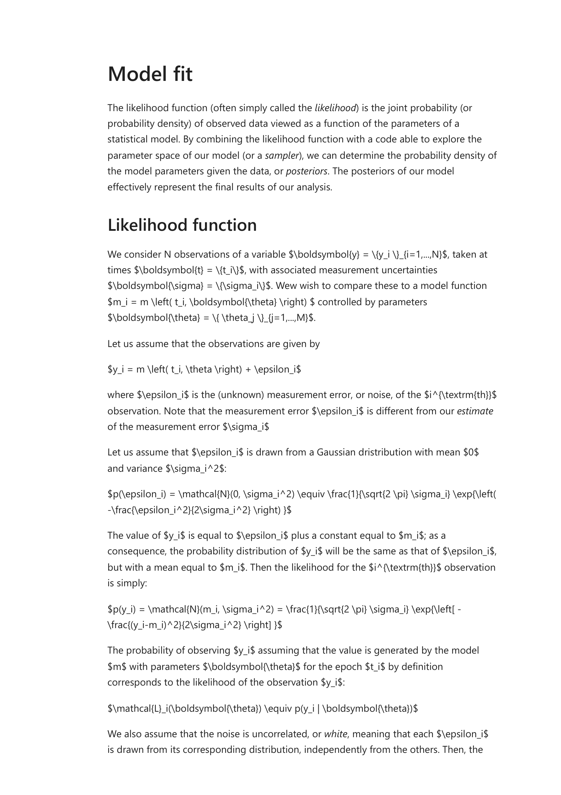
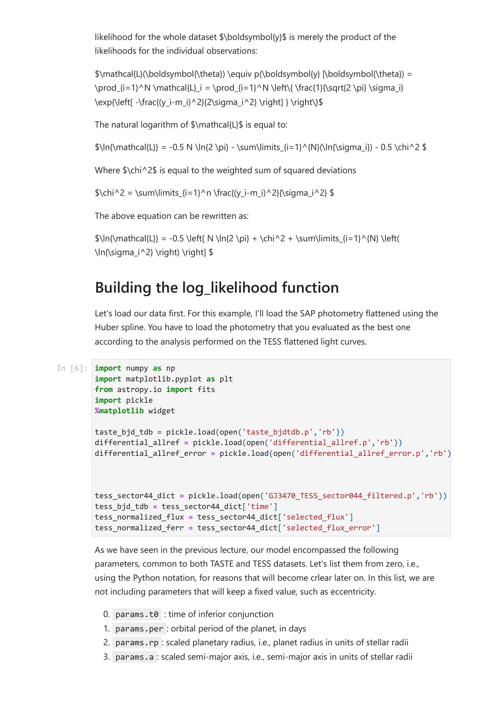


# Malavolta 12 ? Transit Parameter Estimation and Likelihood Optimization

*Astrophysics Laboratory 2, Prof. Luca Malavolta*  
*Index: [Astrophysics_Laboratory_2_MOC](../../../04_Atlas/Astrophysics_Laboratory_2_MOC.html)*

---

## The Statistical Likelihood Function

The likelihood function $\mathcal{L}(\boldsymbol{\theta} \mid \boldsymbol{D})$ represents the joint probability of observing dataset $\boldsymbol{D} = \{ y_i, t_i, \sigma_i \}_{i=1}^N$ given a physical model $m(t_i, \boldsymbol{\theta})$.

Assuming independent, Gaussian-distributed observational errors:
$$\mathcal{L}(\boldsymbol{\theta} \mid \boldsymbol{D}) = \prod_{i=1}^N \frac{1}{\sqrt{2\pi \sigma_i^2}} \exp\left( -\frac{[y_i - m(t_i, \boldsymbol{\theta})]^2}{2 \sigma_i^2} \right)$$

The natural logarithm of the likelihood is:
$$\ln \mathcal{L}(\boldsymbol{\theta}) = -\frac{1}{2} \sum_{i=1}^N \left[ \left( \frac{y_i - m(t_i, \boldsymbol{\theta})}{\sigma_i} \right)^2 + \ln(2\pi \sigma_i^2) \right]$$
Defining the chi-squared statistic:
$$\chi^2(\boldsymbol{\theta}) = \sum_{i=1}^N \left( \frac{y_i - m(t_i, \boldsymbol{\theta})}{\sigma_i} \right)^2$$
Maximizing the log-likelihood is mathematically equivalent to minimizing $\chi^2$ when observational errors $\sigma_i$ are fixed constants:
$$\ln \mathcal{L}(\boldsymbol{\theta}) = -\frac{1}{2} \chi^2(\boldsymbol{\theta}) + \text{constant}$$

---

## Photometric Jitter and Variance Underestimation

Photometric pipelines frequently underestimate true uncertainties due to residual correlated noise (red noise) and instrumental micro-systematics. To prevent over-fitting, a **photometric jitter** parameter $s$ (or fractional variance $\ln f$) is introduced:

$$s_i^2 = \sigma_i^2 + \sigma_{\text{jitter}}^2 \quad \text{or} \quad s_i^2 = \sigma_i^2 + f^2 \, m(t_i, \boldsymbol{\theta})^2$$

The log-likelihood becomes:
$$\ln \mathcal{L}(\boldsymbol{\theta}, \sigma_{\text{jitter}}) = -\frac{1}{2} \sum_{i=1}^N \left[ \frac{[y_i - m(t_i, \boldsymbol{\theta})]^2}{\sigma_i^2 + \sigma_{\text{jitter}}^2} + \ln\left( 2\pi (\sigma_i^2 + \sigma_{\text{jitter}}^2) \right) \right]$$
Here, the second logarithmic penalty term prevents the sampler from arbitrarily inflating $\sigma_{\text{jitter}}$ to infinity.

---

## Joint Likelihood: Combining TASTE and TESS Observations

A core strength of the laboratory project is combining ground-based observations with space-based observations. Because datasets are statistically independent, the joint log-likelihood is additive:

$$\ln \mathcal{L}_{\text{total}}(\boldsymbol{\theta}) = \ln \mathcal{L}_{\text{TASTE}}(\boldsymbol{\theta}_{\text{shared}}, \boldsymbol{\theta}_{\text{TASTE}}) + \ln \mathcal{L}_{\text{TESS}}(\boldsymbol{\theta}_{\text{shared}}, \boldsymbol{\theta}_{\text{TESS}})$$

### Parameter Classification
1. **Shared Physical Parameters**:
	- Planet radius ratio $r_p = R_p / R_\star$
	- Scaled semi-major axis $a_R = a / R_\star$
	- Orbital inclination $i$
	- Orbital period $P$
2. **Instrument-Specific Parameters**:
	- Transit central epoch $T_{0, \text{TASTE}}$ and $T_{0, \text{TESS}}$ (to measure Transit Timing Variations)
	- Quadratic limb darkening coefficients: $(u_{1, r}, u_{2, r})$ for Sloan $r'$, $(u_{1, \text{TESS}}, u_{2, \text{TESS}})$ for TESS
	- Baseline polynomial detrending coefficients: $(c_0, c_1, c_2)$ for TASTE
	- Jitter parameters: $\sigma_{\text{jitter, TASTE}}$ and $\sigma_{\text{jitter, TESS}}$

---

## Building the Log-Likelihood Function in Python

```python
import numpy as np
import batman

def log_likelihood(theta, time_taste, flux_taste, err_taste,
                          time_tess, flux_tess, err_tess):
    # Unpack parameters
    rp, a, inc, t0_taste, t0_tess, u1_t, u2_t, u1_s, u2_s, c0, c1, c2, jit_taste, jit_tess = theta

    # Physical boundaries
    if not (0.0 < rp < 0.5 and 1.0 < a < 50.0 and 70.0 < inc <= 90.0):
        return -np.inf

    # 1. Evaluate TASTE model
    m_taste = compute_batman(time_taste, t0_taste, rp, a, inc, [u1_t, u2_t])
    baseline_taste = c0 + c1 * time_taste + c2 * time_taste**2
    model_taste = m_taste * baseline_taste

    s2_taste = err_taste**2 + jit_taste**2
    ln_l_taste = -0.5 * np.sum(((flux_taste - model_taste)**2 / s2_taste) + np.log(2 * np.pi * s2_taste))

    # 2. Evaluate TESS model
    model_tess = compute_batman(time_tess, t0_tess, rp, a, inc, [u1_s, u2_s])
    s2_tess = err_tess**2 + jit_tess**2
    ln_l_tess = -0.5 * np.sum(((flux_tess - model_tess)**2 / s2_tess) + np.log(2 * np.pi * s2_tess))

    return ln_l_taste + ln_l_tess
```

---

## Related Notes
- [Likelihood Function for Photometric Time Series](../../../03_Zettel/Theory/Likelihood%20Function%20for%20Photometric%20Time%20Series.html)
- [Prior Probability Distributions in Exoplanet Fitting](../../../03_Zettel/Theory/Prior%20Probability%20Distributions%20in%20Exoplanet%20Fitting.html)
- [Malavolta 13 - Bayesian Statistics and Markov Chain Monte Carlo Sampling](./Malavolta%2013%20-%20Bayesian%20Statistics%20and%20Markov%20Chain%20Monte%20Carlo%20Sampling.html)
- [Laboratory Exercise - Joint Transit Modeling and MCMC Analysis](../../../03_Zettel/Activities/Laboratory%20Exercise%20-%20Joint%20Transit%20Modeling%20and%20MCMC%20Analysis.html)


## Laboratory Visuals & Optimization Landscapes


*Figure LAB2-08: Least-squares and maximum likelihood parameter estimation surface $\chi^2(R_p/R_*, a/R_*)$. Illustrates local minima pitfalls and initial parameter estimation from analytical transit observables.*


*Figure LAB2-09: Best-fit transit model overlay and photometric residuals. Autocorrelation and Durbin-Watson statistics are computed to confirm the absence of residual correlated systematic noise.*


<div class="backlinks-section">
  <h4 class="backlinks-title">Linked References (2)</h4>
  <ul class="backlinks-list">
    <li class="backlink-item-wrap"><a href="../../../04_Atlas/Astrophysics_Laboratory_2_MOC.html" class="backlink-item">Astrophysics_Laboratory_2_MOC</a></li>
    <li class="backlink-item-wrap"><a href="../../../03_Zettel/Theory/Likelihood%20Function%20for%20Photometric%20Time%20Series.html" class="backlink-item">Likelihood Function for Photometric Time Series</a></li>
  </ul>
</div>
