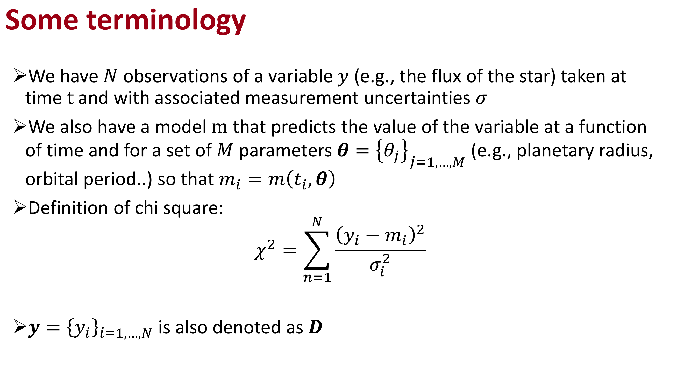
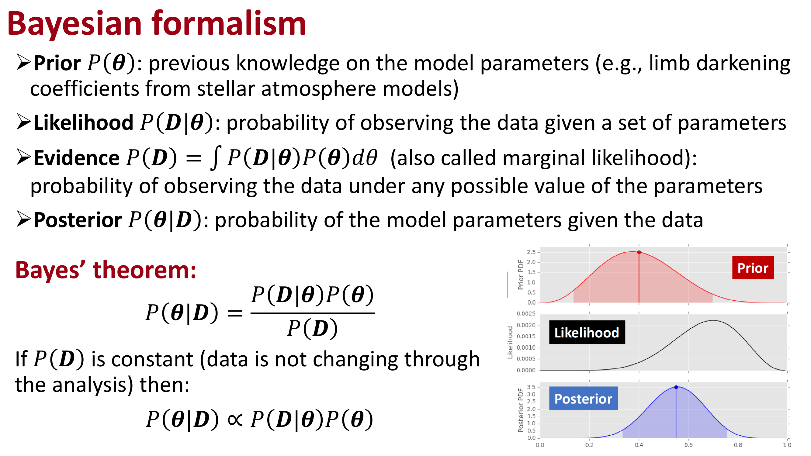
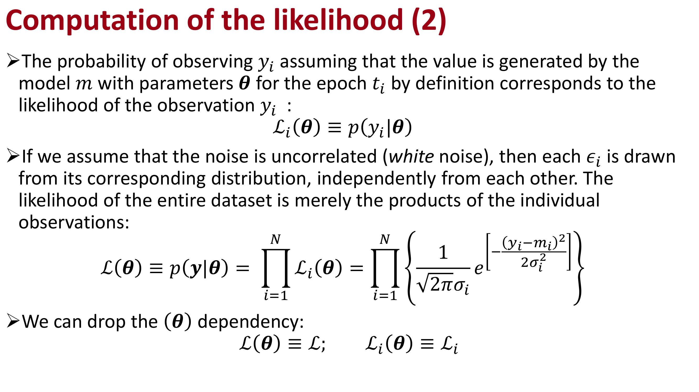

# Malavolta 13 — Bayesian Statistics and Markov Chain Monte Carlo Sampling

*Astrophysics Laboratory 2, Prof. Luca Malavolta*  
*Index: [Astrophysics_Laboratory_2_MOC](../../../04_Atlas/Astrophysics_Laboratory_2_MOC.html)*

---

## Frequentist vs Bayesian Inference

In observational astrophysics, physical parameters are inferred from noisy, incomplete data:

- **Frequentist Approach**:
	- Parameters $\boldsymbol{\theta}$ are fixed constants of nature.
	- Data $\boldsymbol{D}$ are random variables drawn from repeated hypothetical experiments.
	- Solves for maximum likelihood estimator $\hat{\boldsymbol{\theta}}$ via $\chi^2$ minimization.
	- Limitations: assumes asymptotic Gaussianity; fails to incorporate external physical priors; cannot properly explore non-linear parameter degeneracies (e.g., $a/R_\star$ vs $\cos i$).

- **Bayesian Approach**:
	- The observed data $\boldsymbol{D}$ are fixed observations.
	- Parameters $\boldsymbol{\theta}$ are random variables described by probability density functions.
	- Directly yields the **posterior probability distribution** $p(\boldsymbol{\theta} \mid \boldsymbol{D})$:

$$p(\boldsymbol{\theta} \mid \boldsymbol{D}) = \frac{\mathcal{L}(\boldsymbol{D} \mid \boldsymbol{\theta}) \, \pi(\boldsymbol{\theta})}{\mathcal{Z}}$$
where:
- $\mathcal{L}(\boldsymbol{D} \mid \boldsymbol{\theta})$ is the likelihood function.
- $\pi(\boldsymbol{\theta})$ is the prior probability distribution.
- $\mathcal{Z} = \int \mathcal{L}(\boldsymbol{D} \mid \boldsymbol{\theta}) \, \pi(\boldsymbol{\theta}) \, d\boldsymbol{\theta}$ is the marginal likelihood (Bayesian evidence), acting as a normalization constant.

In log-space:
$$\ln p(\boldsymbol{\theta} \mid \boldsymbol{D}) = \ln \mathcal{L}(\boldsymbol{D} \mid \boldsymbol{\theta}) + \ln \pi(\boldsymbol{\theta}) + \text{const}$$

---

## Formulation of Prior Probability Distributions

Priors encapsulate physical constraints and information from external observations (e.g., stellar spectroscopy, Gaia astrometry):

1. **Uniform Prior (Bounded Flat)**:
$$\pi(\theta) = \frac{1}{\theta_{\text{max}} - \theta_{\text{min}}} \quad \text{for } \theta \in [\theta_{\text{min}}, \theta_{\text{max}}]$$
Applied when no preference exists within a physical domain (e.g., $r_p \in [0, 0.2]$, $i \in [70^\circ, 90^\circ]$).

2. **Gaussian Informative Prior**:
$$\ln \pi(\theta) = -\frac{1}{2} \left( \frac{\theta - \mu}{\sigma} \right)^2$$
Applied when high-resolution spectroscopy or synthetic stellar models provide prior estimates (e.g., limb darkening coefficients $u_1, u_2$ from `ldtk`).

```python
def log_prior(theta):
    rp, a, inc, u1_t, u2_t = theta[:5]
    if not (0.0 < rp < 0.3 and 1.0 < a < 40.0 and 70.0 < inc <= 90.0):
        return -np.inf
    # Gaussian prior on limb darkening from ldtk
    ln_prior_ld = -0.5 * (((u1_t - 0.35) / 0.03)**2 + ((u2_t - 0.23) / 0.08)**2)
    return ln_prior_ld
```

---

## The Affine-Invariant Ensemble Sampler (`emcee`)

Standard Metropolis-Hastings algorithms struggle when parameters are highly correlated, requiring fine-tuning of proposal covariances. The Goodman & Weare (2010) affine-invariant ensemble sampler (`emcee`; Foreman-Mackey et al. 2013) resolves this:
- Deploys an ensemble of $K$ "walkers" ($K \ge 2 \times N_{\text{parameters}}$).
- **Stretch Move**: walker $k$ updates its position along the vector pointing toward another randomly chosen walker $j$:
$$\boldsymbol{\theta}_k' = \boldsymbol{\theta}_j + Z \, (\boldsymbol{\theta}_k - \boldsymbol{\theta}_j)$$
where $Z$ is a random variable sampled from $g(z) \propto 1/\sqrt{z}$.
- Invariant under affine coordinate transformations: performs equally well on isotropic and highly elongated, degenerate parameter spaces.

```python
import emcee

# Initialize walkers in a small Gaussian ball around maximum likelihood guess
nwalkers = 32
ndim = len(initial_guess)
pos = initial_guess + 1e-4 * np.random.randn(nwalkers, ndim)

sampler = emcee.EnsembleSampler(nwalkers, ndim, log_probability, args=(data_args,))
sampler.run_mcmc(pos, 5000, progress=True)
```

---

## Convergence Diagnostics

A Markov chain must reach its stationary equilibrium distribution before samples can be treated as representative of the posterior:

### 1. Integrated Autocorrelation Time $\tau$
Estimates the number of steps required for the chain to produce an independent sample:
$$\tau = 1 + 2 \sum_{t=1}^\infty \rho(t)$$
- **Convergence Criterion**: total steps $N_{\text{steps}} > 50 \, \tau$.
- **Burn-In Discard**: initial non-equilibrium steps ($N_{\text{burn}} \sim 2?3 \times \tau$) are stripped before computing posteriors.

```python
tau = sampler.get_autocorr_time()
burn_in = int(2 * np.max(tau))
flat_samples = sampler.get_chain(discard=burn_in, thin=int(np.max(tau)/2), flat=True)
```

---

## Posterior Parameter Extraction and Corner Plots

The flattened, post-burn-in Markov chains represent the multidimensional posterior probability density:
- **Best-Fit Parameter**: 50th percentile (median).
- **Uncertainties**: 16th and 84th percentiles ($1\sigma$ credible interval):
$$\theta = \text{median}_{-\sigma_+}^{+\sigma_-} = \theta_{50} {}_{-\left(\theta_{50} - \theta_{16}\right)}^{+\left(\theta_{84} - \theta_{50}\right)}$$

Corner plots (`corner.py` or `pygtc`) project the joint posterior distribution into 1D histograms and 2D correlation contours:
```python
import corner

labels = [r"$R_p/R_\star$", r"$a/R_\star$", r"$i$ [deg]"]
fig = corner.corner(flat_samples[:, :3], labels=labels, quantiles=[0.16, 0.5, 0.84], show_titles=True)
```

---

## Related Notes
- [Bayesian Inference and Bayes Theorem in Astronomy](../../../03_Zettel/Theory/Bayesian%20Inference%20and%20Bayes%20Theorem%20in%20Astronomy.html)
- [Metropolis-Hastings Algorithm](../../../03_Zettel/Theory/Metropolis-Hastings%20Algorithm.html)
- [Goodman-Weare Affine Invariant Ensemble Sampler](../../../03_Zettel/Theory/Goodman-Weare%20Affine%20Invariant%20Ensemble%20Sampler.html)
- [Affine-Invariant Ensemble MCMC with emcee](../../../03_Zettel/Computational/Affine-Invariant%20Ensemble%20MCMC%20with%20emcee.html)
- [MCMC Convergence Diagnostics and Autocorrelation Analysis](../../../03_Zettel/Computational/MCMC%20Convergence%20Diagnostics%20and%20Autocorrelation%20Analysis.html)
- [Marginalized Posterior Distributions and Corner Plots](../../../03_Zettel/Computational/Marginalized%20Posterior%20Distributions%20and%20Corner%20Plots.html)


## Laboratory Visuals & MCMC Posterior Exploration


*Figure LAB2-10: Ensemble MCMC walker traces for physical transit parameters $(T_0, P, R_p/R_*, a/R_*, i, u_1, u_2)$ generated by the affine-invariant `emcee` sampler, showing rapid mixing post-burn-in.*


*Figure LAB2-11: 1D and 2D marginalized posterior parameter probability distributions (Corner Plot). Highlights characteristic physical degeneracies between transit impact parameter $b$ and scaled semi-major axis $a/R_*$.*


*Figure LAB2-12: Final median parameter estimates and $68.3\%$ credible intervals with full posterior predictive transit model uncertainty envelopes overlaid on empirical TASTE ground-based observations.*

<div class="backlinks-section">
  <h4 class="backlinks-title">Linked References (5)</h4>
  <ul class="backlinks-list">
    <li class="backlink-item-wrap"><a href="../../../03_Zettel/Theory/Bayesian%20Inference%20and%20Bayes%20Theorem%20in%20Astronomy.html" class="backlink-item">Bayesian Inference and Bayes Theorem in Astronomy</a></li>
    <li class="backlink-item-wrap"><a href="../../../03_Zettel/Theory/Goodman-Weare%20Affine%20Invariant%20Ensemble%20Sampler.html" class="backlink-item">Goodman-Weare Affine Invariant Ensemble Sampler</a></li>
    <li class="backlink-item-wrap"><a href="../../../03_Zettel/Theory/Metropolis-Hastings%20Algorithm.html" class="backlink-item">Metropolis-Hastings Algorithm</a></li>
    <li class="backlink-item-wrap"><a href="../../../03_Zettel/Theory/Prior%20Probability%20Distributions%20in%20Exoplanet%20Fitting.html" class="backlink-item">Prior Probability Distributions in Exoplanet Fitting</a></li>
    <li class="backlink-item-wrap"><a href="../../../04_Atlas/Astrophysics_Laboratory_2_MOC.html" class="backlink-item">Astrophysics_Laboratory_2_MOC</a></li>
  </ul>
</div>

