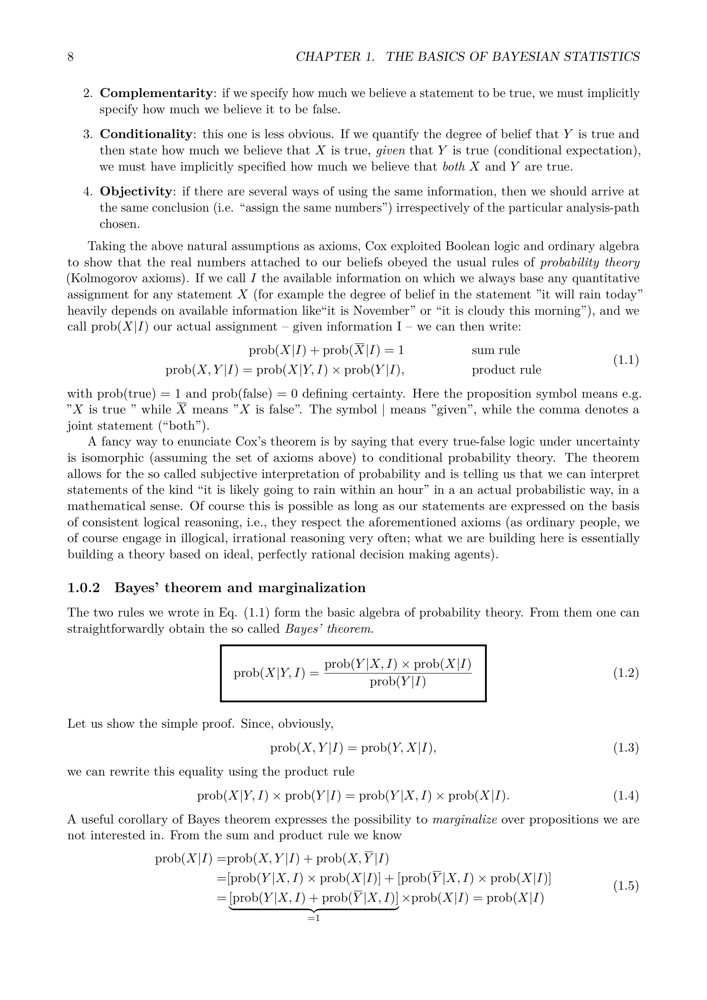

# Plausible Reasoning, Cox Theorem, and Bayesian Foundations

Graduate lecture notes in Astro-Statistics and Cosmology, taught by Prof. Michele Liguori at the University of Padua.
Reference index [[Astro-Statistics_and_Cosmology_MOC]]

---

## The Problem of Inference in Physical Sciences

Physical sciences operate by confronting theoretical hypotheses with empirical observations. In astronomical and cosmological contexts, this confrontation exhibits distinct structural challenges. Unlike laboratory physics, where experiments can be repeated under identical controlled settings, observational cosmology deals with a single unique realization of the observable universe. We cannot re-run the Big Bang to observe the distribution of alternative outcomes. Every observation arrives burdened with instrumental noise, cosmic variance, selection effects, and incomplete sky coverage.

The central problem is inverse inference. Given an observed dataset $D$ (such as temperature anisotropies in the cosmic microwave background or spatial coordinates of galaxies in a redshift survey), what mathematical framework allows us to make quantitative, consistent, and truth-tracking statements regarding underlying physical parameters $\theta$ or cosmological models $M$?

---

## Aristotelian Deductive Logic and Its Boundaries

Classical formal logic, structured from Aristotle through Boole, operates entirely within the binary realm of certainty. Let $A$ and $B$ denote classical propositions that evaluate either strictly to True (1) or strictly to False (0).

Deductive logic provides two foundational rules of inference.

First, the rule of modus ponens establishes that if $A \implies B$ is true, and proposition $A$ is true, then proposition $B$ is necessarily true.

Second, the rule of modus tollens establishes that if $A \implies B$ is true, and proposition $B$ is false, then proposition $A$ is necessarily false.

While modus tollens forms the philosophical backbone of Popperian falsificationism, scientific practice rarely confronts problems of binary deduction. In real data analysis, we face statements of plausible inference. If proposition $A$ implies proposition $B$, and we observe that $B$ is true, classical deductive logic gives no verdict on the validity of $A$. Yet, in ordinary human and scientific reasoning, observing $B$ renders $A$ more plausible than it was before the observation.

Similarly, if $A$ implies $B$, and we observe that $A$ is false, deductive logic says nothing about $B$. Yet our intuition recognizes that the plausibility of $B$ may be weakened if $A$ was its sole viable explanation.

The objective of plausible reasoning is to construct an extension of classical binary logic that operates on degrees of plausibility, mapping real-valued continuous quantities to statements under conditions of incomplete information.

---

## The Desiderata of Richard T. Cox (1946)

Richard T. Cox set out to determine whether any system of plausible reasoning that satisfies basic requirements of common sense must necessarily be isomorphic to classical mathematical probability theory.

Cox formulated three foundational qualitative desiderata (or axioms of consistency).

### Desideratum 1. Representation of Plausibility by Real Numbers

The degree of plausibility associated with a proposition must be represented by a single real number. If proposition $A$ is more plausible than proposition $B$ given background information $I$, then their real-valued assignments must satisfy

$$p(A \mid I) > p(B \mid I)$$

This implies that plausibility assignments possess a complete transitive ordering. If $p(A \mid I) > p(B \mid I)$ and $p(B \mid I) > p(C \mid I)$, then $p(A \mid I) > p(C \mid I)$.

### Desideratum 2. Qualitative Correspondence with Common Sense

As the evidence supporting the truth of a proposition increases, the numerical plausibility assigned to that proposition must increase continuously and monotonically. Furthermore, in the limiting case where a proposition becomes definitively true or false, the algebra of plausibilities must reduce smoothly to classical Boolean deductive logic.

### Desideratum 3. Structural and Internal Consistency

Internal consistency demands that if a conclusion can be arrived at through multiple valid reasoning pathways, every pathway must yield the exact same numerical plausibility assignment. Plausibility cannot depend on the arbitrary order in which equivalent pieces of background information or data are introduced.

Furthermore, equivalent states of knowledge must be represented by identical numerical values. Inferences must never depend on arbitrary label permutations or psychological biases of the investigator.

---

## Mathematical Derivation of the Product and Sum Rules

From these minimal desiderata, Cox demonstrated that the algebraic rules governing plausible reasoning are uniquely fixed up to an arbitrary monotonic rescaling.

### The Product Rule

Consider the joint proposition $AB$, representing the assertion that both proposition $A$ and proposition $B$ are true simultaneously, conditional on background knowledge $I$.

To determine the plausibility of $AB\midI$, we can decompose the evaluation into two consecutive steps. First, evaluate how plausible proposition $B$ is given $I$. Second, knowing that $B$ is true, evaluate how plausible proposition $A$ is given both $B$ and $I$.

By Desideratum 1 and 2, there must exist some continuous function $F(u, v)$ such that

$$p(AB \mid I) = F\left( p(B \mid I), p(A \mid BI) \right)$$

Now consider the joint plausibility of three propositions $A$, $B$, and $C$. By the associativity of Boolean conjunction, $(AB)C = A(BC)$.

Evaluating the joint plausibility $((AB)C)|I$ using the function $F$ yields

$$p((AB)C\midI) = F\left( p(C \mid I), p(AB \mid CI) \right) = F\left( p(C \mid I), F\left( p(B \mid CI), p(A \mid BCI) \right) \right)$$

Evaluating the equivalent grouping $(A(BC))|I$ yields

$$p(A(BC)|I) = F\left( p(BC \mid I), p(A \mid BCI) \right) = F\left( F(p(C \mid I), p(B \mid CI)), p(A \mid BCI) \right)$$

Letting $u = p(C \mid I)$, $v = p(B \mid CI)$, and $w = p(A \mid BCI)$, associativity demands that for all valid inputs, the function $F$ must satisfy the fundamental functional equation

$$F(u, F(v, w)) = F(F(u, v), w)$$

This functional equation is known as the associativity equation. Its general continuous, strictly monotonic solution was derived by Abel and Aczel. The unique solution establishes that there exists a continuous strictly monotonic function $w(x)$ such that

$$w(F(u, v)) = w(u) \, w(v)$$

Since the numerical scale of plausibilities is arbitrary up to a monotonic transformation, we can without loss of generality choose the representation where $w(x) = x$. Under this natural gauge choice, the product rule becomes

$$p(AB \mid I) = p(A \mid BI) \, p(B \mid I) = p(B \mid AI) \, p(A \mid I)$$

This is the standard product rule of probability theory.

### The Sum Rule

Next, consider the negation of a proposition, denoted $\bar{A}$, which asserts that $A$ is false.

The plausibility of the negation $\bar{A}\midI$ must depend purely on the plausibility of the assertion $A\midI$. Therefore, there must exist a continuous, monotonically decreasing function $S(x)$ such that

$$p(\bar{A} \mid I) = S(p(A \mid I))$$

Since the double negation of a proposition returns the original proposition, $\bar{\bar{A}} = A$, applying the function $S$ twice must yield the identity

$$S(S(x)) = x$$

By considering propositions constructed from disjunctions and conjunctions, and imposing consistency between the product rule and negation, Cox proved that the function $S(x)$ must satisfy

$$S(x) = (1 - x^m)^{1/m}$$

for some non-zero real constant $m$.

By redefining probabilities through the monotonic transformation $p'(A\midI) = [p(A \mid I)]^m$, we set $m = 1$ without altering the ordering of plausibilities. This leads directly to the standard normalization and sum rule

$$p(A \mid I) + p(\bar{A} \mid I) = 1$$

where certainty is represented by $p = 1$ and impossibility by $p = 0$.

For two mutually exclusive propositions $A$ and $B$ (meaning $p(AB \mid I) = 0$), the generalized sum rule yields

$$p(A + B \mid I) = p(A \mid I) + p(B \mid I)$$

where $A + B$ denotes the logical disjunction ($A$ or $B$).

### Significance of Cox's Theorem

Cox's theorem provides an epistemological justification for Bayesian probability. Probability is not merely the asymptotic limiting frequency of outcomes in an imaginary ensemble of infinite repetitions. Probability is the unique, mathematically consistent extension of Boolean deductive logic to situations involving incomplete information. Any quantitative system for reasoning under uncertainty that violates the rules of probability calculus will inevitably exhibit internal contradictions or fall victim to Dutch book betting paradoxes.

---

## Bayes' Theorem and Its Structural Anatomy

From the symmetry of the product rule for propositions $A$ and $B$

$$p(A, B \mid I) = p(A \mid B, I) \, p(B \mid I) = p(B \mid A, I) \, p(A \mid I)$$

Equating both sides and dividing by $p(B \mid I)$, provided $p(B \mid I) \neq 0$, yields Bayes' theorem

$$p(A \mid B, I) = \frac{p(B \mid A, I) \, p(A \mid I)}{p(B \mid I)}$$

In observational astrophysics and cosmology, let $A$ represent the physical hypothesis or parameter vector $\theta$, and let $B$ represent the observed dataset $D$ obtained from a telescope or detector, conditioned on theoretical framework $M$

$$p(\theta \mid D, M) = \frac{p(D \mid \theta, M) \, p(\theta \mid M)}{p(D \mid M)}$$

Every component of this equation carries a distinct physical meaning.

### The Prior Distribution $p(\theta \mid M)$

The prior probability density, often denoted $\pi(\theta)$, quantifies the state of knowledge regarding parameter $\theta$ before the dataset $D$ is analyzed. It encapsulates physical constraints (such as positive masses, bounded sound horizons, or temperature non-negativity), theoretical limits, and previous independent experimental results (such as using local distance ladder measurements to inform Hubble constant priors in high-redshift analyses).

### The Likelihood Function $p(D \mid \theta, M)$

The likelihood, written $\mathcal{L}(\theta) \equiv p(D \mid \theta, M)$, represents the forward probability of obtaining the observed dataset $D$ assuming parameter values $\theta$ and model $M$. The likelihood incorporates the physical generative model of the cosmos, the transfer function of the instrument, beam convolutions, noise covariance matrices, and observational selection masks. It is a function of the parameters $\theta$ for fixed data $D$, although it is not a probability distribution over $\theta$ (its integral over $\theta$ does not generally equal 1).

### The Posterior Distribution $p(\theta \mid D, M)$

The posterior probability density function represents the complete updated state of knowledge regarding $\theta$ after taking into account both the prior information and the observational dataset $D$. All scientific inferences, parameter constraints, error bars, and correlations are derived directly from the posterior.

### The Bayesian Evidence (Marginal Likelihood) $p(D \mid M)$

The denominator $\mathcal{Z} \equiv p(D \mid M)$ is obtained by integrating the numerator over the entire continuous parameter space $\Omega_\theta$

$$\mathcal{Z} = \int_{\Omega_\theta} p(D \mid \theta, M) \, p(\theta \mid M) \, d\theta$$

For parameter estimation within a fixed, agreed-upon physical model $M$, the evidence is independent of $\theta$ and functions solely as a normalization constant ensuring that the posterior integrates to unity

$$\int_{\Omega_\theta} p(\theta \mid D, M) \, d\theta = 1$$

Consequently, parameter estimation is frequently expressed through the unnormalized relation

$$p(\theta \mid D, M) \propto \mathcal{L}(\theta) \, \pi(\theta)$$

However, when comparing distinct physical models $M_1$ and $M_2$ (for example, flat $\Lambda\text{CDM}$ versus dynamical dark energy $w(a)\text{CDM}$), the evidence $\mathcal{Z}$ becomes the central mathematical quantity governing Bayesian model selection.

---

## Frequentist versus Bayesian Interpretations

The philosophical divide between frequentist and Bayesian schools centers on the definition of probability itself.

### Frequentist Paradigm

In the frequentist approach, probability is defined strictly as the long-run limiting frequency of an event occurring in an infinite sequence of identical, independent, hypothetical repeated trials

$$p = \lim_{N_{trials} \to \infty} \frac{N_{event}}{N_{trials}}$$

Under this definition
- True physical parameters of the universe (such as the dark energy density $\Omega_\Lambda$ or the primordial tilt $n_s$) are fixed, deterministic constants of nature. They are not random variables, so writing a probability distribution $p(\Omega_\Lambda)$ is strictly forbidden.
- The observed dataset $D$ is considered one random realization drawn from an infinite ensemble of potential datasets that could have been obtained under identical experimental conditions.
- Hypotheses do not possess probabilities. They are either true or false. One can only evaluate the probability of obtaining data at least as extreme as the observed data under a null hypothesis (the classical $p$-value).

### Bayesian Paradigm

In the Bayesian approach, probability is defined as a measure of degree of belief or plausibility of a proposition given incomplete information.

Under this definition
- The observed dataset $D$ is the only concrete reality that has actually been measured by the instrument. It is fixed and conditioned upon.
- Parameters $\theta$ and models $M$ are uncertain. Because our knowledge of their values is incomplete, they are properly represented by probability density functions quantifying our state of knowledge.
- The Bayesian framework handles unique, non-repeatable events naturally. Questions such as "What is the probability that inflation was driven by a single slow-rolling scalar field?" or "What is the probability that primordial non-Gaussianity $f_{\text{NL}}$ is non-zero?" are well-defined within Bayesian reasoning, but meaningless in strict frequentist terms.

---

## Recursive Bayesian Updating

A powerful operational property of Bayes' theorem is its capacity for sequential updating as new data arrive over time.

Suppose we begin with initial background information $I$ and collect an initial dataset $D_1$. Bayes' theorem gives the intermediate posterior

$$p(\theta \mid D_1, I) = \frac{p(D_1 \mid \theta, I) \, p(\theta \mid I)}{p(D_1 \mid I)}$$

Now suppose a second independent experiment is conducted, yielding dataset $D_2$. Applying Bayes' theorem using the first posterior as the new prior yields

$$p(\theta \mid D_2, D_1, I) = \frac{p(D_2 \mid \theta, D_1, I) \, p(\theta \mid D_1, I)}{p(D_2 \mid D_1, I)}$$

If measurements $D_1$ and $D_2$ are statistically independent conditional on $\theta$ (meaning $p(D_1, D_2 \mid \theta, I) = p(D_1 \mid \theta, I) \, p(D_2 \mid \theta, I)$), substituting the first expression into the second yields

$$p(\theta \mid D_1, D_2, I) = \frac{p(D_2 \mid \theta, I) \, p(D_1 \mid \theta, I) \, p(\theta \mid I)}{p(D_1, D_2 \mid I)}$$

This proves that updating beliefs sequentially step by step produces the exact same final posterior distribution as analyzing the joint dataset $(D_1, D_2)$ simultaneously in a single unified step. Bayesian updating preserves information integrity regardless of the order or fragmentation of data acquisition.

---

## Conceptual Connections

- [[Astro-Statistics_and_Cosmology_MOC]] - Master syllabus map of content
- [[02_Parameter_Estimation_Gaussian_Noise_and_Credible_Intervals]] - Likelihood derivation and credible regions
- [[04_Frequentist_vs_Bayesian_Inference_and_Confidence_Intervals]] - Neyman constructions, coverage, and stopping rule paradoxes
- [[10_Prior_Assignment_Transformation_Invariance_and_Maximum_Entropy]] - Formal construction of priors via transformation groups and MaxEnt
- [[11_Model_Selection_Bayesian_Evidence_and_Savage_Dickey_Ratio]] - Model comparison and evidence computation

## Lecture Visuals & Theoretical Slides

*Figure AST-01: Foundations of Plausible Reasoning and Cox's Theorem (Prof. Michele Liguori). Cox's postulates establish that any system of plausible reasoning that satisfies transitivity, consistency, and scalar representation of belief uniquely maps onto the mathematical rules of probability theory: $P(A \cap B \mid I) = P(A \mid B, I) P(B \mid I)$ (Product Rule) and $P(A \mid I) + P(\neg A \mid I) = 1$ (Sum Rule).*

## Linked References

- [[Cox theorem and probability as extended logic]]
- [[Astro-Statistics_and_Cosmology_MOC]]

