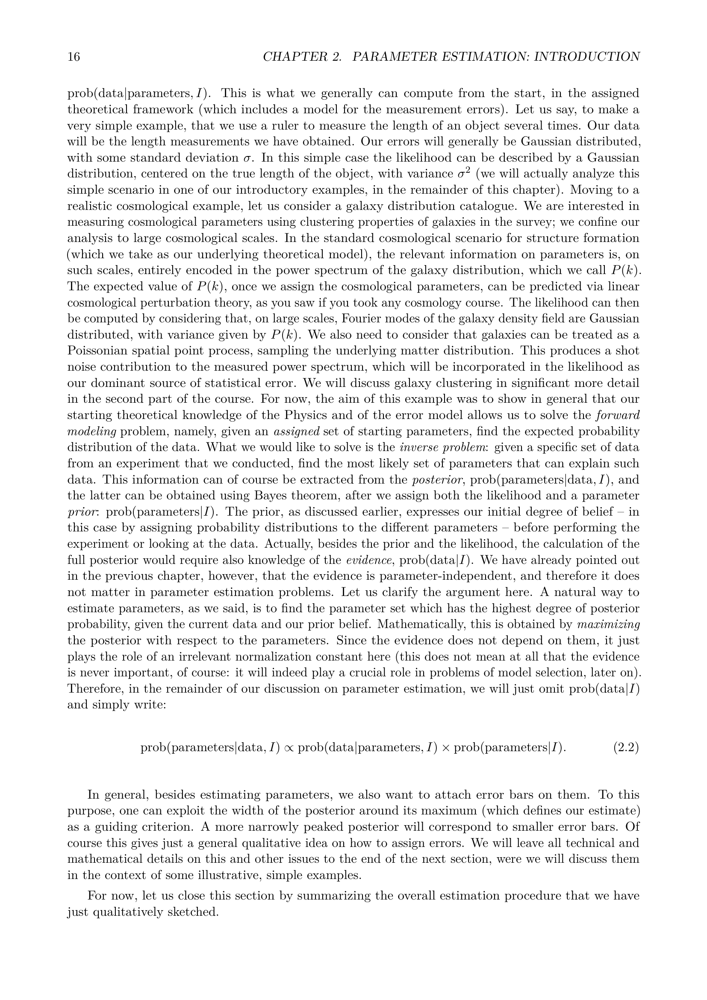

# Parameter Estimation, Gaussian Noise, and Credible Intervals

Graduate lecture notes in Astro-Statistics and Cosmology, taught by Prof. Michele Liguori at the University of Padua.
Reference index [Astro-Statistics_and_Cosmology_MOC](../../../04_Atlas/Astro-Statistics_and_Cosmology_MOC.html)

---

## The Parameter Estimation Problem in Astrophysics

In astronomical data analysis, the typical observational configuration consists of measuring a data vector $\boldsymbol{d} = (d_1, d_2, \dots, d_N)^T$ at discrete sampling points (such as time coordinates $t_i$, spatial positions $\boldsymbol{x}_i$, or wavelengths $\lambda_i$). We assume a theoretical generative model that predicts the physical signal $\boldsymbol{s}(\boldsymbol{\theta})$ as a deterministic function of a parameter vector $\boldsymbol{\theta} = (\theta_1, \theta_2, \dots, \theta_M)^T$.

The observed data represent a superposition of the true physical signal and an observational noise perturbation $\boldsymbol{n}$

$$\boldsymbol{d} = \boldsymbol{s}(\boldsymbol{\theta}) + \boldsymbol{n}$$

The statistical properties of the noise field $\boldsymbol{n}$ govern the form of the likelihood function $\mathcal{L}(\boldsymbol{\theta}) \equiv p(\boldsymbol{d} \mid \boldsymbol{\theta})$. 

---

## Gaussian Noise and the Likelihood Function

In vast astrophysical applications, noise arises from the sum of numerous independent microphysical disturbances (Johnson-Nyquist thermal fluctuations in bolometer detectors, photon shot noise in high-flux Poisson regimes, readout amplifier noise). By the Central Limit Theorem, the joint probability distribution of the noise vector $\boldsymbol{n}$ is extraordinarily well approximated by a multivariate Gaussian distribution.

### Zero-Mean Uncorrelated Gaussian Noise

Assume each measurement $d_i$ suffers from independent, zero-mean Gaussian noise with known standard deviation $\sigma_i$. The noise covariance matrix is diagonal, $C_{ij} = \sigma_i^2 \delta_{ij}$.

The forward probability of observing $d_i$ given parameter values $\boldsymbol{\theta}$ is

$$p(d_i \mid \boldsymbol{\theta}) = \frac{1}{\sqrt{2\pi \sigma_i^2}} \exp\left( -\frac{[d_i - s_i(\boldsymbol{\theta})]^2}{2\sigma_i^2} \right)$$

Because individual measurements are statistically independent, the joint likelihood function factorizes into the product of individual probabilities

$$\mathcal{L}(\boldsymbol{\theta}) = \prod_{i=1}^N p(d_i \mid \boldsymbol{\theta}) = \left( \prod_{i=1}^N \frac{1}{\sqrt{2\pi\sigma_i^2}} \right) \exp\left( -\frac{1}{2} \sum_{i=1}^N \frac{[d_i - s_i(\boldsymbol{\theta})]^2}{\sigma_i^2} \right)$$

Defining the classical chi-squared goodness-of-fit statistic

$$\chi^2(\boldsymbol{\theta}) \equiv \sum_{i=1}^N \frac{[d_i - s_i(\boldsymbol{\theta})]^2}{\sigma_i^2}$$

the likelihood function simplifies to the compact exponential form

$$\mathcal{L}(\boldsymbol{\theta}) \propto \exp\left( -\frac{1}{2} \chi^2(\boldsymbol{\theta}) \right)$$

### Correlated Gaussian Noise

When detector pixels cross-talk, or when systematic foreground fluctuations produce spatial correlations across pixels, the off-diagonal elements of the noise covariance matrix $\boldsymbol{C} \equiv \langle \boldsymbol{n} \boldsymbol{n}^T \rangle$ do not vanish.

The general multivariate Gaussian likelihood becomes

$$\mathcal{L}(\boldsymbol{\theta}) = \frac{1}{(2\pi)^{N/2} \sqrt{\det \boldsymbol{C}}} \exp\left( -\frac{1}{2} [\boldsymbol{d} - \boldsymbol{s}(\boldsymbol{\theta})]^T \boldsymbol{C}^{-1} [\boldsymbol{d} - \boldsymbol{s}(\boldsymbol{\theta})] \right)$$

Here the generalized chi-squared statistic is the quadratic form

$$\chi^2(\boldsymbol{\theta}) = [\boldsymbol{d} - \boldsymbol{s}(\boldsymbol{\theta})]^T \boldsymbol{C}^{-1} [\boldsymbol{d} - \boldsymbol{s}(\boldsymbol{\theta})]$$

where $\boldsymbol{C}^{-1}$ is the precision or inverse covariance matrix.

---

## Maximum Likelihood and Maximum A Posteriori Estimation

When reducing a full continuous probability distribution to a single representative point estimate, two primary criteria emerge.

### The Maximum Likelihood Estimator (MLE)

The Maximum Likelihood Estimator, denoted $\hat{\boldsymbol{\theta}}_{\text{MLE}}$, selects the parameter vector that maximizes the forward probability of generating the observed dataset

$$\hat{\boldsymbol{\theta}}_{\text{MLE}} \equiv \operatorname{argmax}_{\boldsymbol{\theta}} \mathcal{L}(\boldsymbol{\theta}) = \operatorname{argmax}_{\boldsymbol{\theta}} \ln \mathcal{L}(\boldsymbol{\theta})$$

For Gaussian noise with parameter-independent covariance $\boldsymbol{C}$, maximizing the likelihood is mathematically identical to minimizing the chi-squared statistic

$$\hat{\boldsymbol{\theta}}_{\text{MLE}} = \operatorname{argmin}_{\boldsymbol{\theta}} \chi^2(\boldsymbol{\theta})$$

The MLE exhibits remarkable asymptotic properties under regular conditions
- Consistency - as sample size $N \to \infty$, $\hat{\boldsymbol{\theta}}_{\text{MLE}}$ converges in probability to the true parameter value $\boldsymbol{\theta}_0$.
- Asymptotic Normality - the distribution of the estimator approaches a Gaussian centered at $\boldsymbol{\theta}_0$ with covariance matching the inverse Fisher information matrix.
- Asymptotic Efficiency - the estimator achieves the theoretical minimum variance bound defined by the Cramér-Rao theorem.

### The Maximum A Posteriori Estimator (MAP)

The Maximum A Posteriori estimator, denoted $\hat{\boldsymbol{\theta}}_{\text{MAP}}$, incorporates prior knowledge by finding the mode of the posterior probability density function

$$\hat{\boldsymbol{\theta}}_{\text{MAP}} \equiv \operatorname{argmax}_{\boldsymbol{\theta}} p(\boldsymbol{\theta} \mid \boldsymbol{d}) = \operatorname{argmax}_{\boldsymbol{\theta}} \left[ \ln \mathcal{L}(\boldsymbol{\theta}) + \ln \pi(\boldsymbol{\theta}) \right]$$

When the prior $\pi(\boldsymbol{\theta})$ is uniform over the support of the likelihood, $\ln \pi(\boldsymbol{\theta})$ is an additive constant, and the MAP estimator coincides exactly with the MLE.

When the prior is informative, the MAP estimator balances goodness-of-fit against prior expectation. For instance, an informative Gaussian prior acts as an $L_2$ Tikhonov regularization penalty (Ridge regression), while an independent Laplace prior produces $L_1$ sparsity-inducing regularization (LASSO regression).

---

## Asymptotic Convergence and the Bernstein-von Mises Theorem

A foundational theorem in Bayesian asymptotics is the Bernstein-von Mises theorem (often described as the Bayesian Central Limit Theorem).

Consider a dataset of $N$ independent observations drawn from an underlying true distribution $p(d \mid \boldsymbol{\theta}_0)$. As $N \to \infty$, the log-likelihood grows linearly with $N$

$$\ln \mathcal{L}(\boldsymbol{\theta}) = \sum_{i=1}^N \ln p(d_i \mid \boldsymbol{\theta}) \sim \mathcal{O}(N)$$

while the prior density $\pi(\boldsymbol{\theta})$ remains constant, contributing $\mathcal{O}(1)$ to the total log-posterior.

Expanding the log-posterior in a Taylor series about the maximum a posteriori point $\hat{\boldsymbol{\theta}}$

$$\ln p(\boldsymbol{\theta} \mid \boldsymbol{d}) \approx \ln p(\hat{\boldsymbol{\theta}} \mid \boldsymbol{d}) + \left. \nabla_{\boldsymbol{\theta}} \ln p(\boldsymbol{\theta} \mid \boldsymbol{d}) \right\rvert_{\hat{\boldsymbol{\theta}}} (\boldsymbol{\theta} - \hat{\boldsymbol{\theta}}) - \frac{1}{2} (\boldsymbol{\theta} - \hat{\boldsymbol{\theta}})^T \boldsymbol{\Sigma}_{\text{post}}^{-1} (\boldsymbol{\theta} - \hat{\boldsymbol{\theta}})$$

Because $\hat{\boldsymbol{\theta}}$ is an interior local extremum, the first-order gradient vanishes identically

$$\left. \nabla_{\boldsymbol{\theta}} \ln p(\boldsymbol{\theta} \mid \boldsymbol{d}) \right\rvert_{\hat{\boldsymbol{\theta}}} = 0$$

The curvature matrix is governed by the negative Hessian of the log-posterior

$$\boldsymbol{\Sigma}_{\text{post}}^{-1} = -\left. \frac{\partial^2 \ln p(\boldsymbol{\theta} \mid \boldsymbol{d})}{\partial \boldsymbol{\theta} \, \partial \boldsymbol{\theta}^T} \right\rvert_{\hat{\boldsymbol{\theta}}} = -\left. \frac{\partial^2 \ln \mathcal{L}(\boldsymbol{\theta})}{\partial \boldsymbol{\theta} \, \partial \boldsymbol{\theta}^T} \right\rvert_{\hat{\boldsymbol{\theta}}} - \left. \frac{\partial^2 \ln \pi(\boldsymbol{\theta})}{\partial \boldsymbol{\theta} \, \partial \boldsymbol{\theta}^T} \right\rvert_{\hat{\boldsymbol{\theta}}}$$

As $N \to \infty$, the likelihood curvature dominates completely, and the posterior distribution approaches a multivariate Gaussian

$$p(\boldsymbol{\theta} \mid \boldsymbol{d}) \xrightarrow{N \to \infty} \mathcal{N}\left( \hat{\boldsymbol{\theta}}_{\text{MLE}}, \boldsymbol{F}^{-1} \right)$$

where $\boldsymbol{F}$ is the Fisher information matrix.

The physical implication in astrophysics is profound. In the data-rich regime (such as the Planck CMB mission or future billion-galaxy catalogs from Euclid and Vera Rubin Observatory), the posterior distribution becomes virtually independent of the initial prior choice, provided the prior was non-zero across the region of high likelihood. In the low signal-to-noise or parameter-degenerate regime, however, prior choices remain influential and must be reported transparently.

---

## Analytical 1D Example - Updating Knowledge of a Scalar Mean

To observe this mechanics analytically, consider measuring a constant scalar quantity $\mu$ (for example, the absolute flux of a stationary celestial standard candle) corrupted by Gaussian noise with known variance $\sigma^2$.

Let the data vector consist of $N$ independent measurements $\boldsymbol{d} = (d_1, d_2, \dots, d_N)^T$. The sample mean is

$$\bar{d} \equiv \frac{1}{N} \sum_{i=1}^N d_i$$

The likelihood function is

$$\mathcal{L}(\mu) \propto \exp\left( -\frac{1}{2\sigma^2} \sum_{i=1}^N (d_i - \mu)^2 \right)$$

Using the algebraic identity $\sum_{i=1}^N (d_i - \mu)^2 = \sum_{i=1}^N (d_i - \bar{d})^2 + N(\bar{d} - \mu)^2$, the likelihood written as a function of $\mu$ is

$$\mathcal{L}(\mu) \propto \exp\left( -\frac{N}{2\sigma^2} (\mu - \bar{d})^2 \right)$$

Now assign an informative Gaussian prior on $\mu$, reflecting prior observations with mean $\mu_0$ and variance $\sigma_0^2$

$$\pi(\mu) = \frac{1}{\sqrt{2\pi\sigma_0^2}} \exp\left( -\frac{(\mu - \mu_0)^2}{2\sigma_0^2} \right)$$

Multiplying prior and likelihood yields the posterior distribution

$$p(\mu \mid \boldsymbol{d}) \propto \exp\left( -\frac{1}{2} \left[ \frac{(\mu - \mu_0)^2}{\sigma_0^2} + \frac{N(\mu - \bar{d})^2}{\sigma^2} \right] \right)$$

Expressing probability densities in terms of precision (the inverse variance), define prior precision $\tau_0 \equiv 1/\sigma_0^2$ and noise precision per sample $\tau \equiv 1/\sigma^2$. The exponent becomes

$$-\frac{1}{2} \left[ \tau_0 (\mu - \mu_0)^2 + N\tau (\mu - \bar{d})^2 \right] = -\frac{1}{2} \left[ (\tau_0 + N\tau)\mu^2 - 2(\tau_0 \mu_0 + N\tau \bar{d})\mu + \text{const} \right]$$

Completing the square in $\mu$, the posterior is recognized as an exact Gaussian distribution $\mathcal{N}(\mu_N, \sigma_N^2)$ with posterior precision

$$\tau_N \equiv \frac{1}{\sigma_N^2} = \tau_0 + N\tau = \frac{1}{\sigma_0^2} + \frac{N}{\sigma^2}$$

and posterior mean

$$\mu_N = \frac{\tau_0 \mu_0 + N\tau \bar{d}}{\tau_0 + N\tau} = \frac{\frac{\mu_0}{\sigma_0^2} + \frac{N \bar{d}}{\sigma^2}}{\frac{1}{\sigma_0^2} + \frac{N}{\sigma^2}}$$

This closed-form derivation demonstrates fundamental Bayesian principles
- Precisions add linearly. The total posterior information equals the prior information plus the information contributed by $N$ independent data samples.
- The posterior mean is a precision-weighted convex combination of the prior mean and the observational sample mean.
- In the limit of an uninformative prior ($\sigma_0 \to \infty$, $\tau_0 \to 0$), the posterior mean reduces to the sample mean $\mu_N = \bar{d}$, and the posterior variance becomes $\sigma_N^2 = \sigma^2 / N$.
- As the sample size increases ($N \to \infty$), the data precision $N\tau$ dwarfs the prior precision $\tau_0$, forcing $\mu_N \to \bar{d}$ and $\sigma_N \to 0$.

---

## Credible Intervals and Bayesian Error Bars

In Bayesian statistics, uncertainty on a physical parameter $\theta$ is fully characterized by the continuous posterior distribution $p(\theta \mid \boldsymbol{d})$. To convey this uncertainty compactly, we construct a credible interval.

A $100(1 - \alpha)\%$ credible region $\mathcal{R}_\alpha$ in parameter space is a subset satisfying the condition that the integrated posterior probability within the region equals $1 - \alpha$

$$\int_{\mathcal{R}_\alpha} p(\boldsymbol{\theta} \mid \boldsymbol{d}) \, d\boldsymbol{\theta} = 1 - \alpha$$

Typical choices for $1 - \alpha$ include $0.6827$ (1-sigma equivalent), $0.9545$ (2-sigma equivalent), and $0.9973$ (3-sigma equivalent).

Because infinitely many intervals can enclose probability $1 - \alpha$, two formal selection conventions exist.

### Equal-Tailed Credible Interval

For a one-dimensional parameter $\theta \in [\theta_{\text{min}}, \theta_{\text{max}}]$, the equal-tailed credible interval $[\theta_1, \theta_2]$ places equal probability mass $\alpha/2$ in each of the two tails

$$\int_{-\infty}^{\theta_1} p(\theta \mid \boldsymbol{d}) \, d\theta = \frac{\alpha}{2} \qquad \text{and} \qquad \int_{\theta_2}^\infty p(\theta \mid \boldsymbol{d}) \, d\theta = \frac{\alpha}{2}$$

The boundaries correspond directly to the $\alpha/2$ and $1 - \alpha/2$ quantiles of the cumulative distribution function. Equal-tailed intervals are computationally trivial to extract from MCMC chain samples by simple rank ordering. However, for skewed, asymmetric, or bounded distributions (such as neutrino mass sums $\sum m_\nu > 0$), equal-tailed intervals can include regions of lower probability density while excluding regions of higher density.

### Highest Posterior Density (HPD) Credible Interval

The Highest Posterior Density region $\mathcal{R}_{\text{HPD}}$ is defined by the property that the posterior density at every point inside the region is strictly greater than the posterior density at any point outside the region

$$\mathcal{R}_{\text{HPD}} = \{ \boldsymbol{\theta} \mid p(\boldsymbol{\theta} \mid \boldsymbol{d}) \ge c_\alpha \}$$

where the constant threshold $c_\alpha$ is chosen such that

$$\int_{\mathcal{R}_{\text{HPD}}} p(\boldsymbol{\theta} \mid \boldsymbol{d}) \, d\boldsymbol{\theta} = 1 - \alpha$$

The HPD region possesses two key geometric properties
1. Minimum Volume - among all possible regions containing probability $1 - \alpha$, the HPD region occupies the smallest total volume in parameter space.
2. Multimodality - if the posterior is multimodal (as frequently happens when fitting gravitational wave chirps or resolving phase ambiguities in interferometry), the HPD region naturally splits into a disjoint union of disconnected intervals.

For a symmetric unimodal distribution (such as a Gaussian), the equal-tailed interval and the HPD interval are mathematically identical.

---

## Conceptual Connections

- [Astro-Statistics_and_Cosmology_MOC](../../../04_Atlas/Astro-Statistics_and_Cosmology_MOC.html) - Master syllabus map of content
- [01_Plausible_Reasoning_Cox_Theorem_and_Bayesian_Foundations](./01_Plausible_Reasoning_Cox_Theorem_and_Bayesian_Foundations.html) - Cox theorem and product/sum rules
- [03_Multivariate_Gaussians_Marginalization_Conditioning_and_Linear_Models](./03_Multivariate_Gaussians_Marginalization_Conditioning_and_Linear_Models.html) - Linear models, chi-squared surfaces, and error ellipses
- [04_Frequentist_vs_Bayesian_Inference_and_Confidence_Intervals](./04_Frequentist_vs_Bayesian_Inference_and_Confidence_Intervals.html) - Exact mathematical contrast between credible intervals and confidence intervals
- [06_Fisher_Information_Matrix_Cramer_Rao_Bound_and_Survey_Forecasting](./06_Fisher_Information_Matrix_Cramer_Rao_Bound_and_Survey_Forecasting.html) - Cramér-Rao inequality and asymptotic covariance calculation

## Lecture Visuals & Parameter Estimation

*Figure AST-02: Bayesian Parameter Estimation with Gaussian Measurement Noise. The posterior probability density function $P(\theta \mid D, I) \propto \mathcal{L}(D \mid \theta) \pi(\theta)$ under homoscedastic Gaussian noise $\sigma$ yields the quadratic log-likelihood $\ln \mathcal{L} = -\frac{1}{2} \sum \frac{(d_i - \mu_i(\theta))^2}{\sigma^2}$. The $68.3\%$ and $95.4\%$ Bayesian credible intervals are computed via direct integration of the posterior volume: $\int_{\Omega_C} P(\theta \mid D) d\theta = 1 - \alpha$.*

  <h4 class="backlinks-title">Linked References (3)</h4>
  <ul class="backlinks-list">
    <li class="backlink-item-wrap"><a href="../../../03_Zettel/Theory/Bernstein-von%20Mises%20theorem%20and%20Bayesian%20asymptotics.html" class="backlink-item">Bernstein-von Mises theorem and Bayesian asymptotics</a></li>
    <li class="backlink-item-wrap"><a href="../../../03_Zettel/Theory/Maximum%20likelihood%20versus%20maximum%20a%20posteriori%20estimation.html" class="backlink-item">Maximum likelihood versus maximum a posteriori estimation</a></li>
    <li class="backlink-item-wrap"><a href="../../../04_Atlas/Astro-Statistics_and_Cosmology_MOC.html" class="backlink-item">Astro-Statistics_and_Cosmology_MOC</a></li>
  </ul>

