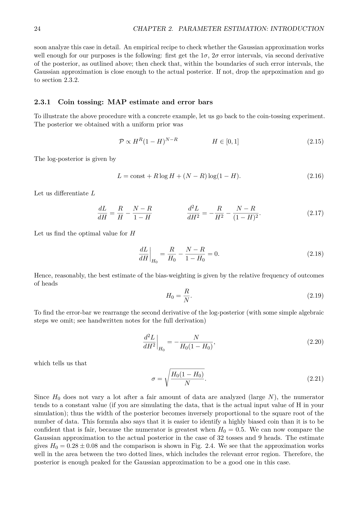

# Monte Carlo, Metropolis-Hastings, and MCMC Convergence Diagnostics

Graduate lecture notes in Astro-Statistics and Cosmology, taught by Prof. Michele Liguori at the University of Padua.
Reference index [[Astro-Statistics_and_Cosmology_MOC]]

---

## The Computational Challenge of High-Dimensional Inference

In modern cosmological parameter estimation, the posterior probability density function $p(\boldsymbol{\theta} \mid \boldsymbol{d})$ lives in a high-dimensional parameter space. The baseline cosmological model ($\Lambda\text{CDM}$) requires at least six primary parameters

$$\boldsymbol{\theta} = (\Omega_b h^2, \Omega_c h^2, 100\theta_{\text{MC}}, \tau_{\text{reio}}, \ln(10^{10} A_s), n_s)$$

When analyzing real cosmological data from the Planck satellite or galaxy clustering surveys, this parameter space expands to include tens of nuisance parameters describing calibration uncertainties, beam profiles, foreground emissions (thermal dust, cosmic infrared background, synchrotron, point sources), and galaxy bias. Realistic parameter spaces routinely feature between 10 and 35 dimensions.

Calculating marginalized one-dimensional and two-dimensional posterior distributions requires evaluating multidimensional integrals of the form

$$p(\theta_1 \mid \boldsymbol{d}) = \int \dots \int p(\theta_1, \theta_2, \dots, \theta_D \mid \boldsymbol{d}) \, d\theta_2 \dots d\theta_D$$

Standard deterministic numerical quadrature methods (such as Simpson's rule or Gaussian quadrature) suffer catastrophically from the curse of dimensionality. If each parameter axis is discretized using $K = 50$ grid points, evaluating a $D = 20$ dimensional posterior requires $50^{20} \approx 9.5 \times 10^{33}$ likelihood evaluations. If a single cosmological Boltzmann solver call (via CAMB or CLASS) takes $0.1$ seconds, evaluating this grid would exceed the age of the universe.

Furthermore, in high dimensions, the typical set (the narrow hypersurface where the probability mass actually resides) occupies an infinitesimally small fraction of the total parameter space volume. Grid methods spend virtually all computational time evaluating exponentially small likelihoods in the empty tails.

---

## Monte Carlo Integration

Monte Carlo integration circumvents the curse of dimensionality by treating integration as an expectation value under a probability distribution.

Suppose we wish to evaluate the integral of an arbitrary function $f(\boldsymbol{\theta})$ weighted by a probability distribution $p(\boldsymbol{\theta})$

$$I \equiv \int_{\Omega} f(\boldsymbol{\theta}) \, p(\boldsymbol{\theta}) \, d\boldsymbol{\theta} = \langle f \rangle_p$$

If we can draw $N$ independent, identically distributed (i.i.d.) random samples $\{\boldsymbol{\theta}^{(1)}, \boldsymbol{\theta}^{(2)}, \dots, \boldsymbol{\theta}^{(N)}\}$ from $p(\boldsymbol{\theta})$, the Monte Carlo estimator of the integral is the sample mean

$$\hat{I}_N \equiv \frac{1}{N} \sum_{i=1}^N f(\boldsymbol{\theta}^{(i)})$$

By the Law of Large Numbers, $\hat{I}_N$ is an unbiased estimator that converges almost surely to the true integral $I$ as $N \to \infty$.

By the Central Limit Theorem, the statistical error of the estimator is given by the standard error of the mean

$$\sigma_{\hat{I}} = \frac{\sigma_f}{\sqrt{N}}$$

where $\sigma_f^2 = \int (f(\boldsymbol{\theta}) - I)^2 p(\boldsymbol{\theta}) \, d\boldsymbol{\theta}$ is the intrinsic variance of $f$.

The crucial mathematical property is that the convergence rate scales strictly as $\mathcal{O}(1/\sqrt{N})$, completely independent of the dimensionality $D$ of the parameter space.

---

## Rejection and Importance Sampling

Before turning to Markov chains, consider two classical static sampling techniques.

### Rejection Sampling

Suppose the target posterior $p(\boldsymbol{\theta} \mid \boldsymbol{d})$ is difficult to sample directly, but we can sample from a simpler proposal distribution $q(\boldsymbol{\theta})$, where a constant $M > 0$ exists such that $M q(\boldsymbol{\theta}) \ge p(\boldsymbol{\theta} \mid \boldsymbol{d})$ everywhere.

The algorithm proceeds
1. Draw a candidate $\boldsymbol{\theta}^* \sim q(\boldsymbol{\theta})$.
2. Draw a uniform random number $u \sim \mathcal{U}(0, 1)$.
3. Accept $\boldsymbol{\theta}^*$ if $u \le \frac{p(\boldsymbol{\theta}^* \mid \boldsymbol{d})}{M q(\boldsymbol{\theta}^*)}$. Otherwise, reject $\boldsymbol{\theta}^*$ and repeat.

Accepted samples are strictly distributed according to $p(\boldsymbol{\theta} \mid \boldsymbol{d})$. However, in high dimensions, the volume ratio of the target density to the envelope $M q(\boldsymbol{\theta})$ decreases exponentially with $D$. The acceptance probability collapses toward zero, rendering rejection sampling useless for high-dimensional cosmology.

### Importance Sampling

In importance sampling, samples are drawn from an alternative proposal $q(\boldsymbol{\theta})$, and each sample is assigned an importance weight

$$w_i = \frac{p(\boldsymbol{\theta}^{(i)} \mid \boldsymbol{d})}{q(\boldsymbol{\theta}^{(i)})}$$

Expectation values are estimated as weighted averages

$$\langle f \rangle \approx \frac{\sum_{i=1}^N w_i f(\boldsymbol{\theta}^{(i)})}{\sum_{i=1}^N w_i}$$

Importance sampling is useful when updating existing MCMC chains under slight modifications of the likelihood or prior (such as adding a localized astrophysical prior on the optical depth $\tau_{\text{reio}}$). However, if the proposal $q(\boldsymbol{\theta})$ does not match the target distribution closely across high-probability regions, a tiny fraction of samples will dominate the weights, causing the variance of the estimator to explode.

---

## Markov Chain Monte Carlo - Foundations

Markov Chain Monte Carlo (MCMC) solves the sampling problem by generating a sequence of dependent samples that asymptotically trace the target distribution $p(\boldsymbol{\theta} \mid \boldsymbol{d})$, spending computational time precisely where the posterior mass is concentrated.

A Markov chain is a sequence of random variables $\{\boldsymbol{\theta}^{(0)}, \boldsymbol{\theta}^{(1)}, \boldsymbol{\theta}^{(2)}, \dots\}$ characterized by the Markov property. The conditional probability of transitioning to state $\boldsymbol{\theta}^{(t+1)}$ depends exclusively on the current state $\boldsymbol{\theta}^{(t)}$ and is independent of the past trajectory

$$p(\boldsymbol{\theta}^{(t+1)} \mid \boldsymbol{\theta}^{(t)}, \boldsymbol{\theta}^{(t-1)}, \dots, \boldsymbol{\theta}^{(0)}) = T(\boldsymbol{\theta}^{(t+1)} \mid \boldsymbol{\theta}^{(t)})$$

where $T(\boldsymbol{\theta}' \mid \boldsymbol{\theta})$ is the transition probability kernel.

### Stationary Distribution and Detailed Balance

A target distribution $p(\boldsymbol{\theta})$ is an invariant (or stationary) distribution of the Markov chain if, once the chain reaches $p(\boldsymbol{\theta})$, all subsequent steps remain distributed according to $p(\boldsymbol{\theta})$

$$p(\boldsymbol{\theta}') = \int T(\boldsymbol{\theta}' \mid \boldsymbol{\theta}) \, p(\boldsymbol{\theta}) \, d\boldsymbol{\theta}$$

A sufficient (though not strictly necessary) condition to guarantee that $p(\boldsymbol{\theta})$ is a stationary distribution is the detailed balance condition (also known as microscopic reversibility)

$$p(\boldsymbol{\theta}) \, T(\boldsymbol{\theta}' \mid \boldsymbol{\theta}) = p(\boldsymbol{\theta}') \, T(\boldsymbol{\theta} \mid \boldsymbol{\theta}')$$

To prove that detailed balance guarantees stationarity, integrate both sides over $\boldsymbol{\theta}$

$$\int p(\boldsymbol{\theta}) \, T(\boldsymbol{\theta}' \mid \boldsymbol{\theta}) \, d\boldsymbol{\theta} = \int p(\boldsymbol{\theta}') \, T(\boldsymbol{\theta} \mid \boldsymbol{\theta}') \, d\boldsymbol{\theta} = p(\boldsymbol{\theta}') \int T(\boldsymbol{\theta} \mid \boldsymbol{\theta}') \, d\boldsymbol{\theta}$$

Because $T(\boldsymbol{\theta} \mid \boldsymbol{\theta}')$ is a normalized transition probability over final states, $\int T(\boldsymbol{\theta} \mid \boldsymbol{\theta}') \, d\boldsymbol{\theta} = 1$, which directly recovers the stationarity equation.

---

## The Metropolis-Hastings Algorithm

The Metropolis-Hastings (MH) algorithm constructs a transition kernel $T(\boldsymbol{\theta}' \mid \boldsymbol{\theta})$ satisfying detailed balance for any chosen target distribution $p(\boldsymbol{\theta})$.

The transition is split into two stages. First, propose a candidate move $\boldsymbol{\theta}^*$ from a proposal distribution $q(\boldsymbol{\theta}^* \mid \boldsymbol{\theta})$. Second, accept the candidate with probability $\alpha(\boldsymbol{\theta}, \boldsymbol{\theta}^*)$. If accepted, set $\boldsymbol{\theta}^{(t+1)} = \boldsymbol{\theta}^*$. If rejected, retain the current position, setting $\boldsymbol{\theta}^{(t+1)} = \boldsymbol{\theta}^{(t)}$.

The transition probability kernel for moving to a distinct state $\boldsymbol{\theta}' \neq \boldsymbol{\theta}$ is

$$T(\boldsymbol{\theta}' \mid \boldsymbol{\theta}) = q(\boldsymbol{\theta}' \mid \boldsymbol{\theta}) \, \alpha(\boldsymbol{\theta}, \boldsymbol{\theta}')$$

Imposing detailed balance requires

$$p(\boldsymbol{\theta}) \, q(\boldsymbol{\theta}' \mid \boldsymbol{\theta}) \, \alpha(\boldsymbol{\theta}, \boldsymbol{\theta}') = p(\boldsymbol{\theta}') \, q(\boldsymbol{\theta} \mid \boldsymbol{\theta}') \, \alpha(\boldsymbol{\theta}', \boldsymbol{\theta})$$

Rearranging

$$\frac{\alpha(\boldsymbol{\theta}, \boldsymbol{\theta}')}{\alpha(\boldsymbol{\theta}', \boldsymbol{\theta})} = \frac{p(\boldsymbol{\theta}') \, q(\boldsymbol{\theta} \mid \boldsymbol{\theta}')}{p(\boldsymbol{\theta}) \, q(\boldsymbol{\theta}' \mid \boldsymbol{\theta})}$$

To maximize the acceptance probability while remaining bounded by $\alpha \le 1$, Metropolis and Hastings chose

$$\alpha(\boldsymbol{\theta}, \boldsymbol{\theta}') = \min\left( 1, \, \frac{p(\boldsymbol{\theta}') \, q(\boldsymbol{\theta} \mid \boldsymbol{\theta}')}{p(\boldsymbol{\theta}) \, q(\boldsymbol{\theta}' \mid \boldsymbol{\theta})} \right)$$

For a symmetric proposal distribution, where $q(\boldsymbol{\theta}' \mid \boldsymbol{\theta}) = q(\boldsymbol{\theta} \mid \boldsymbol{\theta}')$ (such as a Gaussian random walk $q(\boldsymbol{\theta}^* \mid \boldsymbol{\theta}) = \mathcal{N}(\boldsymbol{\theta}, \boldsymbol{\Sigma}_{\text{prop}})$), the proposal ratio equals unity, reducing to the classical Metropolis acceptance ratio

$$\alpha(\boldsymbol{\theta}, \boldsymbol{\theta}^*) = \min\left( 1, \, \frac{p(\boldsymbol{\theta}^* \mid \boldsymbol{d})}{p(\boldsymbol{\theta} \mid \boldsymbol{d})} \right) = \min\left( 1, \, \frac{\mathcal{L}(\boldsymbol{\theta}^*) \, \pi(\boldsymbol{\theta}^*)}{\mathcal{L}(\boldsymbol{\theta}) \, \pi(\boldsymbol{\theta})} \right)$$

Notice that the normalization constant (the Bayesian evidence $\mathcal{Z}$) cancels out completely from the ratio. The algorithm requires only unnormalized evaluations of the likelihood and prior.

---

## Gibbs Sampling as a Special Case

Gibbs sampling updates multidimensional parameter vectors by updating one scalar coordinate at a time, drawing directly from the full conditional posterior distribution.

Let $\boldsymbol{\theta} = (\theta_1, \theta_2, \dots, \theta_D)$. In step $t+1$, the coordinates are updated sequentially

$$\theta_1^{(t+1)} \sim p(\theta_1 \, \mid \, \theta_2^{(t)}, \theta_3^{(t)}, \dots, \theta_D^{(t)}, \boldsymbol{d})$$

$$\theta_2^{(t+1)} \sim p(\theta_2 \, \mid \, \theta_1^{(t+1)}, \theta_3^{(t)}, \dots, \theta_D^{(t)}, \boldsymbol{d})$$

$$\dots$$

$$\theta_D^{(t+1)} \sim p(\theta_D \, \mid \, \theta_1^{(t+1)}, \dots, \theta_{D-1}^{(t+1)}, \boldsymbol{d})$$

Gibbs sampling is an exact special case of the Metropolis-Hastings algorithm. Consider an update of coordinate $j$ where the proposal distribution is the full conditional distribution

$$q(\boldsymbol{\theta}^* \mid \boldsymbol{\theta}) = p(\theta_j^* \mid \boldsymbol{\theta}_{-j}, \boldsymbol{d}) \, \delta(\boldsymbol{\theta}_{-j}^* - \boldsymbol{\theta}_{-j})$$

Substitute this into the Metropolis-Hastings acceptance ratio

$$\alpha = \min\left( 1, \, \frac{p(\boldsymbol{\theta}^* \mid \boldsymbol{d}) \, q(\boldsymbol{\theta} \mid \boldsymbol{\theta}^*)}{p(\boldsymbol{\theta} \mid \boldsymbol{d}) \, q(\boldsymbol{\theta}^* \mid \boldsymbol{\theta})} \right) = \min\left( 1, \, \frac{p(\theta_j^* \mid \boldsymbol{\theta}_{-j}) p(\boldsymbol{\theta}_{-j}) \, p(\theta_j \mid \boldsymbol{\theta}_{-j})}{p(\theta_j \mid \boldsymbol{\theta}_{-j}) p(\boldsymbol{\theta}_{-j}) \, p(\theta_j^* \mid \boldsymbol{\theta}_{-j})} \right) = \min(1, 1) = 1$$

The acceptance probability is identically 1. Gibbs updates never reject proposals.

Gibbs sampling is useful when conditional distributions belong to standard conjugate families (as in Gaussian linear models with unknown mean and unknown precision). However, if parameters exhibit strong correlations, Gibbs sampling produces inefficient axis-aligned zig-zag trajectories, leading to slow diffusion across the posterior space.

---

## Tuning Proposals and the Acceptance Rate

In random-walk Metropolis algorithms, the choice of proposal covariance $\boldsymbol{\Sigma}_{\text{prop}}$ determines sampling efficiency.
- If the proposal scale is too small, proposals are almost always accepted ($\alpha \approx 1$), but the chain explores the parameter space through slow Brownian diffusion, requiring massive step counts to cross the distribution.
- If the proposal scale is too large, candidate steps jump far outside the typical set into regions of negligible likelihood, causing the chain to reject almost all proposals ($\alpha \approx 0$) and stall in place.

Roberts, Gelman, and Gilks (1997) proved that for an optimal Gaussian target distribution as dimensionality $D \to \infty$, the asymptotically optimal acceptance rate is approximately $23.4\%$. For a 1D target, the optimal rate is roughly $44\%$. As a practical rule of thumb, proposal covariances are scaled such that the acceptance rate settles between $20\%$ and $50\%$.

---

## MCMC Convergence Diagnostics

Because MCMC chains generate sequentially correlated samples, one must verify that the chain has converged to the stationary distribution and that enough independent samples have been collected.

### Burn-in Phase

A chain is initialized at an arbitrary starting point $\boldsymbol{\theta}^{(0)}$, often far from the posterior mode. During the initial iterations, the chain drifts from this unrepresentative starting position toward the typical set.

This initial non-stationary transient is called the burn-in phase. All samples generated during burn-in must be strictly discarded from the final posterior analysis.

### Trace Plots

A trace plot displays the parameter value $\theta_j^{(t)}$ as a function of iteration step $t$.
- A healthy, converged chain displays a stationary, horizontal fuzzy caterpillar appearance, oscillating rapidly without prolonged upward or downward trends.
- A sluggish chain displays slow, meandering random walks, indicating strong autocorrelation and inadequate chain length.

### Autocorrelation Time and Effective Sample Size

Let $\{\theta_t\}_{t=1}^N$ denote a chain of samples for a specific parameter after burn-in. The lag-$k$ autocorrelation function is defined as

$$\rho(k) \equiv \frac{\frac{1}{N-k}\sum_{t=1}^{N-k} (\theta_t - \bar{\theta})(\theta_{t+k} - \bar{\theta})}{\frac{1}{N}\sum_{t=1}^N (\theta_t - \bar{\theta})^2}$$

The integrated autocorrelation time $\tau_{\text{int}}$ measures the number of steps required for the chain to produce one statistically independent sample

$$\tau_{\text{int}} = 1 + 2 \sum_{k=1}^\infty \rho(k)$$

The Effective Sample Size (ESS), denoted $N_{\text{eff}}$, is the equivalent number of independent samples contained in the chain of length $N$

$$N_{\text{eff}} = \frac{N}{\tau_{\text{int}}}$$

The standard error on the posterior mean of $\theta$ is governed by $N_{\text{eff}}$

$$\sigma_{\bar{\theta}} = \frac{\sigma_\theta}{\sqrt{N_{\text{eff}}}}$$

Cosmological inference pipelines typically require $N_{\text{eff}} \gtrsim 1000$ to ensure reliable parameter contours and upper limits.

### Gelman-Rubin $\hat{R}$ Diagnostic

The most robust test for convergence is the Gelman-Rubin potential scale reduction factor $\hat{R}$, which compares multiple independent chains initialized from widely dispersed starting locations.

Run $M$ independent chains ($M \ge 4$), each of length $N$ after discarding burn-in. Let $\theta_{mj}$ denote the $j$-th sample of the $m$-th chain.

Compute the within-chain variance $W$

$$W = \frac{1}{M(N - 1)} \sum_{m=1}^M \sum_{j=1}^N (\theta_{mj} - \bar{\theta}_m)^2$$

Compute the between-chain variance $B$

$$B = \frac{N}{M - 1} \sum_{m=1}^M (\bar{\theta}_m - \bar{\theta}_{\bullet})^2$$

where $\bar{\theta}_m = \frac{1}{N}\sum_{j=1}^N \theta_{mj}$ and $\bar{\theta}_{\bullet} = \frac{1}{M}\sum_{m=1}^M \bar{\theta}_m$.

The marginal posterior variance is estimated as a weighted average of $W$ and $B$

$$\widehat{\operatorname{Var}}^+(\theta) = \frac{N - 1}{N} W + \frac{1}{N} B$$

The Gelman-Rubin diagnostic is defined as

$$\hat{R} \equiv \sqrt{\frac{\widehat{\operatorname{Var}}^+(\theta)}{W}}$$

At the beginning of sampling, when chains have not yet explored the full parameter space, between-chain dispersion is large, giving $\hat{R} \gg 1$. As the chains mix thoroughly across the target distribution, between-chain variance matches within-chain variance, and $\hat{R} \to 1$.

Convergence is considered achieved when $\hat{R} < 1.05$ (or $\hat{R} < 1.01$ for precision CMB analyses) across all inferred parameters.

---

## Conceptual Connections

- [[Astro-Statistics_and_Cosmology_MOC]] - Master syllabus map of content
- [[02_Parameter_Estimation_Gaussian_Noise_and_Credible_Intervals]] - Extraction of credible intervals from MCMC chains
- [[03_Multivariate_Gaussians_Marginalization_Conditioning_and_Linear_Models]] - Exact sampling via Cholesky decomposition
- [[06_Fisher_Information_Matrix_Cramer_Rao_Bound_and_Survey_Forecasting]] - Utilizing the inverse Fisher matrix to construct optimal MCMC proposal covariances
- [[09_Bayesian_Hierarchical_Models_for_Type_Ia_Supernovae]] - High-dimensional sampling over latent variables
- [[Homework_Problems_and_Solutions]] - Python implementations of Cholesky sampling, Metropolis-Hastings, and Gibbs sampling for Homework problem 7

## Lecture Visuals & MCMC Diagnostics

*Figure AST-03: Metropolis-Hastings Markov Chain Monte Carlo (MCMC) Sampling. Depicts proposal distribution transitions $q(\theta^* \mid \theta^{(t)})$ with acceptance probability $\alpha = \min\left(1, \frac{\mathcal{L}(D \mid \theta^*) \pi(\theta^*) q(\theta^{(t)}\mid\theta^*)}{\mathcal{L}(D \mid \theta^{(t)}) \pi(\theta^{(t)}) q(\theta^* \mid \theta^{(t)})}\right)$. The chain achieves the stationary target distribution once burn-in is discarded and the Gelman-Rubin convergence criterion $\hat{R} < 1.05$ across multiple independent chains is satisfied.*

## Linked References

- [[Monte Carlo integration and cursed dimensions]]
- [[Gibbs sampling and conditional state transitions]]
- [[MCMC convergence diagnostics and Gelman-Rubin statistic]]
- [[Metropolis-Hastings algorithm and detailed balance]]
- [[Astro-Statistics_and_Cosmology_MOC]]

