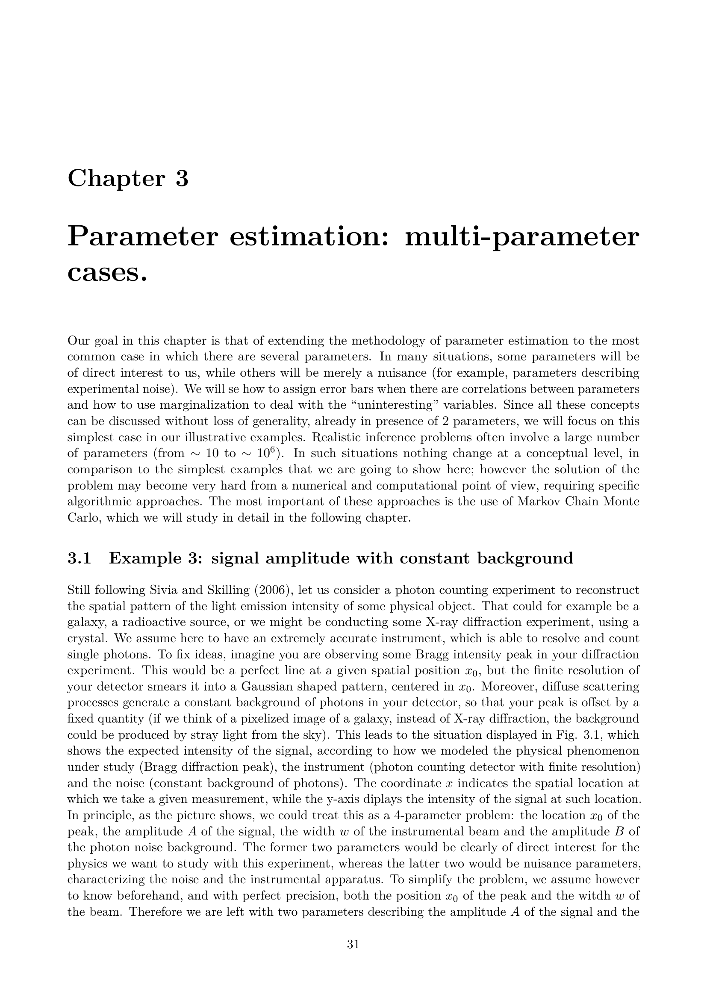


# Fisher Information Matrix, Cramér-Rao Bound, and Survey Forecasting

Graduate lecture notes in Astro-Statistics and Cosmology, taught by Prof. Michele Liguori at the University of Padua.
Reference index [Astro-Statistics_and_Cosmology_MOC](../../../04_Atlas/Astro-Statistics_and_Cosmology_MOC.html)

---

## The Score Function and Information Measure

When planning next-generation cosmological surveys (such as the Euclid space telescope, the Dark Energy Spectroscopic Instrument, or the Vera C. Rubin Observatory), astrophysicists must forecast the constraining power of the experiment before building hardware. We must determine how precisely a planned instrument will measure cosmological parameters, such as the dark energy equation of state $w(a) = w_0 + w_a(1-a)$ or the sum of neutrino masses $\sum m_\nu$.

The mathematical engine of cosmological forecasting is the Fisher Information Matrix formalism.

Let $\boldsymbol{d}$ denote the random data vector observed by an experiment, governed by a likelihood function $\mathcal{L}(\boldsymbol{\theta}) \equiv p(\boldsymbol{d} \mid \boldsymbol{\theta})$ depending on a parameter vector $\boldsymbol{\theta} = (\theta_1, \theta_2, \dots, \theta_M)^T$.

The score function $\boldsymbol{S}(\boldsymbol{\theta})$ is defined as the gradient of the log-likelihood with respect to the parameters

$$\boldsymbol{S}(\boldsymbol{\theta}) \equiv \nabla_{\boldsymbol{\theta}} \ln \mathcal{L}(\boldsymbol{\theta})$$

The expectation value of the score function evaluated at the true parameter value $\boldsymbol{\theta}$ vanishes identically. To demonstrate this, consider the normalization condition of the likelihood

$$\int p(\boldsymbol{d} \mid \boldsymbol{\theta}) \, d\boldsymbol{d} = 1$$

Differentiating both sides with respect to $\theta_i$, and assuming regularity conditions permitting interchange of differentiation and integration

$$\frac{\partial}{\partial \theta_i} \int p(\boldsymbol{d} \mid \boldsymbol{\theta}) \, d\boldsymbol{d} = \int \frac{\partial p(\boldsymbol{d} \mid \boldsymbol{\theta})}{\partial \theta_i} \, d\boldsymbol{d} = 0$$

Using the logarithmic derivative identity $\frac{\partial p}{\partial \theta_i} = p \, \frac{\partial \ln p}{\partial \theta_i}$

$$\int \left( \frac{\partial \ln p(\boldsymbol{d} \mid \boldsymbol{\theta})}{\partial \theta_i} \right) p(\boldsymbol{d} \mid \boldsymbol{\theta}) \, d\boldsymbol{d} = \left\langle \frac{\partial \ln \mathcal{L}(\boldsymbol{\theta})}{\partial \theta_i} \right\rangle = 0$$

Therefore, the expected value of the score vector across data realizations is zero

$$\langle \boldsymbol{S}(\boldsymbol{\theta}) \rangle = \mathbf{0}$$

---

## The Fisher Information Matrix

Because the first moment of the score function vanishes, the information content of the experiment is measured by its second moment.

The Fisher Information Matrix $\boldsymbol{F} \in \mathbb{R}^{M \times M}$ is defined as the covariance matrix of the score vector

$$F_{ij}(\boldsymbol{\theta}) \equiv \left\langle \left( \frac{\partial \ln \mathcal{L}(\boldsymbol{\theta})}{\partial \theta_i} \right) \left( \frac{\partial \ln \mathcal{L}(\boldsymbol{\theta})}{\partial \theta_j} \right) \right\rangle$$

A key theorem establishes that the Fisher matrix is identically equal to the expectation value of the negative Hessian of the log-likelihood.

To prove this identity, differentiate the expected score with respect to $\theta_j$

$$\frac{\partial}{\partial \theta_j} \int \left( \frac{\partial \ln p(\boldsymbol{d} \mid \boldsymbol{\theta})}{\partial \theta_i} \right) p(\boldsymbol{d} \mid \boldsymbol{\theta}) \, d\boldsymbol{d} = 0$$

Applying the product rule to the integrand

$$\int \left( \frac{\partial^2 \ln p(\boldsymbol{d} \mid \boldsymbol{\theta})}{\partial \theta_i \partial \theta_j} \right) p(\boldsymbol{d} \mid \boldsymbol{\theta}) \, d\boldsymbol{d} + \int \left( \frac{\partial \ln p(\boldsymbol{d} \mid \boldsymbol{\theta})}{\partial \theta_i} \right) \frac{\partial p(\boldsymbol{d} \mid \boldsymbol{\theta})}{\partial \theta_j} \, d\boldsymbol{d} = 0$$

Substituting $\frac{\partial p}{\partial \theta_j} = p \, \frac{\partial \ln p}{\partial \theta_j}$ yields

$$\left\langle \frac{\partial^2 \ln \mathcal{L}(\boldsymbol{\theta})}{\partial \theta_i \partial \theta_j} \right\rangle + \left\langle \left( \frac{\partial \ln \mathcal{L}(\boldsymbol{\theta})}{\partial \theta_i} \right) \left( \frac{\partial \ln \mathcal{L}(\boldsymbol{\theta})}{\partial \theta_j} \right) \right\rangle = 0$$

Rearranging terms recovers the fundamental equivalence

$$F_{ij}(\boldsymbol{\theta}) = -\left\langle \frac{\partial^2 \ln \mathcal{L}(\boldsymbol{\theta})}{\partial \theta_i \partial \theta_j} \right\rangle$$

The Fisher matrix measures the average curvature of the log-likelihood function around the maximum. If the log-likelihood drops off sharply away from the peak, the second derivative is large, the curvature is high, the Fisher information is massive, and parameters will be measured with tight uncertainties. Conversely, if the likelihood is flat, the curvature is small, and the data provide weak constraints.

---

## The Cramér-Rao Inequality

The practical importance of the Fisher information matrix stems from the Cramér-Rao inequality, which establishes the ultimate fundamental limit on parameter measurement precision for any unbiased estimator.

Let $\hat{\boldsymbol{\theta}}(\boldsymbol{d})$ be any unbiased estimator of $\boldsymbol{\theta}$, meaning $\langle \hat{\boldsymbol{\theta}} \rangle = \boldsymbol{\theta}$.

The Cramér-Rao inequality states that the covariance matrix of $\hat{\boldsymbol{\theta}}$ satisfies the matrix inequality

$$\operatorname{Cov}(\hat{\boldsymbol{\theta}}) \ge \boldsymbol{F}^{-1}$$

where $\boldsymbol{A} \ge \boldsymbol{B}$ means that the matrix difference $\boldsymbol{A} - \boldsymbol{B}$ is positive semi-definite.

### Derivation for a Scalar Parameter

For a single scalar parameter $\theta$, the proof follows from the Cauchy-Schwarz inequality.

Because $\hat{\theta}$ is unbiased, $\langle \hat{\theta} - \theta \rangle = \int (\hat{\theta}(\boldsymbol{d}) - \theta) p(\boldsymbol{d} \mid \theta) \, d\boldsymbol{d} = 0$.

Differentiating with respect to $\theta$

$$\frac{d}{d\theta} \int (\hat{\theta}(\boldsymbol{d}) - \theta) p(\boldsymbol{d} \mid \theta) \, d\boldsymbol{d} = \int \left[ -p(\boldsymbol{d} \mid \theta) + (\hat{\theta}(\boldsymbol{d}) - \theta) \frac{\partial p(\boldsymbol{d} \mid \theta)}{\partial \theta} \right] d\boldsymbol{d} = 0$$

Using $\frac{\partial p}{\partial \theta} = p \frac{\partial \ln p}{\partial \theta}$ and $\int p \, d\boldsymbol{d} = 1$

$$\int (\hat{\theta}(\boldsymbol{d}) - \theta) \left( \frac{\partial \ln p}{\partial \theta} \right) p(\boldsymbol{d} \mid \theta) \, d\boldsymbol{d} = 1$$

This states that the covariance between the error $(\hat{\theta} - \theta)$ and the score $S(\theta)$ equals 1.

Applying the Cauchy-Schwarz inequality to these two random variables

$$\left[ \operatorname{Cov}\left( \hat{\theta} - \theta, \, S(\theta) \right) \right]^2 \le \operatorname{Var}(\hat{\theta}) \, \operatorname{Var}(S(\theta))$$

Substituting the covariance and the definition of the Fisher information $F = \operatorname{Var}(S(\theta))$

$$1 \le \operatorname{Var}(\hat{\theta}) \, F$$

Dividing by $F$ yields the scalar Cramér-Rao bound

$$\operatorname{Var}(\hat{\theta}) \ge \frac{1}{F}$$

An estimator that achieves this equality is called an efficient estimator, or a Minimum Variance Unbiased Estimator (MVUE).

---

## Marginalized versus Conditional Parameter Errors

When analyzing an experiment constraining multiple parameters simultaneously, one must carefully distinguish between two types of forecasted errors.

Expanding the log-likelihood around the maximum likelihood point $\hat{\boldsymbol{\theta}}$ to second order

$$\ln \mathcal{L}(\boldsymbol{\theta}) \approx \ln \mathcal{L}(\hat{\boldsymbol{\theta}}) - \frac{1}{2} (\boldsymbol{\theta} - \hat{\boldsymbol{\theta}})^T \boldsymbol{F} (\boldsymbol{\theta} - \hat{\boldsymbol{\theta}})$$

The contours of constant likelihood are ellipsoids in parameter space defined by

$$(\boldsymbol{\theta} - \hat{\boldsymbol{\theta}})^T \boldsymbol{F} (\boldsymbol{\theta} - \hat{\boldsymbol{\theta}}) = \Delta \chi^2$$

### Conditional (Unmarginalized) Error

If all other parameters $\theta_{j \neq i}$ are assumed to be known exactly from theoretical principles or external experiments, the conditional error on parameter $\theta_i$ is determined by slicing the likelihood surface along the $\theta_i$ axis through the peak.

The conditional variance is

$$\sigma^2(\theta_i \, \mid \, \theta_{j \neq i}) = \frac{1}{F_{ii}}$$

### Marginalized Error

In real astrophysical analyses, all cosmological parameters are uncertain and must be determined jointly from the data. The marginalized error on parameter $\theta_i$ accounts for the full degradation caused by parameter degeneracies with all other parameters.

As established in the multivariate Gaussian marginalization theorem, the marginalized parameter covariance matrix is the inverse of the curvature matrix

$$\boldsymbol{\Sigma}_{\boldsymbol{\theta}} = \boldsymbol{F}^{-1}$$

Therefore, the marginalized 1-sigma error on parameter $\theta_i$ is given by the square root of the corresponding diagonal element of the inverse Fisher matrix

$$\sigma(\theta_i) = \sqrt{(\boldsymbol{F}^{-1})_{ii}}$$

Because the Fisher matrix is positive-definite, linear algebra guarantees that

$$\sqrt{(\boldsymbol{F}^{-1})_{ii}} \ge \frac{1}{\sqrt{F_{ii}}}$$

Equality holds if and only if all off-diagonal cross-correlation terms vanish ($F_{ij} = 0$ for all $j \neq i$).

Geometrically, the conditional error corresponds to the width of the slice of the error ellipse through its center, whereas the marginalized error corresponds to the full projection of the error ellipse onto the parameter axis. In the presence of strong degeneracies (such as between $\Omega_m$ and $\sigma_8$ in cluster counts, or between $w_0$ and $w_a$ in dark energy fits), the marginalized error can be an order of magnitude larger than the unmarginalized conditional error.

---

## General Fisher Matrix for Gaussian Distributed Data

In cosmological observations, data vectors frequently follow a Gaussian distribution where both the theoretical expectation value $\boldsymbol{\mu}(\boldsymbol{\theta})$ and the covariance matrix $\boldsymbol{C}(\boldsymbol{\theta})$ depend on the cosmological parameters.

The exact log-likelihood is

$$\ln \mathcal{L}(\boldsymbol{\theta}) = -\frac{N}{2} \ln(2\pi) - \frac{1}{2} \ln \det \boldsymbol{C}(\boldsymbol{\theta}) - \frac{1}{2} [\boldsymbol{d} - \boldsymbol{\mu}(\boldsymbol{\theta})]^T \boldsymbol{C}^{-1}(\boldsymbol{\theta}) [\boldsymbol{d} - \boldsymbol{\mu}(\boldsymbol{\theta})]$$

Tegmark, Taylor, and Heavens (1997) derived the general analytical expression for the Fisher information matrix under this Gaussian likelihood

$$F_{ij} = \frac{1}{2} \operatorname{Tr}\left( \boldsymbol{C}^{-1} \frac{\partial \boldsymbol{C}}{\partial \theta_i} \boldsymbol{C}^{-1} \frac{\partial \boldsymbol{C}}{\partial \theta_j} \right) + \frac{\partial \boldsymbol{\mu}^T}{\partial \theta_i} \boldsymbol{C}^{-1} \frac{\partial \boldsymbol{\mu}}{\partial \theta_j}$$

This master formula decomposes the total information into two distinct physical channels
1. The Mean Term (second term) - arises when cosmological parameters change the expected signal vector $\boldsymbol{\mu}$ while noise covariance $\boldsymbol{C}$ remains fixed. This describes Type Ia supernovae distance modulus measurements and baryon acoustic oscillation (BAO) peak positions.
2. The Covariance Term (first term) - arises when the signal itself is a zero-mean stochastic Gaussian random field, and cosmological parameters determine the variance and spatial correlation structure encoded in $\boldsymbol{C}$. This describes cosmic microwave background temperature and polarization anisotropies, as well as cosmic shear weak lensing power spectra.

---

## Survey Forecasting and the Figure of Merit

The primary utility of the Fisher formalism is experimental design and survey optimization.

### Combining Independent Probes

If an experiment combines multiple independent observational probes (such as CMB temperature from Planck, galaxy clustering from DESI, and weak lensing from Euclid), the joint likelihood is the product of the independent likelihoods. Consequently, their Fisher information matrices simply add

$$\boldsymbol{F}_{\text{total}} = \boldsymbol{F}_{\text{CMB}} + \boldsymbol{F}_{\text{LSS}} + \boldsymbol{F}_{\text{SN}} + \boldsymbol{F}_{\text{prior}}$$

Adding independent Fisher matrices rotates and shrinks the joint error ellipses. When two probes have degenerate parameter directions oriented at different angles in parameter space, combining them shatters the degeneracy, yielding constraints far tighter than either probe could achieve alone.

### The Dark Energy Task Force Figure of Merit (FoM)

To evaluate and rank proposed telescope mission designs, the Dark Energy Task Force (Albrecht et al. 2006) defined the Figure of Merit (FoM) quantifying constraining power on dynamical dark energy.

Modeling the dark energy equation of state as $w(a) = w_0 + w_a(1-a)$, the FoM is defined as the reciprocal of the area enclosed by the 95% marginalized error ellipse in the $(w_0, w_a)$ plane

$$\operatorname{FoM} \equiv \frac{1}{\sqrt{\det \operatorname{Cov}(w_0, w_a)}} = \sqrt{\det \boldsymbol{F}_{(w_0, w_a)}}$$

A survey architecture that yields a higher Figure of Merit delivers tighter constraints on deviations from a cosmological constant ($w_0 = -1, w_a = 0$).

---

## Conceptual Connections

- [Astro-Statistics_and_Cosmology_MOC](../../../04_Atlas/Astro-Statistics_and_Cosmology_MOC.html) - Master syllabus map of content
- [02_Parameter_Estimation_Gaussian_Noise_and_Credible_Intervals](./02_Parameter_Estimation_Gaussian_Noise_and_Credible_Intervals.html) - Maximum likelihood estimators achieving the Cramér-Rao bound
- [03_Multivariate_Gaussians_Marginalization_Conditioning_and_Linear_Models](./03_Multivariate_Gaussians_Marginalization_Conditioning_and_Linear_Models.html) - Linear model covariance matching the inverse Fisher matrix
- [07_CMB_Power_Spectrum_Likelihood_Analysis_and_Cosmic_Variance](./07_CMB_Power_Spectrum_Likelihood_Analysis_and_Cosmic_Variance.html) - Fisher matrix derivation for CMB angular power spectra and cosmic variance limits
- [08_Galaxy_Clustering_Point_Processes_and_Shot_Noise](./08_Galaxy_Clustering_Point_Processes_and_Shot_Noise.html) - Fisher forecasts for galaxy redshift surveys using the FKP estimator
- [10_Prior_Assignment_Transformation_Invariance_and_Maximum_Entropy](./10_Prior_Assignment_Transformation_Invariance_and_Maximum_Entropy.html) - Construction of Jeffreys uninformative prior via the square root of the Fisher matrix determinant

## Lecture Visuals & Fisher Information

*Figure AST-04: Fisher Information Matrix and Cosmological Forecasting. The Fisher information matrix $F_{ij} = -\left\langle \frac{\partial^2 \ln \mathcal{L}}{\partial \theta_i \partial \theta_j} \right\rangle$ establishes the lower bound on parameter variance via the Cramér-Rao inequality $\sigma(\theta_i) \ge \sqrt{(F^{-1})_{ii}}$. Parameter degeneracies are geometrically characterized by the orientation and semi-axes of the Fisher uncertainty ellipses in parameter sub-spaces $(\theta_i, \theta_j)$.*


  <h4 class="backlinks-title">Linked References (10)</h4>
  <ul class="backlinks-list">
    <li class="backlink-item-wrap"><a href="./02_Parameter_Estimation_Gaussian_Noise_and_Credible_Intervals.html" class="backlink-item">02_Parameter_Estimation_Gaussian_Noise_and_Credible_Intervals</a></li>
    <li class="backlink-item-wrap"><a href="./03_Multivariate_Gaussians_Marginalization_Conditioning_and_Linear_Models.html" class="backlink-item">03_Multivariate_Gaussians_Marginalization_Conditioning_and_Linear_Models</a></li>
    <li class="backlink-item-wrap"><a href="./05_Monte_Carlo_Metropolis_Hastings_and_MCMC_Convergence_Diagnostics.html" class="backlink-item">05_Monte_Carlo_Metropolis_Hastings_and_MCMC_Convergence_Diagnostics</a></li>
    <li class="backlink-item-wrap"><a href="./07_CMB_Power_Spectrum_Likelihood_Analysis_and_Cosmic_Variance.html" class="backlink-item">07_CMB_Power_Spectrum_Likelihood_Analysis_and_Cosmic_Variance</a></li>
    <li class="backlink-item-wrap"><a href="./08_Galaxy_Clustering_Point_Processes_and_Shot_Noise.html" class="backlink-item">08_Galaxy_Clustering_Point_Processes_and_Shot_Noise</a></li>
    <li class="backlink-item-wrap"><a href="./09_Bayesian_Hierarchical_Models_for_Type_Ia_Supernovae.html" class="backlink-item">09_Bayesian_Hierarchical_Models_for_Type_Ia_Supernovae</a></li>
    <li class="backlink-item-wrap"><a href="./10_Prior_Assignment_Transformation_Invariance_and_Maximum_Entropy.html" class="backlink-item">10_Prior_Assignment_Transformation_Invariance_and_Maximum_Entropy</a></li>
    <li class="backlink-item-wrap"><a href="../../../04_Atlas/Astro-Statistics_and_Cosmology_MOC.html" class="backlink-item">Astro-Statistics_and_Cosmology_MOC</a></li>
    <li class="backlink-item-wrap"><a href="../../../03_Zettel/Theory/Fisher%20information%20matrix%20and%20Cramer-Rao%20bound.html" class="backlink-item">Fisher information matrix and Cramer-Rao bound</a></li>
    <li class="backlink-item-wrap"><a href="../../../03_Zettel/Theory/Marginalized%20versus%20conditional%20parameter%20errors%20in%20Fisher%20forecasting.html" class="backlink-item">Marginalized versus conditional parameter errors in Fisher forecasting</a></li>
  </ul>

