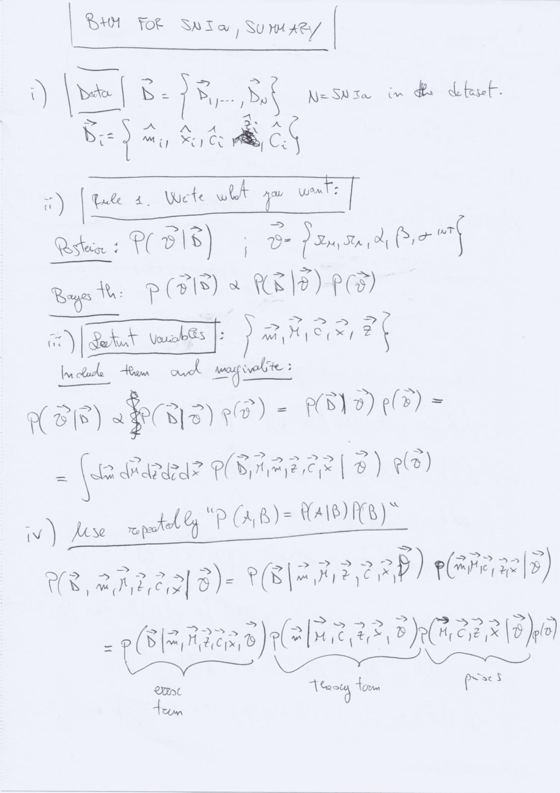
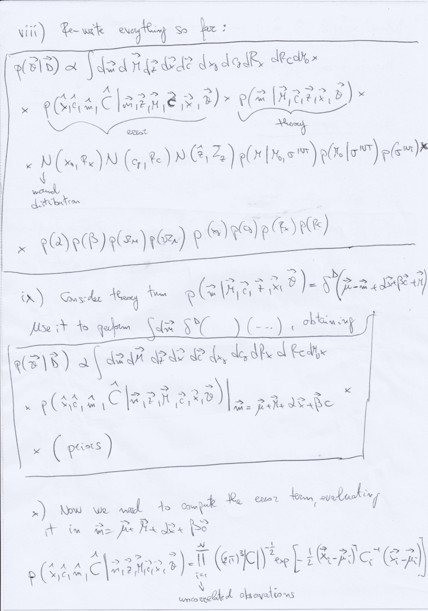

# Bayesian Hierarchical Models for Type Ia Supernovae

Graduate lecture notes in Astro-Statistics and Cosmology, taught by Prof. Michele Liguori at the University of Padua.
Reference index [[Astro-Statistics_and_Cosmology_MOC]]

---

## Type Ia Supernovae as Cosmological Probes

The discovery of cosmic acceleration in 1998 (Riess et al., Perlmutter et al.) relied on Type Ia Supernovae (SNIa) as standardizable candles. SNIa originate from the thermonuclear disruption of carbon-oxygen white dwarfs in binary systems when the degenerate star approaches the Chandrasekhar mass limit ($M_{\text{Ch}} \approx 1.44 \, M_\odot$).

Because the physical trigger is the explosion of a degenerate star at a universal critical mass, their intrinsic peak luminosities are remarkably uniform. However, raw peak absolute magnitudes display intrinsic scatter of $\sim 0.35$ magnitudes, too large for precision cosmology.

In 1993, Mark Phillips discovered an empirical correlation between peak luminosity and light-curve decline rate. Brighter supernovae decline more slowly. Modern light-curve fitters (such as SALT2) parameterize each supernova light curve using three empirical observables
1. The apparent peak magnitude in the rest-frame $B$-band, $\hat{m}_{Bi}$
2. The light-curve stretch (shape) parameter, $\hat{x}_{1i}$
3. The optical color excess parameter, $\hat{c}_i \approx (B - V)_{\text{peak}} - (B - V)_0$.

The empirical standardization equation (the Tripp relation) predicts the distance modulus $\mu_i$ as

$$\mu_i = m_{Bi}^* - (M_0 - \alpha x_{1i} + \beta c_i)$$

where $\alpha$ is the stretch-luminosity slope, $\beta$ is the color-luminosity slope, and $M_0$ is the fiducial absolute magnitude.

Theoretical cosmology predicts the distance modulus as a function of redshift $z_i$ and cosmological parameters $\boldsymbol{\Omega} = (\Omega_m, \Omega_\Lambda, w_0, w_a)$

$$\mu_{\text{theory}}(z_i; \boldsymbol{\Omega}) = 5 \log_{10}\left( \frac{d_L(z_i; \boldsymbol{\Omega})}{10 \, \text{pc}} \right)$$

where $d_L$ is the cosmological luminosity distance.

---

## The Classical Chi-Squared Approach and Its Structural Failures

In classical analyses, cosmological parameters are determined by minimizing a simple chi-squared objective function

$$\chi^2(\boldsymbol{\Omega}, \alpha, \beta, M_0) = \sum_{i=1}^N \frac{\left[ \hat{\mu}_i(\alpha, \beta, M_0) - \mu_{\text{theory}}(z_i; \boldsymbol{\Omega}) \right]^2}{\sigma_{\mu, i}^2 + \sigma_{\text{int}}^2}$$

where the distance modulus error is calculated by linear error propagation

$$\sigma_{\mu, i}^2 = \sigma_{m_B, i}^2 + \alpha^2 \sigma_{x_1, i}^2 + \beta^2 \sigma_{c, i}^2 + 2\alpha C_{m x_1, i} - 2\beta C_{m c, i} - 2\alpha\beta C_{x_1 c, i}$$

and $\sigma_{\text{int}}$ is an ad-hoc intrinsic scatter parameter adjusted by hand until the reduced chi-squared $\chi^2/\nu \approx 1$.

This standard chi-squared approach suffers from multiple fatal statistical flaws
1. Heteroscedastic Covariances - observational uncertainties $\sigma_{m_B}, \sigma_{x_1}, \sigma_c$ vary widely from supernova to supernova and exhibit strong cross-correlations. Fitting $\alpha$ and $\beta$ inside the denominator variance introduces an asymmetric parameter-dependent weight that systematically biases the fitted slopes (Kelly 2007).
2. Errors in Covariates - the classical linear regression model assumes explanatory variables ($x_1, c$) are known exactly without measurement error. In reality, $x_{1i}$ and $c_i$ are noisy estimates. Ignoring covariate measurement error causes attenuation bias (regression dilution), underestimating $\alpha$ and $\beta$.
3. Selection Effects and Malmquist Bias - magnitude-limited surveys detect only supernovae that cross a flux detection threshold. Near the survey limit at high redshift, downward noise fluctuations drop below the detection threshold and are missed, while upward fluctuations are preferentially cataloged. The sample mean magnitude is systematically brighter than the population mean. Treating selected supernovae as an unbiased sample artificially increases the inferred cosmic acceleration.
4. Non-Gaussian Likelihoods - distance modulus is logarithmic in flux. Low signal-to-noise detections exhibit highly asymmetric, non-Gaussian magnitude errors.

---

## The Bayesian Hierarchical Model (BHM) Framework

To resolve these biases simultaneously, modern cosmological analyses formulate the problem as a Bayesian Hierarchical Model (March et al. 2011, Rubin et al. 2015).

A Bayesian Hierarchical Model organizes the complex physical data-generating process into three probabilistic tiers
- Hyperparameters (Level 1) - global cosmological parameters $\boldsymbol{\Omega} = (\Omega_m, w_0, w_a)$, standardization nuisance parameters $\boldsymbol{\theta}_{\text{nuis}} = (\alpha, \beta, M_0)$, intrinsic dispersion $\sigma_{\text{int}}$, and population parameters $\boldsymbol{\theta}_{\text{pop}}$ governing the cosmic distribution of stretch and color.
- Latent Variables (Level 2) - the true, uncorrupted, unobserved physical quantities for each individual supernova $i$, denoted $\boldsymbol{z}_i^{\text{true}} = (M_i^{\text{true}}, x_{1i}^{\text{true}}, c_i^{\text{true}})^T$.
- Observational Data (Level 3) - the noisy measurements $\hat{\boldsymbol{D}}_i = (\hat{m}_{Bi}, \hat{x}_{1i}, \hat{c}_i)^T$ output by light-curve fitting algorithms, along with their individual $3 \times 3$ observational covariance matrices $\boldsymbol{C}_i$.

### Directed Acyclic Graph and Joint Posterior

The causal structure of the hierarchical model forms a Directed Acyclic Graph (DAG)
$$\boldsymbol{\Omega}, \boldsymbol{\theta}_{\text{nuis}}, \sigma_{\text{int}}, \boldsymbol{\theta}_{\text{pop}} \longrightarrow \boldsymbol{z}_i^{\text{true}} \longrightarrow \hat{\boldsymbol{D}}_i$$

By the product rule, the full joint posterior over all parameters and latent variables is

$$p\left(\boldsymbol{\Omega}, \boldsymbol{\theta}_{\text{nuis}}, \sigma_{\text{int}}, \boldsymbol{\theta}_{\text{pop}}, \{\boldsymbol{z}_i^{\text{true}}\}_{i=1}^N \, \middle \mid \, \{\hat{\boldsymbol{D}}_i\}_{i=1}^N \right) \propto \pi(\boldsymbol{\Omega}) \, \pi(\boldsymbol{\theta}_{\text{nuis}}) \, \pi(\sigma_{\text{int}}) \, \pi(\boldsymbol{\theta}_{\text{pop}}) \prod_{i=1}^N p\left(\hat{\boldsymbol{D}}_i \, \middle \mid \, \boldsymbol{z}_i^{\text{true}}\right) \, p\left(\boldsymbol{z}_i^{\text{true}} \, \middle \mid \, \boldsymbol{\Omega}, \boldsymbol{\theta}_{\text{nuis}}, \sigma_{\text{int}}, \boldsymbol{\theta}_{\text{pop}}\right)$$

### Level 3 - Observational Likelihood

Conditional on the true latent values $\boldsymbol{z}_i^{\text{true}}$, the observed data vector $\hat{\boldsymbol{D}}_i = (\hat{m}_{Bi}, \hat{x}_{1i}, \hat{c}_i)^T$ follows a multivariate Gaussian distribution governed by the known observational covariance matrix $\boldsymbol{C}_i$

$$p(\hat{\boldsymbol{D}}_i \mid \boldsymbol{z}_i^{\text{true}}) = \frac{1}{(2\pi)^{3/2} \sqrt{\det \boldsymbol{C}_i}} \exp\left( -\frac{1}{2} (\hat{\boldsymbol{D}}_i - \boldsymbol{D}_i^{\text{true}})^T \boldsymbol{C}_i^{-1} (\hat{\boldsymbol{D}}_i - \boldsymbol{D}_i^{\text{true}}) \right)$$

where the true apparent observables are linked to the true latent variables and cosmology by

$$\boldsymbol{D}_i^{\text{true}} = \begin{pmatrix} \mu_{\text{theory}}(z_i; \boldsymbol{\Omega}) + M_i^{\text{true}} \\ x_{1i}^{\text{true}} \\ c_i^{\text{true}} \end{pmatrix}$$

### Level 2 - Latent Population Prior

The true latent properties of the supernova population are modeled through underlying physical distributions.

The true absolute magnitude $M_i^{\text{true}}$ is centered on the standardized absolute magnitude with intrinsic Gaussian scatter $\sigma_{\text{int}}$

$$p(M_i^{\text{true}} \mid x_{1i}^{\text{true}}, c_i^{\text{true}}, \boldsymbol{\theta}_{\text{nuis}}, \sigma_{\text{int}}) = \frac{1}{\sqrt{2\pi\sigma_{\text{int}}^2}} \exp\left( -\frac{\left[ M_i^{\text{true}} - (M_0 - \alpha x_{1i}^{\text{true}} + \beta c_i^{\text{true}}) \right]^2}{2\sigma_{\text{int}}^2} \right)$$

The true population distributions of stretch and color are modeled as Gaussians (or asymmetric split-normals) with population parameters $\boldsymbol{\theta}_{\text{pop}} = (\bar{x}_*, \sigma_{x*}, \bar{c}_*, \sigma_{c*})$

$$p(x_{1i}^{\text{true}} \mid \bar{x}_*, \sigma_{x*}) = \mathcal{N}(\bar{x}_*, \sigma_{x*}^2) \qquad \text{and} \qquad p(c_i^{\text{true}} \mid \bar{c}_*, \sigma_{c*}) = \mathcal{N}(\bar{c}_*, \sigma_{c*}^2)$$

---

## Analytical Marginalization over Latent Variables

A naive MCMC implementation sampling all latent variables $\{\boldsymbol{z}_i^{\text{true}}\}_{i=1}^N$ requires sampling $3N$ additional parameters. For a modern catalog of $N = 1500$ supernovae (such as Pantheon+), this introduces 4500 nuisance dimensions, rendering MCMC convergence difficult.

However, because both the observational likelihood and the population priors are Gaussian, the latent variables $\boldsymbol{z}_i^{\text{true}}$ can be integrated out analytically in closed form.

Following the derivation from Prof. Liguori's handwritten notes, write the true apparent observables as a linear transformation of the latent vector $\boldsymbol{u}_i \equiv (M_i^{\text{true}} - M_0, \, x_{1i}^{\text{true}} - \bar{x}_*, \, c_i^{\text{true}} - \bar{c}_*)^T$.

Define the linear transformation matrix

$$\boldsymbol{A} \equiv \begin{pmatrix} 1 & -\alpha & \beta \\ 0 & 1 & 0 \\ 0 & 0 & 1 \end{pmatrix}$$

In terms of $\boldsymbol{u}_i$, the expected value of the observed data vector $\hat{\boldsymbol{D}}_i$ is

$$\boldsymbol{m}_i \equiv \langle \hat{\boldsymbol{D}}_i \rangle = \begin{pmatrix} \mu_{\text{theory}}(z_i; \boldsymbol{\Omega}) + M_0 - \alpha \bar{x}_* + \beta \bar{c}_* \\ \bar{x}_* \\ \bar{c}_* \end{pmatrix}$$

The deviation between observed data and expected mean is

$$\hat{\boldsymbol{D}}_i - \boldsymbol{m}_i = \boldsymbol{A} \boldsymbol{u}_i + \boldsymbol{n}_i$$

where $\boldsymbol{n}_i \sim \mathcal{N}(\mathbf{0}, \boldsymbol{C}_i)$ is the observational noise, and $\boldsymbol{u}_i \sim \mathcal{N}(\mathbf{0}, \boldsymbol{\Sigma}_{\text{pop}})$ represents the intrinsic population dispersion

$$\boldsymbol{\Sigma}_{\text{pop}} \equiv \begin{pmatrix} \sigma_{\text{int}}^2 & 0 & 0 \\ 0 & \sigma_{x*}^2 & 0 \\ 0 & 0 & \sigma_{c*}^2 \end{pmatrix}$$

Because $\hat{\boldsymbol{D}}_i - \boldsymbol{m}_i$ is the sum of two independent Gaussian random vectors, the convolution theorem for Gaussians guarantees that the marginalized distribution of $\hat{\boldsymbol{D}}_i$ is an exact multivariate Gaussian.

The total effective covariance matrix for supernova $i$ is

$$\boldsymbol{\Sigma}_i = \boldsymbol{C}_i + \boldsymbol{A} \boldsymbol{\Sigma}_{\text{pop}} \boldsymbol{A}^T$$

Carrying out the matrix multiplication $\boldsymbol{A} \boldsymbol{\Sigma}_{\text{pop}} \boldsymbol{A}^T$

$$\boldsymbol{A} \boldsymbol{\Sigma}_{\text{pop}} \boldsymbol{A}^T = \begin{pmatrix} 1 & -\alpha & \beta \\ 0 & 1 & 0 \\ 0 & 0 & 1 \end{pmatrix} \begin{pmatrix} \sigma_{\text{int}}^2 & 0 & 0 \\ 0 & \sigma_{x*}^2 & 0 \\ 0 & 0 & \sigma_{c*}^2 \end{pmatrix} \begin{pmatrix} 1 & 0 & 0 \\ -\alpha & 1 & 0 \\ \beta & 0 & 1 \end{pmatrix} = \begin{pmatrix} \sigma_{\text{int}}^2 + \alpha^2 \sigma_{x*}^2 + \beta^2 \sigma_{c*}^2 & -\alpha \sigma_{x*}^2 & \beta \sigma_{c*}^2 \\ -\alpha \sigma_{x*}^2 & \sigma_{x*}^2 & 0 \\ \beta \sigma_{c*}^2 & 0 & \sigma_{c*}^2 \end{pmatrix}$$

Adding the observational covariance $\boldsymbol{C}_i$ yields the complete effective covariance matrix $\boldsymbol{\Sigma}_i$.

The marginalized likelihood for supernova $i$ integrates to the closed-form analytic expression

$$p\left(\hat{\boldsymbol{D}}_i \, \middle \mid \, \boldsymbol{\Omega}, \boldsymbol{\theta}_{\text{nuis}}, \sigma_{\text{int}}, \boldsymbol{\theta}_{\text{pop}}\right) = \frac{1}{(2\pi)^{3/2} \sqrt{\det \boldsymbol{\Sigma}_i}} \exp\left( -\frac{1}{2} (\hat{\boldsymbol{D}}_i - \boldsymbol{m}_i)^T \boldsymbol{\Sigma}_i^{-1} (\hat{\boldsymbol{D}}_i - \boldsymbol{m}_i) \right)$$

This reduction shrinks the MCMC parameter space from thousands of latent coordinates to just a handful of global hyperparameters $(\boldsymbol{\Omega}, \alpha, \beta, M_0, \sigma_{\text{int}}, \bar{x}_*, \sigma_{x*}, \bar{c}_*, \sigma_{c*})$, allowing rapid, exact sampling.

---

## Correcting Malmquist and Survey Selection Biases

To eliminate selection effects, the hierarchical likelihood must explicitly condition on the event that the supernova was detected by the survey instrument.

Let $S_i = 1$ denote the binary proposition that supernova $i$ satisfied all telescope trigger, spectroscopic confirmation, and quality cut criteria.

By Bayes' rule, the likelihood conditional on detection is

$$p(\hat{\boldsymbol{D}}_i \mid \boldsymbol{\theta}, S_i = 1) = \frac{p(S_i = 1 \mid \hat{\boldsymbol{D}}_i) \, p(\hat{\boldsymbol{D}}_i \mid \boldsymbol{\theta})}{P(S_i = 1 \mid \boldsymbol{\theta})}$$

where $p(S_i = 1 \mid \hat{\boldsymbol{D}}_i)$ is the detection efficiency (survey selection function) as a function of measured magnitude and color.

The denominator $P(S_i = 1 \mid \boldsymbol{\theta})$ represents the expected fraction of the underlying supernova population that would be detected under cosmological parameters $\boldsymbol{\theta}$

$$P(S_i = 1 \mid \boldsymbol{\theta}) = \int p(S_i = 1 \mid \hat{\boldsymbol{D}}) \, p(\hat{\boldsymbol{D}} \mid \boldsymbol{\theta}) \, d\hat{\boldsymbol{D}}$$

The total log-likelihood for the survey catalog is

$$\ln \mathcal{L}_{\text{total}}(\boldsymbol{\theta}) = \sum_{i=1}^N \ln p(\hat{\boldsymbol{D}}_i \mid \boldsymbol{\theta}) - \sum_{i=1}^N \ln P(S_i = 1 \mid \boldsymbol{\theta}) + \sum_{i=1}^N \ln p(S_i = 1 \mid \hat{\boldsymbol{D}}_i)$$

The denominator normalization term penalizes parameter configurations that predict a massive population of bright detectable supernovae where none were observed. This term naturally debiases the fitted cosmological parameters, removing spurious acceleration signals caused by flux truncation.

---

## Conceptual Connections

- [[Astro-Statistics_and_Cosmology_MOC]] - Master syllabus map of content
- [[02_Parameter_Estimation_Gaussian_Noise_and_Credible_Intervals]] - Likelihood derivation and credible intervals
- [[03_Multivariate_Gaussians_Marginalization_Conditioning_and_Linear_Models]] - Analytical marginalization of Gaussian block matrices
- [[05_Monte_Carlo_Metropolis_Hastings_and_MCMC_Convergence_Diagnostics]] - MCMC algorithms applied to cosmological likelihoods
- [[06_Fisher_Information_Matrix_Cramer_Rao_Bound_and_Survey_Forecasting]] - Fisher matrix calculation for dark energy equation of state parameters

## Lecture Visuals & Hierarchical Bayesian Modeling

*Figure AST-05: Graphical Directed Acyclic Graph (DAG) for Type Ia Supernovae Bayesian Hierarchical Modeling (BHM). The model decouples cosmological parameters $(\Omega_m, \Omega_\Lambda, w)$ from nuisance calibration parameters $(\alpha, \beta, M_0)$ and latent true stretch $x_1$ and color $c$, rigorously accounting for observational selection effects and intrinsic magnitude dispersion $\sigma_{\mathrm{int}}$.*

*Figure AST-06: Posterior parameter constraints and residual Hubble diagram from the hierarchical supernova pipeline. Marginalizing over individual latent distances analytically or via Gibbs/No-U-Turn sampling prevents Malmquist bias and provides unbiased cosmological parameter recovery.*

## Linked References

- [[Bayesian hierarchical modeling for Type Ia supernovae]]
- [[Astro-Statistics_and_Cosmology_MOC]]

