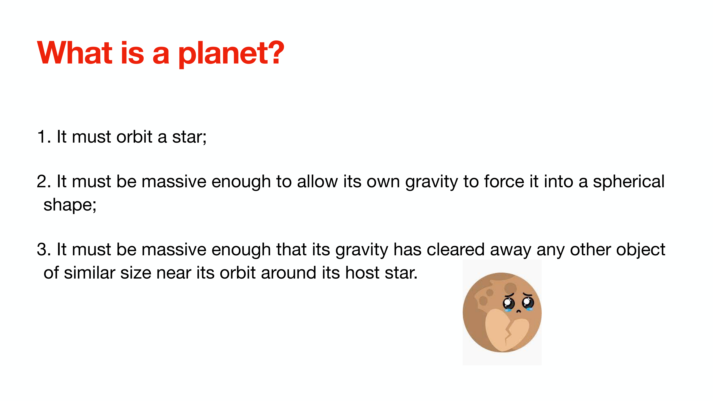
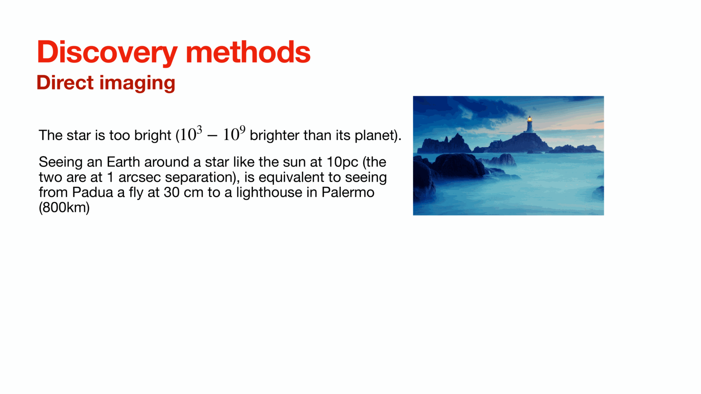
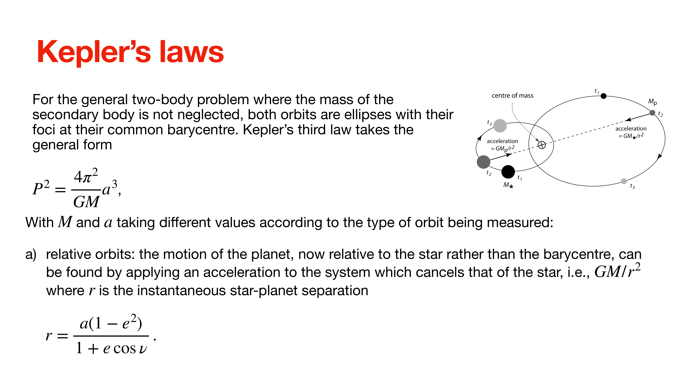

# Lesson 04 – Exoplanet Demographics, Orbital Mechanics, and Transits

*Computational Astrophysics, Prof. Tiziano Zingales*  
*Index: [[Computational_Astrophysics_MOC]]*

---

## Exoplanet Demographics and Detection Physics

The International Astronomical Union (IAU 2006) defines a planet within the Solar System as a celestial body that:
1. Orbits the host star.
2. Has sufficient mass for its self-gravity to overcome rigid body forces and assume hydrostatic equilibrium (a nearly round shape).
3. Has cleared the neighborhood around its orbit.

For extrasolar planets (exoplanets), the operational working definition extends to substellar companions with true masses below the deuterium burning limiting mass ($\approx 13 M_{\text{Jup}}$) that orbit stars, brown dwarfs, or stellar remnants. As of today, over 7,000 confirmed exoplanets across more than 5,000 planetary systems are documented in astronomical databases (e.g., [exoplanet.eu](https://exoplanet.eu)).

```
+-----------------------------------------------------------------------------------------+
|                                EXOPLANET DETECTION METHODS                              |
+----------------------+--------------------+---------------------+-----------------------+
| Method               | Primary Observable | Physical Constraint | Dominant Missions     |
+----------------------+--------------------+---------------------+-----------------------+
| Transit Photometry   | Flux drop \Delta F | Radius ratio Rp/Rs  | Kepler, K2, TESS, PLATO|
| Radial Velocity (RV) | Doppler shift \Delta\lambda| Min. mass Mp sin i  | HARPS, ESPRESSO, HIRES|
| Direct Imaging       | Resolved photons   | Thermal emission/albedo| SPHERE, GPI, JWST NIRCam|
| Microlensing         | Gravitational lens | Mass ratio q = Mp/Ms| OGLE, MOA, Roman ST   |
| Astrometry           | Angular wobble     | 3D orbit & true mass| Gaia                  |
+----------------------+--------------------+---------------------+-----------------------+
```

### Direct Imaging and the Contrast Ratio Challenge
Direct imaging detects thermal emission or reflected stellar light from widely separated, young gas giants. The fundamental observational bottleneck is the extreme contrast ratio:

$$\frac{F_p}{F_*} \approx 10^{-4} - 10^{-10}$$

At a distance of $d = 10\text{ pc}$, an Earth-Sun analog has an angular separation of $\theta = a / d = 1\text{ AU} / 10\text{ pc} = 0.1''$ (100 milliarcseconds). Resolving such a system requires high-order Extreme Adaptive Optics (ExAO) coupled with coronagraphs (Lyot, vector vortex) to suppress stellar diffraction rings.

---

## Keplerian Two-Body Orbital Mechanics in Three Dimensions

The relative motion of a planet of mass $M_p$ orbiting a host star of mass $M_*$ under Newtonian gravitation is governed by the two-body central force equation:

$$\mu \frac{d^2 \mathbf{r}}{dt^2} = -\frac{G M_* M_p}{r^2} \hat{\mathbf{r}}$$

where $\mu = \frac{M_* M_p}{M_* + M_p}$ is the reduced mass, and $\mathbf{r}$ is the separation vector. In polar coordinates $(r, \nu)$ centered on the star:

$$r(\nu) = \frac{a(1 - e^2)}{1 + e \cos \nu}$$

where $a$ is the semi-major axis, $e$ is the orbital eccentricity, and $\nu$ is the **true anomaly** (angular displacement from periastron).

```
                      Plane of the Sky (Reference Plane)
                                  Z (Line of Sight)
                                  │
                                  │      Orbit Normal
                                  │     ↗
                                  │   /  inclination i
                                  │ /
                   ───────────────┼─────────────── X (East)
                                 /│
                                / │
                               /  │
                              v   Y (North)
                      Ascending Node 
```

### The Seven Classical Keplerian Orbital Elements
1. $a$: Semi-major axis (defines orbit scale).
2. $e$: Eccentricity ($0 \le e < 1$ for bound elliptical orbits).
3. $P$: Orbital period, linked to $a$ and masses via Kepler's Third Law.
4. $t_p$: Epoch of periastron passage (reference time coordinate).
5. $i$: Orbital inclination with respect to the plane of the sky ($i = 0^\circ$ is face-on, $i = 90^\circ$ is edge-on).
6. $\Omega$: Longitude of the ascending node (measured in the sky plane eastward from North).
7. $\omega$: Argument of periastron (angle from ascending node to periastron in the orbital plane).

Auxiliary angular relations:
- Longitude of periastron: $\tilde{\omega} = \Omega + \omega$
- True longitude: $\theta = \tilde{\omega} + \nu$
- Mean longitude: $\lambda = \tilde{\omega} + M(t)$

---

## The Radial Velocity (Doppler) Semi-Amplitude

The motion of the star around the system barycenter produces a time-varying stellar velocity along the observer's line of sight ($z$-axis):

$$z_*(t) = -r_*(t) \sin i \sin(\omega + \nu)$$

Differentiating with respect to time yields the stellar radial velocity $v_r$:

$$v_r(t) = \dot{z}_*(t) = K \left[ \cos(\omega + \nu(t)) + e \cos \omega \right] + \gamma$$

where $\gamma$ is the systemic barycentric radial velocity, and $K$ is the **radial velocity semi-amplitude**:

$$K = \frac{2\pi}{P} \frac{a_* \sin i}{\sqrt{1 - e^2}} = \left(\frac{2\pi G}{P}\right)^{1/3} \frac{M_p \sin i}{(M_* + M_p)^{2/3}} \frac{1}{\sqrt{1 - e^2}}$$

For planets where $M_p \ll M_*$ on circular orbits ($e = 0$):

$$K \approx 28.4\text{ m s}^{-1} \left(\frac{P}{1\text{ yr}}\right)^{-1/3} \left(\frac{M_p \sin i}{M_{\text{Jup}}}\right) \left(\frac{M_*}{M_\odot}\right)^{-2/3}$$

### Observable Scales
- **Jupiter at 5.2 AU** ($P \approx 11.9\text{ yr}$): $K_{\text{Jup}} \approx 12.5\text{ m s}^{-1}$
- **Hot Jupiter (51 Pegasi b)** ($P \approx 4.23\text{ d}$): $K \approx 56\text{ m s}^{-1}$ (Mayor & Queloz 1995, Nobel Prize 2019)
- **Earth at 1 AU** ($P = 1.0\text{ yr}$): $K_\oplus \approx 0.09\text{ m s}^{-1} = 9\text{ cm s}^{-1}$ (state-of-the-art limit for instruments like ESPRESSO)

Because radial velocity measures only the line-of-sight velocity component, RV surveys determine only the **minimum mass**: $M_p \sin i$.

---

## Transit Photometry: Geometry and Observables

When an exoplanet's orbital plane is aligned close to the line of sight ($i \approx 90^\circ$), the planet periodically occults a fraction of the stellar disk.

```
       Contact I       Contact II                    Contact III      Contact IV
           │               │                              │               │
       ────┐               ┌──────────────────────────────┐               ┌────
           │\             /                                \             /│
           │ \           /                                  \           / │
           │  \_________/                                    \_________/  │
           │                                                              │
           ◄──────────────────────── t_T (Total Duration) ────────────────►
                           ◄──────── t_F (Flat Duration) ─►
```

### 1. Geometric Transit Probability
Assuming an isotropic distribution of orbital angular momentum vectors, the probability $\mathcal{P}_{\text{tr}}$ that a planet on a circular orbit passes across any part of the stellar disk is given by the solid angle ratio:

$$\mathcal{P}_{\text{tr}} = \frac{R_* + R_p}{a} \approx \frac{R_*}{a}$$

- For Earth orbiting the Sun ($a = 1\text{ AU} \approx 215 R_\odot$): $\mathcal{P}_{\text{tr}} = \frac{1}{215} \approx 0.47\%$
- For a Hot Jupiter ($a = 0.05\text{ AU} \approx 10 R_\odot$): $\mathcal{P}_{\text{tr}} = \frac{1}{10} = 10\%$

### 2. Primary Transit Observables
A primary transit light curve is characterized by four primary parameters:
1. Orbital period $P$
2. Transit depth $\delta$:
   $$\delta \equiv \frac{\Delta F}{F} = \left(\frac{R_p}{R_*}\right)^2$$
   - Hot Jupiter around Solar star: $\delta \approx (0.1)^2 = 10^{-2} = 1\%$ ($10,000\text{ ppm}$)
   - Earth around Solar star: $\delta \approx (0.009)^2 \approx 8.4 \times 10^{-5} \approx 84\text{ ppm}$
3. Total duration $t_T$ (First contact $t_I$ to fourth contact $t_{IV}$)
4. Full transit duration $t_F$ (Second contact $t_{II}$ to third contact $t_{III}$)

### 3. Impact Parameter and Chord Geometry
The impact parameter $b$ is the projected distance between the planetary center and the stellar center at mid-transit, normalized by the stellar radius:

$$b \equiv \frac{a \cos i}{R_*}$$

For a central transit, $b = 0$ ($i = 90^\circ$). The transit condition requires $b \le 1 + \frac{R_p}{R_*}$.

Using trigonometry, the transit durations relate to $b$ and the scaled radius $p = R_p / R_*$:

$$t_T = \frac{P}{\pi} \arcsin\left( \frac{R_*}{a} \frac{\sqrt{(1 + p)^2 - b^2}}{\sin i} \right)$$

$$t_F = \frac{P}{\pi} \arcsin\left( \frac{R_*}{a} \frac{\sqrt{(1 - p)^2 - b^2}}{\sin i} \right)$$

---

## Analytical Inversion and Stellar Density (Seager & Mallén-Ornelas 2003)

Under the assumption of a circular orbit ($e = 0$) and negligible limb darkening, Seager & Mallén-Ornelas (2003) demonstrated that **a high-precision transit light curve uniquely constrains the mean stellar density $\rho_*$ without requiring prior knowledge of the star**:

$$b = \left[ \frac{(1 - \sqrt{\delta})^2 - \frac{\sin^2(t_F \pi / P)}{\sin^2(t_T \pi / P)} (1 + \sqrt{\delta})^2}{1 - \frac{\sin^2(t_F \pi / P)}{\sin^2(t_T \pi / P)}} \right]^{1/2}$$

$$\frac{a}{R_*} = \left[ \frac{(1 + \sqrt{\delta})^2 - b^2 \cos^2(t_T \pi / P)}{\sin^2(t_T \pi / P)} \right]^{1/2}$$

Combining this with Kepler's Third Law ($P^2 = \frac{4\pi^2 a^3}{G M_*}$ for $M_p \ll M_*$):

$$\rho_* \equiv \frac{M_*}{R_*^3} = \frac{4\pi^2}{G P^2} \left(\frac{a}{R_*}\right)^3$$

In the small-angle approximation ($t_T \pi / P \ll 1$ and $R_* \ll a$):

$$b \approx \left[ \frac{(1 - \sqrt{\delta})^2 - (t_F / t_T)^2 (1 + \sqrt{\delta})^2}{1 - (t_F / t_T)^2} \right]^{1/2}$$

$$\rho_* \approx \frac{32 P}{G \pi \delta^{3/4}} \left( t_T^2 - t_F^2 \right)^{-3/2}$$

When combined with an empirical stellar mass-radius relation ($R_* / R_\odot \approx (M_* / M_\odot)^x$ where $x \approx 0.8$ for main-sequence dwarfs), the system is closed: $M_*, R_*, a, i,$ and $R_p$ are uniquely determined purely from photometric time series.

---

## Stellar Limb Darkening and Mandel & Agol (2002) Analytical Models

A real stellar atmosphere is not a uniform disk. Due to temperature gradients with optical depth, rays emerging at inclined angles $\theta$ sample cooler, higher layers, causing the stellar disk to appear dimmer near its limbs.

```
       Center of Disk (theta = 0, mu = 1) ───> Probes deep, hot, high-T layers (High Intensity)
       Limb of Disk   (theta = pi/2, mu = 0) ─> Probes shallow, cool layers   (Low Intensity)
```

### Limb Darkening Laws
Defining $\mu = \cos \theta = \sqrt{1 - (r / R_*)^2}$:
1. **Linear law**:
   $$\frac{I(\mu)}{I(1)} = 1 - u (1 - \mu)$$
2. **Quadratic law**:
   $$\frac{I(\mu)}{I(1)} = 1 - u_1 (1 - \mu) - u_2 (1 - \mu)^2$$
3. **Claret (2000) 4-parameter non-linear law**:
   $$\frac{I(\mu)}{I(1)} = 1 - \sum_{n=1}^4 c_n \left(1 - \mu^{n/2}\right)$$

### The Mandel & Agol (2002) Formulation
Mandel & Agol solved the overlapping circle geometry analytically. Let $p = R_p / R_*$ and $z = d / R_*$ (normalized projected separation between planetary center and stellar center):
- **Out of transit** ($z \ge 1 + p$):
  $$\lambda(p, z) = 0$$
- **Total eclipse / full ingress** ($z \le 1 - p$):
  $$\lambda(p, z) = p^2 \quad \text{(uniform source)}$$
- **Ingress / Egress phase** ($1 - p < z < 1 + p$):
  $$\lambda(p, z) = \frac{1}{\pi} \left[ p^2 \kappa_0 + \kappa_1 - \sqrt{\frac{4 z^2 - (1 + z^2 - p^2)^2}{4}} \right]$$
  where:
  $$\kappa_0 = \arccos\left(\frac{p^2 + z^2 - 1}{2 p z}\right), \quad \kappa_1 = \arccos\left(\frac{1 - p^2 + z^2}{2 z}\right)$$

In the presence of limb darkening, the normalized flux is evaluated by integrating over annular rings:

$$F(p, z) = 1 - \left[ \int_0^1 I(r) 2r dr \right]^{-1} \int_0^1 \frac{\partial}{\partial r} \left[ F_{\text{unif}}\left(\frac{p}{r}, \frac{z}{r}\right) r^2 \right] I(r) dr$$

This analytical formalism is implemented in the C-accelerated Python package `batman`.

---

## Stellar Activity and Instrumental Systematics

Real space-based photometric light curves (from Kepler, K2, TESS) deviate from idealized models due to astrophysical and instrumental noise:
- **Occulted Starspots**: When the transiting planet occults a cooler starspot on the stellar surface, the missing flux is temporarily reduced, causing a **positive flux anomaly (bump)** inside the transit trough.
- **Unocculted Starspots**: Dim the mean stellar flux outside transit, causing the observed transit depth $\delta_{\text{obs}} = \frac{R_p^2}{R_*^2 (1 - f_{\text{spot}})}$ to appear artificially deeper.
- **Instrumental Noise**: Kepler's K2 mission suffered from reaction wheel failures, requiring thruster firings every 6 hours to correct roll drift against solar radiation pressure. This introduced periodic sawtooth systematic trends that must be detrended using Gaussian Processes or spline filtering.

---

## Related Notes
- [[00_Course_Overview_and_Computational_Laboratories]]
- [[03_Modular_Python_Software_Architecture_and_Packaging]]
- [[05_Machine_Learning_Foundations_and_Regression_Models]]
- [[08_Exoplanet_Atmospheric_Retrieval_Frameworks_and_TauREx]]
- [[Transit Modeling with batman]]
- [[Limb Darkening Computation with ldtk]]


## Computational Visuals & Keplerian Solvers


*Figure COMP-01: Numerical solution of Kepler's Equation $M = E - e \sin E$ using Newton-Raphson iteration. Maps Mean Anomaly $M$ to Eccentric Anomaly $E$ and True Anomaly $\nu$.*


*Figure COMP-02: Geometric occultation model computing projected star-planet center separation $z = d/R_*$ as a function of orbital phase and inclination.*


*Figure COMP-03: Computational speed and accuracy benchmark of Mandel & Agol analytical limb-darkened transit evaluation versus numerical 2D pixel integration.*


## Linked References

- [[Computational_Astrophysics_MOC]]


