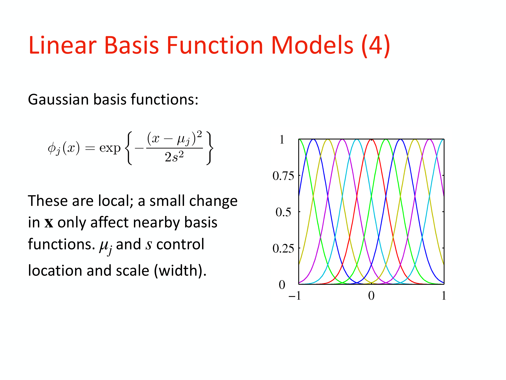

# Lesson 05 – Machine Learning Foundations and Regression Models

*Computational Astrophysics, Prof. Tiziano Zingales*  
*Index: [[Computational_Astrophysics_MOC]]*

---

## Machine Learning Taxonomy in Astrophysical Contexts

Astronomical surveys (such as Kepler, TESS, Gaia, Rubin LSST, and Euclid) generate data volumes in the terabyte and petabyte regimes, rendering manual inspection impossible. Machine Learning (ML) provides algorithms that learn patterns directly from empirical data to perform automated inference.

```
                                  [Machine Learning]
                                          │
         ┌────────────────────────────────┼────────────────────────────────┐
         v                                v                                v
[Supervised Learning]          [Unsupervised Learning]         [Reinforcement Learning]
  • Targets t provided           • No labels; structure discov.   • Agent, states, actions,
  • Regression: t \in \mathbb{R} • Clustering (k-means, GMM)       environment rewards
  • Classification: C_k labels   • Dimensionality red. (PCA)     • Adaptive telescope scheduling
```

1. **Supervised Learning**: Given a training set of $N$ paired inputs and targets $\{\mathbf{x}_n, t_n\}_{n=1}^N$, infer a mapping function $y(\mathbf{x})$ that generalizes to unseen inputs.
   - **Regression**: Continuous target variables (e.g., predicting stellar effective temperature $T_{\text{eff}}$, planetary radius $R_p$, or photometric redshift $z$).
   - **Classification**: Categorical class assignments (e.g., classifying light curve dips into true exoplanet transits, eclipsing binaries, or instrumental false alarms).
2. **Unsupervised Learning**: Unlabeled inputs $\{\mathbf{x}_n\}$. Identify underlying geometric clusters, low-dimensional manifolds, or probability density distributions (e.g., detrending Spitzer/IRAC intra-pixel sensitivity drift, discovering anomalous stellar spectra).
3. **Reinforcement Learning**: An agent maximizes cumulative reward signals through trial-and-error policy updates (e.g., dynamic observation scheduling on robotic observatories).

---

## Linear Basis Function Models for Regression

The standard linear regression model relates a $D$-dimensional input vector $\mathbf{x} = (x_1, \dots, x_D)^T$ to a scalar output:

$$y(\mathbf{x}, \mathbf{w}) = w_0 + w_1 x_1 + \dots + w_D x_D = w_0 + \mathbf{w}_{1:D}^T \mathbf{x}$$

While this model is linear in the parameters $\mathbf{w}$, it is severely constrained by its linearity in the input coordinates $\mathbf{x}$. To model non-linear physical phenomena while preserving linear parameter tractability, we project inputs into a feature space via $M$ fixed non-linear **basis functions** $\phi_j(\mathbf{x})$:

$$y(\mathbf{x}, \mathbf{w}) = w_0 + \sum_{j=1}^{M-1} w_j \phi_j(\mathbf{x})$$

Defining a dummy zeroth basis function $\phi_0(\mathbf{x}) \equiv 1$, the model simplifies to a vector inner product:

$$y(\mathbf{x}, \mathbf{w}) = \sum_{j=0}^{M-1} w_j \phi_j(\mathbf{x}) = \mathbf{w}^T \boldsymbol{\phi}(\mathbf{x})$$

where $\mathbf{w} = (w_0, w_1, \dots, w_{M-1})^T$ and $\boldsymbol{\phi}(\mathbf{x}) = (\phi_0(\mathbf{x}), \phi_1(\mathbf{x}), \dots, \phi_{M-1}(\mathbf{x}))^T$.

```
Input Space (x)  ───[Non-linear mapping \phi(x)]───>  Feature Space \phi \in \mathbb{R}^M  ───[\mathbf{w}^T \phi]───>  Output y
```

### Standard Basis Function Families
1. **Polynomial Basis**:
   $$\phi_j(x) = x^j$$
   *Properties*: Global support. Altering an input value $x$ alters the response across all basis functions simultaneously. Highly susceptible to Runge's phenomenon (oscillations near domain boundaries).
2. **Gaussian Basis**:
   $$\phi_j(x) = \exp\left( -\frac{(x - \mu_j)^2}{2 s^2} \right)$$
   *Properties*: Localized support. The center $\mu_j$ governs the location in input space, and scale parameter $s$ governs the spatial width.
3. **Sigmoidal Basis**:
   $$\phi_j(x) = \sigma\left( \frac{x - \mu_j}{s} \right) = \frac{1}{1 + \exp\left(-\frac{x - \mu_j}{s}\right)}$$
   *Properties*: Smooth step transitions. Related to the hyperbolic tangent via $\tanh(a) = 2\sigma(2a) - 1$.
4. **Fourier and Wavelet Bases**:
   Mutually orthogonal representations localized in both frequency and spatial/temporal domains, suited for astronomical time series and transit ingress/egress profile decomposition.

---

## Maximum Likelihood and the Normal Equations

Assume the observed target variable $t$ is generated by an underlying deterministic function $y(\mathbf{x}, \mathbf{w})$ corrupted by additive zero-mean Gaussian noise $\epsilon \sim \mathcal{N}(0, \beta^{-1})$:

$$t = y(\mathbf{x}, \mathbf{w}) + \epsilon = \mathbf{w}^T \boldsymbol{\phi}(\mathbf{x}) + \epsilon$$

where $\beta \equiv \frac{1}{\sigma^2}$ denotes the **noise precision**. The conditional probability density of the target is:

$$p(t \mid \mathbf{x}, \mathbf{w}, \beta) = \mathcal{N}(t \mid \mathbf{w}^T \boldsymbol{\phi}(\mathbf{x}), \beta^{-1}) = \sqrt{\frac{\beta}{2\pi}} \exp\left( -\frac{\beta}{2} \left[ t - \mathbf{w}^T \boldsymbol{\phi}(\mathbf{x}) \right]^2 \right)$$

Given an independent and identically distributed (i.i.d.) dataset $\mathbf{X} = \{\mathbf{x}_1, \dots, \mathbf{x}_N\}$ with target vector $\mathbf{t} = (t_1, \dots, t_N)^T$, the joint likelihood function evaluates to:

$$p(\mathbf{t} \mid \mathbf{X}, \mathbf{w}, \beta) = \prod_{n=1}^N \mathcal{N}(t_n \mid \mathbf{w}^T \boldsymbol{\phi}(\mathbf{x}_n), \beta^{-1})$$

Taking the natural logarithm:

$$\ln p(\mathbf{t} \mid \mathbf{X}, \mathbf{w}, \beta) = \frac{N}{2} \ln \beta - \frac{N}{2} \ln(2\pi) - \beta E_D(\mathbf{w})$$

where $E_D(\mathbf{w})$ is the standard **Sum-of-Squares Error**:

$$E_D(\mathbf{w}) = \frac{1}{2} \sum_{n=1}^N \left\{ t_n - \mathbf{w}^T \boldsymbol{\phi}(\mathbf{x}_n) \right\}^2$$

### Derivation of the Maximum Likelihood Weights $\mathbf{w}_{\text{ML}}$
Maximizing the log-likelihood with respect to $\mathbf{w}$ is mathematically identical to minimizing the sum-of-squares error $E_D(\mathbf{w})$. Computing the gradient:

$$\nabla_{\mathbf{w}} \ln p(\mathbf{t} \mid \mathbf{X}, \mathbf{w}, \beta) = \sum_{n=1}^N \left\{ t_n - \mathbf{w}^T \boldsymbol{\phi}(\mathbf{x}_n) \right\} \boldsymbol{\phi}(\mathbf{x}_n)^T$$

Setting the gradient to zero:

$$\sum_{n=1}^N t_n \boldsymbol{\phi}(\mathbf{x}_n)^T - \mathbf{w}^T \left( \sum_{n=1}^N \boldsymbol{\phi}(\mathbf{x}_n) \boldsymbol{\phi}(\mathbf{x}_n)^T \right) = \mathbf{0}$$

We define the $N \times M$ **Design Matrix** $\boldsymbol{\Phi}$:

$$\boldsymbol{\Phi} = \begin{pmatrix} \phi_0(\mathbf{x}_1) & \phi_1(\mathbf{x}_1) & \dots & \phi_{M-1}(\mathbf{x}_1) \\ \phi_0(\mathbf{x}_2) & \phi_1(\mathbf{x}_2) & \dots & \phi_{M-1}(\mathbf{x}_2) \\ \vdots & \vdots & \ddots & \vdots \\ \phi_0(\mathbf{x}_N) & \phi_1(\mathbf{x}_N) & \dots & \phi_{M-1}(\mathbf{x}_N) \end{pmatrix}$$

Rewriting in compact matrix notation yields the classical **Normal Equations**:

$$\boldsymbol{\Phi}^T \boldsymbol{\Phi} \mathbf{w} = \boldsymbol{\Phi}^T \mathbf{t}$$

Solving for $\mathbf{w}$ yields the analytic closed-form Maximum Likelihood estimator:

$$\mathbf{w}_{\text{ML}} = \left( \boldsymbol{\Phi}^T \boldsymbol{\Phi} \right)^{-1} \boldsymbol{\Phi}^T \mathbf{t} \equiv \boldsymbol{\Phi}^\dagger \mathbf{t}$$

where $\boldsymbol{\Phi}^\dagger$ is the **Moore-Penrose pseudo-inverse** of the design matrix $\boldsymbol{\Phi}$.

### Analytical Precision Estimator
Differentiating $\ln p$ with respect to $\beta$ and equating to zero yields the Maximum Likelihood noise variance:

$$\frac{1}{\beta_{\text{ML}}} = \sigma_{\text{ML}}^2 = \frac{1}{N} \sum_{n=1}^N \left\{ t_n - \mathbf{w}_{\text{ML}}^T \boldsymbol{\phi}(\mathbf{x}_n) \right\}^2$$

---

## Regularization and the Bias-Variance Tradeoff

When the number of basis functions $M$ approaches or exceeds the number of observations $N$, $\boldsymbol{\Phi}^T \boldsymbol{\Phi}$ becomes near-singular and weights oscillate wildly, causing catastrophic **overfitting**.

To enforce smooth solutions, an explicit penalty term is added to the objective function:

$$E_{\text{reg}}(\mathbf{w}) = E_D(\mathbf{w}) + \frac{\lambda}{2} \sum_{j=1}^{M-1} \lvert w_j\rvert^q$$

```
q = 2 : Ridge Regression (L2)         q = 1 : Lasso Regression (L1)
           w2                                    w2
           │   Contour of E_D                   │   Contour of E_D
           │     ╭───╮                          │     ╭───╮
        ───┼───╭─┴───┴─╮──> w1               ───┼───╭─┴───┴─╮──> w1
         ◯ │   ╰───────╯                      ◇ │   ╰───────╯
      L2 Sphere: shrinks weights           L1 Diamond: forces exact zeros
```

1. **Ridge Regression ($L_2$ Regularization / Tikhonov)** ($q = 2$):
   $$E(\mathbf{w}) = \frac{1}{2} \sum_{n=1}^N \left\{ t_n - \mathbf{w}^T \boldsymbol{\phi}(\mathbf{x}_n) \right\}^2 + \frac{\lambda}{2} \mathbf{w}^T \mathbf{w}$$
   The normal equations remain closed-form and well-conditioned:
   $$\mathbf{w}_{\text{Ridge}} = \left( \boldsymbol{\Phi}^T \boldsymbol{\Phi} + \lambda \mathbf{I} \right)^{-1} \boldsymbol{\Phi}^T \mathbf{t}$$
2. **Lasso Regression ($L_1$ Regularization)** ($q = 1$):
   Corners of the $L_1$ norm constraint diamond touch the error contours along coordinate axes, driving irrelevant model weights identically to zero, performing automatic **feature selection**.

---

## Optimization: Gradient Descent and Stochastic Gradient Descent (SGD)

When evaluating datasets containing millions of cadence points (e.g., full Kepler or TESS light curve sectors), inverting the $M \times M$ matrix $\boldsymbol{\Phi}^T \boldsymbol{\Phi}$ (computational complexity $\mathcal{O}(M^3)$) is prohibitive. Iterative gradient-based optimization updates parameters sequentially.

### Batch Gradient Descent
$$\mathbf{w}^{(\tau + 1)} = \mathbf{w}^{(\tau)} - \eta \nabla E(\mathbf{w}^{(\tau)})$$

where $\eta > 0$ is the **learning rate**. Evaluating $\nabla E$ requires sweeping over all $N$ data points at every iteration step $\tau$.

### Stochastic Gradient Descent (SGD)
SGD approximates the gradient of the total dataset by evaluating the gradient of a single randomly sampled observation $n$ (or small mini-batch):

$$\mathbf{w}^{(\tau + 1)} = \mathbf{w}^{(\tau)} - \eta \nabla E_n(\mathbf{w}^{(\tau)})$$

For the sum-of-squares error, this yields the **Least-Mean-Squares (LMS)** update rule:

$$\mathbf{w}^{(\tau + 1)} = \mathbf{w}^{(\tau)} + \eta \left( t_n - \mathbf{w}^{(\tau)T} \boldsymbol{\phi}(\mathbf{x}_n) \right) \boldsymbol{\phi}(\mathbf{x}_n)$$

**Advantages of SGD in Astronomy**:
- Drastically reduced per-iteration computational cost ($\mathcal{O}(M)$ rather than $\mathcal{O}(NM)$).
- Escapes shallow local minima and saddle points due to stochastic gradient fluctuations.
- Enables streaming "online" learning as continuous telescope data arrives.

---

## Linear Classification: Fisher's Linear Discriminant

In classification, we project a high-dimensional feature vector $\mathbf{x}$ onto a scalar discriminant $y = \mathbf{w}^T \mathbf{x}$. 

If class distributions possess strongly anisotropic, non-diagonal covariance matrices, projecting onto the vector connecting the class means $\mathbf{w} \propto (\mathbf{m}_2 - \mathbf{m}_1)$ results in heavy overlap. **Ronald Fisher (1936)** introduced an objective function that simultaneously **maximizes between-class separation while minimizing within-class variance**.

```
Projected Between-Class Variance:   S_B = (\mathbf{m}_2 - \mathbf{m}_1)(\mathbf{m}_2 - \mathbf{m}_1)^T
Projected Within-Class Variance:    S_W = \sum_{n \in C_1} (\mathbf{x}_n - \mathbf{m}_1)(\mathbf{x}_n - \mathbf{m}_1)^T + \sum_{n \in C_2} (\mathbf{x}_n - \mathbf{m}_2)(\mathbf{x}_n - \mathbf{m}_2)^T
```

The Fisher criterion maximizes the Rayleigh quotient:

$$J(\mathbf{w}) = \frac{\mathbf{w}^T \mathbf{S}_B \mathbf{w}}{\mathbf{w}^T \mathbf{S}_W \mathbf{w}}$$

Differentiating with respect to $\mathbf{w}$ and setting to zero:

$$(\mathbf{w}^T \mathbf{S}_B \mathbf{w}) \mathbf{S}_W \mathbf{w} = (\mathbf{w}^T \mathbf{S}_W \mathbf{w}) \mathbf{S}_B \mathbf{w}$$

Since $\mathbf{S}_B \mathbf{w}$ points in the direction of $(\mathbf{m}_2 - \mathbf{m}_1)$, we drop irrelevant scalar factors to recover **Fisher's Linear Discriminant**:

$$\mathbf{w} \propto \mathbf{S}_W^{-1} (\mathbf{m}_2 - \mathbf{m}_1)$$

The vector $\mathbf{w}$ rotates the projection axis away from high-scatter directions, yielding optimal class separation prior to thresholding.

---

## Decision Trees and Random Forests

A **Decision Tree** partitions feature space into orthogonal, axis-aligned hyper-rectangles through a greedy sequence of binary threshold splits ($x_j \le \tau$).

```
                           [Transit Duration T < 0.15 d?]
                                    /           \
                                  Yes            No
                                  /               \
                    [Depth \delta > 1.5%?]      [Stellar Var.]
                         /         \
                       Yes          No
                       /             \
                 [Ecl. Binary]    [Exoplanet Candidate]
```

### Node Splitting Criteria
At each node containing dataset $D$ with class proportions $p_i = \frac{N_i}{\lvert D\rvert}$:
1. **Gini Impurity**:
   $$\text{Gini}(D) = 1 - \sum_{i=1}^C p_i^2$$
2. **Cross-Entropy**:
   $$H(D) = -\sum_{i=1}^C p_i \log_2 p_i$$

The algorithm evaluates all features $j$ and candidate thresholds $\tau$, selecting the split that maximizes the **Information Gain** (decrease in weighted child impurity).

### From Trees to Random Forests (Breiman 2001)
Individual decision trees exhibit **low bias but extreme variance**: minor perturbations in training samples yield radically different split topographies. 

A **Random Forest** resolves this instability through dual bagging:
1. **Bootstrap Aggregation (Bagging)**: Each of the $B$ trees is trained on a distinct bootstrap sample drawn with replacement from the training set.
2. **Random Subspace Projection**: At every split node, only a random subset $m \approx \sqrt{D}$ of features is evaluated.

Averaging the predictions of $B$ decorrelated trees drastically reduces variance without inflating bias:

$$\hat{y}_{\text{RF}}(\mathbf{x}) = \frac{1}{B} \sum_{b=1}^B T_b(\mathbf{x})$$

### Feature Importance in Exoplanet Transit Filtering
Random Forests provide an explicit ranking of physical features: the importance of feature $x_j$ is evaluated by summing the impurity decreases it produces across all nodes and all trees. In transit candidate screening, feature importance regularly identifies:
- Odd-to-even transit depth ratio (flags eclipsing binaries)
- Secondary eclipse depth (flags self-luminous stellar companions)
- Ingress/egress symmetry and transit duration consistency

---

## Related Notes
- [[00_Course_Overview_and_Computational_Laboratories]]
- [[04_Exoplanet_Demographics_Orbital_Mechanics_and_Transits]]
- [[06_Deep_Learning_Architectures_and_Optimization]]
- [[09_Bayesian_Inference_and_Parameter_Estimation]]


## Computational Visuals & Machine Learning Regression


*Figure COMP-04: Ridge ($L_2$) and Lasso ($L_1$) regularized regression landscapes. Demonstrates how $L_1$ diamond contours drive non-essential model coefficients to exact zero for sparse feature selection.*


*Figure COMP-05: Bias-Variance tradeoff curve and K-fold cross-validation performance as a function of model complexity and polynomial basis degrees.*


## Linked References

- [[Supervised regression basis models and regularization]]
- [[Computational_Astrophysics_MOC]]


