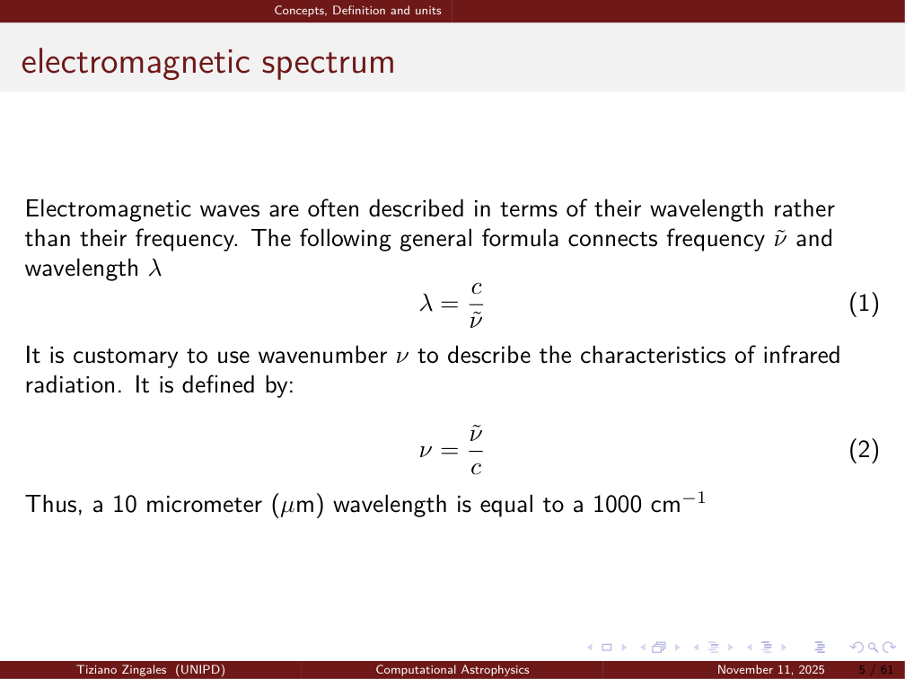
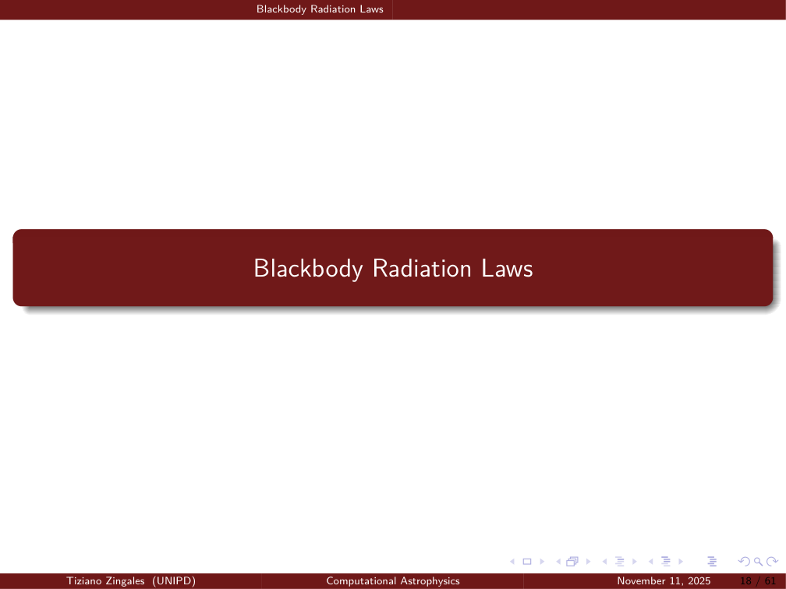
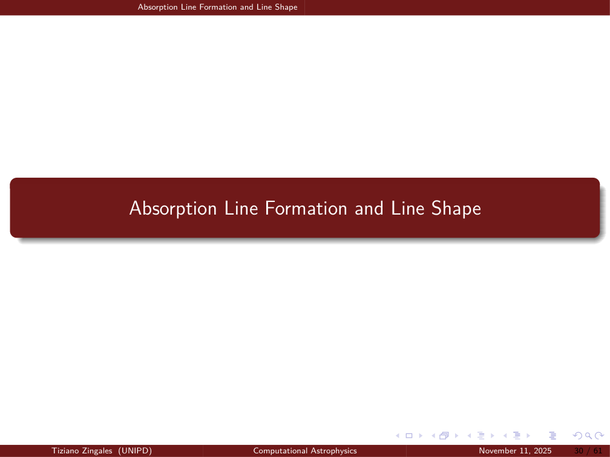


# Lesson 07 – Atmospheric Radiative Transfer and Line Profiles

*Computational Astrophysics, Prof. Tiziano Zingales*  
*Index: [Computational_Astrophysics_MOC](../../../04_Atlas/Computational_Astrophysics_MOC.html)*

---

## Foundational Radiometric Quantities

To model the propagation of electromagnetic energy through planetary atmospheres and stellar envelopes, we define the radiation field in terms of geometric differential bundles:

```
                            dS (Surface Area)
                              \
                               \    theta (Zenith Angle)
                                \   │
                                 \  │
                            ───────┼─────── Normal n
                                   │ \
                                   │  \  dOmega (Solid Angle)
                                   │   v
```

### 1. Specific Intensity (Spectral Radiance)
The specific intensity $I_\lambda$ (or $I_\nu$) characterizes the directional distribution of radiant energy. The differential energy $dE_\lambda$ traversing a surface element $dA$ within time interval $dt$, wavelength interval $[\lambda, \lambda + d\lambda]$, and confined inside solid angle $d\Omega = \sin\theta d\theta d\phi$ oriented at angle $\theta$ to the surface normal is:

$$dE_\lambda = I_\lambda(\mathbf{r}, \hat{\mathbf{n}}, t) \cos\theta \, dA \, d\Omega \, d\lambda \, dt$$

where $\cos\theta \, dA$ represents the projected area perpendicular to the beam. Solving for $I_\lambda$:

$$I_\lambda = \frac{dE_\lambda}{\cos\theta \, dA \, d\Omega \, d\lambda \, dt} \quad \left[\text{W m}^{-2} \text{ sr}^{-1} \text{ m}^{-1}\right]$$

In terms of frequency $\nu$ or wavenumber $\tilde{\nu} \equiv \frac{1}{\lambda} = \frac{\nu}{c}$ (standard in infrared exoplanet spectroscopy):

$$I_\nu d\nu = I_\lambda d\lambda = I_{\tilde{\nu}} d\tilde{\nu}$$

### 2. Monochromatic Flux Density (Irradiance)
The monochromatic flux density $F_\lambda$ is the net energy crossing the surface element per unit area per unit time per unit wavelength, integrated over the hemisphere:

$$F_\lambda = \int_{2\pi} I_\lambda(\theta, \phi) \cos\theta \, d\Omega = \int_0^{2\pi} d\phi \int_0^{\pi/2} I_\lambda(\theta, \phi) \cos\theta \sin\theta \, d\theta$$

For an **isotropic radiation field** where $I_\lambda$ is independent of direction $(\theta, \phi)$:

$$F_\lambda = I_\lambda \int_0^{2\pi} d\phi \int_0^{\pi/2} \cos\theta \sin\theta \, d\theta = 2\pi I_\lambda \left[ \frac{\sin^2\theta}{2} \right]_0^{\pi/2} = \pi I_\lambda$$

---

## Blackbody Radiation Laws and Thermodynamic Equilibrium

A blackbody absorbs all incident electromagnetic radiation regardless of frequency or angle of incidence.

```
       Cavity with Aperture dA ───> Complete internal absorption & thermal re-emission
                                      ↓
                  Local Thermodynamic Equilibrium (LTE): T_kin = T_rad = T_ex
```

### 1. Planck's Law
Max Planck (1901) postulated that atomic oscillators in thermal equilibrium emit and absorb energy in discrete quanta $\Delta E = h\nu$. Applying Maxwell-Boltzmann statistics to the electromagnetic cavity modes yields the **Planck function**:

$$B_\nu(T) = \frac{2 h \nu^3}{c^2} \frac{1}{\exp\left(\frac{h\nu}{k_B T}\right) - 1} \quad \left[\text{W m}^{-2} \text{ sr}^{-1} \text{ Hz}^{-1}\right]$$

Expressed per unit wavelength $\lambda$:

$$B_\lambda(T) = \frac{2 h c^2}{\lambda^5} \frac{1}{\exp\left(\frac{h c}{k_B \lambda T}\right) - 1} = \frac{C_1 \lambda^{-5}}{\pi \left( \exp\left(\frac{C_2}{\lambda T}\right) - 1 \right)}$$

where $C_1 = 2\pi h c^2 \approx 3.7418 \times 10^{-16}\text{ W m}^2$ and $C_2 = \frac{hc}{k_B} \approx 1.4388 \times 10^{-2}\text{ m K}$ are the first and second radiation constants.

### 2. Stefan-Boltzmann Law
Integrating the isotropic Planck flux $F_\lambda = \pi B_\lambda(T)$ over all wavelengths:

$$F = \int_0^\infty \pi B_\lambda(T) d\lambda = \frac{2\pi k_B^4 T^4}{h^3 c^2} \int_0^\infty \frac{x^3}{e^x - 1} dx = \sigma T^4$$

where the Riemann zeta integral $\int_0^\infty \frac{x^3}{e^x - 1} dx = \frac{\pi^4}{15}$, yielding the Stefan-Boltzmann constant:

$$\sigma = \frac{2\pi^5 k_B^4}{15 c^2 h^3} \approx 5.67037 \times 10^{-8}\text{ W m}^{-2} \text{ K}^{-4}$$

### 3. Wien's Displacement Law
Setting $\frac{\partial B_\lambda}{\partial \lambda} = 0$ yields the wavelength of maximum emission:

$$\lambda_{\max} T = \frac{h c}{4.965114 \, k_B} \approx 2897.8\text{ }\mu\text{m K}$$

### 4. Kirchhoff's Law and LTE
Under **Local Thermodynamic Equilibrium (LTE)**, the microscopic collision rate between molecules dominates over radiative de-excitation, ensuring the source function $S_\lambda$ equals the local Planck function:

$$S_\lambda \equiv \frac{j_\lambda}{\alpha_\lambda} = B_\lambda(T)$$

where $j_\lambda$ is the monochromatic emission coefficient and $\alpha_\lambda$ is the absorption coefficient.

---

## Scattering Regimes and Atmospheric Aerosols

When radiation encounters atmospheric particles, it undergoes absorption and scattering. The scattering regime depends on the dimensionless **size parameter** $x$:

$$x \equiv \frac{2\pi a}{\lambda}$$

where $a$ is the particle radius and $\lambda$ is the incident wavelength.

```
x << 1 : Rayleigh Scattering (a << \lambda)     x ~ 1 - 10 : Lorenz-Mie Scattering (a ~ \lambda)     x >> 1 : Geometric Optics
Molecules (N2, H2, He)                         Aerosols, condensates, cloud droplets                Raindrops, large dust
\sigma_R \propto \lambda^{-4}                  Resonant scattering, forward phase function          Geometric cross section 2\pi a^2
```

1. **Rayleigh Scattering ($x \ll 1$)**:
   The cross-section scales inversely with the fourth power of wavelength:
   $$\sigma_R(\lambda) \propto \frac{a^6}{\lambda^4} \left| \frac{m^2 - 1}{m^2 + 2} \right|^2$$
   Rayleigh scattering by molecular $\text{H}_2/\text{He}$ produces the steep blue spectral slope observed in exoplanet transmission spectra.
2. **Lorenz-Mie Scattering ($x \gtrsim 1$)**:
   Applies to atmospheric clouds and mineral photochemical hazes (e.g., $\text{MgSiO}_3$, $\text{Fe}$, $\text{MnS}$). Produces a muted, flattened wavelength dependence that obscures molecular absorption features.

---

## Molecular Transitions and Line Broadening Mechanisms

Infrared absorption in planetary atmospheres arises from transitions between discrete quantum molecular states:
- **Electronic transitions**: Ultraviolet and visible ($\Delta E \sim 1 - 10\text{ eV}$).
- **Vibrational transitions**: Near and mid-infrared ($\Delta E \sim 0.1 - 1\text{ eV}$).
- **Rotational transitions**: Far-infrared and submillimeter ($\Delta E \sim 10^{-3} - 10^{-2}\text{ eV}$).

Rovibrational band structures of molecules like $\text{H}_2\text{O}, \text{CO}_2, \text{CO},$ and $\text{CH}_4$ consist of thousands of individual spectral lines. Each line is broadened by physical processes.

```
       Lorentz Profile (Pressure)             Doppler Profile (Thermal)                  Voigt Profile
                 │                                        │                                    │
                 │                                      /   \                                /   \
               /   \                                  /       \                            /       \
           ───/─────\─── (Heavy wings)            ───/─────────\─── (Sharp wings)      ───/─────────\─── (Convolution)
```

### 1. Pressure (Collisional) Broadening: Lorentz Profile
Molecular collisions perturb energy levels during radiative transition. Governed by the **Lorentz profile**:

$$f_L(\nu - \nu_0) = \frac{1}{\pi} \frac{\alpha_L}{(\nu - \nu_0)^2 + \alpha_L^2}$$

where the half-width at half-maximum (HWHM) $\alpha_L$ depends on pressure $P$ and temperature $T$:

$$\alpha_L(P, T) = \alpha_{L,0} \left(\frac{P}{P_0}\right) \left(\frac{T_0}{T}\right)^n$$

*Physical Domain*: Dominates in the dense lower atmosphere ($P \gtrsim 0.1\text{ bar}$). Features broad, extended power-law damping wings ($\propto (\nu - \nu_0)^{-2}$).

### 2. Thermal Doppler Broadening: Gaussian Profile
Thermal kinetic motion of molecules creates Doppler shifts relative to the observer line of sight. For a Maxwellian velocity distribution, this produces a **Gaussian profile**:

$$f_D(\nu - \nu_0) = \frac{1}{\alpha_D \sqrt{\pi}} \exp\left( -\frac{(\nu - \nu_0)^2}{\alpha_D^2} \right)$$

where the Doppler half-width $\alpha_D$ is:

$$\alpha_D = \frac{\nu_0}{c} \sqrt{\frac{2 k_B T}{m}}$$

*Physical Domain*: Dominates in the hot, low-pressure upper atmosphere ($P \lesssim 10^{-3}\text{ bar}$). Core is narrow; wings decay exponentially.

### 3. The Voigt Profile
In intermediate planetary atmospheric layers ($10^{-3}\text{ bar} < P < 0.1\text{ bar}$), collisional and Doppler broadening act simultaneously. The resulting absorption profile is the mathematical **convolution of the Gaussian and Lorentzian functions**:

$$f_V(\nu - \nu_0) = \int_{-\infty}^\infty f_D(\nu' - \nu_0) f_L(\nu - \nu') d\nu'$$

Standardized via dimensionless variables $x = \frac{\nu - \nu_0}{\alpha_D}$ and $y = \frac{\alpha_L}{\alpha_D}$:

$$f_V(x, y) = \frac{1}{\alpha_D \sqrt{\pi}} K(x, y)$$

where $K(x, y)$ is the **Voigt function**:

$$K(x, y) = \frac{y}{\pi} \int_{-\infty}^\infty \frac{e^{-t^2}}{y^2 + (x - t)^2} dt$$

Near the line center ($x \approx 0$), Doppler thermal motion dominates. In the distant wings ($x \gg 1$), the Lorentzian pressure-broadened profile dominates.

---

## The Equation of Radiative Transfer (RTE)

Consider a pencil of radiation of intensity $I_\lambda$ traversing an infinitesimal path length $ds$ through an absorbing, emitting, and scattering medium with mass density $\rho$:

$$dI_\lambda = -k_\lambda \rho I_\lambda ds + j_\lambda \rho ds$$

where $k_\lambda = \kappa_\lambda + \sigma_\lambda$ is the mass extinction cross-section ($\text{m}^2 \text{ kg}^{-1}$).

```
  I_lambda(0) ───► [ Medium: Extinction k_lambda, Emission j_lambda ] ───► I_lambda(s_1)
```

### 1. Beer-Bouguer-Lambert Law (Pure Extinction)
In the absence of internal emission ($j_\lambda = 0$):

$$\frac{dI_\lambda}{I_\lambda} = -k_\lambda \rho ds \implies I_\lambda(s_1) = I_\lambda(0) \exp\left( -\int_0^{s_1} k_\lambda \rho ds \right) = I_\lambda(0) e^{-\tau_\lambda}$$

where $\tau_\lambda = \int_0^{s_1} k_\lambda \rho ds$ is the dimensionless **optical depth**.
- $\tau_\lambda \ll 1$: **Optically thin** medium (photons traverse without interaction).
- $\tau_\lambda \gg 1$: **Optically thick** medium (incident radiation is completely attenuated).

### 2. Schwarzschild's Equation (LTE Emission & Absorption)
In a non-scattering medium in LTE, substituting $j_\lambda / k_\lambda = B_\lambda(T)$:

$$\frac{dI_\lambda}{k_\lambda \rho ds} = -I_\lambda + B_\lambda(T)$$

Defining $d\tau_\lambda = -k_\lambda \rho ds$, the formal solution between path points $0$ and $s_1$ evaluates to:

$$I_\lambda(s_1) = I_\lambda(0) e^{-\tau_\lambda(0, s_1)} + \int_0^{s_1} B_\lambda(T(s)) e^{-\tau_\lambda(s, s_1)} k_\lambda \rho \, ds$$

- **First term**: Incident background radiation attenuated by the medium.
- **Second term**: Thermal radiation emitted by each atmospheric layer along the line of sight, attenuated by the intervening optical depth to the observer.

---

## Plane-Parallel Atmospheres

In planetary and stellar atmospheres whose vertical scale height $H \ll R_p$, physical properties vary predominantly with altitude $z$ (or atmospheric pressure $P$).

```
Top of Atmosphere (TOA) : \tau = 0 ──────────────────────────────
                                 │ ^
               Optical depth     │ │  Zenith angle \theta
               increases         │ │  \mu = cos \theta
               downward          │ │
Bottom of Atmosphere    : \tau = \tau* ──────────────────────────
```

Let $z$ be vertical height and $\theta$ the angle relative to the upward vertical normal: $ds = \frac{dz}{\cos\theta} = \frac{dz}{\mu}$. Defining the vertical optical depth measured downward from the top of the atmosphere:

$$\tau_\lambda(z) = \int_z^\infty k_\lambda \rho dz' \implies d\tau_\lambda = -k_\lambda \rho dz$$

The plane-parallel RTE becomes:

$$\mu \frac{dI_\lambda(\tau; \mu, \phi)}{d\tau} = I_\lambda(\tau; \mu, \phi) - S_\lambda(\tau)$$

### Formal Solutions for Upward and Downward Radiation
1. **Upward Intensity ($\mu > 0$)**:
   Multiplying by integrating factor $e^{-\tau/\mu}$ and integrating from level $\tau$ to lower boundary $\tau_*$:
   $$I_\lambda(\tau; \mu, \phi) = I_\lambda(\tau_*; \mu, \phi) e^{-(\tau_* - \tau)/\mu} + \int_\tau^{\tau_*} S_\lambda(\tau') e^{-(\tau' - \tau)/\mu} \frac{d\tau'}{\mu}$$
   At the Top of Atmosphere ($\tau = 0$), the emergent upward intensity observed by a space telescope is:
   $$I_\lambda(0; \mu) = I_\lambda(\tau_*; \mu) e^{-\tau_* / \mu} + \int_0^{\tau_*} S_\lambda(\tau') e^{-\tau' / \mu} \frac{d\tau'}{\mu}$$
2. **Downward Intensity ($\mu < 0$, setting $\mu \to -\mu$)**:
   Integrating from top boundary $\tau = 0$ downward to level $\tau$:
   $$I_\lambda(\tau; -\mu, \phi) = I_{\text{stellar}} e^{-\tau / \mu} + \int_0^\tau S_\lambda(\tau') e^{-(\tau - \tau')/\mu} \frac{d\tau'}{\mu}$$

This plane-parallel integral formulation forms the computational core of atmospheric forward modeling engines.

---

## Related Notes
- [04_Exoplanet_Demographics_Orbital_Mechanics_and_Transits](./04_Exoplanet_Demographics_Orbital_Mechanics_and_Transits.html)
- [06_Deep_Learning_Architectures_and_Optimization](./06_Deep_Learning_Architectures_and_Optimization.html)
- [08_Exoplanet_Atmospheric_Retrieval_Frameworks_and_TauREx](./08_Exoplanet_Atmospheric_Retrieval_Frameworks_and_TauREx.html)
- [09_Bayesian_Inference_and_Parameter_Estimation](./09_Bayesian_Inference_and_Parameter_Estimation.html)


## Computational Visuals & Radiative Transfer Solvers


*Figure COMP-07: Plane-parallel atmospheric geometry and formal solution of the radiative transfer equation $I_\nu(\tau_\nu) = I_\nu(0) e^{-\tau_\nu} + \int_0^{\tau_\nu} S_\nu(t) e^{-(\tau_\nu - t)} dt$.*


*Figure COMP-08: Spectral line absorption profiles. The Voigt function $H(a, u) = \frac{a}{\pi} \int_{-\infty}^{\infty} \frac{e^{-y^2}}{(u-y)^2 + a^2} dy$ combines Gaussian thermal Doppler core with Lorentzian pressure-broadened damping wings.*


*Figure COMP-09: Numerical discretization of atmospheric column density and cross-section sums $\tau_\nu(z) = \sum_i \sigma_{i,\nu} N_i(z)$ across discrete pressure layers.*


<div class="backlinks-section">
  <h4 class="backlinks-title">Linked References (5)</h4>
  <ul class="backlinks-list">
    <li class="backlink-item-wrap"><a href="./06_Deep_Learning_Architectures_and_Optimization.html" class="backlink-item">06_Deep_Learning_Architectures_and_Optimization</a></li>
    <li class="backlink-item-wrap"><a href="./08_Exoplanet_Atmospheric_Retrieval_Frameworks_and_TauREx.html" class="backlink-item">08_Exoplanet_Atmospheric_Retrieval_Frameworks_and_TauREx</a></li>
    <li class="backlink-item-wrap"><a href="./09_Bayesian_Inference_and_Parameter_Estimation.html" class="backlink-item">09_Bayesian_Inference_and_Parameter_Estimation</a></li>
    <li class="backlink-item-wrap"><a href="../../../03_Zettel/Computational/Atmospheric%20radiative%20transfer%20equation%20and%20Voigt%20profile.html" class="backlink-item">Atmospheric radiative transfer equation and Voigt profile</a></li>
    <li class="backlink-item-wrap"><a href="../../../04_Atlas/Computational_Astrophysics_MOC.html" class="backlink-item">Computational_Astrophysics_MOC</a></li>
  </ul>
</div>
