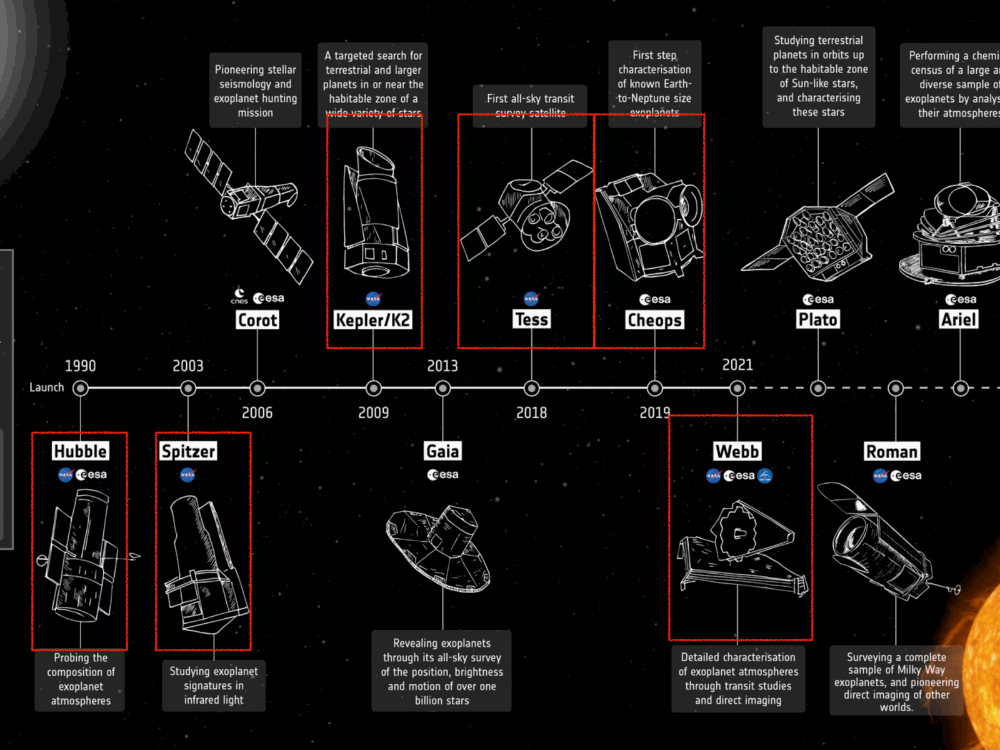
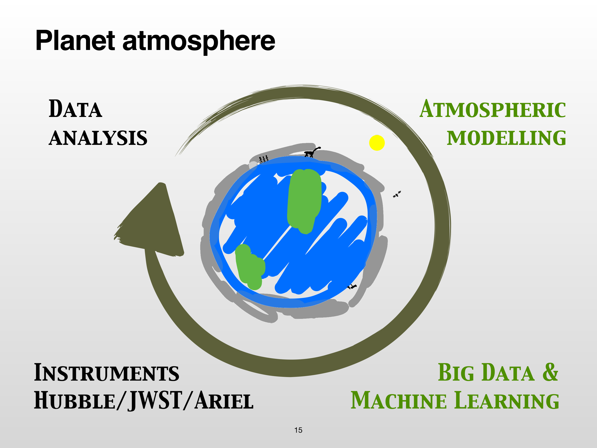
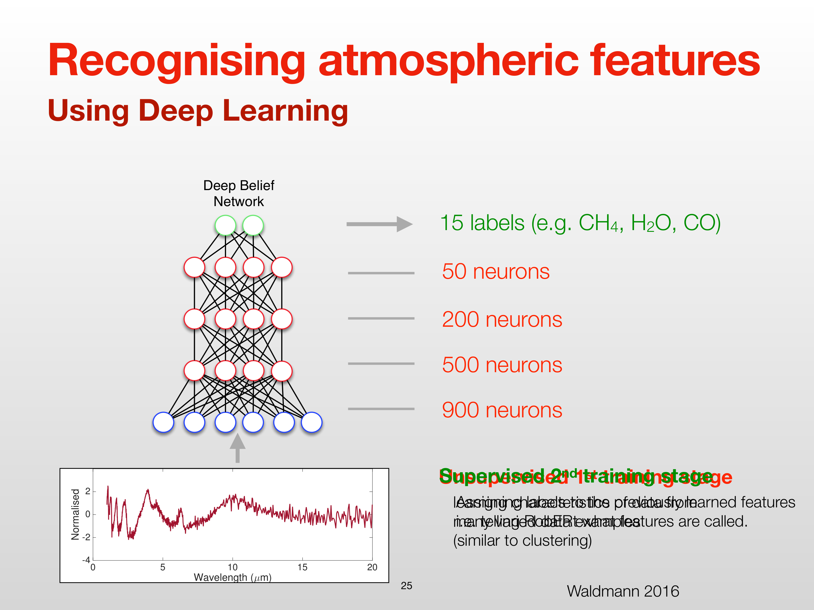


# Lesson 08 – Exoplanet Atmospheric Retrieval Frameworks and TauREx

*Computational Astrophysics, Prof. Tiziano Zingales*  
*Index: [Computational_Astrophysics_MOC](../../../04_Atlas/Computational_Astrophysics_MOC.html)*

---

## Exoplanet Spectroscopy and Atmospheric Probing

When an exoplanet orbits its host star, space- and ground-based spectrographs probe the chemical composition and thermal structure of its atmosphere through time-series spectrophotometry:

```
                       Stellar Flux F_*
                              │
  Primary Transit ────────────┼──────────► Transmission Spectroscopy
  (Planet occults star)       │            • Probes planetary atmospheric day-night terminator
                              │            • Wavelength-dependent slant optical depth \tau_\lambda(z)
                              │
  Secondary Eclipse ──────────┼──────────► Emission Spectroscopy
  (Star occults planet)       │            • Probes planetary dayside thermal emission & reflection
                              │            • Thermal contrast F_p(\lambda) / F_*(\lambda)
                              │
  Phase Curves ───────────────┴──────────► Longitudinal Thermal Mapping
  (Continuous orbital orbit)               • Day-to-night heat redistribution & wind dynamics
```

Space observatories—including the Hubble Space Telescope (WFC3, STIS), Spitzer Space Telescope (IRAC, IRS), the James Webb Space Telescope (JWST NIRSpec, NIRCam, MIRI), and the upcoming ESA Ariel mission—deliver transmission and emission spectra spanning $0.2 - 28\text{ }\mu\text{m}$.

---

## Data Detrending and Systematic Removal

Observational exoplanet spectroscopy operates at the photon-noise limit, where instrumental systematics often dwarf the subtle atmospheric absorption signature ($\Delta F / F \sim 10^{-4} - 10^{-5}$):
- **HST/WFC3 Spatial Scanning Mode**: The telescope scans the stellar spectrum across the detector during exposure, introducing geometric distortions that require spatial deconvolution pipelines (Tsiaras et al. 2016).
- **Spitzer/IRAC Intra-Pixel Sensitivity**: Sub-pixel pointing oscillations across inhomogeneous detector pixel response functions produce flux variations of several percent. Unsupervised machine learning methods—such as **Independent Component Analysis (ICA)** and **Wavelet-ICA (ACICA, Waldmann 2014)** adapted from medical EEG artifact separation—extract the astronomical signal without imposing rigid parametric noise models (Morello et al. 2014, 2015; Ingalls et al. 2016).

---

## Forward Modeling vs. Inverse Retrieval

The characterization of an exoplanet atmosphere represents an **inverse problem**:

```
[Atmospheric State Vector x] ───► [Forward Model Engine F(x)] ───► [Synthetic Spectrum y(x)]
  • T(P) Profile                    • Hydrostatic Equilibrium            ↕ (Comparison \chi^2)
  • Chemical Abundances \chi_i      • Cross-Section Opacities         [Observed Spectrum D]
  • Cloud & Haze Parameters         • Radiative Transfer RTE             ↕ (Posterior P(x|D))
  • Planet Mass & Radius                                          [Bayesian Retrieval]
```

1. **Forward Model $\mathcal{F}(\mathbf{x})$**: Takes a physical parameter vector $\mathbf{x}$ and integrates the differential equations of hydrostatic balance and radiative transfer to synthesize an emergent spectrum $\mathbf{y}(\mathbf{x})$.
2. **Inverse Retrieval**: Given observed spectral points $\mathbf{D} = \{y_{\text{obs}, k}, \sigma_k\}_{k=1}^K$, inverts the non-linear operator $\mathcal{F}$ to infer the posterior probability distribution $P(\mathbf{x} \mid \mathbf{D})$ of atmospheric parameters.

---

## Radiative Transfer Formalism in Forward Models

### 1. Transmission Geometry (Primary Transit)
During primary transit, stellar rays graze the planetary limb at impact altitude $z$. The monochromatic slant optical depth $\tau_\lambda(z)$ integrated along the grazing path $dl$ is:

$$\tau_\lambda(z) = 2 \int_0^{l_{\max}(z)} \sum_m \sigma_m(\lambda, P(z'), T(z')) \, \chi_m(z') \, \rho_N(z') \, dl$$

where:
- $\sigma_m(\lambda, P, T)$ is the absorption cross-section of molecular species $m$ ($\text{cm}^2 \text{ molecule}^{-1}$)
- $\chi_m(z')$ is the volume mixing ratio ($VMR$) of species $m$
- $\rho_N(z')$ is the atmospheric number density ($P(z') = \rho_N(z') k_B T(z')$)
- $dl = \frac{R_p + z'}{\sqrt{(R_p + z')^2 - (R_p + z)^2}} dz'$ is the grazing geometric path element

```
                                  Grazing Path dl
             Stellar Ray ───────────────────────*───────────────────────► Space Observer
                                               /│\
                                              / │ \
                                             /  │  \  z'
                                            /   │   \
                                           /    │ z  \
                                          /     │     \
                                         v──────┴──────v
                                           Planet Core (R_p)
```

The effective annular absorbing area $\Delta A_\lambda$ is obtained by integrating transmission extinction over all vertical shell layers:

$$\Delta A_\lambda = 2\pi \int_0^{z_{\max}} (R_p + z) \left( 1 - e^{-\tau_\lambda(z)} \right) dz$$

The total wavelength-dependent transit depth observed is:

$$\delta_\lambda = \frac{R_{p,\text{eff}}^2(\lambda)}{R_*^2} = \frac{R_p^2 + \Delta A_\lambda}{R_*^2}$$

### 2. Emission Geometry (Secondary Eclipse)
During secondary eclipse, the dayside thermal emission from the planet is occulted by the host star. Solving the plane-parallel RTE for thermal emission in LTE ($S_\lambda = B_\lambda(T)$):

$$I_\lambda(\tau = 0, \mu) = B_\lambda(T_{\text{surf}}) e^{-\tau_{\text{surf}} / \mu} + \int_0^{\tau_{\text{surf}}} B_\lambda(T(\tau)) e^{-\tau / \mu} \frac{d\tau}{\mu}$$

The planetary-to-stellar flux contrast is:

$$\frac{F_p(\lambda)}{F_*(\lambda)} = \left(\frac{R_p}{R_*}\right)^2 \frac{\int_0^1 I_\lambda(0, \mu) \mu \, d\mu}{I_*(\lambda)}$$

### 3. Temperature-Pressure ($T(P)$) Profile Parameterizations
- **Isothermal Profile**: Constant temperature $T(P) = T_0$ throughout all vertical layers.
- **Guillot (2010) Radiative Equilibrium Profile**: An analytical three-channel approximation balancing incoming visible stellar irradiation against outgoing thermal infrared flux:
  $$T^4(\tau) = \frac{3 T_{\text{int}}^4}{4} \left( \frac{2}{3} + \tau \right) + \frac{3 T_{\text{irr}}^4}{4} \left[ \frac{2}{3} + \frac{1}{\gamma \sqrt{3}} + \left( \frac{\gamma}{\sqrt{3}} - \frac{1}{\gamma \sqrt{3}} \right) e^{-\gamma \tau \sqrt{3}} \right]$$
  where $\gamma \equiv \frac{\kappa_{\text{vis}}}{\kappa_{\text{IR}}}$ governs thermal inversions (stratospheres).
- **Point-wise / Spline Profiles**: Free temperature nodes distributed evenly in $\log_{10} P$ space.

---

## The TauREx 3 Retrieval Architecture

**TauREx 3** (Tau Retrieval for Exoplanets; Al-Refaie et al. 2021, Waldmann et al. 2015) is a high-performance, modular Python framework for forward modeling and Bayesian atmospheric retrieval.

```
+-----------------------------------------------------------------------------------------+
|                                    TAUREX 3 ARCHITECTURE                                |
+----------------------+--------------------+---------------------+-----------------------+
| Core Layer           | Component          | Implementation      | Role                  |
+----------------------+--------------------+---------------------+-----------------------+
| Opacity Data         | Cross-Sections     | ExoMol, HITRAN, HITEMP| Molecular line lists|
|                      | CIA Opacities      | H2-H2, H2-He        | Continuum background  |
| Atmosphere Model     | Pressure Grid      | N layers (10^-6–10^2 bar)| Altitude layering  |
|                      | Chemistry Model    | Free VMR / ACE equil.| Gas mixing ratios    |
|                      | Temperature Model  | Isothermal / Guillot| Vertical thermal state|
| Forward Engine       | Radiative Transfer | Transmission/Emission| RTE path integration |
| Inverse Optimizer    | Bayesian Samplers  | MultiNest, PolyChord| Posterior & Evidence  |
+----------------------+--------------------+---------------------+-----------------------+
```

### 1. Opacity Sources
- **ExoMol Project** (Tennyson et al.): Molecular line lists containing billions of transitions computed via quantum mechanical variational methods, required for hot atmospheres ($T > 1000\text{ K}$).
- **HITRAN / HITEMP**: Standard terrestrial and high-temperature molecular databases.
- **Collision-Induced Absorption (CIA)**: In dense hydrogen-dominated gas giant envelopes, transient dipoles formed during molecular collisions ($\text{H}_2-\text{H}_2$, $\text{H}_2-\text{He}$) produce continuous absorption backgrounds across the infrared.

### 2. Configuration via Parameter Files (`.par`)
TauREx runs natively from declarative `.par` configuration files:

```ini
[Global]
xsec_path = /ca/opacities/xsec/
cia_path = /ca/opacities/cia/

[Chemistry]
chemistry_type = free
fill_gases = H2, He
ratio = 0.25

# Trace active gases (log10 volume mixing ratios)
H2O = 1e-4
CO2 = 1e-5
CO  = 1e-4
CH4 = 1e-6

[Temperature]
profile_type = guillot
T_irr = 1500.0
T_int = 100.0
kappa_ir = 0.01
gamma = 0.4

[Planet]
planet_type = Simple
planet_mass = 1.0       ; Jupiter masses
planet_radius = 1.2     ; Jupiter radii

[Star]
star_type = Blackbody
star_radius = 1.0       ; Solar radii
star_temperature = 5800 ; Kelvin

[Model]
model_type = Transmission
nlayers = 100
pressures = 1e2, 1e-6   ; Pressure boundaries from 100 bar to 1 ubar

[Fitting]
# Parameters to vary during Bayesian retrieval
planet_radius:fit = True
planet_radius:prior = "Uniform(bounds=(0.8, 1.8))"

H2O:fit = True
H2O:prior = "LogUniform(bounds=(-8, -2))"

CO2:fit = True
CO2:prior = "LogUniform(bounds=(-8, -2))"

[Optimizer]
optimizer = multinest
num_live_points = 1000
```

### 3. Execution Commands
```bash
# Run forward model and display interactive plot
taurex -i forward_model.par --plot

# Run forward model and save synthetic spectrum to disk
taurex -i forward_model.par -S synthetic_spectrum.dat

# Execute full Bayesian atmospheric retrieval
taurex -i retrieval.par --retrieval
```

---

## Machine Learning Acceleration in Atmospheric Retrieval

Standard Bayesian retrieval requires evaluating $10^5 - 10^7$ forward model iterations per spectrum, demanding days of CPU cluster time.

Machine learning enhances the retrieval workflow:
1. **RobERt (Robotic Exoplanet Recognition; Waldmann 2016)**:
   - A Deep Belief Network (DBN) trained on 80,000 synthetic spectra.
   - Performs automated feature recognition to identify which trace gases ($\text{H}_2\text{O}, \text{CO}_2, \text{CO}, \text{CH}_4$) are statistically present in noisy telescope data, eliminating unnecessary parameter dimensions from subsequent MCMC/Nested Sampling runs.
2. **Neural Posterior Estimation (NPE)**:
   - Deep generative models (Normalizing Flows and GANs) trained on millions of precomputed forward models to generate full multidimensional posterior distributions in seconds.

---

## Related Notes
- [04_Exoplanet_Demographics_Orbital_Mechanics_and_Transits](./04_Exoplanet_Demographics_Orbital_Mechanics_and_Transits.html)
- [06_Deep_Learning_Architectures_and_Optimization](./06_Deep_Learning_Architectures_and_Optimization.html)
- [07_Atmospheric_Radiative_Transfer_and_Line_Profiles](./07_Atmospheric_Radiative_Transfer_and_Line_Profiles.html)
- [09_Bayesian_Inference_and_Parameter_Estimation](./09_Bayesian_Inference_and_Parameter_Estimation.html)
- [10_Nested_Sampling_and_Evidence_Computation](./10_Nested_Sampling_and_Evidence_Computation.html)


## Computational Visuals & TauREx Inverse Retrieval


*Figure COMP-10: TauREx 3 forward model and atmospheric retrieval pipeline: $P-T$ profile parametrization $\to$ chemical equilibrium / abundance priors $\to$ opacities $\to$ radiative transfer $\to$ simulated instrument bandpass.*


*Figure COMP-11: Synthetic transmission spectroscopy model showing molecular absorption features of $\mathrm{H_2O}$ ($1.4\,\mu\mathrm{m}$), $\mathrm{CH_4}$, $\mathrm{CO}$, and $\mathrm{CO_2}$ ($4.3\,\mu\mathrm{m}$).*


*Figure COMP-12: Retrieved posterior probability distributions for isothermal atmospheric temperature $T_{\mathrm{iso}}$ and trace gas volume mixing ratios $\log_{10}(X_{\mathrm{mol}})$.*


<div class="backlinks-section">
  <h4 class="backlinks-title">Linked References (11)</h4>
  <ul class="backlinks-list">
    <li class="backlink-item-wrap"><a href="./04_Exoplanet_Demographics_Orbital_Mechanics_and_Transits.html" class="backlink-item">04_Exoplanet_Demographics_Orbital_Mechanics_and_Transits</a></li>
    <li class="backlink-item-wrap"><a href="./06_Deep_Learning_Architectures_and_Optimization.html" class="backlink-item">06_Deep_Learning_Architectures_and_Optimization</a></li>
    <li class="backlink-item-wrap"><a href="./07_Atmospheric_Radiative_Transfer_and_Line_Profiles.html" class="backlink-item">07_Atmospheric_Radiative_Transfer_and_Line_Profiles</a></li>
    <li class="backlink-item-wrap"><a href="./09_Bayesian_Inference_and_Parameter_Estimation.html" class="backlink-item">09_Bayesian_Inference_and_Parameter_Estimation</a></li>
    <li class="backlink-item-wrap"><a href="./10_Nested_Sampling_and_Evidence_Computation.html" class="backlink-item">10_Nested_Sampling_and_Evidence_Computation</a></li>
    <li class="backlink-item-wrap"><a href="./11_Parallel_Computing_Architectures_and_HPC_Scaling.html" class="backlink-item">11_Parallel_Computing_Architectures_and_HPC_Scaling</a></li>
    <li class="backlink-item-wrap"><a href="../Exoplanetary_Astrophysics/12_AI_and_Machine_Learning_in_Exoplanet_Science.html" class="backlink-item">12_AI_and_Machine_Learning_in_Exoplanet_Science</a></li>
    <li class="backlink-item-wrap"><a href="./12_MPI_Distributed_Memory_Programming_with_Python.html" class="backlink-item">12_MPI_Distributed_Memory_Programming_with_Python</a></li>
    <li class="backlink-item-wrap"><a href="../Exoplanetary_Astrophysics/20_Exoplanet_Atmospheres_and_Transmission_Spectroscopy.html" class="backlink-item">20_Exoplanet_Atmospheres_and_Transmission_Spectroscopy</a></li>
    <li class="backlink-item-wrap"><a href="../../../04_Atlas/Computational_Astrophysics_MOC.html" class="backlink-item">Computational_Astrophysics_MOC</a></li>
    <li class="backlink-item-wrap"><a href="../../../03_Zettel/Computational/Exoplanet%20atmospheric%20retrieval%20and%20TauREx%20framework.html" class="backlink-item">Exoplanet atmospheric retrieval and TauREx framework</a></li>
  </ul>
</div>
