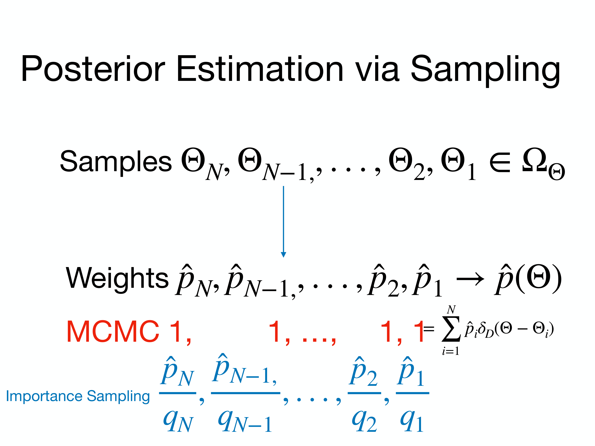
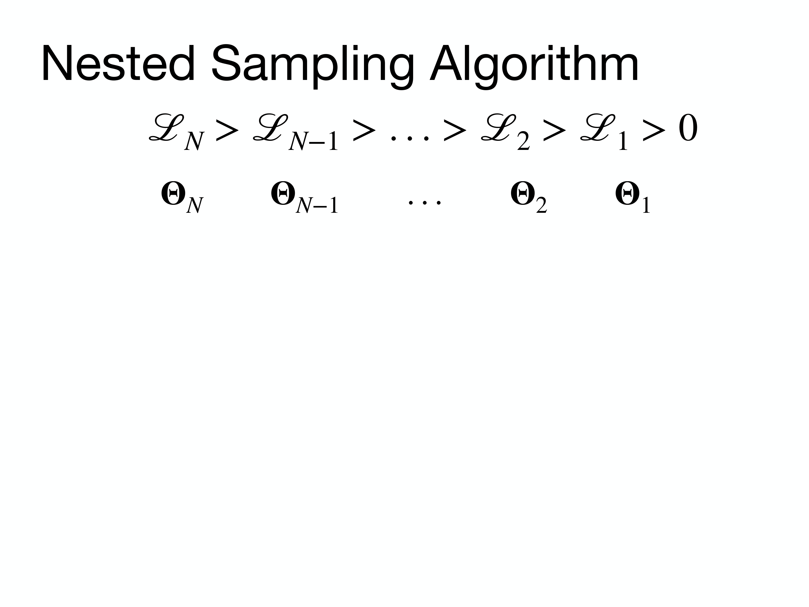

# Lesson 10 – Nested Sampling and Evidence Computation

*Computational Astrophysics, Prof. Tiziano Zingales*  
*Index: [[Computational_Astrophysics_MOC]]*

---

## The Evidence Integration Challenge and the Typical Set

In Bayesian model selection, comparing competing physical hypotheses requires computing the **Bayesian Evidence (Marginal Likelihood)**:

$$\mathcal{Z} = \int_{\Omega_{\boldsymbol{\theta}}} \mathcal{L}(\boldsymbol{\theta}) \pi(\boldsymbol{\theta}) \, d^D\boldsymbol{\theta}$$

In high-dimensional parameter spaces ($D \gtrsim 10$, standard in exoplanet atmospheric retrieval), this multidimensional integral presents severe numerical difficulties:
1. **The Curse of Dimensionality**: The prior volume scales as $V(r) \propto r^D$, causing almost all prior volume to reside in the outer hyperspherical shell.
2. **The Typical Set**: The posterior probability mass $dP = \mathcal{L}(\boldsymbol{\theta}) \pi(\boldsymbol{\theta}) dV$ is the product of the likelihood amplitude (which peaks sharply in a tiny region of parameter space) and the differential prior volume $dV$ (which vanishes at the center). As a result, almost all posterior probability mass resides in a narrow geometric hypershell known as the **typical set**.

```
Likelihood Amplitude L(\theta)                  Prior Differential Volume dV              Posterior Mass dP = L * dV
       ▲                                               ▲                                               ▲
       │       /│\                                     │            /                                  │          ╭───╮
       │      / │ \                                    │          /                                    │         │     │
       │     /  │  \                                   │        /                                      │         │     │
       └────┴───┴───┴───► \theta                       └───────┴───────► r                             └────────┴─────┴──► \theta
      Peaks at mode \theta_ML                       Volume dV \propto r^{D-1}                       Narrow "Typical Set"
```

Standard Markov Chain Monte Carlo (MCMC) algorithms sample the typical set effectively for parameter estimation, but fail to compute $\mathcal{Z}$ because they do not track the fraction of prior volume occupied by the likelihood peak.

---

## John Skilling's One-Dimensional Transformation (2004)

John Skilling demonstrated that the intractable $D$-dimensional integral $\mathcal{Z}$ can be transformed into a **one-dimensional integral over prior mass $X$**:

We define the **prior mass** $X(\lambda)$ as the cumulative prior volume enclosed inside the iso-likelihood contour $\mathcal{L}(\boldsymbol{\theta}) > \lambda$:

$$X(\lambda) \equiv \int_{\{\boldsymbol{\theta} : \mathcal{L}(\boldsymbol{\theta}) > \lambda\}} \pi(\boldsymbol{\theta}) \, d^D\boldsymbol{\theta}$$

```
                Parameter Space \Omega_\theta                               Prior Mass Axis X \in [0, 1]
           ┌─────────────────────────────────────┐                         L(X) ▲
           │  Prior Volume (X = 1)               │                              │  \
           │         ╭─────────────────╮         │                              │   \
           │         │ L(\theta) > \lambda_1     │                              │    \  L(X) is strictly
           │         │    ╭────────╮   │         │                              │     \  monotonic!
           │         │    │ >\lambda_2 │   │         │                              │      \
           │         │    ╰────────╯   │         │                              └───────┴───────► X
           │         ╰─────────────────╯         │                             X=0             X=1
           └─────────────────────────────────────┘                            (L_max)        (Entire Prior)
```

- When $\lambda = 0$, $X(0) = 1$ (the entire normalized prior volume).
- When $\lambda \to \mathcal{L}_{\max}$, $X(\mathcal{L}_{\max}) = 0$ (a single point).

The differential element of prior mass is $dX = \pi(\boldsymbol{\theta}) d^D\boldsymbol{\theta}$. The multidimensional integral simplifies to:

$$\mathcal{Z} = \int_0^1 \mathcal{L}(X) \, dX$$

Because $\mathcal{L}(X)$ is a strictly positive, monotonically decreasing 1D scalar function, it can be evaluated numerically using standard quadrature rules (trapezoidal or Simpson's rule):

$$\hat{\mathcal{Z}} \approx \sum_{i=1}^N \mathcal{L}_i \, w_i$$

where $w_i = \Delta X_i = \frac{1}{2}(X_{i-1} - X_{i+1})$ represents the differential prior mass element.

---

## The Nested Sampling Algorithm

Rather than dividing $X$ into uniform steps (which is impossible because $X(\lambda)$ is unknown *a priori*), Nested Sampling estimates the sequence of $X_i$ values statistically using an active ensemble of **live points**.

```
Algorithm Flow:
1. Initialize K live points drawn randomly from prior \pi(\theta)
2. At iteration i:
   a. Find live point with lowest likelihood: L_i = min_k L(\theta_k)
   b. Discard point \theta_i as "dead"; record (L_i, \theta_i)
   c. Prior volume shrinks: X_i = t_i * X_{i-1}, where t_i ~ Beta(K, 1)
   d. Accumulate evidence contribution: \Delta Z_i = L_i * \Delta X_i
   e. Sample new point \theta_new from \pi(\theta) constrained to L(\theta_new) > L_i
   f. Replace discarded point with \theta_new
3. Terminate when remaining live point evidence \Delta Z_remain < \epsilon * Z_accumulated
```

### Statistical Shrinkage of the Prior Volume
Let $K$ denote the constant number of active live points. At each iteration, removing the point with the lowest likelihood corresponds to discarding the largest remaining value of $X$ from an ensemble of $K$ points distributed uniformly on $[0, X_{i-1}]$.

The compression ratio $t_i = \frac{X_i}{X_{i-1}}$ follows the **maximum order statistic** of $K$ uniform random variables on $[0, 1]$:

$$P(t_i) = K t_i^{K-1}, \quad t_i \in [0, 1] \implies t_i \sim \text{Beta}(K, 1)$$

Taking the expectation of the logarithmic shrinkage:

$$\mathbb{E}[\ln t_i] = \int_0^1 \ln t \cdot K t^{K-1} dt = -\frac{1}{K}$$

$$\mathbb{V}[\ln t_i] = \frac{1}{K^2}$$

After $i$ iterations, the expected logarithm of the prior volume is:

$$\ln X_i = \sum_{j=1}^i \ln t_j \implies \mathbb{E}[\ln X_i] = -\frac{i}{K} \implies X_i \approx \exp\left(-\frac{i}{K}\right)$$

The prior volume compresses exponentially at a constant rate governed by $K$.

---

## Stopping Criteria and Final Particle Recycling

### 1. Stopping Condition
The algorithm cannot continue indefinitely because $X_i \to 0$. At iteration $i$, the maximum remaining evidence that could possibly reside inside the current live point volume $X_i$ is bounded by:

$$\Delta \mathcal{Z}_{\text{remain}} \approx \mathcal{L}_{\max} \cdot X_i$$

where $\mathcal{L}_{\max} = \max_{k=1\dots K} \mathcal{L}(\boldsymbol{\theta}_k)$. We terminate iterations when:

$$\frac{\Delta \mathcal{Z}_{\text{remain}}}{\hat{\mathcal{Z}}_i} < f_{\text{stop}} \quad (\text{typically } 10^{-4})$$

### 2. Live Point Recycling
Upon termination, the final $K$ live points $\{\boldsymbol{\theta}_k\}_{k=1}^K$ currently active in memory are not discarded. Each is assigned an equal share of the remaining prior mass $\frac{X_{\text{final}}}{K}$ and sorted by likelihood, adding their final contributions to $\hat{\mathcal{Z}}$.

---

## Posterior Parameter Estimation from Discarded Points

Nested Sampling computes the evidence $\mathcal{Z}$ directly, but also generates **posterior samples as a natural byproduct**.

Each discarded (dead) point $\boldsymbol{\theta}_i$ represents an annulus of prior mass $\Delta X_i$ evaluated at likelihood $\mathcal{L}_i$. By Bayes' Theorem, its posterior probability weight is:

$$p_i = \frac{\mathcal{L}_i \Delta X_i}{\hat{\mathcal{Z}}}$$

The posterior distribution is represented as a weighted discrete mixture:

$$P(\boldsymbol{\theta} \mid \mathbf{D}) \approx \sum_{i=1}^{N+K} p_i \, \delta_D(\boldsymbol{\theta} - \boldsymbol{\theta}_i)$$

Any physical expectation value $\mathbb{E}[f(\boldsymbol{\theta})]$ (e.g., mean planet radius, mixing ratios) evaluates directly via importance sum:

$$\mathbb{E}[f(\boldsymbol{\theta})] \approx \sum_{i=1}^{N+K} p_i f(\boldsymbol{\theta}_i)$$

Resampling these points with probabilities $p_i$ generates unweighted posterior samples that yield standard 1D and 2D marginal distributions and corner plots.

---

## Information Gain and Error Propagation

The number of iterations required to traverse from the prior to the typical set depends on the **information gain $H$** (the Kullback-Leibler divergence from prior $\pi$ to posterior $P$):

$$H \equiv \int_{\Omega_{\boldsymbol{\theta}}} P(\boldsymbol{\theta} \mid \mathbf{D}) \ln\left( \frac{P(\boldsymbol{\theta} \mid \mathbf{D})}{\pi(\boldsymbol{\theta})} \right) d^D\boldsymbol{\theta} \approx \sum_{i=1}^{N+K} p_i \ln\left(\frac{\mathcal{L}_i}{\hat{\mathcal{Z}}}\right)$$

- $H$ measures the compression in state space in units of nats: the typical set occupies a fraction $e^{-H}$ of the original prior volume.
- The total number of iterations required to reach the posterior peak scales as:
  $$N_{\text{iter}} \approx K \cdot H$$
- The statistical uncertainty on the estimated log-evidence from Poisson shrinkage fluctuations is:
  $$\sigma(\ln \hat{\mathcal{Z}}) \approx \sqrt{\frac{H}{K}}$$

To double the precision of the log-evidence, the number of live points $K$ must be quadrupled.

---

## Practical Multidimensional Sampling Engines

The central computational challenge in Nested Sampling is step 2e: **drawing a new sample uniformly from the prior $\pi(\boldsymbol{\theta})$ subject to $\mathcal{L}(\boldsymbol{\theta}) > \mathcal{L}_i$**.

```
Method 0: Rejection Sampling from Prior    Method 1: Ellipsoidal Decomposition (MultiNest)    Method 2: Slice Sampling (PolyChord)
    P(accept) = X_i -> 0                        Bounding Ellipsoids                               Markov Chains / Slices
    Exponentially fails in D > 3                 Handles multi-modal distributions                 Scales well to D ~ 50 - 100
```

1. **MultiNest (Feroz & Hobson 2008, 2009)**:
   - Clusters live points and encloses them inside an optimal set of intersecting bounding ellipsoids.
   - Samples uniformly within the ellipsoidal union. Handles multi-modal and curving degenerate likelihood topologies efficiently.
   - Standard retrieval engine used in `TauREx 3`.
2. **PolyChord (Handley et al. 2015)**:
   - Uses slice sampling chains to generate new live points, avoiding geometric ellipsoid bounding.
   - Computational cost scales linearly with dimension $\mathcal{O}(D)$, making it the standard engine for high-dimensional problems ($D > 30$).
3. **Dynamic Nested Sampling (Higson et al. 2017; `dynesty`, `ultranest`)**:
   - Varies the number of live points dynamically: allocates live points specifically where posterior weight $w_i \mathcal{L}_i$ peaks, maximizing parameter estimation accuracy.

---

## Related Notes
- [[08_Exoplanet_Atmospheric_Retrieval_Frameworks_and_TauREx]]
- [[09_Bayesian_Inference_and_Parameter_Estimation]]
- [[11_Parallel_Computing_Architectures_and_HPC_Scaling]]
- [[Marginalized Posterior Distributions and Corner Plots]]
- [[MCMC Convergence Diagnostics and Autocorrelation Analysis]]


## Computational Visuals & Nested Sampling Architecture


*Figure COMP-13: John Skilling's Nested Sampling algorithm mapping multi-dimensional parameter space to a 1D scalar prior volume $X \in [0, 1]$, where $d X = \pi(\theta) d\theta$ and $X(\lambda) = \int_{\mathcal{L}(\theta) > \lambda} \pi(\theta) d\theta$.*


*Figure COMP-14: Active live point population contracting inward across nested iso-likelihood surfaces, computing Bayesian evidence $\mathcal{Z} = \sum_i L_i w_i$ and posterior samples simultaneously.*


*Figure COMP-15: MultiNest ellipsoidal decomposition isolating multi-modal posterior peaks and evaluating stopping criteria based on maximum remaining evidence in active live points.*


## Linked References

- [[Nested sampling algorithm and Bayesian evidence computation]]
- [[Computational_Astrophysics_MOC]]


