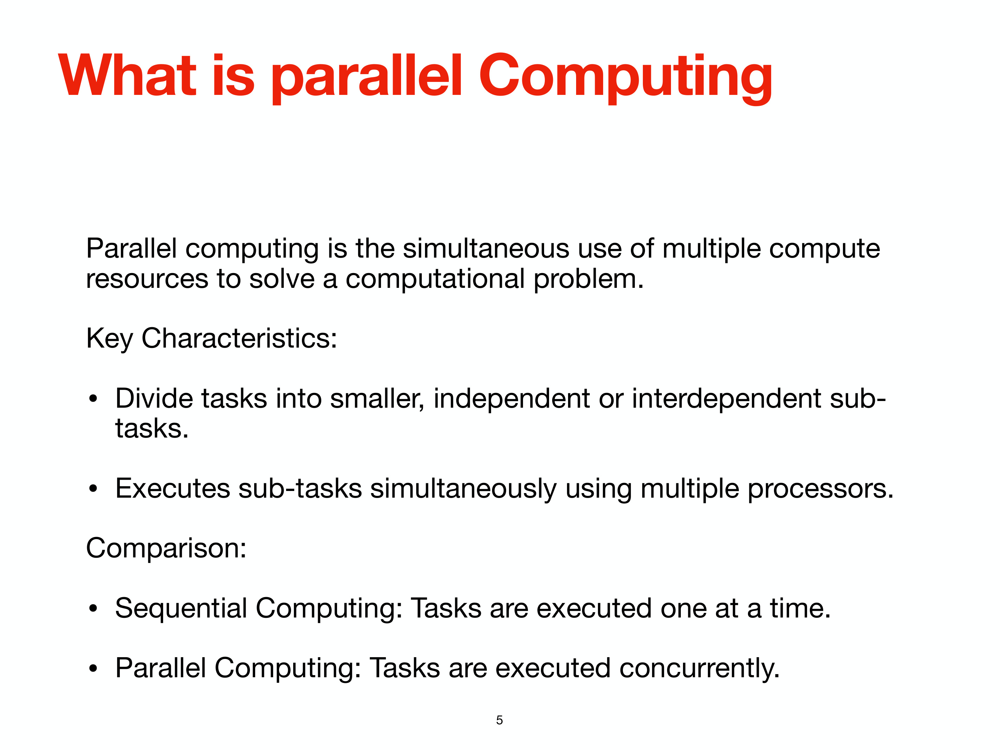
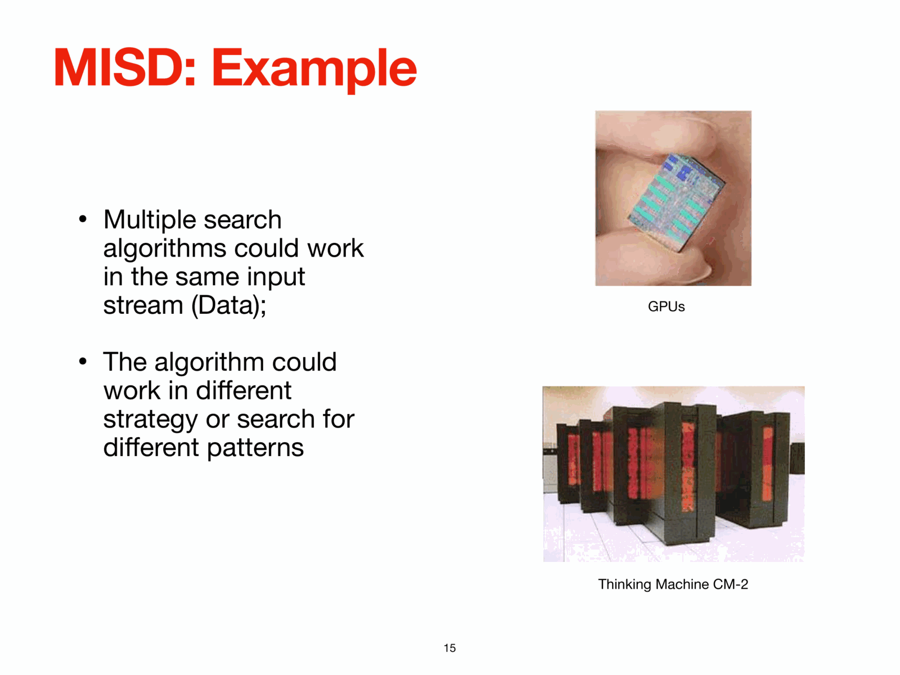


# Lesson 12 – MPI Distributed Memory Programming with Python

*Computational Astrophysics, Prof. Tiziano Zingales*  
*Index: [Computational_Astrophysics_MOC](../../../04_Atlas/Computational_Astrophysics_MOC.html)*

---

## The Message Passing Interface (MPI) Standard

The **Message Passing Interface (MPI)** is the portable, standardized message-passing system defined by the MPI Forum (1994, MPI-2 1996, MPI-3 2012). Unlike shared-memory threading (where variables reside in a common address space), MPI operates under the **Single Program, Multiple Data (SPMD)** distributed-memory paradigm:
- The same executable program runs simultaneously across $N$ distinct processes.
- Each process possesses its own private, isolated memory space.
- Processes exchange data across the network fabric by executing explicit send and receive communication calls.

In Python, the standard high-performance bindings are provided by **`mpi4py`**, which interfaces directly with underlying system C implementations (OpenMPI, MPICH, Intel MPI).

---

## MPI Process Execution and Communicators

When launching an MPI job from the terminal:

```bash
# Launch 4 parallel worker instances
mpirun -n 4 python mpi_script.py
# (Alternative syntax on Slurm clusters: srun -n 4 python mpi_script.py)
```

The runtime boots 4 independent copies of the Python interpreter. To establish their identity and coordinate tasks, processes query the default communicator:

```python
from mpi4py import MPI
import sys

# Default global communicator encompassing all launched processes
comm = MPI.COMM_WORLD

# Unique integer identifier of this process (0 <= rank < size)
rank = comm.Get_rank()

# Total number of processes in the communicator
size = comm.Get_size()

print(f"Process rank {rank} out of {size} active workers.", file=sys.stderr)
```

- **Communicator (`MPI_COMM_WORLD`)**: The communication domain grouping all active process ranks.
- **Rank**: A unique zero-indexed integer ($0, 1, \dots, N-1$) identifying each process.
- **Rank 0 (Master / Root)**: By convention, rank 0 orchestrates global I/O, file reading, and result aggregation.

---

## Object Serialization vs. Direct Buffer Communication

A crucial performance distinction in `mpi4py` is the separation between Python-level object pickling and raw C-level memory buffer passing:

```
+-----------------------------------------------------------------------------------------+
|                                  MPI4PY API CONVENTIONS                                 |
+--------------------------+------------------------------+-------------------------------+
| Method Type              | Syntax (Lower vs Upper)      | Mechanism & Performance       |
+--------------------------+------------------------------+-------------------------------+
| Python Object (Pickled)  | comm.send(), comm.recv()     | Serializes arbitrary Python   |
|                          | comm.bcast(), comm.scatter() | objects via pickle. Slow for  |
|                          |                              | large arrays; high overhead.  |
+--------------------------+------------------------------+-------------------------------+
| Direct Buffer (Zero-Copy)| comm.Send(), comm.Recv()     | Transmits contiguous C-memory |
|                          | comm.Bcast(), comm.Scatter() | (NumPy arrays). Zero-copy;    |
|                          |                              | maximum network throughput.   |
+--------------------------+------------------------------+-------------------------------+
```

### 1. Python Object Communication (Lower-case API)
```python
# Rank 0 sends a dictionary to Rank 1
if rank == 0:
    data = {"planet": "HD 209458 b", "radius_rjup": 1.35, "teff": 1450.0}
    comm.send(data, dest=1, tag=11)
elif rank == 1:
    data = comm.recv(source=0, tag=11)
    print(f"Rank 1 received dictionary: {data}")
```

### 2. Fast NumPy Buffer Communication (Upper-case API)
```python
import numpy as np

# Transmit an array of 1,000,000 double-precision floats
N = 1000000
if rank == 0:
    send_buffer = np.linspace(0.0, 10.0, N, dtype=np.float64)
    comm.Send([send_buffer, MPI.DOUBLE], dest=1, tag=77)
elif rank == 1:
    recv_buffer = np.empty(N, dtype=np.float64)
    comm.Recv([recv_buffer, MPI.DOUBLE], source=0, tag=77)
    print(f"Rank 1 received array with mean: {np.mean(recv_buffer)}")
```

---

## Point-to-Point Communication: Blocking vs. Non-Blocking

### 1. Blocking Communication and Deadlock Hazards
`comm.send()` and `comm.recv()` are **blocking calls**:
- `comm.send()` blocks until the sending memory buffer can be safely overwritten.
- `comm.recv()` blocks until the expected data has arrived from the source rank.

**The Deadlock Anti-Pattern**:
```python
# DEADLOCK HAZARD: Both processes wait for each other to send first!
if rank == 0:
    data = comm.recv(source=1)  # Blocks indefinitely waiting for rank 1
    comm.send("Message from 0", dest=1)
elif rank == 1:
    data = comm.recv(source=0)  # Blocks indefinitely waiting for rank 0
    comm.send("Message from 1", dest=0)
```
*Resolution*: Interleave send and receive order, use `Sendrecv()`, or switch to non-blocking operations.

### 2. Non-Blocking Communication (`Isend` / `Irecv`)
Non-blocking calls return immediately, returning an `MPI.Request` handle. This allows the CPU to interleave heavy physical computation while the network interface transfers data in the background (latency hiding):

```python
if rank == 0:
    data_out = np.ones(100000, dtype=np.float64)
    # Initiate non-blocking transmission
    req = comm.Isend([data_out, MPI.DOUBLE], dest=1, tag=42)
    
    # Perform intensive physical calculation while transfer is in flight
    local_result = np.sum(np.sin(np.linspace(0, 100, 500000)))
    
    # Wait for transmission to complete before modifying data_out
    req.Wait()
```

---

## Collective Communication Operations

Collective operations involve all processes in the communicator simultaneously. They are implemented using optimized logarithmic tree communication patterns.

```
       Broadcast (Bcast)                      Scatter                                Gather
     Rank 0: [ A | B | C | D ]             Rank 0: [ A | B | C | D ]             Rank 0: [ A | B | C | D ]
       │    │    │    │                      │     │     │     │                 ▲     ▲     ▲     ▲
       v    v    v    v                      v     v     v     v                 │     │     │     │
  All Ranks: [ A | B | C | D ]            R0:A  R1:B  R2:C  R3:D              R0:A  R1:B  R2:C  R3:D
```

### 1. Synchronization: `Barrier()`
Blocks every process until all processes in the communicator reach the barrier call:
```python
comm.Barrier()
```

### 2. Broadcast: `Bcast()`
Copies identical data from root rank to all other ranks:
```python
# Broadcast a 1000-point wavelength grid to all workers
if rank == 0:
    wavelengths = np.linspace(0.5, 5.0, 1000, dtype=np.float64)
else:
    wavelengths = np.empty(1000, dtype=np.float64)

comm.Bcast([wavelengths, MPI.DOUBLE], root=0)
```

### 3. Scatter: `Scatter()`
Partitions a large array on the root process into equal contiguous segments, sending one slice to each rank:
```python
# Divide 400 light curves across 4 worker ranks (100 each)
sendbuf = None
if rank == 0:
    sendbuf = np.arange(400, dtype=np.int32)

recvbuf = np.empty(100, dtype=np.int32)
comm.Scatter(sendbuf, recvbuf, root=0)
print(f"Rank {rank} received chunk starting at {recvbuf[0]}")
```

### 4. Gather: `Gather()`
Collects slices from each rank and reconstructs the ordered array on root:
```python
# Each rank computes local results and sends back to root
local_results = recvbuf ** 2
gathered_results = None
if rank == 0:
    gathered_results = np.empty(400, dtype=np.int32)

comm.Gather(local_results, gathered_results, root=0)
```

### 5. Global Reduction: `Reduce()` and `Allreduce()`
Combines partial results from all ranks using an associative mathematical reduction operator (`MPI.SUM`, `MPI.MAX`, `MPI.MIN`, `MPI.PROD`):

```python
# Compute global log-likelihood sum across distributed spectrum segments
local_chi2 = np.sum((observed_flux - model_flux)**2 / sigma**2)

# Reduce to root only
total_chi2 = comm.reduce(local_chi2, op=MPI.SUM, root=0)

# Allreduce: Computes global sum and distributes result to ALL ranks simultaneously
global_chi2 = comm.allreduce(local_chi2, op=MPI.SUM)
```

---

## Parallel Algorithmic Design Patterns

### 1. Embarrassingly Parallel Manager-Worker Queue
When computing transit likelihoods or MCMC walker updates where tasks have unequal runtimes:
- **Rank 0 (Manager)** maintains a queue of parameter vectors.
- **Ranks $1 \dots N-1$ (Workers)** request a task, execute forward radiative transfer, return the likelihood, and request the next task until the queue is exhausted.
- Completely prevents idle worker starvation (load balancing).

### 2. Domain Decomposition and Halo Exchanges
In 3D hydrodynamic simulations (e.g., planet-disk interaction or stellar convection), the spatial volume is subdivided into spatial blocks assigned to separate ranks.
- At domain boundaries, ranks execute **Halo Exchanges** (passing 1–2 layers of boundary "ghost cells" to spatial neighbors using non-blocking `Isend` and `Irecv`).

---

## Related Notes
- [11_Parallel_Computing_Architectures_and_HPC_Scaling](./11_Parallel_Computing_Architectures_and_HPC_Scaling.html)
- [08_Exoplanet_Atmospheric_Retrieval_Frameworks_and_TauREx](./08_Exoplanet_Atmospheric_Retrieval_Frameworks_and_TauREx.html)
- [10_Nested_Sampling_and_Evidence_Computation](./10_Nested_Sampling_and_Evidence_Computation.html)
- [13_CloudVeneto_HPC_Infrastructure_and_OpenStack_Deployment](./13_CloudVeneto_HPC_Infrastructure_and_OpenStack_Deployment.html)


## Computational Visuals & MPI Parallel Scaling


*Figure COMP-16: Distributed-memory communication topologies in `mpi4py`. Compares point-to-point non-blocking transfers (`MPI.Isend`, `MPI.Irecv`) with collective broadcast (`MPI.Bcast`), scatter, and global reduction operations (`MPI.Reduce`).*


*Figure COMP-17: Parallel scaling benchmarks on CloudVeneto HPC clusters. Shows strong scaling limits governed by Amdahl's Law $S(N) = \frac{1}{(1-p) + p/N}$ and weak scaling efficiency dictated by Gustafson's Law.*


<div class="backlinks-section">
  <h4 class="backlinks-title">Linked References (4)</h4>
  <ul class="backlinks-list">
    <li class="backlink-item-wrap"><a href="./11_Parallel_Computing_Architectures_and_HPC_Scaling.html" class="backlink-item">11_Parallel_Computing_Architectures_and_HPC_Scaling</a></li>
    <li class="backlink-item-wrap"><a href="./13_CloudVeneto_HPC_Infrastructure_and_OpenStack_Deployment.html" class="backlink-item">13_CloudVeneto_HPC_Infrastructure_and_OpenStack_Deployment</a></li>
    <li class="backlink-item-wrap"><a href="../../../04_Atlas/Computational_Astrophysics_MOC.html" class="backlink-item">Computational_Astrophysics_MOC</a></li>
    <li class="backlink-item-wrap"><a href="../../../03_Zettel/Computational/MPI%20distributed%20memory%20programming%20with%20mpi4py.html" class="backlink-item">MPI distributed memory programming with mpi4py</a></li>
  </ul>
</div>
