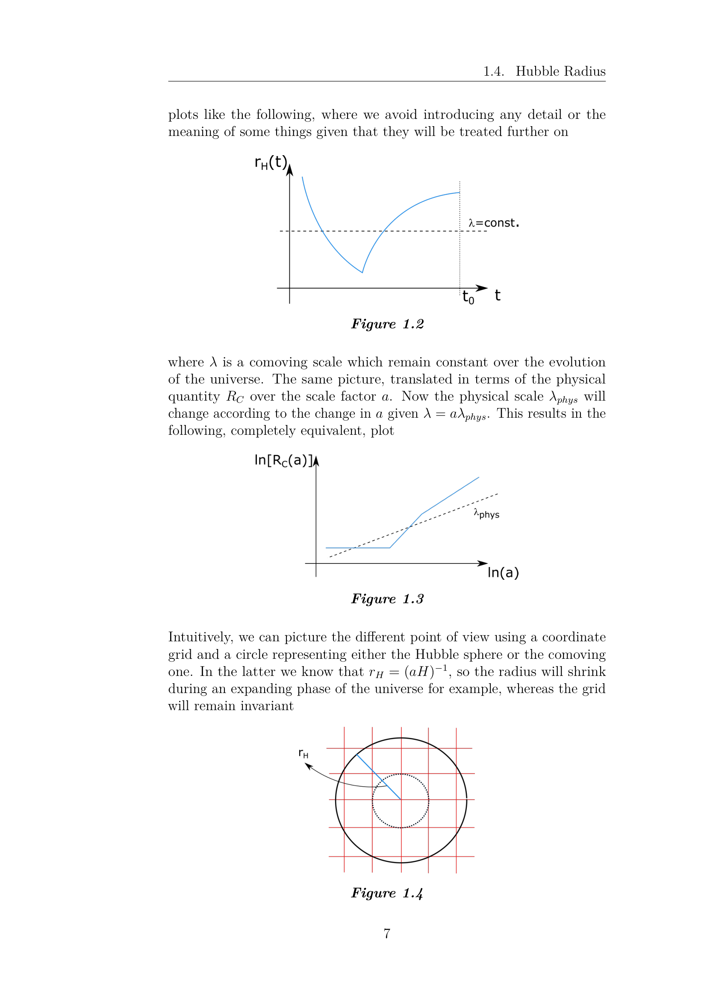

# Part 2 - Inflation Kinematics, Dynamics, and Models

*Lectures 9 to 16 notes synthesis - Prof. Nicola Bartolo*  
*Cosmology of the Early Universe - Università degli Studi di Padova*  
*Index: [[Cosmology_of_the_Early_Universe_MOC]]*  

---

## Inflaton scalar field dynamics

Accelerated cosmic expansion requires an effective fluid with equation of state $w = p/\rho < -1/3$. The simplest Lorentz-invariant field theory capable of dynamically generating negative pressure is a real scalar field $\phi(t, \vec{x})$ (the **inflaton**) minimally coupled to gravity:

$$S = \int d^4 x \sqrt{-g} \left[ \frac{M_{\rm Pl}^2}{2} R + \frac{1}{2} g^{\mu\nu} \partial_\mu \phi \partial_\nu \phi - V(\phi) \right]$$

where $M_{\rm Pl} = (8\pi G)^{-1/2} \approx 2.435 \times 10^{18}\text{ GeV}$ is the reduced Planck mass, and we adopt the signature $(+,-,-,-)$.

Varying the matter action with respect to the inverse metric $g^{\mu\nu}$ gives the energy-momentum tensor:
$$T_{\mu\nu} = \frac{2}{\sqrt{-g}} \frac{\delta S_m}{\delta g^{\mu\nu}} = \partial_\mu \phi \partial_\nu \phi - g_{\mu\nu} \left[ \frac{1}{2} g^{\alpha\beta} \partial_\alpha \phi \partial_\beta \phi - V(\phi) \right]$$

Notice that any scalar field with non-null gradient $\partial_\mu \phi$ can be recast exactly into perfect fluid form:
$$T_{\mu\nu} = (\rho + p) u_\mu u_\nu - p g_{\mu\nu}$$
by defining the four-velocity:
$$u_\mu \equiv -\frac{\partial_\mu \phi}{\sqrt{g^{\alpha\beta}\partial_\alpha \phi \partial_\beta \phi}}$$
with $u_\mu u^\mu = 1$. The energy density and pressure are:
$$\rho = \frac{1}{2} g^{\alpha\beta} \partial_\alpha \phi \partial_\beta \phi + V(\phi), \quad p = \frac{1}{2} g^{\alpha\beta} \partial_\alpha \phi \partial_\beta \phi - V(\phi)$$

For a classical, homogeneous background field $\phi(t)$:
$$\rho_\phi = \frac{1}{2}\dot{\phi}^2 + V(\phi)$$
$$p_\phi = \frac{1}{2}\dot{\phi}^2 - V(\phi)$$

The equation of state parameter is:
$$w_\phi = \frac{p_\phi}{\rho_\phi} = \frac{\frac{1}{2}\dot{\phi}^2 - V(\phi)}{\frac{1}{2}\dot{\phi}^2 + V(\phi)}$$

If the potential energy dominates over the kinetic energy ($\\frac{1}{2}\dot{\phi}^2 \ll V(\phi)$), then:
$$w_\phi \approx -1 \implies p_\phi \approx -\rho_\phi$$
driving quasi-exponential de Sitter expansion.

Varying the action with respect to $\phi$ yields the Klein-Gordon equation in curved spacetime:
$$\frac{1}{\sqrt{-g}}\partial_\mu(\sqrt{-g} g^{\mu\nu}\partial_\nu \phi) + V'(\phi) = 0$$

In a flat FLRW metric ($\sqrt{-g} = a^3(t)$):
$$\ddot{\phi} + 3H\dot{\phi} - \frac{\nabla^2 \phi}{a^2} + V'(\phi) = 0$$

For the homogeneous background $\phi_0(t)$:
$$\ddot{\phi}_0 + 3H\dot{\phi}_0 + V'(\phi_0) = 0$$
The term $3H\dot{\phi}_0$ acts as a **Hubble friction** force, dissipating kinetic energy into the expanding volume.

---

## The slow-roll approximation and parameters

Inflation requires the accelerated expansion to persist for long enough to achieve at least 50 to 60 e-folds. This demands two distinct conditions:
1. **Potential dominance**: $\dot{\phi}^2 \ll V(\phi)$, ensuring $\ddot{a} > 0$
2. **Small acceleration**: $\lvert \ddot{\phi}\rvert \ll \lvert 3H\dot{\phi}\rvert$ and $\lvert\ddot{\phi}\rvert \ll \lvert V'(\phi)\rvert$, ensuring that the field does not accelerate rapidly down the slope

Under these conditions, the background equations simplify to the **slow-roll equations**:
$$H^2 \approx \frac{V(\phi)}{3 M_{\rm Pl}^2}$$
$$3H\dot{\phi} \approx -V'(\phi)$$

Differentiating $H^2 = \frac{1}{3M_{\rm Pl}^2}\left[\frac{1}{2}\dot{\phi}^2 + V(\phi)\right]$ with respect to cosmic time:
$$2H\dot{H} = \frac{1}{3M_{\rm Pl}^2}\left[\dot{\phi}\ddot{\phi} + V'\dot{\phi}\right] = \frac{\dot{\phi}}{3M_{\rm Pl}^2}\left[\ddot{\phi} + V'\right]$$
Substituting the exact Klein-Gordon equation $\ddot{\phi} + V' = -3H\dot{\phi}$ gives an **exact identity**:
$$\dot{H} = -\frac{\dot{\phi}^2}{2 M_{\rm Pl}^2} = -4\pi G \dot{\phi}^2$$

### Hubble slow-roll parameters
We define the Hubble slow-roll parameters dynamically from the expansion rate:
$$\epsilon \equiv -\frac{\dot{H}}{H^2} = \frac{\dot{\phi}^2}{2 M_{\rm Pl}^2 H^2}$$
$$\eta \equiv -\frac{\ddot{\phi}}{H\dot{\phi}}$$

Acceleration requires:
$$\frac{\ddot{a}}{a} = H^2 + \dot{H} = H^2(1 - \epsilon) > 0 \iff \epsilon < 1$$
Inflation terminates precisely when $\epsilon = 1$. The second parameter $\eta \ll 1$ ensures that $\epsilon$ varies sufficiently slowly, guaranteeing that inflation lasts long enough. Differentiating $\epsilon$:
$$\frac{\dot{\epsilon}}{H} = 2\epsilon(\epsilon - \eta)$$

### Potential slow-roll parameters
Using the slow-roll relations $H^2 \approx V/(3M_{\rm Pl}^2)$ and $\dot{\phi} \approx -V'/(3H)$, we define parameters solely in terms of the potential $V(\phi)$:
$$\epsilon_V \equiv \frac{M_{\rm Pl}^2}{2}\left(\frac{V'}{V}\right)^2$$
$$\eta_V \equiv M_{\rm Pl}^2 \frac{V''}{V}$$

To lowest order in slow roll:
$$\epsilon \approx \epsilon_V, \quad \eta \approx \eta_V - \epsilon_V$$

---

## Number of e-folds and horizon exit

The duration of inflation is measured in e-folds of scale factor expansion:
$$N \equiv \ln\left(\frac{a_{\rm end}}{a(t)}\right) = \int_t^{t_{\rm end}} H\, dt'$$

Using the slow-roll relation $dt = \frac{d\phi}{\dot{\phi}} \approx -\frac{3H}{V'} d\phi$:
$$N(\phi) \approx \int_{\phi_{\rm end}}^{\phi} \frac{H^2}{V'} d\phi' = \frac{1}{M_{\rm Pl}^2} \int_{\phi_{\rm end}}^{\phi} \frac{V}{V'} d\phi' = \frac{1}{M_{\rm Pl}} \int_{\phi_{\rm end}}^{\phi} \frac{d\phi'}{\sqrt{2\epsilon_V}}$$

To solve the horizon and flatness problems, CMB observational scales must leave the comoving Hubble radius $(aH)^{-1}$ approximately 50 to 60 e-folds before the end of inflation:
$$N_{\rm CMB} \approx 55 - 65$$

---

## Classification of inflationary models

Inflationary models are characterized by the functional form of $V(\phi)$ and the field excursion $\Delta\phi$:

### 1. Large-field models (Chaotic inflation)
Potentials of monomial form $V(\phi) = \lambda M_{\rm Pl}^4 \left(\frac{\phi}{M_{\rm Pl}}\right)^p$:
* Quadratic: $V(\phi) = \frac{1}{2}m^2\phi^2$
  $$\epsilon_V = \frac{2 M_{\rm Pl}^2}{\phi^2}, \quad \eta_V = \frac{2 M_{\rm Pl}^2}{\phi^2}$$
  Inflation ends when $\epsilon_V = 1 \implies \phi_{\rm end} = \sqrt{2} M_{\rm Pl}$.
  The e-folds relation gives:
  $$N = \frac{\phi^2 - \phi_{\rm end}^2}{4 M_{\rm Pl}^2} \implies \phi_N = \sqrt{4N + 2}\, M_{\rm Pl} \approx 15 M_{\rm Pl}$$
  Because $\Delta\phi > M_{\rm Pl}$, this is a large-field model. Large-field models predict detectable tensor modes ($r \sim 4p/N$), but simple monomials ($m^2\phi^2$, $\lambda\phi^4$) are now ruled out by the Planck/BICEP limit $r < 0.032$.

### 2. Small-field models (Hilltop / symmetry breaking)
Potentials of the form $V(\phi) = V_0 \left[1 - \left(\frac{\phi}{\mu}\right)^p\right]$ with $\phi < \mu$:
* Inflation occurs as the field rolls away from an unstable local maximum ($\phi = 0$).
* $\eta_V < 0$, giving $n_s < 1$.
* Field excursion is sub-Planckian ($\Delta\phi < M_{\rm Pl}$), predicting unobservably small tensor modes ($r \ll 10^{-3}$).

### 3. Starobinsky $R^2$ inflation and plateau models
Originally derived from a modified gravity Lagrangian $\mathcal{L} = \frac{M_{\rm Pl}^2}{2}(R + \frac{R^2}{6M^2})$, which upon conformal transformation $g_{\mu\nu} \to \tilde{g}_{\mu\nu} = \left(1 + \frac{R}{3M^2}\right)g_{\mu\nu}$ is dynamically equivalent to Einstein gravity coupled to a scalar field with potential:
$$V(\phi) = V_0 \left(1 - e^{-\sqrt{2/3}\, \phi / M_{\rm Pl}}\right)^2$$
For large field values $\phi \gg M_{\rm Pl}$, the potential approaches an asymptotically flat plateau:
$$\epsilon_V \approx \frac{4}{3} e^{-2\sqrt{2/3}\, \phi / M_{\rm Pl}} \approx \frac{3}{4 N^2}$$
$$\eta_V \approx -\frac{4}{3} e^{-\sqrt{2/3}\, \phi / M_{\rm Pl}} \approx -\frac{1}{N}$$
This predicts:
$$n_s = 1 - 6\epsilon_V + 2\eta_V \approx 1 - \frac{2}{N} \approx 0.965$$
$$r = 16\epsilon_V \approx \frac{12}{N^2} \approx 0.0033$$
This prediction sits directly at the sweet spot of the Planck 2018 + BICEP/Keck observational contours.

### 4. Natural inflation
The inflaton is an axion-like pseudo-Nambu-Goldstone boson with shift symmetry broken to a discrete symmetry:
$$V(\phi) = \Lambda^4 \left[1 + \cos\left(\frac{\phi}{f}\right)\right]$$
The shift symmetry protects the flat potential from large quantum radiative corrections. Consistency with Planck data requires a super-Planckian decay constant $f \gtrsim 5 M_{\rm Pl}$.

---

## The cosmic no-hair theorem and the $\eta$-problem

### Cosmic no-hair theorem (Wald 1983)
All initially expanding homogeneous Bianchi spacetimes with a positive cosmological constant (or slow-rolling scalar field with $V > 0$) rapidly asymptote toward the isotropic de Sitter spacetime on a timescale $t_{\rm iso} \sim H^{-1}$. Spatial anisotropies and shear decay exponentially as $e^{-3Ht}$. This explains why initial spatial anisotropies do not destroy inflation.

### The $\eta$-problem
In supergravity and effective field theories, scalar fields generically receive mass corrections from higher-dimension operators:
$$\Delta V \sim \frac{\mathcal{O}_6}{M_{\rm Pl}^2} \sim \frac{V(\phi)}{M_{\rm Pl}^2} \phi^2$$
Differentiating with respect to $\phi$ introduces a mass correction:
$$\Delta m_\phi^2 = \Delta V'' \sim \frac{V}{M_{\rm Pl}^2} \sim 3H^2$$
This immediately pushes the second slow-roll parameter to order unity:
$$\Delta\eta_V = M_{\rm Pl}^2 \frac{\Delta V''}{V} \sim 1$$
terminating inflation prematurely. Preserving $\eta_V \ll 1$ requires either fine-tuned cancellations or protective symmetries (such as supersymmetry or shift symmetry).

---

## Connections and vault links

* Companion zettels:
  - [[Single-field slow-roll inflation dynamics]]
  - [[Slow-roll parameters epsilon and eta]]
  - [[Number of e-folds and horizon exit]]
  - [[Large-field versus small-field inflation models]]
  - [[Lyth bound and field excursion]]
  - [[Starobinsky R-squared inflation]]
* Previous module: [[Part1_Standard_Big_Bang_and_Shortcomings]]
* Next module: [[Part3_Quantum_Perturbations_and_Power_Spectra]]
* Atlas: [[Cosmology_of_the_Early_Universe_MOC]]

## Theoretical Visuals & Inflaton Dynamics

*Figure CEU-01: Inflaton potential $V(\phi)$ satisfying the slow-roll conditions $\epsilon = \frac{M_{\mathrm{pl}}^2}{2}\left(\frac{V'}{V}\right)^2 \ll 1$ and $\eta = M_{\mathrm{pl}}^2 \frac{V''}{V} \ll 1$. Shows slow-roll trajectory along the plateau followed by rapid oscillation at the potential minimum during reheating.*

*Figure CEU-02: Evolution of the comoving Hubble horizon $(aH)^{-1}$. During inflation, $\ddot{a} > 0 \implies \frac{d}{dt}(aH)^{-1} < 0$, causing physical scales $k^{-1}$ to exit the horizon and freeze out, solving the horizon and flatness problems.*

*Figure CEU-03: Phase portrait $(\phi, \dot{\phi})$ demonstrating the cosmic no-hair theorem and universal slow-roll attractor behavior for chaotic and plateau inflation models.*

## Linked References

- [[Large-field versus small-field inflation models]]
- [[Lyth bound and field excursion]]
- [[Number of e-folds and horizon exit]]
- [[Single-field slow-roll inflation dynamics]]
- [[Slow-roll parameters epsilon and eta]]
- [[Starobinsky R-squared inflation]]
- [[Cosmology_of_the_Early_Universe_MOC]]

