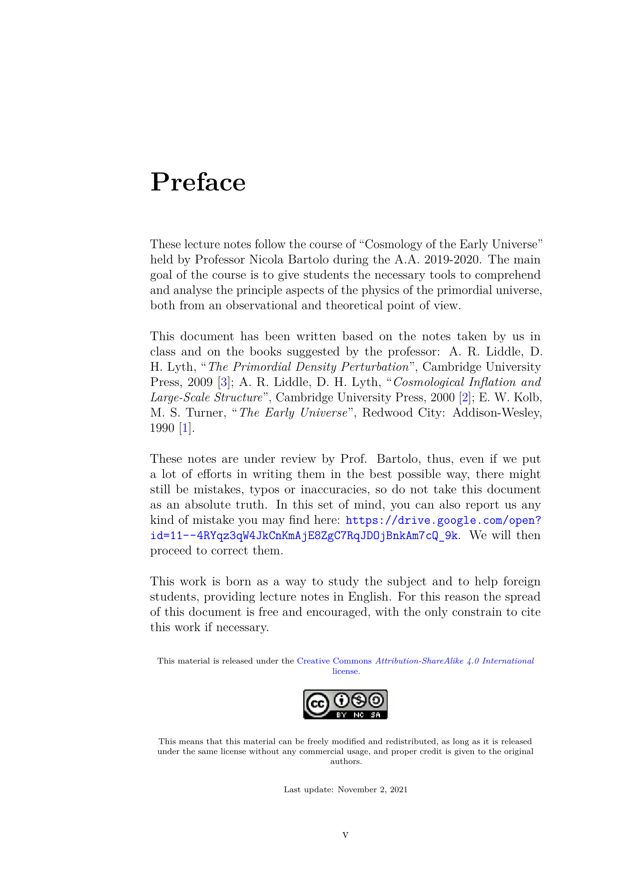
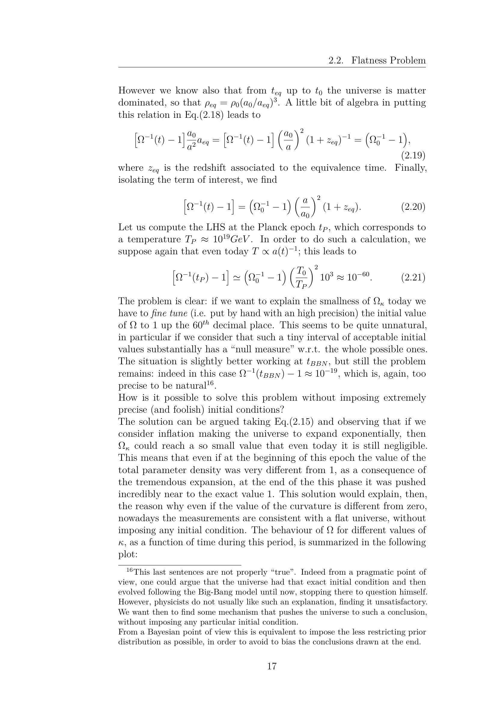
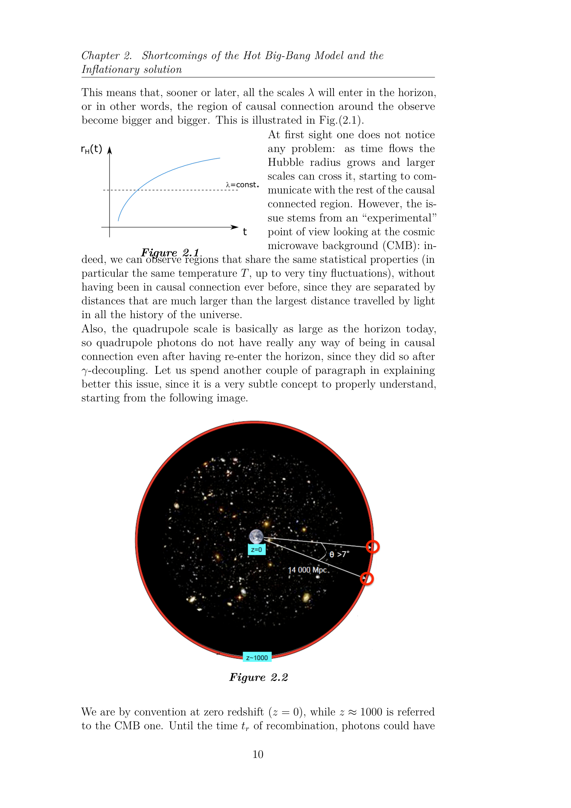

# Part 3 - Quantum Generation of Perturbations and Power Spectra

*Lectures 17 to 23 notes synthesis - Prof. Nicola Bartolo*  
*Cosmology of the Early Universe - Università degli Studi di Padova*  
*Index: [[Cosmology_of_the_Early_Universe_MOC]]*  

---

## Quantum origin of cosmological perturbations

Cosmic inflation does not merely smooth and flatten the classical universe; its deepest physical achievement is providing the quantum mechanical seed fluctuations that grew into all galaxies, clusters, and temperature anisotropies of the cosmic microwave background.

During inflation, the spacetime metric and the inflaton field undergo quantum fluctuations:
$$\phi(t, \vec{x}) = \phi_0(t) + \delta\phi(t, \vec{x})$$
$$g_{\mu\nu}(t, \vec{x}) = g^{(0)}_{\mu\nu}(t) + \delta g_{\mu\nu}(t, \vec{x})$$

The perturbed Klein-Gordon equation in expanding spacetime is:
$$\ddot{\delta\phi} + 3H\dot{\delta\phi} - \frac{\nabla^2 \delta\phi}{a^2} + V''(\phi_0)\delta\phi = 0$$

In conformal time $\tau = \int dt/a(t)$ (where $a(\tau) \approx -1/(H\tau)$ for de Sitter, $\tau \in (-\infty, 0)$), we rescale the field fluctuation to canonically normalize the kinetic term:
$$u(\tau, \vec{x}) \equiv a(\tau) \delta\phi(\tau, \vec{x})$$

Taking the spatial Fourier transform:
$$u(\tau, \vec{x}) = \int \frac{d^3 k}{(2\pi)^3} u_k(\tau) e^{i\vec{k}\cdot\vec{x}}$$
the mode function $u_k(\tau)$ obeys the **Mukhanov-Sasaki equation**:
$$u_k''(\tau) + \left[k^2 - \frac{a''}{a} + a^2 V''(\phi_0)\right] u_k(\tau) = 0$$

where primes denote derivatives with respect to conformal time $\tau$. In pure de Sitter space with a light scalar field ($V'' \ll H^2$), $a(\tau) = -1/(H\tau)$, so:
$$\frac{a''}{a} = \frac{2}{\tau^2}$$
and the mode equation reduces to:
$$u_k''(\tau) + \left(k^2 - \frac{2}{\tau^2}\right) u_k(\tau) = 0$$

---

## Canonical quantization and the Bunch-Davies vacuum

We promote the classical field perturbation to an operator:
$$\hat{\delta\phi}(\tau, \vec{x}) = \int \frac{d^3 k}{(2\pi)^3} \left[ \frac{u_k(\tau)}{a(\tau)} \hat{a}_{\vec{k}} e^{i\vec{k}\cdot\vec{x}} + \frac{u_k^*(\tau)}{a(\tau)} \hat{a}_{\vec{k}}^\dagger e^{-i\vec{k}\cdot\vec{x}} \right]$$

where the annihilation and creation operators satisfy the standard commutation relations:
$$[\hat{a}_{\vec{k}}, \hat{a}_{\vec{k}'}^\dagger] = (2\pi)^3 \delta^{(3)}(\vec{k} - \vec{k}'), \quad [\hat{a}_{\vec{k}}, \hat{a}_{\vec{k}'}] = 0$$

Canonical quantization requires the Wronskian normalization condition:
$$u_k^*(\tau) u_k'(\tau) - u_k(\tau) u_k^{*\prime}(\tau) = -i$$

### Mode boundary condition (Bunch-Davies vacuum)
In the asymptotic past ($\tau \to -\infty$, or physical wavelength $\lambda = 2\pi a/k \ll H^{-1}$), every Fourier mode is deep inside the Hubble radius. The spatial curvature and cosmic expansion rate are negligible compared to the mode frequency ($k^2 \gg a''/a \approx 2/\tau^2$). Therefore, the mode behaves exactly like a harmonic oscillator in flat Minkowski spacetime. We select the positive-frequency Minkowski ground state:
$$\lim_{\tau \to -\infty} u_k(\tau) = \frac{1}{\sqrt{2k}} e^{-ik\tau}$$
This uniquely specifies the **Bunch-Davies vacuum** state $\vert 0 \rangle$, defined by $\hat{a}_{\vec{k}}\vert 0 \rangle = 0$ for all $\vec{k}$.

---

## Mode evolution and super-horizon freeze-out

The exact solution to $u_k'' + (k^2 - 2/\tau^2)u_k = 0$ satisfying the Bunch-Davies condition is:
$$u_k(\tau) = \frac{e^{-ik\tau}}{\sqrt{2k}} \left(1 - \frac{i}{k\tau}\right)$$

The physical field fluctuation is $\delta\phi_k(\tau) = u_k(\tau)/a(\tau) = -H\tau\, u_k(\tau)$:
$$\delta\phi_k(\tau) = -\frac{H\tau}{\sqrt{2k}} e^{-ik\tau} \left(1 - \frac{i}{k\tau}\right) = \frac{H}{\sqrt{2k^3}} (i - k\tau) e^{-ik\tau}$$

Two asymptotic regimes govern this solution:

### 1. Sub-horizon regime ($k \gg aH \iff -k\tau \gg 1$)
$$\delta\phi_k(\tau) \approx \frac{1}{a(\tau)\sqrt{2k}} e^{-ik\tau}$$
The mode oscillates rapidly with decaying physical amplitude $\propto 1/a$. These are ordinary microscopic quantum zero-point fluctuations.

### 2. Super-horizon regime ($k \ll aH \iff -k\tau \ll 1$)
As the universe expands, physical wavelength grows exponentially until it exits the Hubble radius ($k = aH$). Outside the horizon:
$$\delta\phi_k(\tau) \to \frac{i H}{\sqrt{2k^3}} = \text{constant}$$
The quantum mode **freezes out**. Its phase becomes constant, its amplitude locks in, and the quantum fluctuation decoheres into a classical stochastic perturbation!

The 2-point correlation function in vacuum is:
$$\langle 0 \vert \hat{\delta\phi}(\tau, \vec{x}) \hat{\delta\phi}(\tau, \vec{x}') \vert 0 \rangle = \int \frac{d^3 k}{(2\pi)^3} P_{\delta\phi}(k) e^{i\vec{k}\cdot(\vec{x}-\vec{x}')}$$
where the power spectrum is $P_{\delta\phi}(k) = \lvert \delta\phi_k\rvert^2 = \frac{H^2}{2k^3}$.

The **dimensionless power spectrum** is:
$$\mathcal{P}_{\delta\phi}(k) \equiv \frac{k^3}{2\pi^2} P_{\delta\phi}(k) = \left(\frac{H}{2\pi}\right)^2$$
This is the foundational result of inflationary quantum field theory: a massless scalar field in de Sitter spacetime develops a scale-invariant spectrum of fluctuations with variance $(H/2\pi)^2$.

---

## Primordial scalar curvature perturbations

To relate field fluctuations to cosmological density perturbations, we use the gauge-invariant **comoving curvature perturbation** $\mathcal{R}$ (or $\zeta$ on uniform energy density slices):
$$\mathcal{R} = \psi + \frac{H}{\dot{\phi}_0}\delta\phi$$
In spatially flat gauge ($\psi = 0$):
$$\mathcal{R} = \frac{H}{\dot{\phi}_0}\delta\phi$$

Because $\mathcal{R}$ is strictly **conserved outside the horizon** ($k \ll aH$) for adiabatic perturbations, its value at horizon exit during inflation determines its amplitude upon horizon re-entry during the radiation and matter eras.

The power spectrum of curvature perturbations is:
$$\mathcal{P}_\mathcal{R}(k) = \left(\frac{H}{\dot{\phi}_0}\right)^2 \mathcal{P}_{\delta\phi}(k) = \left(\frac{H}{\dot{\phi}_0}\right)^2 \left(\frac{H}{2\pi}\right)^2 = \frac{H^4}{4\pi^2 \dot{\phi}_0^2}\Bigg\vert_{k=aH}$$

Using the slow-roll relation $\epsilon = \frac{\dot{\phi}_0^2}{2 M_{\rm Pl}^2 H^2} \approx \epsilon_V$:
$$\mathcal{P}_\mathcal{R}(k) = \frac{1}{24\pi^2 M_{\rm Pl}^4} \frac{V}{\epsilon_V}\Bigg\vert_{k=aH} = \frac{1}{8\pi^2 M_{\rm Pl}^2} \frac{H^2}{\epsilon}\Bigg\vert_{k=aH}$$

### Scalar spectral index $n_s$
The scale dependence of the scalar power spectrum is parameterized by:
$$\mathcal{P}_\mathcal{R}(k) = A_s \left(\frac{k}{k_0}\right)^{n_s - 1}$$
$$n_s - 1 \equiv \frac{d\ln\mathcal{P}_\mathcal{R}}{d\ln k}$$

Using $d\ln k = d\ln(aH) \approx H dt = dN$:
$$n_s - 1 = \frac{d}{dN}\ln\left(\frac{H^4}{\dot{\phi}^2}\right) = 2\eta_V - 6\epsilon_V$$

Since slow-roll requires $\epsilon_V, \lvert \eta_V\rvert \ll 1$, inflation naturally predicts a **nearly scale-invariant, slightly red-tilted spectrum** ($n_s < 1$).
Planck 2018 measurements confirm:
$$n_s = 0.9649 \pm 0.0042, \quad A_s \approx 2.1 \times 10^{-9}$$
Exact scale invariance ($n_s = 1$, the Harrison-Zeldovich spectrum) is ruled out at more than $8\sigma$ confidence!

---

## Primordial gravitational waves (tensor perturbations)

Metric tensor perturbations represent transverse-traceless ripples in the spatial metric:
$$g_{ij} = a^2(t)\left[\delta_{ij} + h_{ij}(t, \vec{x})\right]$$
with $\delta^{ij}h_{ij} = 0$ and $\partial^i h_{ij} = 0$. The perturbation $h_{ij}$ has 2 independent degrees of freedom corresponding to the $+$ and $\times$ polarization states:
$$h_{ij}(t, \vec{x}) = \sum_{\lambda = +, \times} h_\lambda(t, \vec{x}) e_{ij}^\lambda$$

Substituting this into the Einstein-Hilbert action expanded to second order gives the action for each polarization mode:
$$S_T = \frac{M_{\rm Pl}^2}{8} \int dt\, d^3 x\, a^3 \left[ \dot{h}_{ij}\dot{h}^{ij} - \frac{(\nabla h_{ij})^2}{a^2} \right]$$

Defining canonically normalized tensor variables:
$$v_\lambda(\tau, \vec{x}) \equiv \frac{a(\tau) M_{\rm Pl}}{2} h_\lambda(\tau, \vec{x})$$
each mode function $v_k(\tau)$ obeys the exact same harmonic equation as a massless scalar:
$$v_k''(\tau) + \left(k^2 - \frac{a''}{a}\right) v_k(\tau) = 0$$

Quantizing in the Bunch-Davies vacuum yields the tensor power spectrum:
$$\mathcal{P}_T(k) \equiv 2 \times \left(\frac{2}{a M_{\rm Pl}}\right)^2 \frac{k^3}{2\pi^2} \lvert v_k\rvert^2 = \frac{2}{\pi^2} \frac{H^2}{M_{\rm Pl}^2}\Bigg\vert_{k=aH} = \frac{2}{3\pi^2} \frac{V}{M_{\rm Pl}^4}\Bigg\vert_{k=aH}$$

### Tensor spectral index $n_T$ and consistency relation
$$\mathcal{P}_T(k) = A_t \left(\frac{k}{k_0}\right)^{n_T}$$
$$n_T \equiv \frac{d\ln\mathcal{P}_T}{d\ln k} = \frac{1}{H}\frac{d\ln H^2}{dt} = 2\frac{\dot{H}}{H^2} = -2\epsilon$$

The tensor spectrum is strictly red-tilted ($n_T < 0$).

### Tensor-to-scalar ratio $r$
The ratio of tensor to scalar power is:
$$r \equiv \frac{\mathcal{P}_T(k_0)}{\mathcal{P}_\mathcal{R}(k_0)} = \frac{\frac{2}{\pi^2}\frac{H^2}{M_{\rm Pl}^2}}{\frac{1}{8\pi^2}\frac{H^2}{\epsilon M_{\rm Pl}^2}} = 16\epsilon = 16\epsilon_V$$

This yields the **consistency relation of single-field slow-roll inflation**:
$$r = -8 n_T$$
Verifying this relation experimentally is the definitive smoking gun of single-field slow-roll inflation.

---

## Inflation energy scale and the Lyth bound

### Energy scale of inflation
Because $\mathcal{P}_T \propto V$, measuring $r$ fixes the absolute energy scale of inflation directly:
$$V^{1/4} = \left(\frac{3\pi^2}{2} M_{\rm Pl}^4 r \mathcal{P}_\mathcal{R}\right)^{1/4} \approx 1.88 \times 10^{16}\text{ GeV} \left(\frac{r}{0.10}\right)^{1/4}$$
If $r \sim 10^{-2}$–$10^{-3}$, inflation occurred at the Grand Unified Theory (GUT) scale ($10^{16}\text{ GeV}$).

### The Lyth bound (Lyth 1997)
Relating the tensor-to-scalar ratio to field excursion during observable inflation:
$$\frac{d\phi}{dN} = \frac{\dot{\phi}}{H} = \sqrt{2\epsilon}\, M_{\rm Pl} = \sqrt{\frac{r}{8}}\, M_{\rm Pl}$$
Integrating over the $\Delta N \approx 4$ to $6$ e-folds during which observable CMB modes crossed the horizon:
$$\frac{\Delta\phi}{M_{\rm Pl}} = \int_0^{\Delta N} \sqrt{\frac{r}{8}}\, dN \approx \mathcal{O}(1) \times \left(\frac{r}{0.01}\right)^{1/2}$$

Therefore:
* A detection of $r \gtrsim 0.01$ implies super-Planckian field excursion $\Delta\phi > M_{\rm Pl}$ (large-field models).
* If $r \ll 10^{-3}$, field excursions were sub-Planckian $\Delta\phi \ll M_{\rm Pl}$ (small-field models).

Current experimental constraints from Planck 2018 + BICEP/Keck (Tristram et al. 2021) place an upper bound:
$$r < 0.032 \quad (95\%\text{ CL})$$
Future experiments (LiteBIRD, CMB-S4) aim to reach sensitivity $\sigma(r) \sim 10^{-3}$, testing all large-field models and the Starobinsky plateau.

---

## Connections and vault links

* Companion zettels:
  - [[Quantum fluctuations of the inflaton field]]
  - [[Sasaki-Mukhanov variable and equation]]
  - [[Bunch-Davies vacuum and mode functions]]
  - [[Curvature perturbation R and zeta]]
  - [[Scalar primordial power spectrum and spectral index]]
  - [[Tensor perturbations and primordial gravitational waves]]
  - [[Tensor-to-scalar ratio r and inflation energy scale]]
  - [[Consistency relation of single-field slow-roll inflation]]
* Previous module: [[Part2_Inflation_Kinematics_Dynamics_and_Models]]
* Next module: [[Part4_Advanced_Formalisms_and_Non_Gaussianity]]
* Atlas: [[Cosmology_of_the_Early_Universe_MOC]]

## Theoretical Visuals & Quantum Perturbations

*Figure CEU-04: Mukhanov-Sasaki mode evolution $v_k'' + \left(k^2 - \frac{z''}{z}\right) v_k = 0$. Sub-horizon modes ($k \gg aH$) oscillate as free quantum fields in the Bunch-Davies vacuum $v_k \sim \frac{e^{-ik\tau}}{\sqrt{2k}}$, while super-horizon modes ($k \ll aH$) freeze out as constant classical curvature perturbations $\mathcal{R}_k$.*

*Figure CEU-05: Horizon exit diagram demonstrating the conservation of the comoving curvature perturbation $\mathcal{R}_k$ on super-Hubble scales in the presence of purely adiabatic perturbations.*

*Figure CEU-06: Asymptotic structure of curved de Sitter spacetime and definition of the unique initial Bunch-Davies vacuum state in conformal time $\tau \to -\infty$.*

*Figure CEU-07: Primordial scalar power spectrum $\mathcal{P}_\mathcal{R}(k) = A_s (k/k_*)^{n_s - 1}$ with red tilt $n_s - 1 = 2\eta - 6\epsilon \approx -0.035$, in exact agreement with Planck CMB observations.*

*Figure CEU-08: Primordial gravitational wave tensor power spectrum $\mathcal{P}_t(k) = \frac{2 H^2}{\pi^2 M_{\mathrm{pl}}^2}$ and current experimental upper limits on the tensor-to-scalar ratio $r = 16\epsilon < 0.036$ from BICEP/Keck and Planck.*

## Linked References

- [[Bunch-Davies vacuum and mode functions]]
- [[Consistency relation of single-field slow-roll inflation]]
- [[Curvature perturbation R and zeta]]
- [[Quantum fluctuations of the inflaton field]]
- [[Sasaki-Mukhanov variable and equation]]
- [[Scalar primordial power spectrum and spectral index]]
- [[Tensor perturbations and primordial gravitational waves]]
- [[Tensor-to-scalar ratio r and inflation energy scale]]
- [[Cosmology_of_the_Early_Universe_MOC]]

