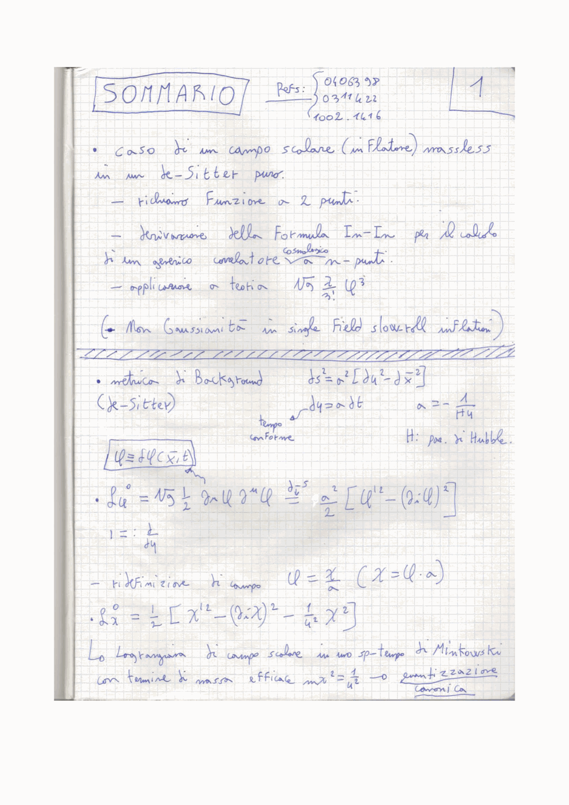
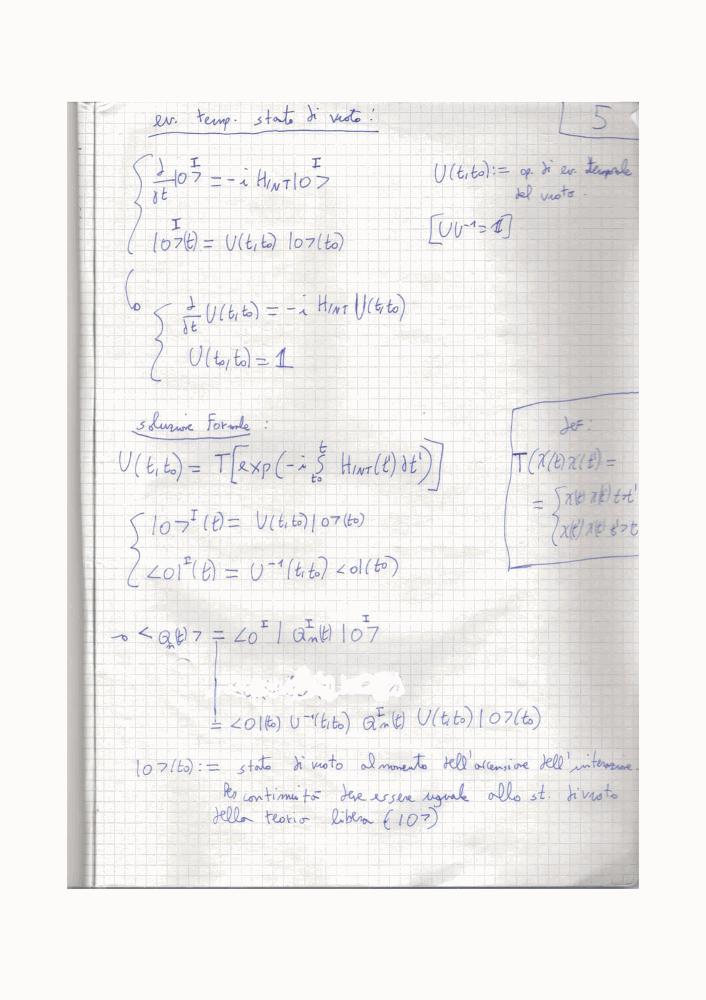
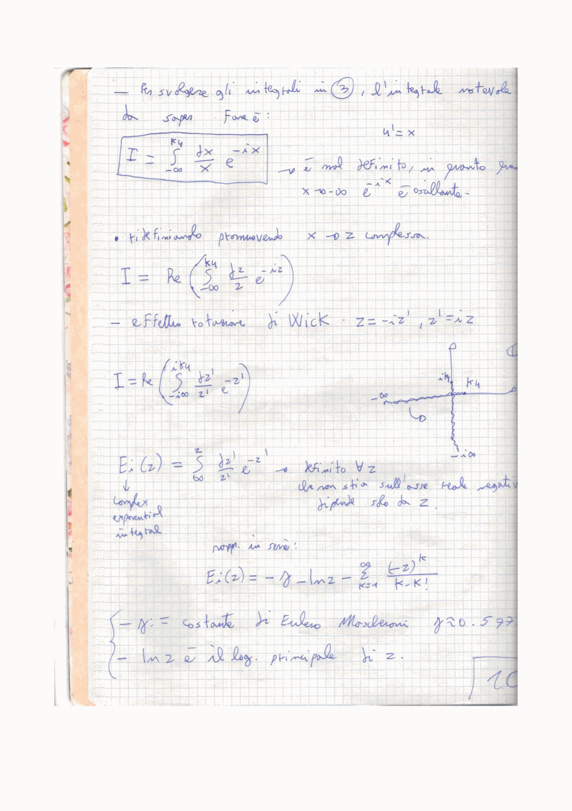

# Part 4 - Advanced Formalisms and Primordial Non-Gaussianity

*Lectures 24 to 27 notes synthesis - Prof. Nicola Bartolo*  
*Cosmology of the Early Universe - Università degli Studi di Padova*  
*Index: [[Cosmology_of_the_Early_Universe_MOC]]*  

---

## Beyond the two-point function

In the simplest models of inflation, quantum fluctuations of the inflaton field are treated as free, non-interacting Gaussian fields. For a Gaussian random field, all odd correlation functions vanish:
$$\langle \zeta(\vec{x}_1)\zeta(\vec{x}_2)\zeta(\vec{x}_3) \rangle = 0$$
and all higher even correlation functions reduce entirely to sums of products of the 2-point function (Wick's theorem). The statistical distribution is fully specified by the 2-point correlator in Fourier space:
$$\langle \zeta_{\vec{k}_1}\zeta_{\vec{k}_2} \rangle = (2\pi)^3 \delta^{(3)}(\vec{k}_1 + \vec{k}_2) P_\zeta(k_1)$$

However, the inflaton field must interact:
1. It has self-interactions given by the potential $V(\phi)$ (e.g. $V'''(\phi_0) \neq 0$).
2. It is non-linearly coupled to gravity through the Einstein-Hilbert action.
3. In multi-field models or theories with non-canonical kinetic terms, derivative interactions can be large.

These non-linearities induce deviations from Gaussianity. Primordial non-Gaussianity is the most sensitive observational tool available to discriminate between the simplest single-field slow-roll models and the vast zoo of alternative mechanisms.

---

## The bispectrum and the $f_{\rm NL}$ parameter

The lowest-order diagnostic of non-Gaussianity is the 3-point correlation function in Fourier space, called the **bispectrum** $B_\zeta(k_1, k_2, k_3)$:
$$\langle \zeta_{\vec{k}_1}\zeta_{\vec{k}_2}\zeta_{\vec{k}_3} \rangle = (2\pi)^3 \delta^{(3)}(\vec{k}_1 + \vec{k}_2 + \vec{k}_3) B_\zeta(k_1, k_2, k_3)$$

The Dirac delta enforces spatial translation invariance: the three wavevectors must sum to zero:
$$\vec{k}_1 + \vec{k}_2 + \vec{k}_3 = 0$$
forming a closed triangle in momentum space. Spatial isotropy implies that $B_\zeta$ depends only on the magnitudes $k_1, k_2, k_3$.

### The local parameterization
Historically, non-Gaussianity was introduced in real space as a quadratic correction to a Gaussian field $\zeta_G(\vec{x})$:
$$\zeta(\vec{x}) = \zeta_G(\vec{x}) + \frac{3}{5} f_{\rm NL}^{\rm local} \left[ \zeta_G^2(\vec{x}) - \langle \zeta_G^2 \rangle \right]$$
where the factor $3/5$ is a historical convention connecting the primordial curvature perturbation $\zeta$ to the Newtonian gravitational potential during matter domination ($\Phi = \frac{3}{5}\zeta$).

Computing the 3-point function of this field via Wick's theorem yields the **local bispectrum**:
$$B_\zeta^{\rm local}(k_1, k_2, k_3) = \frac{6}{5} f_{\rm NL}^{\rm local} \left[ P_\zeta(k_1)P_\zeta(k_2) + P_\zeta(k_1)P_\zeta(k_3) + P_\zeta(k_2)P_\zeta(k_3) \right]$$

---

## Triangle configurations and bispectrum shapes

The physical mechanism generating non-Gaussianity leaves an unmistakable signature on the shape of the momentum triangle:

### 1. Local shape (squeezed limit)
* Configuration: $k_1 \ll k_2 \approx k_3$. One mode is far outside the horizon while the other two are crossing.
* The local bispectrum diverges in this limit:
  $$B_\zeta^{\rm local}(k_1, k_2, k_3) \propto \frac{1}{k_1^3 k_2^3}$$
* Physical origin: Super-horizon interactions, characteristic of **multi-field inflation** (such as the curvaton model or modulated reheating), where fluctuations of an isocurvature field modulate the local expansion rate.

### 2. Equilateral shape
* Configuration: $k_1 \approx k_2 \approx k_3$.
* Vanishes in the squeezed limit, peaking when all three modes have comparable wavelengths.
* Physical origin: Derivative interactions occurring at horizon crossing ($k \sim aH$). Models with **non-canonical kinetic terms** $\mathcal{L}(X, \phi)$ (where $X = \frac{1}{2}g^{\mu\nu}\partial_\mu\phi\partial_\nu\phi$), such as k-inflation and DBI inflation:
  $$c_s^2 \equiv \frac{\mathcal{L}_{,X}}{\mathcal{L}_{,X} + 2X\mathcal{L}_{,XX}}$$
  When the sound speed $c_s \ll 1$, derivative self-interactions are enhanced:
  $$f_{\rm NL}^{\rm equil} \sim -\frac{1}{c_s^2}$$

### 3. Folded (flattened) and orthogonal shapes
* Configuration: $k_1 + k_2 \approx k_3$.
* Peaked for collinear wavevectors, probing non-Bunch-Davies initial vacuum states or excited states in modified gravity.

---

## The In-In (Schwinger-Keldysh) formalism

Standard quantum field theory relies on the In-Out $S$-matrix formalism, computing transition amplitudes between an asymptotic vacuum $\vert 0_{\rm in} \rangle$ at $t \to -\infty$ and an asymptotic vacuum $\vert 0_{\rm out} \rangle$ at $t \to +\infty$:
$$\langle 0_{\rm out} \vert T[\dots] \vert 0_{\rm in} \rangle$$

In cosmology, we cannot observe the infinite future vacuum $\vert 0_{\rm out} \rangle$. Instead, we need the expectation value of quantum operators $\mathcal{O}(t)$ at a **fixed time $t$** (e.g. after horizon crossing):
$$\langle \mathcal{O}(t) \rangle \equiv \langle \Omega \vert \mathcal{O}(t) \vert \Omega \rangle$$
where $\vert \Omega \rangle$ is the true interacting vacuum state evolved from the Bunch-Davies vacuum $\vert 0 \rangle$ at early times.

The unitary time evolution operator is:
$$U(t, t_0) = T \exp\left( -i \int_{t_0}^t dt' H_I(t') \right)$$
where $H_I(t)$ is the interaction Hamiltonian in the interaction picture, and $T$ denotes time-ordering.

The equal-time vacuum expectation value is:
$$\langle \mathcal{O}(t) \rangle = \langle 0 \vert \left[ \bar{T} \exp\left( i \int_{-\infty(1-i\epsilon)}^t dt' H_I(t') \right) \right] \mathcal{O}_I(t) \left[ T \exp\left( -i \int_{-\infty(1+i\epsilon)}^t dt' H_I(t') \right) \right] \vert 0 \rangle$$
where $\bar{T}$ denotes anti-time-ordering, and the $\pm i\epsilon$ contour rotation projects the free vacuum $\vert 0 \rangle$ onto the true interacting vacuum $\vert \Omega \rangle$.

Weinberg (2005) reformulated this into a nested commutator series:
$$\langle \mathcal{O}(t) \rangle = \langle 0 \vert \mathcal{O}_I(t) \vert 0 \rangle + i \int_{-\infty}^t dt_1 \langle 0 \vert [H_I(t_1), \mathcal{O}_I(t)] \vert 0 \rangle - \int_{-\infty}^t dt_1 \int_{-\infty}^{t_1} dt_2 \langle 0 \vert [H_I(t_2), [H_I(t_1), \mathcal{O}_I(t)]] \vert 0 \rangle + \dots$$

To compute the bispectrum $\langle \zeta_{\vec{k}_1}\zeta_{\vec{k}_2}\zeta_{\vec{k}_3} \rangle$:
1. Expand the action to third order in perturbations $S_{(3)} = \int dt\\, d^3 x\\, \mathcal{L}_{(3)}$.
2. Derive the interaction Hamiltonian $H_I(t) = -\int d^3 x\\, \mathcal{L}_{(3)}$.
3. Insert into the first-order in-in formula:
   $$\langle \zeta_{\vec{k}_1}\zeta_{\vec{k}_2}\zeta_{\vec{k}_3}(t) \rangle = -i \int_{-\infty}^t dt' \langle 0 \vert [\zeta_{\vec{k}_1}\zeta_{\vec{k}_2}\zeta_{\vec{k}_3}(t), H_I(t')] \vert 0 \rangle$$

---

## Maldacena's consistency theorem

In his 2003 breakthrough paper, Juan Maldacena proved a non-perturbative consistency relation for any **single-field slow-roll model**:

Consider the bispectrum in the squeezed limit where one wavenumber is much smaller than the other two ($k_1 \ll k_2 \approx k_3$). The long-wavelength mode $\zeta_{\vec{k}_1}$ exits the horizon much earlier than the two short modes. Outside the horizon, $\zeta$ is constant in time and can be absorbed into a background spatial coordinate transformation:
$$\tilde{x}^i = e^{\zeta_L} x^i \approx (1 + \zeta_L) x^i$$
The short modes evolve in this rescaled background. Under a scale transformation, the short-mode 2-point function transforms as:
$$\frac{\partial P_\zeta(k_2)}{\partial \ln k_2} = (n_s - 1) P_\zeta(k_2)$$

This yields the **Maldacena consistency condition**:
$$\lim_{k_1 \to 0} \frac{B_\zeta(k_1, k_2, k_3)}{P_\zeta(k_1) P_\zeta(k_2)} = -(n_s - 1)$$

Using the relation $B_\zeta^{\rm local} \approx \frac{12}{5} f_{\rm NL}^{\rm local} P_\zeta(k_1)P_\zeta(k_2)$:
$$f_{\rm NL}^{\rm local} = \frac{5}{12}(1 - n_s) = \mathcal{O}(\epsilon, \eta) \ll 1$$

### Observational significance
Because $n_s \approx 0.965$, standard single-field slow-roll inflation predicts:
$$f_{\rm NL}^{\rm local} \approx \frac{5}{12}(1 - 0.965) \approx 0.015$$
This value is far below current and near-future experimental sensitivity.

**Crucial theorem consequence**: A confirmed experimental detection of $\lvert f_{\rm NL}^{\rm local}\rvert \gtrsim 1$ would definitively rule out **all single-field slow-roll inflation models**, regardless of the potential $V(\phi)$!

---

## The $\delta N$ formalism

On super-horizon scales ($k \ll aH$), spatial gradient terms $\nabla^2 / a^2$ are suppressed by $(k/aH)^2 \to 0$. Different spatial regions expand independently, each behaving locally like an unperturbed FLRW universe with slightly different initial conditions (the **separate universe approximation**).

The non-linear primordial curvature perturbation $\zeta(t, \vec{x})$ on a uniform-density slice at time $t$ equals the fluctuation in the number of e-folds of expansion $N$ from an initial spatially flat hypersurface $t_i$ (after horizon crossing) to the final uniform-density hypersurface:
$$\zeta(t, \vec{x}) \approx \delta N(t, \vec{x}) \equiv N(t, \vec{x}; \phi^I) - \bar{N}(t)$$

Taylor expanding in terms of the field fluctuations $\delta\phi^I$ at horizon exit:
$$\delta N = \sum_I N_{,I} \delta\phi^I + \frac{1}{2} \sum_{I,J} N_{,IJ} \delta\phi^I \delta\phi^J + \dots$$
where $N_{,I} \equiv \frac{\partial N}{\partial \phi^I}$.

The power spectrum of $\zeta$ is:
$$\mathcal{P}_\zeta(k) = \sum_I N_{,I}^2 \left(\frac{H}{2\pi}\right)^2$$

The non-linear local parameter is obtained directly from the second derivative:
$$f_{\rm NL}^{\rm local} = \frac{5}{6} \frac{\sum_{I,J} N_{,I} N_{,J} N_{,IJ}}{\left(\sum_K N_{,K}^2\right)^2}$$

In single-field inflation, $N(\phi) = \int \frac{H}{\dot{\phi}} d\phi$, so $N_{,\phi} = H/\dot{\phi}$ and $N_{,\phi\phi} = \frac{H'}{\dot{\phi}} - \frac{H\ddot{\phi}}{\dot{\phi}^3}$, recovering the slow-roll suppressed result $f_{\rm NL} \sim \mathcal{O}(\epsilon, \eta)$.
In multi-field models, non-linear trajectories in field space allow $N_{,IJ}$ to be large, generating detectable $\lvert f_{\rm NL}\rvert \gg 1$.

---

## Observational status from Planck 2018

The Planck 2018 analysis of CMB temperature and polarization bispectra placed the world's tightest bounds on primordial non-Gaussianity:
* Local: $f_{\rm NL}^{\rm local} = -0.9 \pm 5.1$ ($68\%$ CL)
* Equilateral: $f_{\rm NL}^{\rm equil} = -26 \pm 47$ ($68\%$ CL)
* Orthogonal: $f_{\rm NL}^{\rm ortho} = -38 \pm 24$ ($68\%$ CL)

All shapes are consistent with zero within $1\sigma$ to $1.5\sigma$. This strongly supports simple single-field slow-roll models, while significantly constraining multi-field scenarios, DBI inflation ($c_s \ge 0.021$), and feature models.

---

## Connections and vault links

* Companion zettels:
  - [[In-In formalism for cosmological correlators]]
  - [[Primordial non-Gaussianity and bispectrum shapes]]
  - [[Maldacena consistency condition]]
  - [[Delta-N formalism]]
* Previous module: [[Part3_Quantum_Perturbations_and_Power_Spectra]]
* Next module: [[Part5_GR_Cosmological_Perturbation_Theory]]
* Atlas: [[Cosmology_of_the_Early_Universe_MOC]]

## Theoretical Visuals & In-In Non-Gaussianity

*Figure CEU-09: The In-In (Schwinger-Keldysh) closed time path contour $\mathcal{C}$ computing expectation values of operators at fixed time $t$: $\langle \hat{\mathcal{O}}(t) \rangle = \langle 0 \vert \left[\bar{T} e^{i \int_{-\infty}^t H_I(t') dt'}\right] \hat{\mathcal{O}}(t) \left[T e^{-i \int_{-\infty}^t H_I(t'') dt''}\right] \vert 0 \rangle$.*

*Figure CEU-10: Primordial 3-point correlation function (bispectrum) triangular configurations $(\mathbf{k}_1 + \mathbf{k}_2 + \mathbf{k}_3 = 0)$. Compares Local ($k_1 \ll k_2 \approx k_3$), Equilateral ($k_1 \approx k_2 \approx k_3$), and Folded ($k_1 + k_2 \approx k_3$) shapes.*

*Figure CEU-11: Maldacena consistency theorem for single-field slow-roll inflation: $f_{\mathrm{NL}}^{\mathrm{local}} = \frac{5}{12}(1 - n_s) \approx \mathcal{O}(10^{-2})$, establishing that any observation of large local non-Gaussianity ($f_{\mathrm{NL}} \ge 1$) decisively rules out all single-field inflation models.*

## Linked References

- [[Delta-N formalism]]
- [[In-In formalism for cosmological correlators]]
- [[Maldacena consistency condition]]
- [[Primordial non-Gaussianity and bispectrum shapes]]
- [[Cosmology_of_the_Early_Universe_MOC]]

