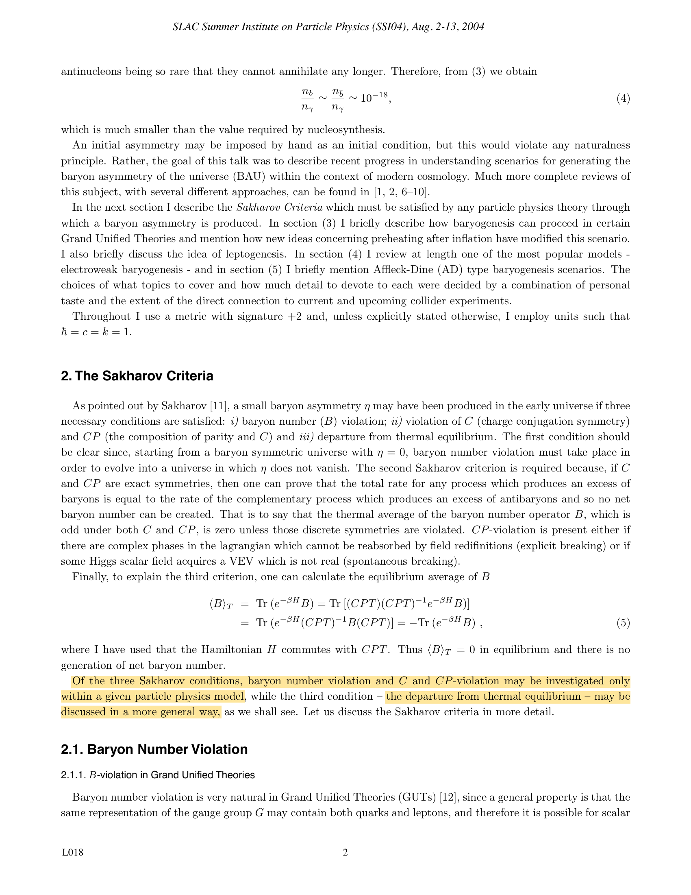
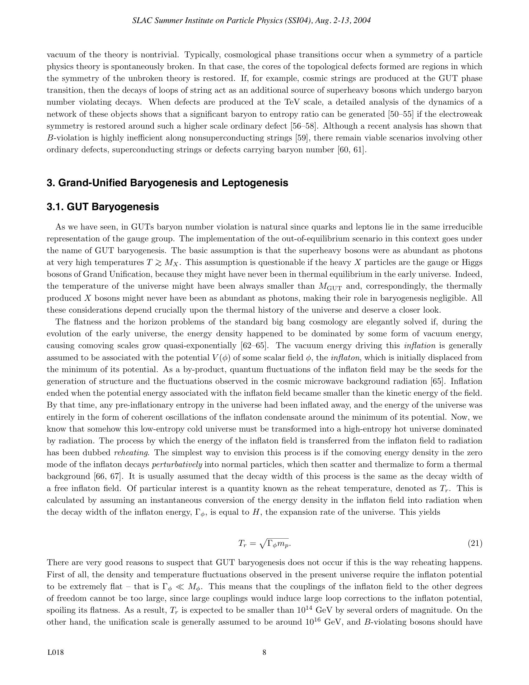

# Part 6 - Reheating, Baryogenesis, and Dark Matter Production

*Lectures 31 to 34 notes synthesis - Prof. Nicola Bartolo*  
*Cosmology of the Early Universe - Università degli Studi di Padova*  
*Index: [Cosmology_of_the_Early_Universe_MOC](../../../04_Atlas/Cosmology_of_the_Early_Universe_MOC.html)*  

---

## The end of inflation and the reheating phase

During inflation, exponential expansion dilutes all pre-existing matter and radiation densities to zero. At the end of inflation, the universe is left completely cold and empty, with all energy stored in the classical homogeneous condensate of the inflaton field $\phi_0(t)$. To transition to the standard Hot Big Bang radiation-dominated era, this vacuum energy must be converted into relativistic Standard Model particles. This non-equilibrium thermodynamic transition is **reheating**.

### Inflaton oscillation phase
When slow-roll conditions break down ($\epsilon \approx 1$), the inflaton rolls toward the minimum of its potential. Expanding around the minimum $\phi = 0$:
$$V(\phi) \approx \frac{1}{2} m^2 \phi^2$$
where $m = V''(0)^{1/2}$ is the effective inflaton mass.
The Klein-Gordon equation in an expanding universe is:
$$\ddot{\phi} + 3H\dot{\phi} + m^2\phi = 0$$

Since $m \gg H$ at this stage, the field oscillates rapidly with frequency $m$:
$$\phi(t) \approx \Phi(t) \cos(mt), \quad \Phi(t) \propto a^{-3/2}(t)$$
Averaging over many oscillation periods ($T = 2\pi/m \ll H^{-1}$):
$$\langle \dot{\phi}^2 \rangle = \frac{1}{2} m^2 \Phi^2 = \langle V(\phi) \rangle$$
$$\langle p_\phi \rangle = \frac{1}{2}\langle \dot{\phi}^2 \rangle - \langle V(\phi) \rangle = 0$$
$$\langle \rho_\phi \rangle = \frac{1}{2}\langle \dot{\phi}^2 \rangle + \langle V(\phi) \rangle = \frac{1}{2} m^2 \Phi^2 \propto a^{-3}$$

The oscillating scalar condensate behaves exactly like **pressureless cold dust** ($w = 0$). The scale factor expands as in a matter-dominated universe:
$$a(t) \propto t^{2/3}$$

---

## Perturbative reheating

In the perturbative regime, the inflaton decays into lighter fermions $\psi$ (via Yukawa coupling $y\phi\bar{\psi}\psi$) or bosons $\chi$ (via trilinear coupling $g M\phi\chi^2$). The decay rate is parameterized by a total decay width $\Gamma_\phi$:
$$\dot{\rho}_\phi + 3H\rho_\phi = -\Gamma_\phi \rho_\phi$$
$$\dot{\rho}_r + 4H\rho_r = +\Gamma_\phi \rho_\phi$$

The inflaton energy density decays as:
$$\rho_\phi(t) = \rho_{\phi,0} \left(\frac{a_0}{a}\right)^3 e^{-\Gamma_\phi t}$$

Reheating completes when the expansion rate drops to the decay width:
$$H \sim \Gamma_\phi$$
At this moment, all remaining inflaton energy is converted into radiation:
$$\rho_r \approx 3 M_{\rm Pl}^2 H^2 \approx 3 M_{\rm Pl}^2 \Gamma_\phi^2$$

Equating this to the thermal radiation density $\rho_r = \frac{\pi^2}{30} g_* T_{\rm reh}^4$:
$$T_{\rm reh} = \left(\frac{90}{\pi^2 g_*}\right)^{1/4} \sqrt{\Gamma_\phi M_{\rm Pl}} \approx 0.55\, g_*^{-1/4} \sqrt{\Gamma_\phi M_{\rm Pl}}$$
where $g_* \sim 106.75$ is the effective relativistic degrees of freedom in the Standard Model.

Constraints on $T_{\rm reh}$:
* **Lower bound**: Reheating must complete before Big Bang Nucleosynthesis ($T \sim 1\text{ MeV}$), so $T_{\rm reh} \gtrsim 5\text{ MeV}$.
* **Upper bound**: In supersymmetric theories, overproduction of gravitinos can disrupt BBN, demanding $T_{\rm reh} \lesssim 10^9\text{ GeV}$ (the gravitino problem).

---

## Non-perturbative preheating and parametric resonance

Before perturbative decay can complete, non-perturbative explosive particle production can occur through **preheating** (Kofman, Linde, Starobinsky 1994).

Consider an inflaton coupled to a daughter scalar field $\chi$ via interaction $\mathcal{L}_{\rm int} = -\frac{1}{2} g^2 \phi^2 \chi^2$.
The mode equation for the spatial Fourier modes $\chi_k$ is:
$$\ddot{\chi}_k + 3H\dot{\chi}_k + \left(\frac{k^2}{a^2} + m_\chi^2 + g^2\phi^2(t)\right)\chi_k = 0$$

Defining rescaled variables $X_k \equiv a^{3/2}\chi_k$ and neglecting cosmic expansion over a few oscillation cycles ($\tau = mt$):
$$\frac{d^2 X_k}{d\tau^2} + \left[ A_k - 2q \cos(2\tau) \right] X_k = 0$$
where:
$$A_k \equiv \frac{k^2/a^2 + m_\chi^2}{m^2} + 2q, \quad q \equiv \frac{g^2 \Phi^2}{4 m^2}$$

This is the standard **Mathieu equation**. For specific resonance bands in $(A_k, q)$ space, solutions are unstable:
$$X_k(\tau) \propto e^{\mu_k \tau}$$
with Floquet exponent $\mu_k > 0$.

In the **broad resonance regime** ($q \gg 1$), every time the oscillating inflaton crosses zero ($\phi(t) = 0$), the effective mass of $\chi$ drops to zero adiabatically fast ($\lvert\dot{\omega}/\omega^2\rvert \gg 1$). This non-adiabatic event creates bursts of $\chi$ particles. Within a few dozen oscillations, energy is exponentially transferred from the zero-mode condensate to high-momentum excitations, fragmenting the inflaton field prior to final thermalization.

---

## Baryogenesis and Sakharov conditions

Observations of cosmic rays and the absence of annihilation $\gamma$-rays in galaxy clusters demonstrate that the observable universe is composed entirely of matter, with no primordial antimatter domains.
The baryon-to-photon ratio is measured with high precision by Planck and BBN:
$$\eta_B \equiv \frac{n_b - n_{\bar{b}}}{n_\gamma} = (6.12 \pm 0.04) \times 10^{-10}$$
$$\frac{n_b - n_{\bar{b}}}{s} = (8.72 \pm 0.08) \times 10^{-11}$$

If the universe were initially symmetric between baryons and antibaryons, baryon-antibaryon annihilation ($b + \bar{b} \to \gamma + \gamma$) would continue until freeze-out at $T \sim 20\text{ MeV}$, predicting:
$$\left(\frac{n_b}{n_\gamma}\right)_{\rm freeze-out} \approx 10^{-18}$$
This is 8 orders of magnitude smaller than observed (the "annihilation catastrophe"). The asymmetry must be generated dynamically in the early universe.

### The Sakharov conditions (1967)
Any dynamical mechanism capable of producing a net baryon asymmetry from an initially symmetric state must satisfy three fundamental conditions:

1. **Baryon number ($B$) violation**:
   If $B$ is strictly conserved, any initial zero baryon number remains zero for all time.
2. **$C$ and $CP$ violation**:
   * If Charge conjugation ($C$) is conserved: $\Gamma(X \to q q) = \Gamma(\bar{X} \to \bar{q}\bar{q})$, producing equal numbers of baryons and antibaryons.
   * If Parity-Charge conjugation ($CP$) is conserved: decays into left-handed and right-handed states cancel out, yielding zero net asymmetry.
3. **Departure from thermal equilibrium**:
   In thermal equilibrium, the CPT theorem guarantees that particles and antiparticles have identical masses ($m_X = m_{\bar{X}}$). The equilibrium distribution depends only on mass and temperature:
   $$n_X^{\rm eq} = n_{\bar{X}}^{\rm eq}$$
   Furthermore, any reaction producing baryons is balanced by the inverse reaction destroying them, washing out any generated asymmetry.

---

## Out-of-equilibrium decay: The Weinberg model

Consider a heavy GUT gauge or Higgs boson $X$ with mass $M_X$ that decays into two channels:
* $X \to q q$ (baryon number $B_1$) with branching ratio $r$
* $X \to \bar{q} \bar{\ell}$ (baryon number $B_2$) with branching ratio $1 - r$

The antiparticle $\bar{X}$ decays into conjugate channels:
* $\bar{X} \to \bar{q} \bar{q}$ (baryon number $-B_1$) with branching ratio $\bar{r}$
* $\bar{X} \to q \ell$ (baryon number $-B_2$) with branching ratio $1 - \bar{r}$

The net baryon asymmetry generated per $X - \bar{X}$ decay pair is:
$$\Delta B = r B_1 + (1-r) B_2 - [\bar{r}(-B_1) + (1-\bar{r})(-B_2)] = (r - \bar{r})(B_1 - B_2)$$
A non-zero $\Delta B$ requires both $B$-violation ($B_1 \neq B_2$) and $CP$-violation ($r \neq \bar{r}$).

### Boltzmann evolution and the washout parameter $K$
The abundance of $X$ particles obeys the Boltzmann equation:
$$\frac{dn_X}{dt} + 3H n_X = -\Gamma_X (n_X - n_X^{\rm eq})$$

We define the dimensionless decay parameter $K$:
$$K \equiv \frac{\Gamma_X}{2 H(T = M_X)}$$
* **Weak washout ($K \ll 1$)**: The decay rate is much slower than the expansion rate when $T \sim M_X$. The $X$ bosons cannot maintain equilibrium and "freeze in" with abundance $n_X \sim n_\gamma$. When they finally decay at $T_D \sim K^{1/2} M_X \ll M_X$, inverse decay processes are kinematically forbidden by the Boltzmann suppression factor $e^{-M_X/T_D}$. The generated asymmetry survives unhindered:
  $$\frac{n_B}{s} \approx \frac{\Delta B}{g_*}$$
* **Strong washout ($K \gg 1$)**: Decays and inverse decays occur rapidly in equilibrium. The asymmetry is suppressed by inverse decays and scattering:
  $$\frac{n_B}{s} \propto \frac{\Delta B}{K \ln K}$$

### Electroweak sphalerons and leptogenesis
In the Standard Model, the $B+L$ current is anomalous due to the chiral nature of electroweak gauge interactions:
$$\partial_\mu j_B^\mu = \partial_\mu j_L^\mu = \frac{N_f}{32\pi^2} \left( g^2 W_{\mu\nu}^a \tilde{W}^{a\mu\nu} - g'^2 B_{\mu\nu}\tilde{B}^{\mu\nu} \right)$$
At high temperatures ($T > 100\text{ GeV}$), thermal fluctuations over the electroweak vacuum barrier (**sphaleron transitions**) occur rapidly, completely wiping out any pre-existing $(B+L)$ asymmetry while preserving $(B-L)$.

In **thermal leptogenesis** (Fukugita and Yanagida 1986), heavy right-handed Majorana neutrinos $N_1$ (mass $M_1 \sim 10^{10}\text{ GeV}$) decay out of equilibrium into leptons and Higgs doublets ($N_1 \to \ell H$ vs $N_1 \to \bar{\ell} H^*$). This creates a net lepton asymmetry $(B-L \neq 0)$, which sphalerons subsequently convert into a baryon asymmetry:
$$B = \left(\frac{8 N_f + 4 N_H}{22 N_f + 13 N_H}\right) (B - L) = \frac{28}{79} (B - L)$$
This elegant mechanism links the matter-antimatter asymmetry directly to non-zero neutrino masses via the seesaw mechanism.

---

## Dark matter particle production

Cosmological observations indicate that cold dark matter makes up $\approx 26.5\%$ of the cosmic energy budget ($\Omega_{\rm cdm} h^2 \approx 0.120 \pm 0.001$).

### Thermal relics and the freeze-out mechanism
In the early universe, dark matter particles $\chi$ were in thermal equilibrium with the primordial plasma via annihilation and creation reactions $\chi \bar{\chi} \leftrightarrow f \bar{f}$.
The number density $n_\chi$ obeys the **Boltzmann equation**:
$$\frac{dn_\chi}{dt} + 3H n_\chi = -\langle \sigma v \rangle \left( n_\chi^2 - (n_\chi^{\rm eq})^2 \right)$$
where $\langle \sigma v \rangle$ is the thermally averaged annihilation cross section.

Defining comoving abundance $Y \equiv n_\chi / s$ and dimensionless inverse temperature $x \equiv m_\chi / T$:
$$\frac{dY}{dx} = -\frac{\lambda \langle \sigma v \rangle}{x^2} \left( Y^2 - Y_{\rm eq}^2 \right), \quad \lambda \equiv \frac{s(m_\chi)}{H(m_\chi)} \propto M_{\rm Pl} m_\chi$$

Freeze-out occurs when the annihilation rate falls below the expansion rate:
$$\Gamma_{\rm ann} = n_\chi \langle \sigma v \rangle \sim H(T)$$

---

## Hot vs Cold Dark Matter

### 1. Hot Dark Matter (HDM)
Particles freeze out while still relativistic ($T_{\rm fo} \gg m_\chi$, or $x_f \ll 1$).
* Example: Relic neutrinos with mass $m_\nu \sim 0.1\text{ eV}$.
* The comoving number density freezes out at $Y \approx Y_{\rm eq} \sim 1/g_*$:
  $$n_\nu(t_0) = \frac{3}{11} n_\gamma(t_0) \approx 112\text{ cm}^{-3} \text{ per flavor}$$
  $$\Omega_\nu h^2 = \frac{\sum m_\nu}{93.14\text{ eV}}$$
* **The free-streaming problem**: Relativistic particles free-stream out of overdense regions, completely erasing density perturbations below the free-streaming horizon:
  $$\lambda_{\rm fs} \approx \int_0^{t_{\rm nr}} \frac{c\, dt'}{a(t')} \approx 40\text{ Mpc} \left(\frac{30\text{ eV}}{m_\nu}\right)$$
  This enforces **top-down structure formation** (superclusters form first, then fragment into galaxies). Galaxy surveys (SDSS, 2dF) definitively observed bottom-up structure formation, ruling out HDM as the primary component of dark matter.

### 2. Cold Dark Matter (CDM) and the WIMP miracle
Particles freeze out when non-relativistic ($T_{\rm fo} \ll m_\chi$, or $x_f \sim 20 - 30$).
The equilibrium density is Maxwell-Boltzmann suppressed:
$$n_\chi^{\rm eq} = g_\chi \left(\frac{m_\chi T}{2\pi}\right)^{3/2} e^{-m_\chi/T}$$
Integrating the freeze-out equation yields the present-day relic abundance:
$$\Omega_\chi h^2 \approx \frac{1.07 \times 10^9\text{ GeV}^{-1}}{M_{\rm Pl} \sqrt{g_*}} \frac{x_f}{\langle \sigma v \rangle} \approx \frac{3 \times 10^{-27}\text{ cm}^3/\text{s}}{\langle \sigma v \rangle}$$

Remarkably, a typical electroweak interaction cross section:
$$\langle \sigma v \rangle \sim \frac{\alpha_w^2}{m_{\rm weak}^2} \sim 10^{-26}\text{ cm}^3/\text{s}$$
automatically yields $\Omega_\chi h^2 \sim 0.1$, perfectly matching cosmological observations! This stunning coincidence is known as the **WIMP miracle**.

### 3. Non-thermal relics: The QCD axion
The axion is a pseudo-Nambu-Goldstone boson arising from the Peccei-Quinn solution to the Strong CP problem.
Axions are produced non-thermally via the **vacuum misalignment mechanism**: at $T \sim 1\text{ GeV}$, QCD instanton effects turn on the axion mass $m_a(T)$. The axion field begins to oscillate around its potential minimum when $3H(T) \approx m_a(T)$.
Because axions are born with zero momentum, they form an extremely cold Bose-Einstein condensate despite having sub-millielectronvolt mass:
$$\Omega_a h^2 \approx 0.12 \left(\frac{f_a}{10^{12}\text{ GeV}}\right)^{1.17}$$

---

## Connections and vault links

* Companion zettels:
  - [Reheating dynamics and thermalization](../../../03_Zettel/Theory/Reheating%20dynamics%20and%20thermalization.html)
  - [Preheating and parametric resonance](../../../03_Zettel/Theory/Preheating%20and%20parametric%20resonance.html)
  - [Sakharov conditions for baryogenesis](../../../03_Zettel/Theory/Sakharov%20conditions%20for%20baryogenesis.html)
  - [Out-of-equilibrium decay baryogenesis and Weinberg model](../../../03_Zettel/Theory/Out-of-equilibrium%20decay%20baryogenesis%20and%20Weinberg%20model.html)
  - [Electroweak sphalerons and leptogenesis](../../../03_Zettel/Theory/Electroweak%20sphalerons%20and%20leptogenesis.html)
  - [Dark matter thermal freeze-out and Lee-Weinberg bound](../../../03_Zettel/Theory/Dark%20matter%20thermal%20freeze-out%20and%20Lee-Weinberg%20bound.html)
  - [Hot versus cold dark matter in the early universe](../../../03_Zettel/Theory/Hot%20versus%20cold%20dark%20matter%20in%20the%20early%20universe.html)
  - [Non-thermal dark matter relics and axion misalignment](../../../03_Zettel/Theory/Non-thermal%20dark%20matter%20relics%20and%20axion%20misalignment.html)
* Previous module: [Part5_GR_Cosmological_Perturbation_Theory](./Part5_GR_Cosmological_Perturbation_Theory.html)
* Course MOC: [Cosmology_of_the_Early_Universe_MOC](../../../04_Atlas/Cosmology_of_the_Early_Universe_MOC.html)

## Theoretical Visuals & Thermal History

*Figure CEU-12: Non-perturbative preheating via parametric resonance. The oscillating inflaton condensate $\phi(t)$ couples to matter fields $\chi$ via $g^2 \phi^2 \chi^2$, leading to exponential particle production governed by the Mathieu equation $X_k'' + [A_k - 2q \cos(2mt)] X_k = 0$.*

*Figure CEU-13: The three Sakharov conditions required for baryogenesis: (1) Baryon number $B$ violation, (2) $C$ and $CP$ symmetry violation, and (3) Departure from thermal equilibrium (first-order electroweak phase transition or out-of-equilibrium heavy Majorana neutrino decay in leptogenesis).*

  <h4 class="backlinks-title">Linked References (9)</h4>
  <ul class="backlinks-list">
    <li class="backlink-item-wrap"><a href="../../../03_Zettel/Theory/Dark%20matter%20thermal%20freeze-out%20and%20Lee-Weinberg%20bound.html" class="backlink-item">Dark matter thermal freeze-out and Lee-Weinberg bound</a></li>
    <li class="backlink-item-wrap"><a href="../../../03_Zettel/Theory/Electroweak%20sphalerons%20and%20leptogenesis.html" class="backlink-item">Electroweak sphalerons and leptogenesis</a></li>
    <li class="backlink-item-wrap"><a href="../../../03_Zettel/Theory/Hot%20versus%20cold%20dark%20matter%20in%20the%20early%20universe.html" class="backlink-item">Hot versus cold dark matter in the early universe</a></li>
    <li class="backlink-item-wrap"><a href="../../../03_Zettel/Theory/Non-thermal%20dark%20matter%20relics%20and%20axion%20misalignment.html" class="backlink-item">Non-thermal dark matter relics and axion misalignment</a></li>
    <li class="backlink-item-wrap"><a href="../../../03_Zettel/Theory/Out-of-equilibrium%20decay%20baryogenesis%20and%20Weinberg%20model.html" class="backlink-item">Out-of-equilibrium decay baryogenesis and Weinberg model</a></li>
    <li class="backlink-item-wrap"><a href="../../../03_Zettel/Theory/Preheating%20and%20parametric%20resonance.html" class="backlink-item">Preheating and parametric resonance</a></li>
    <li class="backlink-item-wrap"><a href="../../../03_Zettel/Theory/Reheating%20dynamics%20and%20thermalization.html" class="backlink-item">Reheating dynamics and thermalization</a></li>
    <li class="backlink-item-wrap"><a href="../../../03_Zettel/Theory/Sakharov%20conditions%20for%20baryogenesis.html" class="backlink-item">Sakharov conditions for baryogenesis</a></li>
    <li class="backlink-item-wrap"><a href="../../../04_Atlas/Cosmology_of_the_Early_Universe_MOC.html" class="backlink-item">Cosmology_of_the_Early_Universe_MOC</a></li>
  </ul>

