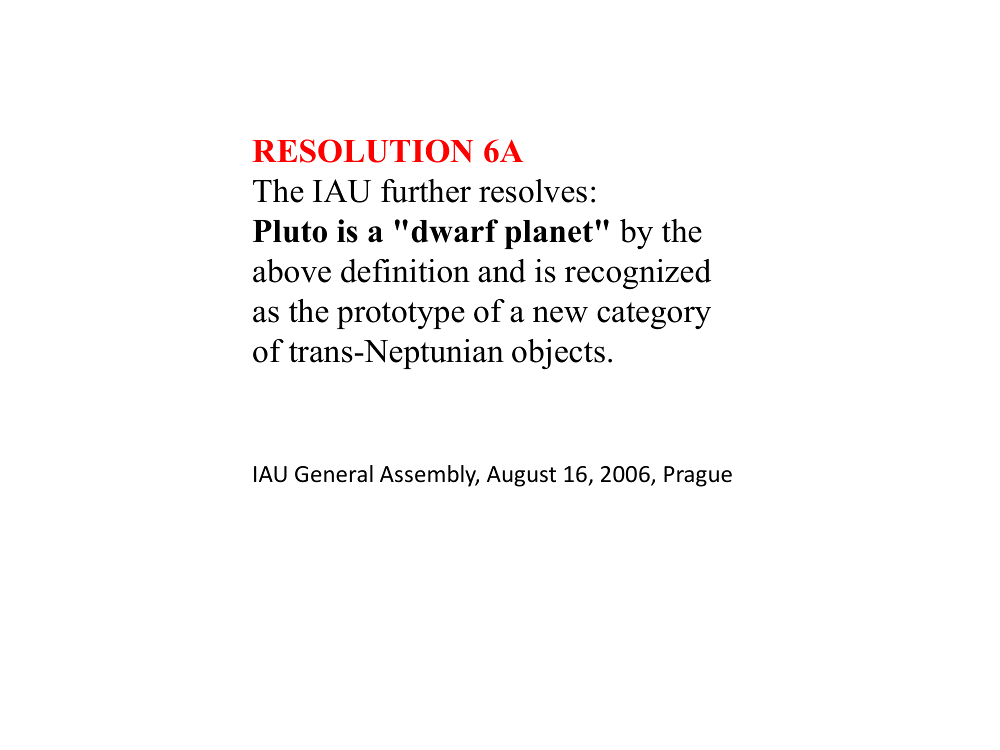
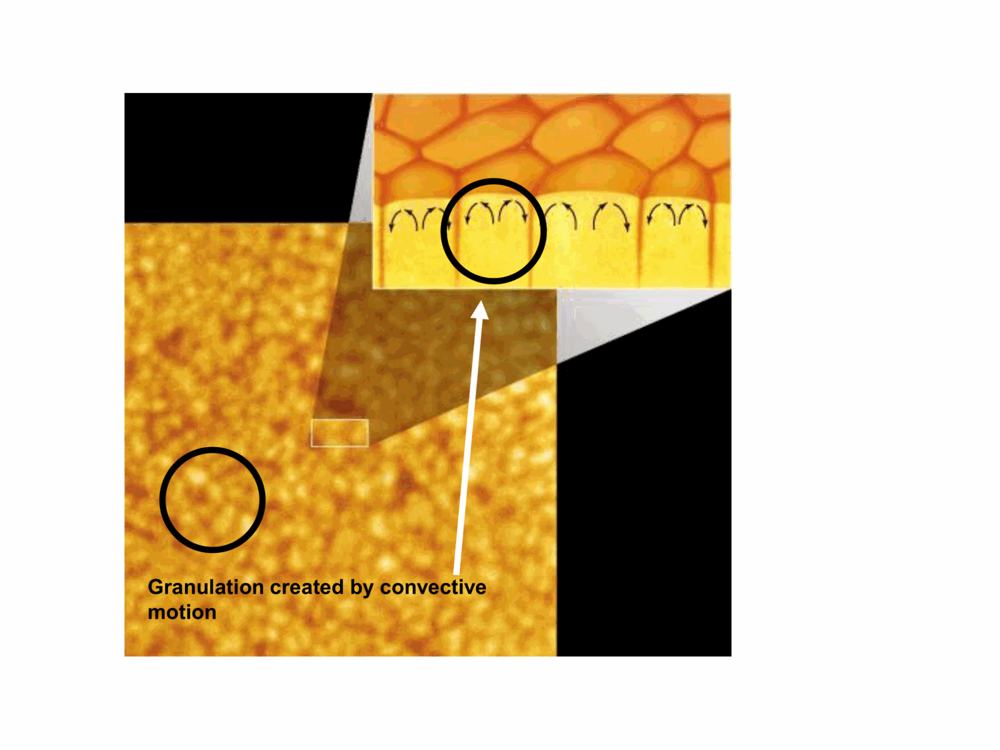

# Lesson 02 – Exoplanet Discovery and Taxonomy

*Exoplanetary Astrophysics, Prof. Giampaolo Piotto (Lecture 07/10/2025)*  
*Index: [[Exoplanetary_Astrophysics_MOC]]*

---

## The Exoplanet Census and Milestone Discoveries

The exoplanet catalog has evolved from isolated anomalies into a statistical population:
- Over **6,000 confirmed exoplanets** across more than **4,500 planetary systems**, including over **1,000 multi-planet systems** (catalogs: [exoplanet.eu](https://exoplanet.eu), [NASA Exoplanet Archive](https://exoplanetarchive.ipac.caltech.edu)).

### Foundational Milestones
1. **Pulsar Planets (1992)**: Aleksander Wolszczan and Dale Frail discovered three terrestrial-mass bodies ($0.02 M_\oplus, 4.3 M_\oplus, 3.9 M_\oplus$) orbiting the millisecond pulsar **PSR B1257+12** via high-precision pulse arrival timing. These formed in a post-supernova fallback disk.
2. **51 Pegasi b (1995)**: Michel Mayor and Didier Queloz used the ELODIE echelle spectrograph at Observatoire de Haute-Provence to detect a periodic radial velocity variation ($K = 59\text{ m s}^{-1}$) of the solar-type star 51 Pegasi:
   $$P = 4.2308\text{ days}, \quad a = 0.0527\text{ AU}, \quad M_p \sin i \approx 0.47 M_{\text{Jup}}$$
   This revealed the first "Hot Jupiter", proving that gas giants can exist at hundredths of an AU from their host stars, directly challenging classical in situ accretion theories and necessitating orbital migration.

```
Architectural Comparison: Solar System vs Landmark Multi-Planet Systems
0.01 AU                   0.1 AU                    1.0 AU                   10 AU
  │                         │                         │                        │
  ├─[TRAPPIST-1 b..h]───────┤                         │                        │
  │ (7 Earths, P=1.5-19d)   │                         │                        │
  ├───────[Kepler-90 b..i]────────────────────────────┤                        │
  │       (8 planets within 1.01 AU)                  │                        │
  │                         ├──Mercury──Venus──Earth──Mars──────────Jupiter────┤
  │                         │  0.39AU   0.72AU 1.0AU  1.52AU        5.2AU      │
```

### Benchmark Systems
- **Kepler-90**: An 8-planet system (Kepler-90b to Kepler-90i; Cabrera et al. 2014, Shallue & Vandenburg 2018). Structurally analogous to the Solar System (inner small rocky planets, outer gas giants), but compressed within $1.01\text{ AU}$ of a G0V star.
- **TRAPPIST-1**: 7 temperate Earth-sized planets transiting an ultra-cool M8V dwarf star ($M_\star \approx 0.09 M_\odot, R_\star \approx 0.12 R_\odot, T_{\text{eff}} \approx 2560\text{ K}$; Gillon et al. 2016, 2017). Tightly packed in a Laplace-like resonant chain with orbital periods from $1.51$ to $18.77\text{ days}$.

---

## Astronomical Nomenclature Rules for Exoplanets

Exoplanetary nomenclature follows strict rules formulated by the International Astronomical Union (IAU Commission 53 / Division F):

```
                        Hierarchical Naming Schema
                     ┌───────────────────────────────┐
                     │    Host Star / Stellar System │
                     │    e.g. HD 20794, Kepler-20   │
                     └───────────────┬───────────────┘
                                     │
                 ┌───────────────────┴───────────────────┐
                 ▼                                       ▼
        Visual / Stellar Hierarchy              Planetary Suffixes
        Uppercase Letters: A, B, C...           Lowercase Letters: b, c, d...
        (Ordered by brightness/separation)       (Ordered by DISCOVERY sequence)
                 │                                       │
                 └───────────────────┬───────────────────┘
                                     ▼
                    Formal Exoplanet Designations:
                    - Single host: 51 Peg b (formally 51 Peg A b)
                    - Binary component host: Alpha Centauri B b
                    - Circumbinary planet: Kepler-16 (AB) b
```

### The Four Cardinal Rules
1. **Discovery Order**: Planet letters are assigned strictly in order of discovery, starting with **b** (the host star is implicitly **a** or uppercase **A**). Subsequent planets detected around the same star receive suffixes **c, d, e, f...**, regardless of their radial distance from the star.
2. **Implicit Primary Designation**: If no uppercase letter precedes the lowercase suffix, it is assumed to orbit the primary component **A** (e.g., $51\text{ Peg b} \equiv 51\text{ Peg A b}$).
3. **Circumbinary Nomenclature**: When a planet orbits both components of a close binary star system, parentheses enclose the stellar designations followed by the planet suffix: e.g., **Kepler-16 (AB) b**, **CT Men (AB) b**.
4. **Survey Identifiers**:
   - *Kepler*: Unconfirmed transit candidates receive Kepler Object of Interest numbers with a decimal indicating candidate order: `KOI-70.01`. Upon confirmation, the system receives a formal satellite catalog name: `Kepler-20 b`.
   - *TESS*: Targets are cataloged as TESS Objects of Interest: `TOI-561.01`, transitioning to `TOI-561 b`.
   - *Coordinates*: In vast surveys without HD/HIP numbers, names derive from epoch J2000 coordinates (e.g., `2MASS J03195563-4304112 b`).

---

## Empirical Classification and Taxonomic Schemes

Because exoplanetary surveys observe different physical quantities (transits yield $R_p$; radial velocity yields $M_p \sin i$), exoplanet taxonomy relies on two parallel operational frameworks:

### 1. Photometric / Radius-Based Classification (Transit Surveys)
Standardized by Kepler and TESS demographics:

| Class | Radius Regime ($R_\oplus$) | Typical Physical Nature |
|---|---|---|
| **Sub-Earths** | $R_p < 0.8 R_\oplus$ | Desiccated, Mercury/Mars analogs |
| **Earths** | $0.8 \le R_p < 1.25 R_\oplus$ | Terrestrial silicate/iron mantles |
| **Super-Earths** | $1.25 \le R_p < 2.0 R_\oplus$ | Massive rocky cores, volatile-depleted |
| **Sub-Neptunes (Small Neptunes)** | $2.0 \le R_p < 4.0 R_\oplus$ | Volatile-rich ($H_2O$ / supercritical $H_2/He$ envelopes) |
| **Sub-Saturns (Large Neptunes)** | $4.0 \le R_p < 6.0 R_\oplus$ | Substantial gaseous envelopes |
| **Jupiters** | $6.0 \le R_p < 22.0 R_\oplus$ | Gas giants dominated by $H_2/He$ |

### 2. Spectroscopic / Mass-Based Classification (Stevens & Gaudi 2013)
Applied to radial velocity and astrometric surveys:

| Class | Mass Range ($M_\oplus$ / $M_{\text{Jup}}$) | Governing Physical Regime |
|---|---|---|
| **Sub-Earths** | $10^{-8} M_\oplus \le M_p < 0.1 M_\oplus$ | Rigid body forces compete with gravity |
| **Earths** | $0.1 M_\oplus \le M_p < 2.0 M_\oplus$ | Hydrostatic terrestrial regime |
| **Super-Earths** | $2.0 M_\oplus \le M_p < 10.0 M_\oplus$ | High core pressure; volatile retention threshold |
| **Neptunes** | $10.0 M_\oplus \le M_p < 100 M_\oplus$ | Intermediate envelope accretion |
| **Jupiters** | $100 M_\oplus \le M_p < 10^3 M_\oplus$ | Runaway gas accretion regime ($\approx 0.3 - 3.1 M_J$) |
| **Super-Jupiters** | $10^3 M_\oplus \le M_p < 13.0 M_{\text{Jup}}$ | Electron degeneracy in interior begins |
| **Brown Dwarfs** | $13.0 M_{\text{Jup}} \le M_p < 0.075-0.080 M_\odot$ | **Deuterium burning** threshold at $13 M_J$; no stable $H$ fusion |
| **Stellar Companions** | $M > 0.075-0.080 M_\odot$ ($\approx 75-80 M_J$) | Stable core **hydrogen fusion** (Main Sequence) |

```
The Substellar Boundary:
0.001 M_Sun                0.012 M_Sun (13 M_J)        0.075 M_Sun (75-80 M_J)
   ├─────────────────────────────┼──────────────────────────────┼──────────────>
      Gas Giant Planets             Brown Dwarfs                  Low-mass Stars
      (No Nuclear Fusion)        (Deuterium Fusion Only)          (Hydrogen Fusion)
```

---

## Cross-Links & Vault Navigation
- Master Map of Content: [[Exoplanetary_Astrophysics_MOC]]
- Previous Lecture: [[01_Global_Architecture_of_the_Solar_System]]
- Next Lecture: [[03_Demographics_and_Survey_Completeness]]
- Related Notes: Exoplanet detection techniques | Mass-radius diagram and interior models


## Lecture Visuals & Detection Landscape


*Figure EXO-01: Exoplanet discovery landscape in mass-period ($M_p - P$) and mass-radius ($M_p - R_p$) parameter space, showing complementary sensitivity domains of Radial Velocity, Transits, Microlensing, and Direct Imaging.*


*Figure EXO-02: Radial velocity Doppler reflex curve of a star perturbed by an orbiting planet. Semi-amplitude $K = \frac{28.4\text{ m/s}}{\sqrt{1-e^2}} \left(\frac{M_p \sin i}{M_{\mathrm{Jup}}}\right) \left(\frac{M_*}{M_\odot}\right)^{-1/2} \left(\frac{a}{1\text{ AU}}\right)^{-1/2}$ measures minimum planetary mass $M_p \sin i$.*


## Linked References

- [[Exoplanetary_Astrophysics_MOC]]


