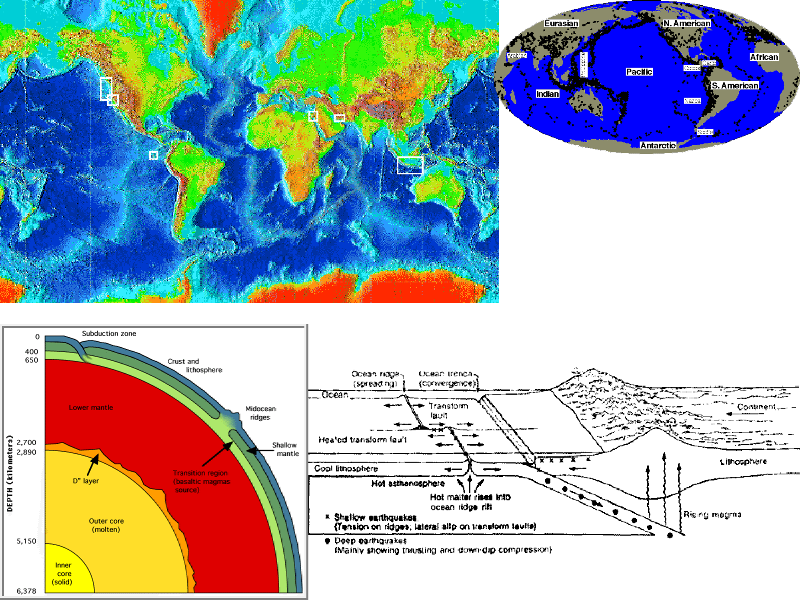
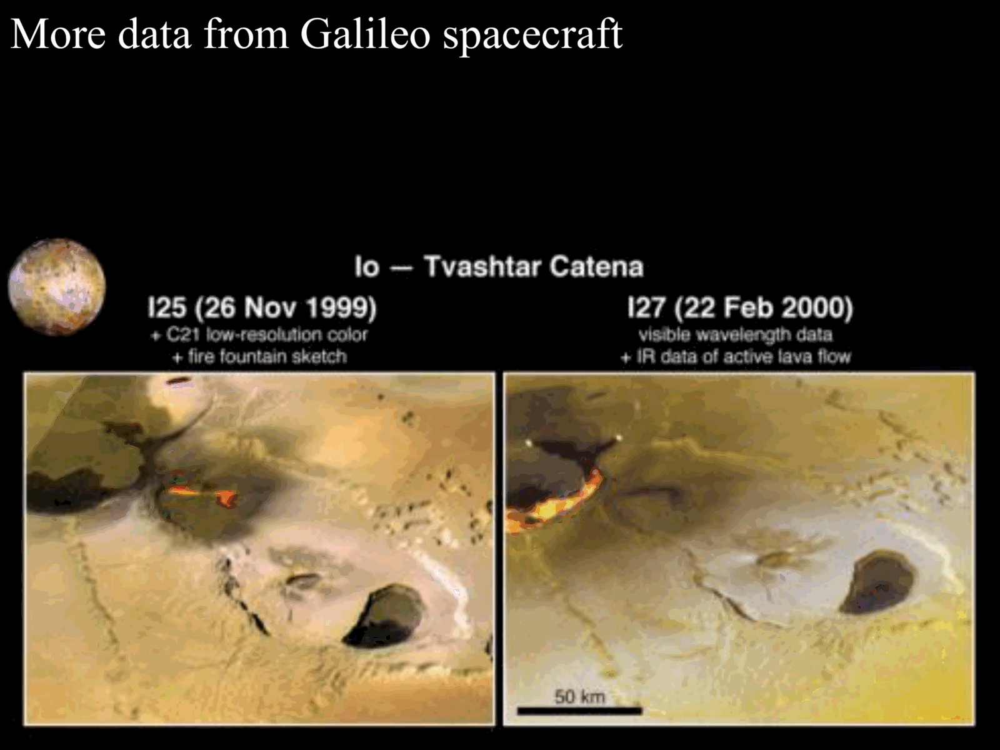

# Lesson 03 – Demographics and Survey Completeness

*Exoplanetary Astrophysics, Prof. Giampaolo Piotto (Lecture 13/10/2025)*  
*Index: [[Exoplanetary_Astrophysics_MOC]]*

---

## Statistical Distributions and Observational Biases

The observed distributions of exoplanet mass $M_p$, radius $R_p$, orbital period $P$, and eccentricity $e$ are heavily distorted by observational selection effects. Every detection technique imposes specific detection thresholds dictated by signal-to-noise ratios (SNR), stellar noise, and observation duration.

```
                           OBSERVATIONAL SELECTION FILTER
 ┌───────────────────────────┐         ┌─────────────────────────┐         ┌────────────────────────┐
 │   True Astrophysical      │         │   Survey Selection      │         │   Raw Detected         │
 │   Population              │────────>│   Probability Function  │────────>│   Exoplanet Census     │
 │   dn / (d ln R d ln P)    │         │   p_det(R, P, star)     │         │   N_det                │
 └───────────────────────────┘         └─────────────────────────┘         └────────────────────────┘
```

### Empirical Baseline Trends
1. **Mass and Radius Abundance**: Small, low-mass planets ($R_p \lesssim 2.5 R_\oplus, M_p \lesssim 10 M_\oplus$) are intrinsically much more common than giant planets ($M_p \sim M_J$).
2. **Orbital Separation**: Although the raw catalog is dominated by short-period planets ($P < 50\text{ d}, a < 0.3\text{ AU}$), this is largely an observational artifact of transit and Doppler sensitivities.
3. **Eccentricity Distribution**:
   - For ultra-short-period planets ($P \lesssim 3-5\text{ d}$), orbits are almost universally circular ($e \approx 0$) due to rapid tidal circularization:
     $$\tau_{\text{circ}} \approx \frac{2}{21} \frac{Q'_p}{k_2} \frac{M_p}{M_\star} \left( \frac{a}{R_p} \right)^5 \frac{1}{n}$$
   - Beyond $a \gtrsim 0.1\text{ AU}$, the eccentricity distribution broadens substantially ($0 \le e \lesssim 0.9$), with an average $\langle e \rangle \sim 0.25-0.30$, demonstrating that high-eccentricity dynamical excitation is widespread in the Galaxy.

---

## Survey Completeness and Occurrence Rate Formalism

### Naive vs Effective Sample Size
If a survey monitors $N_\star$ stars and detects $N_{\text{det}}$ planets, the raw ratio $N_{\text{det}} / N_\star$ fails to reflect true occurrence because:
1. Low-amplitude signals drown in photon shot noise and stellar activity.
2. In transit surveys, only a tiny fraction of orbits happen to be aligned along the line of sight.

If detection probability $p_{\text{det}}$ were uniform across all stars:

$$N_{\text{eff}} = p_{\text{det}} N_\star \implies n \approx \frac{N_{\text{det}}}{p_{\text{det}} N_\star}$$

In reality, $p_{\text{det}} = p_{\text{det}}(R_p, P, \mathbf{\theta}_\star)$ depends on stellar brightness, spectral type, rotation, activity, and observational cadence.

### The Inverse Detection Efficiency Formalism
To correct for inhomogeneous sensitivity, the occurrence rate $n$ within a defined cell of parameter space $[\ln R_1, \ln R_2] \times [\ln P_1, \ln P_2]$ is computed using the non-parametric $1/V_{\text{max}}$ analog:

$$n = \sum_{i=1}^{N_{\text{det}}} \frac{1}{\sum_{j=1}^{N_\star} p_{\text{det}, j}(R_i, P_i) \, p_{\text{tr}, j}(P_i)}$$

where:
- $i$ indexes each detected planet.
- $j$ indexes every target star in the monitored sample.
- $p_{\text{det}, j}(R_i, P_i)$ is the pipeline detection efficiency (recovery probability) of a planet with parameters $(R_i, P_i)$ around star $j$.
- $p_{\text{tr}, j}(P_i)$ is the geometric transit probability:
  $$p_{\text{tr}, j} = \frac{R_{\star, j} + R_p}{a_i (1 - e_i^2)} \approx \frac{R_{\star, j}}{a_i} \propto P_i^{-2/3}$$

### Occurrence Rate Density Function
The two-dimensional differential occurrence rate density $\Gamma_{R, P}$ is defined as:

$$\Gamma_{R, P} = \frac{d^2 n}{d\ln R \, d\ln P}$$

such that the average number of planets per star in a given logarithmic range is:

$$n = \int_{\ln R_1}^{\ln R_2} d\ln R \int_{\ln P_1}^{\ln P_2} d\ln P \, \Gamma_{R, P}$$

---

## Comparative Sensitivity Regimes: Doppler vs Transit Surveys

```
   Detection Threshold Boundaries in (Mass/Radius) vs Orbital Period
 
   log M (Doppler Survey)               log R (Transit Survey)
   ▲                                    ▲
   │         / M_th ~ P^(1/3)           │         / R_th ~ P^(1/6)
   │        /                           │        /
   │       /      [Survey Limit]        │       /      [Survey Limit]
   │      /         │ Steep cutoff      │      /         │ Single transit limit
   │     /          ▼ (P > T_obs)       │     /          ▼ (P > T_obs)
   │    /                               │    /
   └───┴────────────┴─────────> log P   └───┴────────────┴─────────> log P
                   T_obs                                T_obs
```

### 1. Doppler (Radial Velocity) Surveys
The line-of-sight Doppler velocity semi-amplitude for circular orbits is:

$$K = \left( \frac{2\pi G}{P} \right)^{1/3} \frac{M_p \sin i}{M_\star^{2/3}}$$

Assuming constant velocity measurement precision $\sigma_{\text{RV}}$ and $N_{\text{obs}}$ uniform visits over survey baseline $T_{\text{obs}}$:
- For periods shorter than the baseline ($P < T_{\text{obs}}$):
  $$M_{\text{threshold}} \propto K_{\text{min}} P^{1/3} \propto P^{1/3}$$
- For periods exceeding the baseline ($P > T_{\text{obs}}$), only a fraction of the orbital arc is sampled; the required mass increases steeply ($M_{\text{threshold}} \propto P^2$ or steeper) to produce significant orbital curvature against linear velocity drifts (Cumming 2004).

### 2. Transit Surveys
The photometric transit depth is $\delta \approx (R_p / R_\star)^2$. The total number of observed transits is:

$$N_{\text{tr}} = \frac{T_{\text{obs}}}{P}$$

The duration of each central transit is $\tau \propto P^{1/3} R_\star M_\star^{-1/3}$. The integrated transit signal-to-noise ratio across all transits scales as:

$$\text{SNR}_{\text{transit}} = \frac{\delta}{\sigma_{\text{phot}}} \sqrt{N_{\text{tr}} \cdot n_{\text{points}}} \propto R_p^2 \sqrt{\frac{T_{\text{obs}}}{P} \cdot P^{1/3}} = R_p^2 \, T_{\text{obs}}^{1/2} \, P^{-1/3}$$

Setting $\text{SNR}_{\text{transit}} \ge \text{SNR}_{\text{threshold}}$ yields the detection threshold radius:

$$R_{\text{threshold}} \propto P^{1/6}$$

This shallow $P^{1/6}$ dependence means transit surveys have mild radius degradation with period, but are severely penalized by the geometric transit probability:

$$p_{\text{tr}} \propto P^{-2/3}$$

which drops off rapidly, making long-period detections rare.

---

## Giant Planet Demographics and the Snow Line

Fitting radial velocity and transit data to a joint power-law distribution (Cumming et al. 2008, Santerne et al. 2016):

$$\frac{d^2 n}{d\ln M \, d\ln P} = C \, M^\alpha \, P^\beta$$

- Fitted indices: $\alpha = -0.31 \pm 0.20$, $\beta = 0.26 \pm 0.10$.
- Normalized occurrence: Approximately **$10.5\%$ of Sun-like (FGK) stars** host a giant planet ($M_p > 0.3 M_J, R_p > 4 R_\oplus$) with an orbital period $P < 2000\text{ days}$.

```
Giant Planet Occurrence as a Function of Period:
dn/d ln P
▲
│                               ┌─────────────────────────
│                               │   Factor of 4-5 Uptick
│                               │   (Cold / Temperate Jupiters)
│               Flat Plateau    │
│  ─────────── [beta ~ 0] ──────┘
│  (Hot / Warm Jupiters)
│
└───────────────┬───────────────┬────────────────────────> Period P
             P ~ 2-3 d       P ~ 300 d (~ 1 AU)
                           [ Snow Line ]
```

### The Snow Line Transition
From $P = 2$ to $300\text{ days}$ ($a \lesssim 1\text{ AU}$), giant planet occurrence is approximately flat in $\log P$ ($\beta \approx 0$). At $P \gtrsim 300-1000\text{ days}$ ($a \sim 1-3\text{ AU}$), occurrence jumps by a factor of **4 to 5**.

This sharp enhancement directly aligns with the circumstellar **snow line** in protoplanetary disks:
- Beyond the snow line ($T_{\text{disk}} \lesssim 170\text{ K}$), water vapor condenses into solid ice grains.
- The surface density of solid planetesimals increases by a factor of $3-4$, enabling rapid accumulation of a $10 M_\oplus$ core before the gaseous nebula disperses, triggering runaway gas accretion (Pollack et al. 1996).

---

## Cross-Links & Vault Navigation
- Master Map of Content: [[Exoplanetary_Astrophysics_MOC]]
- Previous Lecture: [[02_Exoplanet_Discovery_and_Taxonomy]]
- Next Lecture: [[04_Small_Planets_and_Host_Star_Correlations]]
- Related Notes: Radial velocity method and Keplerian orbits | Transit photometry and Mandel-Agol formulation


## Lecture Visuals & Planet Demographics


*Figure EXO-03: The Fulton radius valley / gap at $R_p \sim 1.5 - 2.0\,R_\oplus$ separating rocky super-Earths from volatile-rich mini-Neptunes, providing evidence for photoevaporation and core-powered mass loss.*


*Figure EXO-04: The Hot Jupiter sub-Jovian desert in the period-radius diagram, bounded by atmospheric hydrodynamic photo-evaporative escape and high-eccentricity tidal migration limits.*


## Linked References

- [[Exoplanet demographic distributions and survey completeness]]
- [[Exoplanetary_Astrophysics_MOC]]


