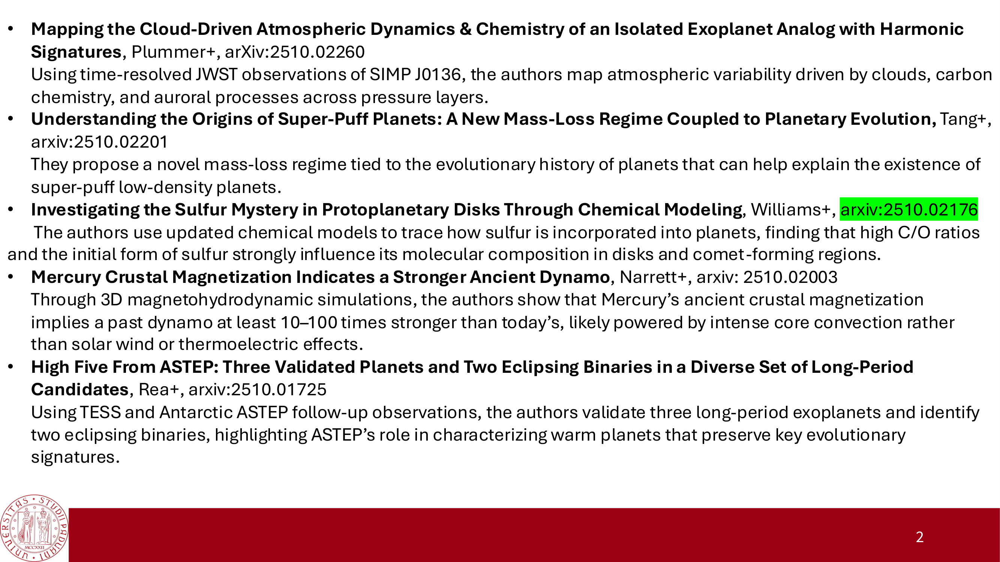
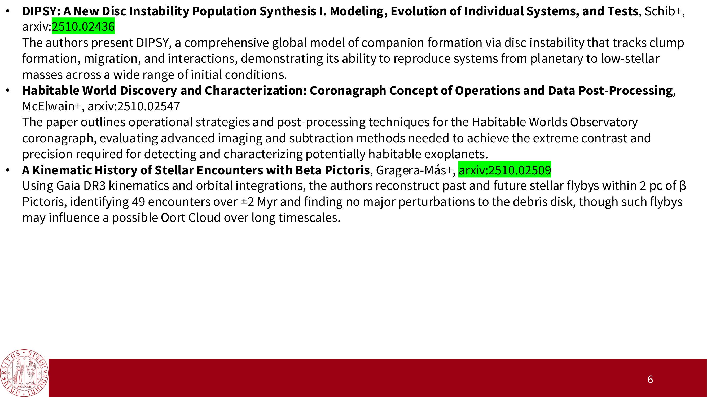
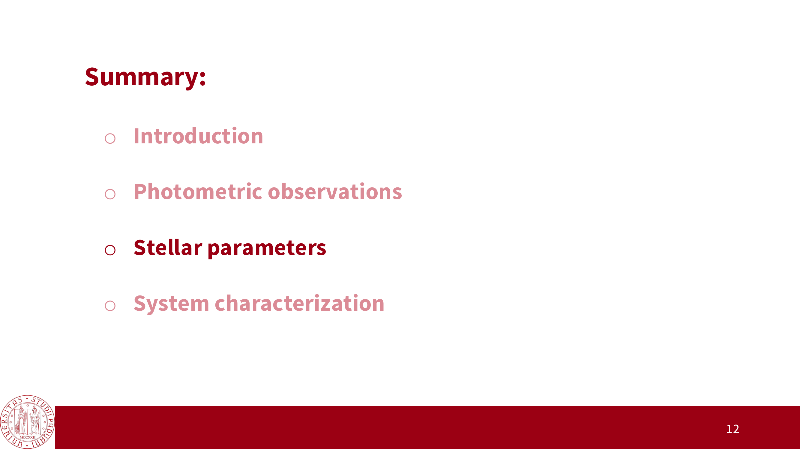

# Lesson 15 – Planetary Transits I: Geometry and Rossiter-McLaughlin

*Exoplanetary Astrophysics, Prof. Giampaolo Piotto (Lecture 01/12/2025)*  
*Index: [Exoplanetary_Astrophysics_MOC](../../../04_Atlas/Exoplanetary_Astrophysics_MOC.html)*

---

## Transit Orbital Geometry and Impact Parameter

A planetary transit occurs when an exoplanet's orbital plane is aligned such that the planet crosses the disk of its host star along the observer's line of sight:

```
                            TRANSIT ORBITAL GEOMETRY
                                         Stellar Disk (Radius R_*)
                                              ╭──────────╮
                                             ╱     b      ╲
                                            │      │       │
                       Transit Chord ───────┼──────●───────┼───────
                                            │   Planet (R_p)
                                             ╲            ╱
                                              ╰──────────╯
                                              ◄─── 2 R_* ──►
                      Line of Sight ──────────────────────────────>
```

### 1. The Impact Parameter $b$
The impact parameter $b$ is the projected distance between the planet center and the stellar disk center at mid-transit, expressed in units of stellar radii $R_\star$:

$$b \equiv \frac{a \cos i}{R_\star} \left( \frac{1 - e^2}{1 + e \sin \omega} \right)$$

For circular orbits ($e = 0$):

$$b = \frac{a \cos i}{R_\star}$$

where $i$ is the orbital inclination ($i = 90^\circ$ corresponds to a central, equatorial crossing where $b = 0$).

### 2. Geometric Transit Criteria
- **Full Transit (Internal Ingress/Egress)**:
  $$b \le 1 - \frac{R_p}{R_\star} = 1 - k$$
- **Grazing Transit**:
  $$1 - k < b \le 1 + k$$
- **No Transit**:
  $$b > 1 + k$$
  where $k \equiv R_p / R_\star$ is the planet-to-star radius ratio.

### 3. Geometric Transit Probability $\mathcal{P}_{\text{tr}}$
Assuming an isotropic distribution of orbital planes in space (uniform probability in $\cos i$ over $[0, 1]$), the geometric probability that a planet on a circular orbit transits is:

$$\mathcal{P}_{\text{tr}} = \int_0^{\cos i_{\text{crit}}} d(\cos i) = \cos i_{\text{crit}} = \frac{R_\star + R_p}{a} \approx \frac{R_\star}{a}$$

For eccentric orbits:

$$\mathcal{P}_{\text{tr}} = \frac{R_\star + R_p}{a (1 - e^2)} \approx \frac{R_\star}{a (1 - e^2)}$$

```
Representative Geometric Transit Probabilities:
Planet Class              Semi-major Axis a   Stellar Radius R_*   Probability P_tr
──────────────────────────────────────────────────────────────────────────────────
Hot Jupiter               0.05 AU             1.0 R_Sun (G2V)      ~ 9.3% (~ 1 in 11)
Warm Neptune              0.20 AU             1.0 R_Sun (G2V)      ~ 2.3% (~ 1 in 43)
Earth-Sun Analog          1.00 AU             1.0 R_Sun (G2V)      ~ 0.47% (~ 1 in 215)
Habitable M-Dwarf Planet  0.05 AU             0.2 R_Sun (M4V)      ~ 1.9% (~ 1 in 53)
```

---

## Transit Timescales and Analytical Durations

```
                          CANONICAL TRANSIT LIGHT CURVE
 Relative Flux
      ▲
 1.0  ┼─────────╮                                                 ╭─────────
      │         │ ╲                                             ╱ │
      │         │  ╲                                           ╱  │
      │         │   ╲                                         ╱   │
 1-δ  ┼─────────┼────┴───────────────────────────────────────┴────┼─────────
      │         │    │                                       │    │
      └─────────┴────┴───────────────────────────────────────┴────┴────────> Time
               t_1  t_2                                     t_3  t_4
                │    │<────────── Flat Bottom T_flat ───────>│    │
                │<──────────────── Total Duration T_tot ─────────>│
                │<──>│ Ingress (tau)                   Egress (tau)│<──>│
```

The transit profile is demarcated by four contact points:
- $t_1$: First contact (planet exterior disk first touches stellar limb).
- $t_2$: Second contact (planet completely interior to stellar disk; start of flat bottom).
- $t_3$: Third contact (planet interior disk first touches opposite stellar limb).
- $t_4$: Fourth contact (planet completely exits stellar disk).

### 1. Total Transit Duration ($T_{\text{tot}} = t_4 - t_1$)
$$T_{\text{tot}} = \frac{P}{\pi} \arcsin\left( \frac{R_\star}{a} \frac{\sqrt{(1 + k)^2 - b^2}}{\sin i} \right)$$

For $a \gg R_\star$ and circular orbits ($e = 0$):

$$T_{\text{tot}} \approx \frac{P R_\star}{\pi a} \sqrt{(1 + k)^2 - b^2}$$

### 2. Ingress and Egress Duration ($\tau = t_2 - t_1 = t_4 - t_3$)
$$\tau \approx \frac{P R_\star}{\pi a} \frac{2k}{\sqrt{1 - b^2}} = \frac{2 P R_p}{\pi a \sqrt{1 - b^2}}$$

Notice that the ratio of ingress duration to total duration directly constrains the radius ratio and impact parameter:

$$\frac{\tau}{T_{\text{tot}}} \approx \frac{2k}{1 - b^2}$$

---

## The Rossiter-McLaughlin (RM) Effect

The Rossiter-McLaughlin effect is an anomalous radial velocity perturbation observed during a transit, caused by the occultation of localized velocity components of the rotating stellar photosphere (**Rossiter 1924, McLaughlin 1924, Queloz et al. 2000**):

```
                        ROSSITER-MCLAUGHLIN PHENOMENOLOGY
 1. Approaching Limb (Blueshifted)      2. Stellar Center (Zero Shift)     3. Receding Limb (Redshifted)
      ╭─────────────╮                      ╭─────────────╮                   ╭─────────────╮
     ╱  ● [Planet]   ╲                    ╱       ●       ╲                 ╱           ●   ╲
    │   occults       │                  │     occults     │               │        occults  │
    │   BLUESHIFT     │                  │     CENTER      │               │        REDSHIFT │
     ╲                ╱                   ╲               ╱                 ╲               ╱
      ╰─────────────╯                      ╰─────────────╯                   ╰─────────────╯
     Net Light is REDSHIFTED               Net Velocity is ZERO             Net Light is BLUESHIFTED
     (Delta v_r > 0)                       (Delta v_r = 0)                  (Delta v_r < 0)
```

```
Observed RM Velocity Anomaly Delta v_r(t) across Transit:
Delta v_r
   ▲
+Δv│         ╭──╮   [Ingress Redshift]
   │        ╱    ╲
 0 ┼───────┼──────┼──────────────────┼───────── Baseline (Keplerian RV)
   │               ╲                ╱
-Δv│                ╰──────────────╯ [Egress Blueshift]
   └───────┬──────────────┬──────────┬────────> Time
          t_1            t_mid      t_4
```

### Mathematical Formulation
The semi-amplitude of the anomalous velocity excursion is approximately:

$$\Delta v_{\text{RM}} \approx \left( \frac{R_p}{R_\star} \right)^2 (v \sin I_\star) \sqrt{1 - b^2}$$

where $v \sin I_\star$ is the projected equatorial rotational velocity of the host star.

---

## Measuring Spin-Orbit Alignment: The Angle $\lambda$

The morphological shape of the RM anomaly directly reveals the **sky-projected spin-orbit obliquity angle $\lambda$** (the angle between the stellar rotation vector $\boldsymbol{\Omega}_\star$ and the planetary orbital angular momentum vector $\mathbf{L}_{\text{orb}}$ projected onto the plane of the sky):

```
                     SPIN-ORBIT ALIGNMENT TOPOLOGIES
 1. Well-Aligned (lambda ~ 0 deg)      2. Polar Orbit (lambda ~ 90 deg)     3. Retrograde (lambda ~ 180 deg)
    Ingress: Redshift                     Occults only blueshifted (or          Ingress: Blueshift
    Egress:  Blueshift                    redshifted) hemisphere;               Egress:  Redshift
    Symmetric antisigmoid                 Monotonic single-sign anomaly         Completely inverted curve!
```

### True 3D Stellar Obliquity $\psi$
While RM spectroscopy measures the 2D projected angle $\lambda$, the true three-dimensional stellar obliquity $\psi$ is derived via spherical trigonometry:

$$\cos \psi = \cos I_\star \cos i + \sin I_\star \sin i \cos \lambda$$

where the stellar inclination $I_\star$ is determined by combining the star's projected rotational velocity $v \sin I_\star$, stellar radius $R_\star$, and photometric rotation period $P_{\text{rot}}$:

$$\sin I_\star = \frac{(v \sin I_\star) P_{\text{rot}}}{2\pi R_\star}$$

### Astrophysical Implications
- **Hot Jupiters around cool stars ($T_{\text{eff}} \lesssim 6250\text{ K}$)**: Predominantly aligned ($\lambda \approx 0^\circ$), maintained by strong tidal dissipation in deep convective envelopes (**Winn et al. 2010**).
- **Hot Jupiters around hot stars ($T_{\text{eff}} \gtrsim 6250\text{ K}$; Kraft break)**: Display high obliquities ($\lambda \approx 30^\circ - 180^\circ$), including polar and retrograde configurations. This provides proof that close-in giant planets can be driven by violent dynamical mechanisms (planet-planet scattering or Kozai-Lidov cycles) rather than smooth disk migration.

---

## Cross-Links & Vault Navigation
- Master Map of Content: [Exoplanetary_Astrophysics_MOC](../../../04_Atlas/Exoplanetary_Astrophysics_MOC.html)
- Previous Lecture: [14_Stellar_Activity_and_Radial_Velocity_Jitter](./14_Stellar_Activity_and_Radial_Velocity_Jitter.html)
- Next Lecture: [16_Transit_Light_Curve_Modeling_and_Limb_Darkening](./16_Transit_Light_Curve_Modeling_and_Limb_Darkening.html)
- Related Notes: Transit photometry and Mandel-Agol formulation | [Exoplanet Transit Geometry and Impact Parameter](../../../03_Zettel/Theory/Exoplanet%20Transit%20Geometry%20and%20Impact%20Parameter.html)


## Lecture Visuals & Rossiter-McLaughlin Effect


*Figure EXO-05: The Rossiter-McLaughlin (RM) Effect. As the planet transits across the rotating stellar disk, it occults blueshifted (approaching) and then redshifted (receding) stellar surface elements, generating an anomalous radial velocity perturbation $\Delta v_{\mathrm{RM}}(t)$.*


*Figure EXO-06: Characteristic RM velocity anomaly signatures as a function of the sky-projected stellar spin-orbit obliquity angle $\lambda$. Distinguishes well-aligned prograde ($\lambda \approx 0^\circ$), misaligned polar ($\lambda \approx 90^\circ$), and retrograde ($\lambda \approx 180^\circ$) orbital architectures.*


*Figure EXO-07: Empirical RM anomaly measurements obtained with HARPS-N and ESPRESSO ultra-stable cross-dispersion spectrographs, measuring spin-orbit angles to sub-degree precision.*

<div class="backlinks-section">
  <h4 class="backlinks-title">Linked References (2)</h4>
  <ul class="backlinks-list">
    <li class="backlink-item-wrap"><a href="../../../03_Zettel/Theory/Rossiter-McLaughlin%20effect%20and%20spin-orbit%20obliquity.html" class="backlink-item">Rossiter-McLaughlin effect and spin-orbit obliquity</a></li>
    <li class="backlink-item-wrap"><a href="../../../04_Atlas/Exoplanetary_Astrophysics_MOC.html" class="backlink-item">Exoplanetary_Astrophysics_MOC</a></li>
  </ul>
</div>

