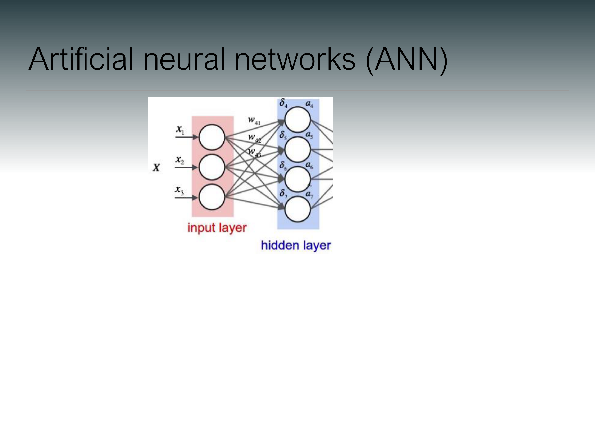
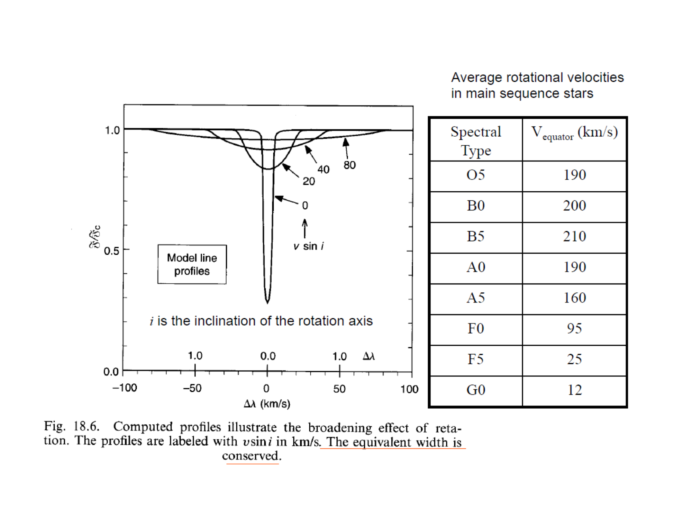
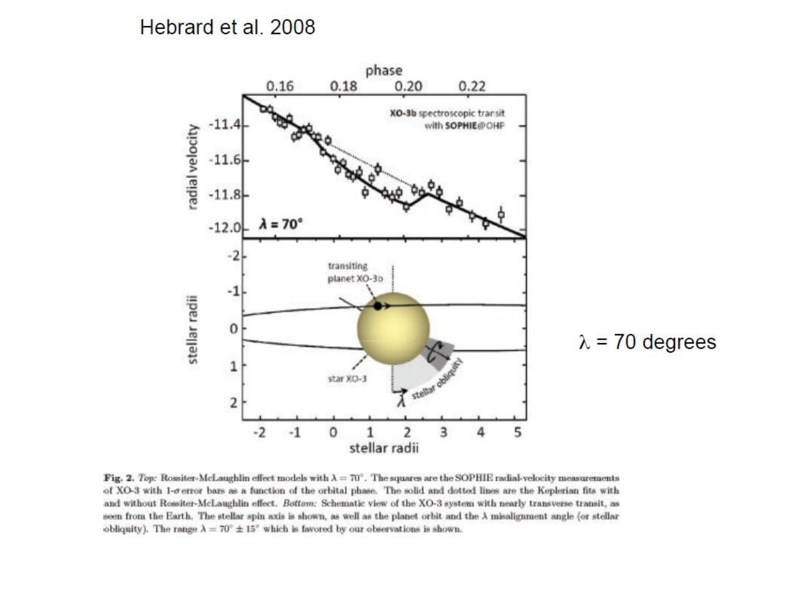


# Lesson 20 – Exoplanet Atmospheres and Transmission Spectroscopy

*Exoplanetary Astrophysics, Prof. Giampaolo Piotto (Lecture 23/12/2025)*  
*Index: [Exoplanetary_Astrophysics_MOC](../../../04_Atlas/Exoplanetary_Astrophysics_MOC.html)*

---

## Observing Channels for Exoplanet Atmospheres

Atmospheric characterization provides the link between bulk planetary properties and environmental chemistry. Three primary observational geometries are employed in modern exoplanetology:

```
                        ATMOSPHERIC OBSERVATIONAL GEOMETRIES
 1. Primary Transit (Transmission)      2. Secondary Eclipse (Emission)      3. Orbital Phase Curves
    Stellar light filters through          Thermal emission & reflected         Continuous longitudinal flux
    the day-night terminator limb          starlight from planetary dayside     variation across full orbit
         ╭──────────────╮                       ╭──────────────╮                     ╭──────────────╮
        ╱      ●───>     ╲                     ╱                ╲                   ╱                ╲
       │     terminator   │                   │    ● [Hidden]   │                  │     ●(t)        │
        ╲                ╱                     ╲   behind star  ╱                   ╲                ╱
         ╰──────────────╯                       ╰──────────────╯                     ╰──────────────╯
    Probes limb absorption & scale height  Probes dayside T-P profile & emission Day-night heat redistribution
```

---

## Transmission Spectroscopy: Mathematical Formulation

During a primary transit, starlight filters horizontally through an annular atmospheric ring of thickness $\delta R_p(\lambda)$ at the planetary day-night terminator:

```
                         TRANSMISSION TRANSIT GEOMETRY
                                    Atmospheric Annulus (Thickness ~ N * H)
                                         ╭───────────╮
                                        ╱   ┌─────┐   ╲
                                       │    │ R_p │    │
                                       │    └─────┘    │
                                        ╲             ╱
                                         ╰───────────╯
                             ◄────── R_eff(lambda) ──────►
```

The wavelength-dependent apparent transit depth is:

$$\delta(\lambda) = \left( \frac{R_{\text{eff}}(\lambda)}{R_\star} \right)^2 \approx \frac{R_p^2 + 2 R_p h_{\text{eff}}(\lambda)}{R_\star^2} = \delta_0 + \Delta \delta(\lambda)$$

where the spectral modulation depth is:

$$\Delta \delta(\lambda) \approx \frac{2 R_p h_{\text{eff}}(\lambda)}{R_\star^2}$$

### The Atmospheric Scale Height $H$
The effective atmospheric absorbing height $h_{\text{eff}}(\lambda)$ scales with the **isothermal pressure scale height** $H$:

$$H \equiv \frac{k_B T_{\text{eq}}}{\mu g_p} = \frac{k_B T_{\text{eq}} R_p^2}{\mu G M_p}$$

where:
- $k_B$: Boltzmann constant ($1.38 \times 10^{-23}\text{ J K}^{-1}$).
- $T_{\text{eq}}$: Planetary equilibrium temperature:
  $$T_{\text{eq}} = T_\star \left( \frac{R_\star}{2a} \right)^{1/2} (1 - A_B)^{1/4}$$
  with Bond albedo $A_B$.
- $\mu$: Mean molecular weight of the atmosphere:
  - Primordial $H_2/He$ atmosphere: $\mu \approx 2.3\text{ amu}$.
  - Water-rich atmosphere ($H_2O$): $\mu \approx 18\text{ amu}$.
  - Secondary terrestrial atmosphere ($N_2 / CO_2$): $\mu \approx 28 - 44\text{ amu}$.
- $g_p$: Planetary surface gravity ($g_p = G M_p / R_p^2$).

### Transmission Spectral Modulation Amplitude
Because an absorption line with cross-section $\sigma(\lambda)$ becomes optically thick across $\Delta N \sim 3 - 5$ scale heights ($h_{\text{eff}} \approx 4-5 H$):

$$\Delta \delta_{\text{feature}} \approx \frac{2 R_p (n H)}{R_\star^2} \approx \frac{8 - 10 R_p H}{R_\star^2}$$

```
Representative Scale Heights and Transit Signals:
Planet Archetype        T_eq (K)    mu (amu)    g_p (m/s^2)    Scale Height H    Delta delta (ppm)
──────────────────────────────────────────────────────────────────────────────────────────────────
Hot Jupiter (WASP-39b)  1100 K      2.3 (H2/He)  4.2 m/s^2     ~ 950 km          ~ 800 - 1200 ppm
Warm Neptune (GJ 1214b) 550 K       5.0 - 18.0  8.9 m/s^2     ~ 60 - 200 km     ~ 50 - 150 ppm
Earth-Sun Analog        255 K       28.9 (N2/O2) 9.8 m/s^2     ~ 8.5 km          ~ 0.5 ppm
TRAPPIST-1 e (M Dwarf)  250 K       28.0 - 44.0  9.1 m/s^2     ~ 7 - 10 km       ~ 20 - 40 ppm
```

Notice that small planets around M dwarfs yield transmission signals an order of magnitude larger than around G dwarfs, because $R_\star$ is much smaller ($\Delta \delta \propto R_\star^{-2}$).

---

## Chemical Fingerprints and Spectral Physics

```
                    MOLECULAR AND AEROSOL ABSORPTION BANDS
 Transmission
 Depth delta(lambda)
    ▲
    │   Rayleigh Scattering
    │   (sigma ~ lambda^-4)       H2O               H2O         CO2 (4.3 um)       CO (4.6 um)
    │        \                  (1.4 um)          (1.9 um)          ▲
    │         \                    ▲                 ▲             ╱ ╲                 ▲
    │          \                  ╱ ╲               ╱ ╲           ╱   ╲               ╱ ╲
    │           \────────────────╱   ╲─────────────╱   ╲─────────╱     ╲─────────────╱   ╲
    │
    │  - - - - - - - - - -  Thick Cloud Deck (Truncates Spectral Features) - - - - - - - - -
    └──────┬───────────────────────┬─────────────────┬──────────────┬──────────────┬───────> Wavelength
          0.4 um                  1.4 um            2.0 um         4.3 um         5.0 um
```

### 1. Key Molecular Signatures
- **Water Vapor ($H_2O$)**: Dominant infrared absorber in hydrogen-rich atmospheres. Vibrational-rotational absorption bands at $0.94, 1.15, 1.40, 1.90,$ and $2.70\ \mu\text{m}$.
- **Carbon Dioxide ($CO_2$)**: Intense fundamental vibration mode centered at **$4.3\ \mu\text{m}$**. First definitively detected by the JWST Transiting Exoplanet Community ERS team in **WASP-39b** (Nature 2023).
- **Carbon Monoxide ($CO$)**: Strong ro-vibrational bands at $2.3\ \mu\text{m}$ and $4.6\ \mu\text{m}$. The $C/O$ abundance ratio serves as a critical tracer of planet formation location relative to the $H_2O, CO_2,$ and $CO$ snow lines in the protoplanetary disk.
- **Methane ($CH_4$)**: Strong absorption bands at $1.66, 2.3, 3.3,$ and $7.7\ \mu\text{m}$. Expected in cool atmospheres ($T_{\text{eq}} \lesssim 1000\text{ K}$), where thermochemical equilibrium converts $CO$ to $CH_4$.

### 2. Continuum Opacities: Rayleigh Scattering vs Clouds & Hazes
- **Rayleigh Scattering**: In cloud-free atmospheres, elastic scattering off $H_2$ molecules produces an opacity scaling as $\sigma(\lambda) \propto \lambda^{-4}$. This creates a diagnostic blue-slanted transmission slope:
  $$\frac{d R_{\text{eff}}}{d\ln \lambda} = \alpha H = -4 H$$
- **Aerosols (Clouds and Hazes)**:
  - **Clouds**: Liquid or solid condensates ($MgSiO_3, Fe, Al_2O_3$ in hot Jupiters; $H_2O$ in temperate worlds). Particles with radii larger than the observing wavelength ($a_{\text{grain}} \ge \lambda$) produce wavelength-independent grey extinction, flattening transmission spectra and concealing molecular absorption bands.
  - **Hazes**: Small organic tholins produced via photochemical dissociation in upper atmospheres, causing steep non-Rayleigh scattering slopes extending into the near-infrared.

---

## High-Resolution Cross-Correlation Spectroscopy (HRCCS)

While space-based telescopes (JWST, Hubble) measure low-to-medium resolution spectra ($R \sim 100 - 3,000$), ground-based 8-meter telescopes utilize high-resolution echelle spectrographs ($R \sim 100,000$, e.g., CRIRES+@VLT, GIANO@TNG, IGRINS):

```
                        HIGH-RESOLUTION DOPPLER SHIFT
 Orbital Phase phi
    ▲
0.6 │                                  Secondary Eclipse
0.5 │                             (Day-side emission masked)
0.4 │
0.3 │                \
0.2 │                 \  Planet orbital Doppler motion:
0.1 │                  \ v_p(t) = K_p * sin(2 pi t / P)  (~ 100 - 200 km/s)
0.0 │                   \ Primary Transit
    └─────────────┴───────┴───────┴───────┴───────> Radial Velocity (km/s)
                -100      0      +100    +200
```

### Doppler De-aliasing
1. The host star's lines move by only $\sim 10 - 100\text{ m s}^{-1}$, while telluric lines in Earth's atmosphere are stationary ($v = 0$).
2. In contrast, a close-in hot Jupiter accelerates across its orbit with velocities:
   $$K_p = \sqrt{\frac{G M_\star}{a}} \approx 100 - 200\text{ km s}^{-1}$$
3. The thousands of ro-vibrational lines of the planetary atmosphere shift across dozens of detector pixels during a single transit or eclipse.
4. By cross-correlating high-resolution spectra with synthetic molecular line lists, the planetary signal emerges as a prominent peak in the velocity space $(K_p, v_{\text{sys}})$, measuring:
   - Chemical detections at $>10\sigma$ confidence.
   - Atmospheric day-to-night winds ($v_{\text{wind}} \sim 1 - 5\text{ km s}^{-1}$).
   - The planet's true orbital velocity $K_p$, which directly yields the **true mass of both star and planet**:
     $$M_p = M_\star \frac{K_\star}{K_p \sin i}$$

---

## Dedicated Atmospheric Survey Missions: Ariel

**Ariel (Atmospheric Remote-sensing Infrared Exoplanet Large-survey)** is ESA's M4 Cosmic Vision mission (launch scheduled for 2029 to Sun-Earth $L_2$):
- **Telescope**: 1-meter off-axis Cassegrain telescope ($1100 \times 730\text{ mm}$ primary mirror) cooled to $< 55\text{ K}$.
- **Spectrometers**:
  - VISPhot: Optical photometry ($0.50 - 0.60\ \mu\text{m}$).
  - FGS1 & FGS2: Near-IR photometers ($0.60 - 0.80\ \mu\text{m}$ and $0.80 - 1.10\ \mu\text{m}$).
  - NIRSpec: Low-resolution prism spectrometer ($1.10 - 1.95\ \mu\text{m}, R \sim 15$).
  - AIRS: Mid-infrared grating spectrometer covering $1.95 - 7.80\ \mu\text{m}$ with resolving power $R \approx 30 - 100$.
- **Mission Goal**: Conduct the first unbiased, homogeneous statistical census of **$\sim 1,000$ exoplanet atmospheres** ranging from super-Earths to Jupiter-mass gas giants, constraining bulk elemental compositions ($C/O, N/O, [M/H]$) and chemical evolution across the Galaxy.

---

## Cross-Links & Vault Navigation
- Master Map of Content: [Exoplanetary_Astrophysics_MOC](../../../04_Atlas/Exoplanetary_Astrophysics_MOC.html)
- Previous Lecture: [19_CHEOPS_and_PLATO_Missions](./19_CHEOPS_and_PLATO_Missions.html)
- Next Lecture: [21_Protoplanetary_Disks_and_Planet_Formation_Mechanisms](./21_Protoplanetary_Disks_and_Planet_Formation_Mechanisms.html)
- Related Notes: Exoplanetary atmospheres and transmission spectroscopy | [08_Exoplanet_Atmospheric_Retrieval_Frameworks_and_TauREx](../Computational_Astrophysics/08_Exoplanet_Atmospheric_Retrieval_Frameworks_and_TauREx.html)


## Lecture Visuals & Atmospheric Characterization


*Figure EXO-08: Vertical Pressure-Temperature ($P-T$) profiles in exoplanet atmospheres. Compares non-inverted profiles with stratospheric thermal inversions induced by high-altitude gas-phase absorption of optical stellar radiation by TiO and VO.*


*Figure EXO-09: Condensation equilibrium curves showing expected cloud decks in gas giants and sub-Neptunes ($\mathrm{Fe}$, $\mathrm{MgSiO_3}$ enstatite, $\mathrm{Na_2S}$, $\mathrm{H_2O}$, $\mathrm{NH_3}$) intersecting the local atmospheric $P-T$ profile.*


*Figure EXO-10: Thermal emission geometry during secondary eclipse and orbital phase curves, measuring dayside/nightside brightness temperature contrast and eastward equatorial heat recirculation jets.*


*Figure EXO-11: Principles of transmission spectroscopy during transit. The wavelength-dependent apparent transit depth $\Delta \delta(\lambda) \approx \frac{2 R_p n H}{R_*^2}$ is proportional to atmospheric scale height $H = \frac{k_B T}{\mu g}$, revealing atmospheric composition.*


*Figure EXO-12: High-precision JWST NIRSpec/PRISM transmission spectra of hot Jupiters (e.g. WASP-39b) displaying prominent absorption bands of $\mathrm{H_2O}$ ($1.4, 1.8, 2.7\,\mu\mathrm{m}$), $\mathrm{CO_2}$ ($4.3\,\mu\mathrm{m}$), $\mathrm{CO}$ ($4.6\,\mu\mathrm{m}$), and photochemical $\mathrm{SO_2}$ ($4.05\,\mu\mathrm{m}$).*


<div class="backlinks-section">
  <h4 class="backlinks-title">Linked References (4)</h4>
  <ul class="backlinks-list">
    <li class="backlink-item-wrap"><a href="./19_CHEOPS_and_PLATO_Missions.html" class="backlink-item">19_CHEOPS_and_PLATO_Missions</a></li>
    <li class="backlink-item-wrap"><a href="./21_Protoplanetary_Disks_and_Planet_Formation_Mechanisms.html" class="backlink-item">21_Protoplanetary_Disks_and_Planet_Formation_Mechanisms</a></li>
    <li class="backlink-item-wrap"><a href="../../../03_Zettel/Theory/Exoplanet%20atmospheric%20scale%20height%20and%20transmission%20spectroscopy.html" class="backlink-item">Exoplanet atmospheric scale height and transmission spectroscopy</a></li>
    <li class="backlink-item-wrap"><a href="../../../04_Atlas/Exoplanetary_Astrophysics_MOC.html" class="backlink-item">Exoplanetary_Astrophysics_MOC</a></li>
  </ul>
</div>
