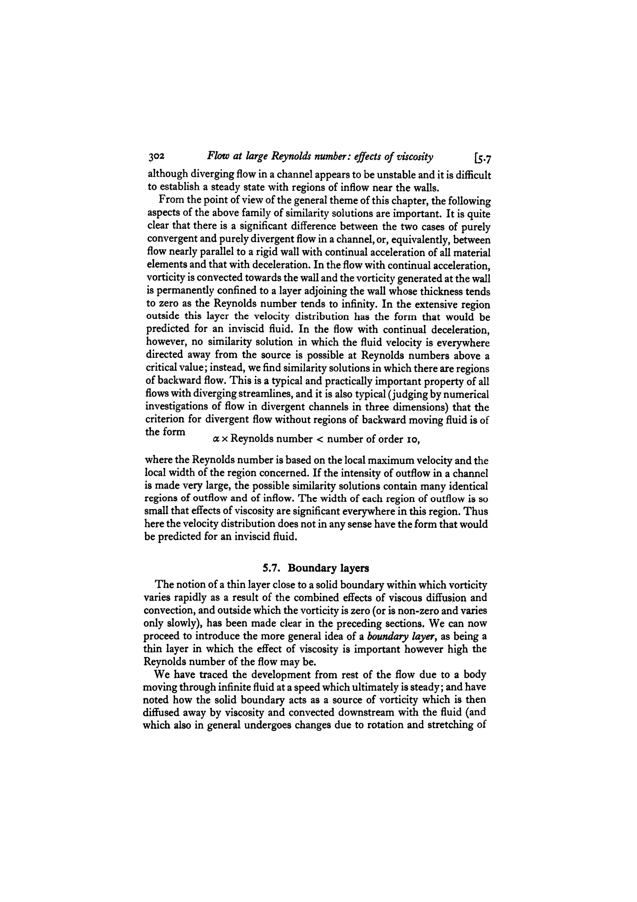
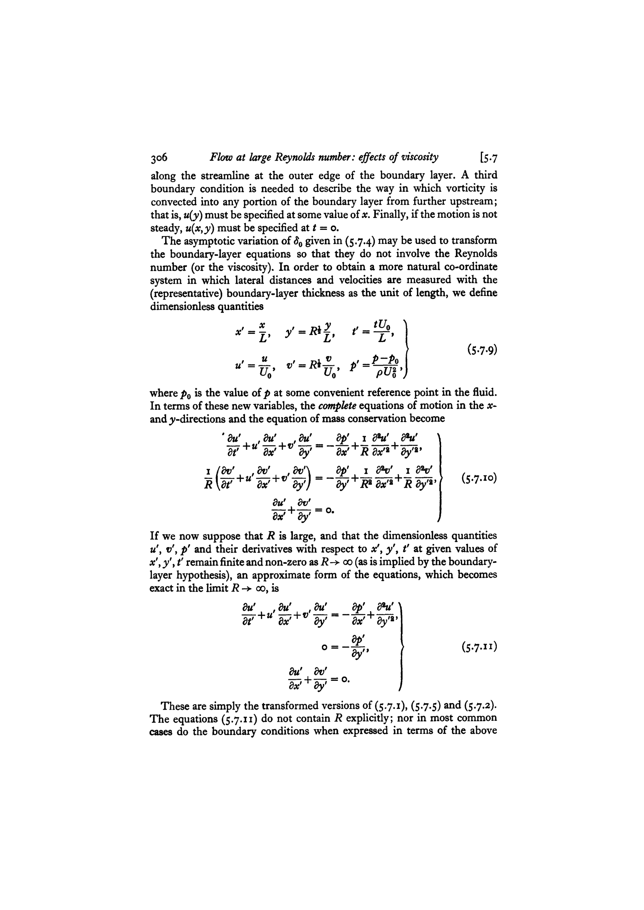

# Part 2 - Incompressible and Viscous Flows

*Course: Fluid and Plasma Dynamics, Prof. Maurizio Giacomin*  
*Index: [[Fluid_and_Plasma_Dynamics_MOC]] | Exam Guide: [[Giacomin_Oral_Exam_Questions_Complete_Guide]]*  
*Relevant Exam Questions: 6, 7, 8*  

---

## 1. Vorticity Dynamics and Kelvin's Circulation Theorem

### 1.1 Definition and Physical Meaning of Vorticity

Vorticity is defined as the curl of the macroscopic velocity field:
$$\vec{\omega} = \nabla \times \vec{v}$$

At any point in a fluid, the velocity gradient tensor $\frac{\partial v_i}{\partial x_j}$ can be decomposed into symmetric and anti-symmetric parts:
$$\frac{\partial v_i}{\partial x_j} = S_{ij} + \Omega_{ij}$$
where $S_{ij} = \frac{1}{2}\left( \frac{\partial v_i}{\partial x_j} + \frac{\partial v_j}{\partial x_i} \right)$ is the strain-rate tensor (describing stretching and shearing of volume elements), and $\Omega_{ij} = \frac{1}{2}\left( \frac{\partial v_i}{\partial x_j} - \frac{\partial v_j}{\partial x_i} \right) = -\frac{1}{2} \epsilon_{ijk} \omega_k$ is the rotation tensor. The local angular velocity of an infinitesimal fluid element about its center of mass is $\vec{\Omega}_{fluid} = \frac{1}{2} \vec{\omega}$.

### 1.2 Derivation of the Vorticity Equation

Consider the momentum equation for an inviscid fluid (Euler equation) under a conservative body force $\vec{g} = -\nabla \Phi$:
$$\frac{\partial \vec{v}}{\partial t} + (\vec{v} \cdot \nabla)\vec{v} = -\frac{\nabla p}{\rho} - \nabla \Phi$$

Using the vector identity for convective acceleration:
$$(\vec{v} \cdot \nabla)\vec{v} = \nabla\left( \frac{1}{2} v^2 \right) - \vec{v} \times (\nabla \times \vec{v}) = \nabla\left( \frac{1}{2} v^2 \right) - \vec{v} \times \vec{\omega}$$

Substituting this identity into the Euler equation:
$$\frac{\partial \vec{v}}{\partial t} - \vec{v} \times \vec{\omega} = -\nabla\left( \frac{1}{2} v^2 + \Phi \right) - \frac{\nabla p}{\rho}$$

Taking the curl ($\nabla \times$) of this entire equation, and noting that the curl of any gradient vanishes identically ($\nabla \times \nabla f = 0$):
$$\frac{\partial \vec{\omega}}{\partial t} - \nabla \times (\vec{v} \times \vec{\omega}) = -\nabla \times \left( \frac{\nabla p}{\rho} \right) = \frac{\nabla \rho \times \nabla p}{\rho^2}$$

The term on the right-hand side is the **baroclinic torque**. For a **barotropic fluid**, the equation of state satisfies $p = p(\rho)$ (pressure depends solely on density, as in isothermal or adiabatic flows). Consequently, $\nabla p = \frac{dp}{d\rho} \nabla \rho$, which means $\nabla \rho$ and $\nabla p$ are parallel vectors. Their cross product vanishes:
$$\nabla \rho \times \nabla p \equiv 0$$

Expanding the curl of the cross product $\nabla \times (\vec{v} \times \vec{\omega})$ using standard vector calculus identities:
$$\nabla \times (\vec{v} \times \vec{\omega}) = (\vec{\omega} \cdot \nabla)\vec{v} - (\vec{v} \cdot \nabla)\vec{\omega} + \vec{v}(\nabla \cdot \vec{\omega}) - \vec{\omega}(\nabla \cdot \vec{v})$$

Since the divergence of any curl is identically zero, $\nabla \cdot \vec{\omega} = \nabla \cdot (\nabla \times \vec{v}) = 0$. Collecting terms:
$$\frac{\partial \vec{\omega}}{\partial t} + (\vec{v} \cdot \nabla)\vec{\omega} = (\vec{\omega} \cdot \nabla)\vec{v} - \vec{\omega}(\nabla \cdot \vec{v})$$

Using the material derivative $\frac{d\vec{\omega}}{dt} = \frac{\partial \vec{\omega}}{\partial t} + (\vec{v} \cdot \nabla)\vec{\omega}$:
$$\frac{d\vec{\omega}}{dt} = (\vec{\omega} \cdot \nabla)\vec{v} - \vec{\omega}(\nabla \cdot \vec{v})$$

To combine this with the continuity equation $\frac{d\rho}{dt} + \rho \nabla \cdot \vec{v} = 0$, consider the convective derivative of the quantity $\vec{\omega}/\rho$:
$$\frac{d}{dt}\left( \frac{\vec{\omega}}{\rho} \right) = \frac{1}{\rho}\frac{d\vec{\omega}}{dt} - \frac{\vec{\omega}}{\rho^2}\frac{d\rho}{dt} = \frac{1}{\rho}\left[ (\vec{\omega} \cdot \nabla)\vec{v} - \vec{\omega}(\nabla \cdot \vec{v}) \right] - \frac{\vec{\omega}}{\rho^2}\left[ -\rho \nabla \cdot \vec{v} \right]$$

The divergence terms cancel exactly:
$$\frac{d}{dt}\left( \frac{\vec{\omega}}{\rho} \right) = \left( \frac{\vec{\omega}}{\rho} \cdot \nabla \right)\vec{v}$$

This is the **vorticity equation** for an inviscid, barotropic fluid. 
- In two dimensions ($v_z = 0, \partial/\partial z = 0$), the vortex stretching term $(\vec{\omega} \cdot \nabla)\vec{v}$ is strictly zero because $\vec{\omega} = \omega_z \hat{z}$ is perpendicular to the plane of motion. Hence, $\omega/\rho$ is an exact Lagrangian invariant.
- In three dimensions, the term $(\vec{\omega} \cdot \nabla)\vec{v}$ represents **vortex stretching and tilting**: if a fluid element is stretched along the direction of $\vec{\omega}$, its cross-sectional area decreases (by mass conservation), and its vorticity amplifies proportionally.

### 1.3 Kelvin's Circulation Theorem and Proof

Define the fluid **circulation** $\Gamma$ around a closed material contour $C(t)$ that moves along with the fluid velocity $\vec{v}$:
$$\Gamma(t) = \oint_{C(t)} \vec{v} \cdot d\vec{\ell}$$

By Stokes' theorem, the circulation equals the total flux of vorticity through any open orientable surface $S(t)$ bounded by $C(t)$:
$$\Gamma(t) = \int_{S(t)} (\nabla \times \vec{v}) \cdot d\vec{S} = \int_{S(t)} \vec{\omega} \cdot d\vec{S}$$

To calculate the time rate of change of $\Gamma(t)$, differentiate under the line integral:
$$\frac{d\Gamma}{dt} = \frac{d}{dt} \oint_{C(t)} \vec{v} \cdot d\vec{\ell} = \oint_{C(t)} \frac{d\vec{v}}{dt} \cdot d\vec{\ell} + \oint_{C(t)} \vec{v} \cdot \frac{d(d\vec{\ell})}{dt}$$

A material line element $d\vec{\ell}$ connecting two neighboring fluid particles separated by $\Delta \vec{x}$ evolves according to the relative velocity:
$$\frac{d(d\vec{\ell})}{dt} = d\left( \frac{d\vec{x}}{dt} \right) = d\vec{v}$$

Therefore, the second integral is:
$$\oint_{C(t)} \vec{v} \cdot d\vec{v} = \oint_{C(t)} d\left( \frac{1}{2} v^2 \right) = 0$$
because $\frac{1}{2} v^2$ is a single-valued scalar function evaluated around a closed loop.

Now substitute the momentum equation $\frac{d\vec{v}}{dt} = -\frac{\nabla p}{\rho} - \nabla \Phi$:
$$\frac{d\Gamma}{dt} = \oint_{C(t)} \left( -\frac{\nabla p}{\rho} - \nabla \Phi \right) \cdot d\vec{\ell} = -\oint_{C(t)} \frac{dp}{\rho} - \oint_{C(t)} d\Phi$$

For a barotropic fluid, we define the specific enthalpy $h(p) = \int \frac{dp}{\rho(p)}$, so $\frac{dp}{\rho} = dh$. Thus:
$$\frac{d\Gamma}{dt} = -\oint_{C(t)} d(h + \Phi) = 0$$

This is **Kelvin's circulation theorem**: in an inviscid, barotropic fluid subjected to conservative body forces, the circulation around any closed material contour remains strictly constant in time:
$$\frac{d\Gamma}{dt} = 0$$

**Physical consequences**:
1. **Permanence of irrotationality**: If a fluid starts from an irrotational state ($\vec{\omega} = 0$, such as rest), it remains irrotational for all time ($\Gamma = 0$ for every loop). Vorticity cannot be generated within the bulk of an ideal barotropic fluid; it can only be introduced at solid boundaries (via viscosity) or by non-conservative/baroclinic forces ($\nabla \rho \times \nabla p \neq 0$, e.g., shock waves).
2. **Helmholtz's vortex theorems**: Vortex lines move with the fluid as material lines ("vortex lines are frozen into the fluid"). The strength of a vortex tube ($\int \vec{\omega} \cdot d\vec{S}$) is constant along its length and invariant in time.

---

## 2. Hydrostatic Dynamics of the Solar Corona and the Parker Wind

### 2.1 The Solar Corona Hydrostatic Model

The solar corona is the outermost layer of the Sun's atmosphere, characterized by extremely high temperatures ($T \sim 1-2 \times 10^6\text{ K}$) and low density, extending millions of kilometers into interplanetary space.

Consider whether the solar corona can exist in static hydrostatic equilibrium. The radial force balance in spherical symmetry is:
$$\frac{dp}{dr} = -\rho \frac{G M_\odot}{r^2}$$

Assuming the ideal gas equation of state:
$$p = n k_B T = \frac{\rho}{m_p} k_B T$$
where $m_p$ is the mean particle mass (protons and electrons).

To test the simplest hydrostatic model, assume an **isothermal corona** ($T = T_0 = \text{constant}$):
$$\frac{dp}{dr} = -\frac{m_p p}{k_B T_0} \frac{G M_\odot}{r^2}$$

Separating variables:
$$\frac{d\ln p}{dr} = -\frac{G M_\odot m_p}{k_B T_0} \frac{1}{r^2}$$

Integrating from the coronal base $r = r_0 \approx R_\odot$ where $p = p_0$:
$$\ln\left( \frac{p(r)}{p_0} \right) = \frac{G M_\odot m_p}{k_B T_0} \left( \frac{1}{r} - \frac{1}{r_0} \right)$$

Exponentiating:
$$p(r) = p_0 \exp\left[ \frac{G M_\odot m_p}{k_B T_0 r_0} \left( \frac{r_0}{r} - 1 \right) \right]$$

### 2.2 The Asymptotic Pressure Paradox

Now examine the limit as $r \to \infty$ (deep interplanetary space):
$$p_\infty = \lim_{r \to \infty} p(r) = p_0 \exp\left( -\frac{G M_\odot m_p}{k_B T_0 r_0} \right)$$

Evaluating typical numerical values at the coronal base ($r_0 \approx 7 \times 10^8\text{ m}$, $T_0 \approx 1.5 \times 10^6\text{ K}$, $n_0 \sim 10^8\text{ cm}^{-3}$):
$$\frac{G M_\odot m_p}{k_B T_0 r_0} \approx \frac{(6.67 \times 10^{-11})(2.0 \times 10^{30})(0.8 \times 10^{-27})}{(1.38 \times 10^{-23})(1.5 \times 10^6)(7 \times 10^8)} \approx 7.4$$

Therefore:
$$p_\infty \approx p_0 e^{-7.4} \approx 6 \times 10^{-4} p_0 \sim 10^{-4}\text{ dyn cm}^{-2}$$

However, the pressure of the local interstellar medium (LISM) is known from observational astrophysics to be:
$$p_{ISM} \sim 10^{-12} - 10^{-13}\text{ dyn cm}^{-2}$$

The asymptotic pressure $p_\infty$ predicted by static hydrostatic equilibrium is **eight orders of magnitude higher** than the interstellar confining pressure! A fluid cannot maintain a finite non-zero pressure at infinity against a near-vacuum without boundary walls.

### 2.3 Parker's Dynamical Solution: The Solar Wind

In 1958, Eugene Parker showed that the corona cannot be static: it must expand dynamically outward into space.
For steady, spherically symmetric radial flow ($v_r = v(r)$), the continuity and momentum equations are:
$$\frac{d}{dr}(r^2 \rho v) = 0 \implies 4\pi r^2 \rho v = \dot{M} = \text{constant}$$
$$v \frac{dv}{dr} = -\frac{1}{\rho}\frac{dp}{dr} - \frac{G M_\odot}{r^2}$$

For an isothermal gas with sound speed $c_s = \sqrt{k_B T_0 / m_p} = \text{constant}$, $p = \rho c_s^2$, so:
$$\frac{1}{\rho}\frac{dp}{dr} = \frac{c_s^2}{\rho}\frac{d\rho}{dr}$$

From the continuity equation, logarithmic differentiation yields:
$$\frac{1}{\rho}\frac{d\rho}{dr} = -\frac{2}{r} - \frac{1}{v}\frac{dv}{dr}$$

Substituting into the momentum equation:
$$v \frac{dv}{dr} = c_s^2 \left( \frac{2}{r} + \frac{1}{v}\frac{dv}{dr} \right) - \frac{G M_\odot}{r^2}$$

Regrouping terms:
$$\left( v - \frac{c_s^2}{v} \right) \frac{dv}{dr} = \frac{2 c_s^2}{r} - \frac{G M_\odot}{r^2} = \frac{2 c_s^2}{r} \left( 1 - \frac{r_c}{r} \right)$$
where the **critical (sonic) radius** is:
$$r_c = \frac{G M_\odot}{2 c_s^2}$$

At $r = r_c$, the right-hand side vanishes. For a smooth, continuous velocity profile across $r_c$, the left-hand factor must also vanish, requiring:
$$v(r_c) = c_s$$

This is mathematically identical to a **de Laval nozzle**, where the Sun's gravitational field acts as the converging-diverging throat. The unique physically acceptable solution is the transonic branch: subsonic at the coronal base ($v \ll c_s$ for $r < r_c$) and accelerating to supersonic speeds ($v > c_s$) for $r > r_c$, producing the **solar wind** ($v \sim 400 - 800\text{ km/s}$ at Earth).

---

## 3. Viscous Flows: The Navier-Stokes Equation and Hagen-Poiseuille Flow

### 3.1 Viscous Stress in the Navier-Stokes Equation

In real fluids, microscopic molecular collisions transfer momentum across shear layers, generating internal friction. For an incompressible fluid ($\nabla \cdot \vec{v} = 0$), the viscous stress tensor is:
$$\sigma_{ij} = \mu \left( \frac{\partial v_i}{\partial x_j} + \frac{\partial v_j}{\partial x_i} \right)$$
where $\mu$ is the dynamic shear viscosity ($[\mu] = \text{Pa}\cdot\text{s} = \text{kg}\cdot\text{m}^{-1}\cdot\text{s}^{-1}$).

The divergence of the stress tensor in the momentum balance is:
$$\frac{\partial \sigma_{ji}}{\partial x_j} = \mu \frac{\partial}{\partial x_j} \left( \frac{\partial v_i}{\partial x_j} + \frac{\partial v_j}{\partial x_i} \right) = \mu \frac{\partial^2 v_i}{\partial x_j \partial x_j} + \mu \frac{\partial}{\partial x_i} \left( \frac{\partial v_j}{\partial x_j} \right) = \mu \nabla^2 v_i$$
because $\frac{\partial v_j}{\partial x_j} = \nabla \cdot \vec{v} = 0$.

Thus, viscosity enters the incompressible Navier-Stokes equation as a Laplacian diffusion term:
$$\rho \left( \frac{\partial \vec{v}}{\partial t} + (\vec{v} \cdot \nabla)\vec{v} \right) = -\nabla p + \mu \nabla^2 \vec{v} + \rho \vec{g}$$

Dividing by density $\rho$:
$$\frac{\partial \vec{v}}{\partial t} + (\vec{v} \cdot \nabla)\vec{v} = -\frac{1}{\rho}\nabla p + \nu \nabla^2 \vec{v} + \vec{g}$$
where $\nu = \mu / \rho$ is the **kinematic viscosity** ($[\nu] = \text{m}^2\cdot\text{s}^{-1}$), acting as the momentum diffusivity.

### 3.2 Hagen-Poiseuille Flow Through a Circular Pipe

Consider steady, laminar flow of a viscous incompressible fluid through a rigid cylindrical pipe of radius $R$ and length $L$, driven by a constant pressure drop $\Delta p = p_1 - p_2 > 0$.

```
 r
 ^         +-------------------------------------+
 |         |                                     |
 |-------->|====================================>| Pipe Wall (r = R, v = 0)
 |         |      . - ~ ~ ~ - .                  |
 0 --------|----(-------vz(r)-------)------------| Axis (r = 0, dv/dr = 0)
 |         |      ` - . _ _ . - '                |
 |-------->|====================================>| Pipe Wall (r = R, v = 0)
 |         |                                     |
 v         +-------------------------------------+
           z = 0 (p1)                            z = L (p2)
```

We employ cylindrical coordinates $(r, \theta, z)$ aligned with the pipe axis:
1. **Flow symmetry**: The flow is purely unidirectional along the axis:
$$\vec{v} = (0, 0, v_z(r))$$
2. **Continuity**: $\nabla \cdot \vec{v} = \frac{\partial v_z}{\partial z} = 0 \implies v_z$ is independent of $z$.
3. **Inertial term**: The convective derivative vanishes identically:
$$(\vec{v} \cdot \nabla)\vec{v} = v_z \frac{\partial v_z}{\partial z} \hat{z} \equiv 0$$
4. **Laplacian in cylindrical coordinates**:
$$\nabla^2 v_z = \frac{1}{r} \frac{d}{dr}\left( r \frac{dv_z}{dr} \right)$$

The Navier-Stokes equation along the $z$-direction reduces to:
$$0 = -\frac{\partial p}{\partial z} + \mu \frac{1}{r} \frac{d}{dr}\left( r \frac{dv_z}{dr} \right)$$

Since $v_z$ depends only on $r$ while $p$ can depend on $z$, both terms must equal a constant pressure gradient:
$$\frac{dp}{dz} = -\frac{\Delta p}{L} = \text{constant}$$

Equating:
$$\frac{1}{r} \frac{d}{dr}\left( r \frac{dv_z}{dr} \right) = -\frac{\Delta p}{\mu L}$$

Multiply by $r$ and integrate once with respect to $r$:
$$r \frac{dv_z}{dr} = -\frac{\Delta p}{2\mu L} r^2 + C_1 \implies \frac{dv_z}{dr} = -\frac{\Delta p}{2\mu L} r + \frac{C_1}{r}$$

Integrating a second time:
$$v_z(r) = -\frac{\Delta p}{4\mu L} r^2 + C_1 \ln r + C_2$$

**Boundary conditions**:
1. **Finiteness on the axis ($r = 0$)**: The velocity and shear stress must remain finite at $r = 0$. Since $\ln r \to -\infty$ as $r \to 0$, we must set $C_1 = 0$.
2. **No-slip condition at the pipe wall ($r = R$)**: Viscous adhesion requires the fluid to be at rest relative to the wall:
$$v_z(R) = 0 \implies -\frac{\Delta p}{4\mu L} R^2 + C_2 = 0 \implies C_2 = \frac{\Delta p}{4\mu L} R^2$$

Substituting $C_1$ and $C_2$ gives the **parabolic velocity profile**:
$$v_z(r) = \frac{\Delta p}{4\mu L} (R^2 - r^2)$$

The maximum velocity occurs on the centerline ($r = 0$):
$$v_{max} = \frac{\Delta p R^2}{4\mu L}$$

### 3.3 Volumetric Flow Rate and Hagen-Poiseuille's Law

The total volumetric discharge rate $Q$ through the pipe cross-section is obtained by integrating over annular rings $2\pi r \, dr$:
$$Q = \int_0^R v_z(r) 2\pi r \, dr = 2\pi \frac{\Delta p}{4\mu L} \int_0^R (R^2 r - r^3) \, dr$$

Evaluating the elementary definite integral:
$$\int_0^R (R^2 r - r^3) \, dr = \left[ \frac{R^2 r^2}{2} - \frac{r^4}{4} \right]_0^R = \frac{R^4}{2} - \frac{R^4}{4} = \frac{R^4}{4}$$

Therefore:
$$Q = \frac{\pi R^4 \Delta p}{8 \mu L}$$

This is the famous **Hagen-Poiseuille formula**. The volume flow rate scales with the fourth power of the pipe radius ($Q \propto R^4$). Halving the radius increases hydraulic resistance by a factor of 16.

---

## 4. Prandtl Boundary Layer Theory

### 4.1 Boundary Layer Scaling and Scaling Arguments

Consider high Reynolds number flow ($Re = U L / \nu \gg 1$) past a solid body (e.g., a flat plate of length $L$). Away from the wall, viscous forces are negligible compared to inertia, and the fluid behaves as an ideal potential flow.

However, Euler's equations cannot satisfy the viscous no-slip condition ($v_\parallel = 0$) at solid boundaries. In 1904, Ludwig Prandtl recognized that viscous shear is concentrated within a very thin layer of thickness $\delta(x) \ll L$ adjacent to the surface.

Inside this boundary layer:
- The longitudinal coordinate scales as $x \sim L$, velocity $u \sim U$.
- The transverse coordinate scales as $y \sim \delta \ll L$.
- From the continuity equation $\frac{\partial u}{\partial x} + \frac{\partial v}{\partial y} = 0$:
$$\frac{U}{L} \sim \frac{v}{\delta} \implies v \sim U \frac{\delta}{L} \ll U$$

In the momentum equation along the surface:
$$u \frac{\partial u}{\partial x} + v \frac{\partial u}{\partial y} = -\frac{1}{\rho}\frac{\partial p}{\partial x} + \nu \frac{\partial^2 u}{\partial y^2}$$

For viscous diffusion across the boundary layer to balance convective transport:
$$\text{Inertia} \sim \frac{U^2}{L} \sim \text{Viscous diffusion} \sim \nu \frac{U}{\delta^2}$$

Solving for the boundary layer thickness $\delta$:
$$\delta^2 \sim \frac{\nu L}{U} \implies \delta \sim \sqrt{\frac{\nu L}{U}} = \frac{L}{\sqrt{Re_L}}$$

The boundary layer thickness grows downstream along a flat plate as:
$$\delta(x) \approx 5.0 \sqrt{\frac{\nu x}{U}}$$


## Lecture Visuals & Boundary Layer Theory


*Figure FPD-01: Prandtl boundary layer on a flat plate. The laminar viscous shear layer grows downstream as $\delta(x) \approx 5.0 \sqrt{\frac{\nu x}{U_\infty}} = \frac{5.0 x}{\sqrt{\mathrm{Re}_x}}$, matching the outer inviscid potential flow $U_\infty$ at the edge.*


*Figure FPD-02: Boundary layer separation under adverse pressure gradients $\frac{dp}{dx} > 0$. At the separation point, the wall shear stress vanishes $\left.\frac{\partial u}{\partial y}\right\rvert_{y=0} = 0$, generating recirculating eddies, turbulent wake shed, and stall.*


## Linked References

- [[Hagen-Poiseuille pipe flow and viscous dissipation]]
- [[Helmholtz vortex theorems and baroclinic torque]]
- [[Parker solar wind and transonic critical point]]
- [[Prandtl boundary layer theory and Blasius scaling]]
- [[Vorticity dynamics and Kelvin circulation theorem]]
- [[Fluid_and_Plasma_Dynamics_MOC]]


