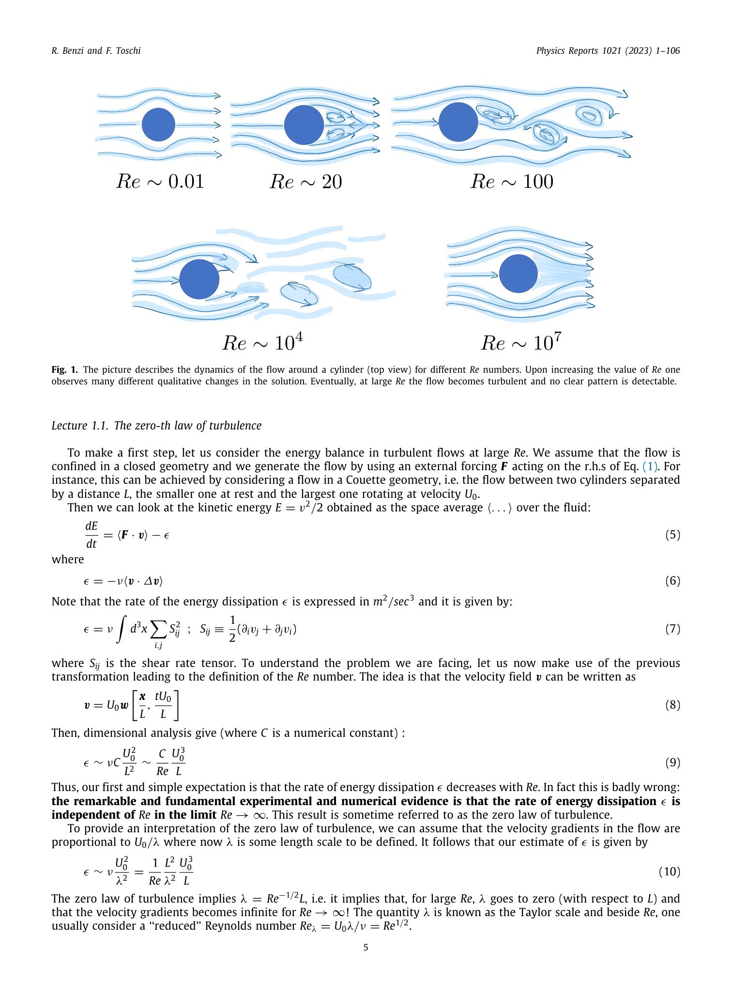
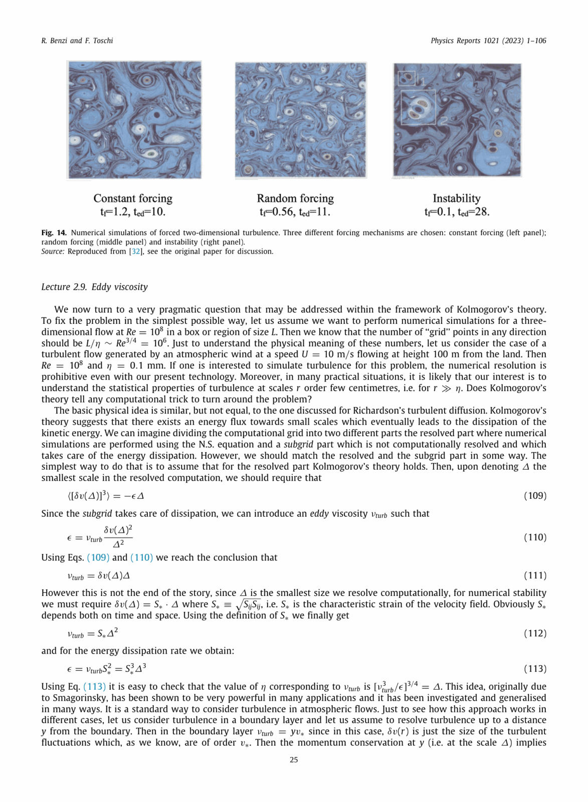
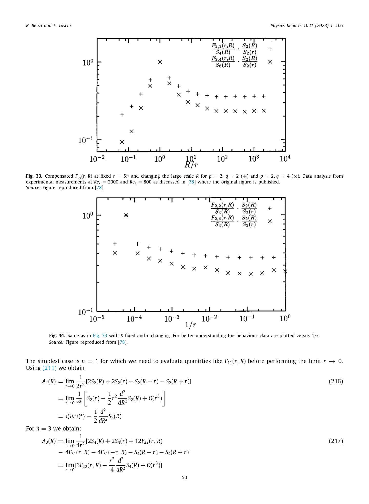


# Part 3 - Waves, Instabilities, and Turbulence

*Course: Fluid and Plasma Dynamics, Prof. Maurizio Giacomin*  
*Index: [Fluid_and_Plasma_Dynamics_MOC](../../../04_Atlas/Fluid_and_Plasma_Dynamics_MOC.html) | Exam Guide: [Giacomin_Oral_Exam_Questions_Complete_Guide](./Giacomin_Oral_Exam_Questions_Complete_Guide.html)*  
*Relevant Exam Questions: 9, 10, 11*  

---

## 1. Sound Waves and the Jeans Gravitational Instability

### 1.1 Acoustic Waves in Compressible Ideal Gases

Consider a compressible, inviscid neutral fluid governed by the continuity and Euler equations:
$$\frac{\partial \rho}{\partial t} + \nabla \cdot (\rho \vec{v}) = 0$$
$$\frac{\partial \vec{v}}{\partial t} + (\vec{v} \cdot \nabla)\vec{v} = -\frac{\nabla p}{\rho}$$

Let the unperturbed background be static, homogeneous, and uniform:
$$\rho_0 = \text{constant}, \quad p_0 = \text{constant}, \quad \vec{v}_0 = 0$$

Introduce small Eulerian perturbations:
$$\rho(\vec{x}, t) = \rho_0 + \rho_1(\vec{x}, t), \quad p(\vec{x}, t) = p_0 + p_1(\vec{x}, t), \quad \vec{v}(\vec{x}, t) = \vec{v}_1(\vec{x}, t)$$
where $\lvert \rho_1\rvert \ll \rho_0$, $\lvert p_1\rvert \ll p_0$.

Because acoustic wave oscillations occur rapidly compared to heat exchange timescales, the thermodynamic process is isentropic (adiabatic). The pressure perturbation relates to the density perturbation via the adiabatic sound speed $c_s$:
$$p_1 = \left( \frac{\partial p}{\partial \rho} \right)_s \rho_1 = c_s^2 \rho_1, \quad c_s = \sqrt{\frac{\gamma p_0}{\rho_0}}$$
where $\gamma = C_p / C_v$ is the adiabatic index ($5/3$ for monatomic ideal gases).

Substituting the perturbations into the governing equations and dropping terms of second order in perturbations:
1. Linearized continuity equation:
$$\frac{\partial \rho_1}{\partial t} + \rho_0 \nabla \cdot \vec{v}_1 = 0$$
2. Linearized Euler equation:
$$\rho_0 \frac{\partial \vec{v}_1}{\partial t} = -\nabla p_1 = -c_s^2 \nabla \rho_1$$

Taking the partial time derivative $\frac{\partial}{\partial t}$ of the continuity equation:
$$\frac{\partial^2 \rho_1}{\partial t^2} + \rho_0 \nabla \cdot \left( \frac{\partial \vec{v}_1}{\partial t} \right) = 0$$

Taking the divergence ($\nabla \cdot$) of the linearized Euler equation:
$$\rho_0 \nabla \cdot \left( \frac{\partial \vec{v}_1}{\partial t} \right) = -c_s^2 \nabla^2 \rho_1$$

Subtracting the two equations eliminates $\vec{v}_1$, yielding the **acoustic wave equation**:
$$\frac{\partial^2 \rho_1}{\partial t^2} - c_s^2 \nabla^2 \rho_1 = 0$$

Decomposing the density perturbation into plane Fourier modes $\rho_1(\vec{x}, t) = \hat{\rho}_1 \exp[i(\vec{k} \cdot \vec{x} - \omega t)]$:
$$(-i\omega)^2 - c_s^2 (i k)^2 = 0 \implies -\omega^2 + c_s^2 k^2 = 0$$

This yields the dispersion relation for sound waves:
$$\omega = \pm c_s k$$

The phase velocity $v_{ph} = \omega/k = c_s$ and group velocity $v_g = d\omega/dk = c_s$ are equal and independent of wavenumber $k$. Sound waves in an unmagnetized neutral fluid are non-dispersive.

### 1.2 The Jeans Gravitational Instability

In astrophysical media (such as giant molecular clouds and the primordial cosmic gas), the self-gravity of the fluid competes against thermal gas pressure. The gravitational potential $\Phi(\vec{x}, t)$ is determined by Poisson's equation:
$$\nabla^2 \Phi = 4\pi G \rho$$

The governing momentum equation with self-gravity is:
$$\rho \left[ \frac{\partial \vec{v}}{\partial t} + (\vec{v} \cdot \nabla)\vec{v} \right] = -\nabla p - \rho \nabla \Phi$$

Applying the **Jeans swindle** (assuming a static, infinite, homogeneous unperturbed background $\vec{v}_0 = 0, \rho_0 = \text{constant}$ where $\nabla \Phi_0 = 0$ at the zeroth order, with Poisson's equation applying strictly to perturbations):
1. Linearized continuity: $\frac{\partial \rho_1}{\partial t} + \rho_0 \nabla \cdot \vec{v}_1 = 0$
2. Linearized Euler: $\rho_0 \frac{\partial \vec{v}_1}{\partial t} = -c_s^2 \nabla \rho_1 - \rho_0 \nabla \Phi_1$
3. Linearized Poisson: $\nabla^2 \Phi_1 = 4\pi G \rho_1$

Differentiating the continuity equation in time and substituting the divergence of the Euler equation:
$$\frac{\partial^2 \rho_1}{\partial t^2} = -\rho_0 \nabla \cdot \left( \frac{\partial \vec{v}_1}{\partial t} \right) = c_s^2 \nabla^2 \rho_1 + \rho_0 \nabla^2 \Phi_1$$

Substituting $\nabla^2 \Phi_1 = 4\pi G \rho_1$:
$$\frac{\partial^2 \rho_1}{\partial t^2} - c_s^2 \nabla^2 \rho_1 - 4\pi G \rho_0 \rho_1 = 0$$

Assuming Fourier modes $\rho_1 \propto \exp[i(\vec{k} \cdot \vec{x} - \omega t)]$:
$$\omega^2 = c_s^2 k^2 - 4\pi G \rho_0$$

This is the **Jeans dispersion relation**. The stability of the system depends on the sign of $\omega^2$:
- **Stable Acoustic Regime ($k > k_J$)**: When the wavenumber exceeds the **Jeans wavenumber**:
$$k > k_J \equiv \sqrt{\frac{4\pi G \rho_0}{c_s^2}}$$
we have $\omega^2 > 0$. The solutions are purely real, describing acoustic waves whose propagation frequency is reduced by self-gravity: $\omega = \sqrt{c_s^2 k^2 - 4\pi G \rho_0}$. Thermal pressure overcomes gravitational collapse.
- **Unstable Gravitational Collapse ($k < k_J$)**: When $k < k_J$, $\omega^2 < 0$. The frequency is purely imaginary: $\omega = \pm i \gamma_J$, where the growth rate is:
$$\gamma_J = \sqrt{4\pi G \rho_0 - c_s^2 k^2}$$
The perturbation grows exponentially in time:
$$\rho_1(t) \propto e^{\gamma_J t}$$
Thermal pressure is insufficient to halt self-gravitational collapse.

The critical spatial boundary is the **Jeans length**:
$$\lambda_J = \frac{2\pi}{k_J} = c_s \sqrt{\frac{\pi}{G \rho_0}}$$

The minimum mass enclosed within a sphere of diameter $\lambda_J$ required for gravitational collapse to occur is the **Jeans mass**:
$$M_J = \frac{4\pi}{3} \rho_0 \left( \frac{\lambda_J}{2} \right)^3 = \frac{\pi}{6} \frac{c_s^3 \rho_0}{(G \rho_0)^{3/2}} = \frac{\pi}{6} \frac{c_s^3}{G^{3/2} \rho_0^{1/2}}$$

Expressing $c_s = \sqrt{\gamma k_B T / m}$:
$$M_J \propto \left( \frac{T^3}{\rho_0} \right)^{1/2}$$
Cool, dense molecular cloud cores have low Jeans masses ($M_J \sim 1 M_\odot$), leading to stellar fragmentation and star formation.

---

## 2. Hydrodynamic Instabilities

### 2.1 Rayleigh-Bénard Convection

Consider a horizontal fluid layer of thickness $d$ placed in a gravitational field $\vec{g} = -g \hat{z}$, confined between two rigid plates held at constant temperatures:
$$T(z = 0) = T_{bottom}, \quad T(z = d) = T_{top}, \quad \Delta T = T_{bottom} - T_{top} > 0$$

In the static state, heat conducts vertically with a linear temperature profile:
$$T_0(z) = T_{bottom} - \frac{\Delta T}{d} z$$

Using the **Boussinesq approximation** (density variations are negligible except when multiplied by gravity in the buoyancy term):
$$\rho(T) = \rho_0 [1 - \alpha (T - T_0)]$$
where $\alpha = -\frac{1}{\rho_0}\frac{\partial \rho}{\partial T} > 0$ is the coefficient of thermal expansion.

When a fluid parcel at the bottom is displaced upward by $\delta z > 0$:
1. It is hotter and lighter than its new surrounding environment, experiencing an upward buoyant force per unit volume:
$$f_{buoy} \approx \rho_0 g \alpha \delta T \sim \rho_0 g \alpha \left( \frac{\Delta T}{d} \right) \delta z$$
2. Two dissipative mechanisms stabilize against this upward buoyancy:
   - **Thermal diffusion** ($\chi = \kappa / (\rho_0 C_p)$): Conducts heat away from the parcel on a timescale $\tau_{th} \sim d^2 / \chi$, damping the temperature difference $\delta T$.
   - **Kinematic viscosity** ($\nu = \mu / \rho_0$): Exerts viscous shear drag on the moving parcel on a timescale $\tau_{visc} \sim d^2 / \nu$.

The balance between destabilizing buoyancy and stabilizing dissipation is quantified by the dimensionless **Rayleigh number**:
$$Ra = \frac{\tau_{th} \tau_{visc}}{\tau_{buoy}^2} = \frac{g \alpha \Delta T d^3}{\nu \chi}$$

**Stability criterion**:
- For $Ra < Ra_c$, conduction dominates. Any infinitesimal perturbation is damped by viscosity and thermal conduction; the fluid remains stationary.
- For $Ra > Ra_c \approx 1708$ (for two rigid no-slip conducting boundaries), thermal buoyancy overcomes dissipation. The layer undergoes convective instability, self-organizing into periodic hexagonal or roll patterns known as **Bénard convection cells**.
- For $Ra \gg 10^6$, the laminar rolls destabilize, transitioning into fully developed turbulent thermal convection (characteristic of stellar outer envelopes and planetary cores).

### 2.2 Interfacial Instabilities: Rayleigh-Taylor and Kelvin-Helmholtz

**Rayleigh-Taylor Instability (RTI)**:
Occurs when an interface between two immiscible fluids of different densities ($\rho_1$ and $\rho_2$) is subjected to an effective acceleration $\vec{g} = -g \hat{z}$.
Let fluid 2 be on top ($z > 0$) and fluid 1 on the bottom ($z < 0$).

Perturbing the interface with displacement $\eta(x, t) = \hat{\eta} e^{i k x - i \omega t}$:
$$\omega^2 = -g k \left( \frac{\rho_2 - \rho_1}{\rho_2 + \rho_1} \right) \equiv -g k A_t$$
where $A_t = \frac{\rho_2 - \rho_1}{\rho_2 + \rho_1}$ is the **Atwood number**.
- If heavy fluid is on top ($\rho_2 > \rho_1$, so $A_t > 0$): $\omega^2 < 0 \implies \omega = \pm i \gamma_{RT}$, with growth rate:
$$\gamma_{RT} = \sqrt{g k \frac{\rho_2 - \rho_1}{\rho_2 + \rho_1}}$$
The perturbation grows exponentially. Heavy fluid penetrates downward into light fluid forming falling spikes, while light fluid ascends in rounded bubbles (observed in supernova remnants like the Crab Nebula).
- If light fluid is on top ($\rho_2 < \rho_1$): $\omega^2 > 0$, yielding stable interfacial gravity waves.

**Kelvin-Helmholtz Instability (KHI)**:
Occurs when a horizontal shear velocity jump exists across the interface ($U_1 \neq U_2$).
The dispersion relation is:
$$\omega = k \frac{\rho_1 U_1 + \rho_2 U_2}{\rho_1 + \rho_2} \pm \sqrt{-k^2 \frac{\rho_1 \rho_2 (U_1 - U_2)^2}{(\rho_1 + \rho_2)^2} + g k \frac{\rho_1 - \rho_2}{\rho_1 + \rho_2}}$$

In the absence of gravity ($g = 0$):
$$\omega = k \frac{\rho_1 U_1 + \rho_2 U_2}{\rho_1 + \rho_2} \pm i k \frac{\sqrt{\rho_1 \rho_2}}{\rho_1 + \rho_2} \lvert U_1 - U_2\rvert$$

The imaginary part is non-zero for any finite velocity shear $\lvert U_1 - U_2\rvert > 0$. The interface is unconditionally unstable, rolling up into characteristic Kelvin-Helmholtz cat's-eye vortices (commonly observed in astrophysical jets and planetary cloud bands).

---

## 3. Kolmogorov's Theory of Developed Turbulence

### 3.1 Richardson Energy Cascade and Kolmogorov Hypotheses

At high Reynolds numbers ($Re = U L / \nu \gg 1$), fluid flows become unstable and transition to turbulence: a disordered, multi-scale, strongly nonlinear state characterized by chaotic vorticity fluctuations.

Lewis Fry Richardson (1922) introduced the conceptual picture of the **energy cascade**:
Kinetic energy is injected at large integral scales $L$ by external forcing. Nonlinear convective terms $(\vec{v} \cdot \nabla)\vec{v}$ break large eddies into progressively smaller eddies without significant viscous dissipation. This cascade continues down to a microscopic scale $\eta$, where velocity gradients become so steep that molecular viscosity dissipates kinetic energy into heat.

In 1941, Andrey Kolmogorov formalized this picture into the **K41 theory** through three hypotheses:
1. **Hypothesis of Local Isotropy**: At sufficiently high Reynolds numbers, the small-scale turbulent fluctuations ($r \ll L$) are statistically homogeneous, isotropic, and independent of the large-scale forcing geometry.
2. **First Similarity Hypothesis**: For scales $r \ll L$, the statistical properties of turbulence are uniquely determined by two physical parameters:
   - The mean rate of energy dissipation per unit mass: $\epsilon = 2\nu \langle S_{ij} S_{ij} \rangle$ ($[\epsilon] = \text{m}^2 \text{s}^{-3}$)
   - The kinematic viscosity: $\nu$ ($[\nu] = \text{m}^2 \text{s}^{-1}$)

From $\epsilon$ and $\nu$, dimensional analysis uniquely constructs the **Kolmogorov dissipation scales**:
$$\eta = \left( \frac{\nu^3}{\epsilon} \right)^{1/4} \quad (\text{length scale})$$
$$\tau_\eta = \left( \frac{\nu}{\epsilon} \right)^{1/2} \quad (\text{timescale})$$
$$v_\eta = (\nu \epsilon)^{1/4} \quad (\text{velocity scale})$$
At the Kolmogorov scale $\eta$, the local eddy Reynolds number is $Re_\eta = v_\eta \eta / \nu \equiv 1$, meaning viscous dissipation terminates the cascade.

3. **Second Similarity Hypothesis (Inertial Subrange)**:
In the intermediate scale range $\eta \ll r \ll L$ (known as the **inertial subrange**), viscous dissipation is negligible ($\nu \to 0$), and large-scale boundaries do not enter. The statistical properties of turbulence depend **solely on $\epsilon$**.

```
Energy E(k)
 ^
 |    Energy Injection
 |        (Scale L)
 |        +------+
 |        |      \
 |                \
 |                 \  Inertial Subrange: E(k) ~ k^(-5/3)
 |                  \
 |                   \
 |                    \          Dissipation Range
 |                     \           (Scale eta)
 |                      \          +-----------+
 |                       \        /
 0----------------------------------------------> Wavenumber k
     k_L ~ 1/L                     k_d ~ 1/eta
```

### 3.2 The Kolmogorov $k^{-5/3}$ Energy Spectrum

Define the one-dimensional kinetic energy spectrum $E(k)$ such that the total turbulent kinetic energy per unit mass is:
$$K = \frac{1}{2}\langle v^2 \rangle = \int_0^\infty E(k) \, dk$$

The dimensions of $E(k)$ are:
$$[E(k)] = \frac{[K]}{[k]} = \frac{\text{m}^2\text{s}^{-2}}{\text{m}^{-1}} = \text{m}^3 \text{s}^{-2}$$

In the inertial subrange, $E(k)$ can depend only on wavenumber $k$ ($[k] = \text{m}^{-1}$) and the energy transfer rate $\epsilon$ ($[\epsilon] = \text{m}^2 \text{s}^{-3}$):
$$E(k) = C_K \, \epsilon^a \, k^b$$

Equating dimensions:
$$\text{m}^3 \text{s}^{-2} = (\text{m}^2 \text{s}^{-3})^a (\text{m}^{-1})^b = \text{m}^{2a - b} \text{s}^{-3a}$$

Matching exponents:
$$-3a = -2 \implies a = \frac{2}{3}$$
$$2a - b = 3 \implies 2\left(\frac{2}{3}\right) - b = 3 \implies b = \frac{4}{3} - 3 = -\frac{5}{3}$$

This establishes the **Kolmogorov $-5/3$ law**:
$$E(k) = C_K \, \epsilon^{2/3} k^{-5/3}$$
where $C_K \approx 1.5 - 1.6$ is the universal **Kolmogorov constant**.

### 3.3 Two-Point Velocity Correlation Tensor and Structure Functions

The spatial structure of homogeneous turbulence is quantified by the two-point velocity correlation tensor:
$$R_{ij}(\vec{r}) = \langle v_i(\vec{x}) v_j(\vec{x} + \vec{r}) \rangle$$

Assuming incompressibility ($\frac{\partial R_{ij}}{\partial r_j} = 0$), statistical isotropy, and parity invariance:
$$R_{ij}(\vec{r}) = v_{rms}^2 \left[ A(r) r_i r_j + B(r) \delta_{ij} \right]$$
where $A(r)$ and $B(r)$ are scalar functions related by the continuity constraint.

The velocity difference between two points separated by $\vec{r}$ along the longitudinal direction is $\delta v_\parallel(r) = [\vec{v}(\vec{x} + \vec{r}) - \vec{v}(\vec{x})] \cdot \frac{\vec{r}}{r}$.
The $p$-th order longitudinal structure function is defined as:
$$S_p(r) = \langle (\delta v_\parallel(r))^p \rangle$$

From Kolmogorov's second hypothesis, $\delta v_\parallel(r) \sim (\epsilon r)^{1/3}$, leading to the scaling:
$$S_2(r) = \langle (\delta v_\parallel(r))^2 \rangle = C_2 (\epsilon r)^{2/3}$$

Furthermore, Kolmogorov derived from the Navier-Stokes equations an **exact mathematical theorem** without free parameters, known as the **Kolmogorov 4/5 law**:
$$S_3(r) = \langle (\delta v_\parallel(r))^3 \rangle = -\frac{4}{5} \epsilon r$$
The negative sign indicates that energy flows from large scales to small scales (downscale cascade).

### 3.4 Embedding Turbulence in the Mean Momentum Equation: Reynolds Averaging

To describe turbulent flows in engineering and astrophysics without resolving every micro-eddy down to $\eta$, Osborne Reynolds introduced the **Reynolds decomposition**:
Each instantaneous flow variable is decomposed into an ensemble/time average and a fluctuating component:
$$v_i(\vec{x}, t) = \bar{v}_i(\vec{x}, t) + v_i'(\vec{x}, t), \quad p(\vec{x}, t) = \bar{p}(\vec{x}, t) + p'(\vec{x}, t)$$
By definition of the average:
$$\overline{\bar{v}_i} = \bar{v}_i, \quad \overline{v_i'} = 0, \quad \overline{\bar{p}} = \bar{p}, \quad \overline{p'} = 0$$

Substitute this decomposition into the incompressible Navier-Stokes momentum equation:
$$\frac{\partial (\bar{v}_i + v_i')}{\partial t} + \frac{\partial}{\partial x_j} [(\bar{v}_i + v_i')(\bar{v}_j + v_j')] = -\frac{1}{\rho}\frac{\partial (\bar{p} + p')}{\partial x_i} + \nu \nabla^2 (\bar{v}_i + v_i') + g_i$$

Taking the ensemble average of the entire equation:
$$\frac{\partial \bar{v}_i}{\partial t} + \frac{\partial}{\partial x_j} (\overline{\bar{v}_i \bar{v}_j} + \overline{\bar{v}_i v_j'} + \overline{v_i' \bar{v}_j} + \overline{v_i' v_j'}) = -\frac{1}{\rho}\frac{\partial \bar{p}}{\partial x_i} + \nu \nabla^2 \bar{v}_i + g_i$$

Noting that $\overline{\bar{v}_i v_j'} = \bar{v}_i \overline{v_j'} = 0$, the convective term becomes:
$$\overline{v_i v_j} = \bar{v}_i \bar{v}_j + \overline{v_i' v_j'}$$

Moving the cross-correlation term to the right-hand side:
$$\rho \left( \frac{\partial \bar{v}_i}{\partial t} + \bar{v}_j \frac{\partial \bar{v}_i}{\partial x_j} \right) = -\frac{\partial \bar{p}}{\partial x_i} + \mu \nabla^2 \bar{v}_i + \rho g_i - \frac{\partial}{\partial x_j} \left( \rho \overline{v_i' v_j'} \right)$$

This is the **Reynolds-averaged Navier-Stokes (RANS) equation**.
The additional term:
$$\tau_{ij}^{turb} \equiv -\rho \overline{v_i' v_j'}$$
is the **Reynolds stress tensor**. It represents an effective macroscopic stress exerted on the mean flow by turbulent convective momentum transport.

Because $\overline{v_i' v_j'}$ introduces six new unknown correlation components without additional equations, this constitutes the **turbulence closure problem**. Common closures include:
- Boussinesq eddy viscosity hypothesis: $\tau_{ij}^{turb} = \mu_t \left( \frac{\partial \bar{v}_i}{\partial x_j} + \frac{\partial \bar{v}_j}{\partial x_i} \right) - \frac{2}{3}\rho k \delta_{ij}$ (where $\mu_t$ is turbulent viscosity).
- Two-equation turbulence models ($k$-$\epsilon$ and $k$-$\omega$ models).


## Lecture Visuals & Turbulence Cascades


*Figure FPD-03: Kolmogorov 1941 turbulence energy cascade spectrum $E(k) = C_K \epsilon^{2/3} k^{-5/3}$ across the inertial subrange, transferring kinetic energy conservatively from large integral injection scales $L$ down to the microscopic dissipation scale $\eta_K = (\nu^3/\epsilon)^{1/4}$.*


*Figure FPD-04: Kinematic mechanism of vortex stretching $\omega \cdot \nabla \mathbf{u}$ driving enstrophy cascade and enhanced viscous dissipation in 3D Navier-Stokes turbulence.*


*Figure FPD-05: Goldreich-Sridhar critical balance in magnetized plasma turbulence, establishing scale-dependent anisotropy $k_\parallel \propto k_\perp^{2/3}$ along background guide magnetic fields $\mathbf{B}_0$.*


<div class="backlinks-section">
  <h4 class="backlinks-title">Linked References (9)</h4>
  <ul class="backlinks-list">
    <li class="backlink-item-wrap"><a href="../../../03_Zettel/Theory/Acoustic%20sound%20wave%20propagation%20in%20compressible%20gas.html" class="backlink-item">Acoustic sound wave propagation in compressible gas</a></li>
    <li class="backlink-item-wrap"><a href="./Course_Overview_and_Syllabus.html" class="backlink-item">Course_Overview_and_Syllabus</a></li>
    <li class="backlink-item-wrap"><a href="../../../04_Atlas/Fluid_and_Plasma_Dynamics_MOC.html" class="backlink-item">Fluid_and_Plasma_Dynamics_MOC</a></li>
    <li class="backlink-item-wrap"><a href="./Giacomin_Oral_Exam_Questions_Complete_Guide.html" class="backlink-item">Giacomin_Oral_Exam_Questions_Complete_Guide</a></li>
    <li class="backlink-item-wrap"><a href="../../../03_Zettel/Theory/Jeans%20gravitational%20instability%20and%20Jeans%20mass.html" class="backlink-item">Jeans gravitational instability and Jeans mass</a></li>
    <li class="backlink-item-wrap"><a href="../../../03_Zettel/Theory/Kolmogorov%20K41%20turbulence%20cascade%20and%20five-thirds%20law.html" class="backlink-item">Kolmogorov K41 turbulence cascade and five-thirds law</a></li>
    <li class="backlink-item-wrap"><a href="../../../03_Zettel/Theory/Rayleigh-Benard%20convection%20and%20Boussinesq%20approximation.html" class="backlink-item">Rayleigh-Benard convection and Boussinesq approximation</a></li>
    <li class="backlink-item-wrap"><a href="../../../03_Zettel/Theory/Rayleigh-Taylor%20and%20Kelvin-Helmholtz%20hydrodynamic%20instabilities.html" class="backlink-item">Rayleigh-Taylor and Kelvin-Helmholtz hydrodynamic instabilities</a></li>
    <li class="backlink-item-wrap"><a href="../../../03_Zettel/Theory/Reynolds-averaged%20Navier-Stokes%20and%20turbulent%20Reynolds%20stress.html" class="backlink-item">Reynolds-averaged Navier-Stokes and turbulent Reynolds stress</a></li>
  </ul>
</div>
