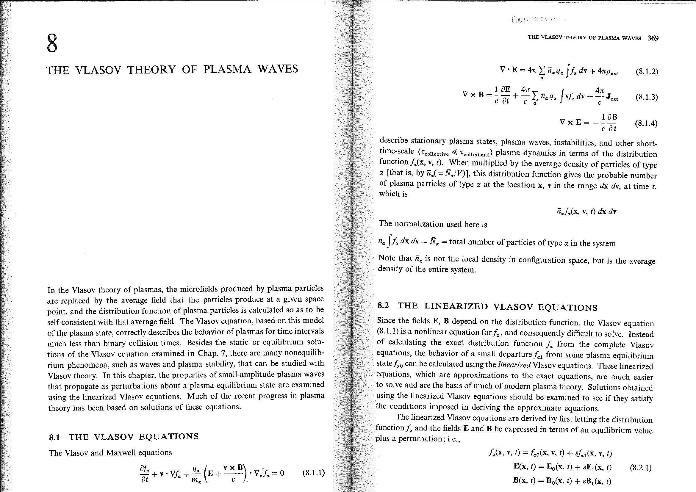
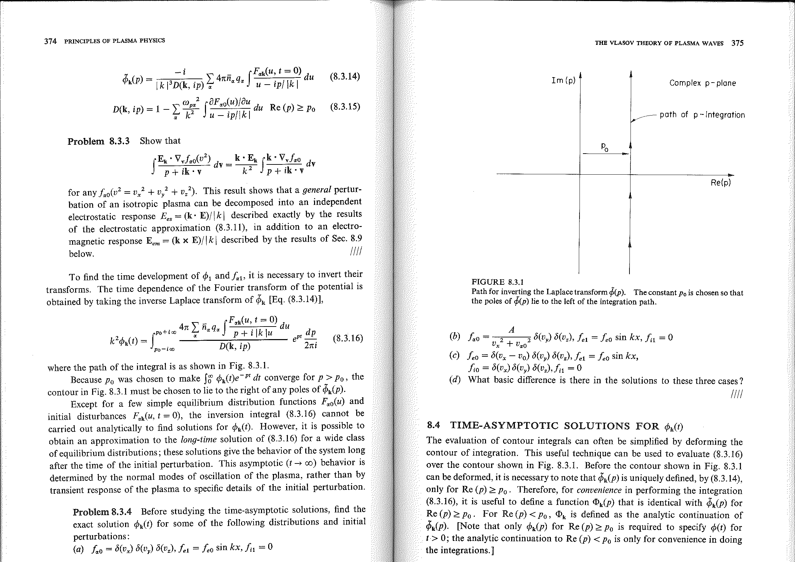


# Part 5 - Plasma Kinetics, Gyrokinetics, and Waves

*Course: Fluid and Plasma Dynamics, Prof. Maurizio Giacomin*  
*Index: [Fluid_and_Plasma_Dynamics_MOC](../../../04_Atlas/Fluid_and_Plasma_Dynamics_MOC.html) | Exam Guide: [Giacomin_Oral_Exam_Questions_Complete_Guide](./Giacomin_Oral_Exam_Questions_Complete_Guide.html)*  
*Relevant Exam Questions: 15, 16, 17*  

---

## 1. Gyrokinetic Theory: Foundations, Ordering, and 5D Reduction

### 1.1 The Need for Gyrokinetics

The most fundamental kinetic description of a collisionless magnetized plasma is given by the 6-dimensional Vlasov-Maxwell system:
$$\frac{\partial f_s}{\partial t} + \vec{v} \cdot \nabla_{\vec{r}} f_s + \frac{q_s}{m_s}(\vec{E} + \vec{v} \times \vec{B}) \cdot \nabla_{\vec{v}} f_s = 0$$
where $f_s(\vec{r}, \vec{v}, t)$ is the distribution function of species $s$ in 3 spatial and 3 velocity coordinates.

In magnetized confinement devices (tokamaks, stellarators) and astrophysical environments (solar wind, accretion flows), two disparate physical scales coexist:
1. **Microscopic cyclotron gyration**: Charged particles gyrate around field lines at the cyclotron frequency $\Omega_{ci} \sim 10^8\text{ rad/s}$ with a microscopic Larmor radius $\rho_i \sim 1 - 3\text{ mm}$.
2. **Macroscopic plasma evolution**: Background equilibrium profiles vary over machine scales $L \sim 1 - 3\text{ m}$, while turbulent fluctuations driving anomalous transport operate at low frequencies $\omega \ll \Omega_{ci}$.

Direct numerical simulations of the full 6D Vlasov equation require resolving the fastest timescale ($\Delta t < 1/\Omega_{ci}$) and the smallest gyroradius across the entire reactor volume for transport durations ($\tau_E \sim 1\text{ s} \sim 10^8 \Omega_{ci}^{-1}$), which is computationally unfeasible.

**Gyrokinetic theory** resolves this impasse: by analytically averaging over the fast, unperturbed cyclotron gyration (the gyro-angle $\theta$), it eliminates the cyclotron timescale entirely and reduces the phase space dimensionality **from 6D to 5D** ($\vec{R}, v_\parallel, \mu, t$).

### 1.2 The Gyrokinetic Ordering

The gyrokinetic framework is based on an asymptotic expansion in the small dimensionless parameter:
$$\epsilon \equiv \frac{\rho_i}{L} \ll 1$$
where $\rho_i = v_{th,i}/\Omega_{ci}$ is the ion Larmor radius and $L = |\nabla \ln n_0|^{-1}$ is the equilibrium gradient scale length.

The fundamental gyrokinetic ordering assumptions are:
1. **Low-frequency fluctuations**: The characteristic frequency of turbulent drift waves is much smaller than the ion cyclotron frequency:
$$\frac{\omega}{\Omega_{ci}} \sim \epsilon \ll 1$$
2. **Spatial anisotropy**: Turbulence is strongly elongated along the equilibrium magnetic field lines, having short perpendicular wavelengths and long parallel wavelengths:
$$\frac{k_\parallel}{k_\perp} \sim \epsilon \ll 1$$
3. **Drift-scale perpendicular wavelength**: The perpendicular wavelength of fluctuations is comparable to the ion gyroradius:
$$k_\perp \rho_i \sim 1$$
4. **Small fluctuation amplitudes (local ordering)**: Perturbations are small compared to background equilibrium profiles:
$$\frac{\delta n}{n_0} \sim \frac{e\delta \phi}{T_e} \sim \frac{\delta f}{F_0} \sim \frac{\delta B}{B_0} \sim \epsilon$$

### 1.3 Gyrocenter Transformation and the Gyro-Average

The instantaneous particle position $\vec{r}$ is decomposed into the **gyrocenter position** $\vec{R}$ and the rotating gyration vector $\vec{\rho}_L$:
$$\vec{r} = \vec{R} + \vec{\rho}_L(\theta), \quad \vec{\rho}_L(\theta) = \frac{\hat{b} \times \vec{v}_\perp}{\Omega_c}$$
where $\theta$ is the gyro-angle.

```
       z (Equilibrium field B_0)
       ^
       |                Particle r = R + rho_L(theta)
       |                   *
       |                 .' '.
       |                /  |  \
       |               |   o   |  Gyrocenter R
       |                \  |  /
       |                 '. .'
       |                   *   Ring average <...>_R
       +-----------------------> x, y
```

The particle velocity is parametrized by parallel velocity $v_\parallel = \vec{v} \cdot \hat{b}$, magnetic moment $\mu = \frac{m v_\perp^2}{2 B_0}$, and gyro-angle $\theta$. In these coordinates, the particle acts as a **charged ring** of radius $\rho_L = \sqrt{2\mu / (m \Omega_c)}$.

The **gyro-average operator** $\langle \dots \rangle_{\vec{R}}$ averages any fluctuating quantity $A(\vec{r}, t)$ over the fast gyration circle at fixed gyrocenter $\vec{R}$:
$$\langle A(\vec{r}, t) \rangle_{\vec{R}} = \frac{1}{2\pi} \oint_0^{2\pi} A(\vec{R} + \vec{\rho}_L(\theta), t) \, d\theta$$

In Fourier space, representing the field as $A(\vec{r}) = \sum_{\vec{k}} \hat{A}(\vec{k}) e^{i \vec{k} \cdot \vec{r}}$:
$$\langle e^{i \vec{k} \cdot \vec{r}} \rangle_{\vec{R}} = e^{i \vec{k} \cdot \vec{R}} \frac{1}{2\pi} \int_0^{2\pi} e^{i \vec{k}_\perp \cdot \vec{\rho}_L(\theta)} \, d\theta = J_0(k_\perp \rho_L) \, e^{i \vec{k} \cdot \vec{R}}$$
where $J_0$ is the zeroth-order Bessel function of the first kind.

**Physical significance**: For macroscopic scales ($k_\perp \rho_L \ll 1$), $J_0 \approx 1$, and the particle feels the local electric field at $\vec{R}$. At micro-scales ($k_\perp \rho_L \sim 1$), $J_0 < 1$: the gyro-average damps short-wavelength fluctuations. This is the **Finite Larmor Radius (FLR) effect**.

The gyrocenter equation of motion is:
$$\frac{d\vec{R}}{dt} = v_\parallel \hat{b} + \vec{v}_{E}^{ring} + \vec{v}_{\nabla B} + \vec{v}_c$$
where $\vec{v}_E^{ring} = -\frac{\nabla_{\vec{R}} \langle \phi \rangle_{\vec{R}} \times \hat{b}}{B_0}$ is the ring-averaged $E \times B$ drift.

The resulting **gyrokinetic equation** for the non-adiabatic distribution $h_s(\vec{R}, v_\parallel, \mu, t)$ is:
$$\frac{\partial h_s}{\partial t} + \left( v_\parallel \hat{b} + \vec{v}_{D,s} + \vec{v}_{E,s}^{ring} \right) \cdot \nabla_{\vec{R}} h_s - \langle C(h_s) \rangle_{\vec{R}} = -\frac{q_s F_{0s}}{T_{0s}} \frac{\partial \langle \chi \rangle_{\vec{R}}}{\partial t} - \vec{v}_{E,s}^{ring} \cdot \nabla_{\vec{R}} F_{0s}$$

Gyrokinetic codes (such as **GENE**, **GYRO**, and **GS2**) solve this 5D system, accurately modeling core tokamak turbulence and anomalous heat transport.

---

## 2. Landau Damping

### 2.1 The Vlasov-Poisson Initial Value Problem

Consider a 1D, unmagnetized, collisionless electron plasma with a neutral background of stationary ions ($n_i = n_0$). The governing equations are the 1D Vlasov and Poisson equations:
$$\frac{\partial f}{\partial t} + v \frac{\partial f}{\partial x} - \frac{e E}{m} \frac{\partial f}{\partial v} = 0$$
$$\frac{\partial E}{\partial x} = -\frac{e}{\epsilon_0} \left( \int_{-\infty}^\infty f(x, v, t) \, dv - n_0 \right)$$

Linearizing around an equilibrium distribution $f_0(v)$ with small perturbations $f = f_0(v) + f_1(x, v, t)$ and $E = E_1(x, t)$:
$$\frac{\partial f_1}{\partial t} + v \frac{\partial f_1}{\partial x} - \frac{e E_1}{m} f_0'(v) = 0$$
$$\frac{\partial E_1}{\partial x} = -\frac{e}{\epsilon_0} \int_{-\infty}^\infty f_1(x, v, t) \, dv$$
where $f_0'(v) \equiv \frac{df_0}{dv}$.

Taking the spatial Fourier transform ($f_1(x, v, t) = \hat{f}_1(k, v, t) e^{ikx}$):
$$\frac{\partial \hat{f}_1}{\partial t} + i k v \hat{f}_1 - \frac{e \hat{E}_1}{m} f_0'(v) = 0$$
$$i k \hat{E}_1 = -\frac{e}{\epsilon_0} \int_{-\infty}^\infty \hat{f}_1(k, v, t) \, dv$$

Because this is an initial value problem, we apply the **Laplace transform** in time ($\text{Re}(s) > 0$):
$$\tilde{f}_1(k, v, s) = \int_0^\infty \hat{f}_1(k, v, t) \, e^{-st} \, dt$$

The transformed Vlasov equation becomes:
$$s \tilde{f}_1 - \hat{f}_1(k, v, 0) + i k v \tilde{f}_1 - \frac{e \tilde{E}_1}{m} f_0'(v) = 0$$

Solving algebraically for $\tilde{f}_1$:
$$\tilde{f}_1(k, v, s) = \frac{\hat{f}_1(k, v, 0)}{s + i k v} + \frac{e \tilde{E}_1(s)}{m} \frac{f_0'(v)}{s + i k v}$$

Substituting this expression into the Laplace-transformed Poisson equation $i k \tilde{E}_1(s) = -\frac{e}{\epsilon_0} \int_{-\infty}^\infty \tilde{f}_1 \, dv$:
$$i k \tilde{E}_1(s) \left[ 1 + \frac{e^2}{\epsilon_0 m k} \int_{-\infty}^\infty \frac{f_0'(v)}{k v - i s} \, dv \right] = -\frac{e}{\epsilon_0} \int_{-\infty}^\infty \frac{\hat{f}_1(k, v, 0)}{s + i k v} \, dv$$

Defining $s = -i \omega$, the plasma **dielectric function** is:
$$D(k, \omega) = 1 - \frac{\omega_p^2}{k^2} \int_C \frac{f_0'(v)}{v - \omega/k} \, dv$$
where $\omega_p = \sqrt{\frac{n_0 e^2}{\epsilon_0 m}}$ is the electron plasma frequency.

### 2.2 The Landau Contour and Analytic Continuation

When inverting the Laplace transform via Bromwich contour integration:
$$E_1(t) = \frac{1}{2\pi i} \int_{\sigma - i\infty}^{\sigma + i\infty} \tilde{E}_1(s) \, e^{st} \, ds$$
the integration path must lie to the right of all singularities ($\sigma > 0$). To evaluate the long-term behavior ($t \to \infty$), the path must be analytically continued into the left half-plane ($\text{Re}(s) < 0$, or $\text{Im}(\omega) < 0$).

Lev Landau (1946) established that the velocity integration path $C$ must be deformed:
- If $\text{Im}(\omega) > 0$ (growing mode), the pole $v_0 = \omega/k$ lies in the upper complex $v$-plane, and $C$ is simply the real axis.
- If $\text{Im}(\omega) = 0$ (neutral mode), the pole lies on the real axis, requiring the Cauchy principal value and a half-residue.
- If $\text{Im}(\omega) < 0$ (damped mode), the pole dips into the lower half-plane. To maintain analytic continuity, the contour $C$ must be indented downward so the pole **always remains above the contour**.

```
Complex v-plane
          Im(v)
            ^
            |
  ----------+---------------------> Re(v)
            |      x  Pole: v = omega/k  (Im(omega) < 0)
    __      |     /
   /  \     |    /
--+    +----+---+-----------------> Landau Contour C
        \______/
```

Applying the Sokhotski-Plemelj formula:
$$\int_C \frac{f_0'(v)}{v - \omega/k} \, dv = \mathcal{P} \int_{-\infty}^\infty \frac{f_0'(v)}{v - \omega/k} \, dv + i \pi f_0'\left( \frac{\omega}{k} \right)$$

The dielectric function splits into real and imaginary parts: $D(k, \omega) = D_r(k, \omega) + i D_i(k, \omega)$:
$$D_r(k, \omega) = 1 - \frac{\omega_p^2}{k^2} \mathcal{P} \int_{-\infty}^\infty \frac{f_0'(v)}{v - \omega/k} \, dv$$
$$D_i(k, \omega) = -\pi \frac{\omega_p^2}{k^2} f_0'\left( \frac{\omega}{k} \right)$$

### 2.3 Derivation of the Damping Rate

Writing the complex root as $\omega = \omega_r + i \gamma_L$, with $|\gamma_L| \ll |\omega_r|$:
$$D(k, \omega_r + i \gamma_L) \approx D_r(k, \omega_r) + i \gamma_L \frac{\partial D_r}{\partial \omega_r} + i D_i(k, \omega_r) = 0$$

Separating real and imaginary parts:
1. Real part: $D_r(k, \omega_r) = 0$. For high phase velocities ($\omega/k \gg v_{th}$):
$$D_r \approx 1 - \frac{\omega_p^2}{\omega_r^2} - 3 \frac{k^2 v_{th}^2 \omega_p^2}{\omega_r^4} = 0 \implies \omega_r^2 \approx \omega_p^2 + 3 k^2 v_{th}^2$$
recovering the **Bohm-Gross dispersion relation** for Langmuir waves.
2. Imaginary part:
$$\gamma_L = -\frac{D_i(k, \omega_r)}{\partial D_r / \partial \omega_r}$$

Evaluating $\frac{\partial D_r}{\partial \omega_r} \approx \frac{2\omega_p^2}{\omega_r^3} \approx \frac{2}{\omega_p}$:
$$\gamma_L = \frac{\pi \omega_p^3}{2 k^2} f_0'\left( \frac{\omega_r}{k} \right)$$

For a standard 1D Maxwellian distribution $f_0(v) = \frac{1}{\sqrt{2\pi} v_{th}} \exp\left( -\frac{v^2}{2 v_{th}^2} \right)$:
$$f_0'\left( \frac{\omega_r}{k} \right) = -\frac{\omega_r}{k v_{th}^2} f_0\left( \frac{\omega_r}{k} \right) < 0$$

Because the slope of a Maxwellian is strictly negative at positive velocities:
$$\gamma_L = -\sqrt{\frac{\pi}{8}} \frac{\omega_p}{(k \lambda_D)^3} \exp\left( -\frac{1}{2 k^2 \lambda_D^2} - \frac{3}{2} \right) < 0$$

The wave amplitude decays exponentially: $E_1(t) \propto e^{-|\gamma_L| t}$. This is **Landau damping**.

### 2.4 Physical Mechanism: Wave-Particle Resonance

Landau damping is a collisionless phenomenon arising from the resonant energy exchange between the wave electric field and particles moving at nearly the wave phase velocity:
$$v \approx v_{ph} = \frac{\omega_r}{k}$$

- **Slightly slower particles ($v \lesssim v_{ph}$)**: In the wave frame, they are overtaken by the wave potential well. The electric field accelerates them forward, giving them kinetic energy at the expense of the wave.
- **Slightly faster particles ($v \gtrsim v_{ph}$)**: They overtake the wave potential well. The electric field exerts a retarding force, decelerating them and transferring their kinetic energy into the wave.

In a thermal Maxwellian plasma, the distribution function decreases monotonically with speed ($\frac{df_0}{dv} < 0$). There are always more particles moving slightly slower than $v_{ph}$ than particles moving slightly faster.
The net energy flow is from the wave to the resonant particles: the wave loses energy and dampens without any collisions.

---

## 3. Waves in Magnetized Cold Plasmas

### 3.1 Dielectric Tensor Formalism

In the cold plasma approximation ($T_e = T_i = 0$), thermal pressure gradients are neglected ($\nabla p = 0$). Consider a uniform background magnetic field $\vec{B}_0 = B_0 \hat{z}$.

The linearized fluid momentum equation for species $s$ is:
$$-i \omega m_s \vec{v}_{1s} = q_s (\vec{E}_1 + \vec{v}_{1s} \times \vec{B}_0)$$

Solving for velocity components in Cartesian coordinates:
$$v_{xs} = \frac{i q_s}{m_s(\omega^2 - \Omega_s^2)} (\omega E_x + i \Omega_s E_y)$$
$$v_{ys} = \frac{i q_s}{m_s(\omega^2 - \Omega_s^2)} (-i \Omega_s E_x + \omega E_y)$$
$$v_{zs} = \frac{i q_s}{m_s \omega} E_z$$
where $\Omega_s = \frac{q_s B_0}{m_s}$ is the signed cyclotron frequency.

The current density perturbation is $\vec{j}_1 = \sum_s n_{0s} q_s \vec{v}_{1s}$.
Substituting into Maxwell's curl equations ($\vec{k} \times (\vec{k} \times \vec{E}_1) + \frac{\omega^2}{c^2} \mathbf{K} \cdot \vec{E}_1 = 0$), the **dielectric tensor** $\mathbf{K}$ in Stix notation is:
$$\mathbf{K} = \begin{pmatrix} S & -i D & 0 \\ i D & S & 0 \\ 0 & 0 & P \end{pmatrix}$$
where:
$$R = 1 - \sum_s \frac{\omega_{ps}^2}{\omega(\omega + \Omega_s)}, \quad L = 1 - \sum_s \frac{\omega_{ps}^2}{\omega(\omega - \Omega_s)}, \quad P = 1 - \sum_s \frac{\omega_{ps}^2}{\omega^2}$$
$$S = \frac{1}{2}(R + L), \quad D = \frac{1}{2}(R - L)$$

Defining the refractive index vector $\vec{n} = \frac{c \vec{k}}{\omega} = n (\sin\theta \hat{x} + \cos\theta \hat{z})$, the wave equation becomes:
$$\begin{pmatrix} S - n^2 \cos^2\theta & -i D & n^2 \sin\theta \cos\theta \\ i D & S - n^2 & 0 \\ n^2 \sin\theta \cos\theta & 0 & P - n^2 \sin^2\theta \end{pmatrix} \begin{pmatrix} E_x \\ E_y \\ E_z \end{pmatrix} = 0$$

Setting the determinant to zero yields the **Appleton-Hartree dispersion relation**:
$$\tan^2\theta = -\frac{P(n^2 - R)(n^2 - L)}{(S n^2 - R L)(n^2 - P)}$$

### 3.2 Propagation Parallel to $\vec{B}_0$ ($\theta = 0$)

When wave propagation is parallel to the magnetic field:
$$(n^2 - P)[(S - n^2)^2 - D^2] = 0 \implies (n^2 - P)(n^2 - R)(n^2 - L) = 0$$

1. **Plasma Oscillations ($n^2 = P = 0$)**: $\omega = \omega_p$, purely longitudinal electrostatic oscillations ($E_z \neq 0, E_x = E_y = 0$).
2. **Right Circularly Polarized Wave (R-mode)**:
$$n_R^2 = R = 1 - \frac{\omega_{pe}^2}{\omega(\omega - \Omega_{ce})}$$
The electric field rotates in the right-hand sense (the direction of electron gyration). It exhibits a resonance ($n^2 \to \infty$) at the electron cyclotron frequency $\omega = \Omega_{ce}$. Below $\Omega_{ce}$, it propagates as low-frequency **whistler waves**.
3. **Left Circularly Polarized Wave (L-mode)**:
$$n_L^2 = L = 1 - \frac{\omega_{pe}^2}{\omega(\omega + \Omega_{ce})}$$
The electric field rotates in the direction of ion gyration, resonating at the ion cyclotron frequency $\omega = \Omega_{ci}$.

**Faraday Rotation**:
Because $n_R \neq n_L$, a linearly polarized radio wave (decomposed into equal R and L components) rotates its plane of polarization as it traverses a magnetized plasma by an angle $\Delta \psi$:
$$\Delta \psi = \frac{\omega}{2c} \int (n_L - n_R) \, ds \approx \frac{e^3}{2\epsilon_0 m_e^2 c \omega^2} \int n_e B_\parallel \, ds \equiv \text{RM} \cdot \lambda^2$$
where $\text{RM}$ is the Rotation Measure, widely used in radio astronomy to measure interstellar and intergalactic magnetic fields.

### 3.3 Propagation Perpendicular to $\vec{B}_0$ ($\theta = \pi/2$)

1. **Ordinary Mode (O-mode)**:
$$n_O^2 = P = 1 - \frac{\omega_{pe}^2}{\omega^2}$$
The wave electric field is parallel to $\vec{B}_0$ ($\vec{E}_1 = E_z \hat{z}$). The magnetic field exerts no Lorentz force on parallel electron motion. The O-mode behaves identically to an unmagnetized electromagnetic wave with cutoff at $\omega = \omega_{pe}$.
2. **Extraordinary Mode (X-mode)**:
$$n_X^2 = \frac{R L}{S} = 1 - \frac{\omega_{pe}^2}{\omega^2} \frac{\omega^2 - \omega_{pe}^2}{\omega^2 - \omega_{UH}^2}$$
The electric field is perpendicular to $\vec{B}_0$ ($\vec{E}_1 \perp \vec{B}_0$). The wave exhibits a resonance ($S = 0$) at the **Upper Hybrid frequency**:
$$\omega_{UH} = \sqrt{\omega_{pe}^2 + \Omega_{ce}^2}$$
and cutoffs ($n^2 = 0$) at $\omega = \omega_R$ and $\omega = \omega_L$.


## Lecture Visuals & Landau Damping


*Figure FPD-06: Landau contour integration in the complex velocity plane. Deforming the integration contour around the pole at $v = \omega/k$ rigorously resolves collisionless Landau damping for electrostatic Langmuir waves.*


*Figure FPD-07: Microscopic physical mechanism of Landau damping: resonant particles with velocity $v \approx v_\phi = \omega/k$ exchange net energy with the wave. Since $\left.\frac{\partial f_0}{\partial v}\right|_{v_\phi} < 0$ in a Maxwellian, more particles move slightly slower than the wave and absorb energy, causing the wave amplitude to damp exponentially.*


<div class="backlinks-section">
  <h4 class="backlinks-title">Linked References (6)</h4>
  <ul class="backlinks-list">
    <li class="backlink-item-wrap"><a href="../../../03_Zettel/Theory/Cold%20plasma%20dielectric%20tensor%20and%20Appleton-Hartree%20dispersion.html" class="backlink-item">Cold plasma dielectric tensor and Appleton-Hartree dispersion</a></li>
    <li class="backlink-item-wrap"><a href="../../../03_Zettel/Theory/Collisionless%20Landau%20damping%20and%20wave-particle%20resonance.html" class="backlink-item">Collisionless Landau damping and wave-particle resonance</a></li>
    <li class="backlink-item-wrap"><a href="./Course_Overview_and_Syllabus.html" class="backlink-item">Course_Overview_and_Syllabus</a></li>
    <li class="backlink-item-wrap"><a href="../../../04_Atlas/Fluid_and_Plasma_Dynamics_MOC.html" class="backlink-item">Fluid_and_Plasma_Dynamics_MOC</a></li>
    <li class="backlink-item-wrap"><a href="./Giacomin_Oral_Exam_Questions_Complete_Guide.html" class="backlink-item">Giacomin_Oral_Exam_Questions_Complete_Guide</a></li>
    <li class="backlink-item-wrap"><a href="../../../03_Zettel/Theory/Gyrokinetic%20ordering%20and%205D%20phase%20space%20reduction.html" class="backlink-item">Gyrokinetic ordering and 5D phase space reduction</a></li>
  </ul>
</div>
