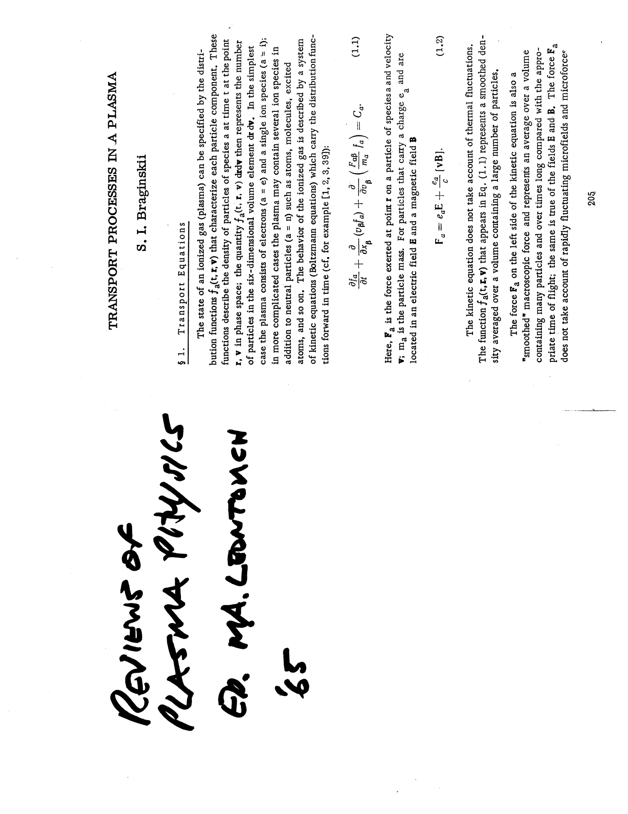
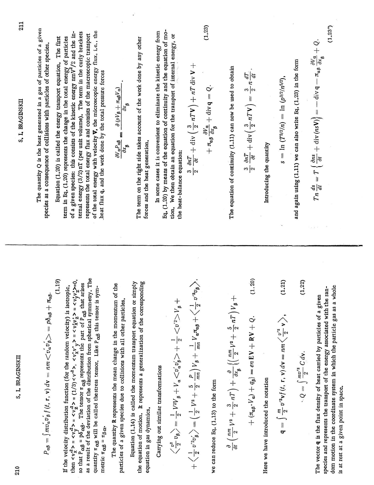
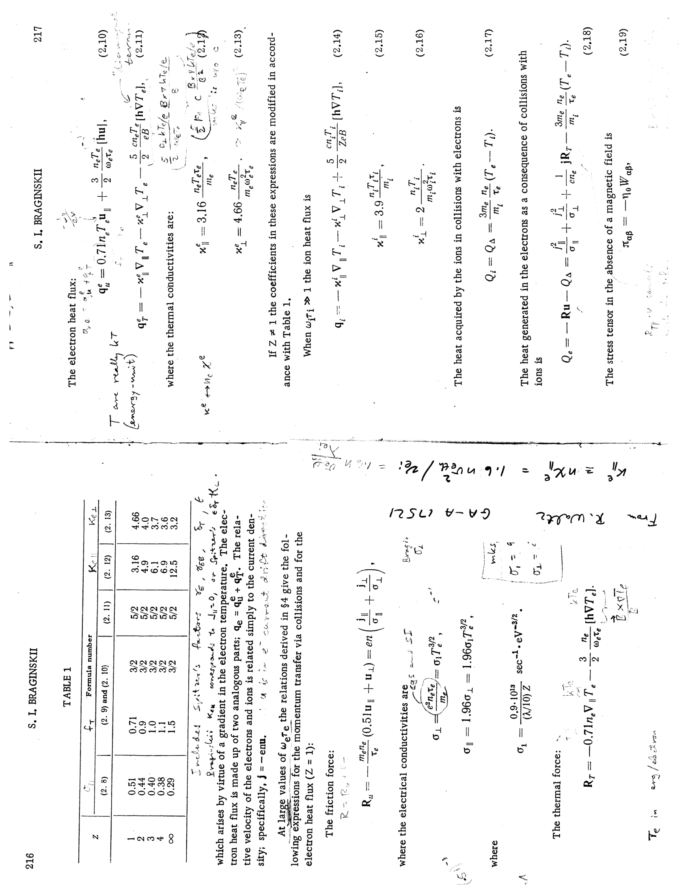


# Part 6 - Two-Fluid Theory, Transport, and Microinstabilities

*Course: Fluid and Plasma Dynamics, Prof. Maurizio Giacomin*  
*Index: [Fluid_and_Plasma_Dynamics_MOC](../../../04_Atlas/Fluid_and_Plasma_Dynamics_MOC.html) | Exam Guide: [Giacomin_Oral_Exam_Questions_Complete_Guide](./Giacomin_Oral_Exam_Questions_Complete_Guide.html)*  
*Relevant Exam Questions: 18, 19, 20, 21*  

---

## 1. The Braginskii Two-Fluid Transport Model

### 1.1 Physical Foundations and Moment Closures

When a plasma is sufficiently collisional (the collision frequency $\nu_{coll}$ is larger than the dynamical frequency $\omega$, or collisional mean free path $\lambda_{mfp} \ll L$), the macroscopic dynamics is accurately described by the two-fluid transport equations formulated by Stanislav I. Braginskii (1965).

Braginskii solved the coupled Fokker-Planck equations for electrons and ions using the Landau collision operator through a Chapman-Enskog polynomial expansion. The resulting system yields separate conservation equations for electrons ($s = e$) and singly-charged ions ($s = i$):
1. **Continuity equations**:
$$\frac{\partial n_e}{\partial t} + \nabla \cdot (n_e \vec{v}_e) = 0, \quad \frac{\partial n_i}{\partial t} + \nabla \cdot (n_i \vec{v}_i) = 0$$
Due to quasi-neutrality, $n_e \approx n_i \equiv n$.
2. **Momentum equations**:
$$m_e n \left[ \frac{\partial \vec{v}_e}{\partial t} + (\vec{v}_e \cdot \nabla)\vec{v}_e \right] = -e n (\vec{E} + \vec{v}_e \times \vec{B}) - \nabla p_e - \nabla \cdot \mathbf{\Pi}_e + \vec{R}_{ei}$$
$$m_i n \left[ \frac{\partial \vec{v}_i}{\partial t} + (\vec{v}_i \cdot \nabla)\vec{v}_i \right] = +e n (\vec{E} + \vec{v}_i \times \vec{B}) - \nabla p_i - \nabla \cdot \mathbf{\Pi}_i - \vec{R}_{ei}$$
where $p_s = n k_B T_s$ is the scalar thermal pressure, $\mathbf{\Pi}_s$ is the traceless viscous stress tensor, and $\vec{R}_{ei}$ is the collisional momentum exchange (frictional force) exerted by ions on electrons.
3. **Thermal energy equations**:
$$\frac{3}{2} n \left( \frac{\partial T_s}{\partial t} + \vec{v}_s \cdot \nabla T_s \right) + p_s \nabla \cdot \vec{v}_s = -\nabla \cdot \vec{q}_s - \mathbf{\Pi}_s : \nabla \vec{v}_s + Q_s$$
where $\vec{q}_s$ is the heat flux vector, and $Q_s$ represents inter-species collisional heat exchange and Joule dissipation.

### 1.2 The Inter-Species Collision Force: Friction and Thermal Force

The total momentum exchange $\vec{R}_{ei}$ consists of two physically distinct components:
$$\vec{R}_{ei} = \vec{R}_u + \vec{R}_T$$

1. **Relative velocity friction force ($\vec{R}_u$)**:
Arises from the relative drift between electrons and ions carrying current density $\vec{j} = -e n (\vec{v}_e - \vec{v}_i)$:
$$\vec{R}_u = \frac{e n}{\sigma_\parallel} j_\parallel \hat{b} + \frac{e n}{\sigma_\perp} \vec{j}_\perp$$
where $\hat{b} = \vec{B}/B$ is the unit vector along field lines. The electrical conductivities are:
$$\sigma_\parallel = 1.96 \frac{n e^2 \tau_e}{m_e}, \quad \sigma_\perp = \frac{\sigma_\parallel}{1.96} = \frac{n e^2 \tau_e}{m_e}$$
where $\tau_e$ is the electron-ion collision time:
$$\tau_e = \frac{3 \sqrt{m_e} (k_B T_e)^{3/2}}{4 \sqrt{2\pi} n \ln\Lambda \, e^4}$$

The electrical resistivity is $\eta = 1/\sigma$.
**Crucial physical property**: $\tau_e \propto T_e^{3/2} \implies \eta \propto T_e^{-3/2}$. This is the **Spitzer resistivity**. As a plasma heats up, Coulomb collisions become less effective because the Coulomb Rutherford scattering cross-section drops as $\sigma_C \propto 1/v^4$. Consequently, high-temperature fusion and astrophysical plasmas become nearly perfect conductors.

2. **Thermal force ($\vec{R}_T$)**:
Arises in the presence of temperature gradients $\nabla T_e$, even when relative velocity is zero:
$$\vec{R}_T = -0.71 n \nabla_\parallel T_e - \frac{3}{2} \frac{n}{\Omega_{ce} \tau_e} (\hat{b} \times \nabla T_e)$$

**Physical origin**: The collision frequency scales as $\nu_{ei} \propto v^{-3} \propto T_e^{-3/2}$. Electrons arriving at a given point from a hotter adjacent region have higher thermal speeds and collide less frequently than electrons arriving from a colder region. This statistical imbalance produces a net momentum transfer directed toward the colder region, which means electrons feel an effective reaction force pushing them **toward the hotter region**.

### 1.3 Thermal Conductivities and Strong Anisotropy

Heat flux is governed by parallel and perpendicular thermal conductivities:
$$\vec{q}_e = -\kappa_{\parallel e} \nabla_\parallel T_e - \kappa_{\perp e} \nabla_\perp T_e - \frac{5}{2} \frac{n k_B T_e}{e B} (\hat{b} \times \nabla T_e)$$
$$\kappa_{\parallel e} = 3.16 \frac{n k_B T_e \tau_e}{m_e}, \quad \kappa_{\perp e} = 4.66 \frac{n k_B T_e}{m_e \Omega_{ce}^2 \tau_e}$$

In magnetized plasmas, the parameter $\Omega_{ce} \tau_e \gg 1$ (electrons execute millions of gyro-orbits between collisions):
$$\frac{\kappa_{\parallel e}}{\kappa_{\perp e}} \approx 0.68 (\Omega_{ce} \tau_e)^2 \sim 10^{10} - 10^{12}$$

Heat conducts almost instantaneously along magnetic field lines, making magnetic flux surfaces virtually isothermal, while thermal transport across field lines is suppressed by magnetic confinement.

---

## 2. The Drift-Reduced Braginskii Model

### 2.1 Low-Frequency Ordering and Drift Velocities

In tokamak boundary regions and stellarators, turbulence frequencies satisfy $\omega / \Omega_{ci} \ll 1$ and parallel wavelengths are long ($k_\parallel \ll k_\perp$).
In this **drift-reduced regime**, perpendicular fluid velocities are determined algebraically by guiding-center drifts:
$$\vec{v}_{\perp s} = \vec{v}_E + \vec{v}_{ds} + \vec{v}_{pol,s}$$

1. **$E \times B$ drift**:
$$\vec{v}_E = -\frac{\nabla \phi \times \hat{b}}{B}$$
2. **Diamagnetic drift**:
$$\vec{v}_{ds} = \frac{\hat{b} \times \nabla p_s}{q_s n B}$$
3. **Ion polarization drift**:
$$\vec{v}_{pol,i} = \frac{1}{\Omega_{ci} B} \frac{d\vec{E}_\perp}{dt} \approx -\frac{1}{\Omega_{ci} B} \left( \frac{\partial}{\partial t} + \vec{v}_E \cdot \nabla \right) \nabla_\perp \phi$$
Electron polarization drift is smaller by the mass ratio $m_e/m_i \ll 1$ and neglected.

### 2.2 Derivation of the Vorticity Equation

The fundamental dynamical equation governing the electrostatic potential $\phi$ is obtained from the charge conservation condition:
$$\nabla \cdot \vec{j} = 0 \implies \nabla_\perp \cdot \vec{j}_\perp + \nabla_\parallel j_\parallel = 0$$

The perpendicular current density is:
$$\vec{j}_\perp = e n (\vec{v}_{\perp i} - \vec{v}_{\perp e}) = \vec{j}_{dia} + \vec{j}_{pol}$$
where the $E \times B$ current vanishes because electrons and ions drift identically.

1. **Diamagnetic current divergence**:
$$\vec{j}_{dia} = e n (\vec{v}_{di} - \vec{v}_{de}) = \frac{\hat{b} \times \nabla p}{B}, \quad p = p_e + p_i$$
Taking the divergence in a curved magnetic field where $\nabla \times (\hat{b}/B) \approx \frac{2}{B R} \hat{z}$:
$$\nabla \cdot \vec{j}_{dia} = \nabla \cdot \left( \frac{\hat{b} \times \nabla p}{B} \right) = \nabla p \cdot \left( \nabla \times \frac{\hat{b}}{B} \right) \approx -2 \mathcal{C}(p)$$
where $\mathcal{C}(p) = \frac{\hat{b} \times \vec{\kappa}}{B} \cdot \nabla p$ is the **magnetic curvature operator** ($\vec{\kappa} = (\hat{b} \cdot \nabla)\hat{b}$).

2. **Ion polarization current divergence**:
$$\vec{j}_{pol} = e n \vec{v}_{pol,i} = -\frac{e n}{\Omega_{ci} B} \frac{d}{dt}\nabla_\perp \phi = -\frac{\rho}{B^2} \frac{d}{dt}\nabla_\perp \phi$$
Taking the divergence:
$$\nabla_\perp \cdot \vec{j}_{pol} = -\frac{\rho}{B^2} \frac{d}{dt} \nabla_\perp^2 \phi \equiv \frac{\rho}{B^2} \frac{d\varpi}{dt}$$
where $\varpi = \nabla_\perp^2 \phi$ is the **electrostatic vorticity**.

Substituting these divergences into $\nabla \cdot \vec{j} = 0$:
$$\frac{\rho}{B^2} \frac{d}{dt}\nabla_\perp^2 \phi = \nabla_\parallel j_\parallel - 2 \mathcal{C}(p)$$

This is the **drift-reduced vorticity equation**. It shows that vorticity is driven by the divergence of parallel current and magnetic curvature acting on pressure gradients.

### 2.3 Derivation of the Generalized Ohm's Law

Projecting the electron momentum equation along the magnetic field $\hat{b}$:
$$m_e n \frac{d v_{\parallel e}}{dt} = -e n E_\parallel - \nabla_\parallel p_e + R_{\parallel ei}$$

Neglecting electron inertia ($m_e \to 0$):
$$0 = -e n \left( -\nabla_\parallel \phi - \frac{\partial A_\parallel}{\partial t} \right) - \nabla_\parallel p_e + e n \eta_\parallel j_\parallel$$

Solving for parallel current $j_\parallel$:
$$\eta_\parallel j_\parallel = -\nabla_\parallel \phi - \frac{\partial A_\parallel}{\partial t} + \frac{1}{e n} \nabla_\parallel p_e$$

In the electrostatic limit ($\partial A_\parallel / \partial t \approx 0$):
$$j_\parallel = \frac{1}{\eta_\parallel} \left( -\nabla_\parallel \phi + \frac{k_B T_e}{e n} \nabla_\parallel n \right)$$

This generalized Ohm's law balances electrostatic parallel forces, electron pressure gradients, and resistive dissipation.

---

## 3. The Resistive Ballooning Mode (RBM)

### 3.1 Physical Mechanism in the Bad Curvature Region

In toroidal confinement devices, magnetic field lines curve around the torus. 
- On the **outboard side** (low-field equator, $\theta = 0$), the magnetic curvature vector $\vec{\kappa}$ points toward the plasma core, parallel to the pressure gradient $\nabla p$. This is the **bad curvature region**, mathematically analogous to a heavy fluid supported against gravity (Rayleigh-Taylor instability).
- On the **inboard side** ($\theta = \pi$), $\vec{\kappa}$ opposes $\nabla p$, providing **good curvature** (stabilizing).

Because magnetic field lines connect good and bad curvature regions, ideal MHD modes balloon preferentially on the outboard side. When finite resistivity $\eta_\parallel$ is included, electrons cannot short-circuit charge separation along field lines, destabilizing the **resistive ballooning mode (RBM)**.

```
                  Outboard (Low Field Side)
                      Bad Curvature
                    grad(p) || kappa
                   +----------------+
                   |                |
                   |   (====)       |  Perturbation grows
                   |   (====)       |  ballooned on outboard
                   |                |
                   +----------------+
```

### 3.2 Linear Dispersion Relation

In slab geometry with effective gravity $g_{eff} = 2 c_s^2 / R_0$ representing bad curvature:
1. Linearized vorticity:
$$\frac{\rho_0}{B_0^2} \gamma k_\perp^2 \phi_1 = i k_\parallel j_{\parallel 1} + i k_y \frac{2}{B_0 R_0} p_1$$
2. Linearized Ohm's law:
$$\eta_\parallel j_{\parallel 1} = -i k_\parallel \phi_1$$
3. Linearized pressure equation:
$$\gamma p_1 + \vec{v}_{E1} \cdot \nabla p_0 = 0 \implies \gamma p_1 - i \frac{k_y \phi_1}{B_0} \frac{p_0}{L_p} = 0 \implies p_1 = \frac{i k_y \phi_1}{\gamma B_0} \frac{p_0}{L_p}$$
where $L_p = \lvert \frac{d\ln p_0}{dx}\rvert^{-1}$ is the pressure scale length.

Eliminating $j_{\parallel 1}$ and $p_1$:
$$\frac{\rho_0}{B_0^2} \gamma k_\perp^2 \phi_1 = \frac{k_\parallel^2}{\eta_\parallel} \phi_1 - \frac{2 k_y^2 p_0}{\gamma B_0^2 R_0 L_p} \phi_1$$

Multiplying by $\gamma$:
$$\gamma^2 + \frac{k_\parallel^2 B_0^2}{\eta_\parallel \rho_0 k_\perp^2} \gamma = \frac{2 k_y^2 p_0}{\rho_0 k_\perp^2 R_0 L_p} \equiv \gamma_{MHD}^2$$
where $\gamma_{MHD} = \sqrt{\frac{2 c_s^2}{R_0 L_p}}$ is the ideal MHD ballooning growth rate.

In the strong resistive limit where parallel current is limited by resistivity:
$$\gamma_{RBM} \approx \left( \frac{\eta_\parallel k_y^2 p_0}{\mu_0 B_0^2 L_p R_0} \right)^{1/3}$$

The instability is driven by the pressure gradient and bad curvature, with growth rate scaling as $\eta_\parallel^{1/3}$.

---

## 4. Ambipolar Diffusion in Weakly Ionized Plasmas

### 4.1 Force Balance and the Ambipolar Electric Field

In weakly ionized gases (such as planetary ionospheres, protoplanetary disks, and interstellar clouds), charged particles collide predominantly with stationary neutral gas particles of number density $n_n$.

The momentum equation for species $s$ ($s = e, i$) in steady state without magnetic field is:
$$0 = q_s n_s \vec{E} - \nabla p_s - m_s n_s \nu_{sn} \vec{v}_s$$
where $\nu_{sn}$ is the collision frequency with neutrals.

Solving for the flux $\vec{\Gamma}_s = n_s \vec{v}_s$:
$$\vec{\Gamma}_s = \pm n_s \mu_s \vec{E} - D_s \nabla n_s$$
where the mobility $\mu_s$ and diffusion coefficient $D_s$ are:
$$\mu_s = \frac{\lvert q_s\rvert}{m_s \nu_{sn}}, \quad D_s = \frac{k_B T_s}{m_s \nu_{sn}} = \mu_s \frac{k_B T_s}{e}$$

Because electrons are much lighter than ions ($m_e \ll m_i$), the collision frequency and mobility satisfy:
$$\mu_e \gg \mu_i, \quad D_e \gg D_i$$

Electrons tend to diffuse outward much faster than ions. This charge separation sets up a macroscopic internal electric field: the **ambipolar electric field** $\vec{E}_A$.
$\vec{E}_A$ points outward, retarding the fast electrons and accelerating the slow ions.

### 4.2 Ambipolar Diffusion Coefficient

Under quasi-neutrality ($n_e \approx n_i = n$), conservation of charge requires zero net current:
$$\vec{\Gamma}_e = \vec{\Gamma}_i \equiv \vec{\Gamma}$$

Equating the flux expressions:
$$-n \mu_e \vec{E}_A - D_e \nabla n = n \mu_i \vec{E}_A - D_i \nabla n$$

Solving for the ambipolar electric field:
$$\vec{E}_A = -\frac{D_e - D_i}{\mu_e + \mu_i} \frac{\nabla n}{n}$$

Substituting $\vec{E}_A$ back into the ion flux:
$$\vec{\Gamma} = n \mu_i \left( -\frac{D_e - D_i}{\mu_e + \mu_i} \frac{\nabla n}{n} \right) - D_i \nabla n = -\left( \frac{\mu_i D_e + \mu_e D_i}{\mu_e + \mu_i} \right) \nabla n$$

The net particle flux obeys Fick's law $\vec{\Gamma} = -D_A \nabla n$ with the **ambipolar diffusion coefficient**:
$$D_A = \frac{\mu_i D_e + \mu_e D_i}{\mu_e + \mu_i}$$

Using $\mu_e \gg \mu_i$ and the Einstein relations:
$$D_A \approx D_i + \frac{\mu_i}{\mu_e} D_e = D_i + \mu_i \frac{k_B T_e}{e} = D_i \left( 1 + \frac{T_e}{T_i} \right)$$

For an isothermal plasma ($T_e = T_i$):
$$D_A \approx 2 D_i$$

**Physical interpretation**: The plasma diffuses at roughly twice the rate of the slow ions. The fast electrons pull the ions along via electrostatic coupling, effectively doubling the ion diffusion coefficient.

### 4.3 Diffusion in Strong Magnetic Fields

In the presence of a strong magnetic field $\vec{B}$, particle motion perpendicular to $\vec{B}$ is constrained by cyclotron gyration. The perpendicular mobility and diffusion coefficients are:
$$D_{\perp s} = \frac{D_s}{1 + (\Omega_s / \nu_{sn})^2}, \quad \mu_{\perp s} = \frac{\mu_s}{1 + (\Omega_s / \nu_{sn})^2}$$

In the **strong magnetic field limit** ($\Omega_s \gg \nu_{sn}$):
$$D_{\perp s} \approx D_s \left( \frac{\nu_{sn}}{\Omega_s} \right)^2 = \frac{k_B T_s \nu_{sn}}{m_s \Omega_s^2} = \frac{k_B T_s \nu_{sn} m_s}{q^2 B^2}$$

**Crucial inversion**: In an unmagnetized plasma, electrons diffuse faster ($D_e \propto 1/m_e$). But across a strong magnetic field:
$$D_{\perp i} \propto m_i \gg D_{\perp e} \propto m_e$$

**Ions diffuse across the magnetic field faster than electrons** because ions have much larger Larmor orbits ($\rho_i \gg \rho_e$) and step a full Larmor radius upon each neutral collision.
The ambipolar electric field reverses sign ($\vec{E}_{A\perp}$ points inward, holding ions back and pulling electrons out), and the cross-field ambipolar diffusion coefficient scales as:
$$D_{A\perp} \approx 2 D_{\perp e} \propto \frac{1}{B^2}$$
recovering the classical $1/B^2$ confinement scaling.


## Lecture Visuals & Braginskii Magnetized Transport


*Figure FPD-08: Braginskii transport coefficients in strongly magnetized plasmas ($\omega_c \tau \gg 1$). The parallel heat flux $\mathbf{q}_\parallel = -\kappa_\parallel \nabla_\parallel T$ dominates over perpendicular flux $\mathbf{q}_\perp = -\kappa_\perp \nabla_\perp T$ by a factor $\frac{\kappa_\parallel}{\kappa_\perp} \sim (\omega_c \tau)^2 \gg 1$.*


*Figure FPD-09: Decomposition of the Braginskii stress tensor into parallel, perpendicular, and gyro-viscous (cross-field drift) components $\Pi_{\alpha\beta}$.*


*Figure FPD-10: Cross-field classical diffusion $D_\perp \propto \frac{\rho_L^2}{\tau}$ versus Bohm / anomalous turbulent transport in astrophysical accretion disks and magnetic confinement devices.*


<div class="backlinks-section">
  <h4 class="backlinks-title">Linked References (7)</h4>
  <ul class="backlinks-list">
    <li class="backlink-item-wrap"><a href="../../../03_Zettel/Theory/Ambipolar%20diffusion%20in%20unmagnetized%20and%20magnetized%20plasmas.html" class="backlink-item">Ambipolar diffusion in unmagnetized and magnetized plasmas</a></li>
    <li class="backlink-item-wrap"><a href="../../../03_Zettel/Theory/Braginskii%20collisional%20transport%20and%20Spitzer%20resistivity.html" class="backlink-item">Braginskii collisional transport and Spitzer resistivity</a></li>
    <li class="backlink-item-wrap"><a href="./Course_Overview_and_Syllabus.html" class="backlink-item">Course_Overview_and_Syllabus</a></li>
    <li class="backlink-item-wrap"><a href="../../../03_Zettel/Theory/Drift-reduced%20Braginskii%20equations%20and%20vorticity%20derivation.html" class="backlink-item">Drift-reduced Braginskii equations and vorticity derivation</a></li>
    <li class="backlink-item-wrap"><a href="../../../04_Atlas/Fluid_and_Plasma_Dynamics_MOC.html" class="backlink-item">Fluid_and_Plasma_Dynamics_MOC</a></li>
    <li class="backlink-item-wrap"><a href="./Giacomin_Oral_Exam_Questions_Complete_Guide.html" class="backlink-item">Giacomin_Oral_Exam_Questions_Complete_Guide</a></li>
    <li class="backlink-item-wrap"><a href="../../../03_Zettel/Theory/Resistive%20ballooning%20mode%20and%20ion%20temperature%20gradient%20instability.html" class="backlink-item">Resistive ballooning mode and ion temperature gradient instability</a></li>
  </ul>
</div>
