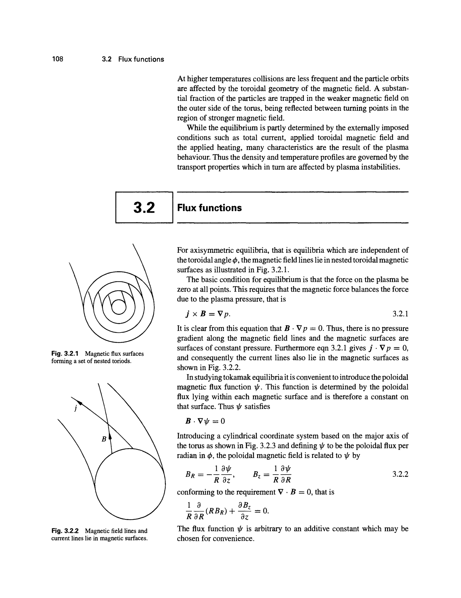
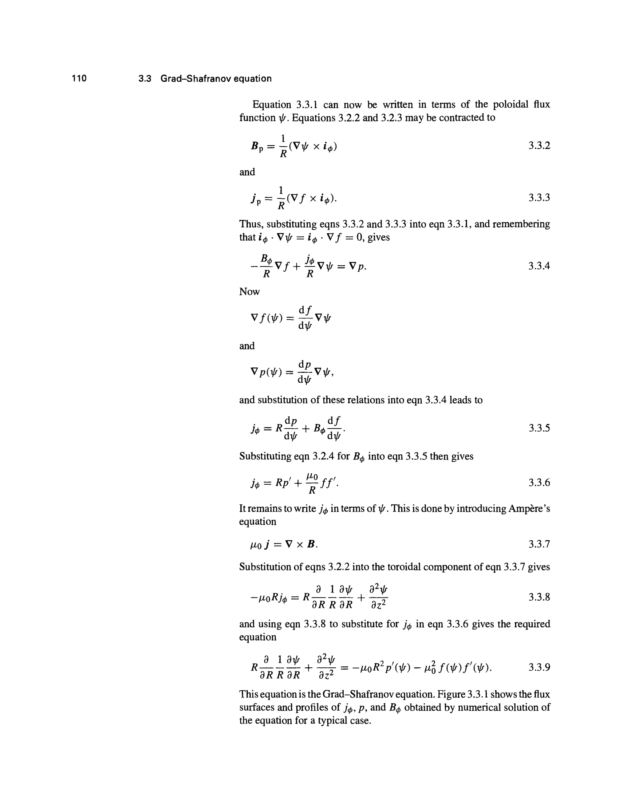


# Part 7 - Magnetohydrodynamics, Equilibrium, and Waves

*Course: Fluid and Plasma Dynamics, Prof. Maurizio Giacomin*  
*Index: [Fluid_and_Plasma_Dynamics_MOC](../../../04_Atlas/Fluid_and_Plasma_Dynamics_MOC.html) | Exam Guide: [Giacomin_Oral_Exam_Questions_Complete_Guide](./Giacomin_Oral_Exam_Questions_Complete_Guide.html)*  
*Relevant Exam Questions: 22, 23, 24, 25*  

---

## 1. Fundamental Equations of Magnetohydrodynamics (MHD)

### 1.1 Single-Fluid Formulation and Approximations

Magnetohydrodynamics (MHD) describes the macroscopic dynamics of electrically conducting fluids (astrophysical plasmas, liquid metals, and magnetic fusion plasmas) as a single continuous medium.

The transition from two-fluid kinetic theory to single-fluid MHD rests on three fundamental assumptions:
1. **Quasi-neutrality**: On length scales much larger than the Debye length ($L \gg \lambda_D$) and timescales longer than the plasma period ($\tau \gg 1/\omega_{pe}$), charge separation is negligible:
$$\sigma_e = e(n_i - n_e) \approx 0 \implies n_e \approx Z n_i$$
2. **Non-relativistic dynamics**: Flow velocities and phase speeds are much smaller than the speed of light ($v \ll c, v_A \ll c$). In Ampère's law, the displacement current is negligible compared to the conduction current:
$$\frac{1}{c^2}\frac{\partial \vec{E}}{\partial t} \ll \mu_0 \vec{j} \implies \nabla \times \vec{B} = \mu_0 \vec{j}$$
3. **Single-fluid center-of-mass variables**:
- Total mass density: $\rho = m_i n_i + m_e n_e \approx m_i n$
- Center-of-mass flow velocity: $\vec{v} = \frac{m_i n_i \vec{v}_i + m_e n_e \vec{v}_e}{\rho} \approx \vec{v}_i$
- Total current density: $\vec{j} = e(Z n_i \vec{v}_i - n_e \vec{v}_e) \approx e n (\vec{v}_i - \vec{v}_e)$
- Total thermal pressure: $p = p_i + p_e$

### 1.2 The Closed System of MHD Equations

1. **Continuity Equation**:
$$\frac{\partial \rho}{\partial t} + \nabla \cdot (\rho \vec{v}) = 0$$

2. **Momentum Equation**:
Adding the electron and ion momentum equations eliminates internal electric fields $\sigma_e \vec{E} \approx 0$, leaving the macroscopic **Lorentz force**:
$$\rho \left[ \frac{\partial \vec{v}}{\partial t} + (\vec{v} \cdot \nabla)\vec{v} \right] = -\nabla p + \vec{j} \times \vec{B} + \rho \vec{g} + \mu \nabla^2 \vec{v}$$

Using Ampère's law $\vec{j} = \frac{1}{\mu_0} \nabla \times \vec{B}$ and the vector identity $(\nabla \times \vec{B}) \times \vec{B} = (\vec{B} \cdot \nabla)\vec{B} - \nabla(B^2/2)$:
$$\vec{j} \times \vec{B} = -\nabla\left( \frac{B^2}{2\mu_0} \right) + \frac{(\vec{B} \cdot \nabla)\vec{B}}{\mu_0}$$

The Lorentz force separates into two distinct physical effects:
- **Magnetic pressure**: $p_{mag} = \frac{B^2}{2\mu_0}$, acting isotropically perpendicular to field lines.
- **Magnetic tension**: $\frac{(\vec{B} \cdot \nabla)\vec{B}}{\mu_0} = \frac{B^2}{\mu_0 R_c} \hat{n} + \frac{\partial}{\partial s}\left(\frac{B^2}{2\mu_0}\right)\hat{b}$, acting like stretched elastic strings along curved field lines.

3. **Induction Equation**:
The generalized Ohm's law in its simplest resistive form is:
$$\vec{E} + \vec{v} \times \vec{B} = \eta \vec{j} = \frac{\eta}{\mu_0} \nabla \times \vec{B}$$
where $\eta$ is electrical resistivity.
Taking the curl and using Faraday's law $\nabla \times \vec{E} = -\frac{\partial \vec{B}}{\partial t}$:
$$\frac{\partial \vec{B}}{\partial t} = \nabla \times (\vec{v} \times \vec{B}) + \frac{\eta}{\mu_0} \nabla^2 \vec{B}$$
assuming uniform resistivity.

4. **Solenoidal Constraint**:
$$\nabla \cdot \vec{B} = 0$$

### 1.3 Magnetic Reynolds Number and Flux Freezing (Alfvén's Theorem)

The ratio of the advective term to the resistive diffusion term in the induction equation is the dimensionless **magnetic Reynolds number**:
$$R_m = \frac{\lvert \nabla \times (\vec{v} \times \vec{B})\lvert }{\rvert\frac{\eta}{\mu_0} \nabla^2 \vec{B}\rvert} \sim \frac{v B / L}{\frac{\eta}{\mu_0} B / L^2} = \mu_0 \sigma v L$$

- **Resistive diffusion limit ($R_m \ll 1$)**: The magnetic field diffuses through the fluid on the timescale $\tau_{diff} = \mu_0 \sigma L^2$.
- **Ideal MHD limit ($R_m \gg 1$)**: In high-temperature astrophysical and fusion plasmas, $R_m \sim 10^6 - 10^{12}$. The diffusion term vanishes:
$$\frac{\partial \vec{B}}{\partial t} = \nabla \times (\vec{v} \times \vec{B})$$

**Alfvén's Theorem (Flux Freezing)**: In an ideally conducting fluid ($\eta = 0$), the magnetic flux $\Phi = \int_S \vec{B} \cdot d\vec{S}$ passing through any closed material surface moving with the fluid is strictly invariant in time:
$$\frac{d\Phi}{dt} = 0$$
Magnetic field lines are "frozen" into the plasma and transported passively with the flow.

---

## 2. Magnetohydrostatic Equilibrium: The Z-Pinch and Bennett Relation

### 2.1 The Z-Pinch Configuration and Force Balance

Consider a cylindrical plasma column of radius $a$ aligned with the $z$-axis. An axial current density $\vec{j} = j_z(r) \hat{z}$ flows through the column, generating an azimuthal magnetic field $\vec{B} = B_\theta(r) \hat{\theta}$.

In static equilibrium ($\vec{v} = 0$), the momentum equation reduces to **magnetohydrostatic balance**:
$$\nabla p = \vec{j} \times \vec{B}$$

In cylindrical coordinates $(r, \theta, z)$:
$$\vec{j} \times \vec{B} = (j_z \hat{z}) \times (B_\theta \hat{\theta}) = -j_z B_\theta \hat{r}$$

The radial force balance equation is:
$$\frac{dp}{dr} = -j_z B_\theta$$

From Ampère's law in integral form:
$$\oint \vec{B} \cdot d\vec{\ell} = 2\pi r B_\theta(r) = \mu_0 I(r) = \mu_0 \int_0^r j_z(r') 2\pi r' \, dr'$$
Differentiating:
$$j_z(r) = \frac{1}{\mu_0 r} \frac{d}{dr}(r B_\theta)$$

Substituting $j_z$ into the radial equilibrium equation:
$$\frac{dp}{dr} = -\frac{B_\theta}{\mu_0 r} \frac{d}{dr}(r B_\theta) = -\frac{1}{2\mu_0 r^2} \frac{d}{dr}(r^2 B_\theta^2) - \frac{B_\theta^2}{2\mu_0 r}$$

```
                r
                ^   j_z (axial current)
                |       |
                |   +---|---+
                |   |   |   |
                |   |   v   |  <=== J x B pinch force (inward)
                0---|-------|------------> z
                |   |   ^   |  <=== J x B pinch force (inward)
                |   |   |   |
                |   +---|---+
                v       |
                   B_theta (azimuthal field)
```

### 2.2 Derivation of the Bennett Relation

Multiply the force balance equation $\frac{dp}{dr} = -j_z B_\theta$ by $r^2$ and integrate across the column from $r = 0$ to the boundary $r = a$:
$$\int_0^a r^2 \frac{dp}{dr} \, dr = -\int_0^a r^2 j_z B_\theta \, dr$$

Integrating the left-hand side by parts:
$$\int_0^a r^2 \frac{dp}{dr} \, dr = \left[ r^2 p(r) \right]_0^a - 2 \int_0^a r p(r) \, dr$$

Since $p(a) = 0$ at the plasma edge and $r^2 = 0$ at the origin, the boundary term vanishes:
$$\int_0^a r^2 \frac{dp}{dr} \, dr = -2 \int_0^a r p(r) \, dr$$

The total line thermal energy (thermal energy per unit axial length) is:
$$E_{th} = \int_0^a 2\pi r p(r) \, dr = N k_B (T_e + T_i)$$
where $N = \int_0^a 2\pi r n(r) \, dr$ is the number of particles per unit length (line density).
Thus:
$$\int_0^a r^2 \frac{dp}{dr} \, dr = -\frac{N k_B (T_e + T_i)}{\pi}$$

Now evaluate the right-hand side using $j_z = \frac{1}{\mu_0 r}\frac{d}{dr}(r B_\theta)$:
$$-\int_0^a r^2 j_z B_\theta \, dr = -\frac{1}{\mu_0} \int_0^a (r B_\theta) \frac{d(r B_\theta)}{dr} \, dr = -\frac{1}{2\mu_0} \left[ (r B_\theta)^2 \right]_0^a = -\frac{a^2 B_\theta^2(a)}{2\mu_0}$$

From Ampère's law at the boundary $r = a$, the total axial current is $I$:
$$2\pi a B_\theta(a) = \mu_0 I \implies a B_\theta(a) = \frac{\mu_0 I}{2\pi}$$

Substituting this boundary value:
$$-\frac{a^2 B_\theta^2(a)}{2\mu_0} = -\frac{1}{2\mu_0} \left( \frac{\mu_0 I}{2\pi} \right)^2 = -\frac{\mu_0 I^2}{8\pi^2}$$

Equating the left and right sides:
$$-\frac{N k_B (T_e + T_i)}{\pi} = -\frac{\mu_0 I^2}{8\pi^2}$$

Cancelling negative signs and $\pi$:
$$I^2 = \frac{8\pi}{\mu_0} N k_B (T_e + T_i)$$

This is the famous **Bennett relation** (Willard Bennett, 1934). It gives the exact current $I$ required for magnetic self-confinement of a plasma column at temperature $T_e + T_i$ and line density $N$.

### 2.3 Instabilities of the Simple Z-Pinch

Despite providing radial equilibrium, the simple Z-pinch is violently unstable to ideal MHD perturbations $\vec{\xi} \propto \exp[i(m\theta + k z - \omega t)]$:
1. **Sausage Instability ($m = 0$)**: An axisymmetric constriction narrows the plasma radius locally ($r < a$). Because $B_\theta \propto 1/r$, the magnetic pinch pressure $B_\theta^2 / (2\mu_0)$ increases at the waist, squeezing the column tighter until it cuts off the plasma.
2. **Kink Instability ($m = 1$)**: A helical bend off-axis compresses azimuthal magnetic field lines on the inner (concave) side of the bend and stretches them on the outer side. The resulting magnetic pressure difference drives the column further outward, destroying confinement on microsecond timescales.

---

## 3. Tokamak Toroidal Equilibrium: The Grad-Shafranov Equation

### 3.1 Axisymmetric Magnetic Field Representation

In a tokamak, toroidal symmetry requires invariance under the toroidal angle $\phi$ ($\frac{\partial}{\partial \phi} = 0$). In cylindrical coordinates $(R, \phi, Z)$:
- $R$ is the major radial distance from the machine centerline.
- $Z$ is the vertical height.
- $\phi$ is the toroidal angle.

The solenoidal constraint $\nabla \cdot \vec{B} = 0$ becomes:
$$\frac{1}{R}\frac{\partial}{\partial R}(R B_R) + \frac{\partial B_Z}{\partial Z} = 0$$

This allows the poloidal magnetic field components $(B_R, B_Z)$ to be derived from a single scalar **poloidal flux function** $\psi(R, Z)$:
$$B_R = -\frac{1}{R}\frac{\partial \psi}{\partial Z}, \quad B_Z = \frac{1}{R}\frac{\partial \psi}{\partial R}$$
where $\psi(R, Z) = \frac{1}{2\pi} \int \vec{B} \cdot d\vec{S}_p$ is the poloidal magnetic flux enclosed by a flux surface.

The total magnetic field vector is:
$$\vec{B} = \vec{B}_p + B_\phi \hat{\phi} = \frac{1}{R} (\nabla\psi \times \hat{\phi}) + \frac{F}{R} \hat{\phi}$$
where $F(R, Z) \equiv R B_\phi$ is the **toroidal flux function**.

### 3.2 Derivation of the Equation

Consider the magnetostatic force balance:
$$\vec{j} \times \vec{B} = \nabla p$$

1. **Pressure is a flux function**:
Projecting along the magnetic field:
$$\vec{B} \cdot \nabla p = \vec{B} \cdot (\vec{j} \times \vec{B}) \equiv 0$$
Because $\vec{B} \cdot \nabla\psi = 0$, magnetic field lines lie entirely within constant-$\psi$ surfaces (flux surfaces). Thus, $p$ is a function of $\psi$ alone:
$$p = p(\psi)$$

2. **$F$ is a flux function**:
Projecting along the current density:
$$\vec{j} \cdot \nabla p = 0 \implies \vec{j} \cdot \nabla\psi = 0$$
Using Ampère's law $\mu_0 \vec{j} = \nabla \times \vec{B}$:
$$\mu_0 j_R = -\frac{1}{R}\frac{\partial F}{\partial Z}, \quad \mu_0 j_Z = \frac{1}{R}\frac{\partial F}{\partial R}, \quad \mu_0 j_\phi = -\frac{1}{R} \Delta^* \psi$$
where the **elliptic operator** $\Delta^*$ is:
$$\Delta^* \psi \equiv R \frac{\partial}{\partial R}\left( \frac{1}{R}\frac{\partial \psi}{\partial R} \right) + \frac{\partial^2 \psi}{\partial Z^2} = \frac{\partial^2 \psi}{\partial R^2} - \frac{1}{R}\frac{\partial \psi}{\partial R} + \frac{\partial^2 \psi}{\partial Z^2}$$

The current condition $\vec{j} \cdot \nabla\psi = 0$ yields:
$$j_R \frac{\partial \psi}{\partial R} + j_Z \frac{\partial \psi}{\partial Z} = -\frac{1}{\mu_0 R} \left( \frac{\partial F}{\partial Z}\frac{\partial \psi}{\partial R} - \frac{\partial F}{\partial R}\frac{\partial \psi}{\partial Z} \right) = 0 \implies F = F(\psi)$$

3. **Radial Force Balance**:
Evaluating the radial component of $\vec{j} \times \vec{B} = \nabla p$:
$$(\vec{j} \times \vec{B}) \cdot \nabla\psi = \nabla p \cdot \nabla\psi = p'(\psi) \lvert \nabla\psi\rvert^2$$

Computing the cross product explicitly:
$$\mu_0 (\vec{j} \times \vec{B}) \cdot \nabla\psi = -\frac{1}{R^2} \Delta^* \psi \lvert \nabla\psi\rvert^2 - \frac{F F'(\psi)}{R^2} \lvert \nabla\psi\rvert^2$$

Equating to $\mu_0 p'(\psi) \lvert \nabla\psi\rvert^2$ and dividing through by $\frac{\lvert \nabla\psi\rvert^2}{R^2}$:
$$\Delta^* \psi = -\mu_0 R^2 p'(\psi) - F F'(\psi)$$

This is the **Grad-Shafranov equation** (Harold Grad and Vitalii Shafranov, 1958). It is the fundamental non-linear 2D partial differential equation governing 2D axisymmetric toroidal equilibria in tokamaks and spheromaks.

---

## 4. Magnetohydrodynamic Waves: Alfvén and Magnetosonic Modes

### 4.1 Shear Alfvén Waves

Consider an ideal, incompressible ($\nabla \cdot \vec{v} = 0$), inviscid plasma in a uniform background magnetic field $\vec{B}_0 = B_0 \hat{z}$ with density $\rho_0$.

Linearizing the momentum and induction equations with perturbations $\vec{v}_1, \vec{B}_1 \propto \exp[i(\vec{k} \cdot \vec{x} - \omega t)]$:
$$-i\omega \rho_0 \vec{v}_1 = -\nabla\left( p_1 + \frac{\vec{B}_0 \cdot \vec{B}_1}{\mu_0} \right) + \frac{i k_\parallel B_0}{\mu_0} \vec{B}_1$$
$$-i\omega \vec{B}_1 = i k_\parallel B_0 \vec{v}_1$$
where $k_\parallel = \vec{k} \cdot \hat{z}$.

For incompressible shear motions transverse to both $\vec{k}$ and $\vec{B}_0$ ($v_{1z} = 0, \vec{k} \cdot \vec{v}_1 = 0$), total pressure perturbations vanish.
Substituting $\vec{B}_1 = -\frac{k_\parallel B_0}{\omega} \vec{v}_1$ into the momentum equation:
$$-i\omega \rho_0 \vec{v}_1 = \frac{i k_\parallel B_0}{\mu_0} \left( -\frac{k_\parallel B_0}{\omega} \vec{v}_1 \right) = -i \frac{k_\parallel^2 B_0^2}{\mu_0 \omega} \vec{v}_1$$

Multiplying by $\omega$:
$$\omega^2 = \frac{k_\parallel^2 B_0^2}{\mu_0 \rho_0} = k_\parallel^2 v_A^2$$
where $v_A$ is the **Alfvén velocity**:
$$v_A \equiv \frac{B_0}{\sqrt{\mu_0 \rho_0}}$$

**Physical nature**: The **shear Alfvén wave** (Hannes Alfvén, Nobel Prize 1970) is an incompressible transverse wave. Magnetic tension provides the restoring force, while fluid mass density provides inertia. The wave group velocity $\vec{v}_g = \nabla_{\vec{k}} \omega = v_A \hat{z}$ is strictly directed along the magnetic field lines: energy propagates solely along $\vec{B}_0$.

### 4.2 Compressional Fast and Slow Magnetosonic Waves

In a compressible plasma ($c_s = \sqrt{\gamma p_0 / \rho_0} \neq 0$), acoustic pressure couples with magnetic pressure, yielding three distinct wave branches governed by:
$$\omega^4 - \omega^2 k^2 (v_A^2 + c_s^2) + k^4 v_A^2 c_s^2 \cos^2\theta = 0$$
where $\theta$ is the angle between wavevector $\vec{k}$ and $\vec{B}_0$.

Solving the quadratic equation for phase speed $u = \omega/k$:
$$u_{fast, slow}^2 = \frac{1}{2} \left[ (v_A^2 + c_s^2) \pm \sqrt{(v_A^2 + c_s^2)^2 - 4 v_A^2 c_s^2 \cos^2\theta} \right]$$

- **Fast Magnetosonic Wave ($+$ sign)**: Thermal pressure and magnetic pressure compress in phase, accelerating propagation ($u_{fast} \ge \max(v_A, c_s)$).
- **Slow Magnetosonic Wave ($-$ sign)**: Thermal pressure and magnetic pressure compress out of phase ($u_{slow} \le \min(v_A, c_s)$).
- **Shear Alfvén Wave**: $u_{Alfv\acute{e}n} = v_A \cos\theta$.


## Lecture Visuals & Grad-Shafranov Equilibrium


*Figure FPD-11: Magnetohydrodynamic equilibrium $\mathbf{J} \times \mathbf{B} = \nabla P$. Derivation of the Grad-Shafranov equation $\Delta^* \psi \equiv R \frac{\partial}{\partial R}\left(\frac{1}{R}\frac{\partial \psi}{\partial R}\right) + \frac{\partial^2 \psi}{\partial Z^2} = -\mu_0 R^2 \frac{dP}{d\psi} - F \frac{dF}{d\psi}$ governing axisymmetric nested flux surfaces.*


*Figure FPD-12: Magnetic flux coordinates showing poloidal magnetic flux $\psi(R, Z)$, toroidal field function $F(\psi) = R B_\phi$, and safety factor profile $q(\psi)$ preventing kink instabilities.*


<div class="backlinks-section">
  <h4 class="backlinks-title">Linked References (7)</h4>
  <ul class="backlinks-list">
    <li class="backlink-item-wrap"><a href="./Course_Overview_and_Syllabus.html" class="backlink-item">Course_Overview_and_Syllabus</a></li>
    <li class="backlink-item-wrap"><a href="../../../03_Zettel/Theory/Cylindrical%20Z-pinch%20equilibrium%20and%20Bennett%20relation.html" class="backlink-item">Cylindrical Z-pinch equilibrium and Bennett relation</a></li>
    <li class="backlink-item-wrap"><a href="../../../04_Atlas/Fluid_and_Plasma_Dynamics_MOC.html" class="backlink-item">Fluid_and_Plasma_Dynamics_MOC</a></li>
    <li class="backlink-item-wrap"><a href="./Giacomin_Oral_Exam_Questions_Complete_Guide.html" class="backlink-item">Giacomin_Oral_Exam_Questions_Complete_Guide</a></li>
    <li class="backlink-item-wrap"><a href="../../../03_Zettel/Theory/Grad-Shafranov%20equation%20and%20axisymmetric%20tokamak%20equilibria.html" class="backlink-item">Grad-Shafranov equation and axisymmetric tokamak equilibria</a></li>
    <li class="backlink-item-wrap"><a href="../../../03_Zettel/Theory/Ideal%20MHD%20equations%20and%20Alfven%20flux%20freezing%20theorem.html" class="backlink-item">Ideal MHD equations and Alfven flux freezing theorem</a></li>
    <li class="backlink-item-wrap"><a href="../../../03_Zettel/Theory/Shear%20Alfven%20and%20magnetosonic%20wave%20modes%20in%20MHD.html" class="backlink-item">Shear Alfven and magnetosonic wave modes in MHD</a></li>
  </ul>
</div>
