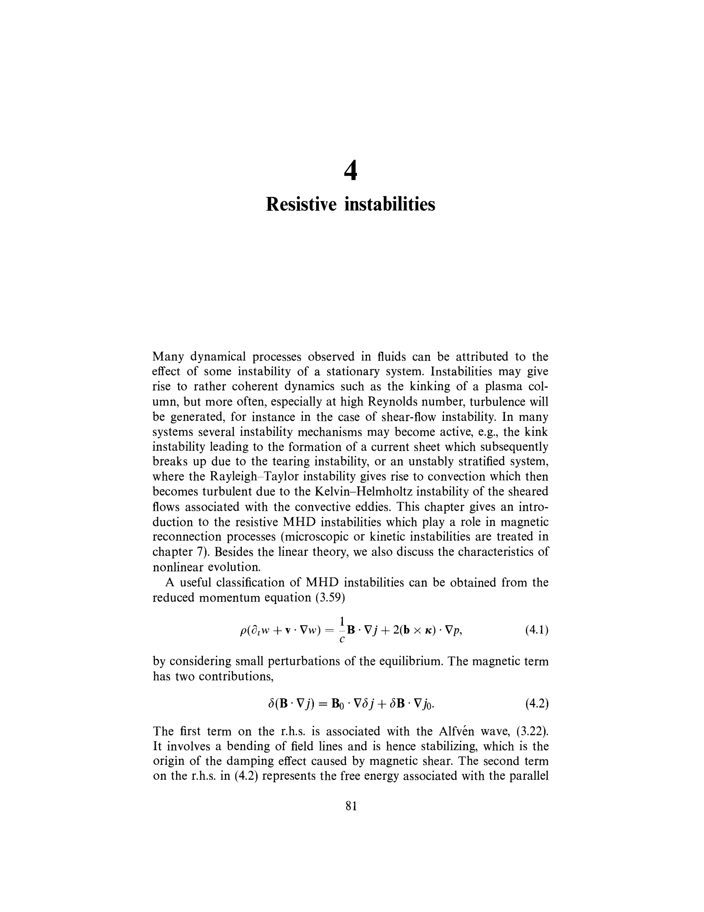
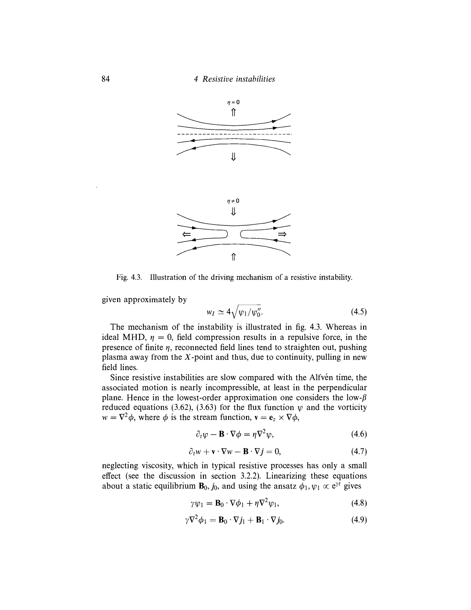

# Part 8 - Reconnection, Relaxation, and Dynamo Theory

*Course: Fluid and Plasma Dynamics, Prof. Maurizio Giacomin*  
*Index: [[Fluid_and_Plasma_Dynamics_MOC]] | Exam Guide: [[Giacomin_Oral_Exam_Questions_Complete_Guide]]*  
*Relevant Exam Questions: 26, 27, 28, 29, 30*  

---

## 1. Magnetic Reconnection: The Sweet-Parker Model

### 1.1 Breakdown of Flux Freezing at Current Sheets

In ideal MHD ($R_m \to \infty$), Alfvén's flux freezing theorem strictly prevents magnetic field lines from breaking or altering their topological connectivity.

However, in real plasmas with small but finite resistivity $\eta$, steep spatial gradients can form across thin current sheets of width $2\delta \ll L$. In these layers, the resistive diffusion term $\frac{\eta}{\mu_0} \nabla^2 \vec{B} \sim \frac{\eta}{\mu_0 \delta^2} B$ becomes comparable to or exceeds advective transport. Oppositely directed magnetic field lines diffuse into the sheet, break, and reconnect into a new topological configuration, rapidly converting stored magnetic energy into kinetic and thermal plasma energy.

```
       B_in (upstream)                   B_in (upstream)
         --------->                        --------->
                     \                  /
    Inflow v_in ===>  \                /  <=== Inflow v_in
                       +--------------+
                       | Diffusion    |
  <=== Outflow v_out --| Layer (2*del)|-- Outflow v_out ===>
                       +--------------+
                      /                \
                     /                  \
         <---------                        <---------
       -B_in (upstream)                  -B_in (upstream)
```

### 1.2 Derivation of the Sweet-Parker Reconnection Rate

P. A. Sweet (1958) and E. N. Parker (1957) formulated the canonical 2D steady-state model of magnetic reconnection:
- A current sheet of length $2L$ along the outflow $x$-direction and thickness $2\delta$ along the inflow $y$-direction.
- Inflow velocity: $v_{in}$ transporting magnetic field $\pm B_{in} \hat{x}$ into the sheet.
- Outflow velocity: $v_{out}$ expelling reconnected plasma along $\pm \hat{x}$.

1. **Conservation of Mass (Incompressible Flow)**:
The mass entering the sheet through area $2L$ must equal the mass leaving through area $2\delta$:
$$\rho (2L) v_{in} = \rho (2\delta) v_{out} \implies v_{in} = \frac{\delta}{L} v_{out}$$

2. **Conservation of Energy (Bernoulli / Momentum Balance)**:
Along the outflow axis ($y = 0$), magnetic tension accelerates plasma from rest at the central $X$-point to velocity $v_{out}$ at the exit. The magnetic pressure of the incoming field is converted into dynamic outflow pressure:
$$\frac{B_{in}^2}{2\mu_0} \approx \frac{1}{2} \rho v_{out}^2 \implies v_{out} \approx v_A = \frac{B_{in}}{\sqrt{\mu_0 \rho}}$$
The plasma leaves the reconnection layer at the **upstream Alfvén speed**.

3. **Steady-State Ohm's Law in the Diffusion Layer**:
Far from the layer, advection balances electric field: $E_z = v_{in} B_{in}$. Inside the resistive layer at the $X$-point, fluid velocity vanishes, so the electric field is supported purely by resistive current:
$$E_z = \eta j_z \approx \frac{\eta}{\mu_0} \frac{B_{in}}{\delta}$$

Equating the electric fields:
$$v_{in} B_{in} = \frac{\eta}{\mu_0 \delta} B_{in} \implies v_{in} = \frac{\eta}{\mu_0 \delta}$$

4. **Solving for Reconnection Scaling**:
Equating the two expressions for $v_{in}$:
$$v_{in} = \frac{\delta}{L} v_A = \frac{\eta}{\mu_0 \delta}$$

Multiplying the two relations eliminates $\delta$:
$$v_{in}^2 = \left( \frac{\delta}{L} v_A \right) \left( \frac{\eta}{\mu_0 \delta} \right) = \frac{\eta}{\mu_0 L} v_A$$

Dividing by $v_A^2$:
$$\left( \frac{v_{in}}{v_A} \right)^2 = \frac{\eta}{\mu_0 L v_A} \equiv \frac{1}{S}$$
where $S$ is the dimensionless **Lundquist number**:
$$S \equiv \frac{\mu_0 L v_A}{\eta}$$

Taking the square root yields the **Sweet-Parker reconnection rate**:
$$\frac{v_{in}}{v_A} = \frac{1}{\sqrt{S}} = S^{-1/2}$$

The current sheet aspect ratio is:
$$\frac{\delta}{L} = \frac{1}{\sqrt{S}}$$

### 1.3 The Reconnection Paradox and Tearing Modes

In typical astrophysical plasmas (solar flares, Earth's magnetosphere, interstellar medium):
$$S \sim 10^8 - 10^{14}$$

The Sweet-Parker model predicts an inflow speed $v_{in} \sim 10^{-4} - 10^{-7} v_A$, requiring weeks to months to release solar flare magnetic energy, whereas observed solar flares release their energy in $10^2 - 10^3\text{ seconds}$.

This discrepancy is resolved by two mechanisms:
1. **Petschek Reconnection (1964)**: Fast reconnection mediated by slow-mode standing shock waves, yielding a logarithmic rate $\frac{v_{in}}{v_A} \sim \frac{\pi}{8\ln S} \sim 0.01 - 0.1$.
2. **Resistive Tearing Instability and Plasmoid Chains**: When the Lundquist number exceeds a critical threshold ($S > S_c \sim 10^4$), the elongated Sweet-Parker sheet becomes violently unstable to tearing modes (Biskamp 1986). The sheet breaks up into a fractal chain of magnetic islands (plasmoids), triggering fast, stochastic reconnection independent of $S$.

---

## 2. Woltjer's Theorems and Magnetic Helicity

### 2.1 First Woltjer Theorem: Helicity Conservation in Ideal MHD

Magnetic helicity $K$ measures the degree of linkage, twisting, and knottedness of magnetic field lines within a volume $V$:
$$K = \int_V \vec{A} \cdot \vec{B} \, d^3x$$
where $\vec{B} = \nabla \times \vec{A}$, and the volume boundary $S$ is a magnetic flux surface ($\vec{B} \cdot \hat{n} = 0$).

**Gauge Invariance**:
Under a gauge transformation $\vec{A} \to \vec{A} + \nabla \chi$:
$$\Delta K = \int_V \nabla\chi \cdot \vec{B} \, d^3x = \int_V \nabla \cdot (\chi \vec{B}) \, d^3x = \oint_S \chi (\vec{B} \cdot \hat{n}) \, dS = 0$$
Because the boundary is a flux surface, $K$ is strictly gauge invariant.

**Proof of Invariance**:
Calculate the time derivative of $K$:
$$\frac{dK}{dt} = \int_V \left( \frac{\partial \vec{A}}{\partial t} \cdot \vec{B} + \vec{A} \cdot \frac{\partial \vec{B}}{\partial t} \right) d^3x$$

From Faraday's law $\frac{\partial \vec{B}}{\partial t} = -\nabla \times \vec{E}$, the vector potential evolves as $\frac{\partial \vec{A}}{\partial t} = -\vec{E} - \nabla \phi$.
In ideal MHD, Ohm's law requires $\vec{E} + \vec{v} \times \vec{B} = 0 \implies \vec{E} \cdot \vec{B} = 0$.
The first term becomes:
$$\frac{\partial \vec{A}}{\partial t} \cdot \vec{B} = (-\vec{E} - \nabla\phi) \cdot \vec{B} = -\vec{B} \cdot \nabla\phi$$

For the second term, use the vector identity $\nabla \cdot (\vec{A} \times \vec{E}) = \vec{E} \cdot (\nabla \times \vec{A}) - \vec{A} \cdot (\nabla \times \vec{E}) = \vec{E} \cdot \vec{B} + \vec{A} \cdot \frac{\partial \vec{B}}{\partial t}$:
$$\vec{A} \cdot \frac{\partial \vec{B}}{\partial t} = \nabla \cdot (\vec{A} \times \vec{E})$$

Combining both terms:
$$\frac{dK}{dt} = \int_V \left[ -\nabla \cdot (\phi \vec{B}) + \nabla \cdot (\vec{A} \times \vec{E}) \right] d^3x = \oint_S \left( -\phi \vec{B} + \vec{A} \times \vec{E} \right) \cdot \hat{n} \, dS$$

At the boundary $S$:
- $\vec{B} \cdot \hat{n} = 0$.
- $(\vec{A} \times \vec{E}) \cdot \hat{n} = \vec{A} \cdot (\vec{E} \times \hat{n}) = \vec{A} \cdot (-(\vec{v} \times \vec{B}) \times \hat{n}) = 0$ assuming a perfectly conducting boundary ($\vec{v} \cdot \hat{n} = 0$).

Therefore:
$$\frac{dK}{dt} = 0$$

This is **Woltjer's first theorem** (Lodewijk Woltjer, 1958): In ideal MHD, magnetic helicity is strictly conserved for any closed volume bounded by a magnetic surface.

### 2.2 Second Woltjer Theorem: Minimum Energy State

Woltjer's second theorem states that among all magnetic field configurations possessing a given magnetic helicity $K_0$, the state of **minimum magnetic energy**:
$$W = \int_V \frac{B^2}{2\mu_0} \, d^3x$$
is a **linear force-free field**:
$$\nabla \times \vec{B} = \mu \vec{B}$$
where $\mu$ is a spatial constant.

**Proof via Variational Calculus**:
Form the functional with Lagrange multiplier $\lambda$:
$$\mathcal{F}[\vec{A}] = \int_V \frac{(\nabla \times \vec{A})^2}{2\mu_0} \, d^3x - \lambda \left[ \int_V \vec{A} \cdot (\nabla \times \vec{A}) \, d^3x - K_0 \right]$$

Taking the variation with respect to $\delta\vec{A}$:
$$\delta\mathcal{F} = \int_V \left[ \frac{\vec{B}}{\mu_0} \cdot (\nabla \times \delta\vec{A}) - \lambda \delta\vec{A} \cdot \vec{B} - \lambda \vec{A} \cdot (\nabla \times \delta\vec{A}) \right] d^3x = 0$$

Integrating by parts and applying the boundary condition $\delta\vec{A} \times \hat{n} = 0$:
$$\int_V \delta\vec{A} \cdot \left[ \frac{1}{\mu_0}\nabla \times \vec{B} - 2\lambda \vec{B} \right] d^3x = 0$$

Since $\delta\vec{A}$ is arbitrary within $V$:
$$\nabla \times \vec{B} = 2\mu_0 \lambda \vec{B} \equiv \mu \vec{B}$$

Because $\vec{j} = \frac{1}{\mu_0}\nabla \times \vec{B} = \frac{\mu}{\mu_0}\vec{B}$, the Lorentz force vanishes:
$$\vec{j} \times \vec{B} = \frac{\mu}{\mu_0} (\vec{B} \times \vec{B}) \equiv 0$$
The state of lowest magnetic energy for a given helicity is a **force-free Beltrami field**.

---

## 3. Taylor Plasma Relaxation and the Reversed Field Pinch (RFP)

### 3.1 Taylor's Hypothesis and Selective Decay

In 1974, J. B. Taylor extended Woltjer's theory to slightly resistive, turbulent plasmas.
In the presence of finite resistivity $\eta$, the infinite number of local flux invariants are destroyed by small-scale magnetic reconnection.

However, Taylor made a profound physical observation regarding **selective decay**:
- The dissipation rate of magnetic energy:
$$\frac{dW}{dt} = -\int_V \eta j^2 \, d^3x = -\frac{\eta}{\mu_0^2} \int_V (\nabla \times \vec{B})^2 \, d^3x$$
scales with the square of spatial gradients ($\propto k^2$). In thin reconnection sheets, energy dissipates rapidly.
- The dissipation rate of total magnetic helicity:
$$\frac{dK}{dt} = -2 \int_V \eta (\vec{j} \cdot \vec{B}) \, d^3x = -\frac{2\eta}{\mu_0} \int_V \vec{B} \cdot (\nabla \times \vec{B}) \, d^3x$$
scales only linearly with gradients ($\propto k$).

Consequently, during turbulent MHD relaxation, **magnetic energy dissipates much faster than global magnetic helicity**.
Taylor hypothesized that a turbulent plasma relaxes to the state of minimum magnetic energy subject to the **single invariant of total global helicity $K$**.

By Woltjer's second theorem, the relaxed equilibrium satisfies:
$$\nabla \times \vec{B} = \mu \vec{B}, \quad \mu = \text{constant throughout the plasma}$$

### 3.2 The Bessel Function Model (BFM) and Spontaneous Field Reversal

In cylindrical geometry $(r, \theta, z)$, taking the curl of $\nabla \times \vec{B} = \mu \vec{B}$:
$$\nabla \times (\nabla \times \vec{B}) = \mu^2 \vec{B} \implies \nabla^2 \vec{B} + \mu^2 \vec{B} = 0$$

For the axial magnetic field $B_z(r)$:
$$\frac{1}{r}\frac{d}{dr}\left( r \frac{dB_z}{dr} \right) + \mu^2 B_z = 0$$

This is Bessel's differential equation of order zero. The solution finite at $r = 0$ is:
$$B_z(r) = B_0 J_0(\mu r)$$

The azimuthal field $B_\theta(r)$ is obtained from $(\nabla \times \vec{B})_\theta = -\frac{dB_z}{dr} = \mu B_\theta$:
$$B_\theta(r) = -\frac{1}{\mu}\frac{dB_z}{dr} = B_0 J_1(\mu r)$$

This is the celebrated **Bessel Function Model (BFM)**.

```
Magnetic Field
 ^
 |     J_0(mu*r) = B_z(r)
1.0 +-----+
 |   \     \
 |    \     \               J_1(mu*r) = B_theta(r)
 |     \     \             /-----\
0.0 ----\-----\-----------/-------\-------------> r (radius)
 |       \     \         /         \
-0.4      +-----\-------+           \  Reversal: B_z(a) < 0
                 ` - - - - - - - - - `  for mu*a > 2.405
```

Define two macroscopic dimensionless parameters at the wall $r = a$:
- **Pinch parameter**: $\Theta = \frac{B_\theta(a)}{\langle B_z \rangle} = \frac{\mu a}{2}$
- **Field reversal parameter**: $F = \frac{B_z(a)}{\langle B_z \rangle} = \frac{\mu a J_0(\mu a)}{2 J_1(\mu a)}$

The first zero of the Bessel function $J_0(x)$ occurs at:
$$x_0 \approx 2.405$$

If the plasma current is driven high enough such that:
$$\mu a > 2.405 \implies \Theta > 1.2$$
then $J_0(\mu a) < 0$, which implies:
$$B_z(a) < 0 \implies F < 0$$

**Spontaneous Magnetic Field Reversal**: The axial magnetic field at the plasma edge spontaneously reverses direction with respect to the core magnetic field!
This self-organization is the operating principle of the **Reversed Field Pinch (RFP)**, realized experimentally at **Consorzio RFX in Padova** (RFX-mod and RFX-mod2).

---

## 4. Dynamo Theory and Magnetic Field Generation

### 4.1 Cowling's Anti-Dynamo Theorem

A fundamental problem in astrophysics is explaining the origin and persistence of magnetic fields in the Earth, Sun, and galaxies against Ohmic dissipation ($\tau_{Ohm} = \mu_0 \sigma L^2$).

In 1933, T. G. Cowling proved that simple axisymmetric geometry cannot sustain a dynamo:
> **Cowling's Theorem**: A steady-state, axisymmetric magnetic field cannot be maintained by a steady, axisymmetric velocity field in a medium of finite electrical conductivity.

**Proof by Contradiction**:
In cylindrical coordinates $(r, \phi, z)$, assume axisymmetry ($\frac{\partial}{\partial \phi} = 0$) and steady state ($\frac{\partial}{\partial t} = 0$).
Decompose the magnetic field into poloidal and toroidal parts:
$$\vec{B} = \vec{B}_p + B_\phi \hat{\phi}, \quad \vec{B}_p = \nabla \times (A_\phi \hat{\phi})$$

Poloidal field lines form closed nested loops in the $(r, z)$ plane. Within the innermost loop, there must exist at least one **neutral line** (an O-type null point, $C_{neutral}$) where the poloidal field vanishes:
$$\vec{B}_p = 0 \quad \text{on } C_{neutral}$$

1. **Current density from Ampère's law**:
Applying Stokes' theorem along a small circuit enclosing the neutral line in the $(r, z)$ plane:
$$\oint \vec{B}_p \cdot d\vec{\ell} = \mu_0 \int j_\phi \, dS \neq 0 \implies j_\phi \neq 0 \quad \text{on } C_{neutral}$$

2. **Current density from Ohm's law**:
The toroidal component of Ohm's law $\vec{j} = \sigma(\vec{E} + \vec{v} \times \vec{B})$ is:
$$j_\phi = \sigma \left[ E_\phi + (\vec{v} \times \vec{B})_\phi \right] = \sigma \left[ E_\phi + (v_z B_r - v_r B_z) \right]$$

At the neutral line, $B_r = B_z = 0$, which eliminates the convective cross-product term:
$$j_\phi = \sigma E_\phi \quad \text{on } C_{neutral}$$

3. **Evaluation of the electric field**:
In a steady state ($\frac{\partial\vec{B}}{\partial t} = 0$), Faraday's law requires $\nabla \times \vec{E} = 0$.
Integrating $E_\phi$ along the circular neutral loop of radius $R_0$:
$$\oint_{C_{neutral}} \vec{E} \cdot d\vec{\ell} = 2\pi R_0 E_\phi = \int_S (\nabla \times \vec{E}) \cdot d\vec{S} = 0 \implies E_\phi \equiv 0$$

Therefore, Ohm's law requires:
$$j_\phi = \sigma (0) = 0 \quad \text{on } C_{neutral}$$

This directly contradicts $j_\phi \neq 0$ from Ampère's law.
The assumption that a steady axisymmetric dynamo can exist is false.

**Consequence**: Cosmic dynamos require **three-dimensional, non-axisymmetric, or non-steady fluid motions** (such as helical turbulence and differential rotation).

### 4.2 Mean-Field Electrodynamics and the Turbulent Dynamo

To explain how non-axisymmetric turbulent motions generate large-scale coherent magnetic fields, Max Steenbeck, Fritz Krause, and Karl-Heinz Rädler (1966) developed **mean-field electrodynamics**.

Decompose velocity and magnetic fields into mean (ensemble-averaged) and fluctuating components:
$$\vec{v} = \langle \vec{v} \rangle + \vec{v}', \quad \vec{B} = \langle \vec{B} \rangle + \vec{B}'$$
where $\langle \vec{v}' \rangle = 0$ and $\langle \vec{B}' \rangle = 0$.

Averaging the induction equation yields the **mean-field induction equation**:
$$\frac{\partial \langle \vec{B} \rangle}{\partial t} = \nabla \times (\langle \vec{v} \rangle \times \langle \vec{B} \rangle + \vec{\mathcal{E}}) + \frac{\eta}{\mu_0} \nabla^2 \langle \vec{B} \rangle$$
where $\vec{\mathcal{E}}$ is the **turbulent electromotive force (EMF)**:
$$\vec{\mathcal{E}} = \langle \vec{v}' \times \vec{B}' \rangle$$

For homogeneous, isotropic turbulence with scale separation, expanding $\vec{\mathcal{E}}$ in powers of spatial gradients of the mean field:
$$\vec{\mathcal{E}} = \alpha \langle \vec{B} \rangle - \beta \nabla \times \langle \vec{B} \rangle$$

1. **The $\alpha$-effect**:
$$\alpha = -\frac{1}{3} \tau_c \langle \vec{v}' \cdot (\nabla \times \vec{v}') \rangle$$
The parameter $\alpha$ is proportional to the **mean kinetic helicity** of the turbulent flow. In a rotating, stratified medium (such as the solar convection zone), Coriolis forces twist ascending convective plumes, generating net cyclonic helicity ($\langle \vec{v}' \cdot \vec{\omega}' \rangle \neq 0$). This twists toroidal field lines into poloidal loops.
2. **The $\beta$-effect (Turbulent Diffusivity)**:
$$\beta = \frac{1}{3} \tau_c \langle (v')^2 \rangle$$
The parameter $\eta_t = \mu_0 \beta$ acts as an effective **turbulent magnetic diffusivity**, typically many orders of magnitude larger than microscopic Spitzer resistivity ($\eta_t \gg \eta$).

### 4.3 The $\alpha\Omega$ Dynamo Cycle

In stars and spiral galaxies, large-scale magnetic fields are maintained by the combined **$\alpha\Omega$ dynamo**:
1. **The $\Omega$-effect**: Non-uniform differential rotation ($\nabla \Omega \neq 0$) stretches poloidal magnetic field lines $B_p$ along the azimuthal direction, generating strong toroidal magnetic fields $B_\phi$.
2. **The $\alpha$-effect**: Helical convective turbulence twists the toroidal field $B_\phi$ into the meridional plane, regenerating poloidal magnetic field $B_p$.

This closed feedback loop self-consistently overcomes Ohmic decay, driving oscillatory magnetic cycles (such as the 22-year solar magnetic cycle) and maintaining galactic magnetic fields.


## Lecture Visuals & Magnetic Reconnection


*Figure FPD-13: Resistive tearing mode instability in a sheared magnetic field layer. Reconnection of opposing field lines breaks magnetic flux surfaces, forming a chain of magnetic islands (O-points and X-points).*


*Figure FPD-14: Magnetic reconnection geometries: Sweet-Parker sheet reconnection scaling with Lundquist number as $\frac{v_{\mathrm{rec}}}{v_A} \sim S^{-1/2} \ll 1$ versus fast Petschek reconnection with open standing slow-mode shock outflow vents $\frac{v_{\mathrm{rec}}}{v_A} \sim \frac{\pi}{8 \ln S} \approx 0.01 - 0.1$.*


## Linked References

- [[Cowling anti-dynamo theorem and turbulent alpha-Omega dynamo]]
- [[Reversed Field Pinch physics and RFX-mod experiment]]
- [[Sweet-Parker magnetic reconnection and Lundquist number]]
- [[Woltjer helicity conservation and Taylor plasma relaxation]]
- [[Fluid_and_Plasma_Dynamics_MOC]]


