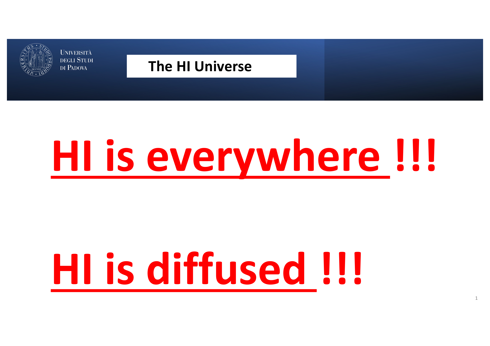
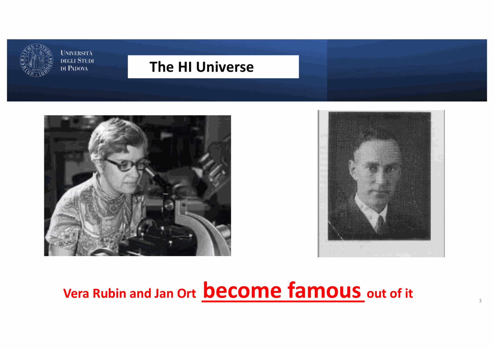

# Carraro 02 - Neutral Hydrogen and the 21cm Universe

*Course: Astrophysics of the Interstellar Medium, Master in Astrophysics and Cosmology, Università degli Studi di Padova*  
*Lecturer: Prof. Giovanni Carraro*  
*Index: [Astrophysics_of_the_Interstellar_Medium_MOC](../../../04_Atlas/Astrophysics_of_the_Interstellar_Medium_MOC.html)*

---

## the ubiquity of neutral hydrogen

hydrogen constitutes $\sim 73\%$ of the baryonic mass of the universe. in the interstellar medium of disk galaxies, neutral atomic hydrogen (H I) represents the most extensive gaseous reservoir, spreading far beyond the optical stellar radius into the extended disk and circumgalactic environment.

as stated in lecture:
> "H I is everywhere! H I is diffused!"

the historical path to observing this dominant phase required the emergence of radio astronomy:
- **Karl Jansky (1933)** detected extra-terrestrial radio static at $20.5\text{ MHz}$ from the Milky Way center.
- **Grote Reber (1937 - 1944)** built the first parabolic radio dish in his backyard, mapping the Galactic plane at $160\text{ MHz}$ and demonstrating that the emission was non-thermal.
- **H. C. van de Hulst (1944)**, urged by **Jan Oort**, theoretically predicted the hyperfine spin-flip line of neutral hydrogen at $\lambda \approx 21\text{ cm}$.
- **H. I. Ewen and E. M. Purcell (1951)** at Harvard first detected the $21\text{ cm}$ line, followed within weeks by C. A. Muller and Jan Oort in the Netherlands, and J. L. Pawsey in Australia.

---

## quantum mechanics of the 21 cm hyperfine line

the ground state of neutral hydrogen ($1^2S_{1/2}$) possesses zero orbital angular momentum ($L=0$). the electron has spin $S = 1/2$, and the proton has nuclear spin $I = 1/2$. the magnetic dipole moment of the electron interacts with the magnetic field produced by the nuclear magnetic dipole moment:

$$\hat{H}_{\text{hf}} = \frac{8\pi}{3} g_e \mu_B g_p \mu_N (\mathbf{S} \cdot \mathbf{I}) \delta(\mathbf{r})$$

the total angular momentum is $\mathbf{F} = \mathbf{S} + \mathbf{I}$:
- **triplet state ($F = 1$)**: parallel spins, statistical weight $g_1 = 2F + 1 = 3$.
- **singlet state ($F = 0$)**: anti-parallel spins, statistical weight $g_0 = 2F + 1 = 1$.

the energy difference between the states is minute:

$$\Delta E_{\text{hf}} = 5.874 \times 10^{-6}\text{ eV} = 9.412 \times 10^{-18}\text{ erg}$$

the corresponding transition frequency and wavelength are:

$$\nu_0 = \frac{\Delta E_{\text{hf}}}{h} = 1420.405751768\text{ MHz}$$
$$\lambda_0 = \frac{c}{\nu_0} = 21.106\text{ cm}$$

the equivalent excitation temperature is:

$$T_* = \frac{h\nu_0}{k} = 0.06816\text{ K}$$

### transition probability and lifetime

because the transition is an electric-dipole forbidden magnetic dipole transition ($M1$), the Einstein $A_{10}$ coefficient is exceptionally small:

$$A_{10} = \frac{64\pi^4 \nu_0^3}{3 h c^3} \lvert \mu_{10}\rvert^2 = 2.85 \times 10^{-15}\text{ s}^{-1}$$

the mean spontaneous radiative lifetime of an isolated excited H I atom is:

$$\tau_{\text{spont}} = \frac{1}{A_{10}} \approx 3.5 \times 10^{14}\text{ s} \approx 1.1 \times 10^7\text{ years}$$

despite this tiny transition rate, neutral hydrogen in galactic disks has enormous column densities ($N_{\text{HI}} \sim 10^{20} - 10^{22}\text{ cm}^{-2}$). along any typical line of sight, billions of atoms undergo spontaneous and stimulated transitions every second, making the $21\text{ cm}$ line bright and easily detectable.

---

## spin temperature and excitation balance

the relative population of the two hyperfine levels defines the **spin temperature** $T_s$ via the Boltzmann equation:

$$\frac{n_1}{n_0} = \frac{g_1}{g_0} \exp\left(-\frac{h\nu_0}{k T_s}\right) = 3 \exp\left(-\frac{0.0682\text{ K}}{T_s}\right)$$

since typical ISM kinetic temperatures exceed $T_k \sim 20 - 10000\text{ K} \gg 0.0682\text{ K}$, the exponential is close to unity:

$$\frac{n_1}{n_0} \approx 3 \left(1 - \frac{h\nu_0}{k T_s}\right) \approx 3$$

thus, $75\%$ of all hydrogen atoms reside in the upper state ($F=1$) and $25\%$ in the lower state ($F=0$), regardless of the exact value of $T_s$.

### mechanisms setting the spin temperature

three competing processes populate and depopulate the hyperfine levels:
1. **radiative transitions** with the cosmic microwave background ($T_{\text{CMB}} = 2.725\text{ K}$): rate $R_{\text{rad}}$.
2. **atomic collisions** with other H atoms, electrons, and protons: rate $C_{10} \propto n_{\text{H}} \sigma v$.
3. **resonant scattering of Lyman-alpha photons** (the **Wouthuysen-Field effect**): an H I atom absorbs a Ly$\alpha$ photon, jumps to the $2P$ state, and re-emits Ly$\alpha$ decaying to the other hyperfine state.

detailed balance gives:

$$T_s = \frac{T_{\text{CMB}} + y_c T_k + y_\alpha T_\alpha}{1 + y_c + y_\alpha}$$

where $y_c$ and $y_\alpha$ are the collisional and radiative coupling efficiencies:
- in the **CNM** ($n \sim 50\text{ cm}^{-3}$): atomic collisions dominate ($y_c \gg 1$), tightly locking $T_s \approx T_k \approx 50 - 100\text{ K}$.
- in the **WNM** ($n \sim 0.3\text{ cm}^{-3}$): collisions are less frequent, but Ly$\alpha$ pumping and residual collisions keep $T_s \sim 1000 - 4000\text{ K}$ (often below the kinetic temperature $T_k \approx 8000\text{ K}$).

---

## radiative transfer and column density derivation

the absorption coefficient corrected for stimulated emission is:

$$\kappa_\nu = \frac{h\nu_0}{4\pi} n_0 B_{01} \left(1 - \exp\left(-\frac{h\nu_0}{k T_s}\right)\right) \phi(\nu)$$

using Einstein relations ($g_0 B_{01} = g_1 B_{10}$, $A_{10} = \frac{2h\nu_0^3}{c^2} B_{10}$) and the Rayleigh-Jeans limit ($h\nu_0 / k T_s \ll 1$):

$$\kappa_\nu = \frac{3 c^2 A_{10} h}{32\pi k T_s \nu_0} n_{\text{HI}} \phi(\nu)$$

integrating along the path length $s$ yields the optical depth $\tau(v)$ as a function of Doppler velocity $v$:

$$\tau(v) = \int \kappa_v ds = \frac{3 c^3 A_{10} h}{32\pi k T_s \nu_0^2} \int n_{\text{HI}} \phi(v) ds$$

the observed brightness temperature $T_B(v)$ emerging from an isothermal cloud is:

$$T_B(v) = T_s (1 - e^{-\tau(v)})$$

### the optically thin limit

in the optically thin regime ($\tau(v) \ll 1$), we expand $1 - e^{-\tau(v)} \approx \tau(v)$, so $T_B(v) \approx T_s \tau(v)$. the spin temperature $T_s$ cancels out completely:

$$T_B(v) = \frac{3 c^3 A_{10} h}{32\pi k \nu_0^2} \int n_{\text{HI}} \phi(v) ds$$

integrating over the velocity profile $\int T_B(v) dv$:

$$\int_{-\infty}^\infty T_B(v) dv = \frac{3 c^3 A_{10} h}{32\pi k \nu_0^2} N_{\text{HI}}$$

substituting atomic constants ($A_{10} = 2.85 \times 10^{-15}\text{ s}^{-1}$, $\nu_0 = 1420.406\text{ MHz}$):

$$N_{\text{HI}} = \frac{32\pi k \nu_0^2}{3 c^3 A_{10} h} \int T_B(v) dv = 1.823 \times 10^{18} \int T_B(v) dv \quad [\text{cm}^{-2}]$$

where $T_B$ is in Kelvin and $v$ is in $\text{km s}^{-1}$.

this is one of the most powerful relations in observational astrophysics: **for optically thin gas, the area under the 21 cm emission line directly measures the total number of neutral hydrogen atoms along the column, independent of the gas temperature or distance.**

---

## milestone #1: mapping the milky way

in 1954 - 1957, Jan Oort, H. C. van de Hulst, C. A. Muller, G. Westerhout, and Maarten Schmidt exploited the $21\text{ cm}$ line to construct the first comprehensive map of the Milky Way's spiral structure.

### the tangent point method

inside the Solar circle ($R < R_0$), along any Galactic longitude $0^\circ < l < 90^\circ$, the line of sight intersects circular orbits at varying radial velocities:

$$v_r(l, R) = \left(\frac{\Theta(R)}{R} - \frac{\Theta_0}{R_0}\right) R_0 \sin l$$

the maximum radial velocity (the **terminal velocity** $v_{\text{term}}$) occurs at the **tangent point**, where the line of sight is perpendicular to the circular orbit ($R_{\text{min}} = R_0 \sin l$):

$$\Theta(R_{\text{min}}) = v_{\text{term}}(l) + \Theta_0 \sin l$$

by measuring $v_{\text{term}}$ across Galactic longitudes, Oort and collaborators determined the inner rotation curve $\Theta(R)$ and mapped the spiral arms (Sagittarius, Perseus, Scutum-Centaurus).

### milestone #1 revision: grand-design vs flocculent structure

for decades, the Westerhout & Schmidt (1957) map stood as textbook proof that the Milky Way is a classic grand-design 4-arm spiral galaxy.

prof. carraro highlighted the recent revision by **Balser & Burton (2025/2026)** (*Astronomical Journal*):
- the grand-design interpretation presupposed prominent continuous spiral arms and treated deviations as observational artifacts.
- analyzing modern high-resolution HI4PI all-sky data, Balser & Burton re-examined the high-velocity wings and inter-arm regions in the inner Galaxy.
- finding: neither shallow shoulders nor wide dips in integrated brightness temperature exist across the northern and southern quadrants as required by symmetric grand-design arms.
- conclusion: **the inner Milky Way neutral gas disk is disorganized and flocculent**, consisting of fragmented spiral segments and patchy armlets rather than continuous grand-design arms.

### warp and flaring in the outer disk

$21\text{ cm}$ surveys reveal two structural features in the outer Milky Way ($R > R_0$):
1. **Galactic Warp**: the midplane of the gas disk bends upward in the northern Galactic hemisphere (towards $l \approx 90^\circ$) by up to $1.5\text{ kpc}$, and bends downward in the southern hemisphere. the warp is likely driven by tidal interactions with the Magellanic Clouds or torque from a misaligned dark matter halo.
2. **Disk Flaring**: the vertical scale height $h_z$ of the H I gas increases from $\sim 150\text{ pc}$ at the Solar radius to $> 1\text{ kpc}$ at $R \sim 20\text{ kpc}$, caused by the diminishing vertical gravitational potential of the stellar disk at large Galactocentric radii.

---

## milestone #2: vera rubin and dark matter

in optical and radio observations of external spiral galaxies:
- Keplerian mechanics predicts that outside the visible stellar disk, where enclosed stellar mass is constant, the orbital velocity must decline:
  $$v(r) = \sqrt{\frac{G M(r)}{r}} \propto r^{-1/2}$$
- **Vera Rubin and Kent Ford (1970)** measured optical H II emission lines out to the edge of the optical disk, discovering flat rotation curves.
- radio astronomers extending rotation curves via $21\text{ cm}$ H I (which extends 2 to 4 times farther than optical light) demonstrated that $v(r) \approx \text{constant}$ well into the deep intergalactic space (up to $50\text{ kpc}$).
- this provided the definitive empirical proof for massive, quasi-spherical **Dark Matter Halos** dominating galaxy dynamics ($M(r) \propto r$).

---

## extragalactic hi surveys

prof. carraro surveyed the modern observational frontiers:

1. **The LITTLE THINGS Survey** (*Local Irregularities That Trace Luminosity Everywhere, Tree-ring Induced Test of Heritable Information In Nature's Goodness*):
   VLA high-resolution H I mapping of dwarf irregular galaxies (e.g. Haro 29, DDO 210), testing the core-cusp problem of dark matter halos and star formation thresholds at low metallicities.
2. **ALFALFA** (*Arecibo Legacy Fast ALFA Survey*):
   blind extragalactic $21\text{ cm}$ survey covering $7000\text{ deg}^2$, cataloguing over 30,000 extragalactic H I sources out to $z \sim 0.06$. it provided the definitive measurement of the local H I Mass Function (HIMF):
   $$\phi(M_{\text{HI}}) dM_{\text{HI}} = \phi^* \left(\frac{M_{\text{HI}}}{M^*}\right)^\alpha \exp\left(-\frac{M_{\text{HI}}}{M^*}\right) \frac{dM_{\text{HI}}}{M^*}$$
   with faint-end slope $\alpha \approx -1.33$.
3. **High-Velocity Clouds (HVCs)**:
   clouds of neutral hydrogen moving with velocities that deviate drastically from Galactic rotation ($\lvert v_{\text{LSR}}\rvert > 90\text{ km s}^{-1}$), representing infalling primordial gas streams, tidal debris from the Magellanic Stream, and returning fountains from Galactic superbubbles.

---

## see also

- [Astrophysics_of_the_Interstellar_Medium_MOC](../../../04_Atlas/Astrophysics_of_the_Interstellar_Medium_MOC.html)
- [HI 21 cm hyperfine transition](../../../03_Zettel/Theory/HI%2021%20cm%20hyperfine%20transition.html)
- [Spin temperature and 21 cm radiative transfer](../../../03_Zettel/Theory/Spin%20temperature%20and%2021%20cm%20radiative%20transfer.html)
- [Galactic HI kinematics and Milky Way spiral structure](../../../03_Zettel/Theory/Galactic%20HI%20kinematics%20and%20Milky%20Way%20spiral%20structure.html)
- [Carraro_01_Introduction_and_Multi-phase_ISM](./Carraro_01_Introduction_and_Multi-phase_ISM.html)
- [Carraro_03_HII_Regions_and_Photoionized_Gas](./Carraro_03_HII_Regions_and_Photoionized_Gas.html)
- [Rotation curves](../../../03_Zettel/Theory/Rotation%20curves.html)
- [Milky Way structure](../../../03_Zettel/Theory/Milky%20Way%20structure.html)

## Lecture Visuals & 21cm Physics

*Figure ISM-01: The 21cm Hyperfine Ground-State Transition of Neutral Hydrogen. Arises from the magnetic dipole interaction between electron and proton nuclear spins ($F = 1 \to F = 0$, $\Delta E = 5.87 \times 10^{-6}\text{ eV}$, $\nu_{10} = 1420.4057\text{ MHz}$, Einstein coefficient $A_{10} = 2.85 \times 10^{-15}\text{ s}^{-1}$).*

*Figure ISM-02: Galactic longitude-velocity $(l, v_{\mathrm{LSR}})$ diagram and reconstructed spiral structure of the Milky Way derived from 21cm line surveys using the kinematic distance method.*

  <h4 class="backlinks-title">Linked References (4)</h4>
  <ul class="backlinks-list">
    <li class="backlink-item-wrap"><a href="../../../03_Zettel/Theory/Galactic%20HI%20kinematics%20and%20Milky%20Way%20spiral%20structure.html" class="backlink-item">Galactic HI kinematics and Milky Way spiral structure</a></li>
    <li class="backlink-item-wrap"><a href="../../../03_Zettel/Theory/HI%2021%20cm%20hyperfine%20transition.html" class="backlink-item">HI 21 cm hyperfine transition</a></li>
    <li class="backlink-item-wrap"><a href="../../../03_Zettel/Theory/Spin%20temperature%20and%2021%20cm%20radiative%20transfer.html" class="backlink-item">Spin temperature and 21 cm radiative transfer</a></li>
    <li class="backlink-item-wrap"><a href="../../../04_Atlas/Astrophysics_of_the_Interstellar_Medium_MOC.html" class="backlink-item">Astrophysics_of_the_Interstellar_Medium_MOC</a></li>
  </ul>

