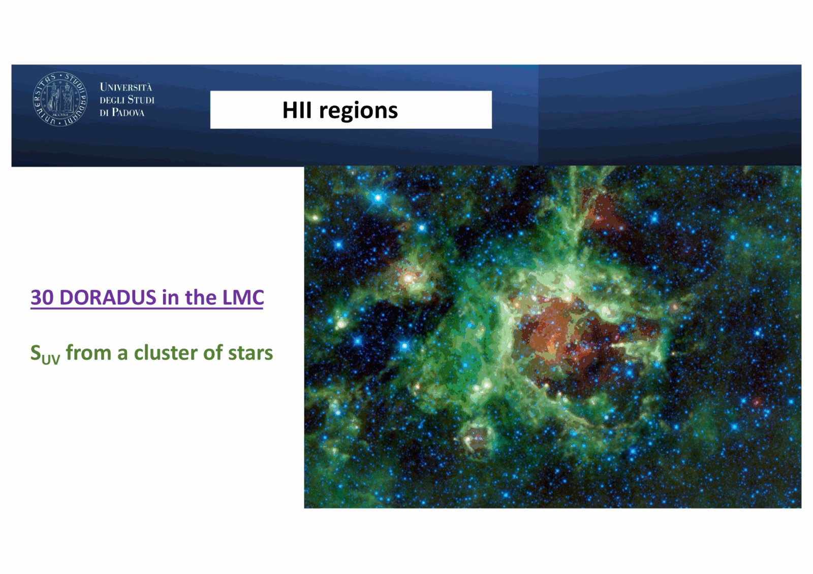
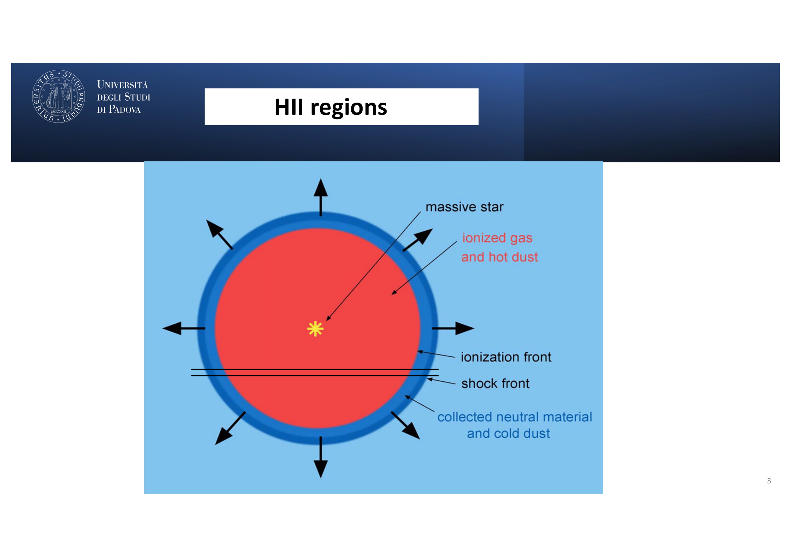


# Carraro 03 - HII Regions and Photoionized Gas

*Course: Astrophysics of the Interstellar Medium, Master in Astrophysics and Cosmology, Università degli Studi di Padova*  
*Lecturer: Prof. Giovanni Carraro*  
*Index: [Astrophysics_of_the_Interstellar_Medium_MOC](../../../04_Atlas/Astrophysics_of_the_Interstellar_Medium_MOC.html)*

---

## photoionization physics

H II regions are photoionized plasma nebulae surrounding young, massive OB stars (such as 30 Doradus in the LMC, ionised by the R136 super star cluster). their physical state is dictated by the interaction of ionizing photons with the neutral gas.

neutral hydrogen has an ionization potential of $\chi_H = 13.598\text{ eV}$, corresponding to the Lyman limit:

$$\lambda_0 = \frac{h c}{\chi_H} = 911.8\text{ \AA}$$

photons with $\nu \ge \nu_0$ photoionize hydrogen via the photoelectric effect ($H^0 + h\nu \rightarrow p + e^-$). the photoionization cross-section from the ground state ($n=1$) is:

$$\sigma_\nu(H^0) = \sigma_0 \left(\frac{\nu_0}{\nu}\right)^3 \quad \text{for } \nu \ge \nu_0$$

where the threshold cross-section is $\sigma_0 \approx 6.30 \times 10^{-18}\text{ cm}^2$. the steep $\nu^{-3}$ dependence means photons just above the Lyman limit are absorbed with extreme efficiency, while hard UV and X-ray photons penetrate much deeper into the surrounding medium.

the total rate of ionizing Lyman continuum photons emitted by a star is:

$$Q(H^0) = \int_{\nu_0}^\infty \frac{L_\nu}{h\nu} d\nu \quad [\text{photons s}^{-1}]$$

typical values:
- O3 V star: $Q(H^0) \sim 10^{50}\text{ s}^{-1}$
- O5 V star: $Q(H^0) \sim 4 \times 10^{49}\text{ s}^{-1}$
- O7 V star: $Q(H^0) \sim 10^{49}\text{ s}^{-1}$
- B0 V star: $Q(H^0) \sim 4 \times 10^{47}\text{ s}^{-1}$
- B1 V star: $Q(H^0) \sim 3 \times 10^{45}\text{ s}^{-1}$

stars later than B1 produce negligible ionizing fluxes, so observable H II regions are strict tracers of very recent star formation ($\tau_* \lesssim 5 - 10\text{ Myr}$).

---

## the strömgren sphere derivation

consider an idealized, homogeneous gas cloud of pure hydrogen with uniform density $n_H$ surrounding a single ionizing source.

### photoionization equilibrium

in a steady state, the total number of photoionizations occurring in the nebula per unit time must balance the total number of radiative recombinations.

radiative recombinations occur at rate per unit volume:

$$\dot{n}_{\text{rec}} = n_e n_p \alpha(T_e)$$

where $\alpha(T_e)$ is the recombination coefficient.

### case a vs case b recombination

- **Case A (optically thin to ionizing photons)**: recombinations directly to the ground state ($n=1$) emit a Lyman continuum photon ($h\nu \ge 13.6\text{ eV}$). if the nebula is tiny or optically thin, this photon escapes into the wider universe.
  $$\alpha_A(T_e) = \sum_{n=1}^\infty \alpha_n(T_e)$$
- **Case B (optically thick, on-the-spot approximation)**: in any realistic astrophysical nebula, the optical depth at the Lyman limit is huge ($\tau_0 \sim 10^2 - 10^4$). a photon emitted from a recombination directly into $n=1$ has a mean free path $\ell_{\text{mfp}} = (n_H \sigma_0)^{-1} \sim 0.05\text{ pc} \ll R_S$. it is re-absorbed on the spot by a neighboring neutral H atom, causing another ionization. therefore, ground-state recombinations produce zero net loss of ionizing photons. we consider only recombinations to excited states ($n \ge 2$):
  $$\alpha_B(T_e) = \sum_{n=2}^\infty \alpha_n(T_e)$$

at $T_e = 10^4\text{ K}$, $\alpha_B \approx 2.59 \times 10^{-13}\text{ cm}^3\text{ s}^{-1}$, with temperature dependence $\alpha_B(T_e) \approx 2.6 \times 10^{-13} (T_e / 10^4\text{ K})^{-0.8}\text{ cm}^3\text{ s}^{-1}$.

### the strömgren equation

inside the ionized sphere, hydrogen is nearly completely ionized ($n_e \approx n_p \approx n_H$, with neutral fraction $x_{\text{HI}} = n_{\text{HI}}/n_H \sim 10^{-4}$). equating ionizing photon production to total volume recombinations:

$$Q(H^0) = \int_0^{R_S} 4\pi r^2 n_e n_p \alpha_B(T_e) dr = \frac{4}{3}\pi R_S^3 n_H^2 \alpha_B(T_e)$$

solving for the **Strömgren radius** $R_S$:

$$R_S = \left(\frac{3 Q(H^0)}{4\pi n_H^2 \alpha_B(T_e)}\right)^{1/3}$$

### numerical scaling

substituting canonical values for an O5 V star ($Q = 4 \times 10^{49}\text{ s}^{-1}$) in a cloud of density $n_H = 100\text{ cm}^{-3}$ at $T_e = 10^4\text{ K}$:

$$R_S = \left(\frac{3 \times (4 \times 10^{49})}{4\pi \times 10^4 \times (2.6 \times 10^{-13})}\right)^{1/3} \approx 1.54 \times 10^{18}\text{ cm} \approx 0.5\text{ pc}$$

the Strömgren radius scales as $R_S \propto Q^{1/3} n_H^{-2/3}$. density exerts a far stronger geometric control than stellar luminosity.

the transition boundary between fully ionized gas and neutral gas (the **ionization front**) is remarkably thin:

$$\Delta R_{\text{IF}} \sim \frac{1}{n_H \sigma_0} \sim \frac{1}{100 \times 6.3 \times 10^{-18}} \approx 1.6 \times 10^{15}\text{ cm} \approx 100\text{ AU} \ll R_S$$

the ionization fraction drops from $99.9\%$ to $0.1\%$ over a fraction of a percent of the radius.

---

## thermal equilibrium and cooling mechanisms

the kinetic temperature of the electron gas ($T_e \sim 8000 - 10000\text{ K}$) is established by exact balance between microphysical heating and cooling rates:

$$G(T_e) = L(T_e)$$

### heating rate $G$

the dominant heating source is photoionization. an incoming photon with $h\nu > h\nu_0$ ejects a photoelectron carrying excess kinetic energy:

$$E_{\text{excess}} = h\nu - h\nu_0$$

the heating rate per unit volume is:

$$G = n_{\text{HI}} \int_{\nu_0}^\infty \frac{4\pi J_\nu}{h\nu} \sigma_\nu (h\nu - h\nu_0) d\nu$$

the photoelectrons thermalize instantaneously via Coulomb collisions with the surrounding electron sea, setting up a Maxwellian velocity distribution.

### cooling rate $L$

recombination removes kinetic energy ($\approx k T_e$ per recombining electron), and thermal bremsstrahlung (free-free emission) radiates energy:

$$L_{\text{ff}} = 1.42 \times 10^{-27} T_e^{1/2} Z^2 n_e n_i \bar{g}_{\text{ff}} \quad [\text{erg s}^{-1}\text{ cm}^{-3}]$$

however, **collisional excitation of low-lying metastable states of trace metal ions followed by spontaneous radiative decay (forbidden line cooling) completely dominates the cooling budget** ($> 90\%$).

because hydrogen and helium have excitation energies ($E_2 - E_1 = 10.2\text{ eV}$, corresponding to $T \sim 1.2 \times 10^5\text{ K}$) far above the mean kinetic energy of a $10^4\text{ K}$ electron ($k T_e \approx 0.86\text{ eV}$), thermal electrons cannot excite them. trace heavy elements (O, N, S, C, Ne) with fine-structure and low-lying terms ($E \sim 1 - 3\text{ eV}$) absorb this energy through electron collisions and radiatively de-excite via forbidden transitions.

---

## forbidden line physics

in classical dipole selection rules, transitions between states of the same parity or differing spin ($\Delta S \ne 0$) are strictly forbidden (electric dipole moment $\langle f | \mathbf{d} | i \rangle = 0$).

however, higher-order multipole transitions:
- **magnetic dipole ($M1$)**: transition probability $A_{ji} \sim 10^{-2} - 10^2\text{ s}^{-1}$
- **electric quadrupole ($E2$)**: transition probability $A_{ji} \sim 10^{-4} - 10^{-1}\text{ s}^{-1}$

are non-zero. in terrestrial laboratories, an atom in a metastable state with lifetime $\tau = 1/A_{ji} \sim 1 - 100\text{ s}$ collides with other particles billions of times before it can radiate, undergoing non-radiative de-excitation. in the diffuse ISM ($n_e \sim 10^2 - 10^4\text{ cm}^{-3}$), the mean collision time is hours to days:

$$\tau_{\text{coll}} = \frac{1}{n_e q_{ji}} \gg \frac{1}{A_{ji}}$$

the atom has ample time to spontaneously emit a photon, producing sharp, bright **forbidden lines** (denoted by square brackets, e.g. [O III], [N II], [S II]).

---

## electron configuration and term diagrams

prof. carraro analyzed two distinct atomic electron configurations from the slides:

### 1. $p^2$ configuration: [O III] and [N II]

ions with two equivalent $p$ electrons ($p^2$) include $O^{2+}$ and $N^+$. Hund's rules and the Pauli exclusion principle dictate three terms:
- ground term: $^3P$ (split by spin-orbit into $^3P_0, ^3P_1, ^3P_2$)
- first excited metastable term: $^1D_2$ (excitation energy $\Delta E \approx 2.51\text{ eV}$ for [O III]; $1.90\text{ eV}$ for [N II])
- second excited metastable term: $^1S_0$ (excitation energy $\Delta E \approx 5.36\text{ eV}$ for [O III]; $4.05\text{ eV}$ for [N II])

transitions between these terms:
- $^1S_0 \rightarrow ^1D_2$: auroral line ([O III] $\lambda 4363$; [N II] $\lambda 5755$)
- $^1D_2 \rightarrow ^3P_2$: nebular line ([O III] $\lambda 5007$; [N II] $\lambda 6583$)
- $^1D_2 \rightarrow ^3P_1$: nebular line ([O III] $\lambda 4959$; [N II] $\lambda 6548$)
- $^1S_0 \rightarrow ^3P_1$: transauroral line ([O III] $\lambda 2321$; [N II] $\lambda 3063$)

the ratio of nebular line transition probabilities is fixed by pure quantum mechanics:

$$\frac{I(\lambda 5007)}{I(\lambda 4959)} = \frac{A(^1D_2 \rightarrow ^3P_2)}{A(^1D_2 \rightarrow ^3P_1)} = 2.88 \approx 3.0$$

### 2. $p^3$ configuration: [O II] and [S II]

ions with three equivalent $p$ electrons ($p^3$) include $O^+$ and $S^+$. the terms are:
- ground term: $^4S_{3/2}$
- first excited term: doublet $^2D_{3/2}$ and $^2D_{5/2}$ (closely spaced: $1.842\text{ eV}$ and $1.846\text{ eV}$ for [S II]; $3.327\text{ eV}$ and $3.325\text{ eV}$ for [O II])
- second excited term: doublet $^2P_{1/2}$ and $^2P_{3/2}$

transitions from the $^2D$ doublet to the ground $^4S_{3/2}$ term yield closely spaced doublets:
- [S II]: $\lambda 6717$ ($^2D_{5/2} \rightarrow ^4S_{3/2}$) and $\lambda 6731$ ($^2D_{3/2} \rightarrow ^4S_{3/2}$)
- [O II]: $\lambda 3729$ ($^2D_{5/2} \rightarrow ^4S_{3/2}$) and $\lambda 3726$ ($^2D_{3/2} \rightarrow ^4S_{3/2}$)

---

## plasma diagnostics: measuring $T_e$ and $n_e$

the sensitivity of different levels to temperature versus density provides nebular diagnostics.

### electron temperature diagnostic: [O III]

the two excited states $^1S_0$ (level 3) and $^1D_2$ (level 2) have substantially different excitation thresholds from the ground state $^3P$ (level 1):
- $E_{21} = 2.48\text{ eV} \implies \Delta E/k \approx 28800\text{ K}$
- $E_{31} = 5.36\text{ eV} \implies \Delta E/k \approx 62000\text{ K}$

because the energy difference between level 3 and level 2 is large ($E_{32} = 2.84\text{ eV}$), collisional excitation to level 3 requires high-velocity electrons in the Maxwellian tail. the relative excitation rate scales exponentially with temperature:

$$\frac{q_{13}}{q_{12}} = \frac{\Omega_{13}}{\Omega_{12}} \exp\left(-\frac{E_{32}}{k T_e}\right)$$

in the low-density regime ($n_e < n_{\text{crit}} \approx 7 \times 10^5\text{ cm}^{-3}$), every collisional excitation results in radiative decay. substituting the atomic parameters from Carraro's slide 5:
- for [O III]: $A_{32} = 1.78\text{ s}^{-1} (\lambda 4363)$, $A_{31} = 0.223\text{ s}^{-1} (\lambda 2321)$, $\Omega_{13} = 0.293$, $\Omega_{12} = 2.27 (\lambda 5007)$

the flux ratio is given directly by prof. carraro's equation:

$$\frac{F(\lambda 4363)}{F(\lambda 4959) + F(\lambda 5007)} = 0.132 \times e^{-32970 / T_e}$$

by measuring the flux of the faint auroral line [O III] $\lambda 4363$ relative to the strong nebular lines $\lambda 4959, 5007$, **the electron temperature $T_e$ can be measured directly**, largely independent of density.

### electron density diagnostic: [S II] and [O II]

the doublet levels $^2D_{5/2}$ (level 2) and $^2D_{3/2}$ (level 3) in the $p^3$ configuration have nearly identical excitation energies ($\Delta E / k \sim 50\text{ K}$). their relative collisional excitation rate is determined solely by the ratio of their collision strengths (which equals the ratio of their statistical weights, $g_2/g_3$):

$$\frac{q_{12}}{q_{13}} = \frac{\Omega_{12}}{\Omega_{13}} = \frac{g_2}{g_3}$$

however, their radiative transition probabilities $A_{ji}$ differ significantly:
- for [S II]: $A_{21} = 8.82 \times 10^{-4}\text{ s}^{-1} (\lambda 6731)$ while $A_{31} = 2.60 \times 10^{-4}\text{ s}^{-1} (\lambda 6717)$
- for [O II]: $A_{21} = 3.50 \times 10^{-5}\text{ s}^{-1} (\lambda 3729)$ while $A_{31} = 1.79 \times 10^{-4}\text{ s}^{-1} (\lambda 3726)$

defining the dimensionless parameter $x = 10^{-2} \frac{n_e}{T_e^{1/2}}$, prof. carraro's formula for [S II] is:

$$\frac{F(\lambda 6717)}{F(\lambda 6731)} = 1.49 \left(\frac{1 + 3.77 x}{1 + 12.8 x}\right)$$

#### limiting cases:
1. **Low-density limit ($n_e \rightarrow 0$, $x \rightarrow 0$)**:
   collisional de-excitation is negligible; every collision results in a photon. the flux ratio equals the ratio of collisional excitation rates:
   $$\frac{F(\lambda 6717)}{F(\lambda 6731)} \rightarrow 1.49 \approx \frac{g(^2D_{5/2})}{g(^2D_{3/2})} = \frac{6}{4} = 1.50$$
2. **High-density limit ($n_e \rightarrow \infty$, $x \rightarrow \infty$)**:
   collisions dominate; the populations reach Boltzmann thermodynamic equilibrium ($n_3/n_2 = g_3/g_2 = 4/6$). the emission ratio is governed by the radiative transition rates:
   $$\frac{F(\lambda 6717)}{F(\lambda 6731)} \rightarrow 1.49 \times \frac{3.77}{12.8} \approx 0.44 \approx \frac{g_3 A_{31}}{g_2 A_{21}}$$

between $n_e \sim 10^2\text{ cm}^{-3}$ and $n_e \sim 10^4\text{ cm}^{-3}$, the line ratio varies monotonically from $1.49$ down to $0.44$, **serving as a sensitive barometer for the electron density $n_e$**.

---

## primordial helium abundance ($Y_p$)

H II regions serve as cosmological laboratories for Big Bang Nucleosynthesis (BBN). 

neutral helium has an ionization potential of $24.58\text{ eV}$. in the inner parts of H II regions around stars hotter than $\sim 35000\text{ K}$, helium is singly ionized ($He^+$). as electrons recombine with $He^+$, they cascade through singlet and triplet levels, emitting optical recombination lines:
- He I $\lambda 4471$ ($4^3D \rightarrow 2^3P$)
- He I $\lambda 5876$ ($3^3D \rightarrow 2^3P$)
- He I $\lambda 6678$ ($3^1D \rightarrow 2^1P$)

because these are recombination lines like the hydrogen Balmer lines, the line intensity ratio $I(\text{He I})/I(\text{H}\beta)$ depends only weakly on $T_e$ and directly measures the ionic abundance ratio:

$$\frac{n(He^+)}{n(H^+)} = \frac{I(\lambda 5876)}{I(\text{H}\beta)} \frac{\alpha_{\text{eff}}(\text{H}\beta)}{\alpha_{\text{eff}}(\lambda 5876)}$$

### cosmological extrapolation

stars synthesize additional helium over time along with oxygen and nitrogen via stellar nucleosynthesis. to isolate the **primordial helium abundance** $Y_p$:
1. astronomers measure $Y = \frac{4 n(He)}{n(H) + 4 n(He)}$ and metallicity (e.g. $O/H$) in extremely metal-poor blue compact dwarf galaxies (such as I Zw 18 and SBS 0335-052).
2. they perform a linear regression:
   $$Y = Y_p + \left(\frac{dY}{dZ}\right) Z$$
3. extrapolating to zero metallicity ($Z \rightarrow 0$) yields the primordial mass fraction:
   $$Y_p \approx 0.245 \pm 0.003$$
   providing tight concordance constraints with Planck CMB acoustic peaks and Standard Big Bang Nucleosynthesis.

---

## infrared fine-structure lines

optical lines suffer severe extinction when H II regions remain embedded in their natal dusty molecular cores. infrared fine-structure lines arise from magnetic dipole transitions between sub-levels of ground state terms:
- [Ne II] $12.81\,\mu\text{m}$ ($^2P_{1/2} \rightarrow ^2P_{3/2}$)
- [Ne III] $15.55\,\mu\text{m}$ ($^3P_1 \rightarrow ^3P_2$)
- [S III] $18.71\,\mu\text{m}$ ($^3P_1 \rightarrow ^3P_0$) and $33.48\,\mu\text{m}$ ($^3P_2 \rightarrow ^3P_1$)
- [C II] $157.7\,\mu\text{m}$ ($^2P_{3/2} \rightarrow ^2P_{1/2}$)

these IR lines:
1. have very low excitation potentials ($\Delta E / k \sim 100 - 1000\text{ K}$), meaning they can be excited even in cooler boundary zones.
2. suffer virtually zero dust extinction ($A_{15\mu\text{m}} / A_V \sim 0.02$).
3. provide diagnostics of obscured starbursts and ultraluminous infrared galaxies (ULIRGs) using space observatories (Spitzer, Herschel, JWST).

---

## see also

- [Astrophysics_of_the_Interstellar_Medium_MOC](../../../04_Atlas/Astrophysics_of_the_Interstellar_Medium_MOC.html)
- HII regions and Strömgren sphere physics
- [Forbidden line diagnostics of electron temperature and density](../../../03_Zettel/Theory/Forbidden%20line%20diagnostics%20of%20electron%20temperature%20and%20density.html)
- [Primordial helium abundance from HII regions](../../../03_Zettel/Theory/Primordial%20helium%20abundance%20from%20HII%20regions.html)
- [Carraro_01_Introduction_and_Multi-phase_ISM](./Carraro_01_Introduction_and_Multi-phase_ISM.html)
- [Carraro_04_Massive_Stars_Feedback_and_Stellar_Winds](./Carraro_04_Massive_Stars_Feedback_and_Stellar_Winds.html)
- [BBN_overview](../../../03_Zettel/Theory/BBN_overview.html)

## Lecture Visuals & Strömgren Physics

*Figure ISM-03: Ionization structure of an HII region around an O-type star. In steady state, ionizing photon rate equals total Case B recombinations: $Q(H^0) = \frac{4\pi}{3} R_S^3 n_e n_p \alpha_B(T)$, defining the sharp Strömgren transition boundary.*

*Figure ISM-04: Diagnostic optical emission line spectra of photoionized HII gas showing collisionally excited forbidden lines $[O III]\,\lambda\lambda 4959, 5007$, $[N II]\,\lambda\lambda 6548, 6584$, and $[S II]\,\lambda\lambda 6716, 6731$ used to measure electron temperature $T_e$ and density $n_e$.*


  <h4 class="backlinks-title">Linked References (8)</h4>
  <ul class="backlinks-list">
    <li class="backlink-item-wrap"><a href="../../../04_Atlas/Astrophysics_of_the_Interstellar_Medium_MOC.html" class="backlink-item">Astrophysics_of_the_Interstellar_Medium_MOC</a></li>
    <li class="backlink-item-wrap"><a href="./Carraro_01_Introduction_and_Multi-phase_ISM.html" class="backlink-item">Carraro_01_Introduction_and_Multi-phase_ISM</a></li>
    <li class="backlink-item-wrap"><a href="./Carraro_02_Neutral_Hydrogen_and_21cm_Universe.html" class="backlink-item">Carraro_02_Neutral_Hydrogen_and_21cm_Universe</a></li>
    <li class="backlink-item-wrap"><a href="./Carraro_04_Massive_Stars_Feedback_and_Stellar_Winds.html" class="backlink-item">Carraro_04_Massive_Stars_Feedback_and_Stellar_Winds</a></li>
    <li class="backlink-item-wrap"><a href="./Carraro_05_Interstellar_Dust_and_Extinction.html" class="backlink-item">Carraro_05_Interstellar_Dust_and_Extinction</a></li>
    <li class="backlink-item-wrap"><a href="../../../03_Zettel/Theory/Forbidden%20line%20diagnostics%20of%20electron%20temperature%20and%20density.html" class="backlink-item">Forbidden line diagnostics of electron temperature and density</a></li>
    <li class="backlink-item-wrap"><a href="../../../03_Zettel/Theory/HII%20regions%20and%20Stromgren%20sphere%20physics.html" class="backlink-item">HII regions and Stromgren sphere physics</a></li>
    <li class="backlink-item-wrap"><a href="../../../03_Zettel/Theory/Primordial%20helium%20abundance%20from%20HII%20regions.html" class="backlink-item">Primordial helium abundance from HII regions</a></li>
  </ul>

