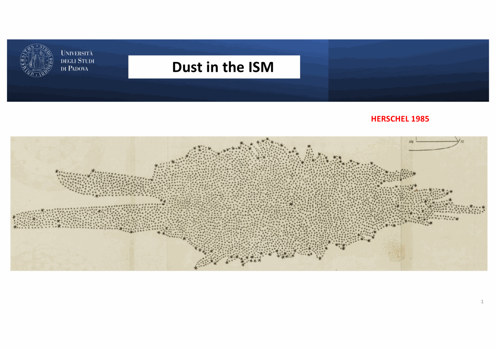
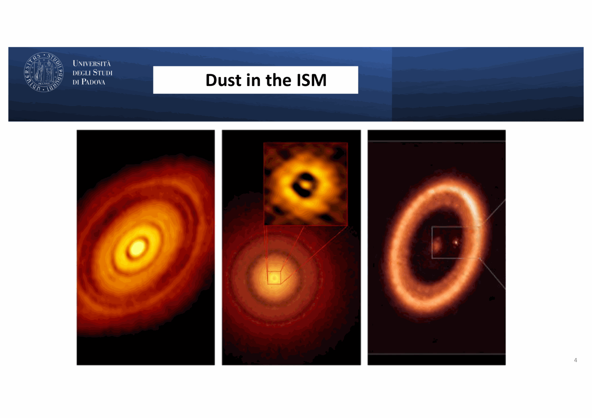
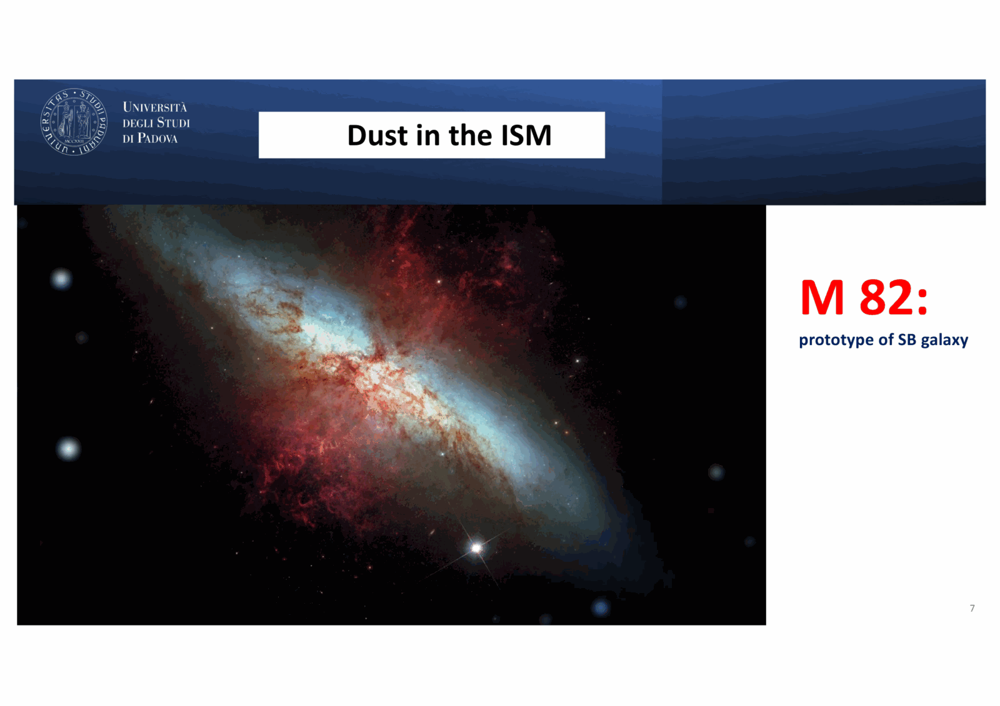


# Carraro 05 - Interstellar Dust and Extinction

*Course: Astrophysics of the Interstellar Medium, Master in Astrophysics and Cosmology, Università degli Studi di Padova*  
*Lecturer: Prof. Giovanni Carraro*  
*Index: [Astrophysics_of_the_Interstellar_Medium_MOC](../../../04_Atlas/Astrophysics_of_the_Interstellar_Medium_MOC.html)*

---

## the discovery of interstellar dust: trumpler (1930)

prior to 1930, interstellar space was widely assumed to be completely transparent. **Robert J. Trumpler (1930)** overturned this paradigm by studying open star clusters in the Galactic plane (such as NGC 6705 / Messier 11).

Trumpler determined two independent distance estimates for each cluster:
1. **Photometric Distance ($d_L$)**: inferred from the apparent brightness and spectral types of cluster stars via the inverse-square law:
   $$d_L = \sqrt{\frac{L}{4\pi F}}$$
2. **Angular Diameter Distance ($d_D$)**: inferred from the measured angular diameter $\theta$ under the assumption that open clusters have a roughly constant physical linear diameter $D$:
   $$d_D = \frac{D}{\theta}$$

plotting $d_D$ against $d_L$, Trumpler found that for nearby clusters ($d < 1\text{ kpc}$), $d_D \approx d_L$. however, at larger distances, $d_L$ systematically exceeded $d_D$ ($d_L / d_D$ grew monotonically with distance). 

if the space were transparent, clusters would have to physically swell in size the farther they were from Earth. Trumpler correctly rejected this geocentric absurdity, proving that **interstellar space contains fine absorbing and scattering dust that extinguishes starlight**, making distant stars appear fainter and artificially placing them at larger photometric distances.

---

## extinction, reddening, and the $R_V$ parameter

### definitions

- **Extinction ($A_\lambda$)**: the total reduction in apparent magnitude at wavelength $\lambda$ due to absorption and scattering by dust:
  $$A_\lambda = m_\lambda - m_{\lambda, 0} = 2.5 \log_{10}(F_{\lambda, 0}/F_\lambda) = 1.086 \, \tau_\lambda$$
  where $\tau_\lambda = \int \kappa_\lambda \rho_{\text{dust}} ds$ is the dust optical depth.
- **Color Excess ($E(B-V)$)**: the differential extinction between the $B$ ($4400\text{ \AA}$) and $V$ ($5500\text{ \AA}$) optical bands:
  $$E(B-V) = (B-V) - (B-V)_0 = A_B - A_V$$
  because dust scatters short-wavelength (blue) light much more efficiently than long-wavelength (red) light, starlight is systematically **reddened**.
- **Total-to-Selective Extinction Ratio ($R_V$)**:
  $$R_V = \frac{A_V}{E(B-V)}$$

### physical meaning of $R_V$

$R_V$ is an optical proxy for the average grain size along the line of sight:
- **standard diffuse ISM**: $R_V \approx 3.1 \pm 0.1$. typical grain radii are $a \sim 0.05 - 0.25 \, \mu\text{m}$.
- **dense molecular clouds**: $R_V \approx 4.0 - 5.5$. in dense, shielded environments, dust grains coagulate and grow icy mantles ($H_2O, CO, CO_2$), shifting the grain size distribution toward larger radii. larger grains scatter all optical wavelengths more uniformly ("grey extinction"), producing a flatter optical extinction curve and a larger $R_V$.
- **low-density / high-latitude lines of sight**: $R_V \approx 2.1 - 2.6$, indicating an abundance of smaller-than-average grains.

---

## the cardelli, clayton, and mathis (ccm 1989) extinction law

in their foundational paper (*ApJ*, 345, 245, 1989; > 11,500 citations), Cardelli, Clayton, & Mathis demonstrated that extinction curves from the near-IR through the far-UV ($0.3 \, \mu\text{m}^{-1} \le x \le 10 \, \mu\text{m}^{-1}$, where $x \equiv 1/\lambda$) form a one-parameter family governed entirely by $R_V$:

$$\frac{A_\lambda}{A_V} = a(x) + \frac{b(x)}{R_V}$$

prof. carraro's slide 14 details the exact analytical polynomials for each spectral regime:

### 1. Infrared Regime ($0.3 \, \mu\text{m}^{-1} \le x \le 1.1 \, \mu\text{m}^{-1}$):
$$a(x) = 0.574 \, x^{1.61}$$
$$b(x) = -0.527 \, x^{1.61}$$

in the infrared, extinction follows a universal power law $A_\lambda \propto \lambda^{-1.61}$ to $\lambda^{-1.8}$, virtually independent of $R_V$.

### 2. Optical / Near-IR Regime ($1.1 \, \mu\text{m}^{-1} \le x \le 3.3 \, \mu\text{m}^{-1}$, with $y \equiv x - 1.82$):
$$a(x) = 1 + 0.17699 y - 0.50447 y^2 - 0.02427 y^3 + 0.72085 y^4 + 0.01979 y^5 - 0.77530 y^6 + 0.32999 y^7$$
$$b(x) = 1.41338 y + 2.28305 y^2 + 1.07233 y^3 - 5.38434 y^4 - 0.62251 y^5 + 5.30260 y^6 - 2.09002 y^7$$

### 3. Ultraviolet Regime ($3.3 \, \mu\text{m}^{-1} \le x \le 8.0 \, \mu\text{m}^{-1}$):
$$a(x) = 1.752 - 0.316 x - \frac{0.104}{(x - 4.67)^2 + 0.341} + F_a(x)$$
$$b(x) = -3.090 + 1.825 x + \frac{1.206}{(x - 4.62)^2 + 0.263} + F_b(x)$$

where the Lorentzian Drude terms represent the famous **$2175\text{ \AA}$ extinction bump** ($x_0 \approx 4.6\text{ }\mu\text{m}^{-1}$).

---

## spectral features of interstellar dust

### 1. the 2175 å extinction bump

centered at $\lambda \approx 2175\text{ \AA}$ ($x \approx 4.6\text{ }\mu\text{m}^{-1}$) with full-width at half-maximum $\gamma \approx 1.0\text{ }\mu\text{m}^{-1}$, this is the strongest spectral feature in the interstellar extinction curve.

- **carrier identification**: $\pi \rightarrow \pi^*$ electronic plasmon resonance in $sp^2$-hybridized aromatic carbon rings (small graphite flakes or polycyclic aromatic hydrocarbons).
- **environmental variations**:
  - *Milky Way*: prominent, ubiquitous $2175\text{ \AA}$ bump.
  - *LMC*: weaker bump, steeper far-UV rise.
  - *SMC*: virtually no bump at all, exhibiting an extremely steep far-UV power-law rise. this reflects the lower metallicity and intense radiation field of the SMC, which destroys the delicate carbonaceous carriers.

### 2. diffuse interstellar bands (dibs)

first discovered by Mary Lea Heger (1919) and Merrill (1934), DIBs are hundreds of optical absorption features (e.g. $\lambda 4430\text{ \AA}, \lambda 5780\text{ \AA}, \lambda 5797\text{ \AA}, \lambda 6614\text{ \AA}$) observed in the spectra of reddened stars.

key empirical properties from lecture:
- they do not share stellar radial velocities; they match the Doppler shifts of interstellar lines like Na I D1/D2 and Ca II H/K.
- their equivalent widths generally correlate with $E(B-V)$, but with significant line-of-sight scatter, indicating they are not tied directly to bulk grain mass.
- Carraro slide 26 notes: $\lambda 4430 \approx 2 \times 2175\text{ \AA}$ and $\lambda 6614 \approx 3 \times 2175\text{ \AA}$, historically prompting speculation about electronic transitions in molecular hydrogen ($H_2$).
- modern laboratory astrophysics confirmation: in 2015, Campbell et al. conclusively proved that **the buckminsterfullerene cation ($C_{60}^+$)** is the carrier of two near-infrared DIBs at $9577\text{ \AA}$ and $9632\text{ \AA}$. the remaining hundreds of optical DIBs are attributed to large carbonaceous molecules, ionized PAHs, and fullerenes.

### 3. unidentified infrared bands (uibs) / aromatic infrared bands (aibs)

observed in emission in the mid-infrared ($3 - 20\text{ }\mu\text{m}$):
- prominent peaks at $3.3, 6.2, 7.7, 8.6, 11.3,\text{ and } 12.7\text{ }\mu\text{m}$.
- **carriers**: Polycyclic Aromatic Hydrocarbons (PAHs) such as benzene rings fused into sheets (e.g. coronene $C_{24}H_{12}$).
- **excitation mechanism (quantum heating)**: PAHs have very small heat capacities ($N_{\text{atoms}} \sim 20 - 100$). absorption of a single FUV photon ($h\nu \sim 10\text{ eV}$) spikes the internal vibrational temperature of the molecule instantaneously to $T \sim 1000\text{ K}$. the molecule cools by cascading through vibrational modes:
  - $3.3\text{ }\mu\text{m}$: aromatic C-H stretching mode
  - $6.2\text{ }\mu\text{m}$ and $7.7\text{ }\mu\text{m}$: aromatic C-C ring stretching modes
  - $8.6\text{ }\mu\text{m}$: C-H in-plane bending mode
  - $11.3\text{ }\mu\text{m}$: C-H out-of-plane bending mode

---

## dust-to-gas ratio and hydrogen column density

by correlating UV/optical reddening $E(B-V)$ against radio $21\text{ cm}$ $N(\text{HI})$ and UV Lyman-band $N(H_2)$ absorption, astronomers establish the empirical dust-to-gas ratio:

$$\frac{N(\text{H})}{E(B-V)} = \frac{N(\text{HI}) + 2N(H_2)}{E(B-V)} \approx 5.8 \times 10^{21}\text{ cm}^{-2}\text{ mag}^{-1}$$

prof. carraro's slide 32 gives the calibration:
$$N(\text{H})/E(B-V) = 8 \times 10^{21}\text{ cm}^{-2}\text{ mag}^{-1}$$

using $A_V \approx 3.1 \, E(B-V)$, this corresponds to:

$$N(\text{H}) \approx (1.9 - 2.5) \times 10^{21} A_V\text{ cm}^{-2}$$

dust grains account for approximately **$1\%$ of the total interstellar gas mass** in solar metallicity environments ($M_{\text{dust}}/M_{\text{gas}} \approx 0.01$).

---

## where does dust form?

interstellar space is too diffuse for gas-phase atoms to nucleate directly into solid grains. refractory dust grains must condense in dense, high-temperature stellar outflow environments:

1. **Asymptotic Giant Branch (AGB) Stellar Winds**:
   the primary dust factory in the universe:
   - *Carbon stars* ($C/O > 1$): all oxygen is locked into CO. excess carbon condenses into amorphous carbon, graphite, and silicon carbide (SiC).
   - *Oxygen-rich M/OH-IR stars* ($C/O < 1$): all carbon is locked into CO. excess oxygen combines with refractory metals (Mg, Fe, Si) to condense into **silicates**:
     - Olivine: $(\text{Mg}, \text{Fe})_2 \text{SiO}_4$
     - Pyroxene: $(\text{Mg}, \text{Fe}) \text{SiO}_3$
     - Serpentine: $\text{Mg}_3 \text{Si}_2 \text{O}_5(\text{OH})_4$ (noted on Carraro slide 10)
2. **Supernova Ejecta**:
   core-collapse supernovae synthesize iron, silicon, and carbon in their expanding shells, condensing rapid dust pulses (e.g. Cas A, Crab).
3. **Grain Growth in Dense Molecular Clouds**:
   atoms and molecules in cold ($T \sim 10\text{ K}$) dense cores freeze out onto pre-existing grain surfaces, forming icy mantles ($H_2O, CO, CO_2, CH_3OH, NH_3$).

---

## catalytic formation of $H_2$ on grain surfaces

molecular hydrogen ($H_2$) cannot form via direct two-body radiative association in the gas phase:

$$H + H \rightarrow H_2 + h\nu \quad (\text{strictly forbidden})$$

because homonuclear $H_2$ possesses zero electric dipole moment, the transition probability for emitting an electric dipole photon during the collision collision timescale ($10^{-13}\text{ s}$) is negligible ($\sim 10^{-20}$).

**dust grains act as indispensable chemical catalysts**:
1. a neutral H atom collides with and physisorbs (adsorbs via van der Waals forces) onto the cold surface of a silicate or carbon grain.
2. the atom diffuses across the grain surface via quantum mechanical tunneling or thermal hopping until it encounters another adsorbed H atom.
3. the two atoms recombine into an $H_2$ molecule. the reaction releases the chemical binding energy of molecular hydrogen:
   $$\Delta E_{\text{bind}} \approx 4.48\text{ eV}$$
4. this excess energy is partitioned between the grain lattice and the newly formed $H_2$ molecule, ejecting the vibrationally excited $H_2$ into the gas phase.

### preservation and self-shielding

interstellar FUV radiation ($11.2\text{ eV} \le h\nu \le 13.6\text{ eV}$) dissociates $H_2$ via the two-step Solomon process (absorption into Lyman and Werner resonance bands followed by radiative decay into the vibrational continuum of the ground electronic state).

once a threshold column density of $H_2$ is established ($N(H_2) \gtrsim 10^{14}\text{ cm}^{-2}$), the core of the molecular cloud becomes optically thick in the Lyman-Werner band lines. the outer layers absorb all incoming resonant photons, protecting the inner $H_2$ from further photodissociation. this **$H_2$ self-shielding**, combined with dust continuum extinction, creates the sharp transition from atomic HI to molecular $H_2$.

---

## dust thermal infrared emission and star formation rates

dust grains absorb ultraviolet, optical, and near-infrared radiation emitted by stars. to maintain thermal equilibrium, the absorbed energy must be re-radiated in the mid- and far-infrared ($10 - 1000\text{ }\mu\text{m}$):

$$4\pi \int_0^\infty \kappa_\nu B_\nu(T_{\text{dust}}) d\nu = \int_0^\infty \kappa_\nu F_\nu^{\text{stellar}} d\nu$$

typical dust temperatures:
- diffuse interstellar dust: $T_{\text{dust}} \approx 15 - 20\text{ K}$ (peaking in the FIR at $\lambda \sim 150\text{ }\mu\text{m}$)
- warm dust in H II regions / PDRs: $T_{\text{dust}} \approx 30 - 60\text{ K}$
- hot dust in AGN tori / proto-stellar disks: $T_{\text{dust}} \sim 100 - 1000\text{ K}$

### mid-ir as an sfr tracer

as emphasized on Carraro slide 38:
> "$L(\text{MIR})$ linearly correlates with $L(\text{H}\alpha)$: indicative of the same physical origin, i.e. massive stars. Therefore $L(\text{MIR}) \rightarrow \text{SFR}$."

because young, massive OB stars dominate the UV radiation field that heats the surrounding dust and PAHs, the mid-infrared luminosity (e.g. Spitzer $8\text{ }\mu\text{m}, 24\text{ }\mu\text{m}$, WISE $12\text{ }\mu\text{m}, 22\text{ }\mu\text{m}$, JWST MIRI) serves as an extinction-free SFR diagnostic:

$$\text{SFR} \, [M_\odot\text{ yr}^{-1}] \propto L(\text{MIR})$$

### fir/nir ratio across the hubble fork

Carraro slide 39 highlights a fundamental morphologic trend:
> "$L(\text{FIR})/L(\text{NIR})$ decreases rightward along the Hubble fork."

- **late-type galaxies (Sc, Sd, Irregulars)**: high gas and dust mass fractions, high specific star formation rates (sSFR). absorbed UV light from massive stars dominates the energy budget, yielding very high $L(\text{FIR})/L(\text{NIR})$ ratios.
- **early-type galaxies (Sa, S0, Ellipticals)**: dust-poor, gas-depleted, passive systems dominated by old stellar populations. stellar emission peaks in the near-infrared ($1.6\text{ }\mu\text{m}$), while FIR dust emission is negligible, driving $L(\text{FIR})/L(\text{NIR}) \rightarrow 0$.

---

## see also

- [Astrophysics_of_the_Interstellar_Medium_MOC](../../../04_Atlas/Astrophysics_of_the_Interstellar_Medium_MOC.html)
- [Trumpler discovery of interstellar extinction](../../../03_Zettel/Theory/Trumpler%20discovery%20of%20interstellar%20extinction.html)
- [Cardelli-Clayton-Mathis CCM extinction law](../../../03_Zettel/Theory/Cardelli-Clayton-Mathis%20CCM%20extinction%20law.html)
- [Diffuse interstellar bands and polycyclic aromatic hydrocarbons](../../../03_Zettel/Theory/Diffuse%20interstellar%20bands%20and%20polycyclic%20aromatic%20hydrocarbons.html)
- [Catalytic H2 formation on dust grains](../../../03_Zettel/Theory/Catalytic%20H2%20formation%20on%20dust%20grains.html)
- [Interstellar reddening and the reddening vector](../../../03_Zettel/Theory/Interstellar%20reddening%20and%20the%20reddening%20vector.html)
- [Carraro_01_Introduction_and_Multi-phase_ISM](./Carraro_01_Introduction_and_Multi-phase_ISM.html)
- [Carraro_03_HII_Regions_and_Photoionized_Gas](./Carraro_03_HII_Regions_and_Photoionized_Gas.html)

## Lecture Visuals & Dust Extinction Laws

*Figure ISM-05: Standard Interstellar Extinction Curve $A_\lambda / A_V$ versus inverse wavelength $\lambda^{-1}\ (\mu\mathrm{m}^{-1})$. Prominently features the $2175\text{ \AA}$ UV extinction bump attributed to $\pi \to \pi^*$ electronic transitions in graphite and Polycyclic Aromatic Hydrocarbons (PAHs).*

*Figure ISM-06: Mathis, Rumpl, & Nordsieck (MRN) grain size distribution $dn/da \propto a^{-3.5}$ spanning silicate and carbonaceous grains from $a_{\mathrm{min}} \approx 0.005\,\mu\mathrm{m}$ to $a_{\mathrm{max}} \approx 0.25\,\mu\mathrm{m}$.*

*Figure ISM-07: Dust thermal emission spectrum governed by modified blackbody emission $F_\nu \propto B_\nu(T_d) \kappa_\nu$ in radiative equilibrium with the interstellar radiation field (ISRF).*


  <h4 class="backlinks-title">Linked References (7)</h4>
  <ul class="backlinks-list">
    <li class="backlink-item-wrap"><a href="../../../04_Atlas/Astrophysics_of_the_Interstellar_Medium_MOC.html" class="backlink-item">Astrophysics_of_the_Interstellar_Medium_MOC</a></li>
    <li class="backlink-item-wrap"><a href="../../../03_Zettel/Theory/Cardelli-Clayton-Mathis%20CCM%20extinction%20law.html" class="backlink-item">Cardelli-Clayton-Mathis CCM extinction law</a></li>
    <li class="backlink-item-wrap"><a href="./Carraro_01_Introduction_and_Multi-phase_ISM.html" class="backlink-item">Carraro_01_Introduction_and_Multi-phase_ISM</a></li>
    <li class="backlink-item-wrap"><a href="./Carraro_07_Interstellar_Magnetic_Fields.html" class="backlink-item">Carraro_07_Interstellar_Magnetic_Fields</a></li>
    <li class="backlink-item-wrap"><a href="../../../03_Zettel/Theory/Catalytic%20H2%20formation%20on%20dust%20grains.html" class="backlink-item">Catalytic H2 formation on dust grains</a></li>
    <li class="backlink-item-wrap"><a href="../../../03_Zettel/Theory/Diffuse%20interstellar%20bands%20and%20polycyclic%20aromatic%20hydrocarbons.html" class="backlink-item">Diffuse interstellar bands and polycyclic aromatic hydrocarbons</a></li>
    <li class="backlink-item-wrap"><a href="../../../03_Zettel/Theory/Trumpler%20discovery%20of%20interstellar%20extinction.html" class="backlink-item">Trumpler discovery of interstellar extinction</a></li>
  </ul>

