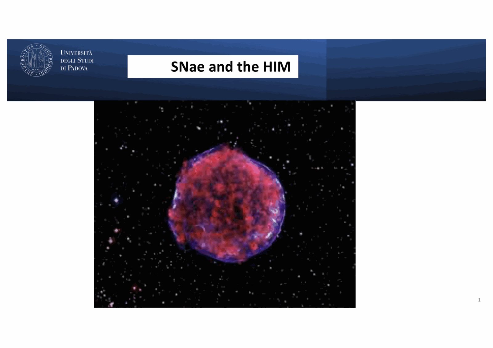
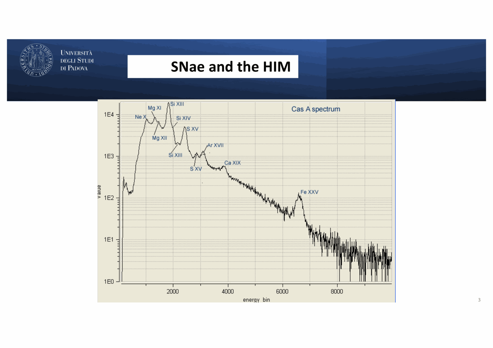


# Carraro 06 - Supernovae and the Hot Ionized Medium

*Course: Astrophysics of the Interstellar Medium, Master in Astrophysics and Cosmology, Università degli Studi di Padova*  
*Lecturer: Prof. Giovanni Carraro*  
*Index: [Astrophysics_of_the_Interstellar_Medium_MOC](../../../04_Atlas/Astrophysics_of_the_Interstellar_Medium_MOC.html)*

---

## supernovae as the primary kinetic engine of the ism

supernova explosions inject colossal amounts of thermal energy, momentum, and newly synthesized chemical elements into the interstellar medium:
- canonical explosive mechanical energy: $E_0 \approx 10^{51}\text{ erg} = 10^{44}\text{ J}$
- ejecta mass: $M_{\text{ej}} \sim 1 - 10 \, M_\odot$
- initial shock velocity: $v_s \sim 5000 - 20000\text{ km s}^{-1}$

supernovae occur via two fundamental channels:
1. **Thermonuclear (Type Ia)**: complete carbon-oxygen deflagration/detonation of an accreting white dwarf near the Chandrasekhar mass ($1.4 \, M_\odot$). archetype: **Tycho's Supernova (SN 1572)**, shown on Carraro slide 6.
2. **Core-Collapse (Types II, Ib, Ic, IIb)**: gravitational collapse of the iron core in massive stars ($M > 8 \, M_\odot$), leaving a neutron star or black hole. archetype: **Cassiopeia A (Cas A)**, a Type IIb remnant from an explosion in $\sim 1680$ (Carraro slide 2), and the **Crab Nebula (SN 1054)**.

---

## the four evolutionary stages of a supernova remnant (snr)

as a supernova shock wave propagates outward into the ambient interstellar medium with density $\rho_0 = \mu m_H n_0$, it transitions through four distinct dynamical regimes:

```
Phase 1: Free Expansion (M_swept < M_ej, v_s ~ const, R_s ~ t)
         ↓
Phase 2: Sedov-Taylor Blast Wave (M_swept >> M_ej, energy-conserving, R_s ~ t^(2/5))
         ↓
Phase 3: Snowplow / Radiative Phase (radiative cooling dominant, momentum-conserving, R_s ~ t^(1/4))
         ↓
Phase 4: Dissipation / Merging (v_s <= c_s ~ 10-20 km/s, shock dissolves into turbulent ISM)
```

---

### phase 1: free expansion (ejecta-dominated)

in the immediate aftermath of the explosion, the mass of interstellar gas swept up by the shock is much less than the ejected stellar mass:

$$M_{\text{swept}}(R) = \frac{4}{3}\pi R_s^3 \rho_0 \ll M_{\text{ej}}$$

the deceleration is negligible; the blast wave expands at approximately constant speed:

$$v_s(t) \approx v_0 = \sqrt{\frac{2 E_0}{M_{\text{ej}}}} \sim 10^4\text{ km s}^{-1}$$
$$R_s(t) = v_0 t \propto t$$

this phase lasts until the swept-up mass equals the ejecta mass ($M_{\text{swept}} \approx M_{\text{ej}}$):

$$R_{\text{trans}} = \left(\frac{3 M_{\text{ej}}}{4\pi \rho_0}\right)^{1/3} \approx 2.1 \, \left(\frac{M_{\text{ej}}}{M_\odot}\right)^{1/3} \left(\frac{n_0}{\text{cm}^{-3}}\right)^{-1/3}\text{ pc}$$
$$t_{\text{trans}} = \frac{R_{\text{trans}}}{v_0} \sim 200 - 1000\text{ years}$$

---

### phase 2: the sedov-taylor adiabatic blast wave

once $M_{\text{swept}} \gg M_{\text{ej}}$, the inertia of the swept-up ambient gas decelerates the shock. because the post-shock temperature is extremely high ($T_s \sim 10^7 - 10^8\text{ K}$), the gas is fully ionized, and radiative cooling is far too slow to radiate away significant energy ($t_{\text{cool}} \gg t$).

the total mechanical (kinetic + thermal) energy $E_0$ is conserved inside the blast wave.

#### dimensional derivation

the radius of the shock $R_s$ can depend only on:
1. the total explosion energy $E_0$ (dimensions: $[M L^2 T^{-2}]$)
2. the ambient density $\rho_0$ (dimensions: $[M L^{-3}]$)
3. elapsed time $t$ (dimensions: $[T]$)

we construct the unique dimensionally consistent product:

$$R_s(t) = \xi_0 \left(\frac{E_0}{\rho_0}\right)^\alpha t^\beta$$

substituting dimensions $[L] = [M L^2 T^{-2}]^\alpha [M L^{-3}]^\beta [T]^\gamma$:
- for mass $[M]$: $\alpha + \beta = 0 \implies \beta = -\alpha$
- for length $[L]$: $2\alpha - 3\beta = 1 \implies 5\alpha = 1 \implies \alpha = 1/5$
- for time $[T]$: $-2\alpha + \gamma = 0 \implies \gamma = 2\alpha = 2/5$

therefore:

$$R_s(t) = \xi_0 \left(\frac{E_0}{\rho_0}\right)^{1/5} t^{2/5}$$

for an ideal monatomic gas ($\gamma = 5/3$), exact hydrodynamic self-similar integration (Sedov 1959, Taylor 1950) gives $\xi_0 \approx 1.15$.

#### shock kinematics and temperature

differentiating with respect to time:

$$v_s(t) = \frac{dR_s}{dt} = \frac{2}{5} \frac{R_s}{t} \propto t^{-3/5}$$

applying the strong Rankine-Hugoniot shock jump condition for an ideal gas ($\gamma = 5/3$), the post-shock temperature immediately behind the front is:

$$T_s(t) = \frac{3}{16} \frac{\mu m_H}{k} v_s^2 \propto t^{-6/5}$$

numerically, scaling to canonical parameters ($E_0 = 10^{51}\text{ erg}$, $n_0 = 1\text{ cm}^{-3}$):

$$R_s(t) \approx 0.31 \, \left(\frac{E_{51}}{n_0}\right)^{1/5} t_{\text{yr}}^{2/5}\text{ pc}$$
$$v_s(t) \approx 1.2 \times 10^5 \, \left(\frac{E_{51}}{n_0}\right)^{1/5} t_{\text{yr}}^{-3/5}\text{ km s}^{-1}$$
$$T_s(t) \approx 2.0 \times 10^8 \, \left(\frac{E_{51}}{n_0}\right)^{2/5} t_{\text{yr}}^{-6/5}\text{ K}$$

at $t \sim 10^4\text{ years}$, $R_s \approx 12\text{ pc}$, $v_s \approx 480\text{ km s}^{-1}$, and $T_s \approx 3 \times 10^6\text{ K}$, producing intense diffuse **soft X-ray emission** (thermal bremsstrahlung and line transitions of O VII, O VIII, Ne IX, Fe XVII).

---

### phase 3: the snowplow / radiative phase

as the blast wave expands, the post-shock temperature drops. when $T_s \lesssim 10^6\text{ K}$, recombination of heavy element ions (carbon, oxygen, iron) causes the interstellar cooling function $\Lambda(T)$ to rise sharply to its peak ($\Lambda \sim 10^{-22}\text{ erg cm}^3\text{ s}^{-1}$ at $T \sim 10^5\text{ K}$).

the radiative cooling time drops below the expansion timescale ($t_{\text{cool}} < t$). the hot gas immediately behind the shock front radiates its thermal energy away rapidly and collapses into a thin, dense, cold shell.

because thermal energy is lost to radiation, energy is no longer conserved. however, **radial momentum is strictly conserved**:

$$M_s(t) v_s(t) = \text{constant}$$

since $M_s(t) = \frac{4}{3}\pi R_s^3 \rho_0$:

$$R_s^3 \frac{dR_s}{dt} = \text{constant} \implies R_s^3 dR_s \propto dt \implies R_s^4 \propto t$$

therefore:

$$R_s(t) \propto t^{1/4}$$
$$v_s(t) = \frac{dR_s}{dt} \propto t^{-3/4}$$

this is the **momentum-conserving snowplow phase**. the dense shell plows through the ambient neutral medium, shining brightly in optical forbidden lines ([O III], [S II], [N II]) and H$\alpha$ (e.g. the Cygnus Loop).

---

### phase 4: dissipation and merging with the ism

when the shock velocity slows to the ambient sound speed or Alfvén speed of the interstellar medium ($v_s \lesssim c_s, v_A \sim 10 - 20\text{ km s}^{-1}$), the shock front degenerates into a subsonic acoustic wave. the swept-up shell breaks up through interstellar turbulence and Rayleigh-Taylor/Kelvin-Helmholtz instabilities, merging its enriched gas into the general multi-phase ISM.

total lifetime of an SNR: $\tau_{\text{SNR}} \sim 10^5 - 10^6\text{ years}$, with a maximum dispersal radius $R_{\text{max}} \sim 30 - 50\text{ pc}$.

---

## superbubbles, galactic chimneys, and fountains

massive stars do not detonate in isolation; they are born in OB associations containing tens to thousands of O and B stars.

### superbubble formation

successive supernova explosions ($N_{\text{SN}} \sim 10 - 1000$) occurring every $\sim 10^5\text{ years}$ inside the cluster blow a collective cavity known as a **superbubble** (e.g. NGC 1929 in the LMC, M17, 30 Doradus; Carraro slides 10 - 12):
- energy input: continuous mechanical luminosity $L_{\text{mech}} \sim 10^{38} - 10^{39}\text{ erg s}^{-1}$
- interior temperature: $T \sim 10^6 - 10^7\text{ K}$ (Hot Ionized Medium)
- shell diameter: $D \sim 100 - 1000\text{ pc}$

### superbubble blowout and galactic chimneys

the scale height of the cold neutral gas disk in the Milky Way is $h \approx 100 - 200\text{ pc}$. 

when the superbubble radius exceeds $R_s \approx 2 - 3 \, h$:
1. the shock encounters a steep vertical exponential density gradient $\rho(z) = \rho_0 e^{-\lvert z\rvert/h}$.
2. the shock accelerates upwards ($v_s \propto \rho^{-1/5}$).
3. Rayleigh-Taylor instability ruptures the top of the cold shell ("blowout"), forming a **Galactic Chimney** (Carraro slide 14).

### the galactic fountain

the rupture vents millions of solar masses of hot, metal-enriched gas directly into the lower galactic halo ($z \sim 2 - 10\text{ kpc}$):
- in the halo, the gas expands and cools radiatively over $\sim 10^7\text{ years}$.
- upon cooling below $T \sim 10^4\text{ K}$, thermal instability causes the gas to condense into dense, neutral clouds.
- the clouds lose pressure support and fall ballistically back onto the Galactic disk under gravity.
- these infalling clouds are observed as **High-Velocity Clouds (HVCs)** ($\lvert v_{\text{LSR}}\rvert > 90\text{ km s}^{-1}$, Carraro slide 16).

the **galactic fountain** acts as a giant chemical recycling system, redistributing heavy elements synthesized in the inner disk to outer Galactocentric radii.

---

## the intra-cluster medium (icm) and ram pressure stripping

prof. carraro extended the physics of hot ionized gas to the largest virialized structures in the universe: galaxy clusters (Carraro slides 17 - 24).

### properties of the icm

the Intra-Cluster Medium fills the deep gravitational potential wells of galaxy clusters (e.g. Coma, Virgo, Perseus):
- **temperature**: $T \approx 10^7 - 10^8\text{ K}$ ($k T \approx 1 - 10\text{ keV}$)
- **density**: $n_e \sim 10^{-4} - 10^{-2}\text{ cm}^{-3}$
- **mass**: $M_{\text{ICM}} \approx 5 - 10 \times M_{\text{stars}}$ (the dominant baryonic component of clusters)
- **emission mechanism**: thermal X-ray bremsstrahlung (free-free) and collisionally excited Fe XXV and Fe XXVI K-shell lines at $6.7\text{ keV}$.

### ram pressure stripping (gunn & gott 1972)

as a spiral galaxy plunges through the dense ICM with supersonic velocity $v_{\text{gal}} \sim 1000 - 2000\text{ km s}^{-1}$, it experiences a hydrodynamic ram pressure:

$$P_{\text{ram}} = \rho_{\text{ICM}} v_{\text{gal}}^2$$

the galaxy's interstellar gas is anchored to the stellar disk only by the gravitational restoring force per unit area:

$$F_{\text{grav}} = 2\pi G \Sigma_* \Sigma_{\text{gas}}$$

where $\Sigma_*$ and $\Sigma_{\text{gas}}$ are the surface mass densities of stars and gas.

#### the gunn-gott stripping criterion:
if:

$$P_{\text{ram}} > 2\pi G \Sigma_* \Sigma_{\text{gas}}$$

the ram pressure overcomes the gravitational grip of the disk, violently stripping the cold H I and molecular gas out of the galaxy into the ICM (Carraro slide 24).

consequences:
- star formation in the disk is rapidly extinguished (**cluster quenching**).
- the stripped gas trails behind the galaxy as long, illuminated comet-like tentacles with ongoing star formation, producing **"Jellyfish Galaxies"** (e.g. ESO 137-001, JO206).
- this process explains why galaxy clusters are dominated by gas-depleted, red-and-dead lenticular (S0) and elliptical galaxies (the morphology-density relation).

---

## see also

- [Astrophysics_of_the_Interstellar_Medium_MOC](../../../04_Atlas/Astrophysics_of_the_Interstellar_Medium_MOC.html)
- [Sedov-Taylor blast wave expansion](../../../03_Zettel/Theory/Sedov-Taylor%20blast%20wave%20expansion.html)
- [Superbubbles galactic chimneys and fountains](../../../03_Zettel/Theory/Superbubbles%20galactic%20chimneys%20and%20fountains.html)
- [Ram pressure stripping in galaxy clusters](../../../03_Zettel/Theory/Ram%20pressure%20stripping%20in%20galaxy%20clusters.html)
- [Carraro_01_Introduction_and_Multi-phase_ISM](./Carraro_01_Introduction_and_Multi-phase_ISM.html)
- [Carraro_04_Massive_Stars_Feedback_and_Stellar_Winds](./Carraro_04_Massive_Stars_Feedback_and_Stellar_Winds.html)
- [Galaxy clusters and overview of evolution](../../../03_Zettel/Theory/Galaxy%20clusters%20and%20overview%20of%20evolution.html)


## Lecture Visuals & Supernova Shock Evolution


*Figure ISM-08: Self-similar Sedov-Taylor blast wave expansion in the Hot Ionized Medium (HIM). The blast radius scales as $R(t) = \xi_0 \left(\frac{E_{\mathrm{SN}}}{\rho_0}\right)^{1/5} t^{2/5}$ with internal post-shock temperatures exceeding $10^6\text{ K}$, producing soft thermal X-ray emission.*


*Figure ISM-09: Four evolutionary phases of a supernova remnant: Free Expansion $\to$ Sedov-Taylor Adiabatic $\to$ Pressure-Driven Snowplow (radiative cooling) $\to$ Subsonic Dissipation into the ambient ISM.*


<div class="backlinks-section">
  <h4 class="backlinks-title">Linked References (7)</h4>
  <ul class="backlinks-list">
    <li class="backlink-item-wrap"><a href="../../../04_Atlas/Astrophysics_of_the_Interstellar_Medium_MOC.html" class="backlink-item">Astrophysics_of_the_Interstellar_Medium_MOC</a></li>
    <li class="backlink-item-wrap"><a href="./Carraro_01_Introduction_and_Multi-phase_ISM.html" class="backlink-item">Carraro_01_Introduction_and_Multi-phase_ISM</a></li>
    <li class="backlink-item-wrap"><a href="./Carraro_04_Massive_Stars_Feedback_and_Stellar_Winds.html" class="backlink-item">Carraro_04_Massive_Stars_Feedback_and_Stellar_Winds</a></li>
    <li class="backlink-item-wrap"><a href="./Carraro_08_Shocks_Turbulence_and_MHD_Waves.html" class="backlink-item">Carraro_08_Shocks_Turbulence_and_MHD_Waves</a></li>
    <li class="backlink-item-wrap"><a href="../../../03_Zettel/Theory/Ram%20pressure%20stripping%20in%20galaxy%20clusters.html" class="backlink-item">Ram pressure stripping in galaxy clusters</a></li>
    <li class="backlink-item-wrap"><a href="../../../03_Zettel/Theory/Sedov-Taylor%20blast%20wave%20expansion.html" class="backlink-item">Sedov-Taylor blast wave expansion</a></li>
    <li class="backlink-item-wrap"><a href="../../../03_Zettel/Theory/Superbubbles%20galactic%20chimneys%20and%20fountains.html" class="backlink-item">Superbubbles galactic chimneys and fountains</a></li>
  </ul>
</div>
