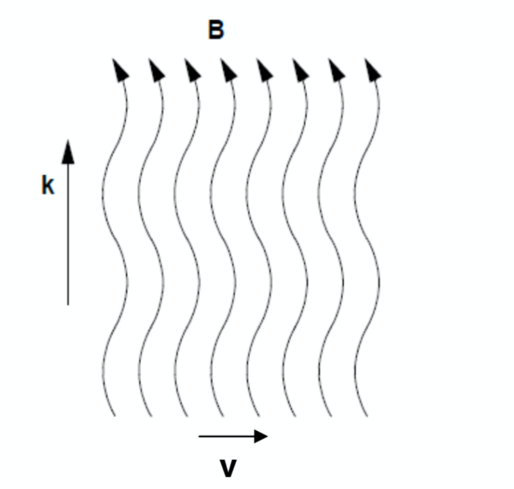

# Carraro 07 - Interstellar Magnetic Fields

*Course: Astrophysics of the Interstellar Medium, Master in Astrophysics and Cosmology, Università degli Studi di Padova*  
*Lecturer: Prof. Giovanni Carraro*  
*Index: [Astrophysics_of_the_Interstellar_Medium_MOC](../../../04_Atlas/Astrophysics_of_the_Interstellar_Medium_MOC.html)*

---

## typical field strengths and galactic scales

magnetic fields permeate every phase of the interstellar medium. while microscopic on laboratory scales:

$$1\text{ Tesla} = 10^4\text{ Gauss}$$
$$1\text{ }\mu\text{G} = 10^{-6}\text{ Gauss} = 10^{-10}\text{ Tesla}$$

in the Milky Way disk, typical field strengths are:
- diffuse interstellar medium: $B \approx 2 - 6\text{ }\mu\text{G}$
- dense molecular cloud cores: $B \sim 100\text{ }\mu\text{G} - 1\text{ mG}$
- Galactic Center: $B \sim 100\text{ }\mu\text{G} - \text{few mG}$

despite their modest field strengths, the magnetic energy density:

$$u_B = \frac{B^2}{8\pi} \approx \frac{(3 \times 10^{-6})^2}{8\pi} \approx 0.36 \times 10^{-12}\text{ erg cm}^{-3} \approx 0.22\text{ eV cm}^{-3}$$

is comparable to the thermal gas energy density, the turbulent kinetic energy density, and the cosmic ray energy density in the Galactic plane. magnetic fields provide critical non-thermal pressure support against self-gravity, regulate protostellar collapse via ambipolar diffusion and magnetic braking, and confine cosmic rays to the Galactic halo.

---

## the four observational methods

as outlined on Carraro slide 2, astronomers map interstellar magnetic fields using four primary observational methods:
1. **Starlight Polarization & Polarized Dust Emission** (traces plane-of-sky field $\mathbf{B}_\perp$)
2. **Zeeman Effect** (traces line-of-sight field $B_\parallel$ in neutral/molecular gas)
3. **Faraday Rotation** (traces line-of-sight field $B_\parallel$ in ionized gas)
4. **Synchrotron Emission** (traces plane-of-sky field $\mathbf{B}_\perp$ and total field strength)

---

## 1. starlight polarization and dust alignment

discovered serendipitously by Hall and Hiltner (1949), unpolarized light from background stars becomes partially linearly polarized after passing through the dusty interstellar medium.

### the davis-greenstein alignment mechanism

1. **non-spherical grains**: interstellar dust grains are non-spherical (prolate or oblate spheroids).
2. **suprathermal spin**: grains are spun up to relativistic angular velocities ($\omega \sim 10^5 - 10^9\text{ rad s}^{-1}$) by Barnett effect torques, $H_2$ formation rocket thrusters (Purcell 1979), and radiative torques (RAT theory, Draine & Weingartner 1996).
3. **paramagnetic relaxation**: because dust grains contain paramagnetic ions ($Fe^{2+}, Fe^{3+}$), grain rotation in an ambient magnetic field $\mathbf{B}$ induces oscillating internal magnetic fields, dissipating rotational kinetic energy perpendicular to $\mathbf{B}$.
4. **alignment**: the grain's angular momentum vector $\mathbf{J}$ and its shortest physical axis align parallel to the local magnetic field vector $\mathbf{B}$. the grain's **longest physical axis rotates in the plane perpendicular to $\mathbf{B}$**.

### transmission polarization (optical / near-ir)

because the grain presents a larger geometric cross-section to electric field vectors oscillating along its long axis:
- the electric field component perpendicular to $\mathbf{B}_\perp$ is preferentially absorbed and scattered.
- the transmitted starlight emerges with an electric vector **parallel to the plane-of-sky magnetic field $\mathbf{B}_\perp$**.

### emission polarization (far-ir / sub-millimeter)

in the far-infrared and sub-millimeter, dust grains cool by emitting thermal radiation.
- because thermal emission is highest along the longest physical dimension of the grain, the emitted radiation has its electric vector oriented parallel to the long grain axis.
- therefore, **polarized thermal dust emission is oriented perpendicular to the plane-of-sky magnetic field $\mathbf{B}_\perp$** (and perpendicular to optical starlight polarization).

all-sky polarization maps from the ESA Planck satellite ($353\text{ GHz}$) provide the premier high-resolution cartography of the Galactic magnetic field structure.

---

## 2. the zeeman effect

the Zeeman effect provides the only direct technique to measure the absolute magnetic field strength in neutral atomic and molecular gas.

an external magnetic field breaks the spatial degeneracy of atomic or molecular energy levels with total angular momentum $F$, splitting the line into $2F + 1$ sub-levels via the magnetic dipole Hamiltonian $\hat{H} = -\boldsymbol{\mu} \cdot \mathbf{B}$.

### frequency shift

the frequency shift between circular polarization components is:

$$\Delta \nu_Z = \frac{g_L e B_\parallel}{4\pi m_e c}$$

where $g_L$ is the Landé $g$-factor.

for the **H I $21\text{ cm}$ line** ($1420.4\text{ MHz}$), prof. carraro's slide 7 gives:

$$\Delta \nu_Z = 1.4\text{ Hz} / \mu\text{G}$$

(or $2.8\text{ Hz} / \mu\text{G}$ between the right- and left-circularly polarized $\sigma^+$ and $\sigma^-$ peaks).

### observational challenge

in typical interstellar clouds ($T \sim 100\text{ K}$), the thermal Doppler line width of the $21\text{ cm}$ line is:

$$\Delta \nu_D = \nu_0 \frac{\Delta v}{c} \approx 1420 \times 10^6 \times \frac{1\text{ km s}^{-1}}{3 \times 10^5\text{ km s}^{-1}} \approx 4.7\text{ kHz}$$

for a typical field of $B \approx 5\text{ }\mu\text{G}$, the Zeeman splitting is:

$$\Delta \nu_Z \approx 1.4 \times 5 \approx 7\text{ Hz} \ll 4700\text{ Hz}$$

the splitting is hundreds of times smaller than the thermal Doppler width. observers cannot resolve separate Zeeman components; instead, they observe the line in right-circular (RCP) and left-circular (LCP) polarization, measuring the Stokes $V \equiv I_{\text{RCP}} - I_{\text{LCP}}$ parameter:

$$V(\nu) \propto \Delta \nu_Z \frac{dI(\nu)}{d\nu}$$

the amplitude of the S-shaped derivative profile yields the line-of-sight component $B_\parallel$.

stronger Zeeman detections occur in molecular masers (OH masers at $18\text{ cm}$ with splitting $\sim 3.3\text{ Hz}/\mu\text{G}$, $H_2O$ masers, CN lines), where fields reach $B \sim 1 - 10\text{ mG}$ in star-forming cores.

---

## 3. faraday rotation

Faraday rotation probes the line-of-sight magnetic field in the warm ionized medium (WIM) and diffuse plasma.

### physics of plasma birefringence

a magnetized plasma is circular birefringent: right-circularly polarized (RCP) and left-circularly polarized (LCP) electromagnetic waves propagate at slightly different phase velocities ($v_R > v_L$, Carraro slide 10).

the refractive index for circular polarization along a magnetic field $B_\parallel$ is:

$$n_{R, L}^2 = 1 - \frac{\omega_p^2}{\omega (\omega \pm \omega_c)}$$

where $\omega_p = \sqrt{4\pi n_e e^2 / m_e}$ is the electron plasma frequency and $\omega_c = e B / m_e c$ is the electron cyclotron frequency.

### the rotation measure (rm)

a linearly polarized wave (which can be decomposed into equal amplitudes of RCP and LCP) propagating through the magnetized plasma experiences a gradual rotation of its polarization angle $\theta$:

$$\Delta \theta = \theta(\lambda) - \theta_0 = \text{RM} \cdot \lambda^2$$

where the **Rotation Measure ($\text{RM}$)** is defined as:

$$\text{RM} = \frac{e^3}{2\pi m_e^2 c^4} \int_0^d n_e(s) B_\parallel(s) ds = 0.812 \int_0^d \left(\frac{n_e}{\text{cm}^{-3}}\right) \left(\frac{B_\parallel}{\mu\text{G}}\right) \left(\frac{ds}{\text{pc}}\right) \quad [\text{rad m}^{-2}]$$

### combining rm with dispersion measure (dm)

for pulsars, radio pulses arrive with a frequency-dependent dispersion delay caused by free electrons along the path. the **Dispersion Measure ($\text{DM}$)** measures the total free electron column density:

$$\text{DM} = \int_0^d n_e(s) ds \quad [\text{pc cm}^{-3}]$$

taking the direct ratio of $\text{RM}$ to $\text{DM}$, the electron density drops out to first order, yielding the **mean line-of-sight magnetic field component weighted by electron density**:

$$\langle B_\parallel \rangle = \frac{\int n_e B_\parallel ds}{\int n_e ds} = \frac{\text{RM}}{0.812 \, \text{DM}} = 1.232 \, \frac{\text{RM}}{\text{DM}} \quad [\mu\text{G}]$$

this is prof. carraro's equation on slide 14:
$$\langle B_\parallel \rangle = 1.232 \, \frac{\text{RM}}{\text{DM}}$$

by measuring $\text{RM}$ and $\text{DM}$ for over 500 Galactic pulsars and thousands of extragalactic radio sources (Carraro slide 15), astronomers have mapped the large-scale topology of the Milky Way magnetic field:
- clockwise field direction in the local Orion-Cygnus arm.
- counter-clockwise reversal in the adjacent inner Sagittarius-Carina arm ($B \sim 2 - 4\text{ }\mu\text{G}$).
- large-scale bisymmetric or axisymmetric spiral pattern sustained by a galactic $\alpha\Omega$-dynamo.

---

## 4. synchrotron radiation

relativistic cosmic-ray electrons accelerated in supernova remnants spiral around interstellar magnetic field lines, emitting non-thermal **synchrotron radiation**.

### emission properties

- **radiation pattern**: strongly beamed into a forward cone of half-opening angle $\theta \sim 1/\gamma$, where $\gamma = E / m_e c^2$ is the Lorentz factor.
- **polarization**: highly linearly polarized intrinsic emission (up to $70 - 75\%$ for a uniform field), with electric vector perpendicular to the projected plane-of-sky field $\mathbf{B}_\perp$.
- **emissivity**: for a cosmic ray electron energy spectrum $N(E) dE = N_0 E^{-p} dE$, the synchrotron emissivity is:
  $$j_\nu \propto n_{\text{CR}} B_\perp^{(p+1)/2} \nu^{-(p-1)/2} = n_{\text{CR}} B_\perp^{\alpha + 1} \nu^{-\alpha}$$
  for typical interstellar cosmic rays ($p \approx 2.5$), the spectral index is $\alpha \approx 0.75$, producing a steep spectrum $j_\nu \propto \nu^{-0.75}$.

### all-sky surveys

the historical benchmark survey is the **Haslam et al. (1982) $408\text{ MHz}$ all-sky map** (Carraro slide 17), which traces the diffuse synchrotron emission from the Galactic disk and the North Polar Spur, providing a global census of cosmic ray electrons and total magnetic field strength.

---

## see also

- [Astrophysics_of_the_Interstellar_Medium_MOC](../../../04_Atlas/Astrophysics_of_the_Interstellar_Medium_MOC.html)
- [Interstellar magnetic field tracers](../../../03_Zettel/Theory/Interstellar%20magnetic%20field%20tracers.html)
- [Faraday rotation and pulsar dispersion measure](../../../03_Zettel/Theory/Faraday%20rotation%20and%20pulsar%20dispersion%20measure.html)
- [Carraro_01_Introduction_and_Multi-phase_ISM](./Carraro_01_Introduction_and_Multi-phase_ISM.html)
- [Carraro_05_Interstellar_Dust_and_Extinction](./Carraro_05_Interstellar_Dust_and_Extinction.html)
- [Carraro_08_Shocks_Turbulence_and_MHD_Waves](./Carraro_08_Shocks_Turbulence_and_MHD_Waves.html)

## Lecture Visuals & Magnetic Field Probes

*Figure ISM-10: Interstellar Magnetic Fields and Alfvénic Perturbations. Observational tracers include starlight polarization via paramagnetic dust alignment (Davis-Greenstein mechanism), pulsar Faraday rotation measures $\mathrm{RM} \propto \int n_e B_\parallel ds$, and Zeeman splitting in molecular clouds.*

  <h4 class="backlinks-title">Linked References (4)</h4>
  <ul class="backlinks-list">
    <li class="backlink-item-wrap"><a href="../../../03_Zettel/Theory/Alfven%20and%20magnetosonic%20waves.html" class="backlink-item">Alfven and magnetosonic waves</a></li>
    <li class="backlink-item-wrap"><a href="../../../03_Zettel/Theory/Faraday%20rotation%20and%20pulsar%20dispersion%20measure.html" class="backlink-item">Faraday rotation and pulsar dispersion measure</a></li>
    <li class="backlink-item-wrap"><a href="../../../03_Zettel/Theory/Interstellar%20magnetic%20field%20tracers.html" class="backlink-item">Interstellar magnetic field tracers</a></li>
    <li class="backlink-item-wrap"><a href="../../../04_Atlas/Astrophysics_of_the_Interstellar_Medium_MOC.html" class="backlink-item">Astrophysics_of_the_Interstellar_Medium_MOC</a></li>
  </ul>

