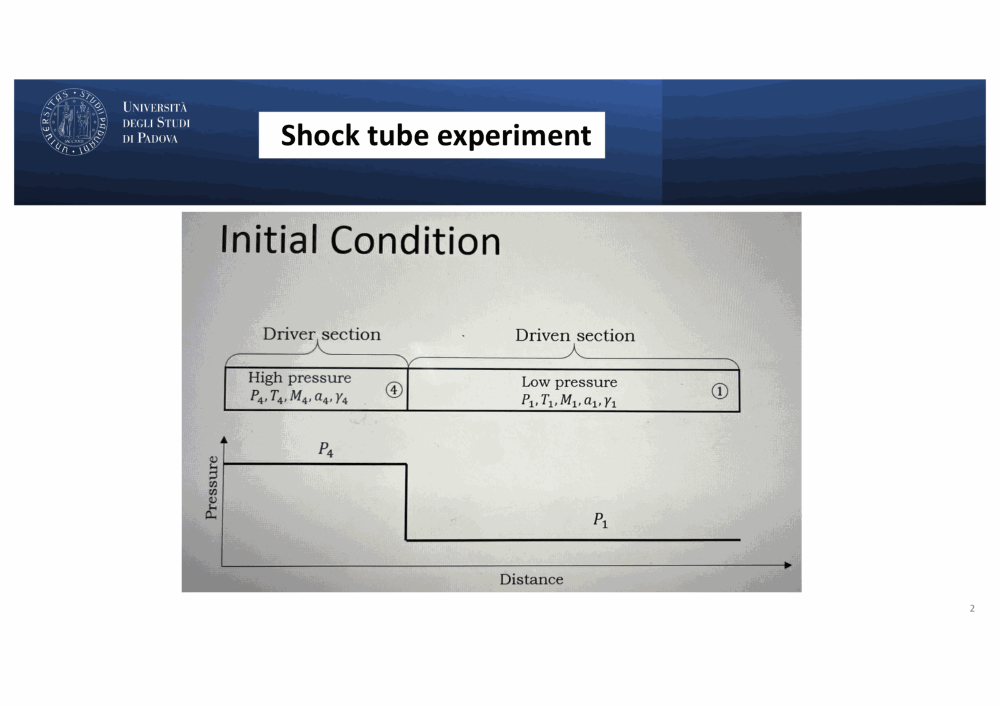
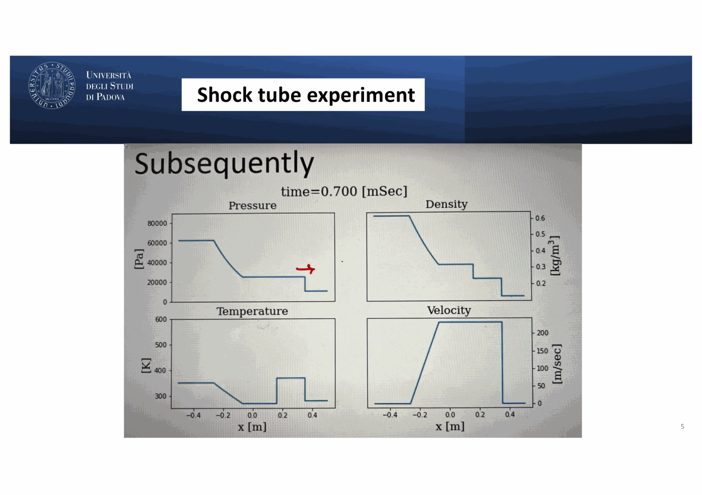
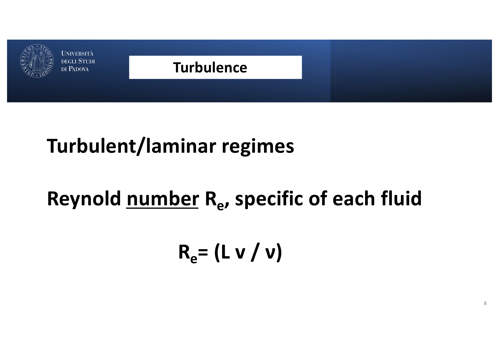


# Carraro 08 - Shocks, Turbulence, and MHD Waves

*Course: Astrophysics of the Interstellar Medium, Master in Astrophysics and Cosmology, Università degli Studi di Padova*  
*Lecturer: Prof. Giovanni Carraro*  
*Index: [Astrophysics_of_the_Interstellar_Medium_MOC](../../../04_Atlas/Astrophysics_of_the_Interstellar_Medium_MOC.html)*

---

## fluids as continuous physical systems

the interstellar medium can be treated as a continuous fluid when the mean free path $\ell_{\text{mfp}}$ of colliding particles is vastly smaller than the macroscopic length scale $L$ of the system (Knudsen number $Kn \equiv \ell_{\text{mfp}} / L \ll 1$).

the fundamental hydrodynamic equations governing an ideal, non-viscous fluid are:
1. **Continuity Equation (Conservation of Mass)**:
   $$\frac{\partial \rho}{\partial t} + \nabla \cdot (\rho \mathbf{v}) = 0$$
2. **Euler Equation (Conservation of Momentum)**:
   $$\frac{\partial \mathbf{v}}{\partial t} + (\mathbf{v} \cdot \nabla)\mathbf{v} = -\frac{1}{\rho}\nabla P - \nabla \Phi$$
3. **Energy Equation**:
   $$\frac{\partial}{\partial t}\left(\frac{1}{2}\rho v^2 + \rho \epsilon\right) + \nabla \cdot \left[\left(\frac{1}{2}\rho v^2 + \rho \epsilon + P\right)\mathbf{v}\right] = \Gamma - \Lambda$$
   where $\epsilon = \frac{P}{(\gamma - 1)\rho}$ is the specific internal energy, $\Gamma$ is the volumetric heating rate, and $\Lambda$ is the cooling rate.

linear perturbations of these equations in an ideal fluid produce standard **acoustic waves** propagating at sound speed $c_s = \sqrt{\gamma P / \rho}$.

---

## shock waves and the sod shock tube experiment

when disturbances in a fluid exceed the local sound speed ($v > c_s$, Mach number $\mathcal{M} \equiv v / c_s > 1$), acoustic waves steepen into a discontinuous front: a **shock wave**.

### the shock tube problem

prof. carraro's slides 1 - 7 illustrate the classical **Sod Shock Tube experiment** (Gary Sod 1978), a fundamental benchmark for astrophysical hydrodynamics:
- a 1D tube contains a high-density, high-pressure "driver" gas on the left ($\rho_L, P_L$) and a low-density, low-pressure "ambient" gas on the right ($\rho_R, P_R$), separated by a thin membrane at $x = 0.5$.
- at $t = 0$, the membrane ruptures instantaneously.

the evolution produces five distinct hydrodynamic zones separated by three propagating wave structures (Carraro slide 4):
1. **Rarefaction Fan (Expansion Wave)**: propagates to the left into the high-pressure gas, smoothly decreasing density and pressure while accelerating gas to the right.
2. **Contact Discontinuity**: the interface separating the original driver gas from the swept-up ambient gas. across this boundary, **pressure and velocity are strictly continuous** ($P_2 = P_3$, $v_2 = v_3$), but **density and temperature jump discontinuously** ($\rho_2 \ne \rho_3, T_2 \ne T_3$).
3. **Shock Front**: a sharp, supersonic discontinuity propagating to the right into the undisturbed ambient gas, compressing, accelerating, and irreversibly heating it.

---

## rankine-hugoniot shock jump conditions

to derive the physical properties across a 1D steady shock front, we transform to the reference frame of the shock, where the shock front is stationary at $x = 0$. unshocked upstream gas enters with velocity $v_1$, density $\rho_1$, and pressure $P_1$. shocked downstream gas exits with velocity $v_2$, density $\rho_2$, and pressure $P_2$.

integrating the 1D conservation laws across the infinitesimal shock layer:

1. **Mass Flux**:
   $$\rho_1 v_1 = \rho_2 v_2 \equiv j$$
2. **Momentum Flux**:
   $$P_1 + \rho_1 v_1^2 = P_2 + \rho_2 v_2^2$$
3. **Energy Flux**:
   $$\frac{1}{2}v_1^2 + h_1 = \frac{1}{2}v_2^2 + h_2$$
   where $h = \epsilon + \frac{P}{\rho} = \frac{\gamma}{\gamma - 1}\frac{P}{\rho}$ is the specific enthalpy.

### 1. adiabatic shock (no radiative cooling)

for an adiabatic shock, the compression ratio is:

$$\frac{\rho_2}{\rho_1} = \frac{v_1}{v_2} = \frac{(\gamma + 1)\mathcal{M}_1^2}{(\gamma - 1)\mathcal{M}_1^2 + 2}$$

in the limit of a **strong shock** ($\mathcal{M}_1 \gg 1$):

$$\frac{\rho_2}{\rho_1} \rightarrow \frac{\gamma + 1}{\gamma - 1}$$

for an ideal monatomic gas ($\gamma = 5/3$):

$$\boxed{\frac{\rho_2}{\rho_1} = \frac{5/3 + 1}{5/3 - 1} = \frac{8/3}{2/3} = 4}$$

the maximum compression factor for an adiabatic monatomic shock is strictly $4$.

the post-shock pressure and temperature are:

$$P_2 \approx \frac{2}{\gamma + 1}\rho_1 v_1^2 = \frac{3}{4}\rho_1 v_1^2$$
$$T_2 \approx \frac{2(\gamma - 1)}{(\gamma + 1)^2}\frac{\mu m_H}{k} v_1^2 = \frac{3}{16}\frac{\mu m_H}{k} v_1^2$$

### 2. isothermal shock (rapid radiative cooling)

in many astrophysical environments (e.g. interstellar clouds, H II boundaries), the post-shock cooling timescale is much shorter than the dynamical flow time ($t_{\text{cool}} \ll t_{\text{flow}}$). the shock radiates its thermal energy away instantaneously, returning to the pre-shock temperature: $T_2 = T_1 \implies c_{s, 2} = c_{s, 1} = c_s$.

the energy equation is replaced by the isothermal condition $P = \rho c_s^2$. the momentum conservation equation becomes:

$$\rho_1 c_s^2 + \rho_1 v_1^2 = \rho_2 c_s^2 + \rho_2 v_2^2$$

using mass conservation ($v_2 = v_1 \frac{\rho_1}{\rho_2}$):

$$\rho_1 c_s^2 (1 + \mathcal{M}_1^2) = \rho_2 c_s^2 + \rho_1 v_1^2 \frac{\rho_1}{\rho_2}$$

in the strong shock limit ($\mathcal{M}_1 \gg 1$):

$$\boxed{\frac{\rho_2}{\rho_1} = \mathcal{M}_1^2}$$

for a supersonic cloud collision with $\mathcal{M}_1 = 20$, the compression ratio reaches $\rho_2 / \rho_1 = 400$. **isothermal shocks produce massive compression**, triggering gravitational instability and star formation in molecular clouds.

---

## interstellar turbulence

the interstellar medium is universally turbulent across scales from AU to kiloparsecs.

### the reynolds number ($Re$)

the transition from smooth laminar flow to chaotic turbulent flow is governed by the dimensionless **Reynolds number** (Carraro slide 8):

$$Re = \frac{L v}{\nu} = \frac{\rho L v}{\mu_{\text{visc}}} = \frac{\text{inertial forces}}{\text{viscous forces}}$$

where $L$ is the characteristic system scale, $v$ is the flow velocity, and $\nu = \mu_{\text{visc}}/\rho$ is the kinematic viscosity.

in astrophysical systems:
- $L \sim 1 - 100\text{ pc} \approx 3 \times 10^{18} - 3 \times 10^{20}\text{ cm}$
- $v \sim 1 - 10\text{ km s}^{-1} = 10^5 - 10^6\text{ cm s}^{-1}$
- microscopic kinematic viscosity of hydrogen gas: $\nu \sim 10^{19}\text{ cm}^2\text{ s}^{-1}$

yielding:

$$Re \sim \frac{10^{20} \times 10^6}{10^{19}} \sim 10^7 \gg Re_{\text{crit}} \approx 2000$$

viscous damping is utterly negligible on macroscopic scales; **the interstellar medium is inherently, vigorously turbulent**.

### regimes of fluid flow

prof. carraro's slides 9 - 16 illustrate flow regimes around an obstacle as $Re$ increases:
1. **$Re \approx 0.16$ (Creeping Stokes Flow)**: fully laminar, completely reversible, symmetric streamlines; viscosity dominates.
2. **$Re \approx 9 - 26$**: steady, attached, symmetric vortex pairs form behind the cylinder.
3. **$Re \approx 28 - 41$**: vortex pairs elongate; laminar wake instability begins.
4. **$Re \approx 105 - 140$ (Kármán Vortex Street)**: laminar flow breaks into periodic, alternating vortex shedding with clean spatial periodicity and acoustic whistling (Strouhal frequency).
5. **$Re \approx 2300 - 10^7$ (Fully Developed Turbulence)**:
   - non-stationary, highly time-dependent
   - multi-scale and fractal (self-similar across decades of spatial frequency $k$)
   - 3D vorticity, chaotic eddies, intermittency, and intense property mixing

### the kolmogorov energy cascade (1941)

in Kolmogorov's phenomenological model:
1. **energy injection**: kinetic energy is injected by supernovae, stellar winds, and Galactic spiral shocks at the **outer driving scale** ($L_0 \sim 100\text{ pc}$).
2. **inertial cascade**: large parent eddies break up into smaller daughter eddies through non-linear hydrodynamic interactions ($(\mathbf{v}\cdot\nabla)\mathbf{v}$). in the **inertial range** ($\eta \ll \ell \ll L_0$), viscous dissipation is zero; kinetic energy transfers losslessly from large scales to small scales at a constant transfer rate $\varepsilon$:
   $$\varepsilon \sim \frac{v(\ell)^3}{\ell} = \text{constant}$$
   yielding the velocity scaling:
   $$v(\ell) \propto (\varepsilon \ell)^{1/3} \propto \ell^{1/3}$$
3. **energy spectrum**: the 1D kinetic energy power spectrum $E(k)$ (where $k \sim 1/\ell$) follows the universal **Kolmogorov $-5/3$ law**:
   $$E(k) = C_K \varepsilon^{2/3} k^{-5/3}$$
4. **viscous dissipation**: at the microscopic **Kolmogorov scale** ($\eta \sim (\nu^3/\varepsilon)^{1/4} \sim 10^{11}\text{ cm}$), viscous shear heats the gas, dissipating kinetic energy into thermal energy.

### supersonic turbulence and larson's laws

unlike incompressible terrestrial turbulence, molecular cloud turbulence is highly supersonic ($\mathcal{M} \sim 5 - 20$). supersonic shocks create a log-normal gas density distribution:

$$P(\ln \rho) = \frac{1}{\sqrt{2\pi \sigma_s^2}} \exp\left(-\frac{(\ln \rho - \langle \ln \rho \rangle)^2}{2\sigma_s^2}\right)$$

where $\sigma_s^2 \approx \ln(1 + b^2 \mathcal{M}^2)$. this log-normal density PDF directly determines the core mass function (CMF) and Initial Mass Function (IMF) of newborn stars.

empirically, molecular clouds obey **Larson's scaling relations (1981)**:
- velocity dispersion: $\sigma_v \propto L^{0.38 - 0.5}$
- mean density: $\langle \rho \rangle \propto L^{-1.1}$
- virial equilibrium: $M \propto R^2$

---

## magnetohydrodynamic (mhd) waves

when magnetic fields permeate the conducting interstellar plasma, the Lorentz force $\mathbf{J} \times \mathbf{B} = \frac{(\nabla \times \mathbf{B}) \times \mathbf{B}}{4\pi}$ couples fluid motions to magnetic field perturbations:

$$\rho \frac{\partial \mathbf{v}}{\partial t} = -\nabla P + \frac{(\mathbf{B}\cdot\nabla)\mathbf{B}}{4\pi} - \nabla\left(\frac{B^2}{8\pi}\right)$$

the magnetic force splits into two distinct physical terms:
1. **magnetic pressure**: $-\nabla(B^2/8\pi)$, isotropic pressure perpendicular to field lines.
2. **magnetic tension**: $\frac{(\mathbf{B}\cdot\nabla)\mathbf{B}}{4\pi}$, an effective restoring tension force pulling along curved field lines (analogous to tension in a plucked guitar string).

linearizing the ideal MHD equations about a uniform background field $\mathbf{B}_0$ yields three distinct propagating wave modes:

### 1. alfvén waves (`AlfvenWave.pdf`)

discovered by Hannes Alfvén (Nobel Prize 1970), these are pure transverse shear waves propagating along the background magnetic field:

- **wave vector**: $\mathbf{k} \parallel \mathbf{B}_0$
- **velocity perturbation**: $\mathbf{v} \perp \mathbf{B}_0$
- **density perturbation**: $\delta\rho = 0$ (**strictly incompressible**)
- **restoring force**: pure magnetic tension along field lines

the magnetic field lines oscillate transversely like plucked violin strings. the phase velocity is the **Alfvén speed**:

$$\boxed{v_A = \frac{B_0}{\sqrt{4\pi \rho}}}$$

substituting typical ISM values ($B_0 = 3\text{ }\mu\text{G}$, $n_H = 1\text{ cm}^{-3}$):

$$v_A = \frac{3 \times 10^{-6}\text{ G}}{\sqrt{4\pi \times (1.4 \times 1.67 \times 10^{-24}\text{ g cm}^{-3})}} \approx 5.5\text{ km s}^{-1}$$

Alfvén waves carry energy and momentum through interstellar clouds without compressing or heating the gas, mediating angular momentum loss during protostellar collapse.

### 2. magnetosonic waves (`MagnetosonicWave.pdf`)

magnetosonic waves are compressional MHD modes where both the gas density and the magnetic field lines are compressed and rarefied ($\delta\rho \ne 0, \delta B \ne 0$):

- **wave vector**: $\mathbf{k} \perp \mathbf{B}_0$
- **restoring force**: simultaneous thermal gas pressure $\nabla P$ and magnetic pressure $\nabla(B^2/8\pi)$

the dispersion relation splits into two branches:
1. **Fast Magnetosonic Wave**: thermal gas pressure and magnetic pressure oscillate **in phase** (compressions coincide). for perpendicular propagation ($\mathbf{k} \perp \mathbf{B}_0$), the phase speed is:
   $$\boxed{v_{\text{ms, fast}} = \sqrt{c_s^2 + v_A^2}}$$
2. **Slow Magnetosonic Wave**: thermal gas pressure and magnetic pressure oscillate **out of phase** (magnetic compression coincides with gas rarefaction). for $\mathbf{k} \perp \mathbf{B}_0$, the slow mode does not propagate ($v_{\text{ms, slow}} = 0$).

---

## useful vector identities in astrophysical mhd (`VectorialOperations.pdf`)

astrophysical fluid dynamics and magnetohydrodynamics require standard vector calculus identities:

1. **Triple cross product**:
   $$\mathbf{a} \times (\mathbf{b} \times \mathbf{c}) = (\mathbf{a} \cdot \mathbf{c})\mathbf{b} - (\mathbf{a} \cdot \mathbf{b})\mathbf{c}$$
   $$(\mathbf{a} \times \mathbf{b}) \times \mathbf{c} = (\mathbf{c} \cdot \mathbf{a})\mathbf{b} - (\mathbf{c} \cdot \mathbf{b})\mathbf{a}$$
2. **Scalar products of cross products**:
   $$(\mathbf{a} \times \mathbf{b}) \cdot (\mathbf{c} \times \mathbf{d}) = (\mathbf{a} \cdot \mathbf{c})(\mathbf{b} \cdot \mathbf{d}) - (\mathbf{a} \cdot \mathbf{d})(\mathbf{b} \cdot \mathbf{c})$$
3. **Gradient of scalar and dot products**:
   $$\nabla(\phi \psi) = \phi \nabla\psi + \psi \nabla\phi$$
   $$\nabla(\mathbf{A} \cdot \mathbf{B}) = \mathbf{A} \times (\nabla \times \mathbf{B}) + \mathbf{B} \times (\nabla \times \mathbf{A}) + (\mathbf{A} \cdot \nabla)\mathbf{B} + (\mathbf{B} \cdot \nabla)\mathbf{A}$$
4. **Divergence of gradient, curl, and cross product**:
   $$\nabla \cdot \nabla\phi = \nabla^2\phi$$
   $$\nabla \cdot (\nabla \times \mathbf{A}) = 0$$
   $$\nabla \cdot (\phi \mathbf{A}) = \phi \nabla \cdot \mathbf{A} + \mathbf{A} \cdot \nabla\phi$$
   $$\nabla \cdot (\mathbf{A} \times \mathbf{B}) = \mathbf{B} \cdot (\nabla \times \mathbf{A}) - \mathbf{A} \cdot (\nabla \times \mathbf{B})$$
5. **Curl of gradient, curl, and cross product**:
   $$\nabla \times \nabla\phi = 0$$
   $$\nabla \times (\nabla \times \mathbf{A}) = \nabla(\nabla \cdot \mathbf{A}) - \nabla^2\mathbf{A}$$
   $$\nabla \times (\phi \mathbf{A}) = \phi \nabla \times \mathbf{A} + \nabla\phi \times \mathbf{A}$$
   $$\nabla \times (\mathbf{A} \times \mathbf{B}) = (\mathbf{B} \cdot \nabla)\mathbf{A} - (\mathbf{A} \cdot \nabla)\mathbf{B} + \mathbf{A}(\nabla \cdot \mathbf{B}) - \mathbf{B}(\nabla \cdot \mathbf{A})$$

application in ideal MHD induction:
$$\frac{\partial \mathbf{B}}{\partial t} = \nabla \times (\mathbf{v} \times \mathbf{B}) = (\mathbf{B}\cdot\nabla)\mathbf{v} - (\mathbf{v}\cdot\nabla)\mathbf{B} - \mathbf{B}(\nabla\cdot\mathbf{v})$$
which mathematically embodies **Alfvén's Flux Freezing Theorem**: magnetic field lines are frozen into the conducting plasma fluid parcel.

---

## see also

- [Astrophysics_of_the_Interstellar_Medium_MOC](../../../04_Atlas/Astrophysics_of_the_Interstellar_Medium_MOC.html)
- [Rankine-Hugoniot shock jump conditions](../../../03_Zettel/Theory/Rankine-Hugoniot%20shock%20jump%20conditions.html)
- [Interstellar turbulence and Kolmogorov cascade](../../../03_Zettel/Theory/Interstellar%20turbulence%20and%20Kolmogorov%20cascade.html)
- Alfvén and magnetosonic waves
- [Carraro_01_Introduction_and_Multi-phase_ISM](./Carraro_01_Introduction_and_Multi-phase_ISM.html)
- [Carraro_06_Supernovae_and_Hot_Ionized_Medium](./Carraro_06_Supernovae_and_Hot_Ionized_Medium.html)
- [Carraro_07_Interstellar_Magnetic_Fields](./Carraro_07_Interstellar_Magnetic_Fields.html)

## Lecture Visuals & Shock Hydrodynamics

*Figure ISM-11: Hydrodynamic Rankine-Hugoniot jump conditions across a planar shock front. For an adiabatic gas with $\gamma = 5/3$, maximum density compression is $\frac{\rho_2}{\rho_1} = \frac{(\gamma+1)M_1^2}{(\gamma-1)M_1^2 + 2} \to 4$, while for an isothermal radiative shock $\frac{\rho_2}{\rho_1} \to M_1^2 \gg 1$.*

*Figure ISM-12: Kolmogorov and Burgers turbulent velocity power spectra $E(k) \propto k^{-5/3}$ in the ISM, driving cloud fragmentation, core formation, and magnetic field amplification.*

*Figure ISM-13: Magnetohydrodynamic shock solutions (Fast, Intermediate, Slow, and Switch-on shocks) illustrating magnetic field compression and Alfvénic Mach number transitions.*


  <h4 class="backlinks-title">Linked References (6)</h4>
  <ul class="backlinks-list">
    <li class="backlink-item-wrap"><a href="../../../03_Zettel/Theory/Alfven%20and%20magnetosonic%20waves.html" class="backlink-item">Alfven and magnetosonic waves</a></li>
    <li class="backlink-item-wrap"><a href="../../../04_Atlas/Astrophysics_of_the_Interstellar_Medium_MOC.html" class="backlink-item">Astrophysics_of_the_Interstellar_Medium_MOC</a></li>
    <li class="backlink-item-wrap"><a href="./Carraro_01_Introduction_and_Multi-phase_ISM.html" class="backlink-item">Carraro_01_Introduction_and_Multi-phase_ISM</a></li>
    <li class="backlink-item-wrap"><a href="./Carraro_07_Interstellar_Magnetic_Fields.html" class="backlink-item">Carraro_07_Interstellar_Magnetic_Fields</a></li>
    <li class="backlink-item-wrap"><a href="../../../03_Zettel/Theory/Interstellar%20turbulence%20and%20Kolmogorov%20cascade.html" class="backlink-item">Interstellar turbulence and Kolmogorov cascade</a></li>
    <li class="backlink-item-wrap"><a href="../../../03_Zettel/Theory/Rankine-Hugoniot%20shock%20jump%20conditions.html" class="backlink-item">Rankine-Hugoniot shock jump conditions</a></li>
  </ul>

