primordial nucleosynthesis is the moment, around 3 minutes into cosmic history,
	when the first nuclei were forged.
		before this, the universe was so hot that any nucleus made would be photo-dissociated immediately:
			$T \gtrsim 1$ MeV is enough to keep things ionized down to bare protons and neutrons.

as the universe cools below the binding energies of nuclei, light elements start to form
	first because their binding energies are lower
		and because heavier elements need lighter ones as fuels in the chain.

what comes out of BBN, three minutes later:
- a **large** amount of $^4$He (2 protons + 2 neutrons)
- a **relevant** amount of $^2$H (deuterium, 1p+1n) and $^3$He (2p+1n)
- a **small** amount of $^7$Li (3p+4n)

essentially nothing heavier. the absence of tightly-bound isotopes at mass numbers $A=5$ and $A=8$, plus the steeply suppressed reaction rates at $T \sim 0.1$ MeV, prevents significant synthesis beyond $^4$He. heavier elements are forged later, in stars (see [Stellar nucleosynthesis](../../02_Zettel/Theory/Stellar nucleosynthesis.md)).

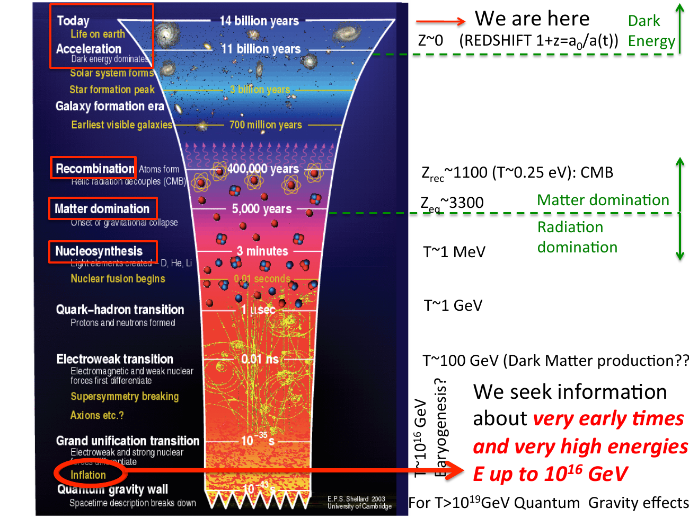

---

## the big picture

BBN takes place in three rough steps:
1. $T \sim 10$ MeV (a hundredth of a second after the Big Bang): everything in NSE, nuclear abundances negligible
2. $T \sim 1$ MeV (one second): the n/p ratio freezes out at $\sim 1/6$
3. $T \sim 0.3$ to $0.1$ MeV (1 to 3 minutes): D, $^3$H, $^3$He pile up, then $^4$He synthesizes; the **deuterium bottleneck** delays everything until 0.1 MeV

schematically:
$$(D, {}^3\text{He}, {}^3\text{H}) \to {}^4\text{He} \quad \text{(via various reactions)}$$
$$\text{and}\quad {}^4\text{He} + ({}^3\text{H}, {}^3\text{He}) \to {}^7\text{Li}$$

the leftover, "unburnt" amounts of D and $^3$He are the BBN abundances we observe today. for example: $p+n \to D + \gamma$, then $D + D \to n + {}^3$He, then ${}^3$He $+ D \to {}^4$He $+ p$.

since nuclei are made of protons and neutrons, the **neutron-to-proton ratio** $n/p$ is the single most important quantity for BBN — essentially all of the neutrons in the universe end up bound into $^4$He.

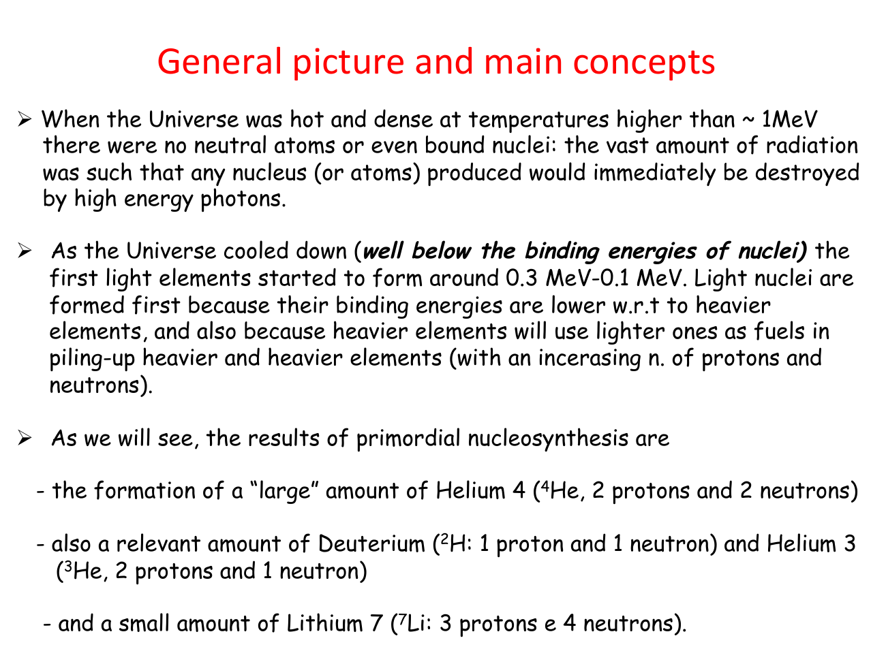

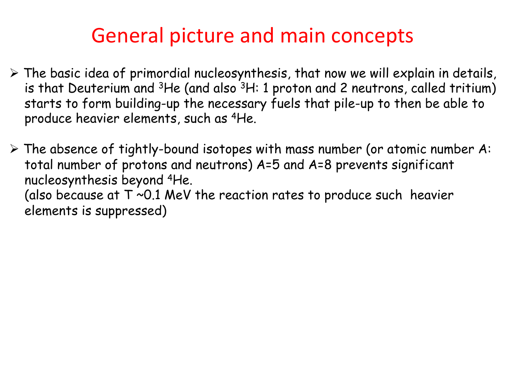

### binding energy per nucleon

the total mass of a nucleus with $Z$ protons and $A-Z$ neutrons is slightly less than the sum of the individual nucleon masses. the difference is the **binding energy**:
$$B_A = Z m_p + (A-Z) m_n - m_A$$

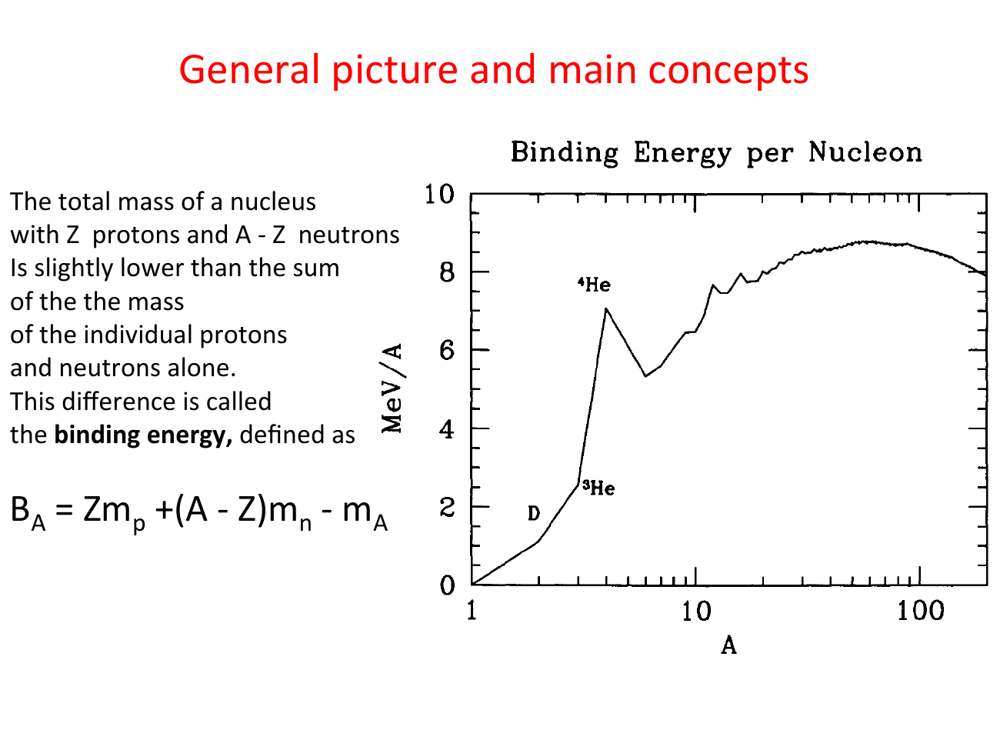

light elements (D, $^3$He) have binding energies of just a few MeV per nucleon. $^4$He sits at $\sim 7$ MeV/A, which is why it dominates the BBN end-state. heavier elements continue to climb up to iron at $\sim 8.8$ MeV/A.

---

## nuclear statistical equilibrium and initial conditions

in the early universe, nuclear reactions are fast compared to expansion ($\Gamma \gg H$), so all species sit in **NSE**. for a non-relativistic species of mass number $A$ and $Z$ protons:
$$n_A = g_A \left(\frac{m_A T}{2\pi}\right)^{3/2} e^{(\mu_A - m_A)/T} \qquad (1)$$

(this is just the Maxwell-Boltzmann limit of the equilibrium distribution.)

if the formation reactions occur rapidly compared to $H$, then chemical equilibrium also holds:
$$\mu_A = Z\mu_p + (A-Z)\mu_n \qquad (2)$$

so I can write
$$e^{\mu_A/T} = (e^{\mu_p/T})^Z (e^{\mu_n/T})^{A-Z} \qquad (3)$$

inverting equation (1) for protons and neutrons themselves,
$$e^{\mu_p/T} = (n_p/g_p)(2\pi/m_p T)^{3/2} e^{m_p/T}$$
and similarly for neutrons, and substituting into (3):

$$e^{\mu_A/T} = (n_p/g_p)^Z (n_n/g_n)^{A-Z} (2\pi/m_p T)^{3Z/2} (2\pi/m_n T)^{3(A-Z)/2} e^{Zm_p + (A-Z)m_n)/T} \qquad (5)$$

taking $g_p = g_n = 2$ and $m_p \approx m_n \equiv m_N \approx m_A/A$ in the prefactor (the exponential is much more sensitive, so I cannot do this there):

$$e^{\mu_A/T} = 2^{-A}(n_p)^Z(n_n)^{A-Z}(2\pi/m_N T)^{3A/2} e^{(Zm_p + (A-Z)m_n)/T} \qquad (6)$$

now substitute back into (1) and use $B_A = Zm_p + (A-Z)m_n - m_A$:

$$\boxed{\,n_A = g_A A^{3/2}\, 2^{-A}(n_p)^Z(n_n)^{A-Z}\,(2\pi/m_N T)^{(3/2)(A-1)}\,e^{B_A/T}\,} \qquad (7)$$

this is the master NSE expression. the exponential factor $e^{B_A/T}$ is the binding-energy enhancement we expect; the prefactors carry the kinematic information.

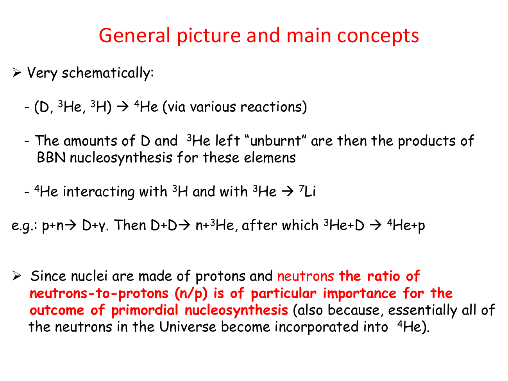

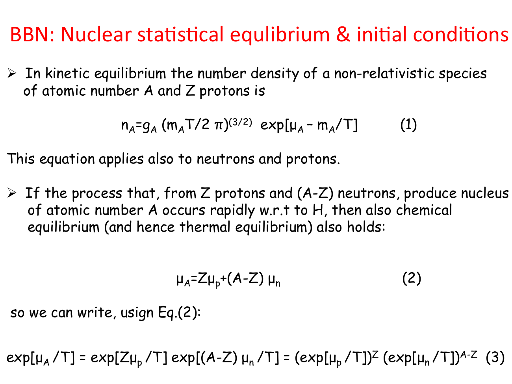

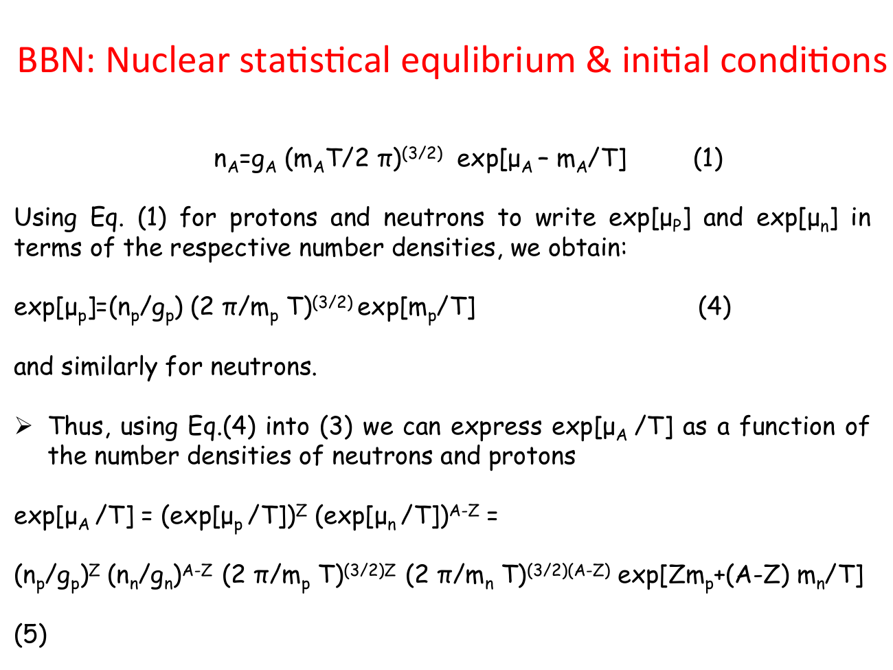

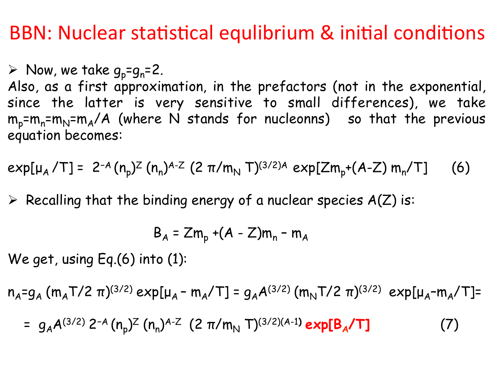

### mass fractions

quantify abundances using the total nucleon density
$$n_N = n_p + n_n + \sum_i (A n_A)_i$$

and the **mass fraction** of nuclear species $A(Z)$:
$$X_A = \frac{A n_A}{n_N}$$

with $\sum_i X_i = 1$.

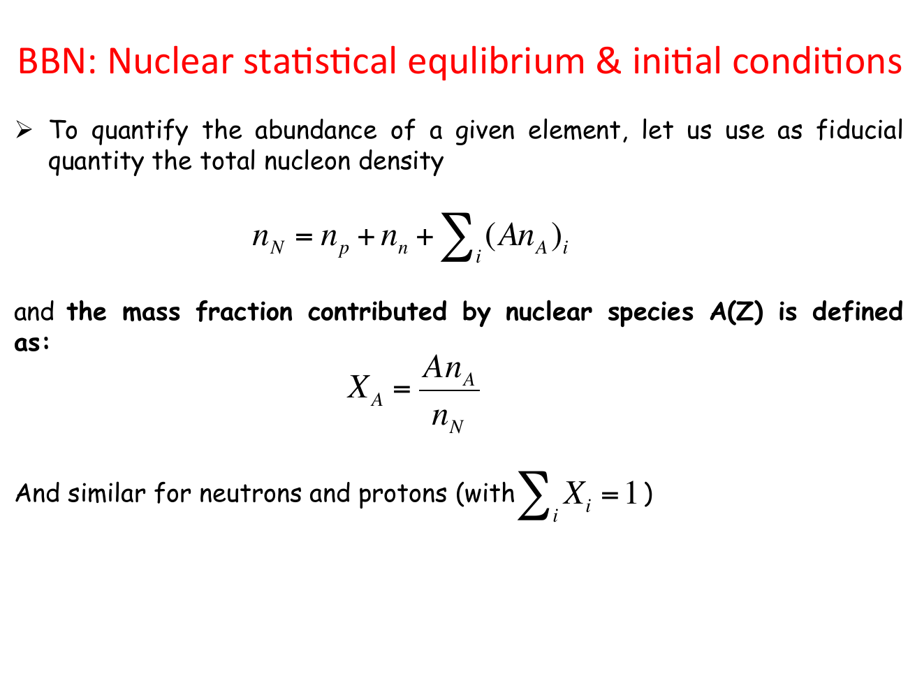

---

## the baryon-to-photon ratio $\eta$

a critical cosmological number for BBN:
$$\eta = \frac{n_N}{n_\gamma}$$

a simple estimate gives $n_N = 1.38 \times 10^{-5}\, (\Omega_{0b} h^2)$ cm$^{-3}$ today. with the photon number density $n_\gamma = (2\zeta(3)/\pi^2) T^3 \simeq 422$ cm$^{-3}$ (see [Cosmic_inventory_photons](../../02_Zettel/Theory/Cosmic_inventory_photons.md)):
$$\boxed{\,\eta = \frac{n_N}{n_\gamma} = 2.68 \times 10^{-8} (\Omega_{0b} h^2) \quad \text{today}\,}$$

with Planck's $\Omega_b h^2 \approx 0.0224$ this gives $\eta \sim 6 \times 10^{-10}$. *one nucleon per about a billion photons.* the universe is photon-dominated by number.

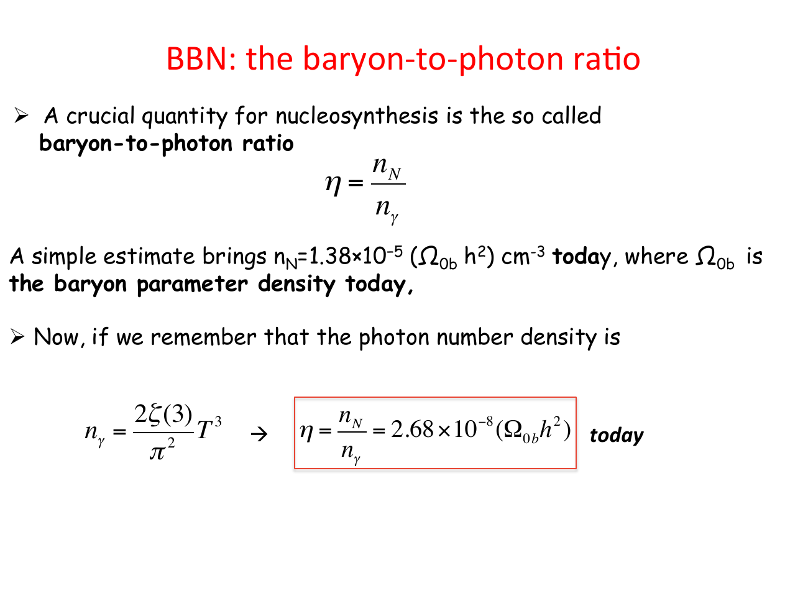

### why $\eta$ is approximately constant

the entropy density of the universe is
$$s = \frac{2\pi^2}{45} g_{*s}(T) T^3$$

so it scales like the number density of relativistic particles:
$$s = 1.8\, g_{*s}(T)\, n_\gamma$$

the quantity $n_N/s$ is just the baryon number per comoving volume, which is conserved unless something violates baryon number. so
$$\eta = \frac{n_N}{n_\gamma} = 1.8\, g_{*s}(T) \cdot \frac{n_N}{s}$$

is **not** strictly constant in general, because $g_{*s}$ changes with temperature. it *is* constant after $e^\pm$ annihilation (which transfers $e^\pm$ entropy to photons at $T \sim m_e/3 \sim 0.5$ MeV), because after that $g_{*s}$ is fixed and $n_\gamma \propto a^{-3}$ rigorously.

since BBN happens at $T \sim 0.3$–$0.1$ MeV (well after $e^\pm$ annihilation), I can treat $\eta$ as a constant equal to its present value.

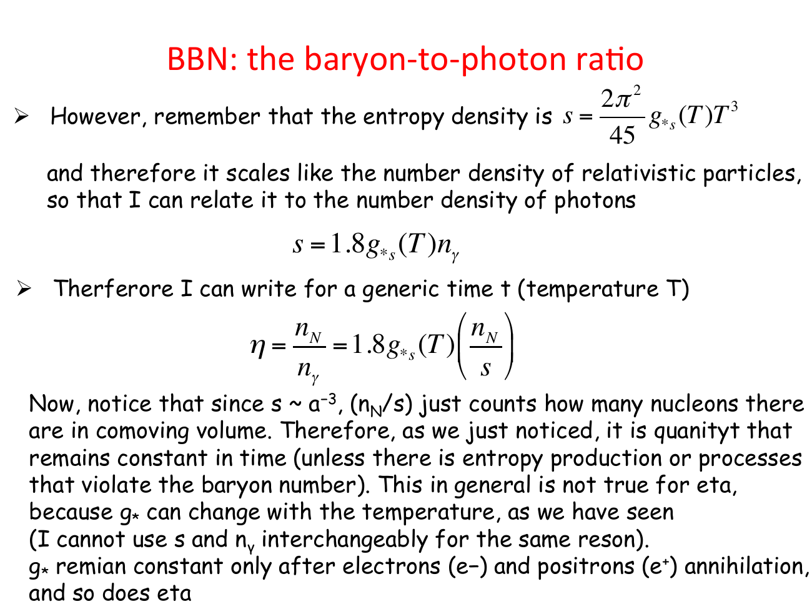

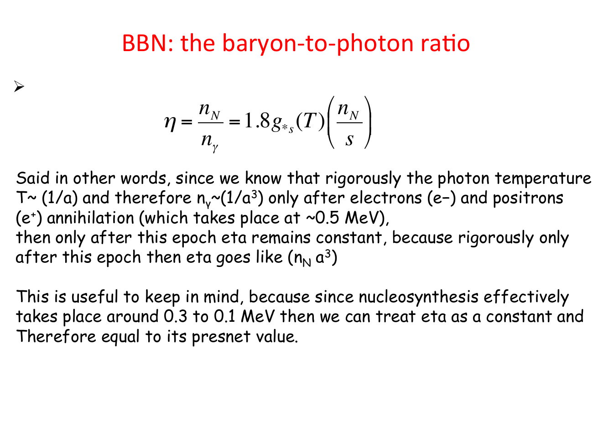

### NSE mass fraction in terms of $\eta$

starting from (7) and the definition of $X_A$, after a few substitutions:
$$X_A = g_A\,[\zeta(3)^{A-1}\, 2^{(3A-5)/2}\, \pi^{(1-A)/2}]\, A^{5/2}\, (T/m_N)^{(3/2)(A-1)}\, (X_p)^Z (X_n)^{A-Z}\, e^{B_A/T}\, \eta^{A-1}$$

so $X_A \propto \eta^{A-1}$ — a strong dependence on the baryon-to-photon ratio for heavier species.

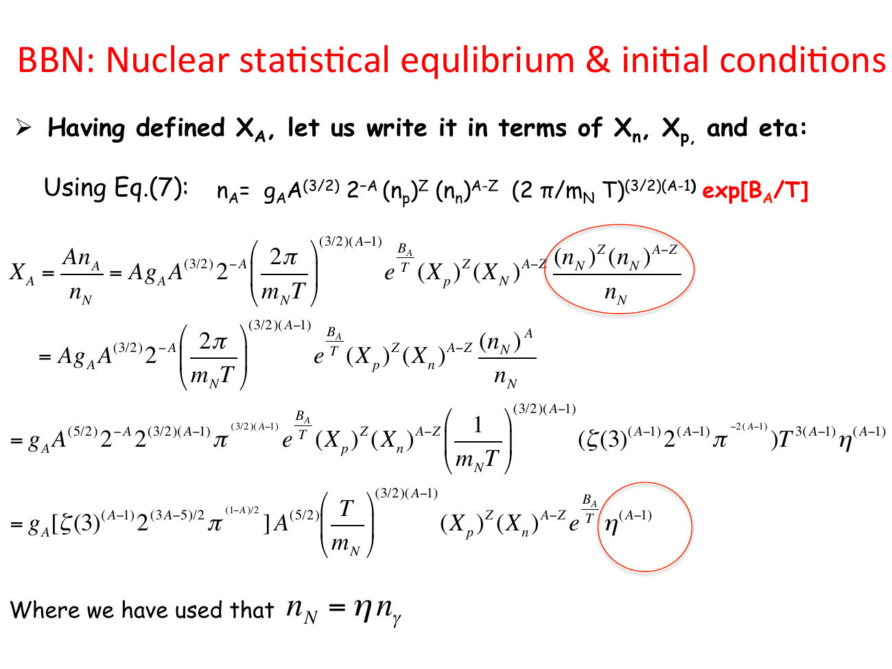

---

## initial conditions: the n/p ratio at $T \gg 1$ MeV

at very high temperatures (and at $t \ll 1$ s), the balance between neutrons and protons is determined by **weak interactions**:

$$n \leftrightarrow p + e^- + \bar\nu_e$$
$$n + \nu_e \leftrightarrow p + e^-$$
$$e^+ + n \leftrightarrow p + \bar\nu_e$$

while the rates $\Gamma_i \gg H$, chemical equilibrium holds:
$$\mu_n + \mu_\nu = \mu_p + \mu_e$$

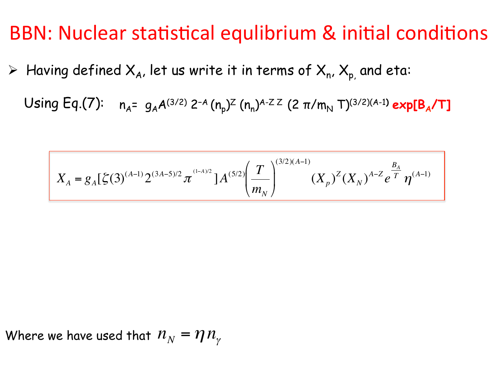

so in (thermal) equilibrium:
$$\frac{n}{p} = \frac{X_n}{X_p} = \frac{e^{(\mu_n - m_n)/T}}{e^{(\mu_p - m_p)/T}} = e^{-(m_n - m_p)/T}\, e^{(\mu_n - \mu_p)/T}$$
$$\boxed{\,\frac{n}{p} = e^{-Q/T}\, e^{(\mu_e - \mu_\nu)/T}\,}$$

where $Q = m_n - m_p = 1.293$ MeV.

the chemical potentials in the second exponential: $\mu_e/T \sim n_e/n_\gamma \sim n_p/n_\gamma \sim \eta \sim 10^{-10}$ from charge neutrality. for $\mu_\nu/T$ we cannot measure directly (no detection of the cosmic neutrino background yet), but on theoretical grounds (related to baryogenesis) we assume $\mu_\nu/T \ll 1$. so both terms are negligible:

$$\left(\frac{n}{p}\right)_{EQ} = e^{-Q/T}$$

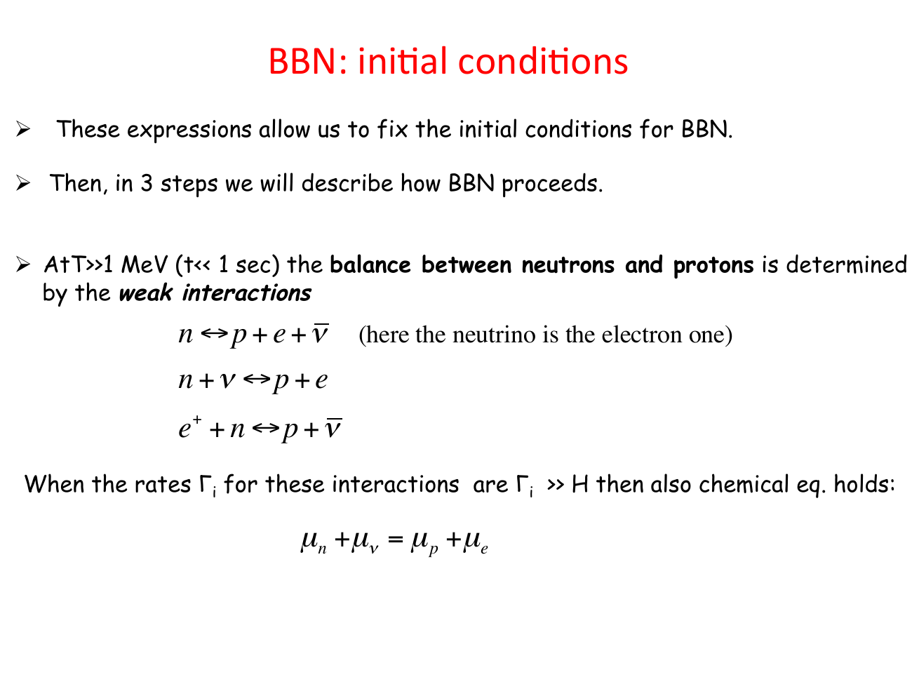

at $T \gg Q = 1.293$ MeV, $(n/p)_{EQ} \approx 1$. for weak interactions
$$\frac{\Gamma_w}{H} \sim \left(\frac{T}{1\,\text{MeV}}\right)^3$$

so as long as $T \gg 1$ MeV, weak interactions are fast, n/p tracks its equilibrium value of 1.

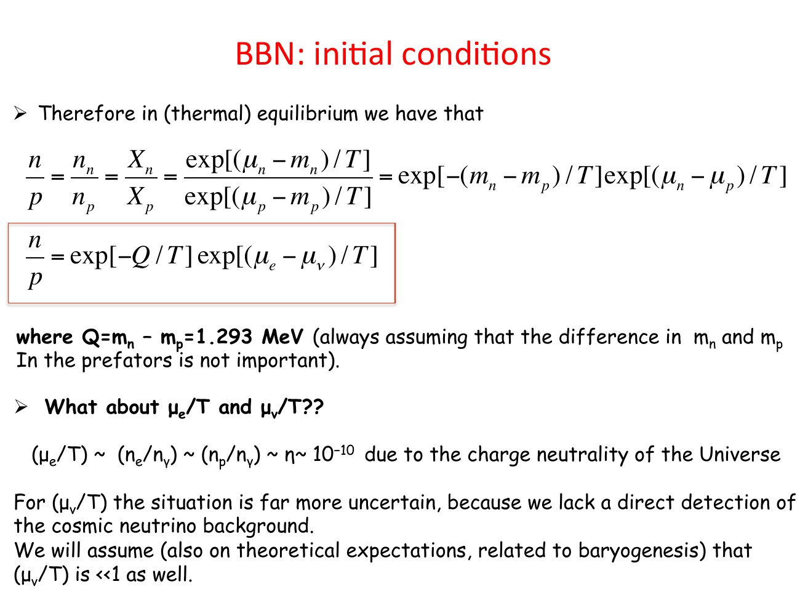

### the bigger picture: NSE delays nucleosynthesis to $T \ll \text{MeV}$

at $T \gg 1$ MeV, the rates for the *nuclear* (electromagnetic) reactions building up light elements are also efficient — so NSE among the various nuclear species holds. but the abundances are still tiny because temperatures are far above the nuclear binding energies.

an example: a system of n, p, D, $^3$He, $^4$He, and $^{12}$C in NSE has
$$(X_n/X_p) = e^{-Q/T}$$
$$X_2 = 16.3 (T/m_N)^{3/2} e^{B_2/T} X_n X_p\, \eta$$
$$X_3 = 57.4 (T/m_N)^3 e^{B_3/T} X_n X_p^2\, \eta^2$$
$$\dots$$

each species has $X_A \propto \eta^{A-1}$.

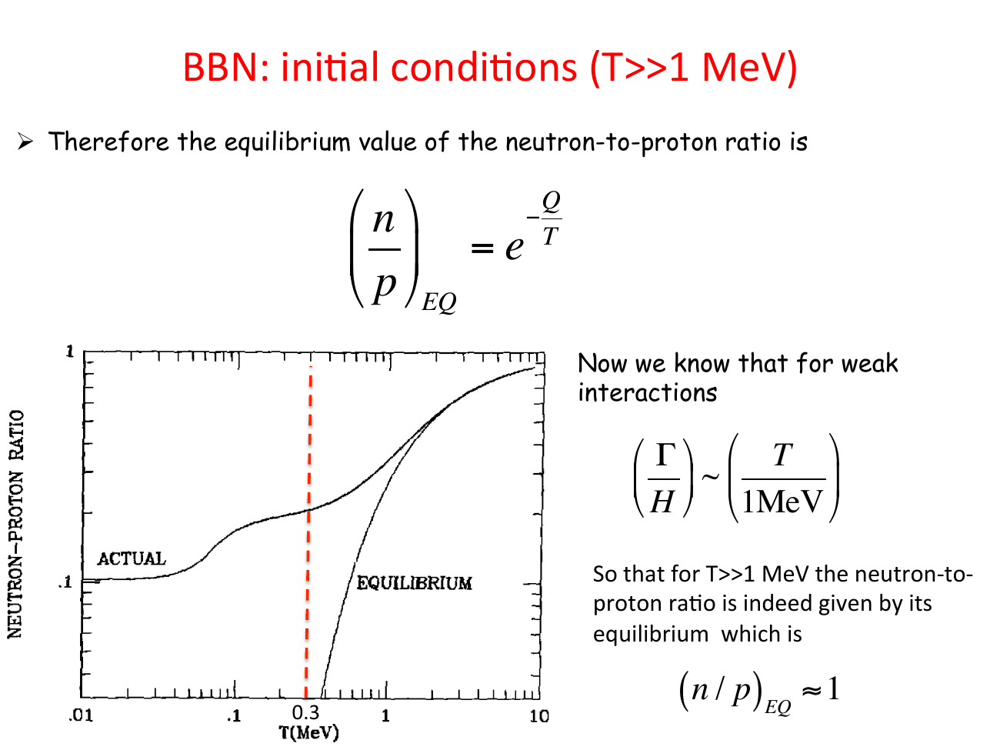

plotting these abundances as a function of $T$:

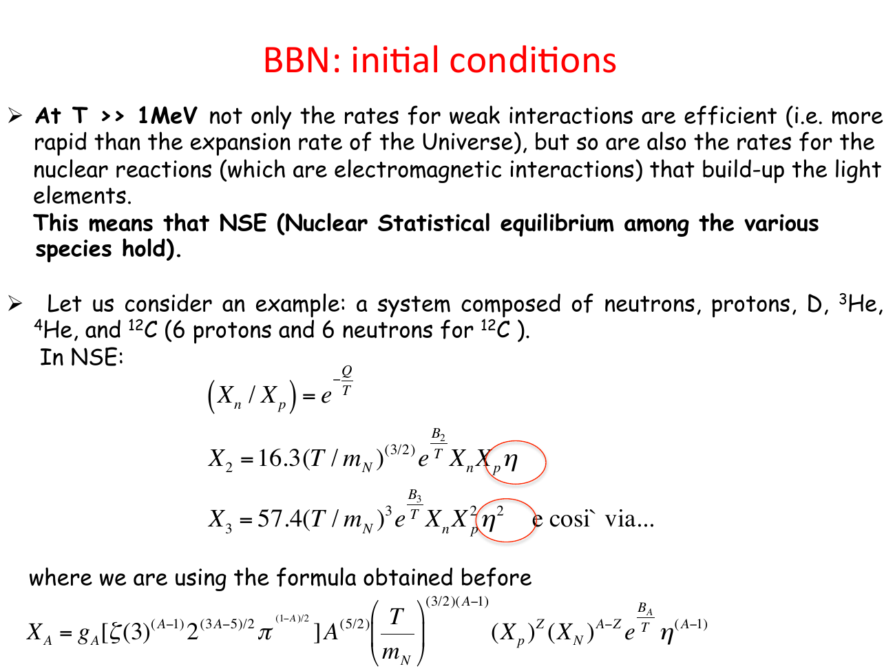

(at log $T_{\rm MeV} = -0.5$, i.e. $T \approx 0.3$ MeV, you see $^4$He and $^{12}$C cross over into significant abundance.)

despite the binding energies being 1–8 MeV, **the NSE abundances of nuclear species reach order unity only well below those binding energies, around 0.3 MeV**. why?

> *this is due to the very high entropy of the universe, i.e. the very small baryon-to-photon ratio $\eta \sim 10^{-10}$. even when $T$ is at or below a few MeV, energetic considerations would favor the formation of nuclei, but **entropy** considerations favor still free nucleons.*

a quick estimate: the temperature at which species $A$ becomes abundant ($X_A \sim 1$) is
$$T_{\rm NUCL} \approx \frac{B_A/(A-1)}{\ln(\eta^{-1}) + 1.5\ln(m_N/T)}$$

so for D one finds $T_{\rm NUCL} \approx 0.07$ MeV; for $^3$He, 0.11 MeV; for $^4$He, 0.28 MeV.

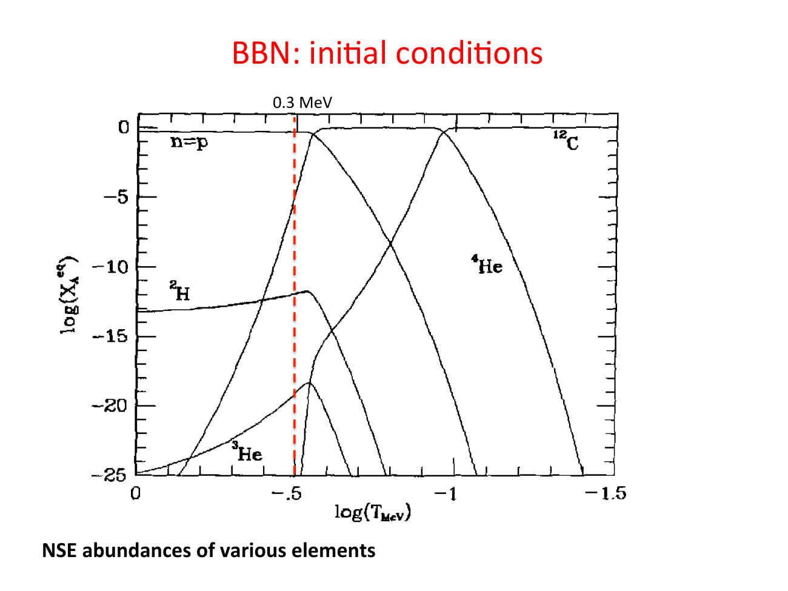

### the deuterium "bottleneck" — actually entropy

the standard textbook explanation says nucleosynthesis is delayed by the small binding energy of deuterium (2.22 MeV). Bartolo's slides correct this:

> *NSE abundances of $^4$He being very small until $T \sim 0.3$ MeV is due to the huge entropy of the universe and not to the small binding energy of deuterium.*

a small bottleneck due to D (and $^3$He) does exist around $T \sim 0.1$ MeV: the small abundances of D and $^3$He **slow down** ${}^4$He synthesis a bit. but it is not the main reason for the delay.

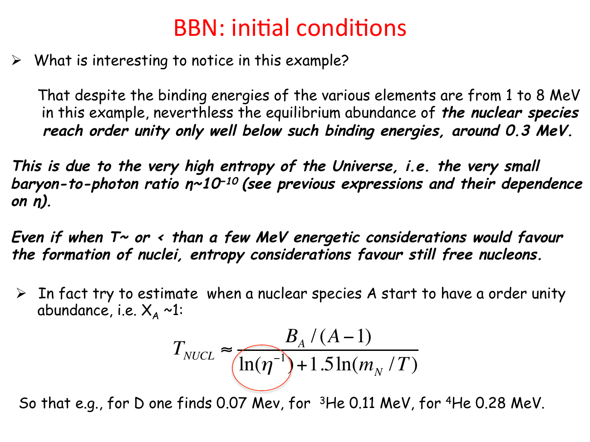

---

## the three steps of BBN

### Step 1: $T \sim 10$ MeV ($t \sim 10^{-2}$ sec)

universe is **radiation-dominated**. relativistic species: photons, $e^\pm$, three light neutrino species, total $g_* = 10.75$ ($T_\nu = T_\gamma$ at this epoch).

**all weak interactions are efficient**, $\Gamma \gg H$, so $(n/p) = (n/p)_{EQ} \approx 1$ (since $T \gg Q$).

light elements are in NSE but their abundances are tiny because $T \gg B_A$ and because $\eta$ is small:

$$X_n \approx X_p \approx 0.5$$
$$X_2 \sim 10^{-12}, \quad X_3 \sim 10^{-23}, \quad X_4 \sim 10^{-30}$$

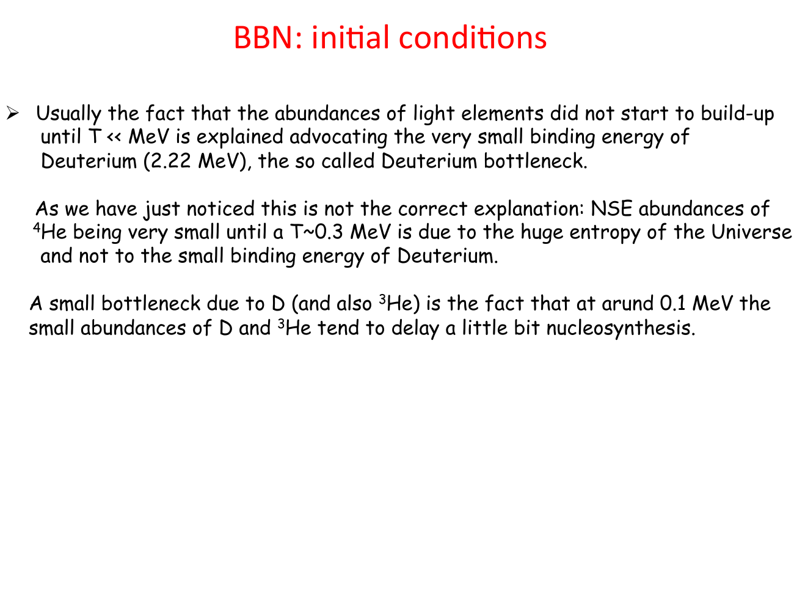

### Step 2: $T \sim 1$ MeV ($t \sim 1$ sec)

this is where the action happens.

just before this, neutrinos decouple. then at $T \sim m_e/3$, electrons and positrons annihilate, transferring their entropy to photons and raising the photon temperature relative to neutrinos by a factor:
$$\frac{T_\gamma}{T_\nu} = (11/4)^{1/3} \approx 1.4$$

at around $T \sim 1$ MeV, weak interactions interconverting n and p **freeze out** — $\Gamma_w$ becomes inefficient relative to $H$ — so the n/p ratio gets frozen at approximately its equilibrium value at this epoch, $T_F \sim 0.8$ MeV:

$$\left(\frac{n}{p}\right)_{\rm freeze-out} = e^{-Q/T_F} = e^{-1.293/0.8} \approx \frac{1}{6}$$

this is one of the most important examples in cosmology of a process that goes out of equilibrium. it is exactly why we spent so much time setting up the conditions for departure from equilibrium.

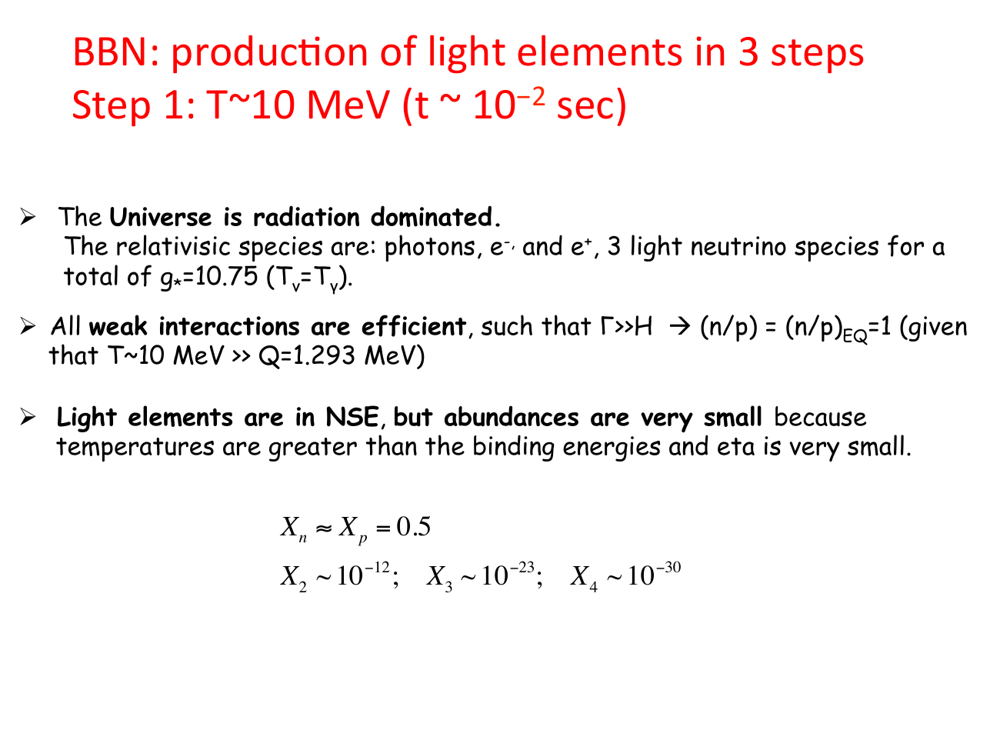

at this point the abundances are still:
$$X_n \approx 1/7, \quad X_p \approx 6/7$$
$$X_2 \sim 10^{-12}, \quad X_3 \sim 10^{-23}, \quad X_4 \sim 10^{-28}, \quad X_{12} \sim 10^{-108}$$

(the n/p ratio has shifted slightly from $1/6$ to $\sim 1/7$ due to occasional free neutron decays, $\tau_{1/2}(n) \approx 610$ s.)

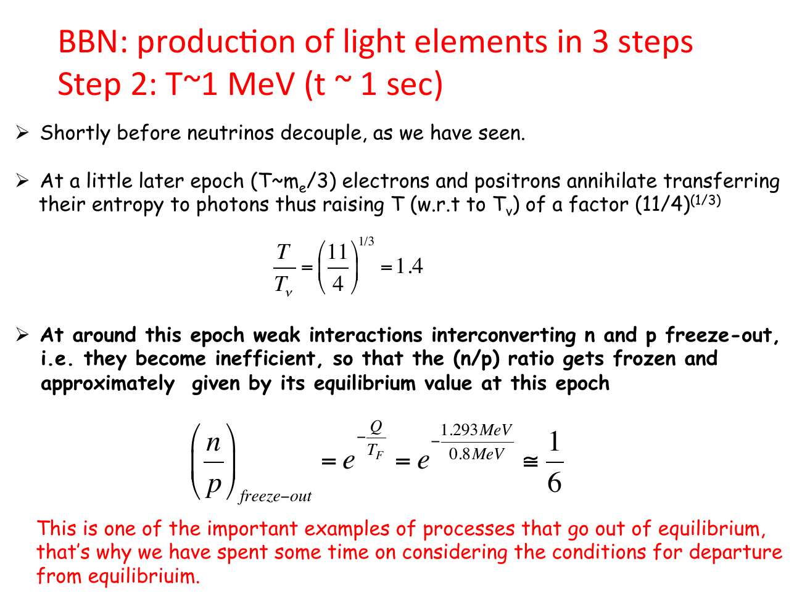

at $T \sim 0.3$ MeV the NSE value of $^4$He approaches unity. but **shortly before**, at $T \sim 0.5$ MeV, the actual abundance of $^4$He falls *below* its NSE value. why?

> the rates for the processes synthesizing $^4$He are not fast enough to catch up with the expansion of the universe.

these reactions are
- $D + D \to n + {}^3$He, then ${}^3$He $+ D \to {}^4$He $+ p$
- $D + D \to p + {}^3$H, then ${}^3$H $+ D \to {}^4$He $+ n$
- $D + D \to {}^4$He $+ \gamma$

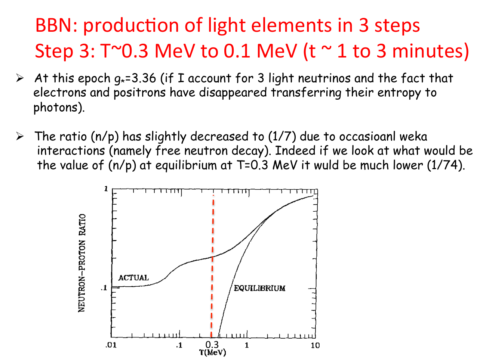

their rates $\Gamma = n_A \sigma v$ are low for two reasons:
1. the abundances of the "fuels" D, $^3$He, $^3$H are still very low, $X_A \sim 10^{-12}$
2. the cross-sections $\sigma$ are suppressed by **Coulomb barrier**:
$$\sigma \propto \exp[-2(A_1 A_2/(A_1+A_2))^{1/3} Z_1 Z_2 T_{\rm MeV}^{-1/3}]$$

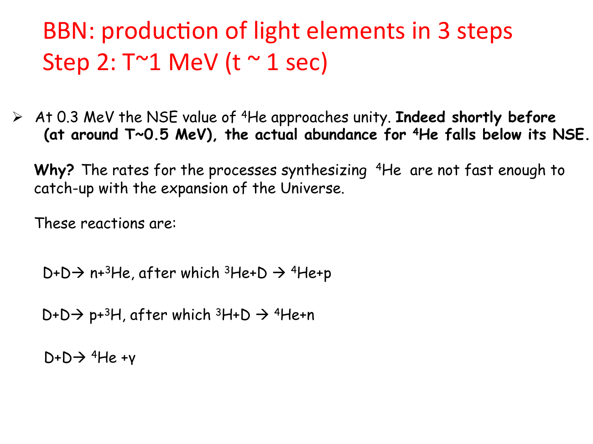

once the abundances of D, $^3$He, $^3$H reach order unity at $T_{\rm NUCL} \sim 0.1$ MeV, the reactions become fast enough — and **essentially all the neutrons are bound into $^4$He**, the most tightly bound light species.

mass fraction of $^4$He, assuming all neutrons go into $^4$He:
$$X_4 = \frac{4 n_4}{n_N} \simeq \frac{4(n_n/2)}{n_n + n_p} = \frac{2(n/p)_{\rm NUCL}}{1 + (n/p)_{\rm NUCL}} \simeq \frac{2(1/7)}{1 + (1/7)} = \frac{1}{4} = 25\%$$

this is the most famous prediction of BBN: roughly a quarter of the universe's baryonic mass is locked into $^4$He, primordially.

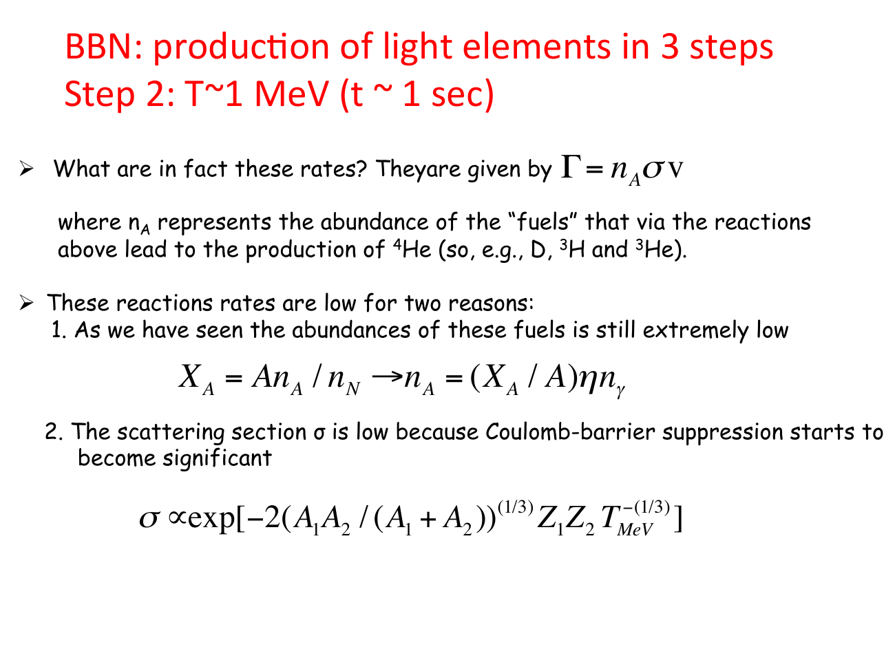

### Step 3: $T \sim 0.3 \to 0.1$ MeV ($t \sim 1$ to 3 minutes)

at this epoch $g_* = 3.36$ (3 light neutrinos + photons; $e^\pm$ have annihilated). the n/p ratio has slowly decayed to $\sim 1/7$ because of occasional weak processes, mainly free neutron decay.

(an interesting check: at NSE, $T = 0.3$ MeV would give $(n/p)_{EQ} = e^{-Q/T} = e^{-4.31} \sim 1/74$, much smaller than the actual $1/7$. so the n/p ratio has *decoupled from equilibrium* — exactly what we expect from the freeze-out picture.)

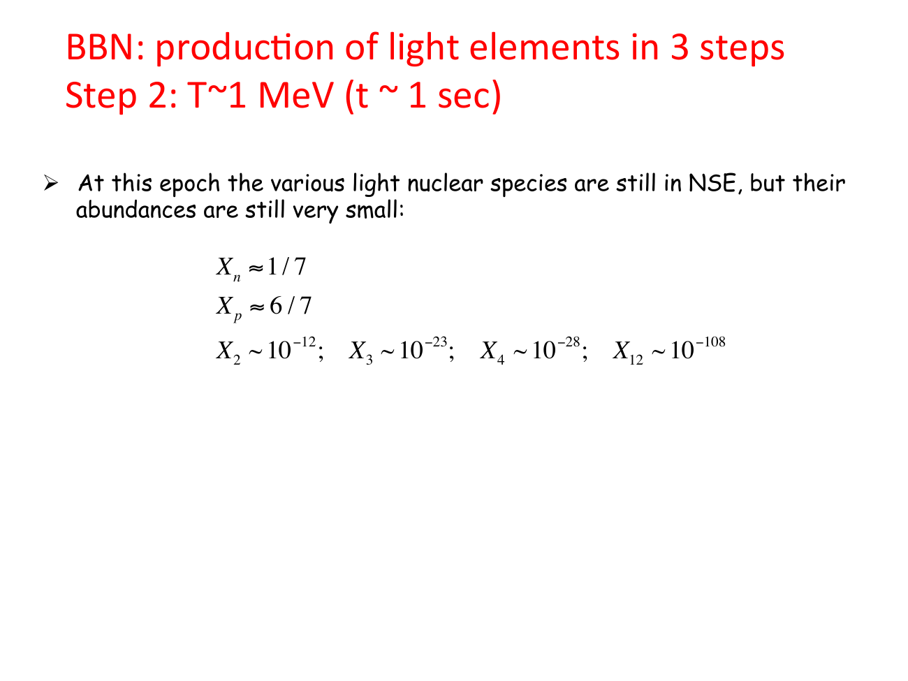

### what about D, $^3$He, $^7$Li?

a substantial amount of D and $^3$He is produced in the sense that some is left **unburnt**:
$$D/H \sim {}^3\text{He}/H \sim 10^{-5} \text{ to } 10^{-4}$$

this happens because the rates burning them into $^4$He depend on $\eta$:
$$\Gamma \propto n_{2,3} \sigma v \propto X_{2,3} (\eta n_\gamma) \sigma v$$

so as $X_2$, $X_3$ decrease (because $^4$He is being made), the rates fall and the reactions freeze out — leaving leftover D and $^3$He.

since these rates depend on a *power* of $\eta$, **higher $\eta$ → faster burning → less unburnt D and $^3$He**:
> abundances of D and $^3$He decrease with increasing $\eta$.

and a small amount of $^7$Li:
$${}^7\text{Li}/H \sim 10^{-10} \text{ to } 10^{-11}$$

via two channels:
- for $\eta < 3 \times 10^{-10}$: $^4$He $+ ^3$H $\to ^7$Li $+ \gamma$
- for $\eta > 3 \times 10^{-10}$: $^4$He $+ ^3$He $\to ^7$Be $+ \gamma$, followed by $\beta$-decay of $^7$Be into $^7$Li

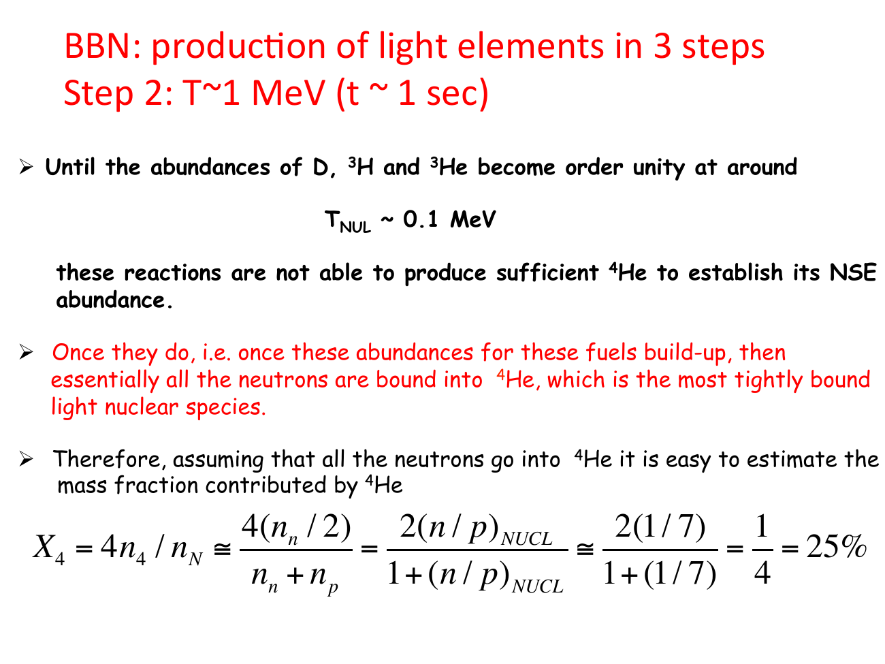

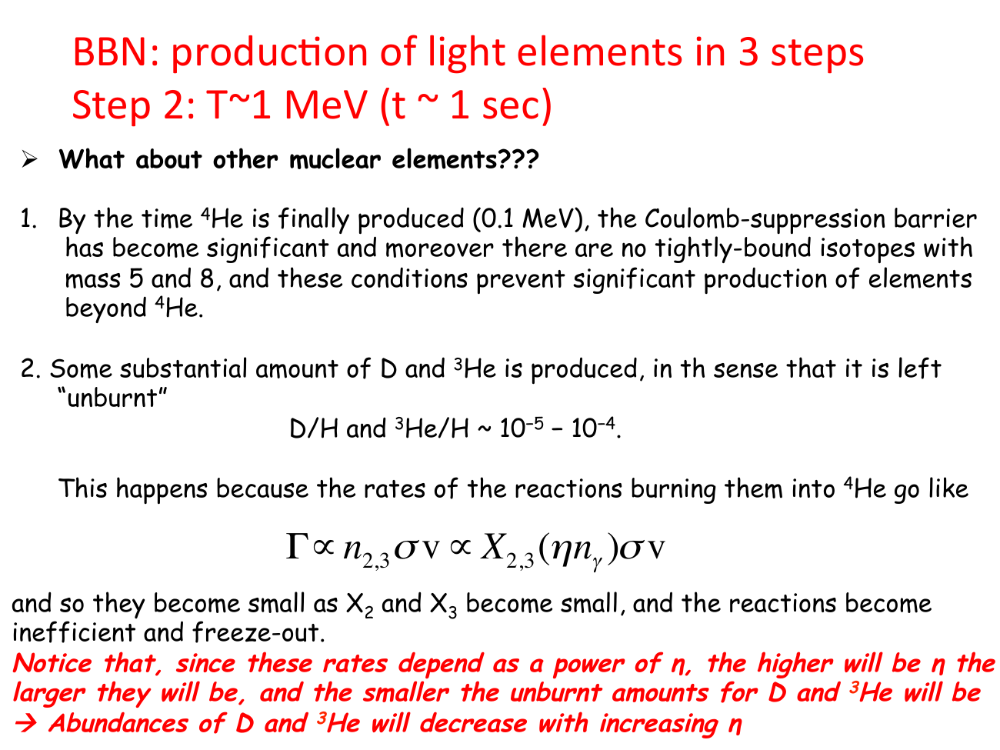

---

## main parameters determining theoretical predictions

how precise are BBN predictions, and on what do they depend?

### 1. nuclear physics input

the relevant cross-sections are known with great precision. some uncertainty remains in the rates that produce and destroy $^7$Li.

importantly, the final abundances depend on **the weak interaction rates** that regulate the n/p ratio. these are the same rates that determine the **neutron half-life** $\tau_{1/2}(n) = 610.11 \pm 1$ s.

dimensionally:
$$\Gamma \propto G_F^2 T^5, \qquad \tau_{1/2}(n) \propto (G_F^2 m_n^5)^{-1} \quad \Rightarrow \quad \Gamma \propto T^5/\tau_{1/2}(n)$$

an **increase** in $\tau_{1/2}(n)$ (longer-lived neutron) decreases all weak interaction rates, leading to **earlier freeze-out** of n/p (because $\Gamma_w \sim H$ is satisfied at higher $T$), and thus a **larger frozen n/p ratio** and consequently **more $^4$He**.

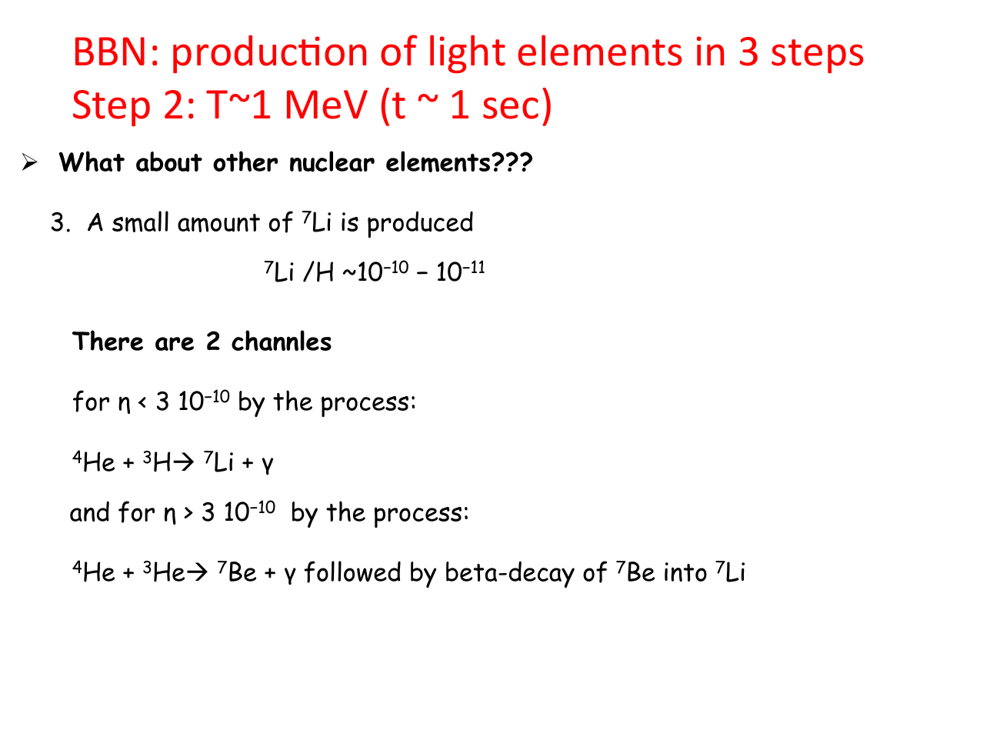

### 2. cosmological parameters: $g_*(T)$ and $\eta$

since $H \propto g_*^{1/2} T^2$, an increase in $g_*$ leads to a faster expansion, an earlier freeze-out of n/p, and a higher $^4$He abundance. **this is how BBN constrains the number of light particle species in the universe** — extra neutrino species, or primordial gravitational waves, would all increase $g_*$.

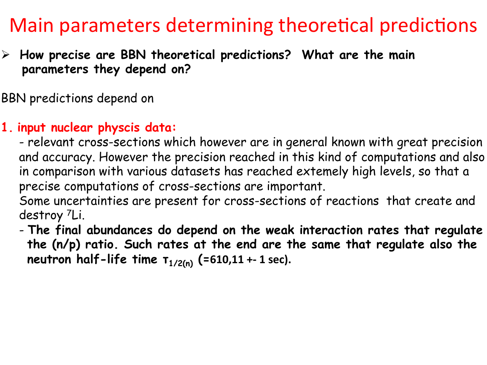

### 3. dependence on $\eta$

we already saw $X_A \propto \eta^{A-1}$. so:
- increasing $\eta$ → light elements build up earlier, $^4$He synthesizes earlier when $(n/p)$ is larger → **more $^4$He** (but only slightly, because n/p only decreases slowly through neutron decay)
- D, $^3$He: their final abundances **decrease strongly with increasing $\eta$**, because the burning rate is faster
- $^7$Li: there's a "trough" in $^7$Li/H at $\eta \sim 3 \times 10^{-10}$, where the two production channels swap dominance

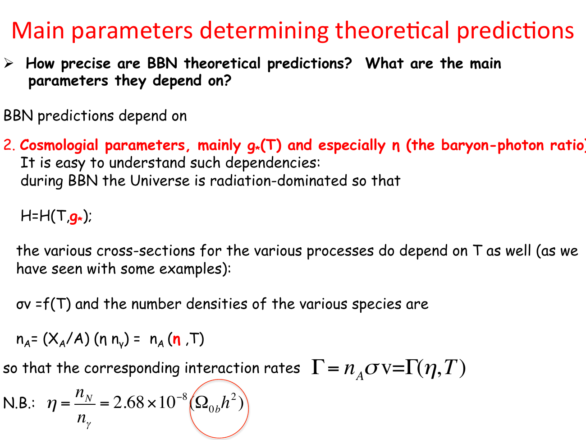

---

## BBN theoretical predictions

the development of primordial nucleosynthesis as a function of $T$ for $\eta = 3 \times 10^{-10}$, $\tau_{1/2} = 10.6$ min, $N_\nu = 3$:

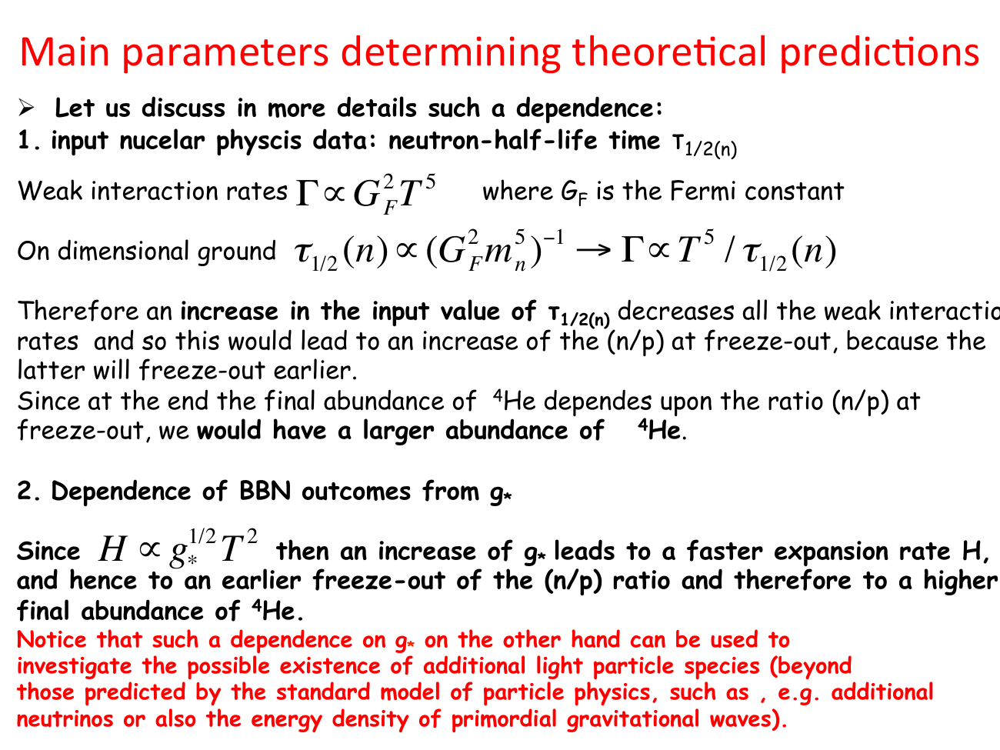

a more modern version with all the species labeled:

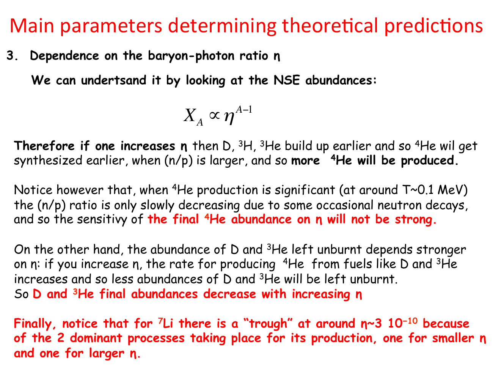

(Pradler & Pospelov 1011.1054.) you can see deuterium burning (D b.n.), neutrino decoupling, n/p decoupling, $e^\pm$ annihilation, and finally standard BBN freeze-out (SBBN f.o.) on a single timeline.

abundances as a function of $\eta$:

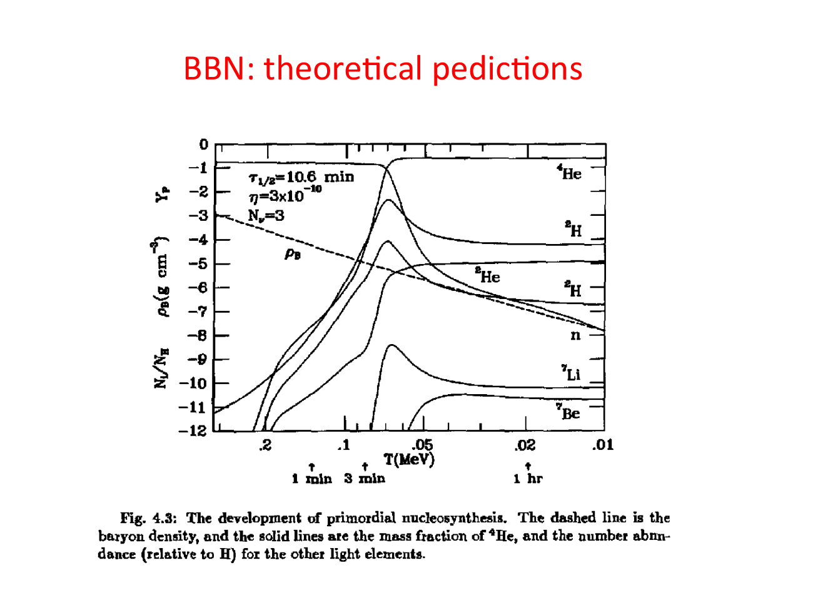

the $^4$He mass fraction $Y_p$ slowly increases with $\eta$ (and with $N_\nu$). the curves for D, $^3$He, $^7$Li are sensitive in different ways. the $^7$Li **trough** at $\eta \sim 3 \times 10^{-10}$ is visible.

---

## comparison with observations

### deuterium

the textbook way to measure D historically was through molecules (HD) and meteorites in the solar system. these measurements gave
$$D/H \sim (1\text{–}4) \times 10^{-10}$$

(after correcting for non-primordial isotopic effects).

D is **easily burned** at $T > 0.5 \times 10^6$ K and **difficult to produce**, so any local D measurement is really a **lower bound** on the primordial abundance, hence a **upper limit on $\eta$**.

the modern way: **absorption lines of quasars by D at high redshift** ($z \sim 3$–$4$) in intervening gas systems. high-z is important because there has been less stellar processing.

these measurements actually give a **direct precise determination** of $(D/H)_{\rm prim}$, not just a lower bound:

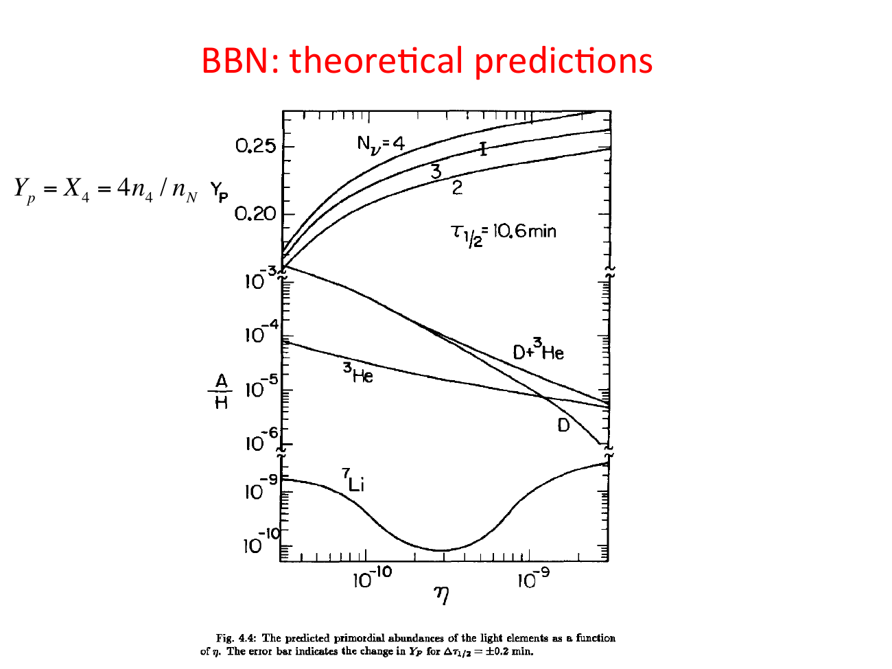

$$D/H = \frac{10^5\, n_D}{n_H} = 2.527 \pm 0.030 \quad \text{(68\% CL, Cooke et al. 2018)}$$

this is one of the most precise measurements of the baryon density we have. since the BBN prediction for D depends steeply on $\eta$, even relatively large errors on D translate into small errors on $\Omega_b h^2$.

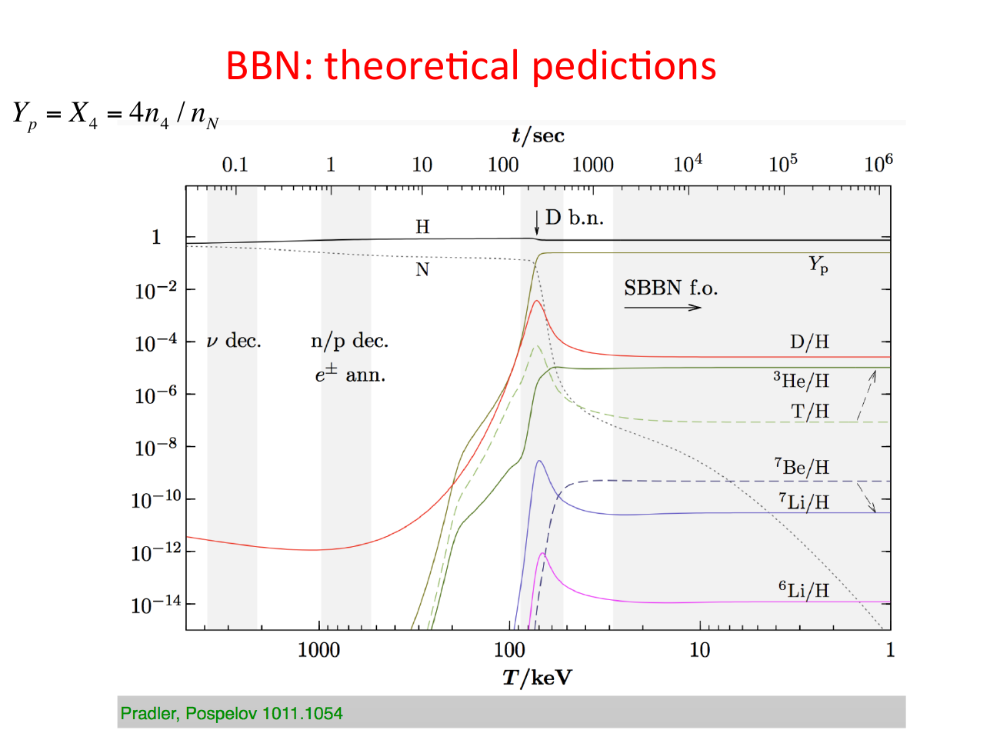

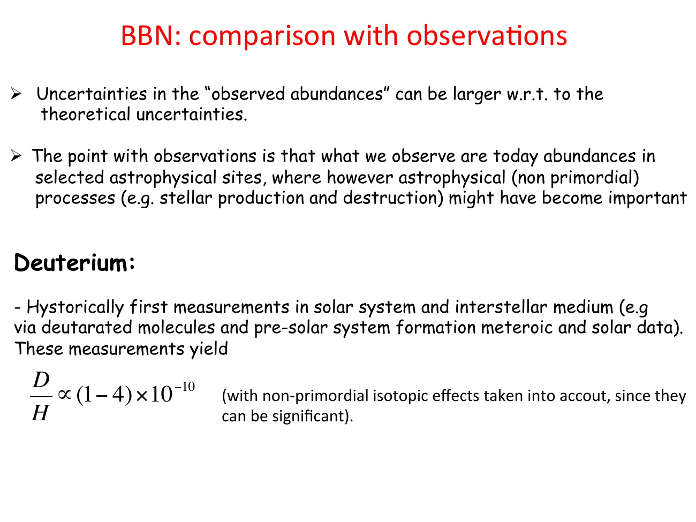

### $^3$He

measurements in the solar system, the hyperfine line of $^3$He$^+$ in HII clouds, and pre-solar meteorites give:
$$\frac{D + {}^3\text{He}}{H} \sim 10^{-5}$$

(since D burns into $^3$He, the measurements are really for the sum.)

$^3$He is **harder to destroy** than D — at most a factor 2 of stellar processing (the "astration factor"). so these measurements are an **upper bound** on the primordial $^3$He abundance, and a **lower bound on $\eta$** combined with D.

historically the consistency of BBN predictions for D and $^3$He gave $4 \le \eta \times 10^{10} \le 10$. now with precise D measurements alone, we get a precise $\eta$.

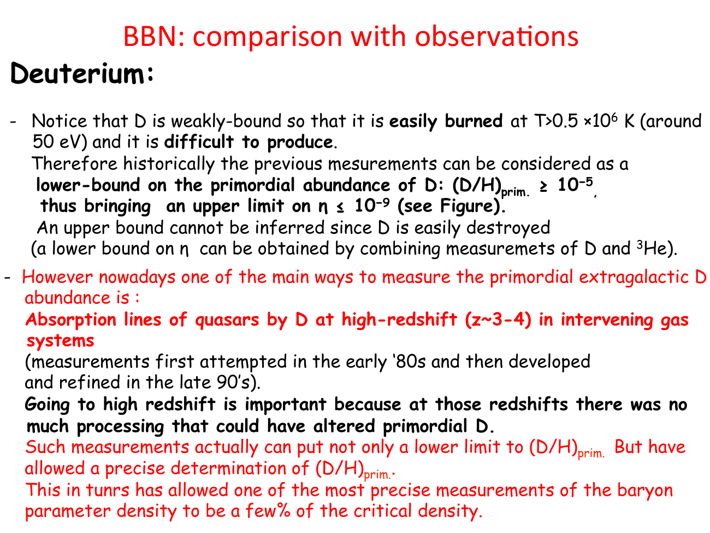

### $^7$Li

measurements first came from meteorites and the local interstellar medium. but $^7$Li is both easily destroyed (at $T > 2 \times 10^6$ K) and easily produced (cosmic-ray spallation, AGB stars), so these are not primordial.

starting in 1982, $^7$Li lines were measured in **old, metal-poor stars**. a remarkable correlation appeared: for low-mass metal-poor stars, $^7$Li abundance dropped sharply with mass, but for higher mass stars it formed a **plateau** (the **Spite plateau**):
$$\frac{{}^7\text{Li}}{H} \sim O(1) \times 10^{-10}$$

this was the sign that $^7$Li survived in higher-mass envelopes. it sits in the "trough" of the predicted $^7$Li($\eta$) curve, making it a sensitive probe of $\eta$.

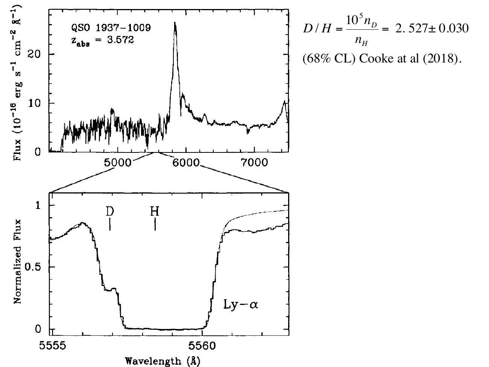

(historically, using D, $^3$He, $^7$Li together: $4 \le \eta \times 10^{10} \le 7$.)

> there is, however, a long-standing **lithium problem**: the BBN-predicted $^7$Li abundance with $\eta$ from CMB is about a factor of 3 *higher* than what is measured in metal-poor halo stars. ongoing puzzle.

### $^4$He

modern $^4$He measurements rely on **recombination lines** of (metal-poor) HII regions, both galactic and extragalactic.

stars produce $^4$He, so high-metallicity environments will overestimate the primordial value. but stars also produce metals, and you'd expect a correlation: lower $^4$He at lower metallicity. that is exactly what we see — so the **best environments to measure primordial $^4$He are metal-poor HII regions**.

extrapolating to zero metallicity:

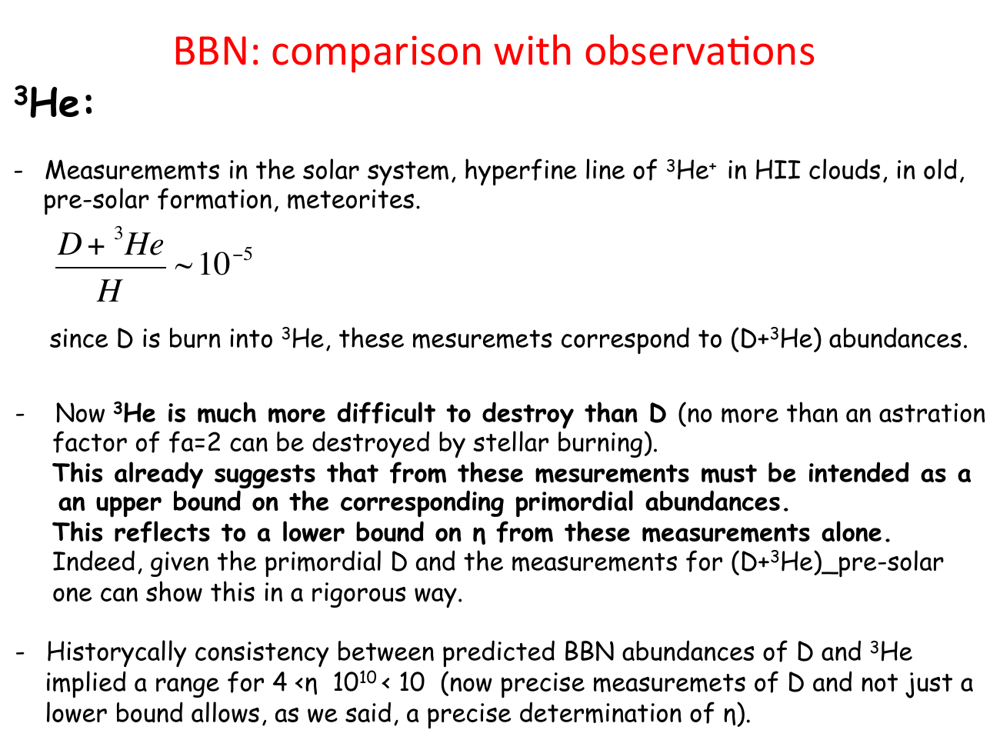

most up-to-date (Aver et al. 2015):
$$Y_p = \frac{4 n_{^4\text{He}}}{n_N} = 0.2449 \pm 0.0040 \quad (68\%\,\text{CL})$$

remarkably consistent with the prediction of $\sim 25\%$.

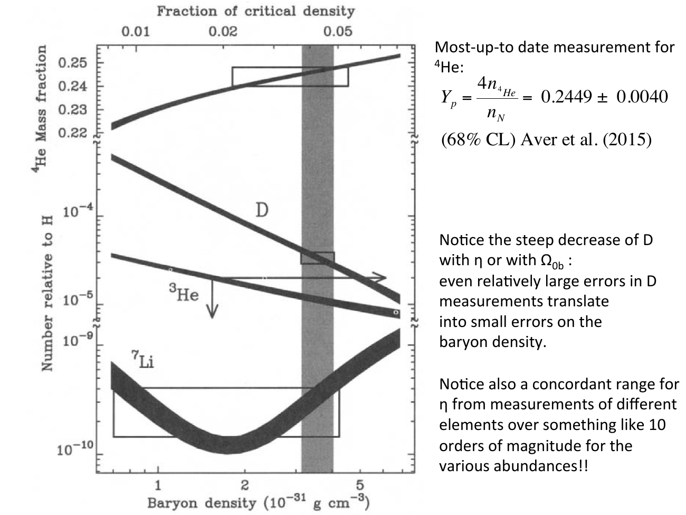

---

## concordance of BBN and CMB

both BBN and CMB anisotropies provide independent measurements of the baryon density $\Omega_{0b}$. from Planck 2018:
$$\Omega_b h^2 = 0.0224 \pm 0.0001$$

these are **two completely independent** measurements of the baryon content, and they are consistent at very high precision. that consistency is one of the strongest validations of the standard hot Big Bang model we have.

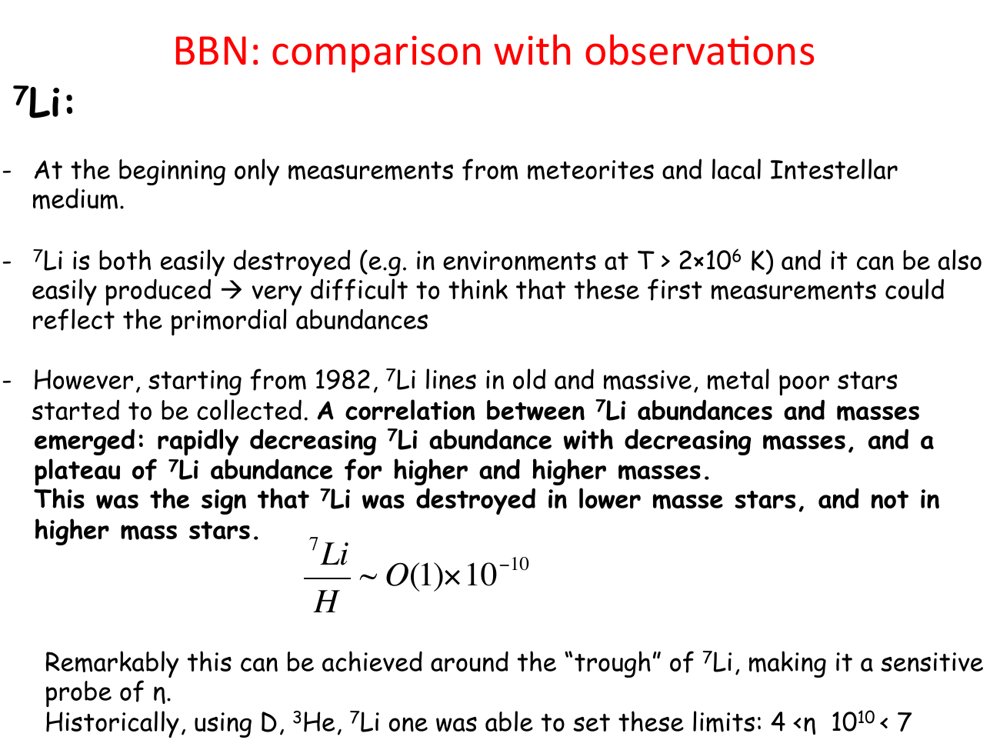

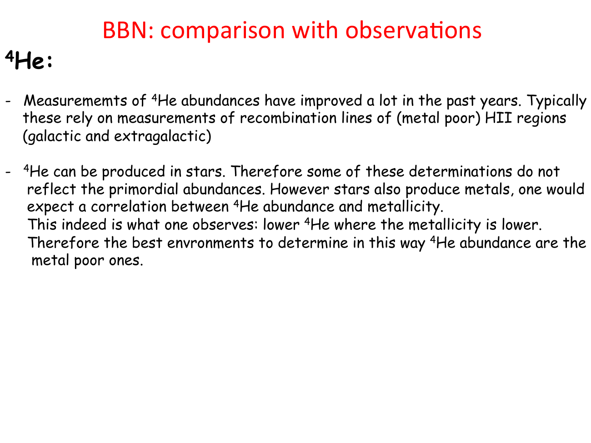

a beautiful summary plot:

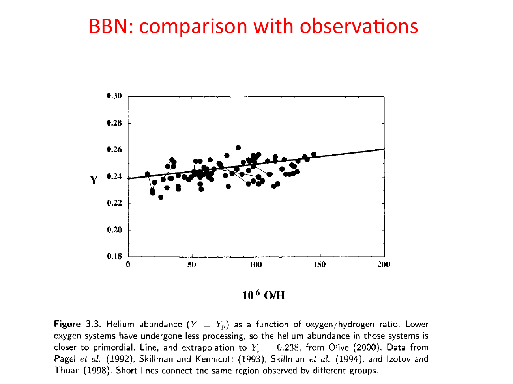

(top) $Y_p^{\rm BBN}$ vs $\omega_b = \Omega_b h^2$, with the standard BBN prediction band (Aver et al. 2015 measurement bracketing the BBN curve) and the Planck CMB constraint (vertical red band).
(bottom) $y_{DP} = $ D/H vs $\omega_b$, with two theoretical predictions (Adelberger et al. 2011 vs Marcucci et al. 2016) and the Cooke et al. 2018 measurement.

both elements pin down $\omega_b$ at the *same* place that the CMB does. this is the heart of why BBN is one of the three observational pillars of the standard model.

---

## takeaway

BBN is the moment when:
- the **n/p ratio** got frozen at $\sim 1/6$ at $T \sim 0.8$ MeV
- the **deuterium bottleneck** held synthesis until $T \sim 0.1$ MeV (driven by entropy, not deuterium binding energy directly)
- essentially **all neutrons** were swept into $^4$He, giving $Y_p \approx 25\%$
- a small amount of **D, $^3$He, $^7$Li** survived "unburnt"

it depends on:
- the neutron half-life $\tau_{1/2}(n)$ (lab measurement)
- the relativistic $g_*(T)$ (and so on the number of neutrino species, gravitational waves, etc.)
- the baryon-to-photon ratio $\eta$ (cosmological parameter, equivalently $\Omega_b h^2$)

it predicts:
- $Y_p \approx 0.245$, measured at $0.2449 \pm 0.0040$
- D/H $\approx 2.5 \times 10^{-5}$, measured at $(2.527 \pm 0.030) \times 10^{-5}$
- $^7$Li/H in the $\sim 10^{-10}$ ballpark (the "lithium problem" notwithstanding)

and the inferred $\eta$ from BBN agrees with $\eta$ from the CMB peak structure, two completely independent windows.

this is why BBN is one of the three observational pillars of the standard hot Big Bang model — together with the Hubble diagram and the CMB blackbody.

---

## see also

- [Fundamentals_Astrophysics_Cosmology_MOC](../../00_Atlas/Fundamentals_Astrophysics_Cosmology_MOC.md)
- [Cosmic_inventory_overview](../../02_Zettel/Theory/Cosmic_inventory_overview.md)
- [Cosmic_inventory_baryons](../../02_Zettel/Theory/Cosmic_inventory_baryons.md)
- [Brief thermal history](../../02_Zettel/Theory/Brief thermal history.md)
- [Saha equation and recombination](../../02_Zettel/Theory/Saha equation and recombination.md) — same entropy logic, different epoch
- [Stellar nucleosynthesis](../../02_Zettel/Theory/Stellar nucleosynthesis.md) — what happens *after* BBN, in stars
- [Baumann_reference](../../02_Zettel/Theory/Baumann_reference.md) — chapter 3.3.4 is the Boltzmann-equation derivation
