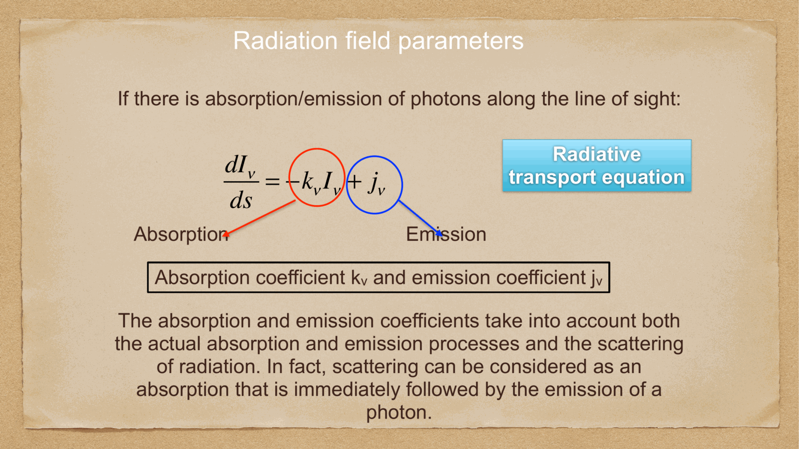
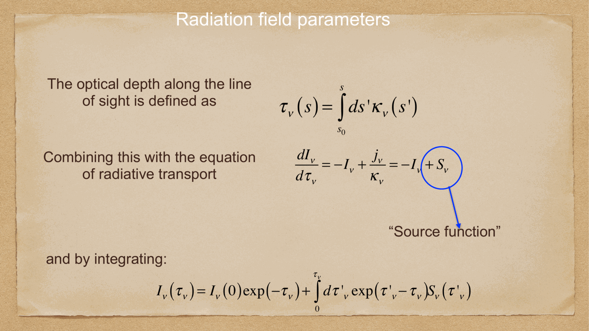
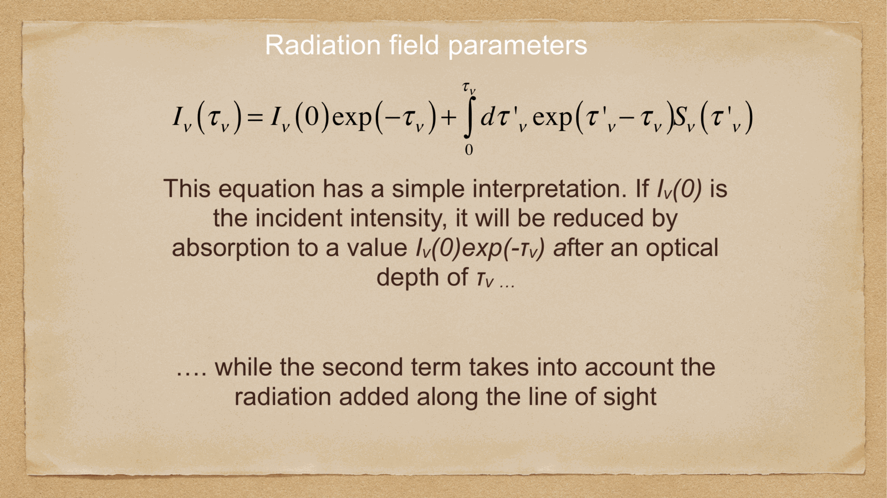

a **blackbody** is an idealized object that absorbs all incident electromagnetic radiation and re-emits it in thermal equilibrium. its emission depends only on the temperature, and the spectrum is the **Planck function**.

stars are *approximately* blackbodies (with absorption lines from their atmospheres). the CMB is *the* blackbody — the most perfect one we have ever measured (see [Cosmic_inventory_photons](../../02_Zettel/Theory/Cosmic_inventory_photons.html)).

---

## the Planck function

the specific intensity of blackbody radiation:
$$\boxed{\,B_\nu(T) = \frac{2 h \nu^3}{c^2}\frac{1}{e^{h\nu/k_B T} - 1}\,}$$

equivalently in wavelength units:
$$B_\lambda(T) = \frac{2 h c^2}{\lambda^5}\frac{1}{e^{hc/\lambda k_B T} - 1}$$

(note: $B_\nu d\nu \neq B_\lambda d\lambda$; the conversion uses $|d\nu| = (c/\lambda^2) |d\lambda|$.)

key features:
- peaks in frequency or wavelength at a temperature-dependent location (Wien's law, see below)
- monotonic in $T$: hotter blackbody is brighter at *every* frequency
- universal: depends only on $T$, not on the material

---

## limits

### Rayleigh-Jeans (low-frequency, $h\nu \ll k_B T$)

expanding the Planck denominator:
$$B_\nu(T) \approx \frac{2 \nu^2 k_B T}{c^2}$$

linear in $T$, $\propto \nu^2$. this is the regime of radio astronomy, where the **brightness temperature** is essentially defined by this relation.

### Wien (high-frequency, $h\nu \gg k_B T$)

the exponential dominates:
$$B_\nu(T) \approx \frac{2h\nu^3}{c^2} e^{-h\nu/k_B T}$$

steeply falling at high frequencies. this is the regime of UV/X-ray emission tail of stars.

---

## Wien's displacement law

the Planck function peaks at:
$$\boxed{\,\lambda_{\max} T = 2.898 \times 10^{-3}~\text{m K}\,}$$
$$\boxed{\,\nu_{\max}/T = 5.879 \times 10^{10}~\text{Hz/K}\,}$$

(these two are not equivalent because of the $|d\nu| \neq |d\lambda|$ conversion — peak in $B_\nu$ vs peak in $B_\lambda$ are at different wavelengths, but the $\lambda_{\max} T$ relation is the most useful.)

so:
- $T = 6000$ K (sun): $\lambda_{\max} \approx 480$ nm — visible (yellow-green)
- $T = 3000$ K (red dwarf): $\lambda_{\max} \approx 970$ nm — near-IR
- $T = 2.725$ K (CMB): $\lambda_{\max} \approx 1$ mm — microwave
- $T = 10^7$ K (galaxy cluster ICM): $\lambda_{\max} \approx 0.3$ nm — soft X-ray

so Wien's law tells you which band a thermal source emits in, just from its temperature.

---

## Stefan-Boltzmann law

integrating the Planck function over all frequencies:
$$\int_0^\infty B_\nu(T)\, d\nu = \frac{\sigma}{\pi} T^4$$

with the **Stefan-Boltzmann constant**
$$\sigma = \frac{2\pi^5 k_B^4}{15 c^2 h^3} = 5.67 \times 10^{-8}~\text{W/m}^2\text{/K}^4$$

so the total flux emitted by a blackbody surface (integrated over outward hemisphere):
$$\boxed{\,F = \sigma T^4\,}$$

and the total luminosity of a sphere of radius $R$ at temperature $T$:
$$\boxed{\,L = 4\pi R^2 \sigma T^4\,}$$

this is the **Stefan-Boltzmann law**. it gives the radius of a star from its luminosity and temperature, or vice versa:
$$R = \left(\frac{L}{4\pi\sigma T^4}\right)^{1/2}$$

example for the Sun: $L_\odot = 3.83 \times 10^{33}$ erg/s, $T_\odot = 5800$ K → $R_\odot = 6.96 \times 10^{10}$ cm. checks out.

---

## effective temperature

real stars are not perfect blackbodies. but we can define an **effective temperature** $T_{\rm eff}$ as the temperature of a blackbody that would emit the same total flux:
$$L = 4\pi R^2\, \sigma\, T_{\rm eff}^4$$

so $T_{\rm eff}$ is what we mean when we say "the Sun is at 5800 K." it is not the *actual* surface temperature (which varies with depth in the photosphere), but the effective blackbody temperature that gives the right luminosity for the right radius.

---

## why this matters for cosmology

- **CMB** is a near-perfect blackbody at $T_0 = 2.725$ K, allowing precise measurement of $\rho_\gamma$ and $n_\gamma$ today (see [Cosmic_inventory_photons](../../02_Zettel/Theory/Cosmic_inventory_photons.html))
- the photon distribution function in the early universe is a Bose-Einstein blackbody; integrating gives $\rho_\gamma \propto g_*\, T^4$ (see [Number density and energy density at thermal equilibrium](../../02_Zettel/Theory/Number density and energy density at thermal equilibrium.html))
- **stellar spectra** are quasi-blackbody, so star temperatures and radii are inferred via the Stefan-Boltzmann law plus distance measurements
- **$L/T_{\rm eff}$** is the basis of the HR diagram (see [HR diagram](../../02_Zettel/Theory/HR diagram.html))

so the Planck function is the bridge between thermodynamics and astrophysics — it lets us read temperature off a spectrum.

---

## see also

- [Fundamentals_Astrophysics_Cosmology_MOC](../../00_Atlas/Fundamentals_Astrophysics_Cosmology_MOC.html)
- [Electromagnetic radiation basics](../../02_Zettel/Theory/Electromagnetic radiation basics.html)
- [Stellar spectra and spectral classification](../../02_Zettel/Theory/Stellar spectra and spectral classification.html)
- [Magnitudes and photometric systems](../../02_Zettel/Theory/Magnitudes and photometric systems.html)
- [HR diagram](../../02_Zettel/Theory/HR diagram.html)
- [Cosmic_inventory_photons](../../02_Zettel/Theory/Cosmic_inventory_photons.html)
- [Number density and energy density at thermal equilibrium](../../02_Zettel/Theory/Number density and energy density at thermal equilibrium.html)
