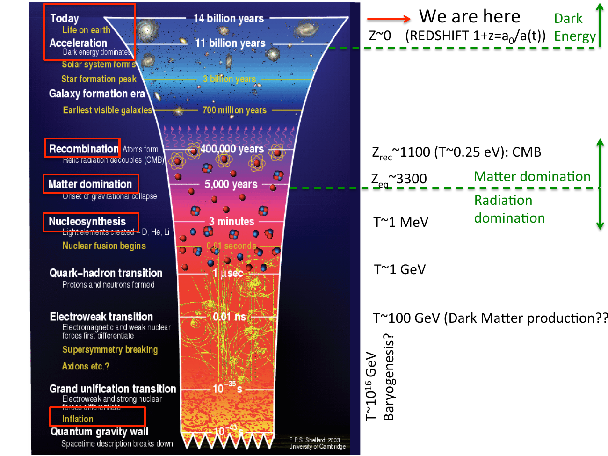

a single image, the thermal history of the universe from the quantum gravity wall down to today, drawn as a redshift cone:

---

## reading the cone, today to early times

| epoch | temperature / energy | redshift | age | what happens |
|---|---|---|---|---|
| **today** | $T_0 = 2.725$ K | $z = 0$ | 13.8 Gyr | dark energy dominates, life on Earth |
| **acceleration** | $\sim 10^{-3}$ eV | $z \sim 0.7$ | $\sim 11$ Gyr ago | $\Lambda$ takes over, $\ddot a > 0$ |
| **galaxy formation era** | meV | $z \sim$ a few | $\sim 3$ Gyr | star formation peaks |
| **earliest visible galaxies** | meV | $z \sim 10$ | 700 Myr | reionization (see [Reionization](../../02_Zettel/Theory/Reionization.html)) |
| **recombination** | $T \sim 0.25$ eV | $z_{\rm rec} \sim 1100$ | $\sim 4 \times 10^5$ yr | atoms form, CMB decouples |
| **matter domination** | $T \sim 0.7$ eV | $z_{\rm eq} \sim 3300$ | $\sim 5000$ yr | $\rho_m = \rho_\gamma$, gravitational collapse begins on small scales |
| **nucleosynthesis** | $T \sim 0.1\text{–}1$ MeV | — | 3 minutes | light elements created (see [BBN_overview](../../02_Zettel/Theory/BBN_overview.html)) |
| **quark-hadron transition** | $T \sim 1$ GeV | — | 1 μs | protons and neutrons form |
| **electroweak transition** | $T \sim 100$ GeV | — | 0.01 ns | EM and weak forces differentiate, supersymmetry breaking?, dark matter production? |
| **grand unification transition** | $T \sim 10^{16}$ GeV | — | $10^{-35}$ s | EM-weak and strong differentiate, baryogenesis? |
| **inflation** | $T \gtrsim 10^{16}$ GeV | — | $10^{-35}$ s | exponential expansion, quantum fluctuations stretched |
| **quantum gravity wall** | $T \sim 10^{19}$ GeV | — | $10^{-43}$ s | spacetime description breaks down |

at $T > 10^{19}$ GeV (Planck energy) we cannot describe spacetime classically. above that lies the realm of quantum gravity, beyond the reach of any current theory.

---

## three regimes

energy densities scale as $\rho_m \propto a^{-3}$, $\rho_\gamma \propto a^{-4}$, $\rho_\Lambda = $ const. so the universe goes through three distinct dynamical phases:

- **radiation-dominated** ($z \gtrsim 3300$): $a(t) \propto t^{1/2}$, photons and relativistic neutrinos rule
- **matter-dominated** ($0.7 \lesssim z \lesssim 3300$): $a(t) \propto t^{2/3}$, structures grow gravitationally
- **Λ-dominated** ($z \lesssim 0.7$): $a(t) \propto e^{Ht}$, accelerated expansion

the matter-radiation equality scale is what determines the turnover of the matter power spectrum (see [Matter power spectrum and BAO](../../02_Zettel/Theory/Matter power spectrum and BAO.html)).

---

## the central observable epochs

three observational windows pierce this timeline:

1. **CMB** ($z \sim 1100$, recombination/decoupling) — see [Cosmic_inventory_photons](../../02_Zettel/Theory/Cosmic_inventory_photons.html)
2. **BBN** ($T \sim 0.1\text{–}1$ MeV, three minutes) — see [BBN_overview](../../02_Zettel/Theory/BBN_overview.html)
3. **galaxy surveys** ($z \lesssim 10$) — see [Observational_Cosmology_MOC](../../00_Atlas/Observational_Cosmology_MOC.html)

between BBN and the CMB there is a "blind" epoch I cannot probe directly with photons — the universe is opaque before recombination. but I can read it indirectly through CMB anisotropies, BBN abundances, and the structure of the matter power spectrum at late times.

---

## what we want to learn from this picture

the slide says it well:
> we seek information about very early times and very high energies, $E$ up to $10^{16}$ GeV.

at energies above what any accelerator can reach, the early universe is the only laboratory we have. observational cosmology is high-energy physics on a different scale — we measure $\Omega_b h^2$ at the per-mille level from CMB peaks, then read it back into nuclear cross sections at $T \sim 0.1$ MeV. the universe is a precision instrument.

---

## see also

- [Fundamentals_Astrophysics_Cosmology_MOC](../../00_Atlas/Fundamentals_Astrophysics_Cosmology_MOC.html)
- [Cosmic_inventory_overview](../../02_Zettel/Theory/Cosmic_inventory_overview.html)
- [BBN_overview](../../02_Zettel/Theory/BBN_overview.html)
- [Saha equation and recombination](../../02_Zettel/Theory/Saha equation and recombination.html)
- [Inflation overview](../../02_Zettel/Theory/Inflation overview.html)
- [Baumann_reference](../../02_Zettel/Theory/Baumann_reference.html) — chapter 3.1.3 walks through this same picture rigorously
