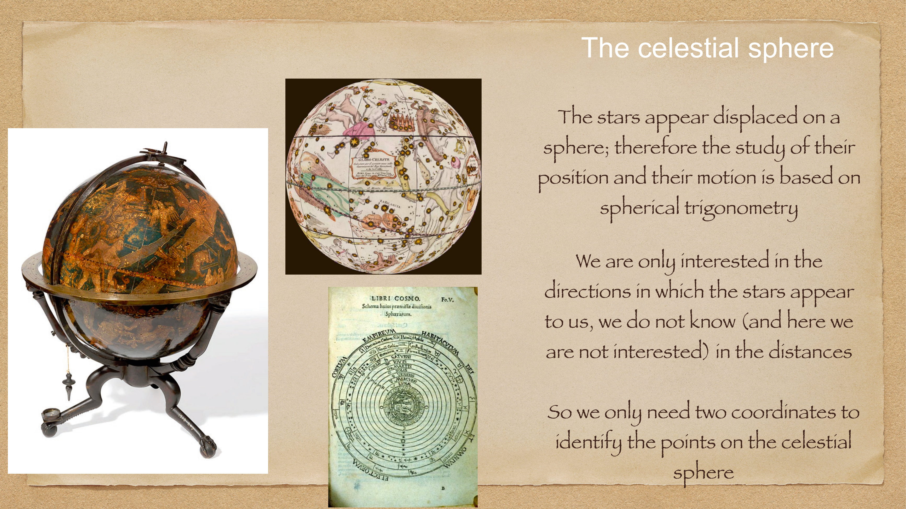
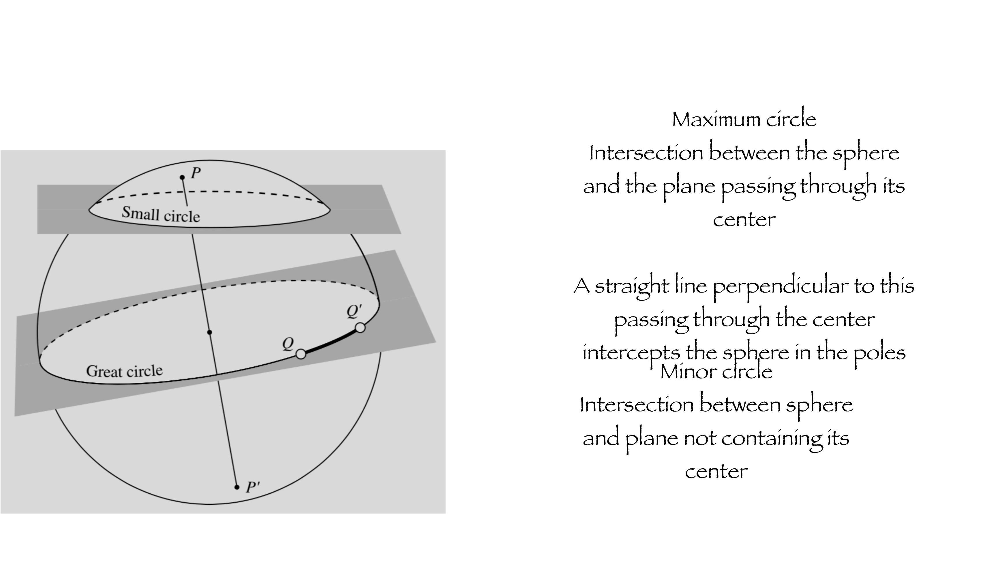
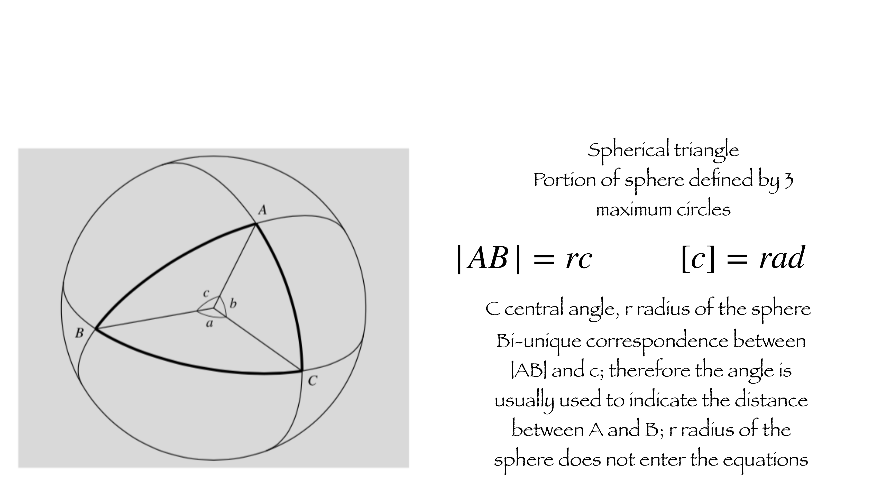
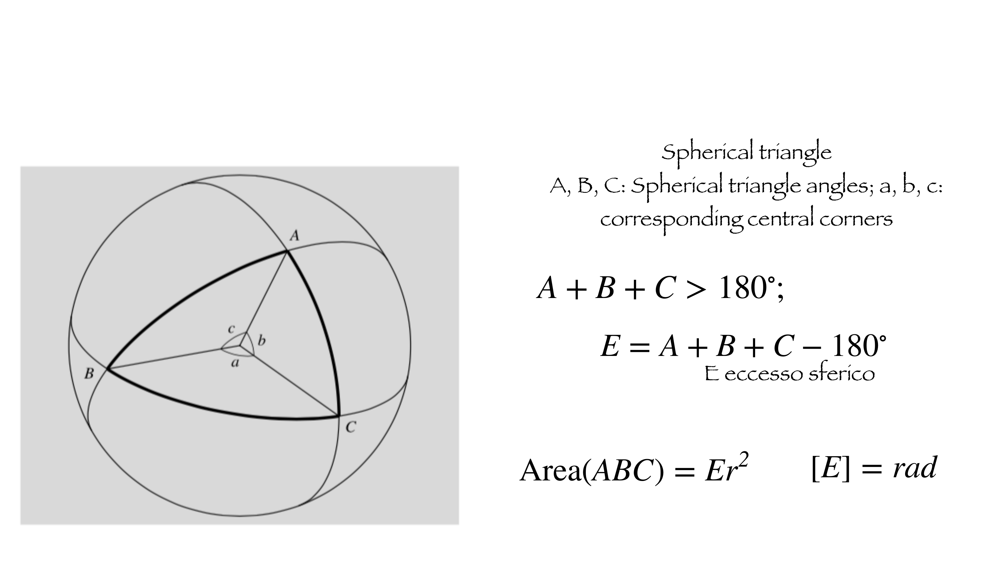

the stars look like they sit on a sphere whose center happens to be wherever I am standing.
	I do not know their true distances from me, and for the purposes of pointing I do not care.
		I just need **two coordinates** to identify a point on this directional sphere.

historically every culture built one. globes, astrolabes, the libri cosmografi.

---

## great circle vs small circle

a **great circle** (massimo cerchio) is the intersection of the sphere with a plane that passes through its **center**. the equator, every meridian, the celestial equator, the ecliptic — all great circles.

a **small circle** (cerchio minore) is the intersection of the sphere with a plane *not* through the center. parallels of latitude (other than the equator itself) are small circles.

the line perpendicular to a great circle through the center pierces the sphere at the two **poles** of that great circle.

---

## arc length and the central angle

on a sphere of radius $r$, a great-circle arc $|AB|$ corresponds to a central angle $c$ (in radians) by
$$|AB| = r c, \qquad [c] = \text{rad}$$

so on a unit sphere ($r = 1$), the angle *is* the arc length. this is why the radius of the celestial sphere never appears in any practical formula: I always work with angles.

---

## spherical triangles

a **spherical triangle** is the region bounded by three arcs of great circles. its three vertices $A, B, C$ have **angles** $A, B, C$ (between the arcs at each vertex), and its three sides $a, b, c$ are great-circle arcs (opposite the corresponding vertex), measured by their central angles.

key fact: the sum of the angles of a spherical triangle is **always greater than $180°$**:
$$A + B + C > 180°$$

the excess
$$E = A + B + C - 180°$$
is called the **spherical excess** ("eccesso sferico"), and it is geometric: the area of the triangle is exactly
$$\text{Area}(ABC) = E\, r^2, \qquad [E] = \text{rad}$$

quick check: an octant of a unit sphere has all three angles equal to $90°$, so $E = 90° = \pi/2$ rad and area $\pi/2$, which is $1/8$ of the full $4\pi$ surface — consistent.

---

## why this matters for astronomy

every coordinate system I will use (alt-azimuth, equatorial, ecliptic, galactic) is a parametrization of this same celestial sphere. transforming between them means rotating between two great-circle frames. that whole machinery is called **spherical trigonometry**, and it is built directly on the spherical-triangle setup above.

→ next: [Spherical trigonometry](../../02_Zettel/Theory/Spherical trigonometry.md)

---

## see also

- [Fundamentals_Astrophysics_Cosmology_MOC](../../00_Atlas/Fundamentals_Astrophysics_Cosmology_MOC.md)
- [Spherical_astronomy_complete](../../02_Zettel/Theory/Spherical_astronomy_complete.md) — the comprehensive narrative of the whole block
- [Spherical trigonometry](../../02_Zettel/Theory/Spherical trigonometry.md)
- [Earth coordinates](../../02_Zettel/Theory/Earth coordinates.md)
