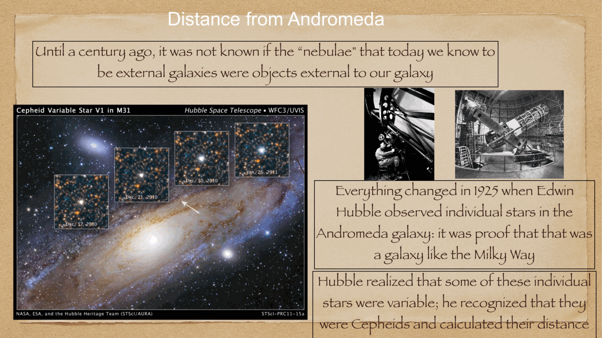
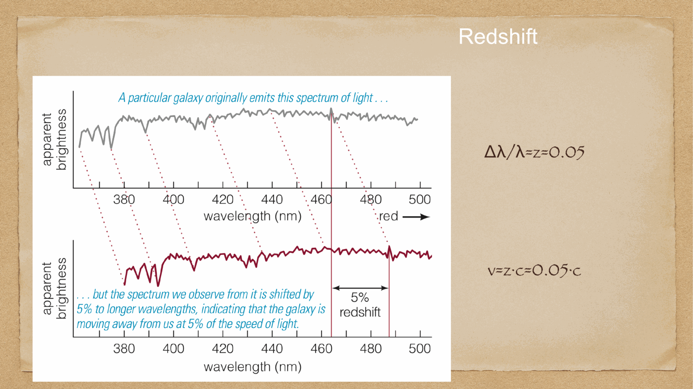

two of the most important standard candles in the cosmic distance ladder. **Cepheids** are pulsating supergiants used out to $\sim 30$ Mpc. **SN Ia** are thermonuclear explosions used out to $z \gtrsim 1$. together they bridge the local universe and the cosmological flow.

---

## Cepheid variables

named after $\delta$ Cephei, the prototype. Cepheids are **pulsating yellow supergiants** with periods of 1-100 days that brighten and dim with great regularity.

key feature: a tight **period-luminosity (P-L) relation**, discovered by Henrietta Leavitt in 1908 from Cepheids in the Small Magellanic Cloud:
$$\boxed{\,M_V = -2.43\log_{10}(P/\text{day}) - 1.62\,}$$

(approximate; depends on metallicity, color, and the photometric band.)

so just by **timing the period** of a Cepheid, you know its absolute luminosity. measuring its apparent brightness then gives the distance.

### why Cepheids work

Cepheids sit on the **instability strip** in the HR diagram. they are unstable to **kappa-mechanism** pulsations: He$^+$ ionization in a partial-ionization zone modulates the opacity, driving radial pulsations.

range of Cepheid pulsations:
- period: 1-100 days
- $L \sim 10^3-10^4\, L_\odot$
- spectral type F-G supergiants

luminous enough to be seen in nearby galaxies, with HST able to resolve them out to $\sim 30$ Mpc.

### types of Cepheids

- **classical Cepheids (Type I)**: massive young stars, found in the disk of spirals. used as the standard.
- **Type II Cepheids**: lower mass, older stars in the halo. about 1.5 mag fainter at given period.
- **RR Lyrae**: similar pulsators in the horizontal branch, $M_V \approx 0.5$, used in globular clusters.

### applications

1. **Galactic distances** (parallax-calibrated Cepheids → kpc distances)
2. **Local Group galaxies** (LMC, SMC, M31, M33)
3. **HST Key Project** (Freedman et al. 2001): Cepheids in 18 galaxies out to 25 Mpc, used to anchor SN Ia and refine $H_0$
4. **SH0ES** (Riess et al. 2022): improved Cepheid + SN Ia ladder, $H_0 = 73.04 \pm 1.04$ km/s/Mpc

→ this is the foundation of the **local distance scale**.

---

## type Ia supernovae

a SN Ia is a **thermonuclear explosion** of a white dwarf in a binary system. when the WD reaches the Chandrasekhar limit ($\sim 1.4\, M_\odot$) — either by accretion from a companion or by merging with another WD — it becomes unstable and detonates.

key fact: SN Ia explosions are remarkably **uniform in peak luminosity**:
$$M_B^{\rm peak} \approx -19.3 \pm 0.2$$

with the **Phillips relation**: brighter SN decline more slowly. correcting for this gives a tight standardized relation:
$$M_B^{\rm corr} \approx -19.5 \pm 0.1$$

so SN Ia are the best **standard candles** we have at high redshift.

### why SN Ia are uniform

since the trigger is always at $\sim M_{\rm Ch} = 1.4\, M_\odot$, the energy release ($\sim 10^{51}$ erg from $^{56}$Ni decay) is approximately the same in every event. small variations come from:
- progenitor metallicity
- explosion mechanism (single vs double degenerate)
- mass ejected vs trapped

these correlate with light-curve shape (rise time, decline rate, color), which is why **standardization** can squeeze out the residual scatter.

### the Hubble diagram

at $z \lesssim 0.1$: SN Ia are well-fit by Hubble's linear law $v = H_0 d$.

at $z \sim 0.5$–$1$: SN Ia are *fainter* than expected in any matter-only universe → the universe is **accelerating**. → discovery of dark energy (Perlmutter 1998, Riess 1998 — Nobel 2011).

→ see [Hubble law exact form](../../02_Zettel/Theory/Hubble law exact form.html) and [Cosmic_inventory_dark_energy](../../02_Zettel/Theory/Cosmic_inventory_dark_energy.html).

at $z > 1$: SN Ia continue to provide constraints on the **dark energy equation of state**. the modern "Pantheon" and "Pantheon+" samples have $\sim 1500$ SN Ia and constrain $w$ to a few percent.

### the SN Ia ladder

calibrated step by step:
1. parallax → Cepheids in MW
2. Cepheids in nearby galaxies → those that have hosted SN Ia
3. SN Ia in galaxies with Cepheid-distance → calibration of intrinsic SN Ia brightness
4. SN Ia at high z → cosmological constraints

modern: **SH0ES program** (Riess+) anchors via Cepheids; **CCHP** (Freedman+) uses TRGB instead. SH0ES finds $H_0 = 73$, CCHP finds $H_0 \sim 70$. Hubble tension persists.

→ see [Hubble constant and deceleration parameter](../../02_Zettel/Theory/Hubble constant and deceleration parameter.html).

---

## why these two together

Cepheids and SN Ia are **complementary**:
- Cepheids: precise but limited reach ($\sim 30$ Mpc)
- SN Ia: huge reach but rely on Cepheid calibration

together they form the **local distance ladder** that gives $H_0$ from local data, independent of the CMB.

→ this independent measurement is what reveals the **Hubble tension**: $H_0$ from CMB ($67.4$) vs from local SN Ia + Cepheids ($73.0$). a $\sim 5\sigma$ discrepancy that could be:
- new physics (early dark energy, modified gravity)
- a systematic error in one measurement
- a previously unidentified bias

ongoing measurements with TRGB, JWST imaging of Cepheids, gravitational waves as standard sirens, and improved BAO are aiming to settle this.

---

## see also

- [Fundamentals_Astrophysics_Cosmology_MOC](../../00_Atlas/Fundamentals_Astrophysics_Cosmology_MOC.html)
- [Parallax and standard candles](../../02_Zettel/Theory/Parallax and standard candles.html)
- [Hubble's law and cosmological redshift](../../02_Zettel/Theory/Hubble's law and cosmological redshift.html)
- [Hubble constant and deceleration parameter](../../02_Zettel/Theory/Hubble constant and deceleration parameter.html)
- [Hubble law exact form](../../02_Zettel/Theory/Hubble law exact form.html)
- [Cosmic_inventory_dark_energy](../../02_Zettel/Theory/Cosmic_inventory_dark_energy.html)
- [HR diagram](../../02_Zettel/Theory/HR diagram.html)
- [Solar evolution and final stages](../../02_Zettel/Theory/Solar evolution and final stages.html)
- [Magnitudes and photometric systems](../../02_Zettel/Theory/Magnitudes and photometric systems.html)
