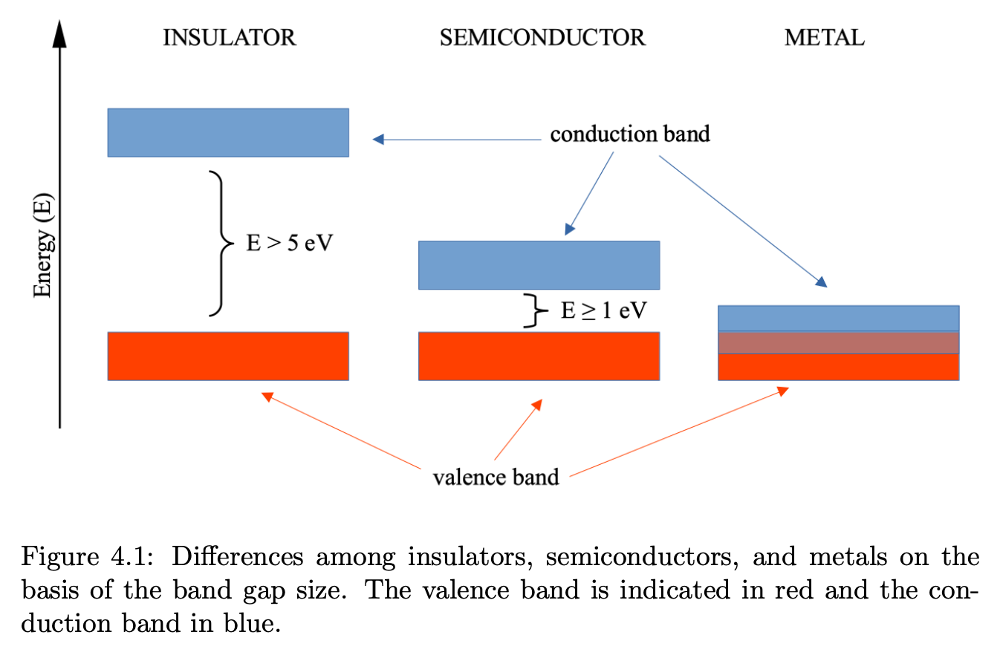
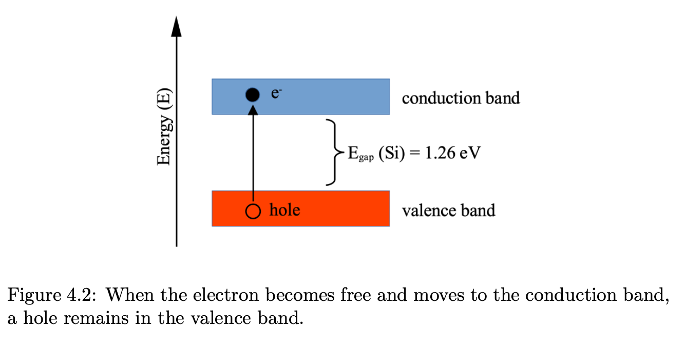
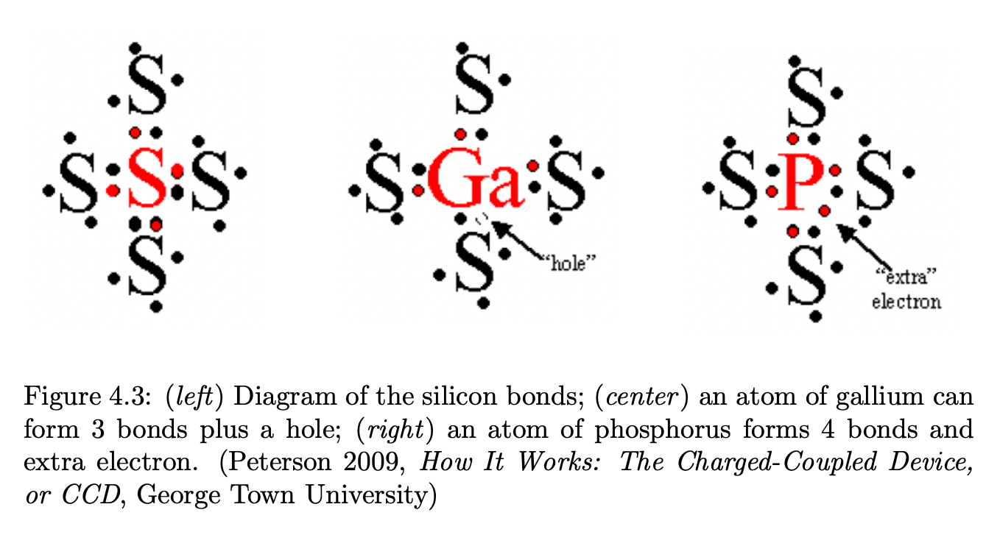

Detection systems are based on **semiconductors** or solid state materials
	such as Silicon (Si), Germanium (Ge), Cadmium-Telluride (CdTe), or Cadmium-Zinc-Telluride (CdZnTe)
		once the ionizing radiation generates an electron-hole pair,
			its motion within an applied electric field creates the **detector electrical signal**

---

## Energy bands

The discrete energy levels in atoms become **energy bands** in solids
	at $T = 0~\text{K}$ the highest energy band containing electrons is called **valence band**
		where electrons are unable to move between atoms
	at the top of the valence band there is the **conduction band**
		the separation between them is called **band gap**

The band gap size defines the type of material:
	**insulator**: $E_{gap} > 5~\text{eV}$
	**semiconductor**: $E_{gap} \geq 1~\text{eV}$, e.g. $E_{gap}(\text{Si}) = 1.26~\text{eV}$
	**metal**: characterized by an **overlap** between valence and conduction bands

Without sufficient energy to cross the band gap,
	electrons cannot move and the conduction band remains empty (no electrical conductivity)

semiconductors can allow conductivity through:
	an increase of **temperature** or an **absorption of a photon**
		in both cases an electron moves to the conduction band
			leaving a vacancy (a **hole**) in the valence band
				and generating an **electron-hole pair**

---
## Doping

Semiconductors can be improved by adding **impurities**, a method called **doping**

When the impurity has **more** valence electrons than silicon,
	it donates electrons to the conduction band
		named **donor** or **n-type** silicon
			examples: phosphorus ($Z_P = 15$), arsenic ($Z_{As} = 33$)
				electron configuration of Si: $1s^2~2s^2~2p^6~\mathbf{3s^2~3p^2}$ (4 valence electrons)
				configuration of P: $1s^2~2s^2~2p^6~\mathbf{3s^2~3p^3}$ (5 valence electrons)
				configuration of As: $1s^2~2s^2~2p^6~3s^2~3p^6~3d^{10}~\mathbf{4s^2~4p^3}$ (5 valence electrons)

When the impurity has **fewer** valence electrons than silicon,
	it leaves positively charged holes in the valence band
		named **acceptor** or **p-type** silicon
			examples: boron ($Z_B = 5$), aluminum ($Z_{Al} = 13$), gallium ($Z_{Ga} = 31$)
				configuration of B: $1s^2~\mathbf{2s^2~2p^1}$ (3 valence electrons)
				configuration of Al: $1s^2~2s^2~2p^6~\mathbf{3s^2~3p^1}$ (3 valence electrons)
				configuration of Ga: $1s^2~2s^2~2p^6~3s^2~3p^6~3d^{10}~\mathbf{4s^2~4p^1}$ (3 valence electrons)

In a crystal of pure silicon,
	all atoms are perfectly bonded to **4 neighboring atoms**
		and no extra electrons or holes are present

If we introduce an element with **3 valence electrons** (acceptor):
	it forms 3 normal bonds plus a **hole** because of a missing electron
		a nearby electron can move and fill this hole (recombination process)
			but it creates a new hole — the motion of electrons causes a motion of holes

If we introduce an element with **5 valence electrons** (donor):
	it forms 4 normal bonds but an **extra electron** is left over

Note: extra electrons or extra holes do **not** make the materials charged,
	they are all neutral
		what happens is only that there are more electrons than those necessary to form bonds, or more holes

---

## Subtopics

- [The p-n junction](../../02_Zettel/Theory/The p-n junction.html)
- [CCD readout](../../02_Zettel/Theory/CCD readout.html)
- [Quantum efficiency](../../02_Zettel/Theory/Quantum efficiency.html)
- [CCDs for X-rays](../../02_Zettel/Theory/CCDs for X-rays.html)
