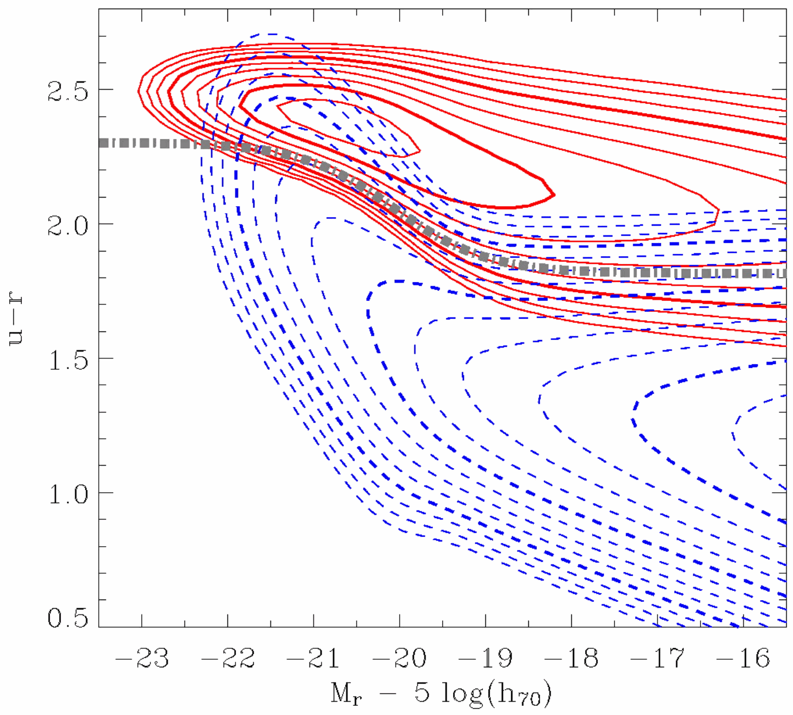

# color bimodality of galaxies

up: [Pablo_02_Statistical_properties_of_galaxies](../../01_Literature/Lectures/Observational_Cosmology/Pablo_02_Statistical_properties_of_galaxies.html) · [Observational_Cosmology_MOC](../../00_Atlas/Observational_Cosmology_MOC.html)

## the empirical fact

if you take a magnitude-limited sample of nearby galaxies and plot a histogram of one optical color (say $u-r$ from SDSS), you get **two peaks**, not one. Baldry et al. 2004 made this canonical with the SDSS DR1 sample at $z<0.08$:

- a **blue peak** around $u-r \approx 1.3$
- a **red peak** around $u-r \approx 2.5$
- a sparse **valley** around $u-r \approx 1.8$ that is *not* zero, just under-populated

the same bimodality shows up in $g-r$, $NUV-r$, and (more weakly) in restframe colors at $z \sim 1$.

## why color is the right axis

color is a $\sim$dimensionless ratio of fluxes, so it is mostly insensitive to distance and (at fixed $z$) to absolute scale. it tracks the **stellar population age + dust + metallicity**. for a stellar population, the bluest colors come from short-lived O/B stars; once star formation stops, those stars die in $\sim 10^7$–$10^8$ yr and the integrated color reddens fast. so color is, to first order, a *star-formation-state diagnostic*.

## why the bimodality is surprising

if galaxy properties were continuous (say, a smooth distribution of star formation timescales), the color distribution would be unimodal. the *gap* between the two peaks tells us that whatever drives a galaxy from blue to red happens *fast*, faster than the time spent at either end. this is the [Green valley and quenching tracks](../../02_Zettel/Theory/Green valley and quenching tracks.html) story.

## reading the figure pablo shows

Baldry 2004 fig. 1 plots $u-r$ histograms in bins of absolute $r$-band magnitude. in every bin the two-peak structure is clear, and the position of the red peak slides slightly redder for brighter galaxies (the [Red sequence and blue cloud](../../02_Zettel/Theory/Red sequence and blue cloud.html) tilt).

## connections

- next: [Red sequence and blue cloud](../../02_Zettel/Theory/Red sequence and blue cloud.html) interprets the two peaks
- mechanism: [Green valley and quenching tracks](../../02_Zettel/Theory/Green valley and quenching tracks.html)
- environment: [Galaxy color, density and morphology](../../02_Zettel/Theory/Galaxy color, density and morphology.html)
- mass-side picture: [Stellar mass function](../../02_Zettel/Theory/Stellar mass function.html) also bimodal at fixed $z$ (passive vs star-forming SMFs)

## key references

- Baldry et al. 2004, ApJ 600, 681
- Hogg et al. 2004, ApJ 601, L29
- Blanton & Moustakas 2009, ARAA 47, 159 (review)
