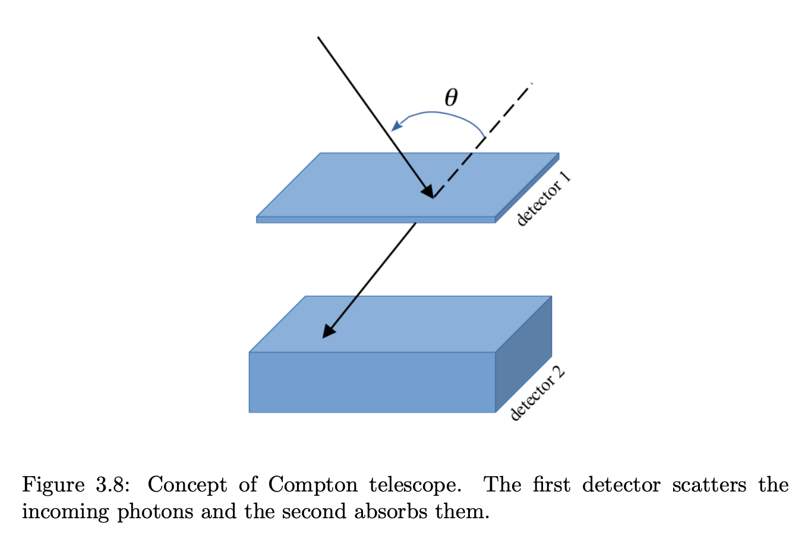

In the **MeV energy range** ($\sim 1$–$30~\text{MeV}$), neither focusing X-ray telescopes nor pair-production detectors work well
	grazing incidence becomes impossible (critical angles $< 0.01°$)
	pair production requires $E > 2m_ec^2 \approx 1.022~\text{MeV}$ but doesn't dominate until $\sim 4$–$100~\text{MeV}$
	the dominant process is **Compton scattering**, which cannot be efficiently shielded

The **Compton telescope** turns this liability into a detection mechanism
	instead of trying to stop the photon, it **tracks** the Compton scattering event

---

## Design

Schematic of a Compton telescope. A gamma-ray Compton scatters in the upper (scatterer) plane and is absorbed in the lower (absorber) plane. The energy deposits and time-of-flight constrain the source direction to a cone.

A Compton telescope has **two planes of detectors** separated by a large distance $d$:

### Scatterer (first plane)
Made of **low-$Z$ material** (e.g. liquid scintillator, plastic, or thin silicon strips)
	the incoming gamma-ray **Compton scatters** off an electron in this plane
	the recoil electron deposits its kinetic energy in the scatterer: $E_1 = E_{ph} - E'_{ph}$
	the scattered photon continues to the absorber

### Absorber (second plane)
Made of **high-$Z$ material** (e.g. NaI, CsI, BGO)
	the scattered photon is **photoelectrically absorbed** here
	energy deposit: $E_2 = E'_{ph}$

The total photon energy is reconstructed: $E_{ph} = E_1 + E_2$

---

## Source cone and angular reconstruction

From the Compton scattering formula:
$$E'_{ph} = \frac{E_{ph}}{1 + \frac{E_{ph}}{m_ec^2}(1-\cos\psi)}$$

where $\psi$ is the **scatter angle**

Solving for $\psi$:
$$\cos\psi = 1 - m_ec^2\left(\frac{1}{E'_{ph}} - \frac{1}{E_{ph}}\right) = 1 - m_ec^2\left(\frac{1}{E_2} - \frac{1}{E_1+E_2}\right)$$

The scatter angle $\psi$ defines a **cone of possible source directions**
	the axis of the cone is the line connecting the two interaction points
	the opening half-angle of the cone is $\psi$

Many events from the same source produce many cones
	they all intersect at the source position → image reconstruction by **back-projection** or maximum likelihood

---

## Time-of-flight rejection

The scattered photon travels from the scatterer to the absorber in a time:
$$\Delta t = \frac{d}{c} \approx 3.3~\text{ns per meter}$$

measuring $\Delta t$ rejects:
	**upward-going background events** (which travel absorber→scatterer, the wrong direction in time)
	**accidental coincidences** (two unrelated photons hitting the two planes simultaneously)

This time-of-flight selection dramatically reduces the background

---

## Properties and limitations

| Property | Value |
|---|---|
| Energy range | $\sim 1$–$30~\text{MeV}$ |
| Angular resolution | $\sim 1°$–$3°$ (limited by Doppler broadening of electron motion) |
| Sensitivity | Low (small solid angle, high background) |
| Imaging | Yes (via cone back-projection) |

The angular resolution is fundamentally limited by the **Doppler broadening**:
	the Compton electrons have thermal motion, so $\psi$ has an intrinsic smearing $\Delta\psi \sim 1°$–$2°$

---

## The COMPTEL instrument (CGRO)

The most successful Compton telescope was **COMPTEL** on the **Compton Gamma-Ray Observatory (CGRO)**, launched 1991:
	upper layer: 7 modules of liquid scintillator (NE213A), $26$ cm diameter each
	lower layer: 14 modules of NaI(Tl)
	separation: $1.5$ m
	energy range: $1$–$30~\text{MeV}$
	angular resolution: $1°$–$3°$
	first all-sky survey at MeV energies

Notable discoveries with COMPTEL:
	mapping of $^{26}$Al radioactive decay at $1.809~\text{MeV}$ along the Galactic plane (proof of nucleosynthesis in massive stars)
	detection of gamma-ray bursts and pulsars at MeV energies

---

## Connection to other instruments

The Compton telescope fills the **MeV gap** between:
	X-ray focusing telescopes (Chandra, XMM-Newton): $0.1$–$15~\text{keV}$
	pair production telescopes (Fermi LAT): $>100~\text{MeV}$

The physics is directly the [Compton scattering formula](../../02_Zettel/Theory/Compton scattering and pair production.md)
	the [Coded Mask](../../02_Zettel/Theory/Coded Mask.md) can be combined with Compton telescopes to reduce background further
