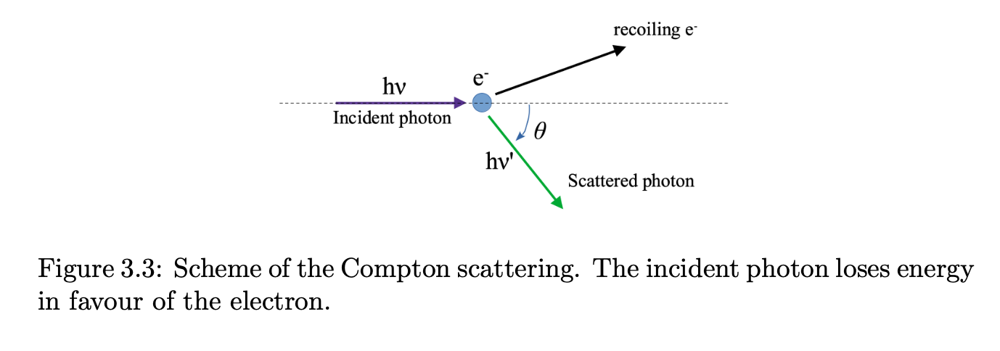
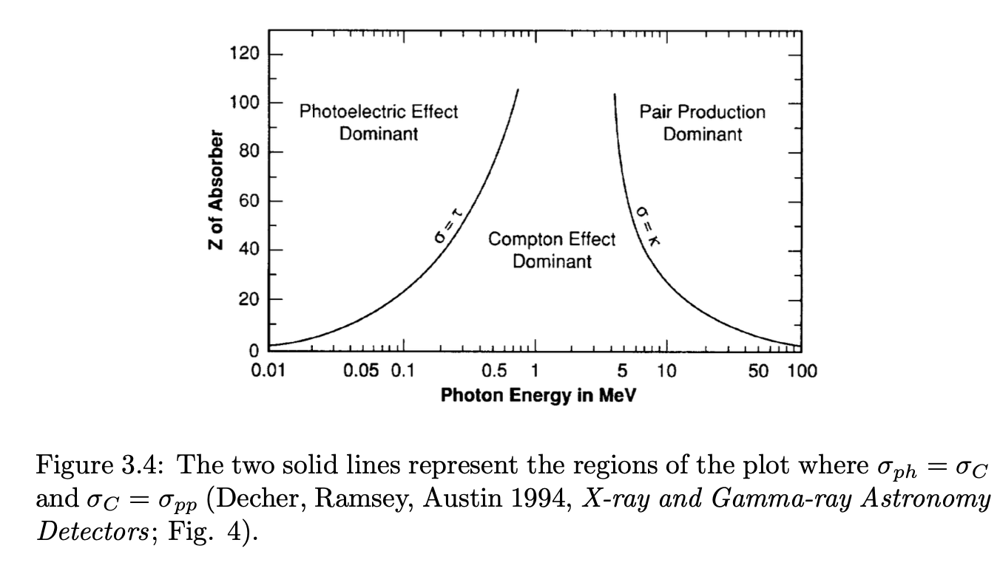

## Compton scattering

X-ray photons can **scatter off atomic electrons** while they pass through matter
	a part of the photon energy is transferred to the recoiling electron
		this electron is in one of the outer orbits
			and its binding energy is significantly less than the energy of the photon

The energy of the scattered photon depends on the angle $\theta$ and its original energy:
$$E'_{ph} = \frac{E_{ph}}{1 + \frac{E_{ph}}{m_e c^2}(1 - \cos\theta)}$$

where $m_e c^2$ is the rest energy of the electron ($511~\text{keV}$)
	and the energy of the Compton electron is $E_{ph} - E'_{ph}$

The cross-section for Compton scattering is described by the **Klein-Nishina formula**
	it predicts the angular distribution of photons after scattering
		its probability **decreases** with increasing photon energy
			and with increasing $Z$ of the absorber

This process is therefore more probable
	in the **middle photon energy range** (i.e., $0.1$–$1~\text{MeV}$)
		and with **light materials**

The emitted electron can then be absorbed locally
	its scattering angle and energy can be tracked by a series of thin particle detectors
		and finally, the energy and position of the scattered photon can be collected

---

## Pair production

When the energy of the photon is greater than **twice the rest mass of the electron** ($1.022~\text{MeV}$)
	and the $\gamma$-ray photon comes into the near vicinity of a nucleus,
		it decays into a **pair of electron and positron**

Pair production is the **dominant process at high energies**
	the energy of the photon in excess is almost completely transferred to the pair as kinetic energy
		while the energy absorbed by the nucleus is negligible because of its high mass

In practice, pair production does not become important until
	a photon energy of $\sim 4~\text{MeV}$ is reached

When the positron has expended its kinetic energy in the medium,
	it will **annihilate** with a free electron
		and two $0.511~\text{MeV}$ photons are emitted in opposite directions

Measuring the pair direction through tracking devices,
	and their energy through tracker and absorbers,
		allows to **reconstruct the primary photon energy**

---

## Summary of dominant processes

The three regions of the plot are defined by equalling the cross sections of:
	[Photoelectric absorption](../../02_Zettel/Theory/Photoelectric absorption.html) and Compton scattering ($\sigma_{ph} = \sigma_C$)
	Compton scattering and pair production ($\sigma_C = \sigma_{pp}$)

The two solid lines represent the regions of the plot where $\sigma_{ph} = \sigma_C$ and $\sigma_C = \sigma_{pp}$. The three regions define which interaction dominates as a function of photon energy and atomic number $Z$ of the absorber.

---

An important parameter is the **linear attenuation coefficient** $\mu$ (in units of $\text{cm}^{-1}$)
	that is the probability per unit length of a photon to interact with the absorber:
$$\mu = \sigma n \qquad \lambda = \frac{1}{\mu}$$

where
	$\sigma$ is the cross section
	$n$ is the density of the material (in units of atoms $\text{cm}^{-3}$)
	$\lambda$ is the **mean free path**,
		that is the average distance traveled in the absorber before an interaction takes place