cosmology is the study of the universe at large scales,
	and "large" here means $l \gtrsim 1$ Mpc:
		stars in a galaxy are separated by parsecs ($1\,\text{pc} \approx 3.086\times10^{13}$ km),
			bright galaxies by megaparsecs.
above $\sim 100$ Mpc the universe looks **homogeneous and isotropic**:
	this is the **cosmological principle**,
		the zero-th order picture of a comoving observer.

modern cosmology surveys reach about a Gpc; this is the redshift cone we live inside.

---

## the standard hot Big Bang model

since the 1960s the *standard hot Big Bang model* has rested on three observational pillars:

1. **the Hubble diagram** — the universe is expanding (and right now accelerating)
2. **Big-Bang nucleosynthesis** — the relative abundances of light elements forged in the first three minutes (see [BBN_overview](../../02_Zettel/Theory/BBN_overview.html))
3. **the cosmic microwave background** — a near-perfect blackbody at $T_0 = 2.725$ K filling the sky

what the late 20th century added on top of this is the **Standard Model of Cosmology** — ΛCDM. it adds:
- **dark matter** and **dark energy**
- **deviations from homogeneity and isotropy**: galaxies, clusters, CMB anisotropies (these are first-order corrections to the zeroth-order homogeneity)
- **inflation** as the generator of those primordial perturbations

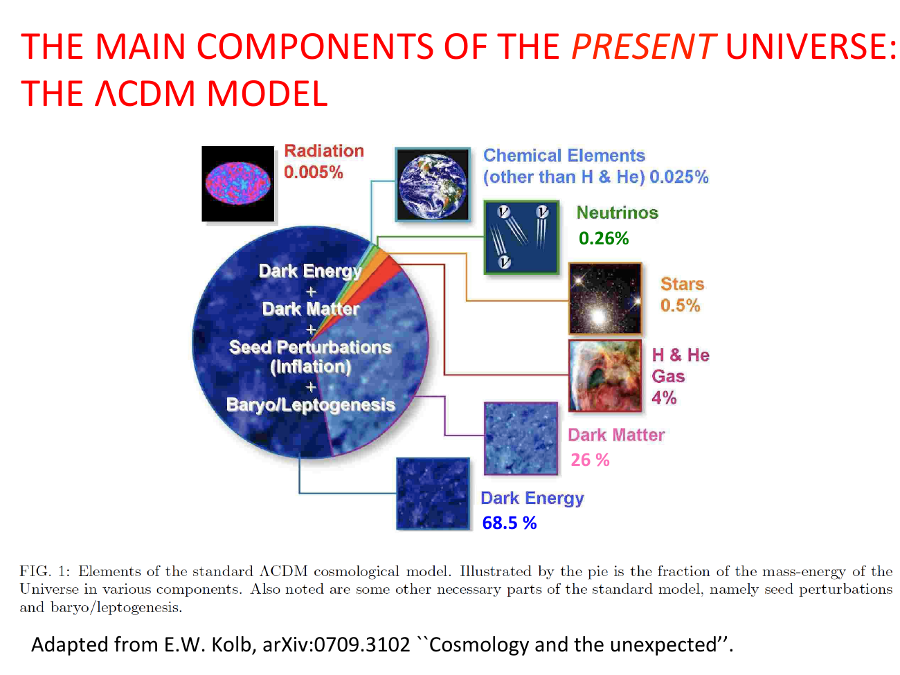

the present-day pie chart, from a Kolb arXiv preprint:
$$\Omega_\Lambda \simeq 68.5\%, \quad \Omega_{dm} \simeq 26\%, \quad \Omega_{H,He\,gas} \simeq 4\%, \quad \Omega_\nu \simeq 0.26\%, \quad \Omega_\star \simeq 0.5\%, \quad \Omega_{\rm chem} \simeq 0.025\%, \quad \Omega_\gamma \simeq 0.005\%$$

basically: 95% of the universe is something we cannot see directly. 5% is "stuff that emits photons." within that 5%, only a tenth is stars and chemical elements; the rest is just hot diffuse hydrogen and helium gas.

---

## evolution in an expanding universe

energy densities scale differently with the scale factor $a(t)$:

$$\rho_{m} \propto a^{-3}, \qquad \rho_\gamma \propto a^{-4}, \qquad \rho_\Lambda = \text{const.}$$

so radiation dominates early, matter takes over after the **equality** epoch $a_{eq}$, and the cosmological constant takes over recently.

three regimes:
- **radiation-dominated**: $a(t) \propto t^{1/2}$, until $z \sim 3300$
- **matter-dominated**: $a(t) \propto t^{2/3}$, from recombination at $z \sim 1100$ until $z \sim 0.7$
- **Λ-dominated**: $a(t) \propto \exp(\sqrt{\Lambda/3}\,t)$, today

---

## the cosmic photon inventory

every band of the electromagnetic spectrum contributes a *background* of photons:

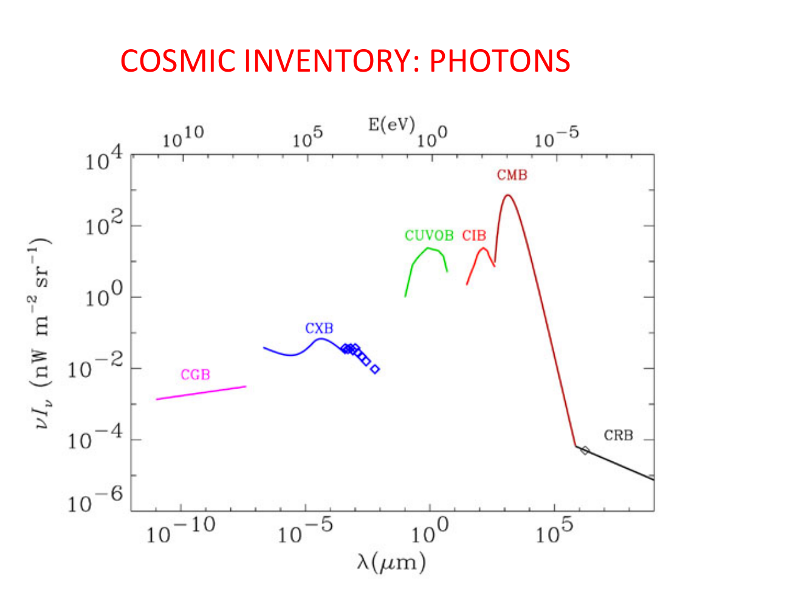

- **CGB** = cosmic gamma-ray background
- **CXB** = cosmic X-ray background (see [Lab_High-Energy_MOC](../../00_Atlas/Lab_High-Energy_MOC.html))
- **CUVOB** = cosmic UV/optical background (stars and AGN)
- **CIB** = cosmic infrared background (dust-reprocessed star formation)
- **CMB** = cosmic microwave background (the dominant one, by far)
- **CRB** = cosmic radio background

the **CMB dominates** the photon inventory — it carries something like 99% of all photons in the universe.

### the CMB blackbody spectrum

$$I_\nu = \frac{2h\nu^3}{c^2} \frac{1}{e^{h\nu/k_BT} - 1}$$

best-fit temperature from FIRAS on COBE: $T_0 = 2.725 \pm 0.002$ K (95% CL). no spectral distortions detected, except the y-distortions from the Sunyaev-Zel'dovich effect through clusters.

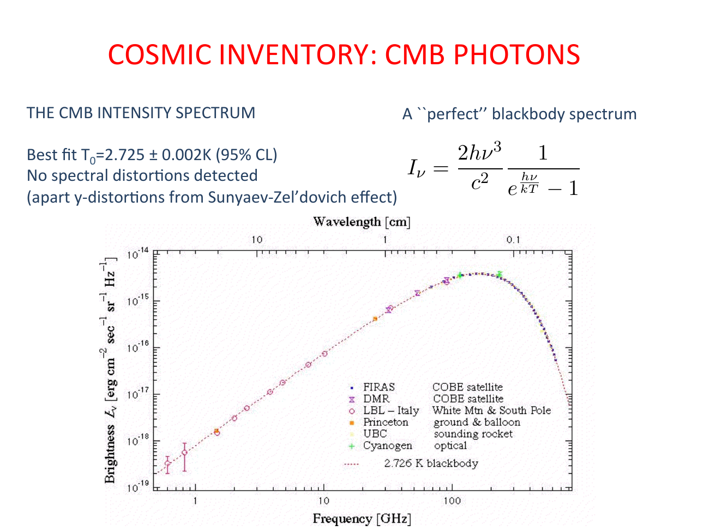

the spectrum was measured beautifully by FIRAS (COBE), DMR (COBE), LBL ground+balloon, Princeton ground+balloon, UBC sounding rocket, and cyanogen optical. all of them lie on a 2.726 K Planck curve. it is the best blackbody we have ever measured.

### CMB photon densities and $\Omega_{0\gamma}$

starting from the Planck function and integrating in natural units $c = k = \hbar = 1$:

$$\rho_\gamma = \frac{4\pi}{c}\int d\nu\, I_\nu = \frac{8\pi h}{c^3}\int d\nu\, \frac{\nu^3}{e^{h\nu/k_BT} - 1} \;\to\; \rho_\gamma = \frac{\pi^2}{15}T^4$$

$$n_\gamma = \frac{4\pi}{c}\int d\nu\, \frac{I_\nu}{h\nu} = \frac{8\pi}{c^3}\int d\nu\, \frac{\nu^2}{e^{h\nu/k_BT} - 1} \;\to\; n_\gamma = \frac{2\zeta(3)}{\pi^2} T^3 \simeq 422~\text{cm}^{-3}$$

(at $T = T_0 = 2.725$ K)

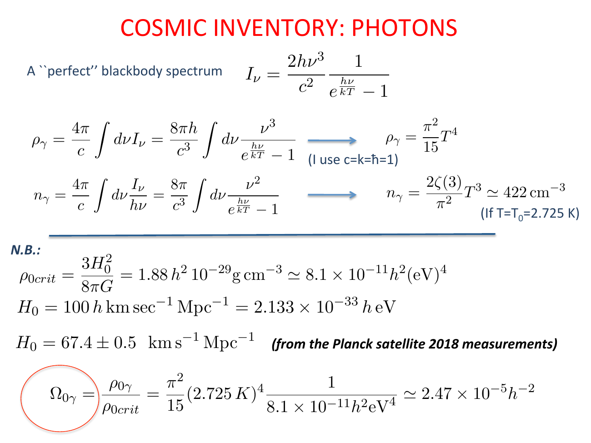

with the critical density
$$\rho_{0,\rm crit} = \frac{3H_0^2}{8\pi G} = 1.88\,h^2 \times 10^{-29}~\text{g cm}^{-3} \simeq 8.1\times10^{-11}\,h^2\,(\text{eV})^4$$

and $H_0 = 100\,h$ km/s/Mpc $= 2.133 \times 10^{-33}\,h$ eV (Planck 2018: $H_0 = 67.4 \pm 0.5$ km/s/Mpc):

$$\boxed{\,\Omega_{0\gamma} = \frac{\rho_{0\gamma}}{\rho_{0,\rm crit}} = \frac{\pi^2}{15}(2.725\,\text{K})^4 \frac{1}{8.1\times10^{-11}\,h^2\,\text{eV}^4} \simeq 2.47 \times 10^{-5}\,h^{-2}\,}$$

the photon background is essentially negligible *today* in the energy budget. but at $z \gtrsim 3300$ it dominated everything.

### CMB spectral distortions

even though the CMB looks like a perfect blackbody, the standard cosmological model *predicts* there must be tiny departures, of order $\mu/T \sim 1.9 \times 10^{-8}$ from photon injection effects. so far we have only upper bounds:

$$\frac{\Delta I_\nu}{I_\nu} < 10^{-4}, \quad y < 1.5\times10^{-5}, \quad \mu/T < 9 \times 10^{-5} \quad (95\%\,\text{CL})$$

a $\mu$-distortion would mean a chemical potential in the photon distribution
$$f = \frac{1}{e^{(h\nu - \mu)/k_BT} - 1}$$
and a y-distortion would be Compton scattering by hot electrons (SZ-like).

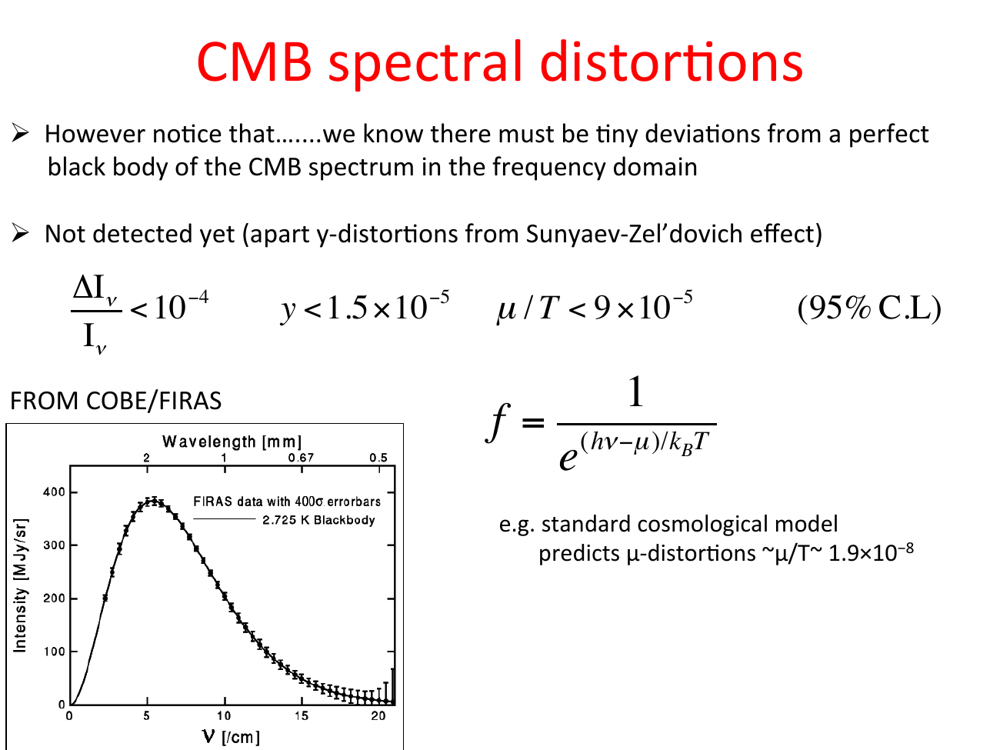

### CMB anisotropies

zoom in on the same spectrum spatially, and it is *not* perfectly smooth. Planck (2018) measured the temperature and polarization full-sky maps at $\sim 5$ arcmin resolution:

at the level of micro-Kelvins, $\Delta T/\bar T \sim 10^{-5}$ — the universe is **almost** smooth. the COBE-DMR map from 1994 was the first detection of this:

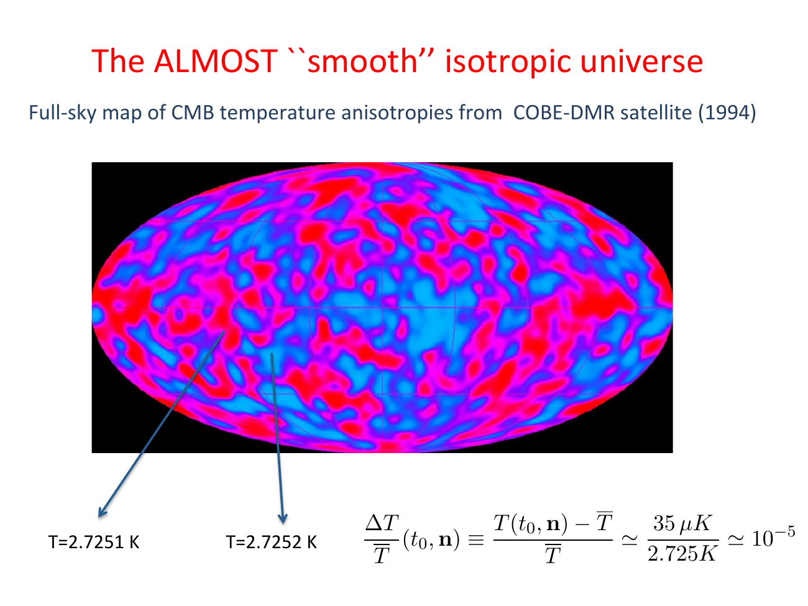

$$\frac{\Delta T}{\bar T}(t_0,\hat n) \equiv \frac{T(t_0,\hat n) - \bar T}{\bar T} \simeq \frac{35\,\mu K}{2.725\,\text{K}} \simeq 10^{-5}$$

these tiny anisotropies are the seeds of every galaxy and cluster I will ever observe.

---

## the cosmic baryon inventory

how do we *weigh* the baryons in the universe? four independent ways:

1. **observe baryons in stars and galaxies** via optical and X-ray emission
2. **quasar absorption spectra** — light absorbed by intervening hydrogen along the line of sight
3. **primordial nucleosynthesis** — the abundances of light nuclei depend strongly on the baryon density (see [BBN_overview](../../02_Zettel/Theory/BBN_overview.html))
4. **CMB anisotropies** — the height of the acoustic peaks depends on $\Omega_b h^2$

methods 3 and 4 are in *excellent* agreement. methods 1 used to give a smaller number, leading to the **missing baryon problem** — about half the baryons were unaccounted for. recent work has shown most of the missing ones live in the **WHIM**, the warm-hot intergalactic medium in filaments connecting galaxies, too cold to emit X-rays brightly.

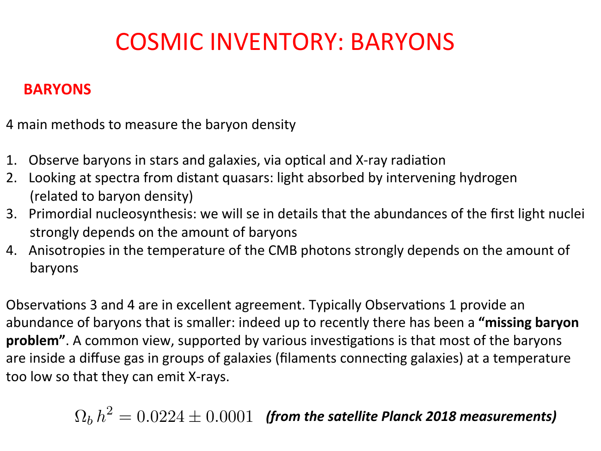

from Planck 2018:
$$\boxed{\,\Omega_b h^2 = 0.0224 \pm 0.0001\,}$$

### baryons leave fingerprints on the CMB peaks

the height of the first acoustic peak depends on the baryon density. more baryons = heavier "fluid" = lower sound speed = the compression peaks are enhanced and the rarefaction peaks are suppressed. so reading the peak heights gives $\Omega_b h^2$.

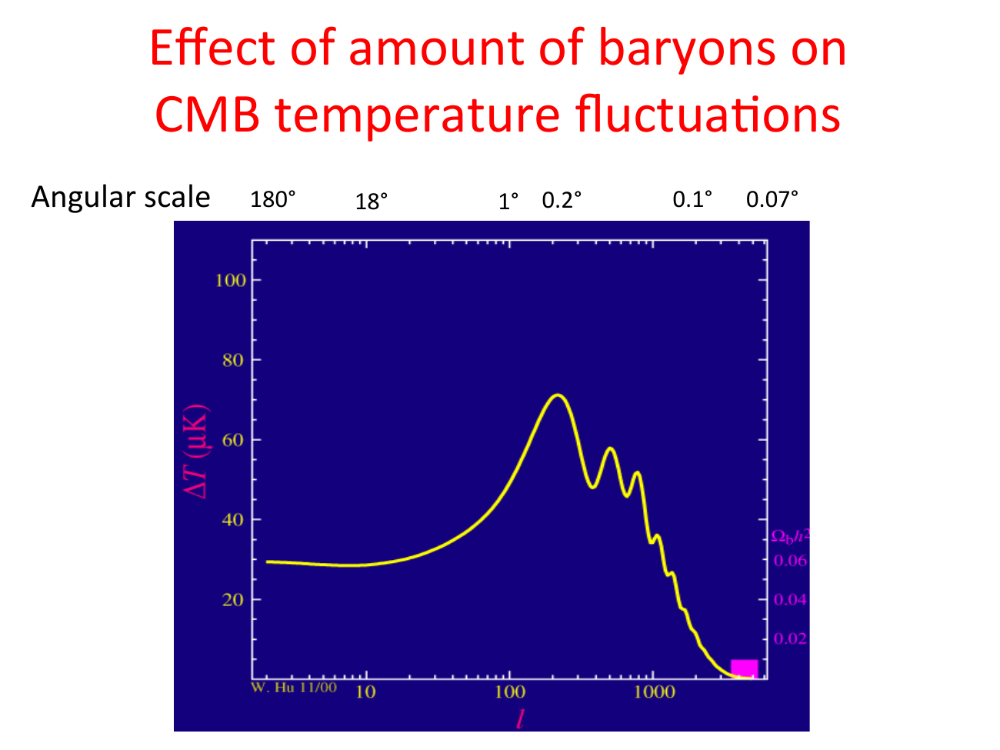

---

## the cosmic matter inventory and dark matter

"matter" here means non-relativistic, pressureless stuff. methods 1-4 above measure baryons specifically. there are *other* methods that sidestep electromagnetic interaction entirely and exploit gravity instead:

> *typically one exploits the gravitational effects that matter determines, e.g. the gravitational field produced by a given system from which one infers the mass of the system.*

what these methods have shown is that the total matter density is several times larger than the baryon density. the difference is **dark matter**: non-relativistic, effectively pressureless, gravitationally interacting, but invisible to photons.

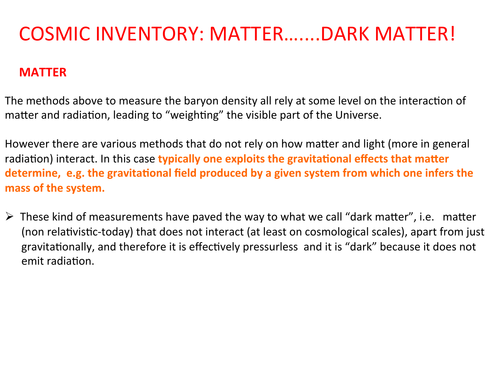

### mass-to-light ratio across scales

a direct check is to plot $M/L_B$ (mass over blue-band luminosity) against scale. luminous matter tracks $L$; total mass tracks $M$. if $M/L$ stays constant with scale, all matter is luminous. it does *not*.

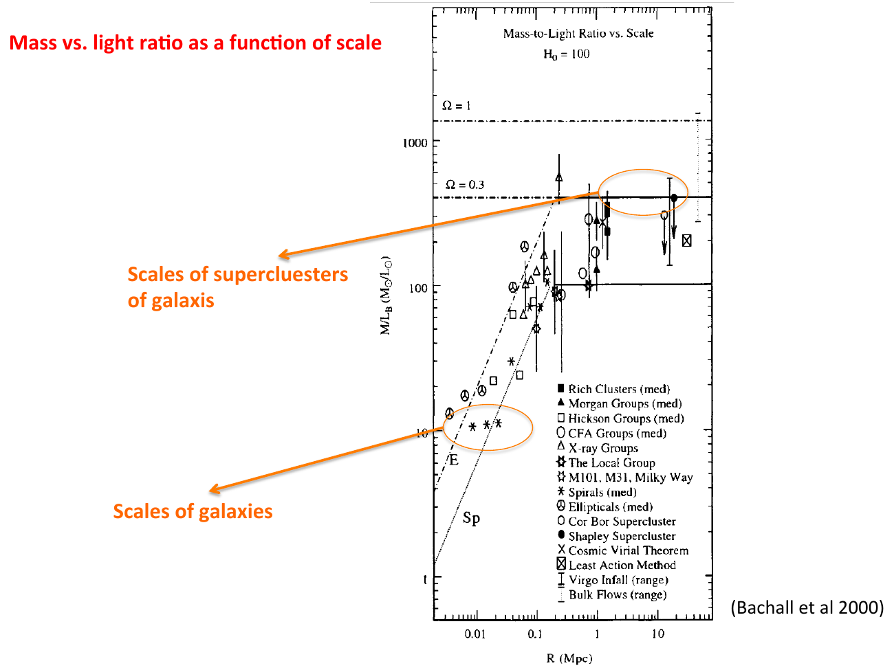

at galactic scales (spirals, ellipticals) $M/L \sim 10$ in solar units. at cluster scales (rich clusters, superclusters) $M/L \sim 200$–$300$, consistent with $\Omega_m \approx 0.3$. the rise tells you the fraction of dark matter increases on larger scales.

### dark matter on galactic scales — rotation curves

the textbook argument. for a circular orbit at radius $r$ inside a spherical mass distribution $M(r)$:
$$V^2(r) = \frac{GM(r)}{r}$$

if all the mass is luminous and concentrated in a stellar disk, then beyond the disk edge $r_*$ the mass enclosed is constant and the velocity drops:
$$V(r) \propto \frac{1}{r^{1/2}} \qquad (\text{Keplerian fall-off})$$

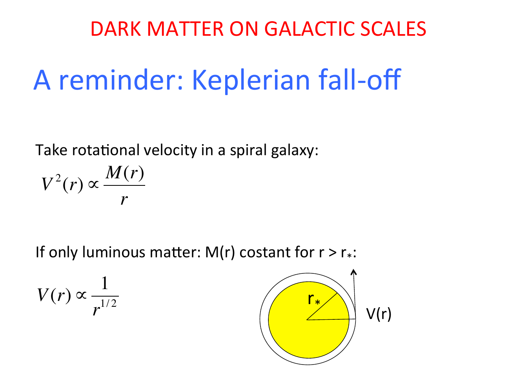

what we *observe* is completely different. neutral hydrogen 21-cm observations probe rotation way past the optical disk, and the curves stay flat — which means $M(r) \propto r$, i.e. there is mass distributed at large radii that does not emit light.

### the actual rotation curves

a high-quality rotation curve looks like this:

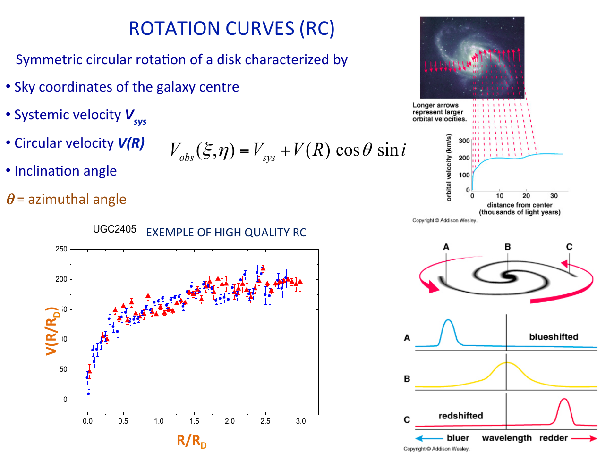

the velocity is measured from the Doppler shift of emission lines (one side blueshifted, the other redshifted). a galaxy is parametrized by its center, systemic velocity $V_{sys}$, circular velocity $V(R)$, inclination $i$, and azimuth $\theta$:
$$V_{obs}(\xi,\eta) = V_{sys} + V(R)\cos\theta\sin i$$

historically, Rubin & Ford (1970), Roberts & Whitehurst (1975), and the entire Rubin sample of 21 Sc galaxies (1980) all show: **no rotation curve follows the stellar disk velocity profile**. the discrepancy at large radii is universal.

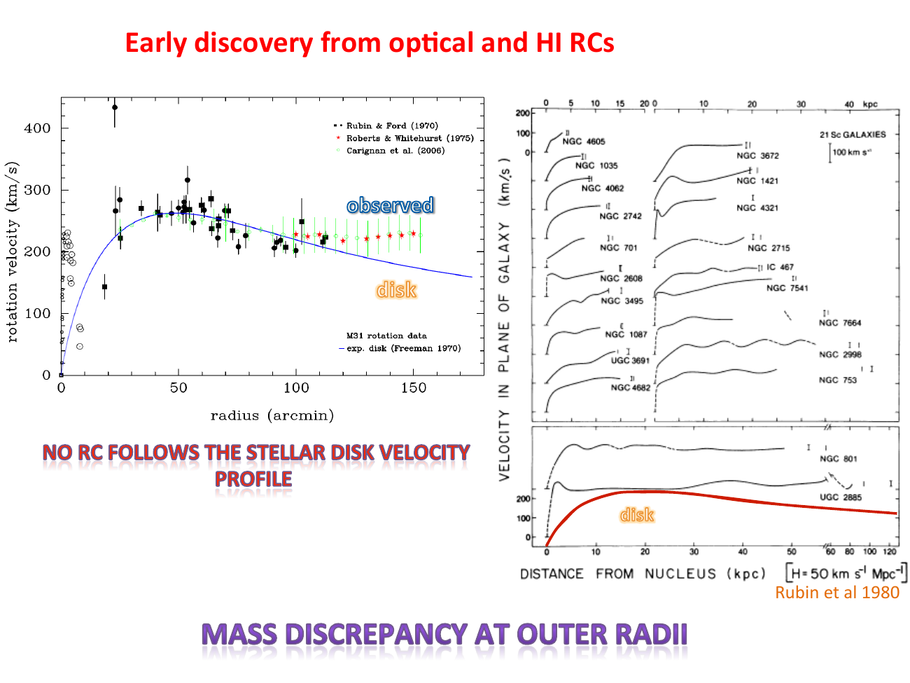

### decomposing the rotation curve

the modern way is to fit the observed $V(r)$ as the sum of three components:

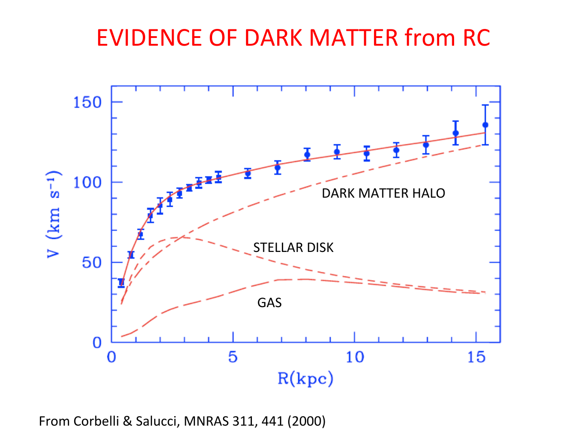

stellar disk + gas + dark matter halo. the stellar disk peaks and falls; the gas rises slowly; the dark matter halo dominates at large radius. without a halo the high-$r$ flat curve cannot be explained. (Corbelli & Salucci 2000 for M33.)

### dark matter on cosmological scales

galactic rotation curves only give you a galaxy-scale measurement. the more compelling evidence comes from cosmological scales:

1. **distribution of galaxies on large scales** (depends strongly on $\Omega_m h$)
2. **cosmic velocity fields** (peculiar motions trace the gravitational potential)
3. **measurements that depend on $\Omega_b/\Omega_m$**, like:
   - X-ray and Sunyaev-Zel'dovich measurements of clusters (most baryons in clusters are hot ICM gas; the ratio $\Omega_b/\Omega_m$ for clusters is taken as representative because they are huge enough to sample the universe fairly)
   - **baryon acoustic oscillations** (BAO): if baryons are only a small fraction of the matter, the BAO wiggles in $P_m(k)$ are proportionally small, and they have been measured robustly at the predicted amplitude
4. **CMB temperature anisotropies and polarization** (the heights of the higher peaks fix $\Omega_m h^2$)

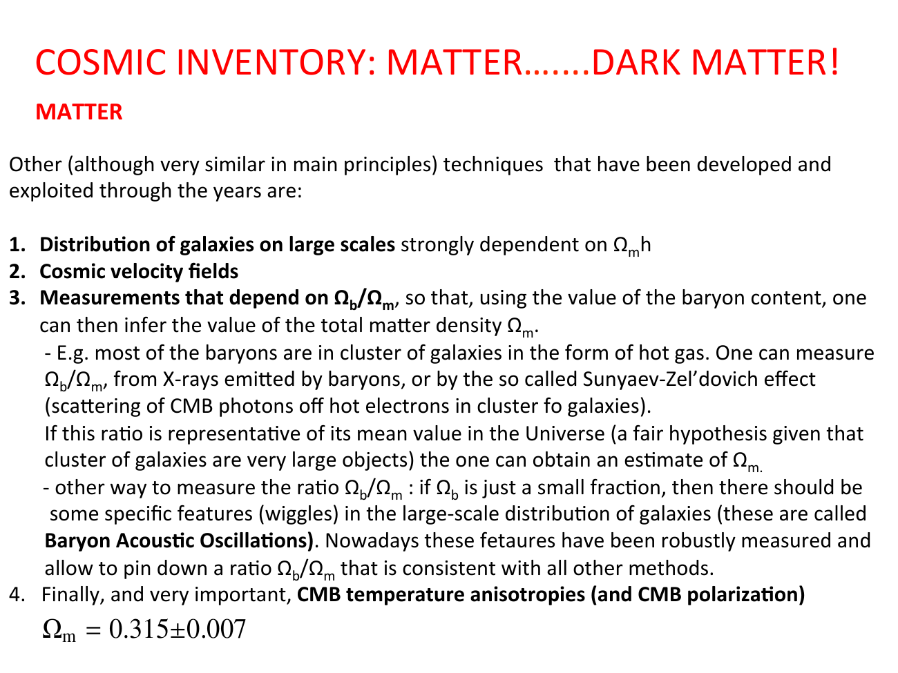

from Planck 2018:
$$\boxed{\,\Omega_m = 0.315 \pm 0.007, \quad \Omega_{dm} h^2 = 0.120 \pm 0.001\,}$$

so the matter density is about five times the baryon density. *most of the matter in the universe is not baryons*. it has to be some new species. we call it dark matter.

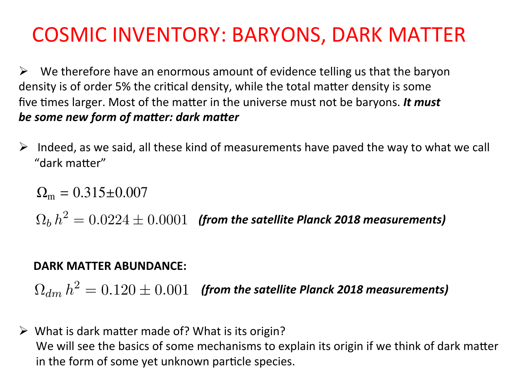

### CMB anisotropies fix the total matter

the second peak height and the relative heights of the peaks fix $\Omega_m h^2$:

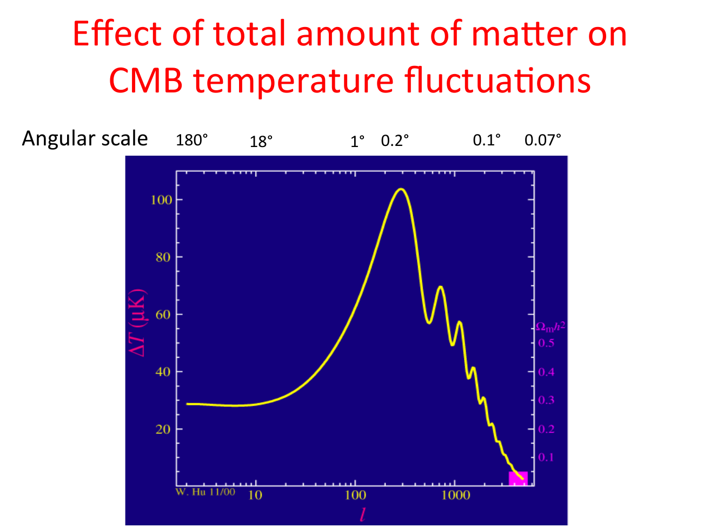

### the matter power spectrum and BAO

once you allow density perturbations, the universe is not so smooth after all. the **matter power spectrum** $P_m(k)$ measures the variance of $\delta\rho_m/\bar\rho_m$ at wavenumber $k$ (loosely $\lambda \sim 1/k$):
$$P_m(k) \sim \langle |\delta\rho_m/\bar\rho_m|^2 \rangle$$

modern measurements stitch together Planck CMB, DES cosmic shear, SDSS LRG galaxies, and BOSS Ly-α forest, and they all sit on a single curve:

the **turnover** of the spectrum sits at the equality scale (the size of the horizon at matter-radiation equality), so it is sensitive to $\Omega_m h^2$. modes that entered the horizon during radiation domination got suppressed; modes that entered later did not.

zooming in on $k \sim 0.1\,h\,\text{Mpc}^{-1}$, the spectrum has small wiggles superimposed on the smooth power-law: the **baryon acoustic oscillations**. a universe of pure baryons would have a hugely oscillating $P_m(k)$ (dashed curve). a universe of mostly dark matter has small wiggles on top of a smooth curve (solid). the data show the wiggles at exactly the predicted amplitude. **this is dark matter being detected through the absence of pure-baryon oscillations.**

right panel: BAO measured directly in SDSS LRGs and BOSS CMASS by computing $\log_{10}P(k)/P(k)_{\rm smooth}$ — those characteristic wiggles in galaxy clustering at $k \sim 0.05$–$0.2\, h\,\text{Mpc}^{-1}$.

---

## the cosmic neutrino inventory

cosmic neutrinos — a thermal background of relic neutrinos — have not been directly observed yet (the CνB). but solar and atmospheric neutrinos have been observed, revealing that **neutrinos have nonzero masses**, with at least two of the three species being non-relativistic today.

cosmic neutrinos:
- are **fermions**, weakly interacting
- were in equilibrium with the thermal plasma at very early times
- **decoupled** at $T \sim 1$ MeV when their interaction rate fell below H
- today should sit at a temperature
$$T_\nu = \left(\frac{4}{11}\right)^{1/3} T_\gamma$$
because $e^\pm$ annihilation after neutrino decoupling reheated the photons but not the neutrinos.

even without a direct detection, neutrinos leave specific imprints on the CMB and on small-scale structure formation. from Planck 2018 + lensing + BAO:

$$\boxed{\,\sum m_\nu < 0.12\,\text{eV}\quad(95\%\,\text{CL}), \qquad \Omega_\nu h^2 < 0.0012\,(95\%\,\text{CL})\,}$$

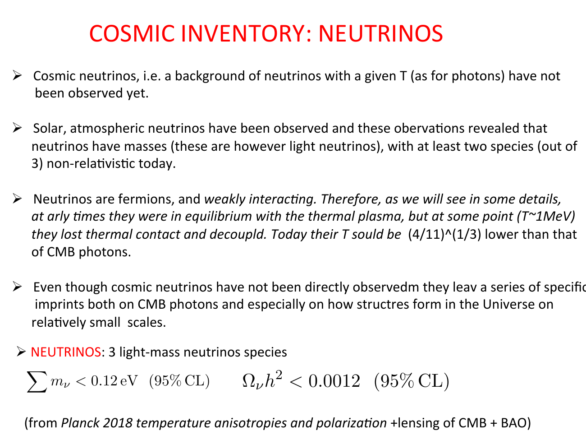

---

## the cosmic dark energy inventory

### the Hubble diagram

still our most direct evidence that the universe is expanding. at low redshift, the linear Hubble law holds:
$$v = H_0 d, \qquad z \simeq v/c$$

(Hubble's original 1929 plot. velocities should be in km/s, distances in Mpc; the solid line is the fit to the corrected points.)

local SN Ia measurements give $H_0 = 73.04 \pm 1.04$ km/s/Mpc (Riess et al. 2022), while CMB-anchored measurements give $H_0 = 67.4 \pm 0.5$ km/s/Mpc. the **Hubble tension** remains an open problem in 2025/2026.

### at high redshift the Hubble law turns into something else

at high z the simple Doppler $z = v/c$ breaks down. you need the full luminosity-distance relation
$$d_L(z) \,\, \text{depends on}\,\, \Omega_m, \Omega_\Lambda, \Omega_k$$
and the relation $m - M = 5\log d_{L,\rm Mpc} + 25 + K(z)$.

what we want at high redshift are **standard candles** — objects whose intrinsic brightness is known. then from the apparent brightness we get distance, and from the distance + redshift we get a fit to $\Omega_m, \Omega_\Lambda$.

### the cosmic distance ladder

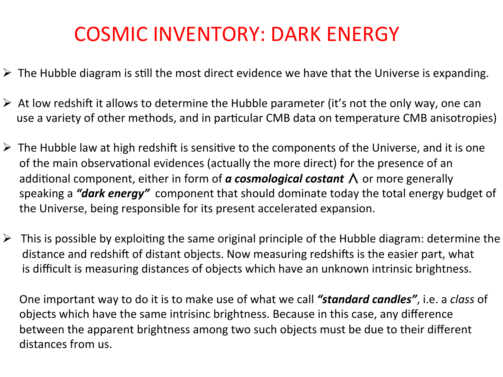

Cepheid variables have a period-luminosity relation calibrated to thousands of stars within $\sim 20$ Mpc by HST. they anchor the distance to galaxies that host SN Ia. SN Ia in turn extend out to $z \sim 1$ and beyond. of all the candles in the figure (I-band Tully-Fisher, fundamental plane, surface brightness fluctuations, SN II, SN Ia), **SN Ia have the smallest dispersion and reach the highest redshifts**. the bottom panel shows that beyond $\sim 100$ Mpc, $H_0 \approx 72$ flattens out — confirming the linear Hubble flow at low z.

### high-z SN Ia and the discovery of Λ

at high z the SN Ia turn out to be **fainter** than they should be in any matter-only or open universe. they sit on top of a curve with $\Omega_M = 0.28$, $\Omega_\Lambda = 0.72$. this is the 1998 Perlmutter / Riess / Schmidt result.

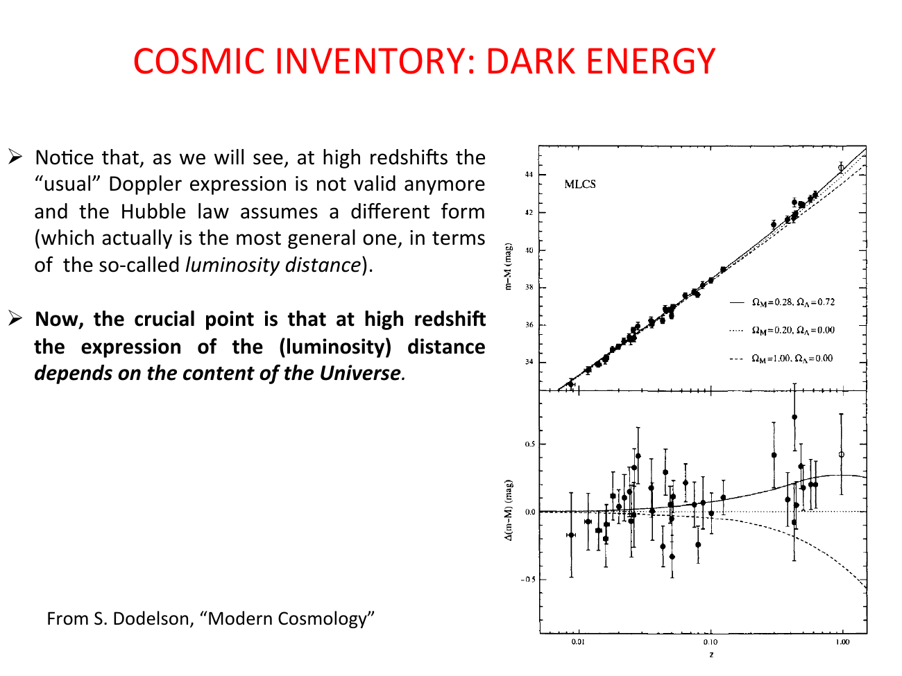

the small-z form of the luminosity distance, expanded:
$$d_L = \frac{c}{H_0}\left[z + \tfrac12(1 - q_0)z^2 + \cdots\right], \qquad q_0 = -\frac{\ddot a(t_0) a_0}{\dot a(t_0)^2}$$

a positive $q_0$ means deceleration; a negative $q_0$ (acceleration) requires $\Omega_\Lambda > \Omega_m/2$.

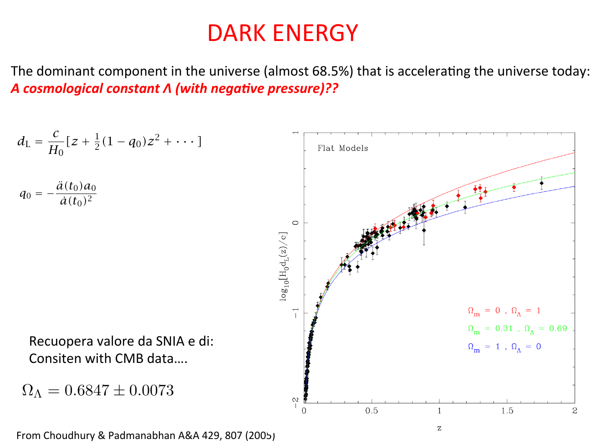

best fit (Choudhury & Padmanabhan A&A 429, 807, 2005, with later updates):
$$\boxed{\,\Omega_\Lambda = 0.6847 \pm 0.0073\,}$$

cosmological constant: same value across SN Ia, BAO, CMB. consistent.

### dark energy in the energy budget

from CMB temperature anisotropies, the total density parameter today is
$$\Omega_K = 1 - \Omega_0 = 0.001 \pm 0.002 \quad (68\%\,\text{CL})$$

i.e. **the universe is flat to a fraction of a percent**. this is also what generic inflation models predict.

but the matter + radiation + neutrinos add up to only about $1/3$ of the critical density. so we *need* an additional component, and from negative-pressure considerations (we will see why), it must:
- be very weakly interacting and very weakly clustering (essentially smooth) — otherwise we would have detected it directly
- have **negative pressure**, $p < -\rho/3$, in order to drive accelerated expansion today

a *cosmological constant* is the limit $p = -\rho$ exactly, an energy density that does not dilute with expansion. a more general **dark energy** has $p < -\rho/3$ but can evolve in time and weakly in space.

at present, a $\Lambda$ term is the form of dark energy that fits the most data.

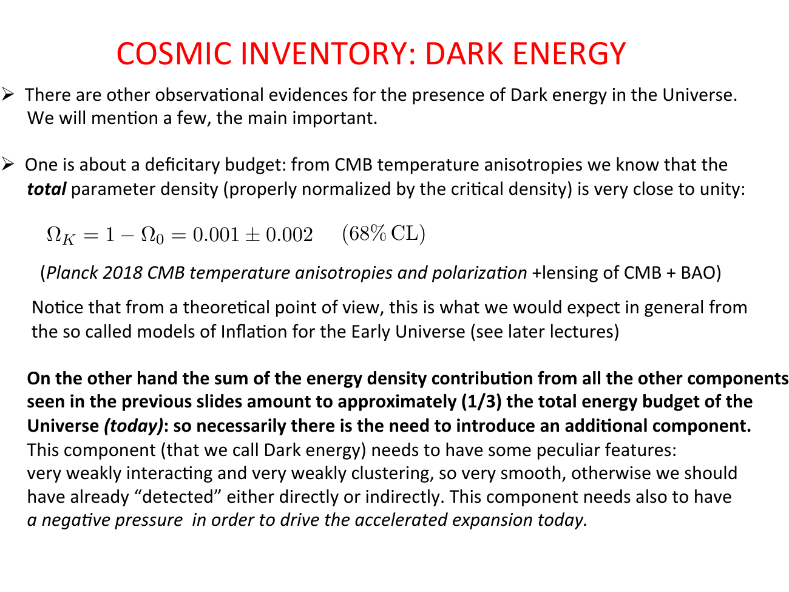

### age of the universe

a final, crucial historical piece of evidence. for a *matter-dominated* universe the age would be
$$t_0 = \frac{2}{3 H_0}$$

with the measured $H_0 = 67.4$ km/s/Mpc, $H_0^{-1} = 9.7776\,h^{-1} \times 10^9$ yr, so $t_0 \approx 9.6 \times 10^9$ yr in EdS.

this is **clearly at odds** with independent age measurements (oldest globular clusters, white dwarf cooling, nuclear chronometers): the universe is $13.8 \times 10^9$ yr old. a cosmological constant pushes the age up to match.

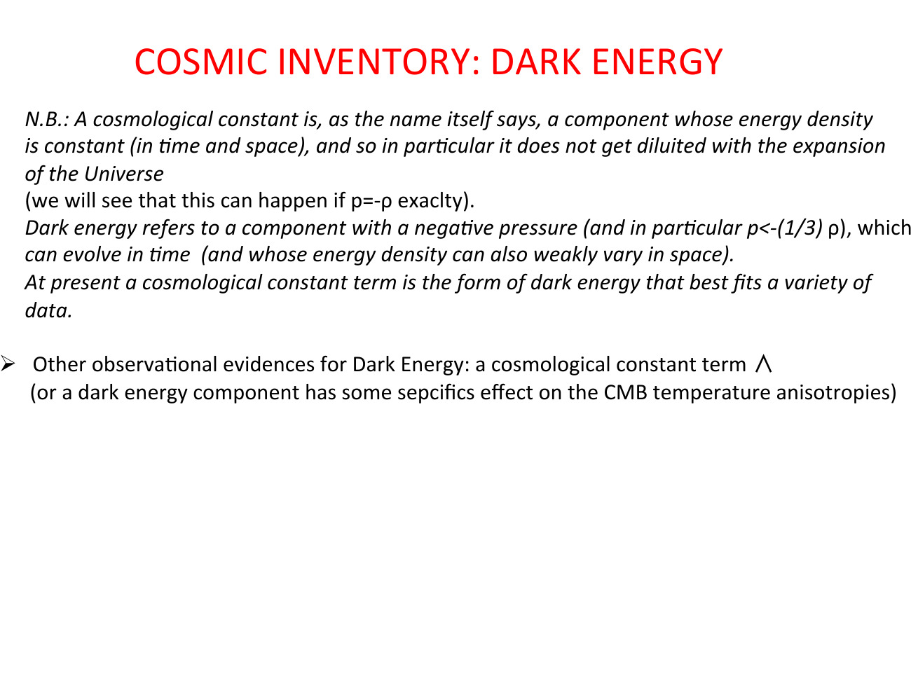

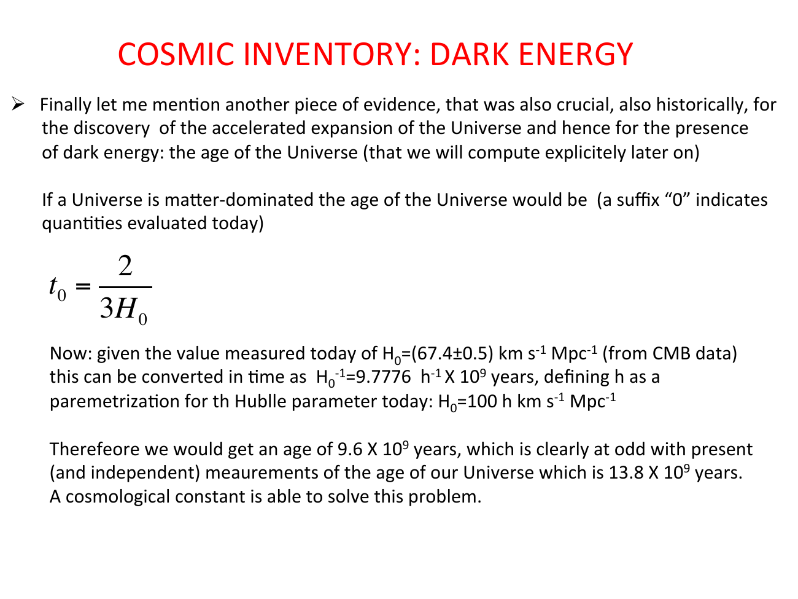

---

## the brief thermal history

putting the whole inventory together as a function of time:

reading top to bottom (today to early times):
- **today**, $z \sim 0$, life on Earth, dark energy dominates
- **acceleration** begins, $\sim 11$ Gyr ago
- **galaxy formation** era
- **earliest visible galaxies** at 700 Myr
- **recombination** (atoms form, CMB decouples) at $z_{\rm rec} \sim 1100$, $T \sim 0.25$ eV, age $\sim 4 \times 10^5$ yr
- **matter domination** begins at $z_{\rm eq} \sim 3300$, age $\sim 5000$ yr
- **nucleosynthesis** at $T \sim 1$ MeV, age 3 minutes
- **quark-hadron transition** at $T \sim 1$ GeV
- **electroweak transition** at $T \sim 100$ GeV (dark matter production?)
- **grand unification** at $T \sim 10^{16}$ GeV (baryogenesis?)
- **inflation** at $T \gtrsim 10^{16}$ GeV
- **quantum gravity wall** at $T \sim 10^{19}$ GeV — spacetime breaks down

this is the chain my entire degree is unpacking, one block at a time.

---

## effect of changing parameters on the CMB power spectrum

a useful summary of how the four main ΛCDM parameters move the CMB peaks:

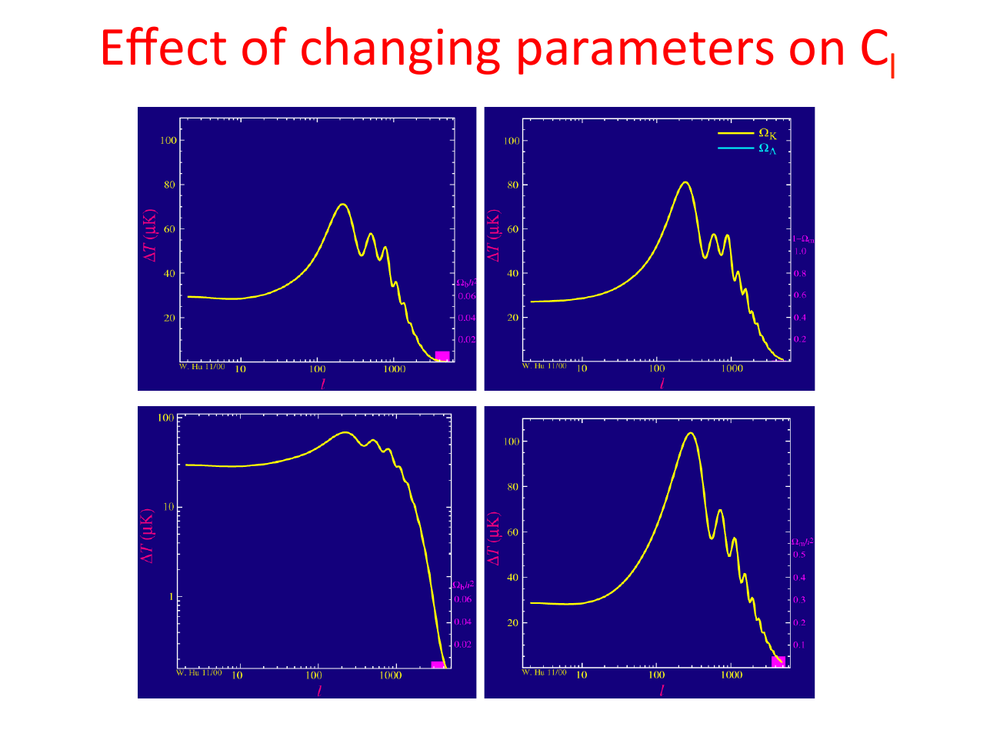

(top-left: baseline / vary $\Omega_b h^2$. top-right: vary $\Omega_K, \Omega_\Lambda$. bottom-left: low $\Omega_b h^2$. bottom-right: vary $\Omega_m h^2$.) the position of the first peak fixes the geometry; the relative heights of the second, third, fourth peaks fix the baryon and matter densities; the damping tail at high $\ell$ fixes diffusion physics.

---

## the missing baryon problem (sidebar)

direct observations (method 1: counting baryons in stars, galaxies, hot gas) historically yielded only $\sim 2\%$ of the total budget — about half of what BBN (method 3) and the CMB (method 4) demand. these were the **missing baryons**. recent work has located most of them in **dark baryons** in the WHIM (warm-hot intergalactic medium) in filaments connecting galaxies, too cold to emit detectable X-rays. read more at [Half the universe's missing matter has just been finally found](https://www.newscientist.com/article/2149742-half-the-universes-missing-matter-has-just-been-finally-found/).

---

## takeaway

the universe today is:

| component | $\Omega$ |
|---|---|
| dark energy | $\sim 0.685$ |
| dark matter | $\sim 0.27$ |
| baryons | $\sim 0.05$ |
| photons + neutrinos | $\sim 10^{-4}$ |
| total | $\approx 1.000$ (flat) |

we have *six* main numbers: $H_0$, $\Omega_b h^2$, $\Omega_{dm} h^2$, $\Omega_\Lambda$, $\sum m_\nu$, and the spectral parameters $A_s, n_s$ from inflation. these are pinned down by independent measurements that all tell the same story to remarkable precision. ΛCDM works.

what we don't know:
- *what is dark matter?* (a particle? primordial black holes?)
- *what is dark energy?* (Λ, or something time-dependent?)
- *what set the initial conditions?* (which inflation model?)
- *what causes the Hubble tension?*

---

## subtopics

- [Cosmic_inventory_photons](../../02_Zettel/Theory/Cosmic_inventory_photons.html)
- [Cosmic_inventory_baryons](../../02_Zettel/Theory/Cosmic_inventory_baryons.html)
- [Cosmic_inventory_dark_matter](../../02_Zettel/Theory/Cosmic_inventory_dark_matter.html)
- [Cosmic_inventory_neutrinos](../../02_Zettel/Theory/Cosmic_inventory_neutrinos.html)
- [Cosmic_inventory_dark_energy](../../02_Zettel/Theory/Cosmic_inventory_dark_energy.html)
- [Brief thermal history](../../02_Zettel/Theory/Brief thermal history.html)
- [BBN_overview](../../02_Zettel/Theory/BBN_overview.html)
- [Matter power spectrum and BAO](../../02_Zettel/Theory/Matter power spectrum and BAO.html)

---

## see also

- [Fundamentals_Astrophysics_Cosmology_MOC](../../00_Atlas/Fundamentals_Astrophysics_Cosmology_MOC.html)
- [Observational_Cosmology_MOC](../../00_Atlas/Observational_Cosmology_MOC.html) — the natural follow-on
- [Baumann_reference](../../02_Zettel/Theory/Baumann_reference.html) — chapter 3 (Thermal History) is the rigorous treatment
