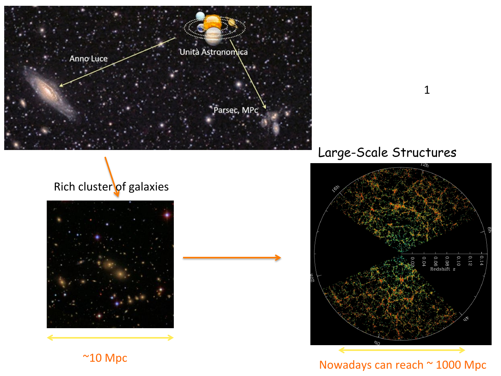
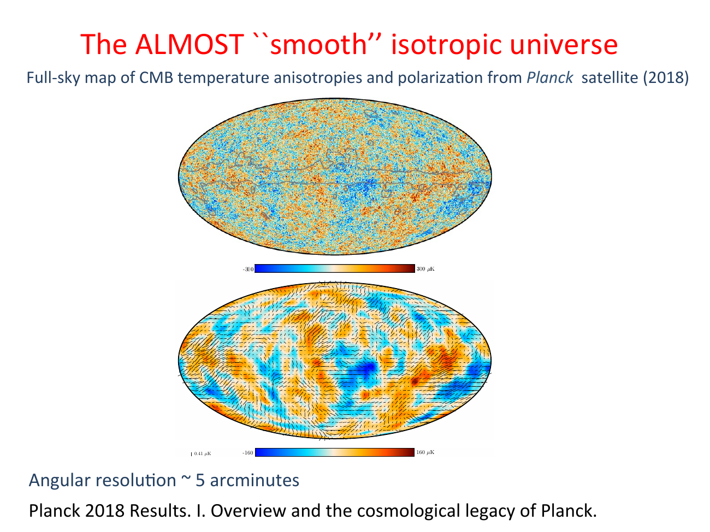

the **cosmological principle** is the assumption that the universe, on sufficiently large scales, is **homogeneous and isotropic**.

- **homogeneous**: independent of position. every point looks the same.
- **isotropic**: independent of direction. every direction looks the same.

isotropy at every point implies homogeneity. so the principle is really one statement.

---

## what "large scales" means

the typical scales:
- separation of stars in our galaxy: parsecs (1 pc $\approx 3.086 \times 10^{13}$ km)
- separation of bright galaxies: $\sim 1$ Mpc
- the cosmological regime: $l \gtrsim 1$ Mpc

at scales above $\sim 100$ Mpc, the galaxy distribution looks statistically homogeneous and isotropic: that is the regime in which the cosmological principle holds.

below that scale the universe is *clumpy* — galaxies, clusters, walls, voids, the cosmic web (see [Matter power spectrum and BAO](../../02_Zettel/Theory/Matter power spectrum and BAO.md)).

---

## why we adopt it

three reasons, in increasing order of weight:

1. **cosmographic surveys**: redshift surveys (2dFGRS, SDSS, Planck) show the galaxy distribution is statistically isotropic on large scales. small-scale clumpiness averages out at $> 100$ Mpc.

2. **CMB anisotropies are tiny**: $\Delta T/\bar T \sim 10^{-5}$. the universe at $z = 1100$ was extraordinarily smooth. modern temperature and polarization maps (Planck 2018) show this directly:

3. **theoretical simplicity**: the Copernican principle generalized. there is no privileged observer or direction in the universe. picking any other condition would require fine-tuning.

> *despite what your mom might have told you, we shouldn't assume that we are the centre of the universe.* — Baumann

---

## the comoving observer

within an isotropic and homogeneous universe, there is a privileged class of observers: those who see the universe as isotropic *around them*. these are called **comoving observers** or "fundamental observers." they are not unique — every point of space supports one.

a comoving observer is one who follows the **Hubble flow** of expansion, with no peculiar velocity superimposed. our observed local-group peculiar velocity ($\sim 600$ km/s) shows up as the **CMB dipole** — once we subtract that, the rest-frame CMB is isotropic to $\Delta T/T \sim 10^{-5}$.

so the CMB itself is the operational realization of the comoving frame.

---

## consequences

- the universe can be foliated into spatial slices $\Sigma_t$ at fixed cosmic time, each homogeneous and isotropic
- this restricts the metric to a unique form: the **Robertson-Walker metric** (see 03_Zettel/Theory/Robertson-Walker metric)
- only one function of time, the scale factor $a(t)$, encodes the entire geometry
- combined with the Einstein equations, the dynamics of $a(t)$ is the **Friedmann equation** (see Friedmann equations with Λ)

so the cosmological principle reduces all of cosmology to *one ODE for one function of time*. that is its enormous practical power.

---

## see also

- [Fundamentals_Astrophysics_Cosmology_MOC](../../00_Atlas/Fundamentals_Astrophysics_Cosmology_MOC.md)
- [Cosmic_inventory_overview](../../02_Zettel/Theory/Cosmic_inventory_overview.md)
- 03_Zettel/Theory/Robertson-Walker metric
- Friedmann equations with Λ
- [Cosmic_inventory_photons](../../02_Zettel/Theory/Cosmic_inventory_photons.md) — the CMB as the realization of the comoving frame
