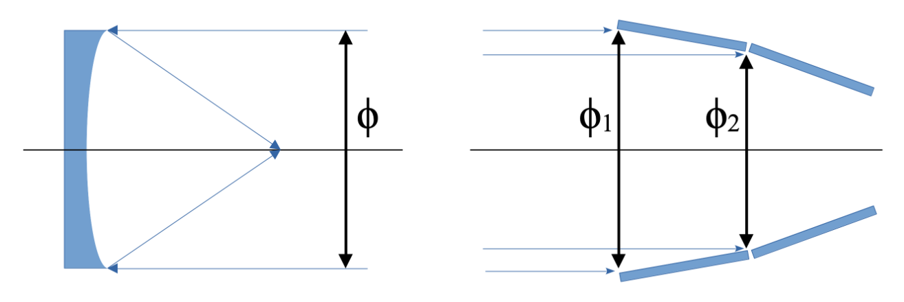
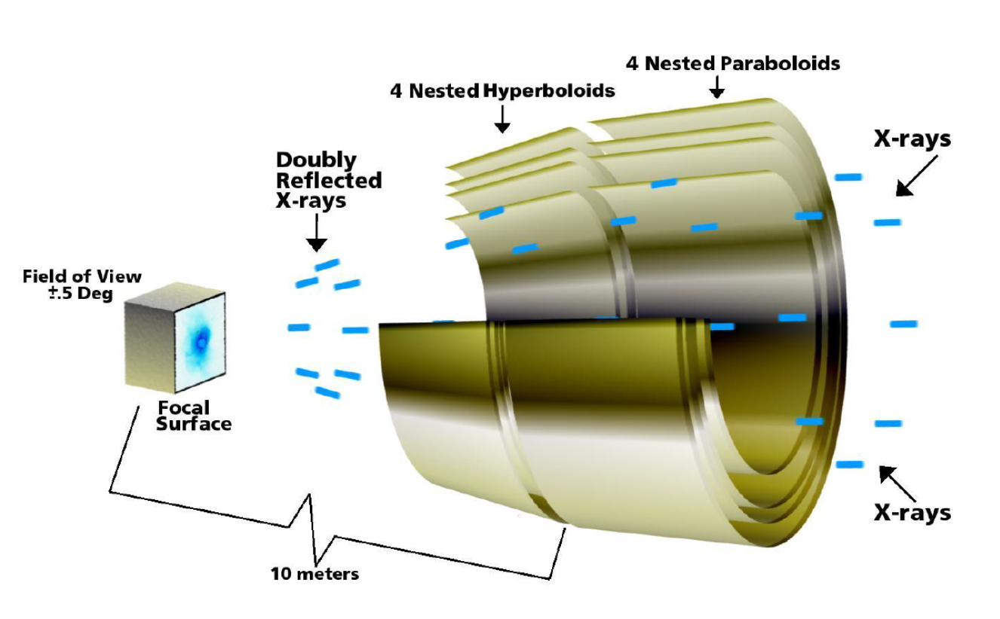

In optical telescopes, mirrors are perpendicular to the optical axis
	and fully oriented toward the source — the effective area equals the geometric aperture area
In X-ray telescopes, mirrors are **cylinders** inclined at grazing angles
	the consequence of grazing incidence is a strong reduction in collecting efficiency

Comparison between an optical telescope (left) and an X-ray telescope (right). The optical mirror uses its full circular area; the X-ray mirror only uses a thin annular ring.

---

## Geometric effective area

For an optical circular mirror:
$$A_{geo,opt} = \pi\frac{\phi^2}{4}$$

For a single **X-ray annular mirror** (inner diameter $\phi_2$, outer diameter $\phi_1$):
$$A_{geo,X} = \pi\frac{(\phi_1^2 - \phi_2^2)}{4}$$

This is much smaller than the optical case — a 1-m diameter annulus with 1 cm width collects $\pi \times 1 \times 0.01 \approx 0.03~\text{m}^2$ compared to $0.78~\text{m}^2$ for a full optical mirror

---

## Full effective area formula

The total effective area of an X-ray telescope includes all efficiency factors:
$$\boxed{A_{eff}(E) = A_{geo} \times R_{mirrors}(E) \times QE(E) \times T_{filter}(E)}$$

where
	$A_{geo}$: geometric collecting area of the mirror aperture
	$R_{mirrors}(E)$: reflectivity of the grazing-incidence mirrors
		depends on coating material and $\theta_c(E) \propto \sqrt{\rho}/E$ — see [Grazing incidence](../../02_Zettel/Theory/Grazing incidence.md)
	$QE(E)$: quantum efficiency of the detector
		limited at low $E$ by absorption in dead layers, at high $E$ by finite depletion depth — see [Quantum efficiency](../../02_Zettel/Theory/Quantum efficiency.md)
	$T_{filter}(E)$: transmission of optical blocking filters
		absorbs UV/visible photons but also removes some soft X-rays

---

## Wolter I telescope: analytic formula

For a single [Wolter I](../../02_Zettel/Theory/Wolter Telescope.md) shell with focal length $f$, mirror length $L$, grazing angle $\theta$, reflectivity $R(E)$:
$$A_{eff}(E) = 8\pi f L \theta^2(E) \cdot R^2(E)$$

where the factor $R^2$ accounts for **two reflections** (paraboloid + hyperboloid), each with reflectivity $R$
	and the factor $\theta^2$ comes from the annular geometry in terms of grazing angle

The reflectivity $R(E)$ falls sharply above the cutoff energy $E_c$ where $\theta_c(E) < \theta_{graze}$:
$$E_c = \frac{\sqrt{2\delta_0}}{E_{cutoff}} \propto \frac{\sqrt{\rho}}{E_{cutoff}}$$

Above $E_c$: total external reflection fails → $R \to 0$ → $A_{eff}(E)$ drops to near zero

---

## Nested shells

To increase $A_{eff}$, multiple **confocal shells** are nested together:
	each shell contributes its own annular area
	the total effective area is the **sum** over all shells:
$$A_{eff,total}(E) = \sum_{n=1}^{N} A_{eff,n}(E)$$

Additional advantage: different shells have different grazing angles
	so they have different energy cutoffs → **broader energy response**

Nested mirror assembly of the Chandra X-ray telescope. Four pairs of paraboloid/hyperboloid shells are nested concentrically to maximize effective area.

---

## Energy dependence of $A_{eff}$

The effective area curve $A_{eff}(E)$ has a characteristic shape:

**Low-energy cutoff**: set by $T_{filter}(E)$ and $QE(E)$ (dead layers absorb soft X-rays)
	typical: $A_{eff} \to 0$ below $\sim 0.1$–$0.2~\text{keV}$

**Peak**: usually at $\sim 0.5$–$2~\text{keV}$ where reflectivity, QE, and filter transmission are all good

**High-energy cutoff**: set by $R_{mirrors}(E) \propto \theta_c(E)^2 \propto 1/E^2$
	for iridium coating on Chandra: effective cutoff $\sim 8$–$10~\text{keV}$
	for multilayer NuSTAR mirrors (Bragg): extended to $\sim 79~\text{keV}$

---

## Comparison of real missions

| Mission | Peak $A_{eff}$ (cm$^2$) | Energy (keV) | HPD (arcsec) |
|---|---|---|---|
| Einstein | 200 | 1 | 15 |
| ROSAT | 400 | 1 | 5 |
| BeppoSAX | 330 | 1 | 60 |
| Chandra | 800 | 1 | 0.5 |
| XMM-Newton | 4650 | 1 | 14 |
| NuSTAR | 900 | 10 | 60 |

---

## Connection to count rate

The effective area enters directly into the count rate measured by the detector:
$$C = \int_{E_1}^{E_2} \mathcal{F}(E) \cdot A_{eff}(E) \, dE$$

where $\mathcal{F}(E) = F_E/E$ is the photon spectral flux
	to recover $F$ from $C$, the full response including the redistribution matrix $R(I,E)$ must be inverted via spectral fitting
	see [Luminosity and Flux for -Instrumentations](../../02_Zettel/Theory/Luminosity and Flux for -Instrumentations.md) for the complete chain
