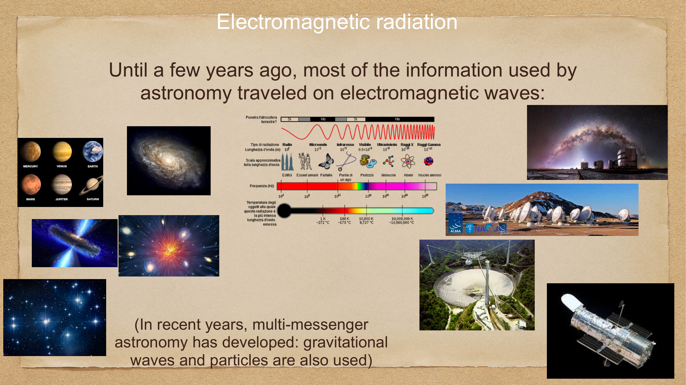
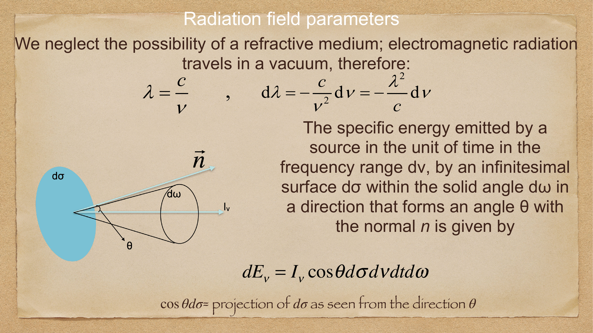
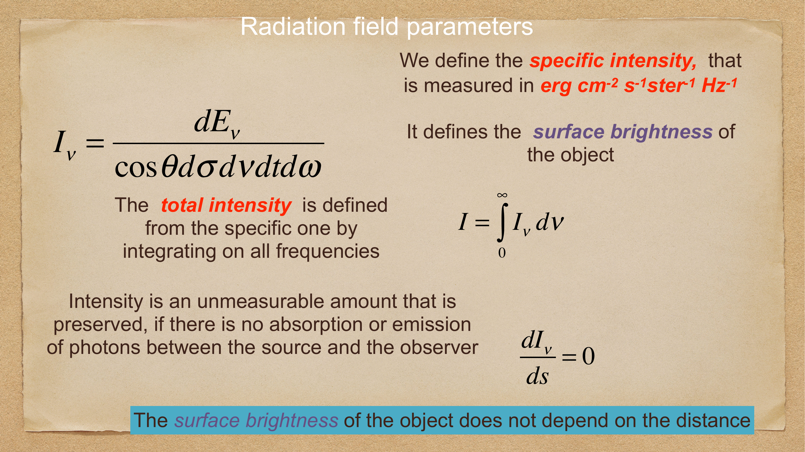
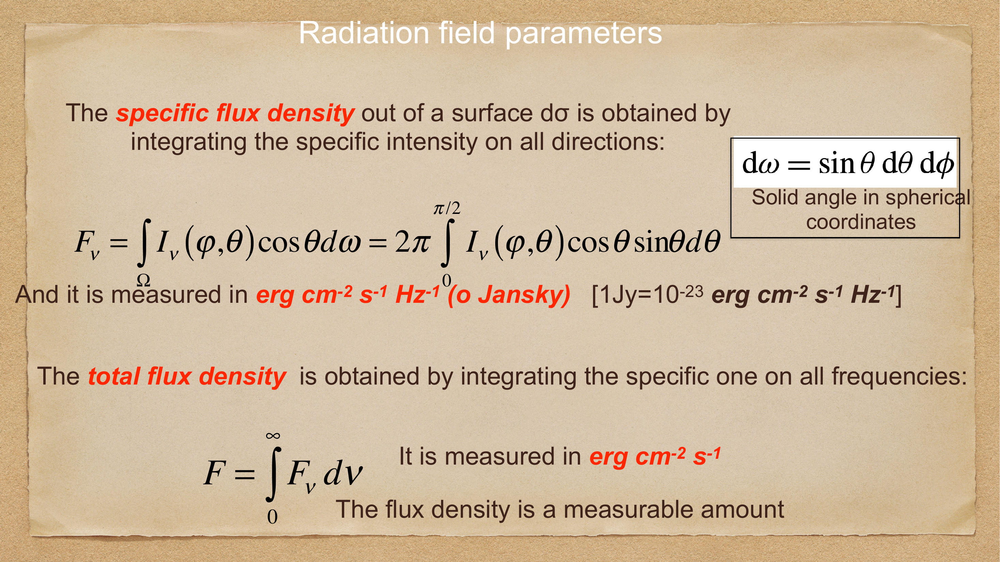

until a few years ago, almost everything we knew about astronomy traveled on **electromagnetic waves**. (more recently, multi-messenger astronomy has added gravitational waves and high-energy particles, but EM is still the workhorse.)

each band of the spectrum probes a different temperature regime and a different physical process — radio for cold gas, infrared for dust, optical for stars, UV for hot stars, X-ray for hot plasma and accretion, gamma-ray for the most violent universe.

---

## the radiation field parameters

we neglect refraction, electromagnetic radiation travels in vacuum:
$$\lambda = \frac{c}{\nu}, \qquad d\lambda = -\frac{c}{\nu^2} d\nu = -\frac{\lambda^2}{c} d\nu$$

(the minus sign accounts for the fact that increasing frequency means decreasing wavelength.)

the **specific energy** emitted by a source in time $dt$ in the frequency range $d\nu$ from an infinitesimal surface $d\sigma$ within the solid angle $d\omega$, in a direction making angle $\theta$ with the surface normal $\vec n$, is:
$$dE_\nu = I_\nu \cos\theta\, d\sigma\, d\nu\, dt\, d\omega$$

(the $\cos\theta\,d\sigma$ is the projected area as seen from the direction $\theta$.)

---

## specific intensity and surface brightness

solving for $I_\nu$ gives the **specific intensity**, measured in
$$[I_\nu] = \text{erg cm}^{-2}\text{s}^{-1}\text{ster}^{-1}\text{Hz}^{-1}$$

it defines the **surface brightness** of the object — the energy per unit time, per unit area, per unit frequency, per unit solid angle.

the **total intensity** is obtained by integrating over all frequencies:
$$I = \int_0^\infty I_\nu\, d\nu$$

key fact: the specific intensity is **conserved** along a ray in vacuum:
$$\frac{dI_\nu}{ds} = 0 \quad \text{(no absorption or emission)}$$

→ **the surface brightness of an object does not depend on the distance**. a star at 10 pc has the same surface brightness as the same star at 100 pc — what changes is the *angle* it subtends, not its surface brightness per unit angle. this is the fundamental reason why imaging cosmology gets complicated at high z, where the geometric $(1+z)^{-4}$ surface brightness dimming kicks in (see 03_Zettel/Theory/Cosmological distances).

---

## flux density

the **specific flux density** out of a surface $d\sigma$ is the intensity integrated over all directions:
$$F_\nu = \int_\Omega I_\nu(\varphi, \theta)\cos\theta\, d\omega = 2\pi\int_0^{\pi/2} I_\nu(\varphi, \theta)\cos\theta\sin\theta\, d\theta$$

(with the solid-angle element $d\omega = \sin\theta\, d\theta\, d\varphi$ in spherical coordinates.)

units: erg cm$^{-2}$ s$^{-1}$ Hz$^{-1}$, or **Jansky**:
$$1\,\text{Jy} = 10^{-23}\,\text{erg cm}^{-2}\text{s}^{-1}\text{Hz}^{-1}$$

(named after Karl Jansky, the radio astronomer who first detected cosmic radio emission.)

the **total flux density** is integrated over all frequencies:
$$F = \int_0^\infty F_\nu\, d\nu \qquad [F] = \text{erg cm}^{-2}\text{s}^{-1}$$

unlike intensity, **the flux density is measurable**.

---

## flux falls as $1/r^2$ for an isotropic source

for an isotropic point source of total luminosity $L$, the energy crossing any sphere of radius $r$ is $L$. so the flux density at distance $r$ is:
$$F = \frac{L}{4\pi r^2}$$

this is the **inverse-square law**: $F \propto 1/r^2$. it is the basis of every distance measurement using a standard candle (see [Parallax and standard candles](../../02_Zettel/Theory/Parallax and standard candles.md) and [Cosmic_inventory_dark_energy](../../02_Zettel/Theory/Cosmic_inventory_dark_energy.md)).

the units of $F$ are flux density (erg/cm$^2$/s), and $L$ is the **luminosity** (erg/s).

note: the inverse-square law is a *flat-space* result. at cosmological distances we replace $r$ with the **luminosity distance** $d_L$ — see 03_Zettel/Theory/Cosmological distances.

---

## intensity vs flux: the key conceptual distinction

- **specific intensity** $I_\nu$: per unit solid angle, *intrinsic* property of the source (does not change with distance)
- **flux density** $F_\nu$: integrated over solid angle, *depends on distance* like $1/r^2$ for unresolved sources

for an extended source (e.g. a galaxy resolved on the sky), I measure surface brightness $I_\nu$ directly per pixel.
for a point source (an unresolved star), I cannot measure $I_\nu$ — only $F_\nu$.

this distinction is the basis for all observational astronomy: what you measure depends on whether your source is bigger or smaller than your beam.

---

## see also

- [Fundamentals_Astrophysics_Cosmology_MOC](../../00_Atlas/Fundamentals_Astrophysics_Cosmology_MOC.md)
- [Blackbody radiation and Stefan-Boltzmann](../../02_Zettel/Theory/Blackbody radiation and Stefan-Boltzmann.md)
- [Magnitudes and photometric systems](../../02_Zettel/Theory/Magnitudes and photometric systems.md)
- 03_Zettel/Theory/Cosmological distances
- [Parallax and standard candles](../../02_Zettel/Theory/Parallax and standard candles.md)
- [Luminosity and Flux for -Instrumentations](../../02_Zettel/Theory/Luminosity and Flux for -Instrumentations.md) — for the X-ray version
