# Figure bank - interferometry

this note is the visual index for the interferometry second brain. it keeps the scientific figures connected to the MOC instead of leaving them as random screenshots.

## rule for using figures

use a figure only when it answers a physical question:

- what is interfering?
- what is being Fourier transformed?
- what part of the instrument changes the signal?
- what artifact appears because the data are incomplete?
- what science result did the technique enable?

## wave optics and Fourier optics

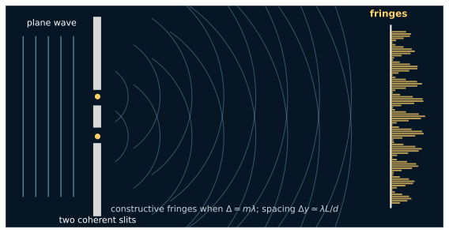

local study diagram: Young/fringe geometry. use with [Superposition and interference](../../02_Zettel/Theory/interf/Superposition and interference.md) and [Young experiment as a stellar interferometer](../../02_Zettel/Theory/interf/Young experiment as a stellar interferometer.md).

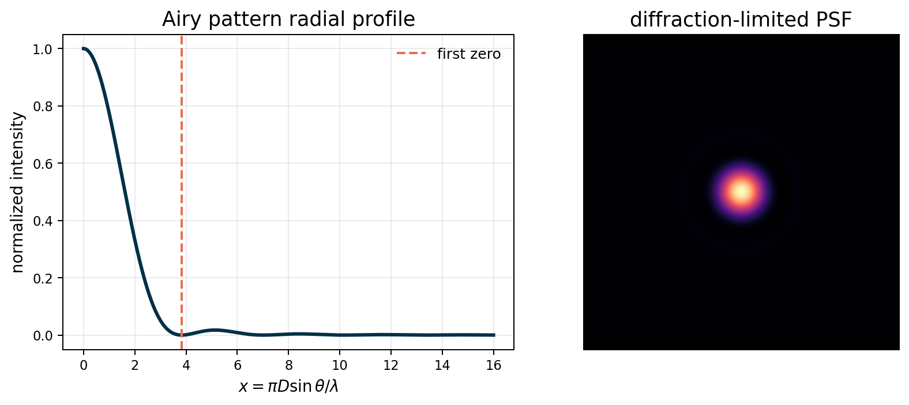

local study plot from $I(x)=[2J_1(x)/x]^2$. use with [Fraunhofer diffraction](../../02_Zettel/Theory/interf/Fraunhofer diffraction.md), [Diffraction patterns of simple apertures](../../02_Zettel/Theory/interf/Diffraction patterns of simple apertures.md), and [Point spread function](../../02_Zettel/Theory/interf/Point spread function.md).

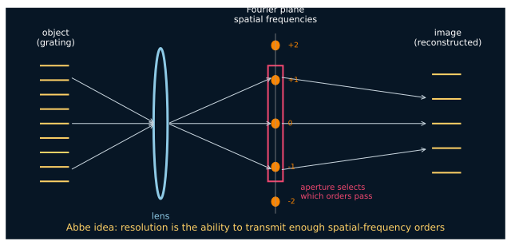

local study diagram: Abbe/Fourier-optics spatial-frequency orders. use with [Abbe experiment and Fourier optics](../../02_Zettel/Theory/interf/Abbe experiment and Fourier optics.md) and [Optical transfer function](../../02_Zettel/Theory/interf/Optical transfer function.md).

## visibility and aperture synthesis

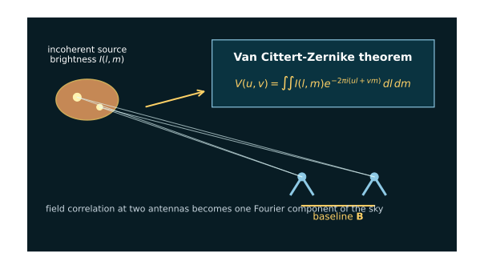

local study diagram: two antennas measure coherence, and coherence is a Fourier component of sky brightness. use with [Van Cittert-Zernike theorem](../../02_Zettel/Theory/interf/Van Cittert-Zernike theorem.md).

local synthetic demo: $(u,v)$ samples and the corresponding dirty beam. use with [The (u, v) plane](../../02_Zettel/Theory/interf/The (u, v) plane.md), [Aperture synthesis principle](../../02_Zettel/Theory/interf/Aperture synthesis principle.md), and [Dirty beam and dirty image](../../02_Zettel/Theory/interf/Dirty beam and dirty image.md).

source: S. T. Myers, NRAO Synthesis Imaging Summer School, 30 s VLA A-configuration snapshot of a gravitational lens. use with [Dirty beam and dirty image](../../02_Zettel/Theory/interf/Dirty beam and dirty image.md) and [CLEAN algorithm](../../02_Zettel/Theory/interf/CLEAN algorithm.md).

## radio signal chain and sensitivity

local study diagram: $I_\nu$ to beam-weighted $S_\nu$. use with [Specific intensity and flux density](../../02_Zettel/Theory/interf/Specific intensity and flux density.md).

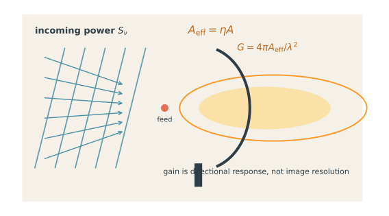

local study diagram: effective collecting area, gain, and beam response. use with [Antenna effective area and gain](../../02_Zettel/Theory/interf/Antenna effective area and gain.md).

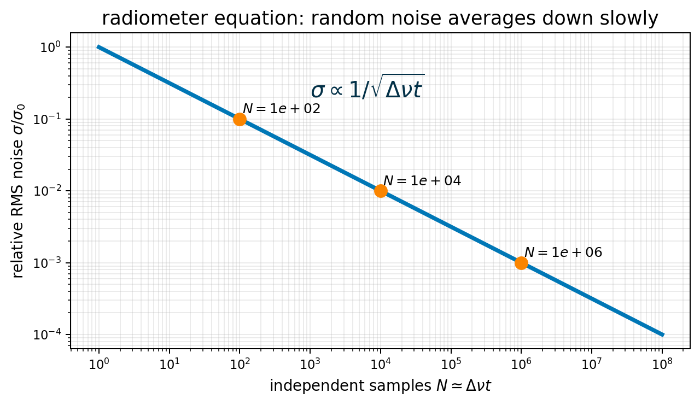

local plot: $\sigma\propto1/\sqrt{\Delta\nu t}$. use with [Radiometer equation and SEFD](../../02_Zettel/Theory/interf/Radiometer equation and SEFD.md).

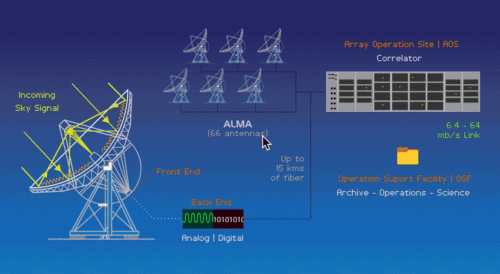

source: ALMA Observatory, "How ALMA Works". use with [Radio interferometer architecture](../../02_Zettel/Theory/interf/Radio interferometer architecture.md).

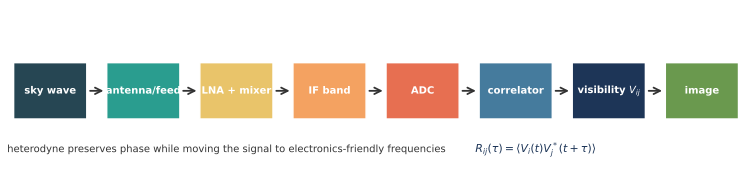

local study diagram: sky wave to visibility to image. use with [Two-element correlator](../../02_Zettel/Theory/interf/Two-element correlator.md).

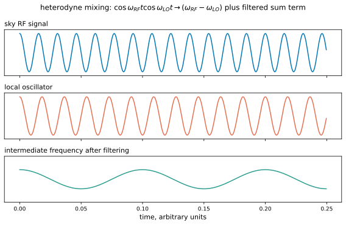

local study diagram: heterodyne mixing and intermediate frequency. use with [Downconversion of signals in radio interferometers](../../02_Zettel/Theory/interf/Downconversion of signals in radio interferometers.md).

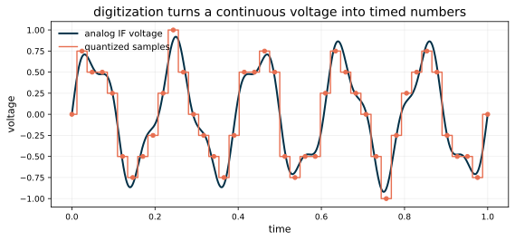

local study diagram: sampling and quantization of the IF voltage. use with [Digitization quantization and timing in radio interferometry](../../02_Zettel/Theory/interf/Digitization quantization and timing in radio interferometry.md).

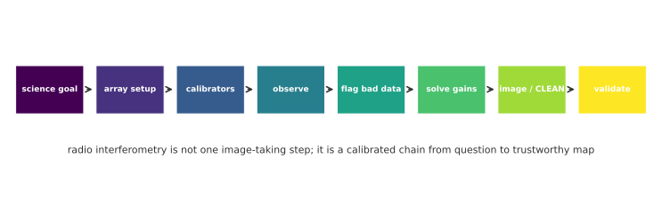

local workflow diagram: science goal to validated image. use with [Steps in radio interferometric observations](../../02_Zettel/Theory/interf/Steps in radio interferometric observations.md).

## optical instruments and VLBI science

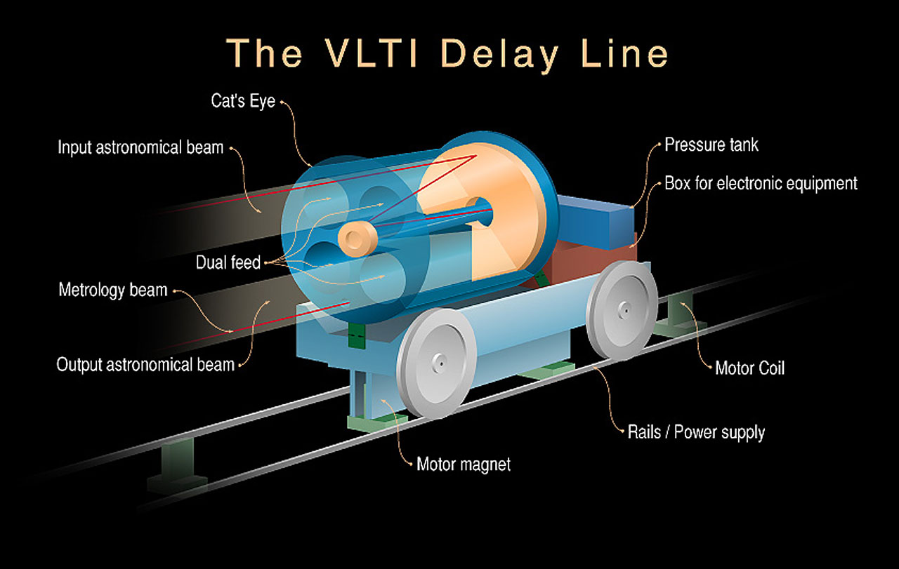

source: ESO image eso9811a. use with [Delay lines and path-length equalization](../../02_Zettel/Theory/interf/Delay lines and path-length equalization.md) and [VLTI Very Large Telescope Interferometer](../../02_Zettel/Theory/interf/VLTI Very Large Telescope Interferometer.md).

source: ESO image eso1907j. use with [Very Long Baseline Interferometry VLBI](../../02_Zettel/Theory/interf/Very Long Baseline Interferometry VLBI.md) and [Event Horizon Telescope EHT](../../02_Zettel/Theory/interf/Event Horizon Telescope EHT.md).

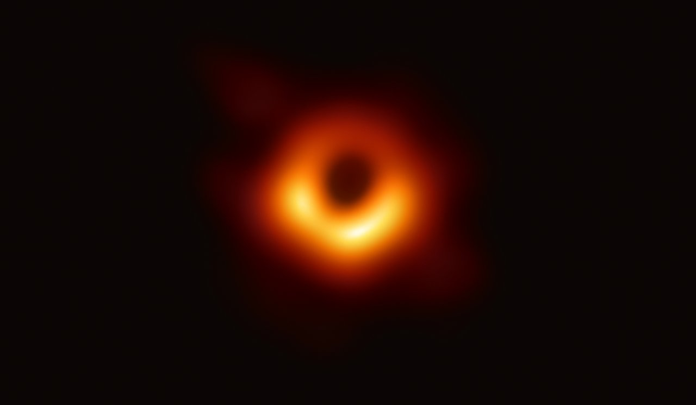

source: EHT Collaboration image hosted by ESO as eso1907a. use with [Event Horizon Telescope EHT](../../02_Zettel/Theory/interf/Event Horizon Telescope EHT.md) and [AGN and supermassive black holes](../../02_Zettel/Theory/interf/AGN and supermassive black holes.md).

## polarization and emission physics

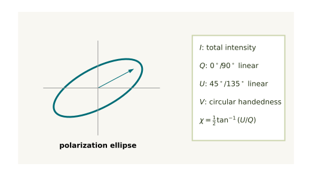

local study diagram: Stokes parameters and polarization ellipse. use with [Polarization in interferometry](../../02_Zettel/Theory/interf/Polarization in interferometry.md).

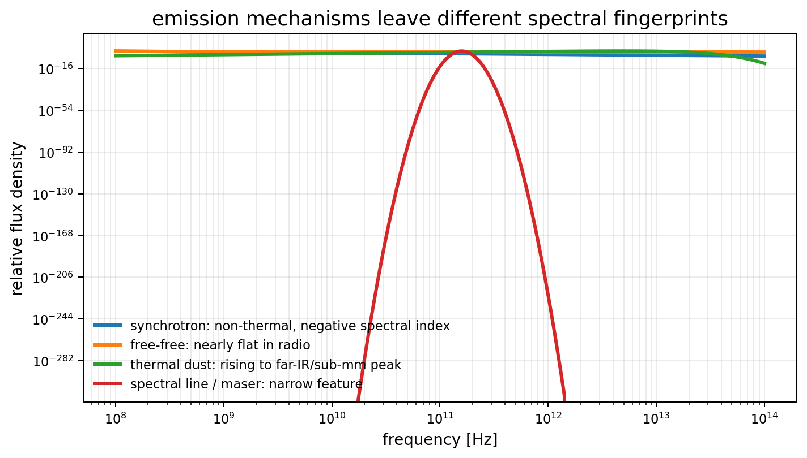

local schematic plot: synchrotron, free-free, thermal dust, and line/maser spectral fingerprints. use with [Radiation mechanisms in astronomy and interferometers](../../02_Zettel/Theory/interf/Radiation mechanisms in astronomy and interferometers.md).

## source trail

- ALMA Observatory, "How ALMA Works": https://www.almaobservatory.org/en/about-alma/how-alma-works/
- ESO, "First Image of a Black Hole" / eso1907a: https://www.eso.org/public/images/eso1907a/
- ESO, "The EHT, a Planet-Scale Array" / eso1907j: https://www.eso.org/public/images/eso1907j/
- ESO, "The VLTI Delay Line" / eso9811a: https://www.eso.org/public/images/eso9811a/
- NRAO Synthesis Imaging Summer School, S. T. Myers, snapshot imaging page: https://www.aoc.nrao.edu/~smyers/Synth2000/Synth00-21.html

## see also

- [Astronomical_Interferometry_MOC](../../00_Atlas/Astronomical_Interferometry_MOC.md)
- [Interferometry equation sheet](../../02_Zettel/Theory/interf/Interferometry equation sheet.md)
- [Aperture synthesis principle](../../02_Zettel/Theory/interf/Aperture synthesis principle.md)
- [Radio interferometer architecture](../../02_Zettel/Theory/interf/Radio interferometer architecture.md)
